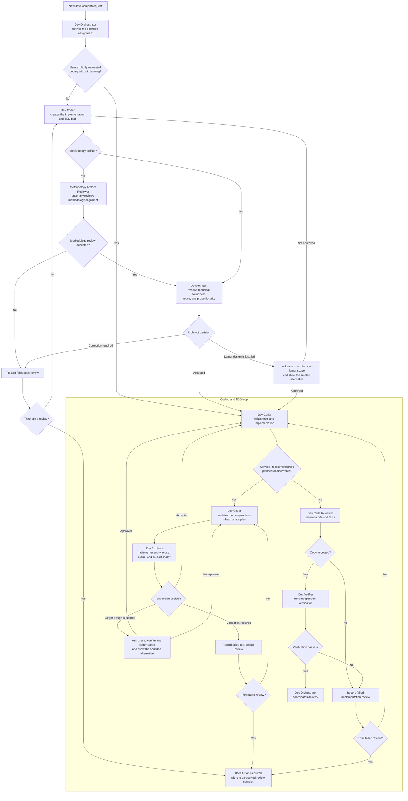

# Add Dev Architect Agent

Status: Completed

Type: Feature

Provider: file

Work Item ID: add-dev-architect-agent

Completion: main-branch

## Summary

Add a Dev Architect conceptual Agent that turns requirements into technically sound, implementable design choices, primarily for architecture documents and high-level designs.

## Context

The current catalog has no general software-architecture Agent. Dev Documentation Writer can author architecture documents and Dev Artifact Reviewer can review them, but neither role has a primary responsibility to establish that the selected technical approach correctly implements the requirements. The new role should follow Dev Coder's disciplined discovery, scoping, verification, and clean-candidate workflow while producing technical design decisions rather than production code.

## Source Evidence

The user requested on 2026-08-10 in task 019fb057-1767-7ef2-b5fa-41f4417b20b3: “create it like a Dev Coder but its goal is to ensure choices make technical sense and are a proper way of implementing the requirements. It will normally be used for architecture documents and high-level designs. It will use XHigh reasoning. Create a work item for this.” The user further directed that Dev Architect review every Dev Coder plan unless the user explicitly requests coding without planning, review complex test infrastructure planned or discovered during coding, and use a general three-failed-reviews rule. Methodology Artifact Reviewer remains an optional additional review when the created artifact is a methodology artifact. The user then requested that this work item update the other Agents and skills needed to implement the process and update the HTML documentation with an SVG of the orchestration process.

## Requirements

- Add the conceptual role dev-architect under the Dev Activities role group.
- Update Dev Coder to create the bounded implementation and TDD plan, respond to Dev Architect findings, and pause to update the plan before introducing substantial custom test infrastructure discovered during coding.
- Update Dev Orchestrator to own plan-to-assignment alignment, the user-directed coding-without-planning shortcut, Dev Architect dispatch, optional Methodology Artifact Reviewer dispatch for methodology artifacts, correction-count enforcement, and User Action Required escalation after the third failed review.
- Update Dev Documentation Writer so architecture and high-level-design prose follows accepted Dev Architect technical decisions while the writer retains document structure, source use, and prose quality.
- Give Dev Architect a Dev Coder-like workflow for scoped discovery, requirements traceability, repository-pattern inspection, focused validation, clean candidate commits, and bounded correction handoff.
- Make Dev Architect responsible for selecting and explaining technically sound, implementable approaches that satisfy the stated requirements and constraints.
- Route architecture documents and high-level designs to Dev Architect when their technical choices require creation or material revision.
- Route every Dev Coder implementation plan through Dev Architect before coding unless the user explicitly directs the task to code without planning.
- When the planned output is a methodology artifact, permit Dev Orchestrator to add Methodology Artifact Reviewer as a separate methodology-conformance review without replacing Dev Architect's technical review.
- Keep document prose quality and template conformance with Dev Documentation Writer, and keep independent artifact review with Dev Artifact Reviewer.
- Prevent Dev Architect from silently expanding requirements, implementing unrelated production code, or presenting an unverified preference as an architectural decision.
- Make Dev Architect review coding plans for proportionality, unnecessary custom infrastructure, and reimplementation of mature software that could be used directly.
- Require Dev Architect to identify the smallest approach that satisfies the requirements and compare materially larger proposals against it.
- When a larger design appears technically justified, require Dev Architect to stop and ask the user to confirm the expanded scale after explaining the smaller alternative and practical cost difference. When the Coder merely proposes an outsized design without justification, return it for correction instead of escalating immediately.
- Route complex test infrastructure, including substantial helpers, simulators, fake services, harnesses, runners, or test stubs, through Dev Architect when it is planned or discovered during coding and before that infrastructure is implemented.
- Keep ordinary unit tests, small local fixtures, and routine TDD helpers inside the normal Dev Coder implementation loop without a separate architectural gate.
- Require Dev Architect to block test infrastructure whose scope is disproportionate to the behavior under test, including broad service simulators such as a custom GitHub simulator when focused fixtures, mocks, adapters, or an existing tool can prove the required behavior.
- Permit an ambitious plan or test helper only after the user explicitly confirms the scale with the proportionality evidence visible; do not infer approval from the original implementation request alone.
- Apply one general Dev Orchestrator review-loop limit: the initial submission may receive at most two correction retries; a third failed review moves the Work Item to User Action Required with the unresolved review issue and one concrete user decision.
- Apply the same three-failed-reviews rule to Dev Architect, Methodology Artifact Reviewer, Dev Code Reviewer, and other Dev Orchestrator-managed review loops rather than cycling indefinitely.
- Update route-documentation-work, create-architecture, and create-high-level-design so planned architecture and high-level-design work uses Dev Architect for material technical decisions without transferring document-writing responsibility.
- Update test-driven-development so ordinary tests and routine fixtures remain in the coding loop, while substantial custom helpers, service simulators, harnesses, runners, or equivalent test infrastructure pause for a Dev Architect plan review before implementation.
- Do not duplicate the existing simplicity rules in careful-coding; use those rules as an input to Dev Architect proportionality review.
- Add an architecture semantic model profile that maps to XHigh reasoning in Codex and to the closest explicitly supported high-capability setting in other adapters.
- Add materially distinct success and blocked examples, including insufficient requirements or unresolved technical constraints.
- Add focused positive and boundary evaluation coverage for the role and its routing.
- Regenerate all supported native Agent configurations and repository-owned role documentation from canonical sources.
- Update design/orchestrated-development-lifecycle.html to explain the complete planning, architectural review, optional methodology review, coding, complex-test-infrastructure, implementation review, verification, correction-limit, and User Action Required flow.
- Add design/development-orchestration-process.svg as a directly maintained, accessible visualization of the same process and include it in the lifecycle HTML. Keep the SVG simple and static; do not introduce a custom diagram generator solely for this asset.

## Planned Workflow

## Acceptance Criteria

- The role catalog contains dev-architect with repository mutation, skills, instructions, examples, dependencies, and output contracts valid under role schema version 8.
- The Codex Dev Architect generated Agent configuration uses XHigh reasoning.
- Dev Architect traces each material technical choice to requirements, constraints, repository evidence, or an explicitly stated assumption.
- Dev Architect reports when a plan duplicates existing complex software or adds infrastructure beyond what the acceptance criteria require.
- A disproportionate coding plan produces a concise user confirmation request that states the smaller viable approach and the additional scope being proposed.
- An unjustified outsized plan returns to Dev Coder for correction; it reaches the user only if Dev Architect considers the larger design justified or the third review fails.
- A complex test-infrastructure proposal cannot enter implementation until Dev Architect accepts its proportionality or the user explicitly approves the documented larger scope.
- Ordinary tests and routine TDD helpers do not trigger a separate Dev Architect review.
- Focused orchestration coverage proves that initial review plus two failed correction retries results in User Action Required on the third failed review.
- Focused evaluation demonstrates rejection of an inordinately ambitious service simulator in favor of a bounded testing approach.
- Architecture and high-level-design workflows can route technical design work to Dev Architect without replacing Dev Documentation Writer or Dev Artifact Reviewer.
- Dev Coder and Dev Orchestrator definitions implement the plan-review, coding-without-planning, complex-test-infrastructure, and three-failed-reviews paths shown in the planned workflow.
- route-documentation-work, create-architecture, create-high-level-design, and test-driven-development describe the same responsibility boundaries without introducing a second orchestration process.
- Focused evaluation proves both a technically justified design outcome and a safe blocked outcome when the available requirements cannot support a responsible choice.
- design/orchestrated-development-lifecycle.html contains a concise Dev Architect section and presents the complete orchestration flow without requiring the reader to infer it from role definitions.
- design/development-orchestration-process.svg matches the planned workflow, includes an accessible title and description, labels decision outcomes, remains legible at narrow widths and zoom, and has an equivalent concise text explanation in the HTML page.
- Generated harness-specific files, role documentation, evaluation output, hierarchy artifacts, and support-checklist output are current.
- Focused role, model-profile, generation, evaluation-catalog, and bundle checks pass.

## Dependencies

None.

## Verification

- Validate the new conceptual role against agents/role-schema.yaml.
- Run focused model-profile, role-generation, routing, mutation-policy, evaluation-catalog, and bundle contract tests.
- Validate the lifecycle HTML and orchestration SVG with focused markup, accessibility-label, link, and workflow-content assertions in the existing documentation test surface.
- Run repository-authorized generators in write mode, followed by their freshness checks.
- Run git diff --check.

## Open Questions

Resolve the closest supported non-Codex adapter mappings from each adapter's documented model and effort capabilities without weakening the required Codex XHigh setting.

## Governed Definition Approval

### Governed Canonical Sources

- agents/roles/dev-activities/dev-architect.role.yaml
- agents/roles/dev-activities/dev-coder.role.yaml
- agents/roles/dev-activities/dev-documentation-writer.role.yaml
- agents/roles/dev-activities/dev-orchestrator.role.yaml
- skills/create-architecture/SKILL.md
- skills/create-high-level-design/SKILL.md
- skills/route-documentation-work/SKILL.md
- skills/test-driven-development/SKILL.md

### Allowed Dependent Artifacts

- agents/model-profiles.yaml
- adapters/claude/model-profiles.yaml
- adapters/codex/model-profiles.yaml
- adapters/gemini/model-profiles.yaml
- adapters/junie/model-profiles.yaml
- README.md
- design/development-orchestration-process.svg
- design/orchestrated-development-lifecycle.html
- evals/agent-scenarios.yaml
- evals/cases.yaml
- evals/workflow-packs.yaml
- scripts/test_bundle_content.py
- scripts/test_role_mutation_policy.py
- design/agent-skill-hierarchy.svg
- design/agent-skill-test-coverage-checklist.md
- design/generated/role-definitions.js
- generated/adapters/agent-generation-manifest.json
- Generated Agent configurations owned by scripts/build-skill-docs.py.
- Generator-owned evaluation, hierarchy, and support-checklist files affected by the new role and scenarios.

### Approval Resolution

Approved at creation and expanded by the user's quoted 2026-08-10 requests in task 019fb057-1767-7ef2-b5fa-41f4417b20b3. Approval is limited to the Dev Architect role, Dev Coder, Dev Orchestrator, Dev Documentation Writer, the four named workflow skills, the architecture model profile, the lifecycle HTML and orchestration SVG, focused evaluation and contract coverage, and their repository-authorized generated files.

## Starting Handoff Evidence

Starting Recorded At: 2026-08-11T04:14:42Z

Coordinator: Dev Backlog Coordinator task 019fb057-1767-7ef2-b5fa-41f4417b20b3

Normalized Objective: Add Dev Architect and the bounded plan-review workflow using existing test infrastructure only, then update the lifecycle documentation and static SVG.

Temporary Test Infrastructure Boundary: Until Dev Architect is active, do not create, expand, or harden shared test runners, harnesses, testing frameworks, generic helpers, simulators, or substitute infrastructure. Use existing focused tests; stop for a Coordinator decision if they cannot validate the approved outcome.

Canonical Execution: task 019fb057-1767-7ef2-b5fa-41f4417b20b3

Next Reconciliation At: 2026-08-11T04:29:42Z

Intended Root Role: Dev Orchestrator

## Running Evidence

Running Recorded At: 2026-08-11T04:17:00Z

Owner: Dev Orchestrator

Canonical Conversation: task 019fb057-1767-7ef2-b5fa-41f4417b20b3

Root Agent Task: 019fb057-1767-7ef2-b5fa-41f4417b20b3

Branch: codex/add-dev-architect-agent-019fb057

Worktree: /Users/martinbechard/.codex/worktrees/4e17/dev-methodology

Phase: implementation discovery and bounded assignment

Accepted Execution Evidence: The delegated canonical Root Dev Orchestrator accepted the Starting handoff, created the task-owned implementation branch from commit 12322e72c393045da5fb2d0ae6c3ace796cfeaf5, and accepted the temporary existing-test-only infrastructure boundary.

## Completion Evidence

Completed At: 2026-08-11T06:39:00Z

Completion Disposition: READY

Accepted Source Commit: e776f55055c50901beb408aee2d908b8039abae7

Integration Commit: c912d31b194c139e9106823d2a4b0be7dc66ce3a

Source-To-Integration Mapping: The accepted source commit was cherry-picked without conflict onto current main 12f6d22c29b01554ccba1fc9d002cb9b50a04341. Source and integration patches have the identical stable patch ID 60a955247f42223f8df5cd7b1defd2b3423aa038.

Independent Review: Dev Code Reviewer and Methodology Artifact Reviewer both accepted the final candidate after the initial review and two bounded correction retries. The final reviews reported no required corrections.

Source Verification: Fresh Dev Verifier evidence passed four focused role, model, routing, lifecycle, and mutation tests; Dev Architect and Dev Orchestrator suite validation and listing; 32 Dev Orchestrator fixture tests; four generator freshness checks; seven historical provenance validations; terminology checks; SVG topology and accessibility assertions; git diff checks; and clean-worktree checks.

Post-Integration Verification: On main at c912d31b194c139e9106823d2a4b0be7dc66ce3a, four integration-sensitive role, model, routing, lifecycle, and mutation tests passed under Python 3.11; both Agent suites validated; all four affected generator checks were current; seven governed documents passed historical provenance validation; git diff --check passed; and the primary worktree was clean.

Scoped Omissions: No live-model evaluation or unrelated broad test suite was run. Deterministic suite validation, fixture execution, generated-file freshness, XML and topology assertions, provenance validation, and focused contract tests satisfy the approved verification boundary.

Main Observation: Configured main is clean at c912d31b194c139e9106823d2a4b0be7dc66ce3a. The integration commit is the observed main tip and is an ancestor of main. The accepted source commit is a non-ancestral replay whose patch is content-equivalent by stable patch ID. No integration residue remains.

Remote Observation: No remote publication requirement was configured for this local main-branch completion.

Claim Evidence: The exact work-item outcome claim and primary project-files integration claim were acquired without conflict. The integration claim and outcome-work claim were released at their handoff boundaries; the terminal provider update and exact source/archive path claims protect this status-and-archive transaction.

Archive Path: backlog/completed-backlog/features/add-dev-architect-agent.md

Terminal Backlog Commit: The Git commit containing this status-and-archive transaction is the terminal provider transaction.
