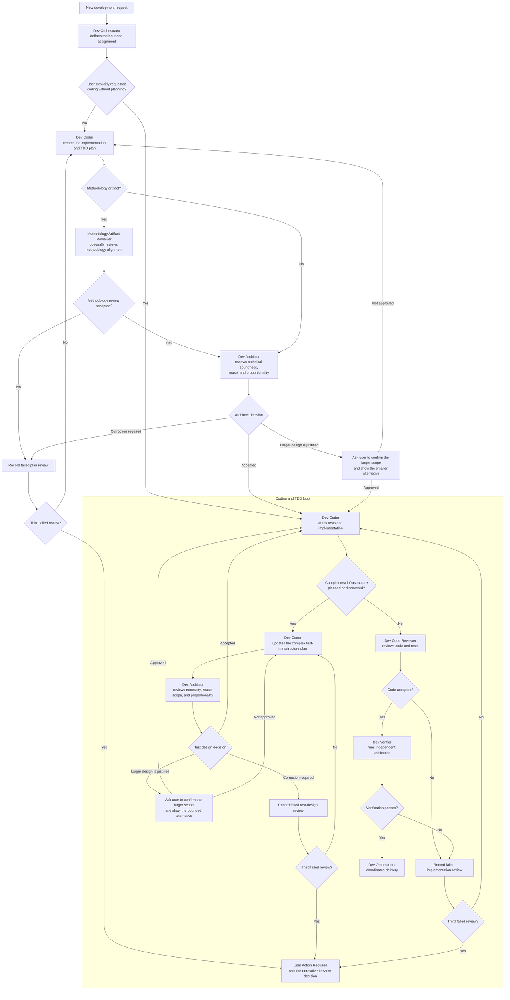

# Add Dev Architect Agent

Status: Ready

Type: Feature

Provider: file

Work Item ID: add-dev-architect-agent

Completion: main-branch

## Summary

Add a Dev Architect conceptual Agent that turns requirements into technically sound, implementable design choices, primarily for architecture documents and high-level designs.

## Context

The current catalog has no general software-architecture Agent. Dev Documentation Writer can author architecture documents and Dev Artifact Reviewer can review them, but neither role has a primary responsibility to establish that the selected technical approach correctly implements the requirements. The new role should follow Dev Coder's disciplined discovery, scoping, verification, and clean-candidate workflow while producing technical design decisions rather than production code.

## Source Evidence

The user requested on 2026-08-10 in task 019fb057-1767-7ef2-b5fa-41f4417b20b3: “create it like a Dev Coder but its goal is to ensure choices make technical sense and are a proper way of implementing the requirements. It will normally be used for architecture documents and high-level designs. It will use XHigh reasoning. Create a work item for this.” The user further directed that Dev Architect review every Dev Coder plan unless the user explicitly requests coding without planning, review complex test infrastructure planned or discovered during coding, and use a general three-failed-reviews rule. Methodology Artifact Reviewer remains an optional additional review when the created artifact is a methodology artifact.

## Requirements

- Add the conceptual role dev-architect under the Dev Activities role group.
- Give Dev Architect a Dev Coder-like workflow for scoped discovery, requirements traceability, repository-pattern inspection, focused validation, clean candidate commits, and bounded correction handoff.
- Make Dev Architect responsible for selecting and explaining technically sound, implementable approaches that satisfy the stated requirements and constraints.
- Route architecture documents and high-level designs to Dev Architect when their technical choices require creation or material revision.
- Route every Dev Coder implementation plan through Dev Architect before coding unless the user explicitly directs the task to code without planning.
- When the planned output is a methodology artifact, permit Dev Orchestrator to add Methodology Artifact Reviewer as a separate methodology-conformance review without replacing Dev Architect's technical review.
- Keep document prose quality and template conformance with Dev Documentation Writer, and keep independent artifact review with Dev Artifact Reviewer.
- Prevent Dev Architect from silently expanding requirements, implementing unrelated production code, or presenting an unverified preference as an architectural decision.
- Make Dev Architect review coding plans for proportionality, unnecessary custom infrastructure, and reimplementation of mature software that could be used directly.
- Require Dev Architect to identify the smallest approach that satisfies the requirements and compare materially larger proposals against it.
- When a larger design appears technically justified, require Dev Architect to stop and ask the user to confirm the expanded scale after explaining the smaller alternative and practical cost difference. When the Coder merely proposes an outsized design without justification, return it for correction instead of escalating immediately.
- Route complex test infrastructure, including substantial helpers, simulators, fake services, harnesses, runners, or test stubs, through Dev Architect when it is planned or discovered during coding and before that infrastructure is implemented.
- Keep ordinary unit tests, small local fixtures, and routine TDD helpers inside the normal Dev Coder implementation loop without a separate architectural gate.
- Require Dev Architect to block test infrastructure whose scope is disproportionate to the behavior under test, including broad service simulators such as a custom GitHub simulator when focused fixtures, mocks, adapters, or an existing tool can prove the required behavior.
- Permit an ambitious plan or test helper only after the user explicitly confirms the scale with the proportionality evidence visible; do not infer approval from the original implementation request alone.
- Apply one general Dev Orchestrator review-loop limit: the initial submission may receive at most two correction retries; a third failed review moves the Work Item to User Action Required with the unresolved review issue and one concrete user decision.
- Apply the same three-failed-reviews rule to Dev Architect, Methodology Artifact Reviewer, Dev Code Reviewer, and other Dev Orchestrator-managed review loops rather than cycling indefinitely.
- Add an architecture semantic model profile that maps to XHigh reasoning in Codex and to the closest explicitly supported high-capability setting in other adapters.
- Add materially distinct success and blocked examples, including insufficient requirements or unresolved technical constraints.
- Add focused positive and boundary evaluation coverage for the role and its routing.
- Regenerate all supported native Agent projections and repository-owned role documentation from canonical sources.

## Planned Workflow

## Acceptance Criteria

- The role catalog contains dev-architect with repository mutation, skills, instructions, examples, dependencies, and output contracts valid under role schema version 8.
- The Codex Dev Architect projection uses XHigh reasoning.
- Dev Architect traces each material technical choice to requirements, constraints, repository evidence, or an explicitly stated assumption.
- Dev Architect reports when a plan duplicates existing complex software or adds infrastructure beyond what the acceptance criteria require.
- A disproportionate coding plan produces a concise user confirmation request that states the smaller viable approach and the additional scope being proposed.
- An unjustified outsized plan returns to Dev Coder for correction; it reaches the user only if Dev Architect considers the larger design justified or the third review fails.
- A complex test-infrastructure proposal cannot enter implementation until Dev Architect accepts its proportionality or the user explicitly approves the documented larger scope.
- Ordinary tests and routine TDD helpers do not trigger a separate Dev Architect review.
- Focused orchestration coverage proves that initial review plus two failed correction retries results in User Action Required on the third failed review.
- Focused evaluation demonstrates rejection of an inordinately ambitious service simulator in favor of a bounded testing approach.
- Architecture and high-level-design workflows can route technical design work to Dev Architect without replacing Dev Documentation Writer or Dev Artifact Reviewer.
- Focused evaluation proves both a technically justified design outcome and a safe blocked outcome when the available requirements cannot support a responsible choice.
- Generated adapters, role documentation, evaluation projections, hierarchy artifacts, and support-checklist projections are current.
- Focused role, model-profile, generation, evaluation-catalog, and bundle checks pass.

## Dependencies

None.

## Verification

- Validate the new conceptual role against agents/role-schema.yaml.
- Run focused model-profile, role-generation, routing, mutation-policy, evaluation-catalog, and bundle contract tests.
- Run repository-authorized generators in write mode, followed by their freshness checks.
- Run git diff --check.

## Open Questions

Resolve the closest supported non-Codex adapter mappings from each adapter's documented model and effort capabilities without weakening the required Codex XHigh setting.

## Governed Definition Approval

### Governed Canonical Sources

- agents/roles/dev-activities/dev-architect.role.yaml
- agents/roles/dev-activities/dev-documentation-writer.role.yaml
- agents/roles/dev-activities/dev-orchestrator.role.yaml

### Allowed Dependent Artifacts

- agents/model-profiles.yaml
- adapters/claude/model-profiles.yaml
- adapters/codex/model-profiles.yaml
- adapters/gemini/model-profiles.yaml
- adapters/junie/model-profiles.yaml
- README.md
- evals/agent-scenarios.yaml
- evals/cases.yaml
- evals/workflow-packs.yaml
- scripts/test_bundle_content.py
- scripts/test_role_mutation_policy.py
- design/agent-skill-hierarchy.svg
- design/agent-skill-test-coverage-checklist.md
- design/generated/role-definitions.js
- generated/adapters/agent-generation-manifest.json
- Generated native Agent projections owned by scripts/build-skill-docs.py.
- Generator-owned evaluation, hierarchy, and support-checklist projections affected by the new role and scenarios.

### Approval Resolution

Approved at creation by the user's quoted 2026-08-10 request in task 019fb057-1767-7ef2-b5fa-41f4417b20b3. Approval is limited to the Dev Architect role, the exact routing roles, the architecture model profile, focused evaluation and contract coverage, and their repository-authorized generated projections.
