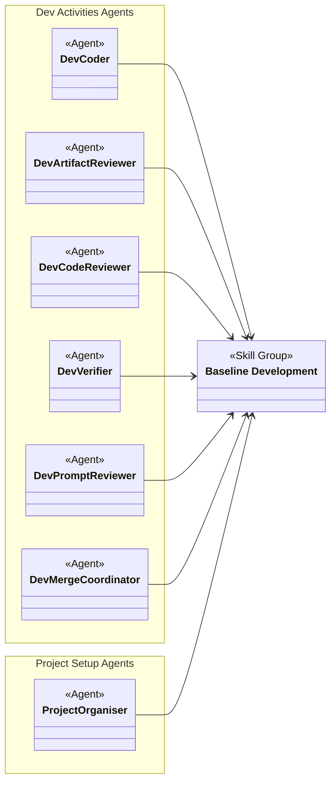
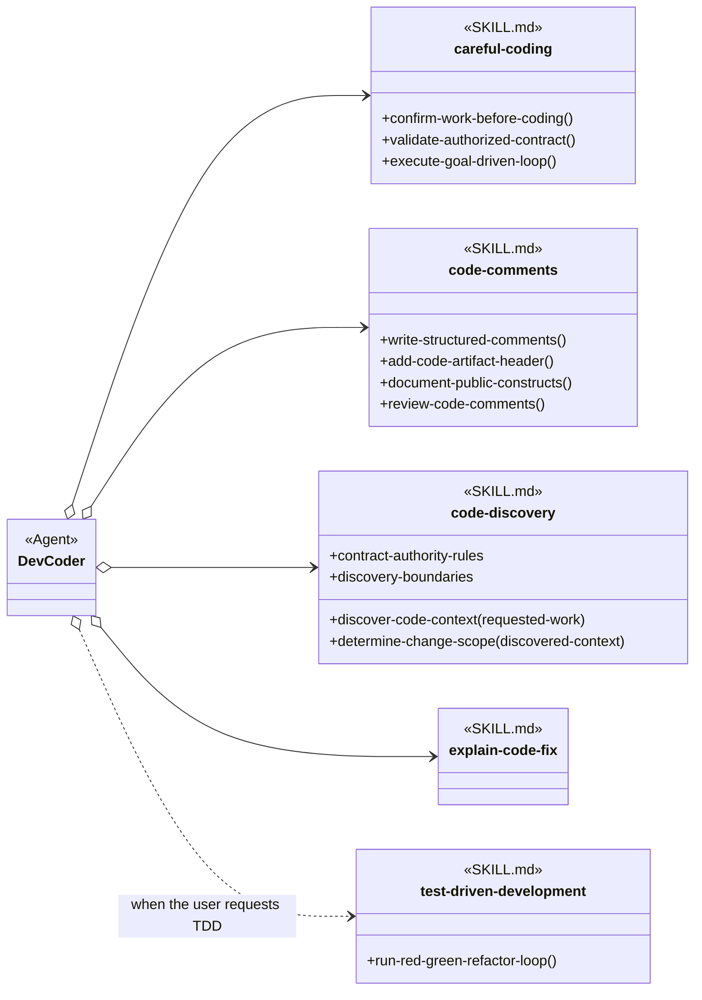
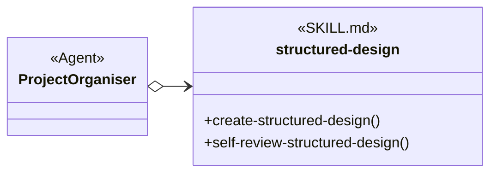
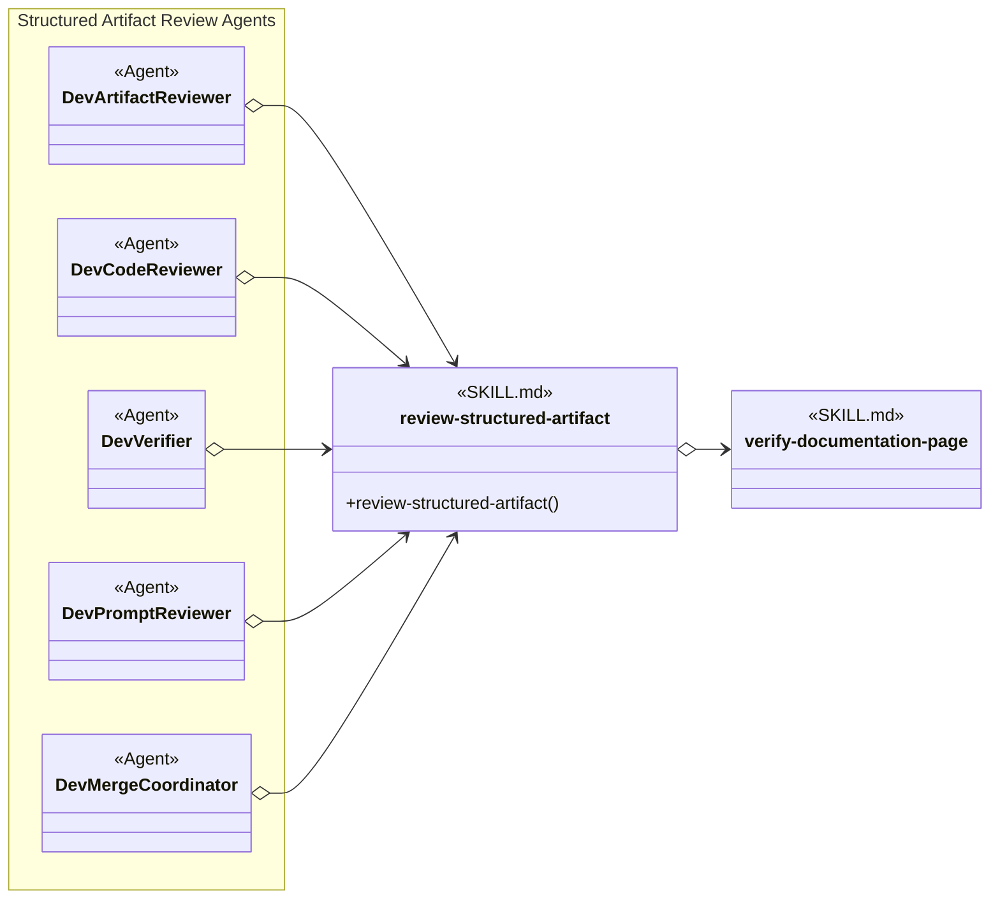
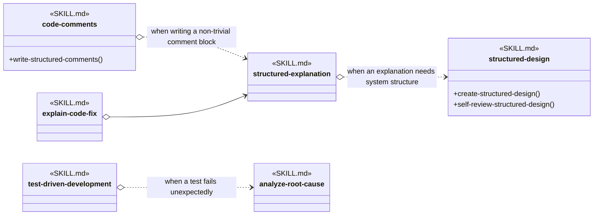

# Baseline Development Skill Group

## Scope

Baseline Development contains practices that Agent definitions load by exact skill name across implementation, design, and review work.

Skills whose applicability rule is shared by every Agent are modeled separately in [General Agent Skills](general-agent-skills.md).

The applied-model conventions are defined in [Object-Oriented Skill Group Models](../object-oriented-skill-group-models.md#2-applied-model-legend).

## Design

Baseline Development supplies practices used across coding, project organization, review, and verification. The overall view shows the participating Agents and the shared Skill Group before the scenario views expand their exact skill dependencies.

### Overall Agent And Skill Group Dependencies

The overall view identifies the Agents that rely on Baseline Development without expanding the seven skills inside the group.

### Scenario: Coding A Change

This scenario shows the Baseline Development skills that Dev Coder loads for every implementation and those added only when the requested work requires them.

### Scenario: Designing Project Structure

This scenario shows the Baseline Development skill that Project Organiser uses to keep placement decisions consistent with the project’s overall structure. General file-placement and explanation dependencies are defined once in [General Agent Skills](general-agent-skills.md).

### Scenario: Reviewing A Structured Artifact

This scenario shows the shared review skill loaded by five Dev Activities reviewers and the page verifier it uses for document-level checks.

### Scenario: A Baseline Skill Needs Supporting Guidance

This scenario shows dependencies owned by Baseline Development skills themselves. A solid open-diamond relationship is always loaded by the referencing skill; a dotted relationship is loaded only under its stated condition.

The scenario views include the complete Baseline Development membership across their skill nodes. `structured-explanation` appears only as a cross-group dependency of Baseline skills; it belongs to General Agent Skills. Multi-operation skills expose the procedure headings relevant to their consumers, while a single-operation skill can use its skill identity as the operation.

## Skill Responsibilities

The group combines exact-name Agent Skills with explicit procedure boundaries for skills that contain several related operations.

| Skill | Public procedures or identity | Responsibility |
| --- | --- | --- |
| careful-coding | Confirm Work Before Coding; Validate Authorized Contract; Execute Goal-Driven Loop | Keeps implementation assumptions, contracts, scope, and verification explicit. |
| code-comments | Write Structured Comments; Add Code Artifact Header; Document Public Constructs; Review Code Comments | Creates and reviews code comments, required headers, and public API documentation. |
| code-discovery | Discover Code Context; Determine Change Scope | Gathers repository evidence and turns it into the smallest justified change or review boundary. Contract Authority and Boundaries remain shared data for both procedures. |
| test-driven-development | Run Red-Green-Refactor Loop | Guides implementation through executable failing and passing behavior. |
| structured-design | Create Structured Design; Self-Review Structured Design | Creates structured design artifacts and checks them against the same design contract. |
| review-structured-artifact | Review Structured Artifact | Reviews structured artifacts through checklist-backed evidence and findings. |
| explain-code-fix | Explain Code Fix | Explains a completed code change and classifies the nature of the fix. |

## Authoritative Inputs

The relationships and procedure boundaries are grounded in these Agent and skill definitions.

- [Dev Coder](../../agents/roles/dev-activities/dev-coder.role.yaml)
- [Project Organiser](../../agents/roles/project-setup/project-organiser.role.yaml)
- [Dev Artifact Reviewer](../../agents/roles/dev-activities/dev-artifact-reviewer.role.yaml)
- [Dev Code Reviewer](../../agents/roles/dev-activities/dev-code-reviewer.role.yaml)
- [Dev Verifier](../../agents/roles/dev-activities/dev-verifier.role.yaml)
- [Dev Prompt Reviewer](../../agents/roles/dev-activities/dev-prompt-reviewer.role.yaml)
- [Dev Merge Coordinator](../../agents/roles/dev-activities/dev-merge-coordinator.role.yaml)
- [Careful Coding](../../skills/careful-coding/SKILL.md)
- [Code Comments](../../skills/code-comments/SKILL.md)
- [Code Discovery](../../skills/code-discovery/SKILL.md)
- [Test-Driven Development](../../skills/test-driven-development/SKILL.md)
- [Structured Design](../../skills/structured-design/SKILL.md)
- [General Agent Skills](general-agent-skills.md)
- [Review Structured Artifact](../../skills/review-structured-artifact/SKILL.md)
- [Explain Code Fix](../../skills/explain-code-fix/SKILL.md)
- [Verify Documentation Page](../../skills/verify-documentation-page/SKILL.md)
- [Analyze Root Cause](../../skills/analyze-root-cause/SKILL.md)
