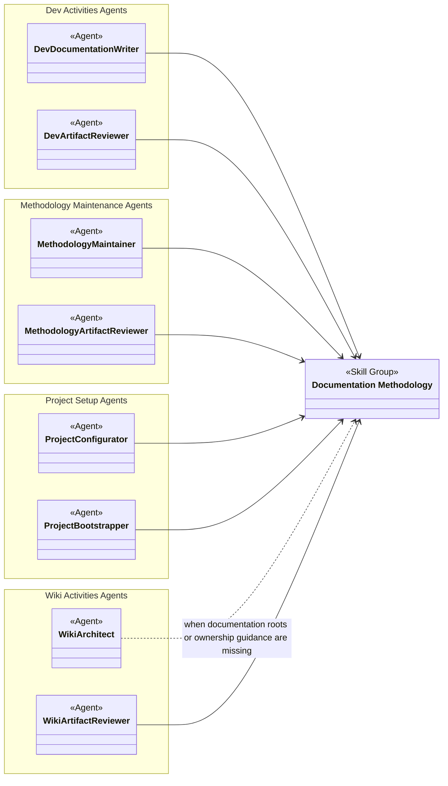
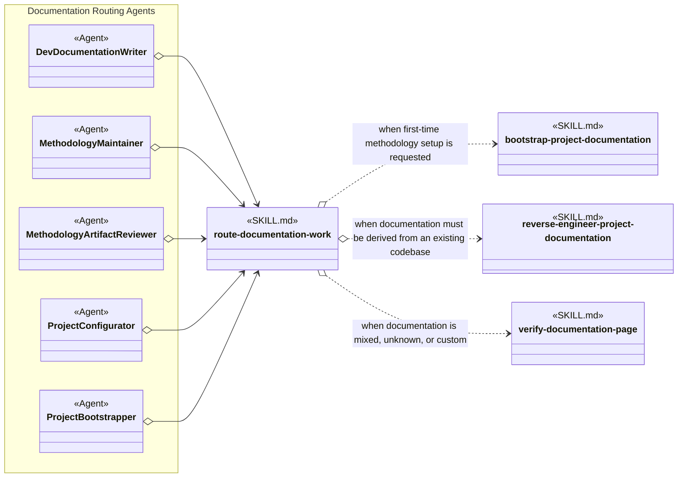
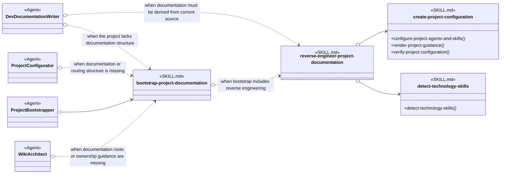
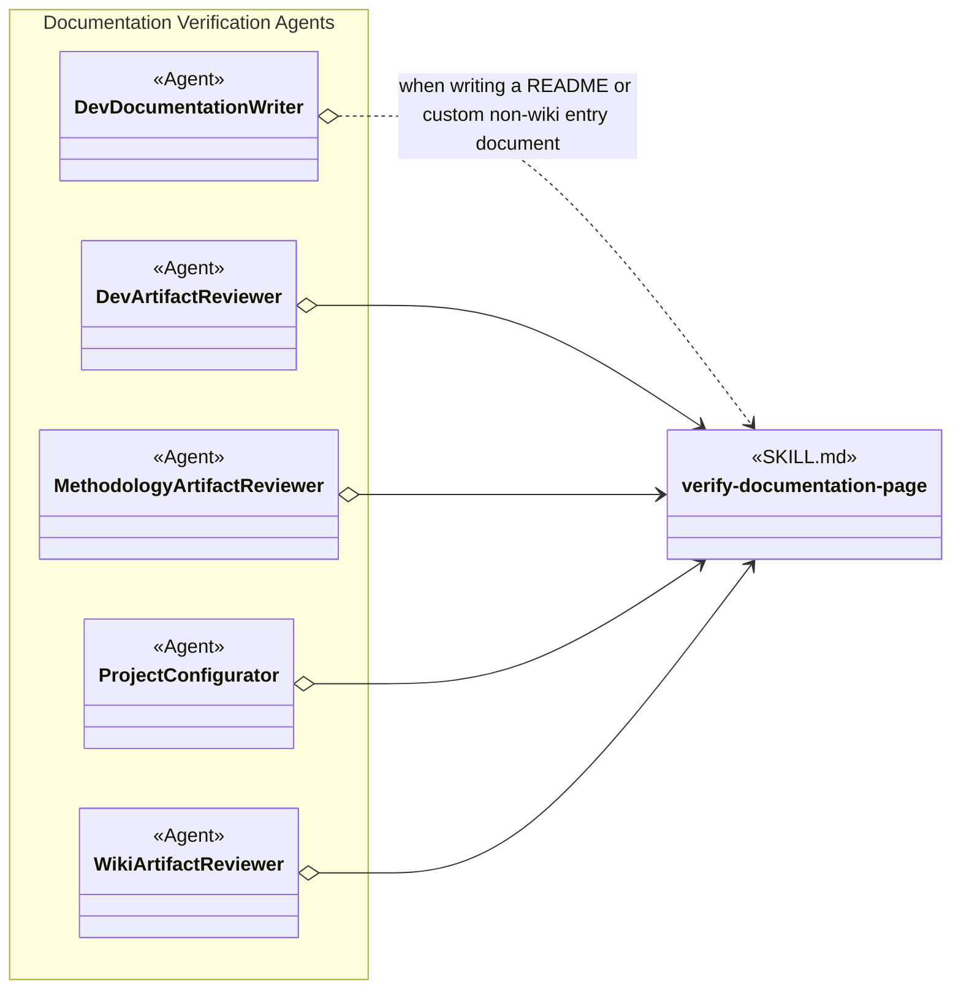

# Documentation Methodology Skill Group

## Scope

Documentation Methodology contains the documentation router, setup procedure, whole-project reverse-engineering procedure, and shared page verifier. Project Setup, methodology-maintenance, development, and wiki Agents load these skills by exact name.

The applied-model conventions are defined in [Object-Oriented Skill Group Models](../object-oriented-skill-group-models.md#2-applied-model-legend).

The [General Agent Skills](general-agent-skills.md) cross-cutting view explains the universal and project-wide conditional skills available to all Agents; this capability design does not repeat them.

## Design

Documentation Methodology supplies four complementary procedures used by several Agent groups. The overall view identifies those consumers; the scenario views show routing, bootstrap and reverse engineering, and page verification separately.

### Overall Agent And Skill Group Dependencies

The overall view shows which Agent groups use Documentation Methodology without expanding every skill-level condition.

### Scenario: Routing Documentation Work

This scenario shows the Agents that always load route-documentation-work and the documentation procedures that the router selects under specific conditions.

### Scenario: Bootstrapping Or Reverse Engineering Documentation

This scenario distinguishes establishing documentation structure from deriving documentation from an existing project. Agents select either procedure according to the state of the target documentation, and bootstrap can invoke reverse engineering when the requested setup includes source-derived coverage.

### Scenario: Verifying A Documentation Page

This scenario shows the Agents that use the shared page verifier when a document needs a general page-level contract in addition to, or instead of, an artifact-specific review.

## Skill Responsibilities

Each skill describes one dominant documentation procedure, so its skill identity also serves as its public operation name.

| Skill | Responsibility |
| --- | --- |
| route-documentation-work | Selects the correct documentation creation, review, setup, or reverse-engineering route. |
| bootstrap-project-documentation | Establishes the selected documentation roots, templates, and project guidance. |
| reverse-engineer-project-documentation | Derives and reconciles a complete source-backed documentation hierarchy from an existing codebase. |
| verify-documentation-page | Verifies mixed, custom, or shared documentation concerns that lack a more specific review skill. |

## Authoritative Inputs

The relationships are grounded in these Agent and skill definitions.

- [Dev Documentation Writer](../../agents/roles/dev-activities/dev-documentation-writer.role.yaml)
- [Dev Artifact Reviewer](../../agents/roles/dev-activities/dev-artifact-reviewer.role.yaml)
- [Methodology Maintainer](../../agents/roles/methodology-maintenance/methodology-maintainer.role.yaml)
- [Methodology Artifact Reviewer](../../agents/roles/methodology-maintenance/methodology-artifact-reviewer.role.yaml)
- [Project Configurator](../../agents/roles/project-setup/project-configurator.role.yaml)
- [Project Bootstrapper](../../agents/roles/project-setup/project-bootstrapper.role.yaml)
- [Wiki Architect](../../agents/roles/wiki-activities/wiki-architect.role.yaml)
- [Wiki Artifact Reviewer](../../agents/roles/wiki-activities/wiki-artifact-reviewer.role.yaml)
- [Route Documentation Work](../../skills/route-documentation-work/SKILL.md)
- [Bootstrap Project Documentation](../../skills/bootstrap-project-documentation/SKILL.md)
- [Reverse Engineer Project Documentation](../../skills/reverse-engineer-project-documentation/SKILL.md)
- [Verify Documentation Page](../../skills/verify-documentation-page/SKILL.md)
- [Create Project Configuration](../../skills/create-project-configuration/SKILL.md)
- [Detect Technology Skills](../../skills/detect-technology-skills/SKILL.md)
