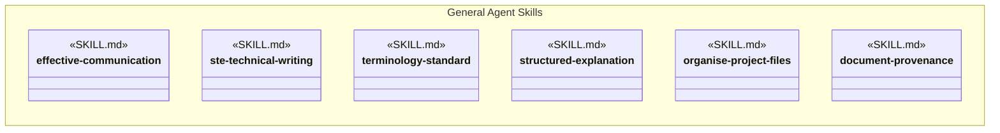
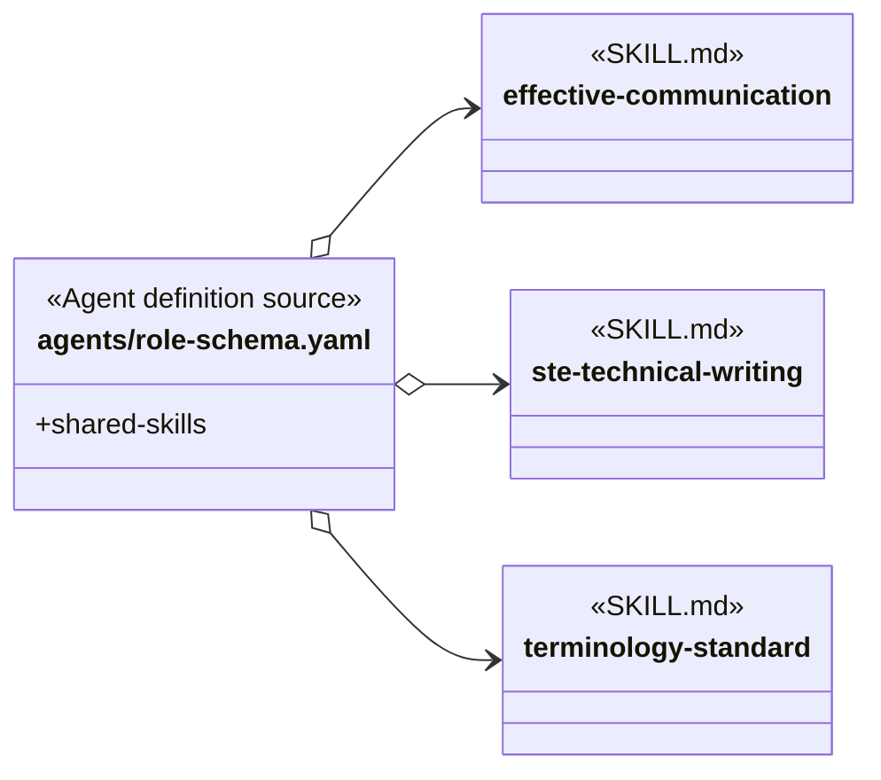
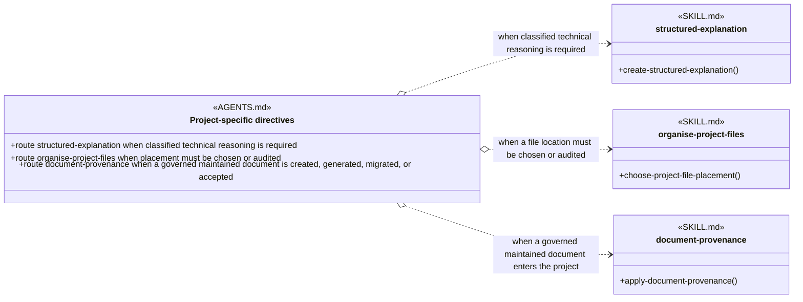

# General Agent Skills

## Scope

General Agent Skills is a cross-cutting applicability view of skills whose loading rule can apply to every Agent rather than being owned by one Agent role or one methodology capability. The view brings those rules together for comprehension; it is not a Skill Group because its members do not divide one cohesive capability.

General does not mean that every skill is active during every task. Some general skills are loaded into every generated Agent definition. Others are available to every Agent through one project-wide conditional rule and are loaded only when that condition applies.

The exact-name and project-wide conditional loading conventions are defined in [Object-Oriented Analysis of Agents and Skills](../object-oriented-agent-and-skill-model.md#project-wide-conditional-skill-routing). The applied capability-group registry and this separate [cross-cutting view](../object-oriented-skill-group-models.md#31-cross-cutting-agent-wide-applicability-view) are inventoried in Object-Oriented Skill Group Models.

## Design

The General Agent Skills design separates two loading mechanisms that reach every Agent. The role schema supplies universal Agent skills when generated definitions are built. `PROJECT.yaml` supplies project-wide conditional skills through root `AGENTS.md`, which the harness makes available automatically.

### Agent-Wide Applicability View

The view contains six independent skills whose common property is Agent-wide applicability. The box itemizes that applicability set without treating it as a cohesive capability or implying that one skill depends on another.

The box is a cross-cutting comprehension boundary. It says which skills share an Agent-wide applicability rule; it does not create Skill Group membership or runtime dependencies among them.

### Universal Skills In Every Generated Agent

Universal Agent skills are added by `agents/role-schema.yaml` to every generated Agent definition. An Agent therefore receives these exact-name dependencies without every role source repeating them.

`effective-communication` governs the messages, decisions, evidence, blockers, outcomes, and handoffs produced by every Agent. `ste-technical-writing` supplies one semantic-preservation contract whenever an Agent writes, rewrites, or reviews technical-document prose. `terminology-standard` applies preferred terms to every Agent's technical explanations, findings, coordination messages, and durable or user-visible language. Its universal presence does not turn every Agent response into a technical document; each skill's own boundary determines which rules apply.

### Project-Wide Conditional Skills

Project-wide conditional skills can be needed by any Agent, but loading them for every task would add unnecessary context. `PROJECT.yaml` records each condition once, the renderer puts that route in root `AGENTS.md`, and the harness supplies those project directives automatically. The diagram therefore shows the directives referencing the named skills and does not draw an Agent-to-`AGENTS.md` dependency.

`structured-explanation` is loaded when the work must expose classified technical reasoning through QUERY, SUB-QUERY, FACT, HYPOTHESIS, UNKNOWN, and ANSWER items. Ordinary communication continues to use `effective-communication`; ordinary technical-document prose continues to use `ste-technical-writing`. The structured form is not required merely because an Agent explains something.

`organise-project-files` is loaded before an Agent chooses or audits a project file or directory location. When an authoritative configuration, generator, template, or explicit user instruction already fixes the exact destination, the Agent confirms that binding without reopening a redundant placement decision.

`document-provenance` is loaded when an Agent creates, generates, migrates, or accepts a maintained document governed by the centralized project configuration. The configuration owns the exact copyright, governed Markdown and HTML paths, exclusions, generated-artifact boundary, and root guidance. The skill owns provenance placement, runtime-envelope truthfulness, historical migration, and validation. Artifact-specific creation and review skills continue to own document meaning, structure, and format-specific front matter. Excluded operational, imported, configuration, data, binary, cache, and generated projection paths do not activate the skill unless an owning source explicitly integrates provenance.

### How Agent-Group Designs Use This Design

Agent-group designs focus on dependencies that distinguish their Agents and activities. They link to this design instead of repeating the six general skills in every overall or scenario diagram. A scenario may still show one of these skills when that general dependency is the subject of the scenario itself.

This omission is a diagramming simplification, not a loss of dependency information. Universal skills remain present through the role schema, and project-wide conditional skills remain available through the rendered project directives.

## Skill Responsibilities

The five skills have separate responsibilities even though their loading scope is shared.

| Skill | Loading mechanism | Responsibility |
| --- | --- | --- |
| effective-communication | Universal role-schema skill | Keeps messages, decisions, evidence, blockers, outcomes, and handoffs clear and appropriately concise. |
| ste-technical-writing | Universal role-schema skill | Preserves meaning and uses controlled technical prose when an Agent creates, revises, or reviews technical documentation. |
| structured-explanation | Project-wide conditional skill | Presents explicit technical reasoning using classified reasoning items when that structure is required. |
| organise-project-files | Project-wide conditional skill | Chooses or audits repository locations using project guidance, taxonomy, ownership, and lifecycle evidence. |
| document-provenance | Project-wide conditional skill | Applies exact project-authorized provenance, runtime-supplied execution evidence, format-specific placement, historical-migration rules, and validation to governed maintained documents. |

## Authoritative Inputs

The membership, loading mechanisms, and procedure boundaries are grounded in these sources.

- [Agent Role Schema](../../agents/role-schema.yaml)
- [Project Configuration](../../PROJECT.yaml)
- [Project Configuration Template](../../skills/route-documentation-work/assets/templates/project-template.yaml)
- [Effective Communication](../../skills/effective-communication/SKILL.md)
- [STE Technical Writing](../../skills/ste-technical-writing/SKILL.md)
- [Structured Explanation](../../skills/structured-explanation/SKILL.md)
- [Organise Project Files](../../skills/organise-project-files/SKILL.md)
- [Document Provenance](../../skills/document-provenance/SKILL.md)
