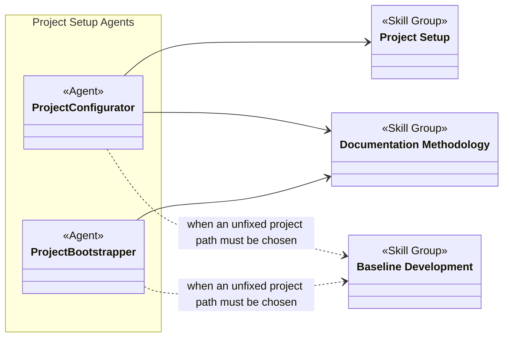
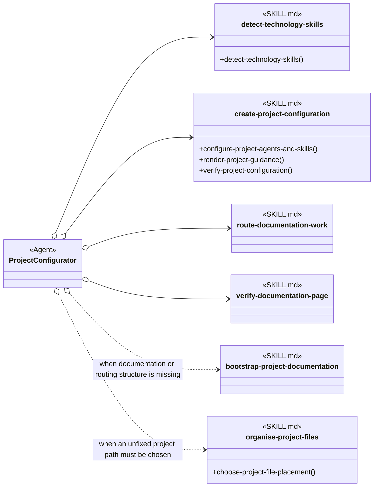
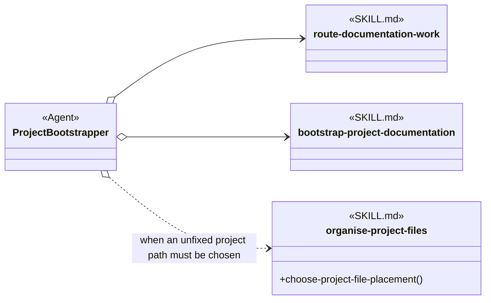

# Project Setup Skill Group

## Scope

Project Setup owns technology detection and project configuration. It uses documentation and placement skills from their primary groups rather than making those skills part of setup.

The applied-model conventions are defined in [Object-Oriented Skill Group Models](../object-oriented-skill-group-models.md#2-applied-model-legend).

## Design

Project Setup supplies the detection and configuration capabilities used to establish project guidance. Its Agents also use Documentation Methodology and Baseline Development skills for documentation structure, verification, and file placement.

### Overall Agent And Skill Group Dependencies

The overall view shows the two Project Setup Agents and the Skill Groups from which they obtain their capabilities.

### Scenario: Configuring A Project

This scenario shows the skills Project Configurator loads to detect applicable technology, write project configuration, route documentation work, and verify the generated guidance.

create-project-configuration writes the resulting AGENTS.md guidance. That output is not drawn as a loading dependency because the Project Configurator produces the file rather than consuming it through the relationship.

### Scenario: Bootstrapping A Project

This scenario shows how Project Bootstrapper combines documentation routing and bootstrap skills, adding file-placement guidance only when the destination is not already fixed.

## Skill Responsibilities

The two direct skills separate repository detection from configuration authoring and verification.

| Skill | Public procedures | Responsibility |
| --- | --- | --- |
| detect-technology-skills | Detect Technology Skills | Detects source-backed technology and domain skills for each configured folder. |
| create-project-configuration | Configure Project Agents And Skills; Render Project Guidance; Verify Project Configuration | Creates or updates PROJECT.yaml, renders AGENTS.md guidance, and validates the resulting configuration. |

## Authoritative Inputs

The relationships and procedure boundaries are grounded in these Agent and skill definitions.

- [Project Configurator](../../agents/roles/project-setup/project-configurator.role.yaml)
- [Project Bootstrapper](../../agents/roles/project-setup/project-bootstrapper.role.yaml)
- [Detect Technology Skills](../../skills/detect-technology-skills/SKILL.md)
- [Create Project Configuration](../../skills/create-project-configuration/SKILL.md)
- [Bootstrap Project Documentation](../../skills/bootstrap-project-documentation/SKILL.md)
- [Verify Documentation Page](../../skills/verify-documentation-page/SKILL.md)
- [Organise Project Files](../../skills/organise-project-files/SKILL.md)
- [Route Documentation Work](../../skills/route-documentation-work/SKILL.md)
