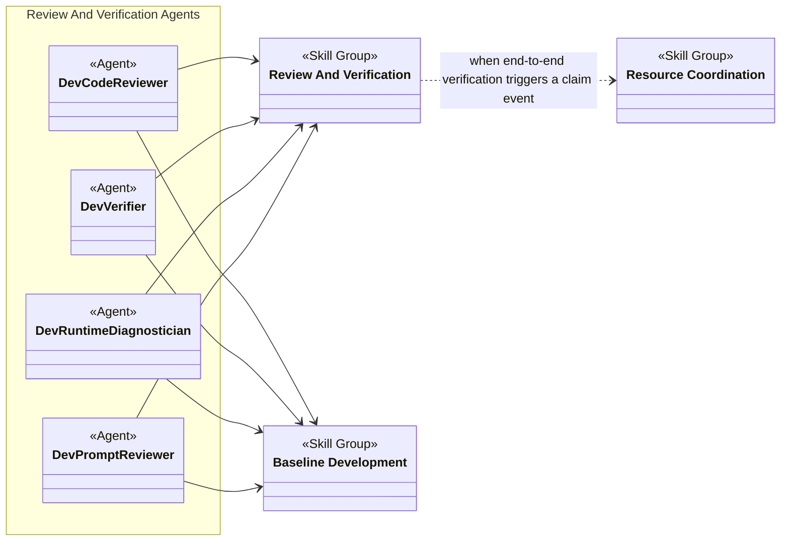
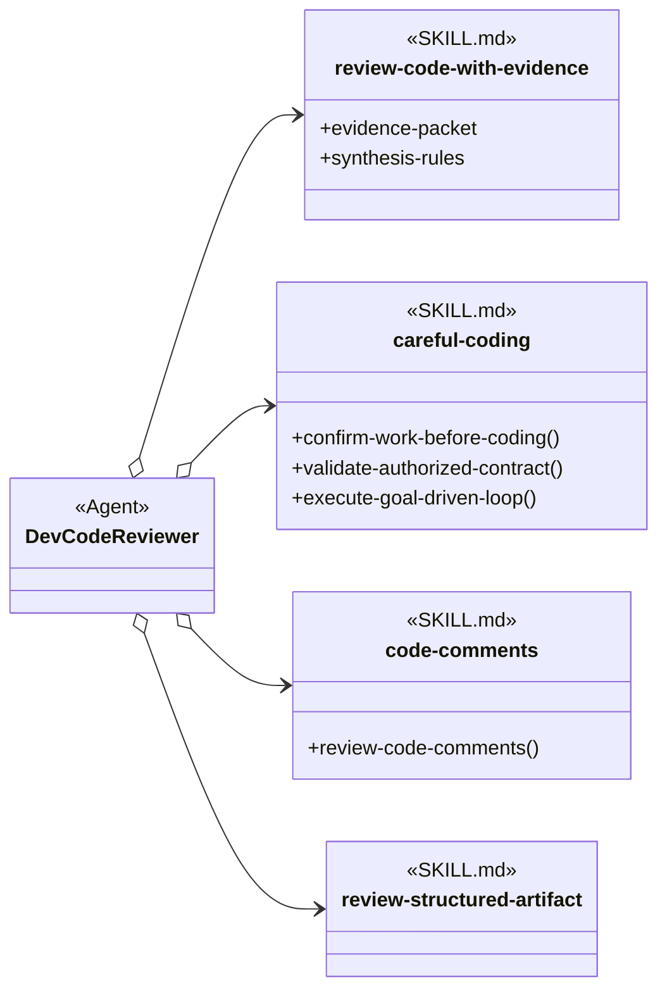
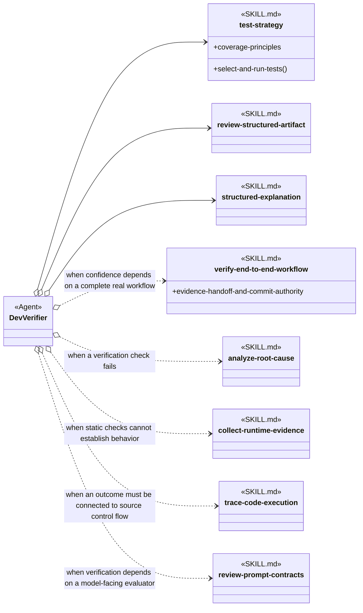
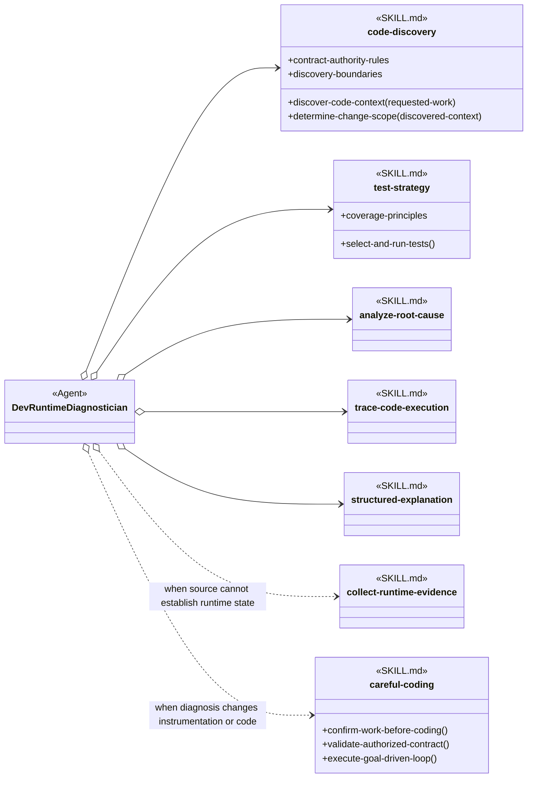
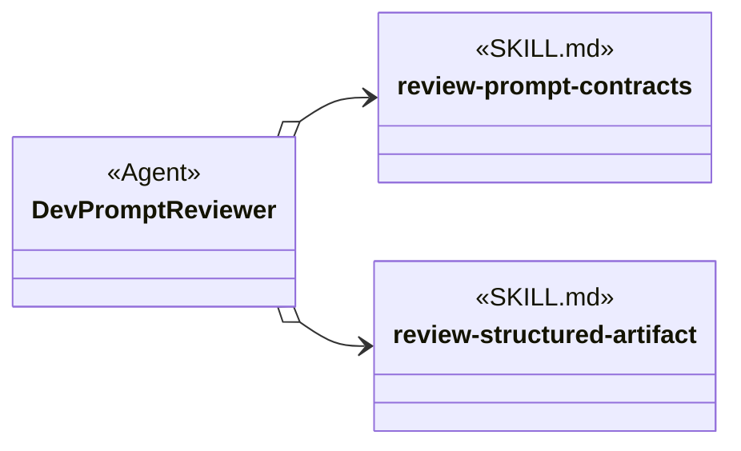
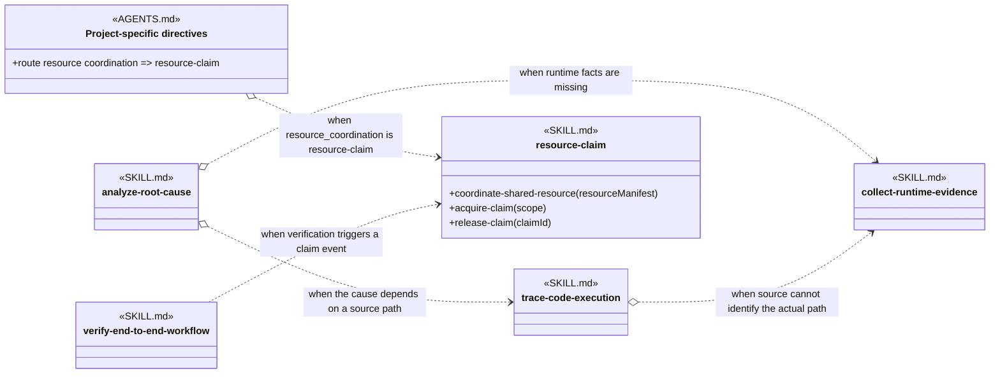

# Review And Verification Skill Group

## Scope

Review And Verification contains evidence review, test selection, end-to-end verification, diagnosis, runtime observation, source tracing, and prompt-contract review. Agent definitions combine these skills with exact-name Baseline Development skills.

The applied-model conventions are defined in [Object-Oriented Skill Group Models](../object-oriented-skill-group-models.md#2-applied-model-legend).

## Design

Review And Verification supplies distinct procedures for code review, verification, runtime diagnosis, and prompt review. The overall view establishes the Agent and Skill Group landscape; the scenario views expand each role’s core and conditional dependencies and the supporting evidence relationships among skills.

### Overall Agent And Skill Group Dependencies

The overall view shows the four principal review and verification Agents, their shared use of Baseline Development, and the optional Resource Coordination dependency used by an end-to-end verification scenario.

### Scenario: Reviewing Code

This scenario shows the evidence-review skill and Baseline Development guidance that Dev Code Reviewer loads for every code review, plus file-placement guidance when the review creates a project artifact.

### Scenario: Verifying A Change

This scenario shows the test, review, and explanation skills Dev Verifier always loads and the focused skills it adds when the evidence requires a complete workflow, diagnosis, runtime observation, source tracing, or prompt-contract review.

### Scenario: Diagnosing Runtime Behavior

This scenario shows the discovery, testing, diagnosis, tracing, and explanation skills Dev Runtime Diagnostician uses to establish a mechanism-level cause. Runtime collection and careful coding are loaded only when observation or bounded instrumentation is required.

### Scenario: Reviewing A Prompt Contract

This scenario shows the prompt-specific and structured-review skills Dev Prompt Reviewer always loads.

PROJECT.yaml records organise-project-files once in shared_agent_skills, and generated AGENTS.md tells every Agent to load it when the Agent must choose or audit the location of a project file or directory. The scenarios therefore do not repeat that project-wide route as role-specific arrows.

### Scenario: An Investigation Needs More Evidence

This scenario shows how diagnosis and tracing skills add runtime evidence only when source analysis cannot establish the required fact. It also shows project-selected resource coordination for an end-to-end verification that triggers a claim event.

Verification returns evidence to the delivery owner. None of these scenarios assigns Commit-provider selection or provider-lifecycle authority to Dev Verifier.

## Skill Responsibilities

The group distinguishes complete review or diagnosis operations from supporting data that callers may need to understand.

| Skill | Public procedures or identity | Responsibility |
| --- | --- | --- |
| review-code-with-evidence | Review Code With Evidence; Evidence Packet; Synthesis Rules | Builds cited review evidence and synthesizes actionable findings. |
| test-strategy | Select And Run Tests; Coverage Principles | Chooses verification from changed behavior, risk, and project-native capabilities. |
| verify-end-to-end-workflow | Verify End To End Workflow; Evidence Handoff And Commit Authority | Verifies a complete real workflow and returns evidence without taking provider lifecycle authority. |
| analyze-root-cause | Analyze Root Cause | Establishes a mechanism-level cause before remediation. |
| collect-runtime-evidence | Collect Runtime Evidence | Collects bounded observations when source alone cannot establish runtime behavior. |
| trace-code-execution | Trace Code Execution | Connects entry points, branches, state changes, errors, and exits through source. |
| review-prompt-contracts | Review Prompt Contracts | Reviews model-facing instructions, tools, state, retries, outputs, and data boundaries. |

## Authoritative Inputs

The relationships and procedure boundaries are grounded in these Agent and skill definitions.

- [Dev Code Reviewer](../../agents/roles/dev-activities/dev-code-reviewer.role.yaml)
- [Dev Verifier](../../agents/roles/dev-activities/dev-verifier.role.yaml)
- [Dev Runtime Diagnostician](../../agents/roles/dev-activities/dev-runtime-diagnostician.role.yaml)
- [Dev Prompt Reviewer](../../agents/roles/dev-activities/dev-prompt-reviewer.role.yaml)
- [Review Code With Evidence](../../skills/review-code-with-evidence/SKILL.md)
- [Test Strategy](../../skills/test-strategy/SKILL.md)
- [Verify End To End Workflow](../../skills/verify-end-to-end-workflow/SKILL.md)
- [Analyze Root Cause](../../skills/analyze-root-cause/SKILL.md)
- [Collect Runtime Evidence](../../skills/collect-runtime-evidence/SKILL.md)
- [Trace Code Execution](../../skills/trace-code-execution/SKILL.md)
- [Review Prompt Contracts](../../skills/review-prompt-contracts/SKILL.md)
- [Careful Coding](../../skills/careful-coding/SKILL.md)
- [Code Comments](../../skills/code-comments/SKILL.md)
- [Code Discovery](../../skills/code-discovery/SKILL.md)
- [Organise Project Files](../../skills/organise-project-files/SKILL.md)
- [Review Structured Artifact](../../skills/review-structured-artifact/SKILL.md)
- [Structured Explanation](../../skills/structured-explanation/SKILL.md)
- [Resource Claim](../../skills/resource-claim/SKILL.md)
