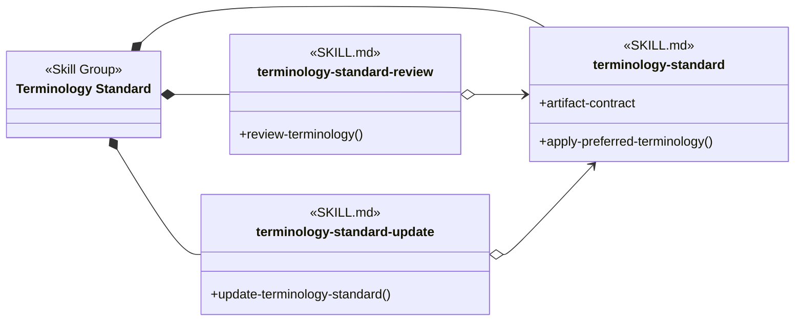
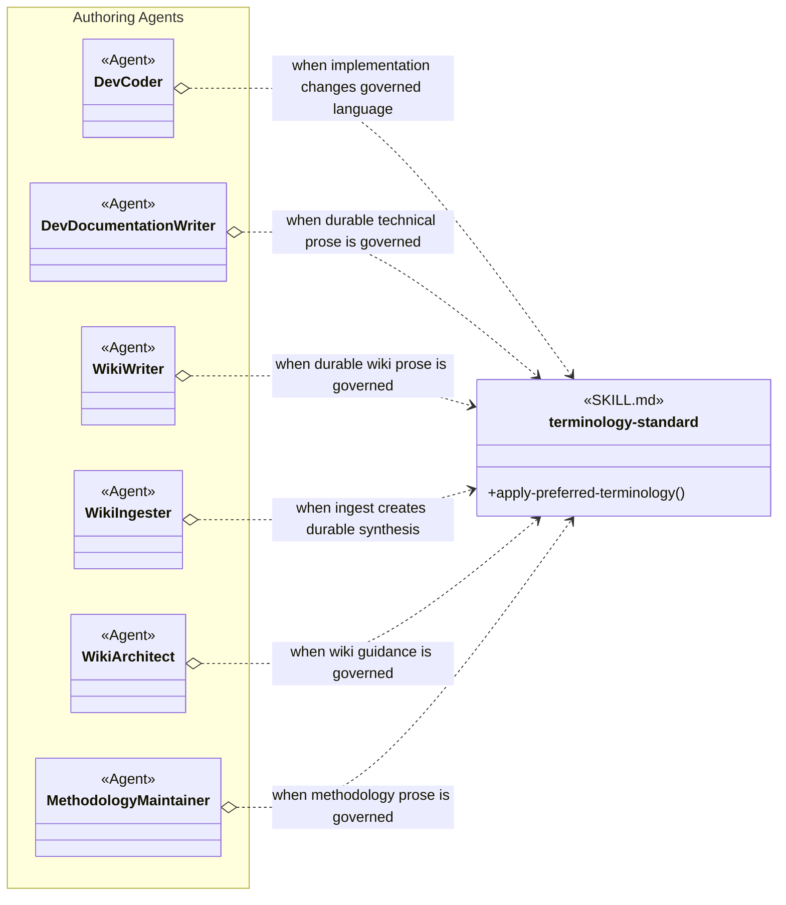
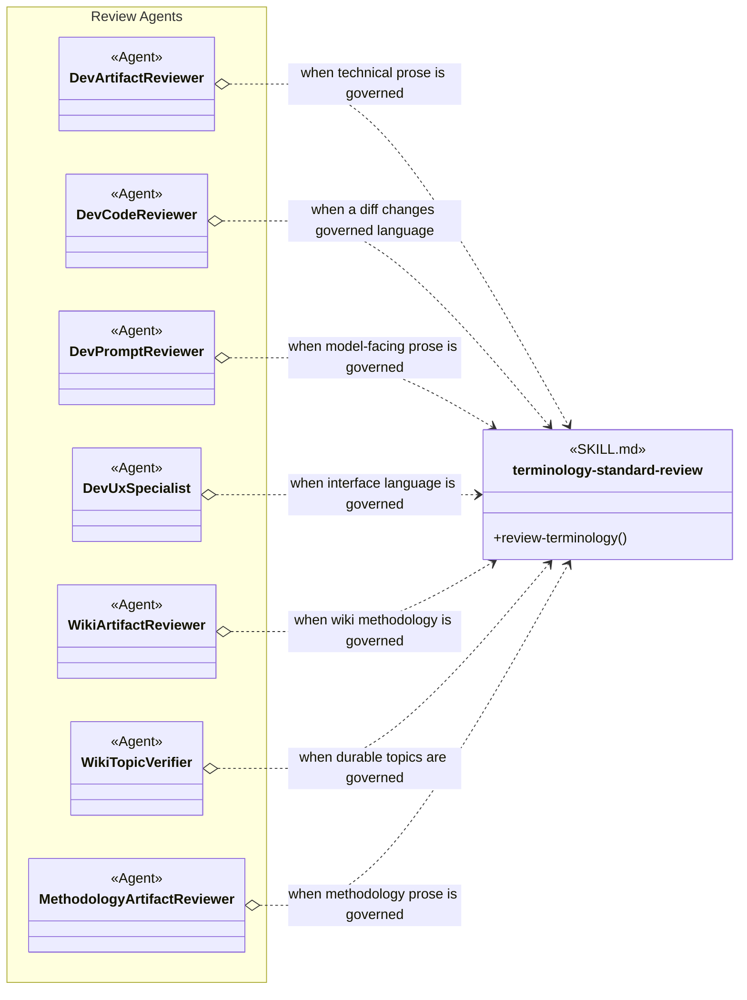
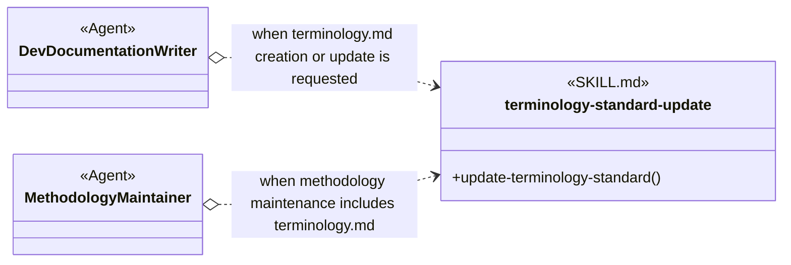

<!--
Copyright (c) 2026 Martin.Bechard@DevConsult.ca
Artifact-ID: 077d4210-f068-4838-a230-d37a1ec14204
Created-UTC: 2026-08-08T19:24:44Z
Creating-Agent: historical-unknown
Runtime: historical-unknown
Dispatched-Model: historical-unknown
Reasoning-Effort: historical-unknown
Task-ID: historical-unknown
Artifact-ID-Evidence: migration-assigned
Created-UTC-Evidence: git-derived
Creating-Agent-Evidence: historical-unknown
Runtime-Evidence: historical-unknown
Dispatched-Model-Evidence: historical-unknown
Reasoning-Effort-Evidence: historical-unknown
Task-ID-Evidence: historical-unknown
-->

# Terminology Standard

The Terminology Standard Skill Group keeps preferred concept language consistent across durable technical prose and user-visible language. It separates ordinary use, read-only review, and evidence-based standard updates so an author does not silently expand the standard while writing.

## Scope And Composition

The exact artifact name is terminology.md. A shared user artifact applies across projects. A project artifact narrows or extends that shared standard for one project.

The provider-neutral Load Terminology Standards operation is realized by mcp-agent-ops reference_load for terminology.md. The installer configures the active project first and then the shared user reference roots. The process-local reference snapshot is immutable until the provider-neutral Refresh Terminology Standards operation invokes reference_refresh. A successful aggregate or reference_not_found result is conclusive only for the provider's active configured snapshot; it does not prove that an unlisted physical root exists or was eligible. A provider error is UNAVAILABLE. An absent artifact is valid and does not trigger creation. Unavailable loading blocks conformance PASS and every standard mutation; ordinary project writing may report an explicit project-only PARTIAL result. An update refreshes and loads before mutation so its decision uses current disk state. COMPLETE requires a second successful refresh followed by a load whose revision matches and whose source digests include the validated target digest. A post-mutation refresh or verification failure returns PUBLICATION INCOMPLETE while preserving the valid file. A mutation that requires proof about an unlisted physical scope is BLOCKED. The first matching project entry governs when the project source is present, and shared entries remain available for other concepts.

Each entry starts with a preferred term and definition. Use for and Examples are optional clarifications. Avoid is optional reinforcement added only after retained evidence shows repeated substitution, a misleading metaphor, or another persistent bias toward a nonpreferred term.

## Skill Group Overview

The three skills share the terminology-standard stem. The operation suffix distinguishes review and update from ordinary use.

### Scenario: Apply Preferred Terminology

Authoring Agents apply the base skill only when their output contains covered durable prose or user-visible language. Raw evidence, exact identifiers, code, commands, schemas, quotations, and external product names remain unchanged unless the task explicitly changes them.

### Scenario: Review Terminology

Review Agents use the read-only review skill when the target language is governed by a project or shared user standard. The review matches concepts before words, so a defined preferred term can displace campaign without requiring campaign to appear under Avoid first.

### Scenario: Update The Standard

Dev Documentation Writer owns ordinary terminology.md authoring. Methodology Maintainer uses the same update skill when a methodology maintenance request includes the standard. Project scope is the default for project-specific concepts. Shared user scope requires explicit selection and a caller-supplied authorized mutation target because reference_load deliberately returns path-free data. Either update refreshes and loads before mutation, then blocks without mutation when one requested scope, refresh capability, or mutation authority is unavailable. After a valid file change, a second reference_refresh and a digest-confirming reload publish and verify the new snapshot; failure at that boundary returns PUBLICATION INCOMPLETE without reverting the file.

## Skill Responsibilities

| Skill | Responsibility |
| --- | --- |
| terminology-standard | Defines the reference_load and reference_refresh provider contracts, terminology.md scope precedence, snapshot publication verification, positive-first entry structure, exclusions, and ordinary preferred-term application. |
| terminology-standard-review | Performs read-only concept-level conformance review and separates target corrections from reinforcement recommendations. |
| terminology-standard-update | Creates or revises one selected standard and adds Avoid only when retained evidence justifies reinforcement. |

## Authoritative Inputs

The relationships are grounded in these skill and Agent definitions.

- [Terminology Standard](../../skills/terminology-standard/SKILL.md)
- [Terminology Standard Review](../../skills/terminology-standard-review/SKILL.md)
- [Terminology Standard Update](../../skills/terminology-standard-update/SKILL.md)
- [Dev Coder](../../agents/roles/dev-activities/dev-coder.role.yaml)
- [Dev Documentation Writer](../../agents/roles/dev-activities/dev-documentation-writer.role.yaml)
- [Dev Artifact Reviewer](../../agents/roles/dev-activities/dev-artifact-reviewer.role.yaml)
- [Dev Code Reviewer](../../agents/roles/dev-activities/dev-code-reviewer.role.yaml)
- [Dev Prompt Reviewer](../../agents/roles/dev-activities/dev-prompt-reviewer.role.yaml)
- [Dev UX Specialist](../../agents/roles/dev-activities/dev-ux-specialist.role.yaml)
- [Wiki Writer](../../agents/roles/wiki-activities/wiki-writer.role.yaml)
- [Wiki Ingester](../../agents/roles/wiki-activities/wiki-ingester.role.yaml)
- [Wiki Architect](../../agents/roles/wiki-activities/wiki-architect.role.yaml)
- [Wiki Artifact Reviewer](../../agents/roles/wiki-activities/wiki-artifact-reviewer.role.yaml)
- [Wiki Topic Verifier](../../agents/roles/wiki-activities/wiki-topic-verifier.role.yaml)
- [Methodology Maintainer](../../agents/roles/methodology-maintenance/methodology-maintainer.role.yaml)
- [Methodology Artifact Reviewer](../../agents/roles/methodology-maintenance/methodology-artifact-reviewer.role.yaml)
