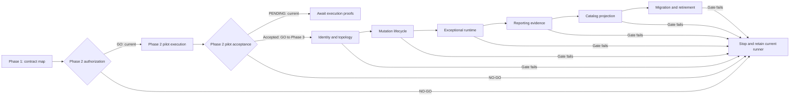

<!--
Copyright (c) 2026 Martin.Bechard@DevConsult.ca
Artifact-ID: 5a91ab4c-755e-4ff7-85c7-9e9c05caccdf
Created-UTC: 2026-08-13T17:16:31Z
Creating-Agent: /root/map_evaluation_contracts_to_inspect_ai/inspect_ai_mapping_writer
Runtime: Codex
Dispatched-Model: gpt-5.6-sol
Reasoning-Effort: medium
Task-ID: 019ffbeb-02ee-7d52-9460-d1bfdbdbe20b
Artifact-ID-Evidence: runtime-supplied
Created-UTC-Evidence: runtime-supplied
Creating-Agent-Evidence: runtime-supplied
Runtime-Evidence: runtime-supplied
Dispatched-Model-Evidence: runtime-supplied
Reasoning-Effort-Evidence: runtime-supplied
Task-ID-Evidence: runtime-supplied
-->

# Inspect AI Evaluation Contract Mapping

## Decision

Authorize Phase 2 to prepare and run a bounded read-only pilot. The authorization outcome is deterministic GO from Phase 1 evidence. Pilot acceptance remains pending until Phase 2 produces its required execution proofs. Inspect AI and inspect-swe are execution and evidence candidates. They do not replace repository authority for Agent identity, topology, independent judgment, resource claims, Git evidence, containment verification, cleanup verification, categorical status, receipt validation, immutable reporting, or publication.

The mapping has 62 governed responsibilities. It marks 16 responsibilities as INSPECT_CANDIDATE, 39 as RETAINED, and 7 as GAP. Each GAP has one later Work Item owner. Phase 2 authorization does not claim that pilot parity is proven. The pilot fails acceptance if any required execution proof fails or if the adapter must duplicate a retained verifier.

## Scope and authority

This document maps the complete 33-suite agent evaluation contract to Inspect AI and inspect-swe. It does not implement an adapter, generator, simulator, runner, or live evaluation. It does not authorize a paid model call.

The authoring snapshot starts at commit cf30388e125cc543a69b318827b5cb8a055917f1. The completion snapshot is current-main commit f4f2976adc358896c952e8f43a4714c6111776b0 with tree bd9cb3c82fc906b3e0d06d56f582143e595f1129. The target path was ABSENT. The source ledger records 280 repository authority entries and 21 immutable upstream entries. Each completion digest must equal its authoring-start digest. Any difference is source drift and stops delivery.

The durable Work Item at SRC-L041 owns the mapping requirements and the requirement for independent architecture acceptance. The accepted hierarchy-plan JSON and HTML were untracked runtime artifacts. They are non-authoritative execution evidence outside the frozen source ledger. They cannot supply a source, link, digest, or acceptance claim.

Authority ranks resolve conflicts in this order:

1. Canonical repository policy and schema.
2. Executable enforcement.
3. Generated native adapter for native Codex identity.
4. Common suite protocol.
5. Suite and scenario manifests.
6. Project-agent and suite-method configuration.
7. Tests as corroboration.
8. Explanatory prose.
9. Historical material.
10. Immutable upstream source for candidate API behavior only.

Conceptual role source outranks its generated native adapter for portable semantics. The native adapter owns exact Codex identity. Common protocol outranks suite-local method prose. Executable enforcement owns observed validation and demotion behavior. Upstream sources never own repository acceptance.

The configured terminology reference is ABSENT at catalog revision 4721c3517a5a18c21d7c827079113de0b87b1dcc4a3e3f1942bd01601ddfa2. This document therefore applies no project or shared Terminology Standard. It uses the existing evaluation hierarchy: evaluation portfolio, evaluation suite, evaluation task, dataset or evaluation set, and sample or case. An Inspect Task binds a dataset, a Solver or Agent, and a Scorer.

## Source shape

```text
evals/agent-tests/
├── suite-index.yaml
├── runner.py
├── suite_reporting.py
├── skills/
└── 33 suite directories/
    ├── suite.yaml
    ├── scenarios.yaml
    ├── agents/{supervisor,judge}.toml
    └── skills/*-suite-contract/SKILL.md
agents/roles/
generated/adapters/codex/agents/
backlog/feature-backlog/inspect-ai-evaluation-adoption/
```

## Governed responsibility contract ledger

Each row is one distinct responsibility. The Phase 2 bounded adapter implements only R-015, R-042, R-046, R-049, and R-050. It supplies evidence for retained version-pinning responsibility R-037 and Phase 2 parity responsibility R-062. It calls retained validation for R-040 and R-041 without implementing those responsibilities. It calls every other applicable RETAINED verifier. It does not duplicate identity, containment, Judge, receipt, or categorical-status logic. R-054 is a Phase 6 GAP and is outside the R-042 through R-053 interval.

Each source citation resolves to a row in the repository or upstream source-authority ledger. A source range means every ledger row in that inclusive range that names the responsibility.

| ID | Governed responsibility | Cited sources | Current owner | Disposition | Proposed owner | Verifier | Retained form | Missing-or-drift consequence | Retirement condition | Later Work Item ID | First parity gate |
| --- | --- | --- | --- | --- | --- | --- | --- | --- | --- | --- | --- |
| R-001 | Canonical suite inventory, suite order, and concurrency ceiling | SRC-L049, SRC-L181, SRC-L227–L234 | suite-index.yaml and runner preflight | RETAINED | No change: suite-index.yaml and runner preflight | Suite-index and preflight validators | Canonical suite index and enforced ceiling | Stop catalog or migration work; retain the current index and runner. | Not eligible in this mapping; a separately accepted authority change and complete parity proof are required. | — | Phase 1 |
| R-002 | Per-suite manifest schema and invocation names | SRC-L049, applicable suite.yaml rows in SRC-L055–L225, SRC-L185 | suite.yaml and runner schema validation | RETAINED | No change: suite.yaml and runner schema validation | Manifest schema and workspace-inventory validators | Canonical suite manifests and invocation names | Stop generation or migration; retain the current manifests. | Not eligible in this mapping; a separately accepted schema change and complete parity proof are required. | — | Phase 1 |
| R-003 | Per-suite scenario definitions and required outcomes | SRC-L049, applicable scenarios.yaml rows in SRC-L053–L223, SRC-L179, SRC-L185 | scenarios.yaml and scenario schema validation | RETAINED | No change: scenarios.yaml and scenario schema validation | Scenario schema and workspace-inventory validators | Canonical scenario definitions and outcomes | Stop the affected suite and later phases; retain the current scenarios. | Not eligible in this mapping; a separately accepted scenario-authority change and complete parity proof are required. | — | Phase 1 |
| R-004 | Conceptual Agent role identity and portable contract | SRC-L005–L037, SRC-L049 | agents/roles source | RETAINED | No change: agents/roles source | Role-schema and adapter-freshness validators | Canonical conceptual role YAML | Stop identity proof and migration; retain the conceptual roles. | Not eligible in this mapping; a separately accepted identity architecture and complete parity proof are required. | — | Phase 1 |
| R-005 | Codex native target adapter identity | Applicable suite.yaml rows in SRC-L055–L225, SRC-L235–L267 | generated Codex adapter and freshness checks | RETAINED | No change: generated Codex adapter and freshness checks | Adapter generation and freshness validators | Generated native adapter tied to its conceptual source | Stop the affected suite and later phases; regenerate only from canonical source. | Not eligible in this mapping; a separately accepted native-identity change and complete parity proof are required. | — | Phase 1 |
| R-006 | Supervisor project-agent configuration identity | Applicable supervisor.toml and suite.yaml rows in SRC-L052–L225 | suite projectAgents resolution and runtime receipt | RETAINED | No change: suite projectAgents resolution and runtime receipt | Runner identity-receipt validator | Exact supervisor configuration and receipt | Stop the affected suite; do not infer a supervisor identity. | Not eligible in this mapping; a separately accepted identity architecture and complete parity proof are required. | — | Phase 1 |
| R-007 | Judge project-agent configuration identity | Applicable judge.toml and suite.yaml rows in SRC-L051–L225 | suite projectAgents resolution and runtime receipt | RETAINED | No change: suite projectAgents resolution and runtime receipt | Runner Judge identity-receipt validator | Exact Judge configuration and receipt | Stop the affected suite; do not infer a Judge identity. | Not eligible in this mapping; a separately accepted Judge-authority change and complete parity proof are required. | — | Phase 1 |
| R-008 | Shared suite supervision method | SRC-L049, SRC-L180 | agent-suite-supervision skill | RETAINED | No change: agent-suite-supervision skill | Suite-contract resolution and skill-digest validators | Shared supervision contract | Stop the affected suite; retain the shared supervision method. | Not eligible in this mapping; a separately accepted method change and complete parity proof are required. | — | Phase 1 |
| R-009 | Shared scenario design method | SRC-L049, SRC-L179 | agent-scenario-design skill | RETAINED | No change: agent-scenario-design skill | Scenario and skill-digest validators | Shared scenario-design contract | Stop scenario translation; retain the shared design method. | Not eligible in this mapping; a separately accepted method change and complete parity proof are required. | — | Phase 1 |
| R-010 | Shared evidence-judging method | SRC-L049, SRC-L178, SRC-L229–L231 | agent-evidence-judging skill | RETAINED | No change: agent-evidence-judging skill | Independent Judge and output-schema validators | Shared evidence-judging contract | Stop acceptance; do not substitute scorer output. | Not eligible in this mapping; a separately accepted Judge architecture and complete parity proof are required. | — | Phase 1 |
| R-011 | Suite-specific evaluation method | Applicable suite-contract and suite.yaml rows in SRC-L054–L225, SRC-L049 | resolved suite skill or explicit empty suite list | RETAINED | No change: resolved suite skill or explicit empty suite list | Suite-contract resolution and skill-digest validators | Suite-local method or explicit empty list | Stop the affected suite; do not invent a suite method. | Not eligible in this mapping; a separately accepted method-authority change and complete parity proof are required. | — | Phase 1 |
| R-012 | Suite selection, batching, and maximum active children | SRC-L177, SRC-L180–L185, SRC-L277 | runner orchestration | RETAINED | No change: runner orchestration | Runner orchestration tests and supervision checks | Repository selection, batching, and concurrency rules | Stop execution; retain current scheduling. | Retire only after Phases 2 through 5 and Phase 8 prove exact all-suite parity. | — | Phase 1 |
| R-013 | Exact target, supervisor, dependency, and Judge runtime identity | SRC-L005–L037, SRC-L177, SRC-L180, SRC-L235–L267, SRC-X017 | runner identity receipts and validation | RETAINED | No change: runner identity receipts and validation | Runner receipt and generated-identity validators | Exact repository identity receipts | Stop the run; span inference cannot replace identity evidence. | Not eligible in this mapping; a separately accepted identity architecture and complete parity proof are required. | — | Phase 1 |
| R-014 | Parent-child topology and allowed dependency order | SRC-L177, SRC-L180, applicable supervisor.toml rows in SRC-L052–L222, SRC-X017 | runner topology validation | RETAINED | No change: runner topology validation | Runner topology and supervision validators | Authorized repository topology graph | Stop the run; observed spans cannot establish topology. | Not eligible in this mapping; a separately accepted topology architecture and complete parity proof are required. | — | Phase 1 |
| R-015 | Context, configuration, skill, and fixture staging | SRC-L177, SRC-L273, SRC-X002 | runner staging and validation | INSPECT_CANDIDATE | Inspect Task setup plus a bounded adapter that calls retained validation | Retained staging, digest, and identity validators | Repository staging rules and validation remain authoritative | Stop Phase 2; retain current staging. | Retire duplicated staging only after Phase 2 and Phase 8 prove exact parity without duplicating retained validation. | — | Phase 2 |
| R-016 | Privacy classification and preflight before model use | SRC-L001–L002, SRC-L049, SRC-L177 | runner privacy gate | RETAINED | No change: runner privacy gate | Privacy preflight and receipt validation | Repository privacy classification and no-model gate | Stop before model use; retain current privacy controls. | Not eligible in this mapping; a separately accepted privacy architecture and complete parity proof are required. | — | Phase 1 |
| R-017 | Credential scope, secret handling, and redaction | SRC-L001–L002, SRC-L049, SRC-L177 | runner and repository policy | RETAINED | No change: runner and repository policy | Credential-scope, redaction, and receipt checks | Repository credential and redaction controls | Stop before execution; do not expose or infer credentials. | Not eligible in this mapping; a separately accepted security architecture and complete parity proof are required. | — | Phase 1 |
| R-018 | Frozen source fixture and allowed-write boundary | SRC-L001–L002, SRC-L177, SRC-L185, SRC-L226 | runner snapshot and mutation validation | RETAINED | No change: runner snapshot and mutation validation | Workspace inventory and mutation validator | Frozen fixture digest and allowed-write boundary | Stop the run; classify unproved state as invalid. | Not eligible in this mapping; a separately accepted mutation architecture and complete parity proof are required. | — | Phase 1 |
| R-019 | Git initialization, mutation, status, diff, and commit evidence | SRC-L001–L002, SRC-L177, SRC-L226 | runner Git verifier | RETAINED | No change: runner Git verifier | Git baseline, status, diff, commit, and cleanliness checks | Repository Git evidence | Stop mutation acceptance; retain current Git verification. | Not eligible in this mapping; a separately accepted Git-evidence architecture and complete parity proof are required. | — | Phase 1 |
| R-020 | Resource-claim acquisition, heartbeat, and release evidence | SRC-L001–L002, SRC-L049, SRC-L177 | configured claim helper and retained claim receipt | RETAINED | No change: configured claim helper and retained claim receipt | Claim-helper schema-version-2 receipt validation | Configured claim lifecycle and receipts | Stop mutation or exclusive-resource work; do not infer claim state. | Not eligible in this mapping; a separately accepted resource-coordination architecture and complete parity proof are required. | — | Phase 1 |
| R-021 | Command execution, timeout, process teardown, and exit evidence | SRC-L177, SRC-L183, SRC-X002, SRC-X010 | runner command and process verifier | INSPECT_CANDIDATE | Inspect execution plus retained exceptional-path verification | Retained timeout, process, teardown, and exit validators | Repository exceptional-path evidence remains authoritative | Stop Phase 5; retain current execution and teardown. | Retire duplicated execution only after Phase 5 and Phase 8 prove every normal and exceptional path. | — | Phase 5 |
| R-022 | Browser and loopback service brokerage | SRC-L160–L161, SRC-L177, SRC-L183 | runner resource and process verifier | RETAINED | No change: runner resource and process verifier | Browser, port, process, and cleanup probes | Repository service brokerage and evidence | Stop the affected suite; retain current brokerage. | Not eligible in this mapping; a separately accepted runtime architecture and complete parity proof are required. | — | Phase 1 |
| R-023 | Security containment and prohibited-host-effect verification | SRC-L001–L002, SRC-L177, SRC-L232, SRC-X011 | outer sandbox plus retained verifier | RETAINED | No change: outer sandbox plus retained verifier | Independent containment and prohibited-host-effect probes | Outer sandbox and repository containment checks | Stop execution and record NO-GO; do not trust framework status. | Not eligible in this mapping; a separately accepted containment architecture and complete parity proof are required. | — | Phase 1 |
| R-024 | Cleanup verification for files, processes, ports, sandboxes, and claims | SRC-L001–L002, SRC-L177, SRC-L226, SRC-X012 | runner cleanup verifier | RETAINED | No change: runner cleanup verifier | Independent post-run residue probes | Repository cleanup postconditions | Stop the next phase; retain current cleanup verification and report residue. | Not eligible in this mapping; a separately accepted cleanup architecture and complete parity proof are required. | — | Phase 1 |
| R-025 | Deterministic checks before semantic judgment | SRC-L049, SRC-L177–L179, applicable scenario and suite-contract rows in SRC-L053–L224 | runner deterministic-first contract | RETAINED | No change: runner deterministic-first contract | Deterministic checks and Judge-input validator | Deterministic-first ordering | Stop semantic judgment; do not promote an unchecked result. | Not eligible in this mapping; a separately accepted acceptance architecture and complete parity proof are required. | — | Phase 1 |
| R-026 | Independent Judge context and authority separation | SRC-L049, SRC-L177–L178, applicable judge.toml rows in SRC-L051–L221 | independent Judge launch and context verifier | RETAINED | No change: independent Judge launch and context verifier | Judge-session identity and context-separation checks | Independent repository Judge session | Stop acceptance; scorer output cannot replace the Judge. | Not eligible in this mapping; a separately accepted Judge architecture and complete parity proof are required. | — | Phase 1 |
| R-027 | Judge output schema, session identity, and evidence binding | SRC-L177–L178, SRC-L229, applicable Judge and scenario rows in SRC-L051–L223 | runner Judge receipt validation | RETAINED | No change: runner Judge receipt validation | Judge schema, session, evidence, and receipt validators | Bound Judge result and receipt | Demote the result to BLOCKED and stop later phases. | Not eligible in this mapping; a separately accepted Judge architecture and complete parity proof are required. | — | Phase 1 |
| R-028 | Inspect Scorer and Score production | SRC-L177–L178, SRC-X007–X008 | repository Judge and result pipeline | INSPECT_CANDIDATE | Inspect scorer API feeding the retained acceptance projection | Retained Judge, status, and projection validators | Score remains evidence; repository acceptance remains authoritative | Stop Phase 6; do not treat a Score as categorical acceptance. | Retire duplicated score transport only after Phase 6 and Phase 8 prove lossless projection and authority separation. | — | Phase 6 |
| R-029 | Governed categorical PASS, FAIL, BLOCKED, and STALE status | SRC-L049, SRC-L177–L184, SRC-L228–L229 | checkpoint schema and reporting projection | RETAINED | No change: checkpoint schema and reporting projection | Checkpoint, receipt, and reporting validators | Repository categorical status | Demote unsupported PASS or FAIL and stop publication. | Not eligible in this mapping; a separately accepted status architecture and complete parity proof are required. | — | Phase 1 |
| R-030 | Receipt schema, path and digest validation, and provenance | SRC-L177–L178, SRC-L226, SRC-L228 | runner receipt validator | RETAINED | No change: runner receipt validator | Receipt schema, path, digest, and provenance checks | Repository receipt contract | Demote the result to BLOCKED and stop publication. | Not eligible in this mapping; a separately accepted evidence architecture and complete parity proof are required. | — | Phase 1 |
| R-031 | Checkpoint/result agreement and invalid-receipt demotion | SRC-L177–L184, SRC-L228 | runner and reporting demotion rules | RETAINED | No change: runner and reporting demotion rules | Checkpoint-result agreement and invalid-receipt tests | Repository demotion behavior | Demote the result and stop publication. | Not eligible in this mapping; a separately accepted acceptance architecture and complete parity proof are required. | — | Phase 1 |
| R-032 | Immutable evidence bundle and content digests | SRC-L177, SRC-L182, SRC-L226, SRC-L228 | runner bundle and receipt logic | RETAINED | No change: runner bundle and receipt logic | Bundle path, content-digest, and immutability checks | Immutable repository evidence bundle | Stop acceptance and publication; preserve available evidence. | Not eligible in this mapping; a separately accepted evidence architecture and complete parity proof are required. | — | Phase 1 |
| R-033 | Per-suite report generation | SRC-L182, SRC-L184, SRC-X009 | suite reporting | INSPECT_CANDIDATE | Inspect EvalLog input with retained report projection | Retained per-suite report schema and projection tests | Repository report remains the accepted output | Stop Phase 6; retain current report generation. | Retire duplicated collection only after Phase 6 and Phase 8 prove lossless binding and immutable reporting. | — | Phase 6 |
| R-034 | Aggregate input classification and rollup precedence | SRC-L050, SRC-L182, SRC-L184 | suite reporting | RETAINED | No change: suite reporting | Aggregate classifier and precedence tests | Repository input classes and categorical rollup | Stop publication and report infrastructure failure. | Not eligible in this mapping; a separately accepted reporting architecture and complete parity proof are required. | — | Phase 1 |
| R-035 | Publication staging and pointer swap | SRC-L050, SRC-L182, SRC-L184 | suite reporting publication contract | RETAINED | No change: suite reporting publication contract | Staging, validation, and pointer-swap tests | Repository atomic publication contract | Stop before pointer swap; retain the last valid publication. | Not eligible in this mapping; a separately accepted publication architecture and complete parity proof are required. | — | Phase 1 |
| R-036 | Source, adapter, skill, and catalog freshness | SRC-L181, SRC-L235–L267, SRC-L278–L282 | catalog validators and digest comparison | RETAINED | No change: catalog validators and digest comparison | Source-to-generated and catalog-freshness validators | Canonical sources plus deterministic freshness proof | Stop generation or migration; do not mask drift. | Not eligible in this mapping; Phase 7 may change only the projection mechanism after exact parity proof. | — | Phase 1 |
| R-037 | Harness, framework, package, runtime, and platform pinning | SRC-L001–L004, SRC-X001, SRC-X013, SRC-X015, SRC-X018–X021 | frozen pilot tuple and retained preflight | RETAINED | No change: frozen pilot tuple and retained preflight | Exact-version, digest, architecture, and platform preflight | Exact repository-recorded version tuple | Stop Phase 2; no floating or inferred value is allowed. | Not eligible in this mapping; a separately accepted versioning architecture and complete parity proof are required. | — | Phase 2 |
| R-038 | Model profile mapping and exact dispatched-model evidence | SRC-L003–L004, SRC-L177, SRC-L231 | model profile catalogs and runner receipt | RETAINED | No change: model profile catalogs and runner receipt | Profile-resolution and dispatched-model receipt checks | Exact repository model mapping and receipt | Stop acceptance; do not infer the dispatched model. | Not eligible in this mapping; a separately accepted model-evidence architecture and complete parity proof are required. | — | Phase 1 |
| R-039 | MCP tool inventory, configuration, and audit evidence | SRC-L050, SRC-L177, SRC-L183 | runner MCP audit | RETAINED | No change: runner MCP audit | MCP inventory, configuration, and receipt checks | Repository MCP audit evidence | Stop the affected suite; do not infer tool availability. | Not eligible in this mapping; a separately accepted tool-audit architecture and complete parity proof are required. | — | Phase 1 |
| R-040 | Dependency and tool preflight | SRC-L049, SRC-L160–L161, SRC-L177, SRC-L183 | runner validation-only gate | RETAINED | No change: runner validation-only gate | Validation-only preflight and tests | Repository preflight result | Stop before execution; retain current validation. | Not eligible in this mapping; a separately accepted preflight architecture and complete parity proof are required. | — | Phase 1 |
| R-041 | Shell-free command contract and argument fidelity | SRC-L177, SRC-L226, SRC-L270–L271 | runner command construction verifier | RETAINED | No change: runner command construction verifier | Argument-vector and shell-prohibition checks | Shell-free repository command contract | Stop execution; do not reconstruct or normalize arguments. | Not eligible in this mapping; a separately accepted command architecture and complete parity proof are required. | — | Phase 1 |
| R-042 | Functional isolation of the evaluation workspace | SRC-L177, SRC-L232, SRC-X010–X011 | runner workspace isolation | INSPECT_CANDIDATE | Inspect Docker sandbox under retained containment checks | Retained workspace, containment, and cleanup validators | Repository isolation boundary remains authoritative | Stop Phase 2; retain current isolation. | Retire duplicated workspace isolation only after Phase 2, Phase 5, and Phase 8 prove containment and cleanup parity. | — | Phase 2 |
| R-043 | Transcript, event, artifact, and diagnostic capture | SRC-L177, SRC-L182, SRC-X009, SRC-X016 | runner evidence capture | INSPECT_CANDIDATE | Inspect EvalLog and inspect-swe event stream | Retained receipt, identity-binding, and report validators | Captured data is evidence only until repository validation | Stop Phase 6; retain current capture and reports. | Retire duplicated low-level capture only after Phase 6 and Phase 8 prove lossless binding and diagnostics. | — | Phase 6 |
| R-044 | Inspect EvalLog schema version and execution status | SRC-X001, SRC-X009, SRC-X018 | No repository owner; current reports record repository statuses | INSPECT_CANDIDATE | Inspect EvalLog schema version 2 | Exact schema-version and execution-status parser tests | EvalLog status remains separate from repository status | Stop Phase 6 on a missing, changed, or unsupported schema. | Retire no repository status logic; adopt the schema only after Phase 6 and Phase 8 prove compatible evidence projection. | — | Phase 6 |
| R-045 | Inspect log viewer and diagnostics | SRC-X009 | Repository report and immutable evidence tooling | INSPECT_CANDIDATE | Inspect log tooling for diagnostics only | Retained immutable-evidence, redaction, and report checks | Viewer output is diagnostic and non-authoritative | Stop diagnostic adoption if evidence, identity, or redaction is lost. | Retire duplicated diagnostic tooling only after Phase 6 and Phase 8 prove lossless diagnostics. | — | Phase 6 |
| R-046 | Inspect Task, Dataset, and Sample translation | SRC-L047–L048, SRC-X002–X003 | suite manifests, scenarios, and runner staging | INSPECT_CANDIDATE | bounded read-only suite adapter | Manifest, scenario, fixture-digest, and identity validators | Canonical suite and scenario sources remain unchanged | Stop Phase 2; do not infer translation defaults. | Retire duplicated translation only after Phase 2 and Phase 8 prove exact all-suite parity. | — | Phase 2 |
| R-047 | Inspect Agent and Solver composition | SRC-L047–L048, SRC-X002, SRC-X004–X006 | runner exact target invocation | INSPECT_CANDIDATE | Inspect Agent or Solver wrapping exact target invocation | Retained target-identity, command, and receipt validators | Repository target identity and invocation remain authoritative | Stop Phase 3; do not accept wrapper identity as target identity. | Retire duplicated composition only after Phase 3 and Phase 8 prove exact identity and invocation parity. | — | Phase 3 |
| R-048 | Inspect sandbox execution and framework cleanup | SRC-L047–L048, SRC-X002, SRC-X010, SRC-X012 | runner execution, containment, and cleanup | INSPECT_CANDIDATE | Inspect Docker sandbox plus retained cleanup verification | Independent containment and post-run residue probes | Repository containment and cleanup checks remain authoritative | Stop Phase 5 and report residue; do not trust callback success. | Retire duplicated execution only after Phase 5 and Phase 8 prove all exceptional paths. | — | Phase 5 |
| R-049 | inspect-swe Codex CLI bridge | SRC-X013–X015, SRC-X019 | runner Codex invocation | INSPECT_CANDIDATE | inspect-swe codex_cli with explicit version and outer isolation | Retained binary, argument, identity, containment, and receipt validators | Repository invocation and outer isolation remain authoritative | Stop Phase 2 if bridge identity, version, or isolation is unproved. | Retire duplicated bridge logic only after Phase 2 and Phase 8 prove exact invocation parity. | — | Phase 2 |
| R-050 | Exact Codex binary version and package digest | SRC-X015, SRC-X020–X021 | runner runtime receipt and frozen tuple | INSPECT_CANDIDATE | inspect-swe exact version surface and pinned release asset | Binary version, release identity, package digest, and architecture checks | Exact repository-recorded binary identity | Stop Phase 2; auto or floating resolution is prohibited. | Retire duplicated binary acquisition only after Phase 2 and Phase 8 prove exact identity and digest parity. | — | Phase 2 |
| R-051 | Codex skills, MCP, working directory, and configuration staging | SRC-L047–L048, SRC-L273–L275, SRC-X014 | runner staging and validation | INSPECT_CANDIDATE | inspect-swe configuration surface plus retained validation | Retained staging, path, skill, MCP, and configuration validators | Repository staging rules remain authoritative | Stop Phase 3; do not accept incomplete or inferred configuration. | Retire duplicated staging only after Phase 3 and Phase 8 prove exact configuration parity. | — | Phase 3 |
| R-052 | Model bridge and model-call provenance | SRC-L047–L048, SRC-X014, SRC-X016 | model profiles and runner receipt | INSPECT_CANDIDATE | inspect-swe bridge events plus retained model receipt | Retained model-profile, dispatched-model, event-binding, and receipt checks | Repository model receipt remains authoritative | Stop Phase 3; do not infer model-call provenance from bridge events. | Retire duplicated transport only after Phase 3 and Phase 8 prove exact provenance parity. | — | Phase 3 |
| R-053 | Agent-span capture and topology observation | SRC-L047–L048, SRC-X014, SRC-X016–X017 | runner identity and topology receipts | INSPECT_CANDIDATE | inspect-swe span events as evidence, not identity authority | Retained exact-identity and topology validators | Span data remains non-authoritative observation | Stop Phase 3 if exact identity cannot be bound without inference. | Retire duplicated observation only after Phase 3 and Phase 8 prove exact binding and topology parity. | — | Phase 3 |
| R-054 | Acceptance projection from Inspect outputs to repository results | SRC-L040–L041, SRC-X008–X009 | No implemented Inspect-to-repository projection | GAP | integrate-inspect-ai-reporting-evidence | Independent reporting verifier against retained status, Judge, receipt, and publication contracts | Current repository acceptance pipeline remains the sole authority | Stop Phase 6 and every later phase; retain current reporting. | No existing responsibility can retire until the Work Item closes the gap and Phase 8 proves all-suite parity. | integrate-inspect-ai-reporting-evidence | Phase 6 |
| R-055 | One acceptance authority without numeric status flattening | SRC-L049, SRC-L177–L184, SRC-X007–X008 | repository categorical status and Judge contract | RETAINED | No change: repository categorical status and Judge contract | Judge, categorical-status, demotion, and reporting validators | One repository categorical acceptance authority | Stop acceptance if a Score or execution status replaces categorical judgment. | Not eligible in this mapping; a separately accepted acceptance architecture and complete parity proof are required. | — | Phase 1 |
| R-056 | Missing, stale, malformed, duplicate, incompatible, and mixed-harness inputs | SRC-L050, SRC-L182, SRC-L184 | suite reporting input classifier | RETAINED | No change: suite reporting input classifier | Aggregate input-classification tests | Repository input classes and diagnostics | Stop publication and report the exact input class. | Not eligible in this mapping; a separately accepted reporting architecture and complete parity proof are required. | — | Phase 1 |
| R-057 | Generated catalog projection and source-to-generated traceability | SRC-L038–L041 | No Inspect catalog generator | GAP | generate-inspect-ai-evaluation-catalog | Catalog freshness, source-digest, and generated-identity validators | Canonical source files remain authoritative | Stop Phase 7 and migration; do not mask ABSENT or stale inputs. | No existing responsibility can retire until the Work Item closes the gap and Phase 8 proves all-suite parity. | generate-inspect-ai-evaluation-catalog | Phase 7 |
| R-058 | Migration proof and legacy-runner retirement decision | SRC-L039, SRC-L041–L042 | No accepted all-suite migration proof | GAP | migrate-evaluation-suites-to-inspect-ai | Independent all-suite parity, rollback, cleanup, and publication verification | Legacy runner remains available and authoritative | Stop migration; retain the legacy runner and rollback path. | No legacy responsibility can retire until the Work Item proves every R-001 through R-062 responsibility across all 33 suites. | migrate-evaluation-suites-to-inspect-ai | Phase 8 |
| R-059 | Exact multi-agent identity and topology parity | SRC-L039, SRC-L041, SRC-L044, SRC-X005–X006, SRC-X014, SRC-X017 | No accepted Inspect multi-agent parity proof | GAP | prove-inspect-ai-multi-agent-identity | Independent exact-identity, topology, session, and receipt verifier | Repository identity and topology authorities remain unchanged | Stop Phase 3 and every later phase; reject inferred identity. | No identity or topology mechanism can retire until the Work Item closes the gap and Phase 8 proves all-suite parity. | prove-inspect-ai-multi-agent-identity | Phase 3 |
| R-060 | Mutation, claim, and Git lifecycle parity | SRC-L039, SRC-L041, SRC-L045 | No accepted Inspect mutation-lifecycle parity proof | GAP | prove-inspect-ai-mutation-lifecycle-parity | Independent claim, mutation, Git, receipt, and cleanup verifier | Repository claim, mutation, and Git authorities remain unchanged | Stop Phase 4 and every later phase; retain current lifecycle handling. | No mutation, claim, or Git mechanism can retire until the Work Item closes the gap and Phase 8 proves all-suite parity. | prove-inspect-ai-mutation-lifecycle-parity | Phase 4 |
| R-061 | Exceptional runtime, containment, and cleanup parity | SRC-L039, SRC-L041, SRC-L043, SRC-X010, SRC-X012, SRC-X016 | No accepted exceptional-runtime parity proof | GAP | prove-inspect-ai-exceptional-runtime-parity | Independent timeout, cancellation, process, containment, cleanup, and residue verifier | Repository exceptional-path, containment, and cleanup authorities remain unchanged | Stop Phase 5 and every later phase; retain current runtime controls. | No exceptional-runtime mechanism can retire until the Work Item closes the gap and Phase 8 proves all-suite parity. | prove-inspect-ai-exceptional-runtime-parity | Phase 5 |
| R-062 | Read-only execution parity for one bounded pilot | SRC-L039, SRC-L041, SRC-L046, SRC-L047–L048 | No accepted read-only Inspect execution proof | GAP | prove-read-only-inspect-ai-execution | Independent Phase 2 verifier against every applicable retained contract | Current read-only runner remains authoritative | Record NO-GO and stop every later phase; retain the current runner. | No pilot mechanism can retire until the Work Item closes the gap; pilot parity alone cannot authorize retirement. | prove-read-only-inspect-ai-execution | Phase 2 |

## Layered status contract

The layers remain separate. A later layer can demote a result. It cannot silently promote or numerically average an earlier categorical result.

| Layer | Allowed values | Owner | Mapping rule |
| --- | --- | --- | --- |
| Inspect execution | started, success, cancelled, error | Inspect EvalLog schema version 2 | Records framework execution only. It never means repository PASS or FAIL. |
| Sample and scorer output | Score values supported by Inspect, including scalar or structured values | Inspect Scorer candidate | Supplies semantic evidence. The retained projection validates it. |
| Judge disposition | Repository Judge output that is bound to the authorized Judge session and evidence | Independent Judge contract | Remains separate from deterministic checks and Inspect status. |
| Checkpoint terminal status | PASS, FAIL, BLOCKED, STALE | Repository checkpoint schema | PASS and FAIL require valid receipts and applicable Judge evidence. |
| Receipt validation | valid or invalid, with diagnostic | Repository runner | A reported PASS or FAIL with an invalid receipt becomes validated BLOCKED. |
| Suite report | PASS, FAIL, BLOCKED, STALE, INFRASTRUCTURE_FAILED | Repository reporting | Unsupported PASS or FAIL evidence becomes INFRASTRUCTURE_FAILED. |
| Aggregate input state | CURRENT, MISSING, STALE, MALFORMED, DUPLICATE, INCOMPATIBLE_REVISION, MIXED_HARNESS | Repository reporting | Input state is not a suite outcome. |
| Aggregate rollup | INFRASTRUCTURE_FAILED, FAIL, BLOCKED, STALE, PASS | Repository reporting | Precedence is left to right. Publication occurs only after validation. |

## Proposed pilot tuple

Retrieved at 2026-08-13T17:16:31Z. Every version and artifact is exact. The tuple contains no floating latest, auto, compatible-range-only, or unpinned image selection.

| Element | Exact pilot value | Compatibility evidence | Status |
| --- | --- | --- | --- |
| Inspect AI | 0.3.258; source commit e72c73f8a514c53ddf55da180e4bedaf8f0362b4; sdist SHA-256 785a14b5348c57a188e8790a1919106bff539645d93c4e9d1dfdd8f2b0896405 | Package metadata and the immutable source commit identify the same exact release. | Frozen candidate |
| inspect-swe | 0.2.70; source commit 02fe67100a11bfdc45b1915d7aaa750f1f84ff65; sdist SHA-256 5f2425088b90f21cc4fb0a46db57a23cc30922044778be336d17507b99592abf | Requires Python 3.10 or newer and inspect-ai 0.3.255 or newer. Inspect AI 0.3.258 satisfies the declared bound. | Frozen candidate |
| Codex CLI | rust-v0.147.0; source commit be6e8eac029b183056b7e4402879f15d2c85f61b | inspect-swe accepts an exact version string and resolves rust-v{version}. The pilot must not use its auto default. | Frozen candidate |
| Codex Linux arm64 package | codex-package-aarch64-unknown-linux-musl.tar.gz; SHA-256 89cbf79bd5ae6f9c58da47e8079f311c84219350c9c43c070d42f3e9b2a81401 | inspect-swe maps linux-arm64 to aarch64-unknown-linux-musl and supports a pinned package artifact. | Frozen candidate |
| Python | CPython 3.11.10 | Satisfies inspect-swe Python 3.10-or-newer requirement. | Frozen host runtime |
| Authoring host | macOS 26.5.1 build 25F80; Darwin 25.5.0; arm64 | Records the observed authoring host. It is not the containment boundary. | Evidence only |
| Sandbox target | Inspect Docker sandbox; linux-arm64 | Matches the pinned Codex asset architecture. Exact engine and image digests remain a Phase 2 prerequisite. | Bounded unknown |
| EvalLog | schema version 2 | Inspect source defines version 2 and execution statuses started, success, cancelled, and error. | Frozen evidence schema |
| Local Codex observation | 0.144.1 | This local observation is not the proposed pilot binary and cannot satisfy R-050. | Excluded |

inspect-swe can stage skills, MCP configuration, a working directory, environment, and Codex configuration. It can route model calls through its bridge and emit agent-span observations. The codex_cli default can add dangerously-bypass-approvals-and-sandbox when auto review is disabled. Therefore, the outer Inspect Docker sandbox and retained containment checks are mandatory. Inspect local sandbox runs commands as the current user and is not an acceptable security boundary.

## Complete 33-suite coverage ledger

The suite index contains exactly 33 suites. Each row resolves one conceptual role, one native adapter, two project-agent references, three shared skill references, and the suite-specific skill list. Across all rows this is 33 conceptual roles, 33 native adapters, 66 project-agent configuration references, 99 shared-skill references, and 31 suite-skill references. Two suites have an explicit empty suite-skill list. Exactly four project-agent files are ABSENT.

Shared source keys:

- supervision: SRC-L180
- scenario design: SRC-L179
- evidence judging: SRC-L178

| Ordinal | Suite | Suite / scenario | Conceptual / native | Supervisor / Judge | Suite skill | Resolution |
| --- | --- | --- | --- | --- | --- | --- |
| A01 | dev-coder | SRC-L090 c68ba222f96c93b2a1d865b973e30ca4a31a4b285e7a21bd457e4bdbd90feb42; SRC-L088 6d3da229bd538ce78cd13cea6f295e0e8ea2b8f20376d112e17d24dabaee63f8 | SRC-L012 [agents/roles/dev-activities/dev-coder.role.yaml](../agents/roles/dev-activities/dev-coder.role.yaml) 9bbf715953b23c89baea2375d5e0fe9882bb11a9361d70fdb5d6a4aeb5146b16; SRC-L242 [generated/adapters/codex/agents/dev-coder.toml](../generated/adapters/codex/agents/dev-coder.toml) 91d1cd5d3c353cc37d33747ef5f153dd6c54c7cb483c94e2ab25890a556e5c00 | SRC-L087 [evals/agent-tests/dev-coder/agents/supervisor.toml](../evals/agent-tests/dev-coder/agents/supervisor.toml) 8f457d28d7d2b30bed7e4ac2dc6bab48010208fff0d7af6c29e0b88a6235c3af; SRC-L086 [evals/agent-tests/dev-coder/agents/judge.toml](../evals/agent-tests/dev-coder/agents/judge.toml) 277fd4ddffb3dcfb137c2176d28a1af5e886cd5e4a544c3d99e2f8cbbc142b85 | SRC-L089 [evals/agent-tests/dev-coder/skills/dev-coder-suite-contract/SKILL.md](../evals/agent-tests/dev-coder/skills/dev-coder-suite-contract/SKILL.md); 041bac66cc583f87c1834898e7ccfa56f167d9b6dd9330295a839c0156d897a1 | All references present |
| A02 | dev-code-reviewer | SRC-L085 43853566de74fe54e206013fceb132c335f1195323e56843f488152da146a30a; SRC-L083 7c30cfc10a68962d31b9a88ef417ee0bf287e08564105b38fff39b84b644ebce | SRC-L011 [agents/roles/dev-activities/dev-code-reviewer.role.yaml](../agents/roles/dev-activities/dev-code-reviewer.role.yaml) 7971a85962ee8497bcea5f2c164b5cca06e8ddabc1fc9a545c8627d483f621b1; SRC-L241 [generated/adapters/codex/agents/dev-code-reviewer.toml](../generated/adapters/codex/agents/dev-code-reviewer.toml) 78d0ab14c07967d4afa83dee9defd060b7fa0353a010665a26f6a6155c6c472d | SRC-L082 [evals/agent-tests/dev-code-reviewer/agents/supervisor.toml](../evals/agent-tests/dev-code-reviewer/agents/supervisor.toml) e53c581f88bb31edb1ce649575932b189addd4c03feac5d2563fa1e66c9ed6a4; SRC-L081 [evals/agent-tests/dev-code-reviewer/agents/judge.toml](../evals/agent-tests/dev-code-reviewer/agents/judge.toml) a804d4bfeb1144a0e85dfe388d89d965f521a28cdb09f69094e45f6c8bb90899 | SRC-L084 [evals/agent-tests/dev-code-reviewer/skills/dev-code-reviewer-suite-contract/SKILL.md](../evals/agent-tests/dev-code-reviewer/skills/dev-code-reviewer-suite-contract/SKILL.md); a74ac87ebad3374f252e505aa5eef80524a07bf5aa6013dd1ec6cb2cbf24127b | All references present |
| A03 | dev-runtime-diagnostician | SRC-L119 071b29b14b132b0d7a1f058422292c6d709ecf329a0cf5b2b6886a1e96acef3f; SRC-L117 f74aa1a6b177913a9813e9309ac3aaae2adc3f7c5b6c72c61927890f4c7c2141 | SRC-L018 [agents/roles/dev-activities/dev-runtime-diagnostician.role.yaml](../agents/roles/dev-activities/dev-runtime-diagnostician.role.yaml) 46acef993c4a9df76b4df0db4556872d758afe4d4a1a3a52348befc96792d61c; SRC-L248 [generated/adapters/codex/agents/dev-runtime-diagnostician.toml](../generated/adapters/codex/agents/dev-runtime-diagnostician.toml) 6543f5e229b3e3e9e6ba47bdb33c49f72d87fe1b98dab09e200fcf4760125452 | SRC-L116 [evals/agent-tests/dev-runtime-diagnostician/agents/supervisor.toml](../evals/agent-tests/dev-runtime-diagnostician/agents/supervisor.toml) f4e752bdaf02724b404aa260c8a01b25b8b28f8ea9b1a78feba9070d1b68ddda; SRC-L115 [evals/agent-tests/dev-runtime-diagnostician/agents/judge.toml](../evals/agent-tests/dev-runtime-diagnostician/agents/judge.toml) d6b6622bfbad7d3ba9bf3e62243e1cf032a789762b233e1023c8dbd0fa108f34 | SRC-L118 [evals/agent-tests/dev-runtime-diagnostician/skills/dev-runtime-diagnostician-suite-contract/SKILL.md](../evals/agent-tests/dev-runtime-diagnostician/skills/dev-runtime-diagnostician-suite-contract/SKILL.md); 26b3454f77f21b1cf19a5977b5763468bb6e0d99e6ed9a95580a5a1228cfec90 | All references present |
| A04 | project-bootstrapper | SRC-L166 3f7f576f2200098e2ada36d7ca1f06587ca92b6ba1755a453a5599a7fd5bad34; SRC-L164 fba73d2226905a0d79b12b665b4e7de8d0b5c0e101b62440ac93277ce90ba37c | SRC-L027 [agents/roles/project-setup/project-bootstrapper.role.yaml](../agents/roles/project-setup/project-bootstrapper.role.yaml) 167db9c594c8a1656df6112a3070f677a3a434ac691cb6ff0107d80385817ca0; SRC-L257 [generated/adapters/codex/agents/project-bootstrapper.toml](../generated/adapters/codex/agents/project-bootstrapper.toml) 7a72fd13df63121759f633047ebeca5b724726c5fcc5c464d3dbeedf88a8078e | SRC-L163 [evals/agent-tests/project-bootstrapper/agents/supervisor.toml](../evals/agent-tests/project-bootstrapper/agents/supervisor.toml) 6578fdf3dece5ee1f0c6a0ec1e1cbcf2a21ecfdb7d184167a550b04bdbe286e4; SRC-L162 [evals/agent-tests/project-bootstrapper/agents/judge.toml](../evals/agent-tests/project-bootstrapper/agents/judge.toml) dd1722dc75e0e8441f50ce95fd91e8fa56fd602ecf724310e0f76c2f8788d579 | SRC-L165 [evals/agent-tests/project-bootstrapper/skills/project-bootstrapper-suite-contract/SKILL.md](../evals/agent-tests/project-bootstrapper/skills/project-bootstrapper-suite-contract/SKILL.md); ea31612710946a2860dc7e8d2ef8172b331eb849b08f967f3a67bc82e2c08c03 | All references present |
| A05 | dev-verifier | SRC-L138 42a48cf237280634d1bbb3a7fad402ea5d05fa390c50eca3a21a973d46cea5fc; SRC-L136 89cd8a57be4264e410c4bb37fb7d9487f86f36689b6bcdf48eb514a49eb48b37 | SRC-L022 [agents/roles/dev-activities/dev-verifier.role.yaml](../agents/roles/dev-activities/dev-verifier.role.yaml) 472f553cc4f26dd2cd49b64682c952fd450a7076e436427bf56e14642f4247be; SRC-L252 [generated/adapters/codex/agents/dev-verifier.toml](../generated/adapters/codex/agents/dev-verifier.toml) 0a534f3449d4308187cd4846b57636df4b08c0deab0956c607049c4e6bc2856f | SRC-L135 [evals/agent-tests/dev-verifier/agents/supervisor.toml](../evals/agent-tests/dev-verifier/agents/supervisor.toml) 323baab63de43e674e76cd1c861c40fcf9ded33dc354ca485d2fb892504f65b4; SRC-L134 [evals/agent-tests/dev-verifier/agents/judge.toml](../evals/agent-tests/dev-verifier/agents/judge.toml) 2b3557cb9a2e2c8cffa2eb0087dc1ba11607c254fc0d5e182dd0afc7a0c3bb62 | SRC-L137 [evals/agent-tests/dev-verifier/skills/dev-verifier-suite-contract/SKILL.md](../evals/agent-tests/dev-verifier/skills/dev-verifier-suite-contract/SKILL.md); e3e53304ead9893b11e5d9598e10ccd876d452a406c5f5d639fa350376c1e5f1 | All references present |
| A06 | dev-orchestrator | SRC-L109 12c485e0a858220c0b05c513555821818a0834124531765a002bda2a8df6d6a3; SRC-L107 9953cafcd92f34401fbab058a28e81c763687e7c0985a83b3958fbfa84181251 | SRC-L016 [agents/roles/dev-activities/dev-orchestrator.role.yaml](../agents/roles/dev-activities/dev-orchestrator.role.yaml) 9f44c8c91d28231119f6d06a9a0c0fc833dbffd57349962a7db23bd42b93ca4a; SRC-L246 [generated/adapters/codex/agents/dev-orchestrator.toml](../generated/adapters/codex/agents/dev-orchestrator.toml) 0d49156b805350669ccd21866a8de3f9258771a225fb58d0647a31ae3775293d | SRC-L106 [evals/agent-tests/dev-orchestrator/agents/supervisor.toml](../evals/agent-tests/dev-orchestrator/agents/supervisor.toml) 8105d38b0bba74f1f3cbd5bcc4801512a382b9dad0033c49029f40ebda1e2c72; SRC-L105 [evals/agent-tests/dev-orchestrator/agents/judge.toml](../evals/agent-tests/dev-orchestrator/agents/judge.toml) 4910f4117e9727b58b36231febcf382aab58f736bf81332c0669ecaf153a8213 | SRC-L108 [evals/agent-tests/dev-orchestrator/skills/dev-orchestrator-suite-contract/SKILL.md](../evals/agent-tests/dev-orchestrator/skills/dev-orchestrator-suite-contract/SKILL.md); 417db6d827f337904a05c21b83e64d802049aa05ef2f5323a0e7e96066f542dc | All references present |
| A07 | project-configurator | SRC-L171 70d63a675bb34f1c8ce40b038bd05c78a69a5481059aa51e9ccbce74492b6582; SRC-L169 e2f60b6571117d087d60f516ce7732954654ee0a43313bf0bbb63614786d88d4 | SRC-L028 [agents/roles/project-setup/project-configurator.role.yaml](../agents/roles/project-setup/project-configurator.role.yaml) 15f7fe521881cb581503880238ea3d59aee8afad9e16b04e9b64a76ac8cd603a; SRC-L258 [generated/adapters/codex/agents/project-configurator.toml](../generated/adapters/codex/agents/project-configurator.toml) 070d731207444217db2ed904141d304ade25c46a1361d8ba7f763ccce18bb5f9 | SRC-L168 [evals/agent-tests/project-configurator/agents/supervisor.toml](../evals/agent-tests/project-configurator/agents/supervisor.toml) f34535dfd76281ec420d0d7dafdba1655b7133fc4f69db27036a5dadf4ee7d9f; SRC-L167 [evals/agent-tests/project-configurator/agents/judge.toml](../evals/agent-tests/project-configurator/agents/judge.toml) 5b16a31312e2d2955674a1bac3d59f1de69b3245017d394fac254237459e0480 | SRC-L170 [evals/agent-tests/project-configurator/skills/project-configurator-suite-contract/SKILL.md](../evals/agent-tests/project-configurator/skills/project-configurator-suite-contract/SKILL.md); ee154eb84cca2a79dfdda0c1eefd639ec099b33a403770eb0ed6fa18d72e3e47 | All references present |
| A08 | dev-security-reviewer | SRC-L124 f036cbb41117713c9640382ad68723359747883c8894b3471782e38ae4db2f70; SRC-L122 fcb345c5076d8665f4b31e29ef7cc1475f07bc72d0957a2a7607ccb47fb5d858 | SRC-L019 [agents/roles/dev-activities/dev-security-reviewer.role.yaml](../agents/roles/dev-activities/dev-security-reviewer.role.yaml) 533e1df038f4736c121775ff3910fc0337dbfc745f660539c9a2f66dca75ee9b; SRC-L249 [generated/adapters/codex/agents/dev-security-reviewer.toml](../generated/adapters/codex/agents/dev-security-reviewer.toml) 91c99b1c52967d0c2512d3038f9ed1602139202a0d4fc2982530b5ad639cffc5 | SRC-L121 [evals/agent-tests/dev-security-reviewer/agents/supervisor.toml](../evals/agent-tests/dev-security-reviewer/agents/supervisor.toml) 4d72e9bc6ed60223b70da2890193e3792a81f14b02fb15124b5aa1d06930893b; SRC-L120 [evals/agent-tests/dev-security-reviewer/agents/judge.toml](../evals/agent-tests/dev-security-reviewer/agents/judge.toml) 6e50e0df7dee4c407b476ce8f5ce6001973ac88870bcea25e4f03171b558ef55 | SRC-L123 [evals/agent-tests/dev-security-reviewer/skills/dev-security-reviewer-suite-contract/SKILL.md](../evals/agent-tests/dev-security-reviewer/skills/dev-security-reviewer-suite-contract/SKILL.md); e3f6f535fbdac905bb8279ac8ccf2d072801b20158e7f070292bf7bec5eacba7 | All references present |
| A09 | dev-backlog-steward | SRC-L070 222fce2128a38e2351a0d7cf6a16e33d4c2db3ddc91077762c9e81586b5821af; SRC-L068 e6b8979b03902f2d1aed8ea3ef60d99d5e246bb9f05338a40ed9cd418611eed1 | SRC-L008 [agents/roles/dev-activities/dev-backlog-steward.role.yaml](../agents/roles/dev-activities/dev-backlog-steward.role.yaml) 158fe5c5c356e033b95931ef29072089adf37bf2a93da3c65cc37fc2cda976ae; SRC-L238 [generated/adapters/codex/agents/dev-backlog-steward.toml](../generated/adapters/codex/agents/dev-backlog-steward.toml) 31685167cb9e1f51f4a4bd0de34b676179f4056680985d8b2dccf89b3c84d43b | SRC-L067 [evals/agent-tests/dev-backlog-steward/agents/supervisor.toml](../evals/agent-tests/dev-backlog-steward/agents/supervisor.toml) 712abdf338ac4f5f6978018e940e54679d15f9f21b30dcada7ec776014a89671; SRC-L066 [evals/agent-tests/dev-backlog-steward/agents/judge.toml](../evals/agent-tests/dev-backlog-steward/agents/judge.toml) 04dea0a516da5f121ccfdf7a3011ffb7560e4ecc40593cb285669cde1fb471bc | SRC-L069 [evals/agent-tests/dev-backlog-steward/skills/dev-backlog-steward-suite-contract/SKILL.md](../evals/agent-tests/dev-backlog-steward/skills/dev-backlog-steward-suite-contract/SKILL.md); 6d99693ba6d327f7c18159c739ba246a0092815bed0c1af4f7bb32575691a3ac | All references present |
| A10 | dev-merge-coordinator | SRC-L104 d6cf69053571bd380ca65404998627605a6473ea4b5a45def7598547e144bb9b; SRC-L102 767ec070f0bc72169bfeda8b6954423765bd5389d6feb9c293d0a27abc553386 | SRC-L015 [agents/roles/dev-activities/dev-merge-coordinator.role.yaml](../agents/roles/dev-activities/dev-merge-coordinator.role.yaml) e648d37cd4f5e8abbb44a9c215ddee40504f8257bce8f7d2f1a59176de3edd62; SRC-L245 [generated/adapters/codex/agents/dev-merge-coordinator.toml](../generated/adapters/codex/agents/dev-merge-coordinator.toml) 7d50308cbfa412f6fe9e0e4ed6e0c43bcac6d3eb29e44b44e046b589e96cf8ae | SRC-L101 [evals/agent-tests/dev-merge-coordinator/agents/supervisor.toml](../evals/agent-tests/dev-merge-coordinator/agents/supervisor.toml) fb4d2291c8a22867a8e714b04d085b2ad90b547c0ef58887890798351d2473f3; SRC-L100 [evals/agent-tests/dev-merge-coordinator/agents/judge.toml](../evals/agent-tests/dev-merge-coordinator/agents/judge.toml) a183afff6e9874b2ae8b1c16494ea436871cf62b26de25935281943bc8f83155 | SRC-L103 [evals/agent-tests/dev-merge-coordinator/skills/dev-merge-coordinator-suite-contract/SKILL.md](../evals/agent-tests/dev-merge-coordinator/skills/dev-merge-coordinator-suite-contract/SKILL.md); 6073f9cffe7771d21e7d20990bcd32310b448b8748625daca90901f8a9a8f12d | All references present |
| A11 | dev-documentation-writer | SRC-L099 4e3a1fe6079282465b3d59914e769994d40c4357eb4fd6c6d52006e6677b5050; SRC-L097 72ca3d04c1118effb157a2b532e698cf93971eb08bbed13e2bf260f5405fbb27 | SRC-L014 [agents/roles/dev-activities/dev-documentation-writer.role.yaml](../agents/roles/dev-activities/dev-documentation-writer.role.yaml) 24c793c751583277a35745d6ed5945203336a3359fb02bf94cebe60d149ec439; SRC-L244 [generated/adapters/codex/agents/dev-documentation-writer.toml](../generated/adapters/codex/agents/dev-documentation-writer.toml) 9f0d644864264bfee2aa49ea2020631272516e5eb1b80127a3bcf9c81fb01881 | SRC-L096 [evals/agent-tests/dev-documentation-writer/agents/supervisor.toml](../evals/agent-tests/dev-documentation-writer/agents/supervisor.toml) cd0aa6bd73b43291a443608415a0da174c10d38d44ef9d391c716cbd541a2323; SRC-L095 [evals/agent-tests/dev-documentation-writer/agents/judge.toml](../evals/agent-tests/dev-documentation-writer/agents/judge.toml) 7cd26ee13eaacca9e1b4a5de5cb43b0c76f4560ee4368d9e28374e879c09af91 | SRC-L098 [evals/agent-tests/dev-documentation-writer/skills/dev-documentation-writer-suite-contract/SKILL.md](../evals/agent-tests/dev-documentation-writer/skills/dev-documentation-writer-suite-contract/SKILL.md); a74be35fe967aba90120e20250c9f2766285d762b5606a53d5ed0861a28c8ebc | All references present |
| A12 | wiki-ingester | SRC-L200 520774e68d7acf89601a07c166b07391fc098ebd919a8cbe990535b8bd630854; SRC-L198 6d6108e7b0e6544fed00bee8dea99633018928ebacfa59980ce25b0c0d68e02f | SRC-L032 [agents/roles/wiki-activities/wiki-ingester.role.yaml](../agents/roles/wiki-activities/wiki-ingester.role.yaml) 304995274047372efbabeb19a244290b9509628f863607aa4b06a7bcbeda7d34; SRC-L262 [generated/adapters/codex/agents/wiki-ingester.toml](../generated/adapters/codex/agents/wiki-ingester.toml) 0bbb11041a55686f5634e7c2b91263bb4290a09b02a276ad55fefb5cad00dc62 | SRC-L197 [evals/agent-tests/wiki-ingester/agents/supervisor.toml](../evals/agent-tests/wiki-ingester/agents/supervisor.toml) e3fd523293795f40a03d1be36f925f4bd9b8a42b49a83246e4182865e603a45d; SRC-L196 [evals/agent-tests/wiki-ingester/agents/judge.toml](../evals/agent-tests/wiki-ingester/agents/judge.toml) 8f8fc7fb3373053f4815c1bca8b409886b34bd4c5d554dab12a7d44a36175596 | SRC-L199 [evals/agent-tests/wiki-ingester/skills/wiki-ingester-suite-contract/SKILL.md](../evals/agent-tests/wiki-ingester/skills/wiki-ingester-suite-contract/SKILL.md); 78b6eb75793ae8718e8ba789a827df0ed6f8740f99178f1254e039566931ef93 | All references present |
| A13 | wiki-writer | SRC-L225 106e9884ea97f859fed62d79c86006a783bec109d86e383d1b5b52c71528741e; SRC-L223 f5653aebfc68f26712c0b533b5b588773b883b9d9049a39a05369922d5e909fa | SRC-L037 [agents/roles/wiki-activities/wiki-writer.role.yaml](../agents/roles/wiki-activities/wiki-writer.role.yaml) 315758ac97b465de8e2d6026a2778d4f7567bc1abf6e565b3f464175c5b69319; SRC-L267 [generated/adapters/codex/agents/wiki-writer.toml](../generated/adapters/codex/agents/wiki-writer.toml) 709e874cd7c83a075bf0c9b3ddb94981597021b320d17fa2d8bf68e70bab4c84 | SRC-L222 [evals/agent-tests/wiki-writer/agents/supervisor.toml](../evals/agent-tests/wiki-writer/agents/supervisor.toml) ccc2d4980d6b9f17ba5c83e3d29f7c94ea15706d7d14c96a9b6ee4331c4a67ff; SRC-L221 [evals/agent-tests/wiki-writer/agents/judge.toml](../evals/agent-tests/wiki-writer/agents/judge.toml) 64fe7a61b186ecea38a8c1ae17d0616fc39ca9ce52fffc0d71a01cb84369f9bf | SRC-L224 [evals/agent-tests/wiki-writer/skills/wiki-writer-suite-contract/SKILL.md](../evals/agent-tests/wiki-writer/skills/wiki-writer-suite-contract/SKILL.md); f92f782fc65ca903414aa2650911de23fcbe4503574181ac90147c9177eb86ee | All references present |
| A14 | wiki-query-responder | SRC-L205 f98201d474f32e1b4202950b3c5a07b9e3ae484acda2eddcf4f07b7904c9f526; SRC-L203 0eb6e4c6bdf9806489edf673b0ed1399f93b89596373062a9111785a9151b06e | SRC-L033 [agents/roles/wiki-activities/wiki-query-responder.role.yaml](../agents/roles/wiki-activities/wiki-query-responder.role.yaml) 7e3e46ace14f1cd29dee28bd95a2a76ed32f8afe81f998b3700c15298149c482; SRC-L263 [generated/adapters/codex/agents/wiki-query-responder.toml](../generated/adapters/codex/agents/wiki-query-responder.toml) 0566ea058c09514de750243587f13adeef2ec6d7b739e0125e9c1000c7f9ec7b | SRC-L202 [evals/agent-tests/wiki-query-responder/agents/supervisor.toml](../evals/agent-tests/wiki-query-responder/agents/supervisor.toml) b11f94334244a25a67cb06c57a6b41494d3b80bbfc4d91d94071519dd53d411d; SRC-L201 [evals/agent-tests/wiki-query-responder/agents/judge.toml](../evals/agent-tests/wiki-query-responder/agents/judge.toml) 53a8106b130059615ce749376f2fc73a2b7c745a44e20402feff6e3c486999b8 | SRC-L204 [evals/agent-tests/wiki-query-responder/skills/wiki-query-responder-suite-contract/SKILL.md](../evals/agent-tests/wiki-query-responder/skills/wiki-query-responder-suite-contract/SKILL.md); 1cde850cd835446cf2678571d13fc983b6392af65777a13359f8ec1c29989694 | All references present |
| A15 | dev-artifact-reviewer | SRC-L060 aa01bc415f070fa3457b6187266685fcc48c45dca1cecf3c6b5ebd7ad0ff9309; SRC-L058 cb828db3912140b09ea584a77e51e395fa1a6b6c22f60a57e123d5c50f365726 | SRC-L006 [agents/roles/dev-activities/dev-artifact-reviewer.role.yaml](../agents/roles/dev-activities/dev-artifact-reviewer.role.yaml) 42be67bf812ba5fe2a8f07f8426ae88e1cca2af29c2946e9777f592d9dc87bc9; SRC-L236 [generated/adapters/codex/agents/dev-artifact-reviewer.toml](../generated/adapters/codex/agents/dev-artifact-reviewer.toml) c4655001fd70614c56ac080b1e561f2e08a1c5af666d7bc6dd94ee0f0f60764a | SRC-L057 [evals/agent-tests/dev-artifact-reviewer/agents/supervisor.toml](../evals/agent-tests/dev-artifact-reviewer/agents/supervisor.toml) 90884bcc550dd76261e222c702e1a55f713121ad2fc0efc0ae13e21b8e2dfc1f; SRC-L056 [evals/agent-tests/dev-artifact-reviewer/agents/judge.toml](../evals/agent-tests/dev-artifact-reviewer/agents/judge.toml) dd2fe3abbcb5b60dc6d2a550eb4044ab9bf9fae11a18c3f58f07cf6d7ede9435 | SRC-L059 [evals/agent-tests/dev-artifact-reviewer/skills/dev-artifact-reviewer-suite-contract/SKILL.md](../evals/agent-tests/dev-artifact-reviewer/skills/dev-artifact-reviewer-suite-contract/SKILL.md); 03c0ce276d9acae39cf956fbbbbf737c26a3a064457b970b6b18ac5ea019bc6a | All references present |
| A16 | dev-prompt-reviewer | SRC-L114 8cabf57323c1d593b314f08a4971dafe161110a5b0b72736868bca955a378123; SRC-L112 6af4a659f90aa3a3d75c56e0b778caf9838642cd7554a48a0f4b098ec4d6dd71 | SRC-L017 [agents/roles/dev-activities/dev-prompt-reviewer.role.yaml](../agents/roles/dev-activities/dev-prompt-reviewer.role.yaml) 5838ee0d4c4919575c5d98cd21aa95a25bcf7b24e31340d5efa35f73ca34aa5f; SRC-L247 [generated/adapters/codex/agents/dev-prompt-reviewer.toml](../generated/adapters/codex/agents/dev-prompt-reviewer.toml) 577635b21472d1cce55caaaab2916b2cd8a2c88a2f0083890183ea94b4ce3c0f | SRC-L111 [evals/agent-tests/dev-prompt-reviewer/agents/supervisor.toml](../evals/agent-tests/dev-prompt-reviewer/agents/supervisor.toml) 26224490515bfcadc010bfcd74a40b8fc41b14661cacb54412fc505c083f42fd; SRC-L110 [evals/agent-tests/dev-prompt-reviewer/agents/judge.toml](../evals/agent-tests/dev-prompt-reviewer/agents/judge.toml) 6b73956b8289a6553ec903480350542177842ff4198413b1affc9e2eaec78b1e | SRC-L113 [evals/agent-tests/dev-prompt-reviewer/skills/dev-prompt-reviewer-suite-contract/SKILL.md](../evals/agent-tests/dev-prompt-reviewer/skills/dev-prompt-reviewer-suite-contract/SKILL.md); 5453152f5785a1463b26cf2fe0d423025c7b9d2908ae689bf83f7dcbf27ceecb | All references present |
| A17 | dev-ux-specialist | SRC-L133 f52995b44e8ab0bb751daf2df901d2994d3cbe04214433073b4a4a598f5cce95; SRC-L131 a8020f2335fa90e68e29f6ec0f806fc9d5a7d2c6703f7b4af5b57bf6e54dec83 | SRC-L021 [agents/roles/dev-activities/dev-ux-specialist.role.yaml](../agents/roles/dev-activities/dev-ux-specialist.role.yaml) 570983b50d5aeb54c2e6e36c941639191398cc0f30ef907686f3681400a9ee88; SRC-L251 [generated/adapters/codex/agents/dev-ux-specialist.toml](../generated/adapters/codex/agents/dev-ux-specialist.toml) 97c1b6d9f1dae9b04cad61c514430f74e77ed7d6bd54a6ccff94e757d47e1fdc | SRC-L130 [evals/agent-tests/dev-ux-specialist/agents/supervisor.toml](../evals/agent-tests/dev-ux-specialist/agents/supervisor.toml) ee5fbf4d10eeb13e68ddf02b34aec7d8e192ef647116484ee2d4f72a88de3a4e; SRC-L129 [evals/agent-tests/dev-ux-specialist/agents/judge.toml](../evals/agent-tests/dev-ux-specialist/agents/judge.toml) d935c9a0c1700a7da8cdcd68b46cb08013f1e87cbdcb22baaf7e4e9e29539206 | SRC-L132 [evals/agent-tests/dev-ux-specialist/skills/dev-ux-specialist-suite-contract/SKILL.md](../evals/agent-tests/dev-ux-specialist/skills/dev-ux-specialist-suite-contract/SKILL.md); b423750324b7a5c615e9b6fe7a324255f20ce03bc0a0b79ca4bd7ff86d18c073 | All references present |
| A18 | dev-browser-operator | SRC-L080 f7d9a8b47e4665a30d1d8f6c8a0b5666237ed894d90f1b3b90b9bbc8d1b4fd8c; SRC-L078 3727d3f340e29938a81c87e8b09ba8b0f43a5c56aaf7720a2312f86a7f7fc96d | SRC-L010 [agents/roles/dev-activities/dev-browser-operator.role.yaml](../agents/roles/dev-activities/dev-browser-operator.role.yaml) 882aed6a45287914ee3f873b0ae5766a82a93c59566059bac6e44557f1bd60f9; SRC-L240 [generated/adapters/codex/agents/dev-browser-operator.toml](../generated/adapters/codex/agents/dev-browser-operator.toml) 0746c7e9a4921c25690c047e0ffdd1de865766739cbf0b0e05a0ac0207ded335 | SRC-L077 [evals/agent-tests/dev-browser-operator/agents/supervisor.toml](../evals/agent-tests/dev-browser-operator/agents/supervisor.toml) 02a4666444b0934a7ef4e441929f8fcab97299f0b496af9aaee13b5d1e326128; SRC-L076 [evals/agent-tests/dev-browser-operator/agents/judge.toml](../evals/agent-tests/dev-browser-operator/agents/judge.toml) 5f58b36edb82fff6db9e99a855e91e13f42126b20395b04ad93a9838c337d796 | SRC-L079 [evals/agent-tests/dev-browser-operator/skills/dev-browser-operator-suite-contract/SKILL.md](../evals/agent-tests/dev-browser-operator/skills/dev-browser-operator-suite-contract/SKILL.md); 59ef8ac77eb626dd4ca2bd4db16368ee9d8a452975be766d91b34308b7032ac4 | All references present |
| A19 | project-organiser | SRC-L176 5daa7a09047ae9637d607efd9bf10300c6d69a64f22429cb5a35f7d66bc1693b; SRC-L174 90683e6481d79e202cc96b4e74c11f22255f5c2ce7dc35ec3af20f93647fc80a | SRC-L029 [agents/roles/project-setup/project-organiser.role.yaml](../agents/roles/project-setup/project-organiser.role.yaml) 5db0f96b55ea7da9fa5168d8d9fb01771d607fa80322fbf8a4f640cd325b3406; SRC-L259 [generated/adapters/codex/agents/project-organiser.toml](../generated/adapters/codex/agents/project-organiser.toml) 7c4c7d2b67afadb76d197e14428ea25ecd0158a410f248b6fb58a66087cda8a3 | SRC-L173 [evals/agent-tests/project-organiser/agents/supervisor.toml](../evals/agent-tests/project-organiser/agents/supervisor.toml) 33d8b57b8d58b3ceacaf281c7a4825e985473c484561c578a0c03a8c7a650241; SRC-L172 [evals/agent-tests/project-organiser/agents/judge.toml](../evals/agent-tests/project-organiser/agents/judge.toml) 11a621f468e5770aa7075372c0f57e0344ba480b23dac494bc5f0de1e447e275 | SRC-L175 [evals/agent-tests/project-organiser/skills/project-organiser-suite-contract/SKILL.md](../evals/agent-tests/project-organiser/skills/project-organiser-suite-contract/SKILL.md); c779c5e3e6100814770b9dadca34ed099084407f40ee1fe93ad44528a8bce733 | All references present |
| A20 | wiki-architect | SRC-L190 7fb6a8cd9513f8f176f0dd8a57e0adec0be6964ab80bac686ffc764f173e64bf; SRC-L188 078e5330eb209b2023659bf72490e00f2f179cded20f7e0f475ba0c004a21e2e | SRC-L030 [agents/roles/wiki-activities/wiki-architect.role.yaml](../agents/roles/wiki-activities/wiki-architect.role.yaml) 2daa4629897d93b2bbde2b596564f92b32cde02ee77c152293d3ecdbdcceafe4; SRC-L260 [generated/adapters/codex/agents/wiki-architect.toml](../generated/adapters/codex/agents/wiki-architect.toml) 89cdb99e2ced2516be8df1b6bc444f48dc35243a523697f4a389e786ef9dd7f1 | SRC-L187 [evals/agent-tests/wiki-architect/agents/supervisor.toml](../evals/agent-tests/wiki-architect/agents/supervisor.toml) 01276f2720bd2d1d1fae8f83a508ca8aad16affee93c3bf89bf9ac4e5f9938d2; SRC-L186 [evals/agent-tests/wiki-architect/agents/judge.toml](../evals/agent-tests/wiki-architect/agents/judge.toml) d58b8036cac60ae967e806284ce0b5cacb748722fd34c431c3fe80e3e8cbe7ef | SRC-L189 [evals/agent-tests/wiki-architect/skills/wiki-architect-suite-contract/SKILL.md](../evals/agent-tests/wiki-architect/skills/wiki-architect-suite-contract/SKILL.md); e784ed2d0ac1c66de6bbe660b5731afa6e34d41edfc6a462be85fa9ce4104f33 | All references present |
| A21 | wiki-topic-verifier | SRC-L220 6535b3cf25d4d29a22b1087839cfec5e7ce36fac7df480442ef53bd46bd14ef9; SRC-L218 4c00390a108b2e1738fef471274e2bbbc92be8518f40264fb1561264d25958c9 | SRC-L036 [agents/roles/wiki-activities/wiki-topic-verifier.role.yaml](../agents/roles/wiki-activities/wiki-topic-verifier.role.yaml) 6b74303fe2fada376b3acf05e29a80ecd9a87cbafc57341ad545e905d454176f; SRC-L266 [generated/adapters/codex/agents/wiki-topic-verifier.toml](../generated/adapters/codex/agents/wiki-topic-verifier.toml) 22cee2b26f9377afc2c7e3acbd410fd5b58ddf7a0c5642d47d66657587ead822 | SRC-L217 [evals/agent-tests/wiki-topic-verifier/agents/supervisor.toml](../evals/agent-tests/wiki-topic-verifier/agents/supervisor.toml) 39403bc181513d4c3e33bf1df27377d7cbf6d0568ccb2003a01674667fd779f3; SRC-L216 [evals/agent-tests/wiki-topic-verifier/agents/judge.toml](../evals/agent-tests/wiki-topic-verifier/agents/judge.toml) 732f9f2734da17862ff44eb0019a789e7b960fb7d0f3f127c50b7b5726046751 | SRC-L219 [evals/agent-tests/wiki-topic-verifier/skills/wiki-topic-verifier-suite-contract/SKILL.md](../evals/agent-tests/wiki-topic-verifier/skills/wiki-topic-verifier-suite-contract/SKILL.md); cf6657152616dd548c3ba92474ff1f0bc6e6f7cb3539bf18dc6b07c425d99ea5 | All references present |
| A22 | wiki-artifact-reviewer | SRC-L195 51700f5786eeeaa0b7b8e4d4848e162ca5b4faa5f99e23d30a3efeaefca9e000; SRC-L193 a0f7b2da92edc395176c4e95e56351281f601f4d16a0044f56a4877838c3c01d | SRC-L031 [agents/roles/wiki-activities/wiki-artifact-reviewer.role.yaml](../agents/roles/wiki-activities/wiki-artifact-reviewer.role.yaml) a389519322b3f05483ddecce9a645c23619d320b8c496d5039bba8f4ca535d74; SRC-L261 [generated/adapters/codex/agents/wiki-artifact-reviewer.toml](../generated/adapters/codex/agents/wiki-artifact-reviewer.toml) b729e92346c68292a714b24824fdb313a00d4108e146d852ec2a6c9ef2fd02ce | SRC-L192 [evals/agent-tests/wiki-artifact-reviewer/agents/supervisor.toml](../evals/agent-tests/wiki-artifact-reviewer/agents/supervisor.toml) 9e7cd225ca4aa0b841c76605654abdf80f982728ec7f5a4de151a668f36bfbb7; SRC-L191 [evals/agent-tests/wiki-artifact-reviewer/agents/judge.toml](../evals/agent-tests/wiki-artifact-reviewer/agents/judge.toml) 9275183c0ff51d2695f779928c461e2dc79a46527bf2b9c719de3fddd4948c8a | SRC-L194 [evals/agent-tests/wiki-artifact-reviewer/skills/wiki-artifact-reviewer-suite-contract/SKILL.md](../evals/agent-tests/wiki-artifact-reviewer/skills/wiki-artifact-reviewer-suite-contract/SKILL.md); c95ec895af185e19e2fdf0664b32068e817c0bd5a0043b814145b75765b7a909 | All references present |
| A23 | wiki-researcher | SRC-L210 abae2bde6ac8da7fb9e63beb25ce510acda61876fd307f2aa6045b0970e45cfc; SRC-L208 c4f7f0afb68c49a46a3966ff05cd411e313c16f914466c79b3f304620aa82953 | SRC-L034 [agents/roles/wiki-activities/wiki-researcher.role.yaml](../agents/roles/wiki-activities/wiki-researcher.role.yaml) 9e58b7f6da20cf32a51199483ff94173416fd894580e1d7da322d553b09c92ff; SRC-L264 [generated/adapters/codex/agents/wiki-researcher.toml](../generated/adapters/codex/agents/wiki-researcher.toml) 7f1b52035cd01d684a0a926d41db4bf5fda9f03bc9e1d4b1e48e739e026ce1d9 | SRC-L207 [evals/agent-tests/wiki-researcher/agents/supervisor.toml](../evals/agent-tests/wiki-researcher/agents/supervisor.toml) 1f5608e571c0cf967ca1b19cee269ca71fa7ea267ccd56f1fcdb926fa6b57a80; SRC-L206 [evals/agent-tests/wiki-researcher/agents/judge.toml](../evals/agent-tests/wiki-researcher/agents/judge.toml) 95c7dbcebd98162895943cff40d46b50b433cfc16ee08f49f91b19064253ae86 | SRC-L209 [evals/agent-tests/wiki-researcher/skills/wiki-researcher-suite-contract/SKILL.md](../evals/agent-tests/wiki-researcher/skills/wiki-researcher-suite-contract/SKILL.md); 827ffd79e498a46e8097fa3cf87509b104765c1069d0ca80cfab6801671ce29a | All references present |
| A24 | wiki-source-collector | SRC-L215 eba83fc714cb8758a5b0db6f6d56a9667da8cf77258e4badf38acba52498ff54; SRC-L213 6e4a615cb8ad43800928c155870ea6a3bb0a0cf414249874336d150a6c9cdd1d | SRC-L035 [agents/roles/wiki-activities/wiki-source-collector.role.yaml](../agents/roles/wiki-activities/wiki-source-collector.role.yaml) c7d1b3de7bed5f95c8b2f437cdd106b9a211391a001db6c4433357a002630f47; SRC-L265 [generated/adapters/codex/agents/wiki-source-collector.toml](../generated/adapters/codex/agents/wiki-source-collector.toml) 464506b694c614121ed7342827de1f0b7c2a7970be282d263bcb88a9060b4050 | SRC-L212 [evals/agent-tests/wiki-source-collector/agents/supervisor.toml](../evals/agent-tests/wiki-source-collector/agents/supervisor.toml) 4e746b08c11437947578d35906f3c8f2a6f84e7346f8751ce3e77604472a974e; SRC-L211 [evals/agent-tests/wiki-source-collector/agents/judge.toml](../evals/agent-tests/wiki-source-collector/agents/judge.toml) 6f00d9c1e7801a948e3a09a2acd5d06f6199ef12af21fb3e9958fc2f1432f637 | SRC-L214 [evals/agent-tests/wiki-source-collector/skills/wiki-source-collector-suite-contract/SKILL.md](../evals/agent-tests/wiki-source-collector/skills/wiki-source-collector-suite-contract/SKILL.md); bb3adb36623e9e1eb7d840beef4e302c9c885f01b22c12ebd6c6e16170c72274 | All references present |
| A25 | methodology-maintainer | SRC-L159 9b8faa9073b77d00aaa70112c0e14f17b4bbbdd21a350b2a5f507bcf02c35c9b; SRC-L157 c7b294529ffbacca3edd471c6fbd03b4c684f2e525476efed7bdb44f248e5fc7 | SRC-L026 [agents/roles/methodology-maintenance/methodology-maintainer.role.yaml](../agents/roles/methodology-maintenance/methodology-maintainer.role.yaml) 0460dc1f4b0400f9e679087e577c563e0dd00cee7b62ba772eaf282662dc3d4f; SRC-L256 [generated/adapters/codex/agents/methodology-maintainer.toml](../generated/adapters/codex/agents/methodology-maintainer.toml) 572fa03dd0c54378c19f0cf4861508ec2fc328d2825f0f3f951a47fe8d3185e0 | SRC-L156 [evals/agent-tests/methodology-maintainer/agents/supervisor.toml](../evals/agent-tests/methodology-maintainer/agents/supervisor.toml) 1100b72937423232aee5595672dc50f7172b0048f185bc9dfb86c58f68b50cf4; SRC-L155 [evals/agent-tests/methodology-maintainer/agents/judge.toml](../evals/agent-tests/methodology-maintainer/agents/judge.toml) a94d49cc4a9e7999f36b8eb5e3fd51a7466d369c42e01122a2784fa0a87cc813 | SRC-L158 [evals/agent-tests/methodology-maintainer/skills/methodology-maintainer-suite-contract/SKILL.md](../evals/agent-tests/methodology-maintainer/skills/methodology-maintainer-suite-contract/SKILL.md); 8ccab0f93e9137d58a8f30267ed7c154f1a00987adf877212d81a93442293ce7 | All references present |
| A26 | methodology-artifact-reviewer | SRC-L144 4442344ab027978d1c4cd1c448ef9367f41b8e659e940e540b22f3720f00d242; SRC-L142 342050a8501e6824ccbef0211a823b14e672f309113bcaf39f4435d5d2e01c4e | SRC-L023 [agents/roles/methodology-maintenance/methodology-artifact-reviewer.role.yaml](../agents/roles/methodology-maintenance/methodology-artifact-reviewer.role.yaml) fb21c42854bb1353ed923f741031336eaac63da15f0e1ddf276212cf78c852d3; SRC-L253 [generated/adapters/codex/agents/methodology-artifact-reviewer.toml](../generated/adapters/codex/agents/methodology-artifact-reviewer.toml) 69f1a91f418f7b46ee5f8117abf938757a30244bc387e52a01838af03146695d | SRC-L141 [evals/agent-tests/methodology-artifact-reviewer/agents/supervisor.toml](../evals/agent-tests/methodology-artifact-reviewer/agents/supervisor.toml) f422d0a6d0bde0430e7c1967cacd6884c46cb71a1d4e8148d9c0209bffbec9e0; SRC-L140 [evals/agent-tests/methodology-artifact-reviewer/agents/judge.toml](../evals/agent-tests/methodology-artifact-reviewer/agents/judge.toml) f017510b227676b01baee704edcc5c6cbf33ea93914d5a87353fcc8e6c1dfb49 | SRC-L143 [evals/agent-tests/methodology-artifact-reviewer/skills/methodology-artifact-reviewer-suite-contract/SKILL.md](../evals/agent-tests/methodology-artifact-reviewer/skills/methodology-artifact-reviewer-suite-contract/SKILL.md); 141ad8fae36045c98e97902248ff83d5da9fc2bbcba7e9535917a67992e1b4a9 | All references present |
| A27 | dev-backlog-coordinator | SRC-L065 6c7f6e40108f32e637d418b959052d1600c93bfdd0ca450385d7e4cfa450fffd; SRC-L063 38507dac6590b0f5dc4f83dc51a5fc74c4351073de4cea69975f436bc3e2cefc | SRC-L007 [agents/roles/dev-activities/dev-backlog-coordinator.role.yaml](../agents/roles/dev-activities/dev-backlog-coordinator.role.yaml) 6fda7068e594838fec9f04d411987530c19ccadec7c745c0e94a35e2d85b4f73; SRC-L237 [generated/adapters/codex/agents/dev-backlog-coordinator.toml](../generated/adapters/codex/agents/dev-backlog-coordinator.toml) 6465d342f2a02bbe9f3d1dd45acfe0a2073af761f388b15358fb5be0bd324642 | SRC-L062 [evals/agent-tests/dev-backlog-coordinator/agents/supervisor.toml](../evals/agent-tests/dev-backlog-coordinator/agents/supervisor.toml) 5b14b8aa4180e6aa398d48740df04cfc651fd6e01ee0c37c5ac8af526509d611; SRC-L061 [evals/agent-tests/dev-backlog-coordinator/agents/judge.toml](../evals/agent-tests/dev-backlog-coordinator/agents/judge.toml) 24f2b24918e6005eb56b2c8fe8777a4c69354d591173767ac0d5b75522450183 | SRC-L064 [evals/agent-tests/dev-backlog-coordinator/skills/dev-backlog-coordinator-suite-contract/SKILL.md](../evals/agent-tests/dev-backlog-coordinator/skills/dev-backlog-coordinator-suite-contract/SKILL.md); 706292c5a3bf53e62827fc1d3d58b50f8f411ccb1851f109a3198d4fb00b941f | All references present |
| A28 | dev-backlog-watchdog | SRC-L075 99c2cc188d1899b677c6dbc13122943b4f167852499c22d684014e30f47e0f01; SRC-L073 a345888050950f1b8bd35b7bc10c2862cae926edd6902309c4c3ef8d235ef782 | SRC-L009 [agents/roles/dev-activities/dev-backlog-watchdog.role.yaml](../agents/roles/dev-activities/dev-backlog-watchdog.role.yaml) aa484c8638f4c5d4783d137fb20ae460b3ab41e7ce7bbb62c52bc23aa8ebe9bc; SRC-L239 [generated/adapters/codex/agents/dev-backlog-watchdog.toml](../generated/adapters/codex/agents/dev-backlog-watchdog.toml) c08eeba7a32706d01c874848a5dbc9df83504a341388984e30766bae6264341a | SRC-L072 [evals/agent-tests/dev-backlog-watchdog/agents/supervisor.toml](../evals/agent-tests/dev-backlog-watchdog/agents/supervisor.toml) cd2cfe5b5afe28c9df0e72b118f30a8321600cfd6ff2c761cee5b730cad98443; SRC-L071 [evals/agent-tests/dev-backlog-watchdog/agents/judge.toml](../evals/agent-tests/dev-backlog-watchdog/agents/judge.toml) 13896da7bc8d1dfc2166da3b533dc25f850e302e4a6a79ccbbdcad00629a2d86 | SRC-L074 [evals/agent-tests/dev-backlog-watchdog/skills/dev-backlog-watchdog-suite-contract/SKILL.md](../evals/agent-tests/dev-backlog-watchdog/skills/dev-backlog-watchdog-suite-contract/SKILL.md); 10cbee665d6f5cc4f46c93fa9c0dc787296cc5acbd0f2d3eb5166ba4b48eea3d | All references present |
| A29 | dev-document-topic-editor | SRC-L094 9cac531b075a563625dec7f3d0867eddb42d9231ca0053a4db6a7456c1c4c843; SRC-L093 7b85e4922d75432d15a07a80af3090b85d49ce9b8bf900dfa6fcfabc1eb27db7 | SRC-L013 [agents/roles/dev-activities/dev-document-topic-editor.role.yaml](../agents/roles/dev-activities/dev-document-topic-editor.role.yaml) 73135a49a8536dd15c70892bf5a6accbe821ecd4f09791e41ad864cb178c64b1; SRC-L243 [generated/adapters/codex/agents/dev-document-topic-editor.toml](../generated/adapters/codex/agents/dev-document-topic-editor.toml) 32cc9ee0ca649163a2c6c784dc8fa9991893e46470c1a6f685bedd3233ec2943 | SRC-L092 evals/agent-tests/dev-document-topic-editor/agents/supervisor.toml ABSENT; SRC-L091 evals/agent-tests/dev-document-topic-editor/agents/judge.toml ABSENT | NONE; explicit empty list | 2 ABSENT project-agent files; GAP remains owned by suite configuration maintainers |
| A30 | dev-skill-lint-reviewer | SRC-L128 b41d1c493e2358f36e5c6d0cc1ca56a5a4129dbf5f0830b461ba47b7393ade93; SRC-L127 771885ccfbf2ff3803c13146db7476112158ac93cdfc49c286a66b50461baa2e | SRC-L020 [agents/roles/dev-activities/dev-skill-lint-reviewer.role.yaml](../agents/roles/dev-activities/dev-skill-lint-reviewer.role.yaml) 4ec4952faf6a5ab3278f012864ee2197244c447ad51d7d42be20dda9abea8011; SRC-L250 [generated/adapters/codex/agents/dev-skill-lint-reviewer.toml](../generated/adapters/codex/agents/dev-skill-lint-reviewer.toml) d8368d0615e392552962453960d0033bca94758ba507877266513678b01bcc9e | SRC-L126 evals/agent-tests/dev-skill-lint-reviewer/agents/supervisor.toml ABSENT; SRC-L125 evals/agent-tests/dev-skill-lint-reviewer/agents/judge.toml ABSENT | NONE; explicit empty list | 2 ABSENT project-agent files; GAP remains owned by suite configuration maintainers |
| A31 | methodology-design-system-checklist-runner | SRC-L149 f4a78ff7a1c2671705b91e6a5b25312653319bc2f339750b8cb758aff13dcc4e; SRC-L147 c96eee39f1b7f2d1f293574c4cf17074538094a17ec1aadf17a3f723ebf85400 | SRC-L024 [agents/roles/methodology-maintenance/methodology-design-system-checklist-runner.role.yaml](../agents/roles/methodology-maintenance/methodology-design-system-checklist-runner.role.yaml) 9c2a8eebd943ca19853450fc18e74de811a9af83a2604d53db3aff12e9b87edf; SRC-L254 [generated/adapters/codex/agents/methodology-design-system-checklist-runner.toml](../generated/adapters/codex/agents/methodology-design-system-checklist-runner.toml) 1e937f03dd8e1826a836fe5e925e027d9acab24e2ac08a7fce7749ab910f8c77 | SRC-L146 [evals/agent-tests/methodology-design-system-checklist-runner/agents/supervisor.toml](../evals/agent-tests/methodology-design-system-checklist-runner/agents/supervisor.toml) c21825d2809e52baac8bc47ebdbe208053d1b95d6afdffd1d60a3125efe2d61c; SRC-L145 [evals/agent-tests/methodology-design-system-checklist-runner/agents/judge.toml](../evals/agent-tests/methodology-design-system-checklist-runner/agents/judge.toml) 82c97a183a98e9ae0183b40101f24290eef641e593fd34f189c23826cba5ef26 | SRC-L148 [evals/agent-tests/methodology-design-system-checklist-runner/skills/methodology-design-system-checklist-runner-suite-contract/SKILL.md](../evals/agent-tests/methodology-design-system-checklist-runner/skills/methodology-design-system-checklist-runner-suite-contract/SKILL.md); dd06d970a05b4696c277c56b60670f639df0c4f701d7d6ba883c5e2ce8c25f28 | All references present |
| A32 | methodology-design-system-review-coordinator | SRC-L154 9ca2e0d1598854284eb36819c05acc488ed5b034ff95d1495408e6211ed95b7c; SRC-L152 a550f1b417b4b817717d398c5ac6cfe193f0f40c8ef631681ef171ee4e2d2f66 | SRC-L025 [agents/roles/methodology-maintenance/methodology-design-system-review-coordinator.role.yaml](../agents/roles/methodology-maintenance/methodology-design-system-review-coordinator.role.yaml) 122a87d83e17fe85e549522780596cbb048eeda23f9332a92def4e8f32350317; SRC-L255 [generated/adapters/codex/agents/methodology-design-system-review-coordinator.toml](../generated/adapters/codex/agents/methodology-design-system-review-coordinator.toml) 8d8d865ed8813833176b59051632fabcb00ddf38dbc9993e087fb8fb8fa2eca8 | SRC-L151 [evals/agent-tests/methodology-design-system-review-coordinator/agents/supervisor.toml](../evals/agent-tests/methodology-design-system-review-coordinator/agents/supervisor.toml) 9ad3cc6dee70e21f95170231e565ad14d7e7da08d041f5cb6201f201a9e6cff8; SRC-L150 [evals/agent-tests/methodology-design-system-review-coordinator/agents/judge.toml](../evals/agent-tests/methodology-design-system-review-coordinator/agents/judge.toml) 886451cdf369354a154f96e0a71738442ab16eb286732974ece36ce0bf8b654c | SRC-L153 [evals/agent-tests/methodology-design-system-review-coordinator/skills/methodology-design-system-review-coordinator-suite-contract/SKILL.md](../evals/agent-tests/methodology-design-system-review-coordinator/skills/methodology-design-system-review-coordinator-suite-contract/SKILL.md); fe9a6aa0d42e78fd79291b7611a445e237b8c2bc610cdc79acb6842e28e8fac1 | All references present |
| A33 | dev-architect | SRC-L055 0aacbde5c49d5b9c18df536ff0ece4ec1953c63e9389002f2147d879a6b90060; SRC-L053 12fd6ea2f665c9ead36de8c867c23f25f2d855171d770822d8ac62235d610564 | SRC-L005 [agents/roles/dev-activities/dev-architect.role.yaml](../agents/roles/dev-activities/dev-architect.role.yaml) d4d9444aa912d38df350a60ad236866bb356b160915f863d686bf06af5a77968; SRC-L235 [generated/adapters/codex/agents/dev-architect.toml](../generated/adapters/codex/agents/dev-architect.toml) 35461851c04743860746caef3cf7c42bda6efbc7aae286152dfcacc2bbf70d04 | SRC-L052 [evals/agent-tests/dev-architect/agents/supervisor.toml](../evals/agent-tests/dev-architect/agents/supervisor.toml) 0f47591234a2c3c54ea7fedf2bfc0e24928926cb1a7065be037a646e4f3d6224; SRC-L051 [evals/agent-tests/dev-architect/agents/judge.toml](../evals/agent-tests/dev-architect/agents/judge.toml) 2ccb3a2de2e67d6b9b0c03ba6da45698ea3548db395f274af0ed4e109e11ea7a | SRC-L054 [evals/agent-tests/dev-architect/skills/dev-architect-suite-contract/SKILL.md](../evals/agent-tests/dev-architect/skills/dev-architect-suite-contract/SKILL.md); 2f34f2b53f3ed5330f63efc0e70d5231c2bce79699c9d2425bb7b4596a1214fe | All references present |

The four ABSENT files are:

- evals/agent-tests/dev-document-topic-editor/agents/supervisor.toml
- evals/agent-tests/dev-document-topic-editor/agents/judge.toml
- evals/agent-tests/dev-skill-lint-reviewer/agents/supervisor.toml
- evals/agent-tests/dev-skill-lint-reviewer/agents/judge.toml

ABSENT is evidence. It is not a zero, an inferred default, or permission to generate the files in this Work Item.

## Ownership boundaries

| Boundary | Inspect candidate contribution | Retained repository authority |
| --- | --- | --- |
| Identity | Launch and event metadata | Exact conceptual, native, supervisor, dependency, and Judge identity receipts |
| Topology | Agent-span observations | Parent-child edges, dependency ordering, depth, and allowed-child validation |
| Judgment | Scorer input and evidence transport | Independent Judge context, output schema, session binding, and acceptance authority |
| Claims | None | Configured claim helper lifecycle and receipts |
| Git | Workspace command execution | Baseline, allowed-write, diff, commit, and cleanliness proof |
| Containment | Docker execution environment | Prohibited host effects, network, process, path, and credential checks |
| Cleanup | Framework cleanup callbacks | Positive verification of files, processes, ports, sandboxes, and claim release |
| Privacy | Data passed to the Task | Classification, authorization, redaction, and no-model preflight |
| Immutable reporting | EvalLog and artifacts | Digested receipts, categorical result projection, aggregate validation, and pointer swap |

## Retirement and retention candidates

| Candidate | Responsibility IDs | Decision condition | Current classification |
| --- | --- | --- | --- |
| Suite selection and process scheduling in the legacy runner | R-012, R-021 | Retire only after Phases 2 through 5 prove exact behavior and Phase 8 proves migration across all 33 suites. | Candidate for retirement |
| Low-level transcript collection that EvalLog duplicates | R-043 | Retire only after Phase 6 proves lossless binding, diagnostics, and immutable evidence. | Candidate for retirement |
| Conceptual roles, native adapter identity, suite/scenario manifests, and suite skills | R-001, R-002, R-003, R-004, R-005, R-006, R-007, R-008, R-009, R-010, R-011 | Remain canonical even if execution moves to Inspect. | Retain |
| Independent Judge launch and validation | R-026, R-027 | Inspect Scorer must not replace it unless a separately accepted architecture changes the acceptance authority. | Retain |
| Resource claims, Git evidence, privacy, containment verification, cleanup verification, and receipts | R-016, R-017, R-018, R-019, R-020, R-023, R-024, R-030, R-031, R-032 | Inspect APIs do not prove repository parity for these contracts. | Retain |
| Categorical status, aggregate classification, report publication, and pointer swap | R-029, R-033, R-034, R-035, R-054, R-055, R-056 | Keep until Phase 6 and Phase 8 prove an exact repository-compatible projection and retirement evidence. | Retain |
| Catalog generation and freshness validation | R-036, R-057 | Phase 7 may change the projection mechanism, not the canonical sources. | Retain until separately retired |

## Phase 2 through Phase 8 parity gates

Every gate freezes inputs before execution, compares retained and candidate outputs, binds evidence to exact identities, includes positive and negative cases, proves cleanup, and names a stop condition.

| Phase and Work Item | Responsibility IDs | Frozen inputs and compared outputs | Required identity and evidence | Positive and negative cases | Cleanup proof | Retirement evidence | Owner and stop condition |
| --- | --- | --- | --- | --- | --- | --- | --- |
| Phase 2: prove-read-only-inspect-ai-execution | R-015, R-037, R-040–R-042, R-046, R-049–R-050, R-062 | One exact read-only suite, exact fixture digests, pilot tuple, retained runner result, Inspect result, transcript, EvalLog, and unchanged Git state | Exact Task, target adapter, Codex binary, Python, Docker engine, image, architecture, model, and Judge session | Expected PASS plus invalid target identity, changed fixture, unpinned image, and missing Judge binding | No changed fixture, process, port, container, or claim remains | not eligible for retirement in this phase | Evaluation adoption owner. Stop and return NO-GO if any required proof is absent or if the adapter duplicates a retained verifier. |
| Phase 3: prove-inspect-ai-multi-agent-identity | R-004–R-014, R-026–R-027, R-047, R-051–R-053, R-059 | Frozen role, native adapter, project-agent configs, topology, prompts, events, and retained identity receipts | Exact parent, child, dependency, supervisor, and Judge identities; authorized edge and session binding | Authorized spawn and dependency plus wrong role, ambiguous span, unauthorized child, excess depth, and orphan span | All child sessions and bridge resources close | not eligible for retirement in this phase | Agent evaluation owner. Stop if span inference, prompt substring matching, or outer-span fallback is the only identity evidence. |
| Phase 4: prove-inspect-ai-mutation-lifecycle-parity | R-018–R-020, R-030–R-032, R-060 | Frozen repository, allowed writes, claim state, Git baseline, retained and candidate diffs, commits, and receipts | Exact claim, worktree, branch, baseline, task, agent, and commit identities | Allowed mutation and commit plus out-of-scope write, missing claim, dirty baseline, bad digest, and wrong commit | Worktree clean as specified and claim released | not eligible for retirement in this phase | Resource and Git verification owners. Stop if Inspect becomes the claim or Git acceptance authority. |
| Phase 5: prove-inspect-ai-exceptional-runtime-parity | R-021–R-024, R-041–R-042, R-048, R-061 | Frozen timeout, process, browser, loopback, network, sandbox, and fault cases; retained and candidate teardown evidence | Exact process tree, port, container, workspace, claim, and fault injection identity | Normal completion plus timeout, cancellation, exception, child leak, port leak, container leak, and cleanup failure | Independent post-run probes show no prohibited residue | not eligible for retirement in this phase | Runtime and security owners. Stop if framework cleanup success is accepted without independent verification. |
| Phase 6: integrate-inspect-ai-reporting-evidence | R-025–R-035, R-043–R-045, R-054–R-056 | Frozen EvalLog v2, transcript, Score, Judge output, checkpoint, receipts, suite report, aggregate inputs, and publication target | Exact sample, Task, run, model, Judge session, artifact path, digest, commit, and harness identities | Supported PASS and FAIL plus invalid receipt, missing Judge, stale input, malformed input, duplicate, incompatible revision, and mixed harness | Temporary reports removed and immutable outputs remain addressable | not eligible for retirement in this phase | Reporting owner. Stop if execution status or numeric Score becomes categorical acceptance authority. |
| Phase 7: generate-inspect-ai-evaluation-catalog | R-001–R-011, R-036, R-057 | All 33 frozen suite/scenario manifests and resolved references; generated Task catalog and freshness report | Source paths, source digests, generator identity, output digest, and version | Fresh generation plus stale source, missing reference, duplicate suite, and four known ABSENT references | Temporary generation tree removed | not eligible for retirement in this phase | Catalog owner. Stop if generated output becomes canonical or masks ABSENT evidence. |
| Phase 8: migrate-evaluation-suites-to-inspect-ai | R-001–R-062 | All 33 frozen suites, retained/candidate results, status projections, immutable reports, performance evidence, and rollback package | Exact suite, harness, version, model, commit, report, and migration-batch identities | All supported status and failure classes, rollback, partial migration, and mixed-harness rejection | No orphaned runner, workspace, process, port, container, claim, or publication pointer | Accepted parity evidence for every R-001 through R-062 responsibility across all 33 suites, plus rollback, cleanup, and publication proof; otherwise not eligible for retirement in this phase. | Evaluation adoption owner. Retire legacy code only when every responsibility has accepted parity evidence; otherwise retain it and stop migration. |



## Deterministic Phase 2 authorization

Phase 2 is authorized if and only if Phase 1 evidence establishes all conditions:

1. Every Phase 2 responsibility has one named candidate, retained owner, or explicit GAP owner.
2. The proposed tuple pins Inspect AI, inspect-swe, Codex, Python, platform architecture, EvalLog schema, and package digests without a floating version.
3. The bounded adapter scope is exactly R-015, R-042, R-046, R-049, and R-050.
4. The adapter supplies evidence for R-037 and R-062 and calls retained validation for R-040 and R-041 without implementing those responsibilities.
5. Every applicable retained identity, containment, Judge, receipt, categorical-status, privacy, claim, Git, and cleanup verifier remains authoritative.
6. Every Phase 2 runtime unknown is assigned to prove-read-only-inspect-ai-execution.
7. No paid live-model run occurs without separate authorization.

The Phase 2 runtime unknowns are exactly: the Docker engine version and image digest; the generated target configuration; unchanged fixture and Git proof; and authorized Judge context and result binding. The explicit-unknown table assigns each one to prove-read-only-inspect-ai-execution. The frozen responsibility inventory, pilot tuple, ownership tables, Phase 2 gate, and explicit-unknown table therefore satisfy all seven authorization conditions. The deterministic current authorization outcome remains GO. This outcome authorizes only the bounded Phase 2 proof. It does not accept the pilot or establish parity.

## Deterministic Phase 2 pilot acceptance

The Phase 2 pilot is accepted if and only if its execution evidence establishes all conditions:

1. The generated target configuration is exact and matches the frozen conceptual role and native adapter.
2. The outer Docker sandbox has exact engine and image identity before execution.
3. The pilot uses one frozen read-only suite and proves unchanged fixtures and Git state.
4. The retained independent Judge contract binds the authorized Judge session and result.
5. The adapter stays within R-015, R-042, R-046, R-049, and R-050, supplies the required R-037 and R-062 evidence, and invokes R-040 and R-041 validation.
6. Every applicable RETAINED verifier passes, and the adapter duplicates none of its logic.
7. No prohibited file, process, port, container, claim, credential, or host effect remains.

No pilot execution occurs in this Work Item. The deterministic current pilot-acceptance outcome is PENDING, not GO. Phase 2 records NO-GO and stops if any condition fails or lacks evidence.

## Explicit unknowns

| Unknown | Why it is not inferred | Resolution owner |
| --- | --- | --- |
| Exact Docker engine version and image digest | The authoring host and Inspect package do not select an immutable sandbox image. | prove-read-only-inspect-ai-execution |
| Exact generated target configuration for the chosen read-only suite | No adapter exists in this Work Item. | prove-read-only-inspect-ai-execution |
| Unchanged fixture and Git proof under Inspect execution | API capability is not runtime evidence. | prove-read-only-inspect-ai-execution |
| Authorized Judge context and result binding through Inspect | EvalLog and Scorer do not prove the repository Judge contract. Phase 6 separately owns the later reporting projection. | prove-read-only-inspect-ai-execution |
| Exact child identity and topology from inspect-swe events | V1 event attribution can use prompt substring matching and outer-span fallback. | Phase 3 Work Item |
| Resource-claim, mutation, and commit parity | Inspect and inspect-swe do not own repository claim or Git semantics. | Phase 4 Work Item |
| Browser, process, network, sandbox, and cleanup parity on every exceptional path | Cleanup callbacks are not independent postcondition evidence. | Phase 5 Work Item |
| Lossless EvalLog-to-receipt and report projection | EvalLog status and Score are not repository categorical status. | Phase 6 Work Item |
| Generated catalog freshness and the four ABSENT project-agent files | This Work Item does not generate or repair files. | Phase 7 Work Item |
| Whole-suite migration cost and retirement evidence | A one-suite pilot cannot establish 33-suite retirement readiness. | Phase 8 Work Item |

## Complete repository source-authority ledger

The ledger records the complete frozen source set cited for this mapping. Start and completion digests are equal only when the post-authoring drift check succeeds. ABSENT is a deliberate presence state. Conflict disposition states how each source participates when evidence disagrees.

| Source ID | Exact path | Rank | Responsibility IDs | Start digest | Completion digest | Conflict disposition | Owner |
| --- | --- | --- | --- | --- | --- | --- | --- |
| SRC-L001 | [AGENTS.md](../AGENTS.md) | 1 | R-016–R-020, R-023–R-024, R-037 | bb55bbffc94341df68650b2a4c116628c97e0f85273f21ed5b0c7697144392d1 | 76f1dfe27490d0c0627a1c29e815e2ae208320140a6c462b2087279447676436 | Controls within its declared schema or policy domain | Project Configurator and repository maintainers |
| SRC-L002 | [PROJECT.yaml](../PROJECT.yaml) | 1 | R-016–R-020, R-023–R-024, R-037 | ad33783529e49c9b7216402afb9a884af469cfbcc46f8fca23252ae6f3f6f250 | fad2b36e4f226217ca1d44a45e5201a969541609d20cd0146999d7922d4f581e | Controls within its declared schema or policy domain | Project Configurator and repository maintainers |
| SRC-L003 | [adapters/codex/model-profiles.yaml](../adapters/codex/model-profiles.yaml) | 1 | R-037–R-038 | 44f15205c672ef94923e1037a31f8350b347293d775d8c10e10abea34d8a74ba | 44f15205c672ef94923e1037a31f8350b347293d775d8c10e10abea34d8a74ba | Controls within its declared schema or policy domain | adapter and model-profile maintainers |
| SRC-L004 | [agents/model-profiles.yaml](../agents/model-profiles.yaml) | 1 | R-037–R-038 | b6a6b51d046d31621473fdc1f9cc3623eedcfbefee7f23bcc05ffe4c66e7c38d | b6a6b51d046d31621473fdc1f9cc3623eedcfbefee7f23bcc05ffe4c66e7c38d | Controls within its declared schema or policy domain | adapter and model-profile maintainers |
| SRC-L005 | [agents/roles/dev-activities/dev-architect.role.yaml](../agents/roles/dev-activities/dev-architect.role.yaml) | 1 | R-004, R-013 | d4d9444aa912d38df350a60ad236866bb356b160915f863d686bf06af5a77968 | d4d9444aa912d38df350a60ad236866bb356b160915f863d686bf06af5a77968 | Controls within its declared schema or policy domain | conceptual Agent maintainers |
| SRC-L006 | [agents/roles/dev-activities/dev-artifact-reviewer.role.yaml](../agents/roles/dev-activities/dev-artifact-reviewer.role.yaml) | 1 | R-004, R-013 | 42be67bf812ba5fe2a8f07f8426ae88e1cca2af29c2946e9777f592d9dc87bc9 | 42be67bf812ba5fe2a8f07f8426ae88e1cca2af29c2946e9777f592d9dc87bc9 | Controls within its declared schema or policy domain | conceptual Agent maintainers |
| SRC-L007 | [agents/roles/dev-activities/dev-backlog-coordinator.role.yaml](../agents/roles/dev-activities/dev-backlog-coordinator.role.yaml) | 1 | R-004, R-013 | 6fda7068e594838fec9f04d411987530c19ccadec7c745c0e94a35e2d85b4f73 | 6fda7068e594838fec9f04d411987530c19ccadec7c745c0e94a35e2d85b4f73 | Controls within its declared schema or policy domain | conceptual Agent maintainers |
| SRC-L008 | [agents/roles/dev-activities/dev-backlog-steward.role.yaml](../agents/roles/dev-activities/dev-backlog-steward.role.yaml) | 1 | R-004, R-013 | 158fe5c5c356e033b95931ef29072089adf37bf2a93da3c65cc37fc2cda976ae | 158fe5c5c356e033b95931ef29072089adf37bf2a93da3c65cc37fc2cda976ae | Controls within its declared schema or policy domain | conceptual Agent maintainers |
| SRC-L009 | [agents/roles/dev-activities/dev-backlog-watchdog.role.yaml](../agents/roles/dev-activities/dev-backlog-watchdog.role.yaml) | 1 | R-004, R-013 | aa484c8638f4c5d4783d137fb20ae460b3ab41e7ce7bbb62c52bc23aa8ebe9bc | aa484c8638f4c5d4783d137fb20ae460b3ab41e7ce7bbb62c52bc23aa8ebe9bc | Controls within its declared schema or policy domain | conceptual Agent maintainers |
| SRC-L010 | [agents/roles/dev-activities/dev-browser-operator.role.yaml](../agents/roles/dev-activities/dev-browser-operator.role.yaml) | 1 | R-004, R-013 | 882aed6a45287914ee3f873b0ae5766a82a93c59566059bac6e44557f1bd60f9 | 882aed6a45287914ee3f873b0ae5766a82a93c59566059bac6e44557f1bd60f9 | Controls within its declared schema or policy domain | conceptual Agent maintainers |
| SRC-L011 | [agents/roles/dev-activities/dev-code-reviewer.role.yaml](../agents/roles/dev-activities/dev-code-reviewer.role.yaml) | 1 | R-004, R-013 | 7971a85962ee8497bcea5f2c164b5cca06e8ddabc1fc9a545c8627d483f621b1 | 7971a85962ee8497bcea5f2c164b5cca06e8ddabc1fc9a545c8627d483f621b1 | Controls within its declared schema or policy domain | conceptual Agent maintainers |
| SRC-L012 | [agents/roles/dev-activities/dev-coder.role.yaml](../agents/roles/dev-activities/dev-coder.role.yaml) | 1 | R-004, R-013 | 9bbf715953b23c89baea2375d5e0fe9882bb11a9361d70fdb5d6a4aeb5146b16 | 9bbf715953b23c89baea2375d5e0fe9882bb11a9361d70fdb5d6a4aeb5146b16 | Controls within its declared schema or policy domain | conceptual Agent maintainers |
| SRC-L013 | [agents/roles/dev-activities/dev-document-topic-editor.role.yaml](../agents/roles/dev-activities/dev-document-topic-editor.role.yaml) | 1 | R-004, R-013 | 73135a49a8536dd15c70892bf5a6accbe821ecd4f09791e41ad864cb178c64b1 | 73135a49a8536dd15c70892bf5a6accbe821ecd4f09791e41ad864cb178c64b1 | Controls within its declared schema or policy domain | conceptual Agent maintainers |
| SRC-L014 | [agents/roles/dev-activities/dev-documentation-writer.role.yaml](../agents/roles/dev-activities/dev-documentation-writer.role.yaml) | 1 | R-004, R-013 | 24c793c751583277a35745d6ed5945203336a3359fb02bf94cebe60d149ec439 | 24c793c751583277a35745d6ed5945203336a3359fb02bf94cebe60d149ec439 | Controls within its declared schema or policy domain | conceptual Agent maintainers |
| SRC-L015 | [agents/roles/dev-activities/dev-merge-coordinator.role.yaml](../agents/roles/dev-activities/dev-merge-coordinator.role.yaml) | 1 | R-004, R-013 | e648d37cd4f5e8abbb44a9c215ddee40504f8257bce8f7d2f1a59176de3edd62 | e648d37cd4f5e8abbb44a9c215ddee40504f8257bce8f7d2f1a59176de3edd62 | Controls within its declared schema or policy domain | conceptual Agent maintainers |
| SRC-L016 | [agents/roles/dev-activities/dev-orchestrator.role.yaml](../agents/roles/dev-activities/dev-orchestrator.role.yaml) | 1 | R-004, R-013 | 9f44c8c91d28231119f6d06a9a0c0fc833dbffd57349962a7db23bd42b93ca4a | 9f44c8c91d28231119f6d06a9a0c0fc833dbffd57349962a7db23bd42b93ca4a | Controls within its declared schema or policy domain | conceptual Agent maintainers |
| SRC-L017 | [agents/roles/dev-activities/dev-prompt-reviewer.role.yaml](../agents/roles/dev-activities/dev-prompt-reviewer.role.yaml) | 1 | R-004, R-013 | 5838ee0d4c4919575c5d98cd21aa95a25bcf7b24e31340d5efa35f73ca34aa5f | 5838ee0d4c4919575c5d98cd21aa95a25bcf7b24e31340d5efa35f73ca34aa5f | Controls within its declared schema or policy domain | conceptual Agent maintainers |
| SRC-L018 | [agents/roles/dev-activities/dev-runtime-diagnostician.role.yaml](../agents/roles/dev-activities/dev-runtime-diagnostician.role.yaml) | 1 | R-004, R-013 | 46acef993c4a9df76b4df0db4556872d758afe4d4a1a3a52348befc96792d61c | 46acef993c4a9df76b4df0db4556872d758afe4d4a1a3a52348befc96792d61c | Controls within its declared schema or policy domain | conceptual Agent maintainers |
| SRC-L019 | [agents/roles/dev-activities/dev-security-reviewer.role.yaml](../agents/roles/dev-activities/dev-security-reviewer.role.yaml) | 1 | R-004, R-013 | 533e1df038f4736c121775ff3910fc0337dbfc745f660539c9a2f66dca75ee9b | 533e1df038f4736c121775ff3910fc0337dbfc745f660539c9a2f66dca75ee9b | Controls within its declared schema or policy domain | conceptual Agent maintainers |
| SRC-L020 | [agents/roles/dev-activities/dev-skill-lint-reviewer.role.yaml](../agents/roles/dev-activities/dev-skill-lint-reviewer.role.yaml) | 1 | R-004, R-013 | 4ec4952faf6a5ab3278f012864ee2197244c447ad51d7d42be20dda9abea8011 | 4ec4952faf6a5ab3278f012864ee2197244c447ad51d7d42be20dda9abea8011 | Controls within its declared schema or policy domain | conceptual Agent maintainers |
| SRC-L021 | [agents/roles/dev-activities/dev-ux-specialist.role.yaml](../agents/roles/dev-activities/dev-ux-specialist.role.yaml) | 1 | R-004, R-013 | 570983b50d5aeb54c2e6e36c941639191398cc0f30ef907686f3681400a9ee88 | 570983b50d5aeb54c2e6e36c941639191398cc0f30ef907686f3681400a9ee88 | Controls within its declared schema or policy domain | conceptual Agent maintainers |
| SRC-L022 | [agents/roles/dev-activities/dev-verifier.role.yaml](../agents/roles/dev-activities/dev-verifier.role.yaml) | 1 | R-004, R-013 | 472f553cc4f26dd2cd49b64682c952fd450a7076e436427bf56e14642f4247be | 472f553cc4f26dd2cd49b64682c952fd450a7076e436427bf56e14642f4247be | Controls within its declared schema or policy domain | conceptual Agent maintainers |
| SRC-L023 | [agents/roles/methodology-maintenance/methodology-artifact-reviewer.role.yaml](../agents/roles/methodology-maintenance/methodology-artifact-reviewer.role.yaml) | 1 | R-004, R-013 | fb21c42854bb1353ed923f741031336eaac63da15f0e1ddf276212cf78c852d3 | fb21c42854bb1353ed923f741031336eaac63da15f0e1ddf276212cf78c852d3 | Controls within its declared schema or policy domain | conceptual Agent maintainers |
| SRC-L024 | [agents/roles/methodology-maintenance/methodology-design-system-checklist-runner.role.yaml](../agents/roles/methodology-maintenance/methodology-design-system-checklist-runner.role.yaml) | 1 | R-004, R-013 | 9c2a8eebd943ca19853450fc18e74de811a9af83a2604d53db3aff12e9b87edf | 9c2a8eebd943ca19853450fc18e74de811a9af83a2604d53db3aff12e9b87edf | Controls within its declared schema or policy domain | conceptual Agent maintainers |
| SRC-L025 | [agents/roles/methodology-maintenance/methodology-design-system-review-coordinator.role.yaml](../agents/roles/methodology-maintenance/methodology-design-system-review-coordinator.role.yaml) | 1 | R-004, R-013 | 122a87d83e17fe85e549522780596cbb048eeda23f9332a92def4e8f32350317 | 122a87d83e17fe85e549522780596cbb048eeda23f9332a92def4e8f32350317 | Controls within its declared schema or policy domain | conceptual Agent maintainers |
| SRC-L026 | [agents/roles/methodology-maintenance/methodology-maintainer.role.yaml](../agents/roles/methodology-maintenance/methodology-maintainer.role.yaml) | 1 | R-004, R-013 | 0460dc1f4b0400f9e679087e577c563e0dd00cee7b62ba772eaf282662dc3d4f | 0460dc1f4b0400f9e679087e577c563e0dd00cee7b62ba772eaf282662dc3d4f | Controls within its declared schema or policy domain | conceptual Agent maintainers |
| SRC-L027 | [agents/roles/project-setup/project-bootstrapper.role.yaml](../agents/roles/project-setup/project-bootstrapper.role.yaml) | 1 | R-004, R-013 | 167db9c594c8a1656df6112a3070f677a3a434ac691cb6ff0107d80385817ca0 | 167db9c594c8a1656df6112a3070f677a3a434ac691cb6ff0107d80385817ca0 | Controls within its declared schema or policy domain | conceptual Agent maintainers |
| SRC-L028 | [agents/roles/project-setup/project-configurator.role.yaml](../agents/roles/project-setup/project-configurator.role.yaml) | 1 | R-004, R-013 | 15f7fe521881cb581503880238ea3d59aee8afad9e16b04e9b64a76ac8cd603a | 15f7fe521881cb581503880238ea3d59aee8afad9e16b04e9b64a76ac8cd603a | Controls within its declared schema or policy domain | conceptual Agent maintainers |
| SRC-L029 | [agents/roles/project-setup/project-organiser.role.yaml](../agents/roles/project-setup/project-organiser.role.yaml) | 1 | R-004, R-013 | 5db0f96b55ea7da9fa5168d8d9fb01771d607fa80322fbf8a4f640cd325b3406 | 5db0f96b55ea7da9fa5168d8d9fb01771d607fa80322fbf8a4f640cd325b3406 | Controls within its declared schema or policy domain | conceptual Agent maintainers |
| SRC-L030 | [agents/roles/wiki-activities/wiki-architect.role.yaml](../agents/roles/wiki-activities/wiki-architect.role.yaml) | 1 | R-004, R-013 | 2daa4629897d93b2bbde2b596564f92b32cde02ee77c152293d3ecdbdcceafe4 | 2daa4629897d93b2bbde2b596564f92b32cde02ee77c152293d3ecdbdcceafe4 | Controls within its declared schema or policy domain | conceptual Agent maintainers |
| SRC-L031 | [agents/roles/wiki-activities/wiki-artifact-reviewer.role.yaml](../agents/roles/wiki-activities/wiki-artifact-reviewer.role.yaml) | 1 | R-004, R-013 | a389519322b3f05483ddecce9a645c23619d320b8c496d5039bba8f4ca535d74 | a389519322b3f05483ddecce9a645c23619d320b8c496d5039bba8f4ca535d74 | Controls within its declared schema or policy domain | conceptual Agent maintainers |
| SRC-L032 | [agents/roles/wiki-activities/wiki-ingester.role.yaml](../agents/roles/wiki-activities/wiki-ingester.role.yaml) | 1 | R-004, R-013 | 304995274047372efbabeb19a244290b9509628f863607aa4b06a7bcbeda7d34 | 304995274047372efbabeb19a244290b9509628f863607aa4b06a7bcbeda7d34 | Controls within its declared schema or policy domain | conceptual Agent maintainers |
| SRC-L033 | [agents/roles/wiki-activities/wiki-query-responder.role.yaml](../agents/roles/wiki-activities/wiki-query-responder.role.yaml) | 1 | R-004, R-013 | 7e3e46ace14f1cd29dee28bd95a2a76ed32f8afe81f998b3700c15298149c482 | 7e3e46ace14f1cd29dee28bd95a2a76ed32f8afe81f998b3700c15298149c482 | Controls within its declared schema or policy domain | conceptual Agent maintainers |
| SRC-L034 | [agents/roles/wiki-activities/wiki-researcher.role.yaml](../agents/roles/wiki-activities/wiki-researcher.role.yaml) | 1 | R-004, R-013 | 9e58b7f6da20cf32a51199483ff94173416fd894580e1d7da322d553b09c92ff | 9e58b7f6da20cf32a51199483ff94173416fd894580e1d7da322d553b09c92ff | Controls within its declared schema or policy domain | conceptual Agent maintainers |
| SRC-L035 | [agents/roles/wiki-activities/wiki-source-collector.role.yaml](../agents/roles/wiki-activities/wiki-source-collector.role.yaml) | 1 | R-004, R-013 | c7d1b3de7bed5f95c8b2f437cdd106b9a211391a001db6c4433357a002630f47 | c7d1b3de7bed5f95c8b2f437cdd106b9a211391a001db6c4433357a002630f47 | Controls within its declared schema or policy domain | conceptual Agent maintainers |
| SRC-L036 | [agents/roles/wiki-activities/wiki-topic-verifier.role.yaml](../agents/roles/wiki-activities/wiki-topic-verifier.role.yaml) | 1 | R-004, R-013 | 6b74303fe2fada376b3acf05e29a80ecd9a87cbafc57341ad545e905d454176f | 6b74303fe2fada376b3acf05e29a80ecd9a87cbafc57341ad545e905d454176f | Controls within its declared schema or policy domain | conceptual Agent maintainers |
| SRC-L037 | [agents/roles/wiki-activities/wiki-writer.role.yaml](../agents/roles/wiki-activities/wiki-writer.role.yaml) | 1 | R-004, R-013 | 315758ac97b465de8e2d6026a2778d4f7567bc1abf6e565b3f464175c5b69319 | 315758ac97b465de8e2d6026a2778d4f7567bc1abf6e565b3f464175c5b69319 | Controls within its declared schema or policy domain | conceptual Agent maintainers |
| SRC-L038 | [backlog/feature-backlog/inspect-ai-evaluation-adoption/generate-inspect-ai-evaluation-catalog.md](../backlog/feature-backlog/inspect-ai-evaluation-adoption/generate-inspect-ai-evaluation-catalog.md) | 1 | R-054, R-057–R-062 | 083b3391b1b9598da0c023255e5fdc359ac4665c7992151d1e50e14f8c4cce70 | 083b3391b1b9598da0c023255e5fdc359ac4665c7992151d1e50e14f8c4cce70 | Controls within its declared schema or policy domain | Work Item owner |
| SRC-L039 | [backlog/feature-backlog/inspect-ai-evaluation-adoption/index.md](../backlog/feature-backlog/inspect-ai-evaluation-adoption/index.md) | 1 | R-054, R-057–R-062 | cfbd11cb4d2f14c6f08fe95524cb274eeb160291320e62037d5d26e44e04a7f2 | cfbd11cb4d2f14c6f08fe95524cb274eeb160291320e62037d5d26e44e04a7f2 | Controls within its declared schema or policy domain | Work Item owner |
| SRC-L040 | [backlog/feature-backlog/inspect-ai-evaluation-adoption/integrate-inspect-ai-reporting-evidence.md](../backlog/feature-backlog/inspect-ai-evaluation-adoption/integrate-inspect-ai-reporting-evidence.md) | 1 | R-054, R-057–R-062 | 145438f7ae603c8c388c14471578d1471b83839b3d77cbee822fd0453e570225 | 145438f7ae603c8c388c14471578d1471b83839b3d77cbee822fd0453e570225 | Controls within its declared schema or policy domain | Work Item owner |
| SRC-L041 | [backlog/analysis-backlog/map-evaluation-contracts-to-inspect-ai.md](../backlog/analysis-backlog/map-evaluation-contracts-to-inspect-ai.md) | 1 | R-054, R-057–R-062 | dcf8feabb93c547861e6162030784594de48dcf6dd4e81b80a91f1eee9694e07 | d2f09cbe7669ee0c3e3297aaa912de3535a696e58c90ae18b650051a964f09b9 | Controls within its declared schema or policy domain | Work Item owner |
| SRC-L042 | [backlog/feature-backlog/inspect-ai-evaluation-adoption/migrate-evaluation-suites-to-inspect-ai.md](../backlog/feature-backlog/inspect-ai-evaluation-adoption/migrate-evaluation-suites-to-inspect-ai.md) | 1 | R-054, R-057–R-062 | 8e3e142d0e17926cbb03d89dbe699a6ab46f2b01e146fec0d0cc863f7ad71111 | 8e3e142d0e17926cbb03d89dbe699a6ab46f2b01e146fec0d0cc863f7ad71111 | Controls within its declared schema or policy domain | Work Item owner |
| SRC-L043 | [backlog/feature-backlog/inspect-ai-evaluation-adoption/prove-inspect-ai-exceptional-runtime-parity.md](../backlog/feature-backlog/inspect-ai-evaluation-adoption/prove-inspect-ai-exceptional-runtime-parity.md) | 1 | R-054, R-057–R-062 | 1dbac3594580f10747b84a0f5d59f1230a98d39b5f21f8bad6c91eb6ebf7fc53 | 1dbac3594580f10747b84a0f5d59f1230a98d39b5f21f8bad6c91eb6ebf7fc53 | Controls within its declared schema or policy domain | Work Item owner |
| SRC-L044 | [backlog/feature-backlog/inspect-ai-evaluation-adoption/prove-inspect-ai-multi-agent-identity.md](../backlog/feature-backlog/inspect-ai-evaluation-adoption/prove-inspect-ai-multi-agent-identity.md) | 1 | R-054, R-057–R-062 | 3490747287919f0501e01a6d2fff7fd4e638cae4079badab674cdc42147dabb7 | 3490747287919f0501e01a6d2fff7fd4e638cae4079badab674cdc42147dabb7 | Controls within its declared schema or policy domain | Work Item owner |
| SRC-L045 | [backlog/feature-backlog/inspect-ai-evaluation-adoption/prove-inspect-ai-mutation-lifecycle-parity.md](../backlog/feature-backlog/inspect-ai-evaluation-adoption/prove-inspect-ai-mutation-lifecycle-parity.md) | 1 | R-054, R-057–R-062 | e3f4a696fc407a212a2bc89499c4b56cd608b78ffac90142597675b6e105a54e | e3f4a696fc407a212a2bc89499c4b56cd608b78ffac90142597675b6e105a54e | Controls within its declared schema or policy domain | Work Item owner |
| SRC-L046 | [backlog/feature-backlog/inspect-ai-evaluation-adoption/prove-read-only-inspect-ai-execution.md](../backlog/feature-backlog/inspect-ai-evaluation-adoption/prove-read-only-inspect-ai-execution.md) | 1 | R-054, R-057–R-062 | 43cb7632ae4bb122227605461019e93d3c34ea9c2fbab080695d14e7477b7a7d | 43cb7632ae4bb122227605461019e93d3c34ea9c2fbab080695d14e7477b7a7d | Controls within its declared schema or policy domain | Work Item owner |
| SRC-L047 | [evals/README.md](../evals/README.md) | 8 | R-001–R-062 | 3f80a55789020f4b93064be5858d877d8e837f14363ca0a8ed7d74d6677b3fd7 | 3f80a55789020f4b93064be5858d877d8e837f14363ca0a8ed7d74d6677b3fd7 | Explains; cannot override higher-ranked authority | document owner |
| SRC-L048 | [evals/agent-scenarios.yaml](../evals/agent-scenarios.yaml) | 4 | R-001–R-062 | 7cbc0da9b086912eff04c8942254cb1fa645c9bec9b66b95350da7650bed2fda | 6d55dae5187ed033f911d37bca599728238df34d2d573856e8f41ec12c01e07e | Applies within its declared suite or method scope | repository maintainer |
| SRC-L049 | [evals/agent-tests/AGENTS.md](../evals/agent-tests/AGENTS.md) | 4 | R-001–R-027, R-029–R-032, R-036, R-040, R-055 | f8902a8208fb92a1c03e154b1d955a4df30fc48c7955a573933af101e152f7ca | f8902a8208fb92a1c03e154b1d955a4df30fc48c7955a573933af101e152f7ca | Controls the common suite protocol below conceptual and native identity and above suite-local sources | agent-suite protocol maintainers |
| SRC-L050 | [evals/agent-tests/README.md](../evals/agent-tests/README.md) | 8 | R-001–R-014, R-018–R-027, R-029–R-043, R-055–R-056 | 6af6f416bb3f0d6f21ed9c73047bf7cc75881c00ab8d02621bed82d5307a02d0 | 6af6f416bb3f0d6f21ed9c73047bf7cc75881c00ab8d02621bed82d5307a02d0 | Explains steady-state operation; cannot override protocol, schema, configuration, or implementation | documentation maintainers |
| SRC-L051 | [evals/agent-tests/dev-architect/agents/judge.toml](../evals/agent-tests/dev-architect/agents/judge.toml) | 6 | R-007, R-026–R-027 | 2ccb3a2de2e67d6b9b0c03ba6da45698ea3548db395f274af0ed4e109e11ea7a | 2ccb3a2de2e67d6b9b0c03ba6da45698ea3548db395f274af0ed4e109e11ea7a | Applies within its declared suite or method scope | suite owner |
| SRC-L052 | [evals/agent-tests/dev-architect/agents/supervisor.toml](../evals/agent-tests/dev-architect/agents/supervisor.toml) | 6 | R-006, R-013–R-014 | 0f47591234a2c3c54ea7fedf2bfc0e24928926cb1a7065be037a646e4f3d6224 | 0f47591234a2c3c54ea7fedf2bfc0e24928926cb1a7065be037a646e4f3d6224 | Applies within its declared suite or method scope | suite owner |
| SRC-L053 | [evals/agent-tests/dev-architect/scenarios.yaml](../evals/agent-tests/dev-architect/scenarios.yaml) | 5 | R-003, R-018, R-025, R-027 | 12fd6ea2f665c9ead36de8c867c23f25f2d855171d770822d8ac62235d610564 | 12fd6ea2f665c9ead36de8c867c23f25f2d855171d770822d8ac62235d610564 | Applies within its declared suite or method scope | suite owner |
| SRC-L054 | [evals/agent-tests/dev-architect/skills/dev-architect-suite-contract/SKILL.md](../evals/agent-tests/dev-architect/skills/dev-architect-suite-contract/SKILL.md) | 6 | R-011, R-025–R-027 | 2f34f2b53f3ed5330f63efc0e70d5231c2bce79699c9d2425bb7b4596a1214fe | 2f34f2b53f3ed5330f63efc0e70d5231c2bce79699c9d2425bb7b4596a1214fe | Applies within its declared suite or method scope | suite owner |
| SRC-L055 | [evals/agent-tests/dev-architect/suite.yaml](../evals/agent-tests/dev-architect/suite.yaml) | 5 | R-002, R-005–R-007, R-011–R-014 | 0aacbde5c49d5b9c18df536ff0ece4ec1953c63e9389002f2147d879a6b90060 | 0aacbde5c49d5b9c18df536ff0ece4ec1953c63e9389002f2147d879a6b90060 | Applies within its declared suite or method scope | suite owner |
| SRC-L056 | [evals/agent-tests/dev-artifact-reviewer/agents/judge.toml](../evals/agent-tests/dev-artifact-reviewer/agents/judge.toml) | 6 | R-007, R-026–R-027 | dd2fe3abbcb5b60dc6d2a550eb4044ab9bf9fae11a18c3f58f07cf6d7ede9435 | dd2fe3abbcb5b60dc6d2a550eb4044ab9bf9fae11a18c3f58f07cf6d7ede9435 | Applies within its declared suite or method scope | suite owner |
| SRC-L057 | [evals/agent-tests/dev-artifact-reviewer/agents/supervisor.toml](../evals/agent-tests/dev-artifact-reviewer/agents/supervisor.toml) | 6 | R-006, R-013–R-014 | 90884bcc550dd76261e222c702e1a55f713121ad2fc0efc0ae13e21b8e2dfc1f | 90884bcc550dd76261e222c702e1a55f713121ad2fc0efc0ae13e21b8e2dfc1f | Applies within its declared suite or method scope | suite owner |
| SRC-L058 | [evals/agent-tests/dev-artifact-reviewer/scenarios.yaml](../evals/agent-tests/dev-artifact-reviewer/scenarios.yaml) | 5 | R-003, R-018, R-025, R-027 | cb828db3912140b09ea584a77e51e395fa1a6b6c22f60a57e123d5c50f365726 | cb828db3912140b09ea584a77e51e395fa1a6b6c22f60a57e123d5c50f365726 | Applies within its declared suite or method scope | suite owner |
| SRC-L059 | [evals/agent-tests/dev-artifact-reviewer/skills/dev-artifact-reviewer-suite-contract/SKILL.md](../evals/agent-tests/dev-artifact-reviewer/skills/dev-artifact-reviewer-suite-contract/SKILL.md) | 6 | R-011, R-025–R-027 | 03c0ce276d9acae39cf956fbbbbf737c26a3a064457b970b6b18ac5ea019bc6a | 03c0ce276d9acae39cf956fbbbbf737c26a3a064457b970b6b18ac5ea019bc6a | Applies within its declared suite or method scope | suite owner |
| SRC-L060 | [evals/agent-tests/dev-artifact-reviewer/suite.yaml](../evals/agent-tests/dev-artifact-reviewer/suite.yaml) | 5 | R-002, R-005–R-007, R-011–R-014 | aa01bc415f070fa3457b6187266685fcc48c45dca1cecf3c6b5ebd7ad0ff9309 | aa01bc415f070fa3457b6187266685fcc48c45dca1cecf3c6b5ebd7ad0ff9309 | Applies within its declared suite or method scope | suite owner |
| SRC-L061 | [evals/agent-tests/dev-backlog-coordinator/agents/judge.toml](../evals/agent-tests/dev-backlog-coordinator/agents/judge.toml) | 6 | R-007, R-026–R-027 | 24f2b24918e6005eb56b2c8fe8777a4c69354d591173767ac0d5b75522450183 | 24f2b24918e6005eb56b2c8fe8777a4c69354d591173767ac0d5b75522450183 | Applies within its declared suite or method scope | suite owner |
| SRC-L062 | [evals/agent-tests/dev-backlog-coordinator/agents/supervisor.toml](../evals/agent-tests/dev-backlog-coordinator/agents/supervisor.toml) | 6 | R-006, R-013–R-014 | 5b14b8aa4180e6aa398d48740df04cfc651fd6e01ee0c37c5ac8af526509d611 | 5b14b8aa4180e6aa398d48740df04cfc651fd6e01ee0c37c5ac8af526509d611 | Applies within its declared suite or method scope | suite owner |
| SRC-L063 | [evals/agent-tests/dev-backlog-coordinator/scenarios.yaml](../evals/agent-tests/dev-backlog-coordinator/scenarios.yaml) | 5 | R-003, R-018, R-025, R-027 | 38507dac6590b0f5dc4f83dc51a5fc74c4351073de4cea69975f436bc3e2cefc | 38507dac6590b0f5dc4f83dc51a5fc74c4351073de4cea69975f436bc3e2cefc | Applies within its declared suite or method scope | suite owner |
| SRC-L064 | [evals/agent-tests/dev-backlog-coordinator/skills/dev-backlog-coordinator-suite-contract/SKILL.md](../evals/agent-tests/dev-backlog-coordinator/skills/dev-backlog-coordinator-suite-contract/SKILL.md) | 6 | R-011, R-025–R-027 | 706292c5a3bf53e62827fc1d3d58b50f8f411ccb1851f109a3198d4fb00b941f | 706292c5a3bf53e62827fc1d3d58b50f8f411ccb1851f109a3198d4fb00b941f | Applies within its declared suite or method scope | suite owner |
| SRC-L065 | [evals/agent-tests/dev-backlog-coordinator/suite.yaml](../evals/agent-tests/dev-backlog-coordinator/suite.yaml) | 5 | R-002, R-005–R-007, R-011–R-014 | 6c7f6e40108f32e637d418b959052d1600c93bfdd0ca450385d7e4cfa450fffd | 6c7f6e40108f32e637d418b959052d1600c93bfdd0ca450385d7e4cfa450fffd | Applies within its declared suite or method scope | suite owner |
| SRC-L066 | [evals/agent-tests/dev-backlog-steward/agents/judge.toml](../evals/agent-tests/dev-backlog-steward/agents/judge.toml) | 6 | R-007, R-026–R-027 | 04dea0a516da5f121ccfdf7a3011ffb7560e4ecc40593cb285669cde1fb471bc | 04dea0a516da5f121ccfdf7a3011ffb7560e4ecc40593cb285669cde1fb471bc | Applies within its declared suite or method scope | suite owner |
| SRC-L067 | [evals/agent-tests/dev-backlog-steward/agents/supervisor.toml](../evals/agent-tests/dev-backlog-steward/agents/supervisor.toml) | 6 | R-006, R-013–R-014 | 712abdf338ac4f5f6978018e940e54679d15f9f21b30dcada7ec776014a89671 | 712abdf338ac4f5f6978018e940e54679d15f9f21b30dcada7ec776014a89671 | Applies within its declared suite or method scope | suite owner |
| SRC-L068 | [evals/agent-tests/dev-backlog-steward/scenarios.yaml](../evals/agent-tests/dev-backlog-steward/scenarios.yaml) | 5 | R-003, R-018, R-025, R-027 | e6b8979b03902f2d1aed8ea3ef60d99d5e246bb9f05338a40ed9cd418611eed1 | 2ba3219c08b5624e4978216241d7169dbe49d0b060d38dc0b0d8e6572ddde41f | Applies within its declared suite or method scope | suite owner |
| SRC-L069 | [evals/agent-tests/dev-backlog-steward/skills/dev-backlog-steward-suite-contract/SKILL.md](../evals/agent-tests/dev-backlog-steward/skills/dev-backlog-steward-suite-contract/SKILL.md) | 6 | R-011, R-025–R-027 | 6d99693ba6d327f7c18159c739ba246a0092815bed0c1af4f7bb32575691a3ac | 7d9c7f797b488c8c234393b82b395eceef8e812732b3848b93c8305deff7bcc6 | Applies within its declared suite or method scope | suite owner |
| SRC-L070 | [evals/agent-tests/dev-backlog-steward/suite.yaml](../evals/agent-tests/dev-backlog-steward/suite.yaml) | 5 | R-002, R-005–R-007, R-011–R-014 | 222fce2128a38e2351a0d7cf6a16e33d4c2db3ddc91077762c9e81586b5821af | 222fce2128a38e2351a0d7cf6a16e33d4c2db3ddc91077762c9e81586b5821af | Applies within its declared suite or method scope | suite owner |
| SRC-L071 | [evals/agent-tests/dev-backlog-watchdog/agents/judge.toml](../evals/agent-tests/dev-backlog-watchdog/agents/judge.toml) | 6 | R-007, R-026–R-027 | 13896da7bc8d1dfc2166da3b533dc25f850e302e4a6a79ccbbdcad00629a2d86 | 13896da7bc8d1dfc2166da3b533dc25f850e302e4a6a79ccbbdcad00629a2d86 | Applies within its declared suite or method scope | suite owner |
| SRC-L072 | [evals/agent-tests/dev-backlog-watchdog/agents/supervisor.toml](../evals/agent-tests/dev-backlog-watchdog/agents/supervisor.toml) | 6 | R-006, R-013–R-014 | cd2cfe5b5afe28c9df0e72b118f30a8321600cfd6ff2c761cee5b730cad98443 | cd2cfe5b5afe28c9df0e72b118f30a8321600cfd6ff2c761cee5b730cad98443 | Applies within its declared suite or method scope | suite owner |
| SRC-L073 | [evals/agent-tests/dev-backlog-watchdog/scenarios.yaml](../evals/agent-tests/dev-backlog-watchdog/scenarios.yaml) | 5 | R-003, R-018, R-025, R-027 | a345888050950f1b8bd35b7bc10c2862cae926edd6902309c4c3ef8d235ef782 | a345888050950f1b8bd35b7bc10c2862cae926edd6902309c4c3ef8d235ef782 | Applies within its declared suite or method scope | suite owner |
| SRC-L074 | [evals/agent-tests/dev-backlog-watchdog/skills/dev-backlog-watchdog-suite-contract/SKILL.md](../evals/agent-tests/dev-backlog-watchdog/skills/dev-backlog-watchdog-suite-contract/SKILL.md) | 6 | R-011, R-025–R-027 | 10cbee665d6f5cc4f46c93fa9c0dc787296cc5acbd0f2d3eb5166ba4b48eea3d | 10cbee665d6f5cc4f46c93fa9c0dc787296cc5acbd0f2d3eb5166ba4b48eea3d | Applies within its declared suite or method scope | suite owner |
| SRC-L075 | [evals/agent-tests/dev-backlog-watchdog/suite.yaml](../evals/agent-tests/dev-backlog-watchdog/suite.yaml) | 5 | R-002, R-005–R-007, R-011–R-014 | 99c2cc188d1899b677c6dbc13122943b4f167852499c22d684014e30f47e0f01 | 99c2cc188d1899b677c6dbc13122943b4f167852499c22d684014e30f47e0f01 | Applies within its declared suite or method scope | suite owner |
| SRC-L076 | [evals/agent-tests/dev-browser-operator/agents/judge.toml](../evals/agent-tests/dev-browser-operator/agents/judge.toml) | 6 | R-007, R-026–R-027 | 5f58b36edb82fff6db9e99a855e91e13f42126b20395b04ad93a9838c337d796 | 5f58b36edb82fff6db9e99a855e91e13f42126b20395b04ad93a9838c337d796 | Applies within its declared suite or method scope | suite owner |
| SRC-L077 | [evals/agent-tests/dev-browser-operator/agents/supervisor.toml](../evals/agent-tests/dev-browser-operator/agents/supervisor.toml) | 6 | R-006, R-013–R-014 | 02a4666444b0934a7ef4e441929f8fcab97299f0b496af9aaee13b5d1e326128 | 02a4666444b0934a7ef4e441929f8fcab97299f0b496af9aaee13b5d1e326128 | Applies within its declared suite or method scope | suite owner |
| SRC-L078 | [evals/agent-tests/dev-browser-operator/scenarios.yaml](../evals/agent-tests/dev-browser-operator/scenarios.yaml) | 5 | R-003, R-018, R-025, R-027 | 3727d3f340e29938a81c87e8b09ba8b0f43a5c56aaf7720a2312f86a7f7fc96d | 3727d3f340e29938a81c87e8b09ba8b0f43a5c56aaf7720a2312f86a7f7fc96d | Applies within its declared suite or method scope | suite owner |
| SRC-L079 | [evals/agent-tests/dev-browser-operator/skills/dev-browser-operator-suite-contract/SKILL.md](../evals/agent-tests/dev-browser-operator/skills/dev-browser-operator-suite-contract/SKILL.md) | 6 | R-011, R-025–R-027 | 59ef8ac77eb626dd4ca2bd4db16368ee9d8a452975be766d91b34308b7032ac4 | 59ef8ac77eb626dd4ca2bd4db16368ee9d8a452975be766d91b34308b7032ac4 | Applies within its declared suite or method scope | suite owner |
| SRC-L080 | [evals/agent-tests/dev-browser-operator/suite.yaml](../evals/agent-tests/dev-browser-operator/suite.yaml) | 5 | R-002, R-005–R-007, R-011–R-014 | f7d9a8b47e4665a30d1d8f6c8a0b5666237ed894d90f1b3b90b9bbc8d1b4fd8c | f7d9a8b47e4665a30d1d8f6c8a0b5666237ed894d90f1b3b90b9bbc8d1b4fd8c | Applies within its declared suite or method scope | suite owner |
| SRC-L081 | [evals/agent-tests/dev-code-reviewer/agents/judge.toml](../evals/agent-tests/dev-code-reviewer/agents/judge.toml) | 6 | R-007, R-026–R-027 | a804d4bfeb1144a0e85dfe388d89d965f521a28cdb09f69094e45f6c8bb90899 | a804d4bfeb1144a0e85dfe388d89d965f521a28cdb09f69094e45f6c8bb90899 | Applies within its declared suite or method scope | suite owner |
| SRC-L082 | [evals/agent-tests/dev-code-reviewer/agents/supervisor.toml](../evals/agent-tests/dev-code-reviewer/agents/supervisor.toml) | 6 | R-006, R-013–R-014 | e53c581f88bb31edb1ce649575932b189addd4c03feac5d2563fa1e66c9ed6a4 | e53c581f88bb31edb1ce649575932b189addd4c03feac5d2563fa1e66c9ed6a4 | Applies within its declared suite or method scope | suite owner |
| SRC-L083 | [evals/agent-tests/dev-code-reviewer/scenarios.yaml](../evals/agent-tests/dev-code-reviewer/scenarios.yaml) | 5 | R-003, R-018, R-025, R-027 | 7c30cfc10a68962d31b9a88ef417ee0bf287e08564105b38fff39b84b644ebce | 7c30cfc10a68962d31b9a88ef417ee0bf287e08564105b38fff39b84b644ebce | Applies within its declared suite or method scope | suite owner |
| SRC-L084 | [evals/agent-tests/dev-code-reviewer/skills/dev-code-reviewer-suite-contract/SKILL.md](../evals/agent-tests/dev-code-reviewer/skills/dev-code-reviewer-suite-contract/SKILL.md) | 6 | R-011, R-025–R-027 | a74ac87ebad3374f252e505aa5eef80524a07bf5aa6013dd1ec6cb2cbf24127b | a74ac87ebad3374f252e505aa5eef80524a07bf5aa6013dd1ec6cb2cbf24127b | Applies within its declared suite or method scope | suite owner |
| SRC-L085 | [evals/agent-tests/dev-code-reviewer/suite.yaml](../evals/agent-tests/dev-code-reviewer/suite.yaml) | 5 | R-002, R-005–R-007, R-011–R-014 | 43853566de74fe54e206013fceb132c335f1195323e56843f488152da146a30a | 43853566de74fe54e206013fceb132c335f1195323e56843f488152da146a30a | Applies within its declared suite or method scope | suite owner |
| SRC-L086 | [evals/agent-tests/dev-coder/agents/judge.toml](../evals/agent-tests/dev-coder/agents/judge.toml) | 6 | R-007, R-026–R-027 | 277fd4ddffb3dcfb137c2176d28a1af5e886cd5e4a544c3d99e2f8cbbc142b85 | 277fd4ddffb3dcfb137c2176d28a1af5e886cd5e4a544c3d99e2f8cbbc142b85 | Applies within its declared suite or method scope | suite owner |
| SRC-L087 | [evals/agent-tests/dev-coder/agents/supervisor.toml](../evals/agent-tests/dev-coder/agents/supervisor.toml) | 6 | R-006, R-013–R-014 | 8f457d28d7d2b30bed7e4ac2dc6bab48010208fff0d7af6c29e0b88a6235c3af | 8f457d28d7d2b30bed7e4ac2dc6bab48010208fff0d7af6c29e0b88a6235c3af | Applies within its declared suite or method scope | suite owner |
| SRC-L088 | [evals/agent-tests/dev-coder/scenarios.yaml](../evals/agent-tests/dev-coder/scenarios.yaml) | 5 | R-003, R-018, R-025, R-027 | 6d3da229bd538ce78cd13cea6f295e0e8ea2b8f20376d112e17d24dabaee63f8 | 6d3da229bd538ce78cd13cea6f295e0e8ea2b8f20376d112e17d24dabaee63f8 | Applies within its declared suite or method scope | suite owner |
| SRC-L089 | [evals/agent-tests/dev-coder/skills/dev-coder-suite-contract/SKILL.md](../evals/agent-tests/dev-coder/skills/dev-coder-suite-contract/SKILL.md) | 6 | R-011, R-025–R-027 | 041bac66cc583f87c1834898e7ccfa56f167d9b6dd9330295a839c0156d897a1 | 041bac66cc583f87c1834898e7ccfa56f167d9b6dd9330295a839c0156d897a1 | Applies within its declared suite or method scope | suite owner |
| SRC-L090 | [evals/agent-tests/dev-coder/suite.yaml](../evals/agent-tests/dev-coder/suite.yaml) | 5 | R-002, R-005–R-007, R-011–R-014 | c68ba222f96c93b2a1d865b973e30ca4a31a4b285e7a21bd457e4bdbd90feb42 | c68ba222f96c93b2a1d865b973e30ca4a31a4b285e7a21bd457e4bdbd90feb42 | Applies within its declared suite or method scope | suite owner |
| SRC-L091 | evals/agent-tests/dev-document-topic-editor/agents/judge.toml | 6 | R-007, R-026–R-027 | ABSENT | ABSENT | Presence gap; do not infer or generate | suite owner |
| SRC-L092 | evals/agent-tests/dev-document-topic-editor/agents/supervisor.toml | 6 | R-006, R-013–R-014 | ABSENT | ABSENT | Presence gap; do not infer or generate | suite owner |
| SRC-L093 | [evals/agent-tests/dev-document-topic-editor/scenarios.yaml](../evals/agent-tests/dev-document-topic-editor/scenarios.yaml) | 5 | R-003, R-018, R-025, R-027 | 7b85e4922d75432d15a07a80af3090b85d49ce9b8bf900dfa6fcfabc1eb27db7 | 7b85e4922d75432d15a07a80af3090b85d49ce9b8bf900dfa6fcfabc1eb27db7 | Applies within its declared suite or method scope | suite owner |
| SRC-L094 | [evals/agent-tests/dev-document-topic-editor/suite.yaml](../evals/agent-tests/dev-document-topic-editor/suite.yaml) | 5 | R-002, R-005–R-007, R-011–R-014 | 9cac531b075a563625dec7f3d0867eddb42d9231ca0053a4db6a7456c1c4c843 | 9cac531b075a563625dec7f3d0867eddb42d9231ca0053a4db6a7456c1c4c843 | Applies within its declared suite or method scope | suite owner |
| SRC-L095 | [evals/agent-tests/dev-documentation-writer/agents/judge.toml](../evals/agent-tests/dev-documentation-writer/agents/judge.toml) | 6 | R-007, R-026–R-027 | 7cd26ee13eaacca9e1b4a5de5cb43b0c76f4560ee4368d9e28374e879c09af91 | 7cd26ee13eaacca9e1b4a5de5cb43b0c76f4560ee4368d9e28374e879c09af91 | Applies within its declared suite or method scope | suite owner |
| SRC-L096 | [evals/agent-tests/dev-documentation-writer/agents/supervisor.toml](../evals/agent-tests/dev-documentation-writer/agents/supervisor.toml) | 6 | R-006, R-013–R-014 | cd0aa6bd73b43291a443608415a0da174c10d38d44ef9d391c716cbd541a2323 | cd0aa6bd73b43291a443608415a0da174c10d38d44ef9d391c716cbd541a2323 | Applies within its declared suite or method scope | suite owner |
| SRC-L097 | [evals/agent-tests/dev-documentation-writer/scenarios.yaml](../evals/agent-tests/dev-documentation-writer/scenarios.yaml) | 5 | R-003, R-018, R-025, R-027 | 72ca3d04c1118effb157a2b532e698cf93971eb08bbed13e2bf260f5405fbb27 | 72ca3d04c1118effb157a2b532e698cf93971eb08bbed13e2bf260f5405fbb27 | Applies within its declared suite or method scope | suite owner |
| SRC-L098 | [evals/agent-tests/dev-documentation-writer/skills/dev-documentation-writer-suite-contract/SKILL.md](../evals/agent-tests/dev-documentation-writer/skills/dev-documentation-writer-suite-contract/SKILL.md) | 6 | R-011, R-025–R-027 | a74be35fe967aba90120e20250c9f2766285d762b5606a53d5ed0861a28c8ebc | a74be35fe967aba90120e20250c9f2766285d762b5606a53d5ed0861a28c8ebc | Applies within its declared suite or method scope | suite owner |
| SRC-L099 | [evals/agent-tests/dev-documentation-writer/suite.yaml](../evals/agent-tests/dev-documentation-writer/suite.yaml) | 5 | R-002, R-005–R-007, R-011–R-014 | 4e3a1fe6079282465b3d59914e769994d40c4357eb4fd6c6d52006e6677b5050 | 4e3a1fe6079282465b3d59914e769994d40c4357eb4fd6c6d52006e6677b5050 | Applies within its declared suite or method scope | suite owner |
| SRC-L100 | [evals/agent-tests/dev-merge-coordinator/agents/judge.toml](../evals/agent-tests/dev-merge-coordinator/agents/judge.toml) | 6 | R-007, R-026–R-027 | a183afff6e9874b2ae8b1c16494ea436871cf62b26de25935281943bc8f83155 | a183afff6e9874b2ae8b1c16494ea436871cf62b26de25935281943bc8f83155 | Applies within its declared suite or method scope | suite owner |
| SRC-L101 | [evals/agent-tests/dev-merge-coordinator/agents/supervisor.toml](../evals/agent-tests/dev-merge-coordinator/agents/supervisor.toml) | 6 | R-006, R-013–R-014 | fb4d2291c8a22867a8e714b04d085b2ad90b547c0ef58887890798351d2473f3 | fb4d2291c8a22867a8e714b04d085b2ad90b547c0ef58887890798351d2473f3 | Applies within its declared suite or method scope | suite owner |
| SRC-L102 | [evals/agent-tests/dev-merge-coordinator/scenarios.yaml](../evals/agent-tests/dev-merge-coordinator/scenarios.yaml) | 5 | R-003, R-018, R-025, R-027 | 767ec070f0bc72169bfeda8b6954423765bd5389d6feb9c293d0a27abc553386 | 767ec070f0bc72169bfeda8b6954423765bd5389d6feb9c293d0a27abc553386 | Applies within its declared suite or method scope | suite owner |
| SRC-L103 | [evals/agent-tests/dev-merge-coordinator/skills/dev-merge-coordinator-suite-contract/SKILL.md](../evals/agent-tests/dev-merge-coordinator/skills/dev-merge-coordinator-suite-contract/SKILL.md) | 6 | R-011, R-025–R-027 | 6073f9cffe7771d21e7d20990bcd32310b448b8748625daca90901f8a9a8f12d | 6073f9cffe7771d21e7d20990bcd32310b448b8748625daca90901f8a9a8f12d | Applies within its declared suite or method scope | suite owner |
| SRC-L104 | [evals/agent-tests/dev-merge-coordinator/suite.yaml](../evals/agent-tests/dev-merge-coordinator/suite.yaml) | 5 | R-002, R-005–R-007, R-011–R-014 | d6cf69053571bd380ca65404998627605a6473ea4b5a45def7598547e144bb9b | d6cf69053571bd380ca65404998627605a6473ea4b5a45def7598547e144bb9b | Applies within its declared suite or method scope | suite owner |
| SRC-L105 | [evals/agent-tests/dev-orchestrator/agents/judge.toml](../evals/agent-tests/dev-orchestrator/agents/judge.toml) | 6 | R-007, R-026–R-027 | 4910f4117e9727b58b36231febcf382aab58f736bf81332c0669ecaf153a8213 | 4910f4117e9727b58b36231febcf382aab58f736bf81332c0669ecaf153a8213 | Applies within its declared suite or method scope | suite owner |
| SRC-L106 | [evals/agent-tests/dev-orchestrator/agents/supervisor.toml](../evals/agent-tests/dev-orchestrator/agents/supervisor.toml) | 6 | R-006, R-013–R-014 | 8105d38b0bba74f1f3cbd5bcc4801512a382b9dad0033c49029f40ebda1e2c72 | 8105d38b0bba74f1f3cbd5bcc4801512a382b9dad0033c49029f40ebda1e2c72 | Applies within its declared suite or method scope | suite owner |
| SRC-L107 | [evals/agent-tests/dev-orchestrator/scenarios.yaml](../evals/agent-tests/dev-orchestrator/scenarios.yaml) | 5 | R-003, R-018, R-025, R-027 | 9953cafcd92f34401fbab058a28e81c763687e7c0985a83b3958fbfa84181251 | 9953cafcd92f34401fbab058a28e81c763687e7c0985a83b3958fbfa84181251 | Applies within its declared suite or method scope | suite owner |
| SRC-L108 | [evals/agent-tests/dev-orchestrator/skills/dev-orchestrator-suite-contract/SKILL.md](../evals/agent-tests/dev-orchestrator/skills/dev-orchestrator-suite-contract/SKILL.md) | 6 | R-011, R-025–R-027 | 417db6d827f337904a05c21b83e64d802049aa05ef2f5323a0e7e96066f542dc | 417db6d827f337904a05c21b83e64d802049aa05ef2f5323a0e7e96066f542dc | Applies within its declared suite or method scope | suite owner |
| SRC-L109 | [evals/agent-tests/dev-orchestrator/suite.yaml](../evals/agent-tests/dev-orchestrator/suite.yaml) | 5 | R-002, R-005–R-007, R-011–R-014 | 12c485e0a858220c0b05c513555821818a0834124531765a002bda2a8df6d6a3 | 12c485e0a858220c0b05c513555821818a0834124531765a002bda2a8df6d6a3 | Applies within its declared suite or method scope | suite owner |
| SRC-L110 | [evals/agent-tests/dev-prompt-reviewer/agents/judge.toml](../evals/agent-tests/dev-prompt-reviewer/agents/judge.toml) | 6 | R-007, R-026–R-027 | 6b73956b8289a6553ec903480350542177842ff4198413b1affc9e2eaec78b1e | 6b73956b8289a6553ec903480350542177842ff4198413b1affc9e2eaec78b1e | Applies within its declared suite or method scope | suite owner |
| SRC-L111 | [evals/agent-tests/dev-prompt-reviewer/agents/supervisor.toml](../evals/agent-tests/dev-prompt-reviewer/agents/supervisor.toml) | 6 | R-006, R-013–R-014 | 26224490515bfcadc010bfcd74a40b8fc41b14661cacb54412fc505c083f42fd | 26224490515bfcadc010bfcd74a40b8fc41b14661cacb54412fc505c083f42fd | Applies within its declared suite or method scope | suite owner |
| SRC-L112 | [evals/agent-tests/dev-prompt-reviewer/scenarios.yaml](../evals/agent-tests/dev-prompt-reviewer/scenarios.yaml) | 5 | R-003, R-018, R-025, R-027 | 6af4a659f90aa3a3d75c56e0b778caf9838642cd7554a48a0f4b098ec4d6dd71 | 6af4a659f90aa3a3d75c56e0b778caf9838642cd7554a48a0f4b098ec4d6dd71 | Applies within its declared suite or method scope | suite owner |
| SRC-L113 | [evals/agent-tests/dev-prompt-reviewer/skills/dev-prompt-reviewer-suite-contract/SKILL.md](../evals/agent-tests/dev-prompt-reviewer/skills/dev-prompt-reviewer-suite-contract/SKILL.md) | 6 | R-011, R-025–R-027 | 5453152f5785a1463b26cf2fe0d423025c7b9d2908ae689bf83f7dcbf27ceecb | 5453152f5785a1463b26cf2fe0d423025c7b9d2908ae689bf83f7dcbf27ceecb | Applies within its declared suite or method scope | suite owner |
| SRC-L114 | [evals/agent-tests/dev-prompt-reviewer/suite.yaml](../evals/agent-tests/dev-prompt-reviewer/suite.yaml) | 5 | R-002, R-005–R-007, R-011–R-014 | 8cabf57323c1d593b314f08a4971dafe161110a5b0b72736868bca955a378123 | 8cabf57323c1d593b314f08a4971dafe161110a5b0b72736868bca955a378123 | Applies within its declared suite or method scope | suite owner |
| SRC-L115 | [evals/agent-tests/dev-runtime-diagnostician/agents/judge.toml](../evals/agent-tests/dev-runtime-diagnostician/agents/judge.toml) | 6 | R-007, R-026–R-027 | d6b6622bfbad7d3ba9bf3e62243e1cf032a789762b233e1023c8dbd0fa108f34 | d6b6622bfbad7d3ba9bf3e62243e1cf032a789762b233e1023c8dbd0fa108f34 | Applies within its declared suite or method scope | suite owner |
| SRC-L116 | [evals/agent-tests/dev-runtime-diagnostician/agents/supervisor.toml](../evals/agent-tests/dev-runtime-diagnostician/agents/supervisor.toml) | 6 | R-006, R-013–R-014 | f4e752bdaf02724b404aa260c8a01b25b8b28f8ea9b1a78feba9070d1b68ddda | f4e752bdaf02724b404aa260c8a01b25b8b28f8ea9b1a78feba9070d1b68ddda | Applies within its declared suite or method scope | suite owner |
| SRC-L117 | [evals/agent-tests/dev-runtime-diagnostician/scenarios.yaml](../evals/agent-tests/dev-runtime-diagnostician/scenarios.yaml) | 5 | R-003, R-018, R-025, R-027 | f74aa1a6b177913a9813e9309ac3aaae2adc3f7c5b6c72c61927890f4c7c2141 | f74aa1a6b177913a9813e9309ac3aaae2adc3f7c5b6c72c61927890f4c7c2141 | Applies within its declared suite or method scope | suite owner |
| SRC-L118 | [evals/agent-tests/dev-runtime-diagnostician/skills/dev-runtime-diagnostician-suite-contract/SKILL.md](../evals/agent-tests/dev-runtime-diagnostician/skills/dev-runtime-diagnostician-suite-contract/SKILL.md) | 6 | R-011, R-025–R-027 | 26b3454f77f21b1cf19a5977b5763468bb6e0d99e6ed9a95580a5a1228cfec90 | 26b3454f77f21b1cf19a5977b5763468bb6e0d99e6ed9a95580a5a1228cfec90 | Applies within its declared suite or method scope | suite owner |
| SRC-L119 | [evals/agent-tests/dev-runtime-diagnostician/suite.yaml](../evals/agent-tests/dev-runtime-diagnostician/suite.yaml) | 5 | R-002, R-005–R-007, R-011–R-014 | 071b29b14b132b0d7a1f058422292c6d709ecf329a0cf5b2b6886a1e96acef3f | 071b29b14b132b0d7a1f058422292c6d709ecf329a0cf5b2b6886a1e96acef3f | Applies within its declared suite or method scope | suite owner |
| SRC-L120 | [evals/agent-tests/dev-security-reviewer/agents/judge.toml](../evals/agent-tests/dev-security-reviewer/agents/judge.toml) | 6 | R-007, R-026–R-027 | 6e50e0df7dee4c407b476ce8f5ce6001973ac88870bcea25e4f03171b558ef55 | 6e50e0df7dee4c407b476ce8f5ce6001973ac88870bcea25e4f03171b558ef55 | Applies within its declared suite or method scope | suite owner |
| SRC-L121 | [evals/agent-tests/dev-security-reviewer/agents/supervisor.toml](../evals/agent-tests/dev-security-reviewer/agents/supervisor.toml) | 6 | R-006, R-013–R-014 | 4d72e9bc6ed60223b70da2890193e3792a81f14b02fb15124b5aa1d06930893b | 4d72e9bc6ed60223b70da2890193e3792a81f14b02fb15124b5aa1d06930893b | Applies within its declared suite or method scope | suite owner |
| SRC-L122 | [evals/agent-tests/dev-security-reviewer/scenarios.yaml](../evals/agent-tests/dev-security-reviewer/scenarios.yaml) | 5 | R-003, R-018, R-025, R-027 | fcb345c5076d8665f4b31e29ef7cc1475f07bc72d0957a2a7607ccb47fb5d858 | fcb345c5076d8665f4b31e29ef7cc1475f07bc72d0957a2a7607ccb47fb5d858 | Applies within its declared suite or method scope | suite owner |
| SRC-L123 | [evals/agent-tests/dev-security-reviewer/skills/dev-security-reviewer-suite-contract/SKILL.md](../evals/agent-tests/dev-security-reviewer/skills/dev-security-reviewer-suite-contract/SKILL.md) | 6 | R-011, R-025–R-027 | e3f6f535fbdac905bb8279ac8ccf2d072801b20158e7f070292bf7bec5eacba7 | e3f6f535fbdac905bb8279ac8ccf2d072801b20158e7f070292bf7bec5eacba7 | Applies within its declared suite or method scope | suite owner |
| SRC-L124 | [evals/agent-tests/dev-security-reviewer/suite.yaml](../evals/agent-tests/dev-security-reviewer/suite.yaml) | 5 | R-002, R-005–R-007, R-011–R-014 | f036cbb41117713c9640382ad68723359747883c8894b3471782e38ae4db2f70 | f036cbb41117713c9640382ad68723359747883c8894b3471782e38ae4db2f70 | Applies within its declared suite or method scope | suite owner |
| SRC-L125 | evals/agent-tests/dev-skill-lint-reviewer/agents/judge.toml | 6 | R-007, R-026–R-027 | ABSENT | ABSENT | Presence gap; do not infer or generate | suite owner |
| SRC-L126 | evals/agent-tests/dev-skill-lint-reviewer/agents/supervisor.toml | 6 | R-006, R-013–R-014 | ABSENT | ABSENT | Presence gap; do not infer or generate | suite owner |
| SRC-L127 | [evals/agent-tests/dev-skill-lint-reviewer/scenarios.yaml](../evals/agent-tests/dev-skill-lint-reviewer/scenarios.yaml) | 5 | R-003, R-018, R-025, R-027 | 771885ccfbf2ff3803c13146db7476112158ac93cdfc49c286a66b50461baa2e | 771885ccfbf2ff3803c13146db7476112158ac93cdfc49c286a66b50461baa2e | Applies within its declared suite or method scope | suite owner |
| SRC-L128 | [evals/agent-tests/dev-skill-lint-reviewer/suite.yaml](../evals/agent-tests/dev-skill-lint-reviewer/suite.yaml) | 5 | R-002, R-005–R-007, R-011–R-014 | b41d1c493e2358f36e5c6d0cc1ca56a5a4129dbf5f0830b461ba47b7393ade93 | b41d1c493e2358f36e5c6d0cc1ca56a5a4129dbf5f0830b461ba47b7393ade93 | Applies within its declared suite or method scope | suite owner |
| SRC-L129 | [evals/agent-tests/dev-ux-specialist/agents/judge.toml](../evals/agent-tests/dev-ux-specialist/agents/judge.toml) | 6 | R-007, R-026–R-027 | d935c9a0c1700a7da8cdcd68b46cb08013f1e87cbdcb22baaf7e4e9e29539206 | d935c9a0c1700a7da8cdcd68b46cb08013f1e87cbdcb22baaf7e4e9e29539206 | Applies within its declared suite or method scope | suite owner |
| SRC-L130 | [evals/agent-tests/dev-ux-specialist/agents/supervisor.toml](../evals/agent-tests/dev-ux-specialist/agents/supervisor.toml) | 6 | R-006, R-013–R-014 | ee5fbf4d10eeb13e68ddf02b34aec7d8e192ef647116484ee2d4f72a88de3a4e | ee5fbf4d10eeb13e68ddf02b34aec7d8e192ef647116484ee2d4f72a88de3a4e | Applies within its declared suite or method scope | suite owner |
| SRC-L131 | [evals/agent-tests/dev-ux-specialist/scenarios.yaml](../evals/agent-tests/dev-ux-specialist/scenarios.yaml) | 5 | R-003, R-018, R-025, R-027 | a8020f2335fa90e68e29f6ec0f806fc9d5a7d2c6703f7b4af5b57bf6e54dec83 | a8020f2335fa90e68e29f6ec0f806fc9d5a7d2c6703f7b4af5b57bf6e54dec83 | Applies within its declared suite or method scope | suite owner |
| SRC-L132 | [evals/agent-tests/dev-ux-specialist/skills/dev-ux-specialist-suite-contract/SKILL.md](../evals/agent-tests/dev-ux-specialist/skills/dev-ux-specialist-suite-contract/SKILL.md) | 6 | R-011, R-025–R-027 | b423750324b7a5c615e9b6fe7a324255f20ce03bc0a0b79ca4bd7ff86d18c073 | b423750324b7a5c615e9b6fe7a324255f20ce03bc0a0b79ca4bd7ff86d18c073 | Applies within its declared suite or method scope | suite owner |
| SRC-L133 | [evals/agent-tests/dev-ux-specialist/suite.yaml](../evals/agent-tests/dev-ux-specialist/suite.yaml) | 5 | R-002, R-005–R-007, R-011–R-014 | f52995b44e8ab0bb751daf2df901d2994d3cbe04214433073b4a4a598f5cce95 | f52995b44e8ab0bb751daf2df901d2994d3cbe04214433073b4a4a598f5cce95 | Applies within its declared suite or method scope | suite owner |
| SRC-L134 | [evals/agent-tests/dev-verifier/agents/judge.toml](../evals/agent-tests/dev-verifier/agents/judge.toml) | 6 | R-007, R-026–R-027 | 2b3557cb9a2e2c8cffa2eb0087dc1ba11607c254fc0d5e182dd0afc7a0c3bb62 | 2b3557cb9a2e2c8cffa2eb0087dc1ba11607c254fc0d5e182dd0afc7a0c3bb62 | Applies within its declared suite or method scope | suite owner |
| SRC-L135 | [evals/agent-tests/dev-verifier/agents/supervisor.toml](../evals/agent-tests/dev-verifier/agents/supervisor.toml) | 6 | R-006, R-013–R-014 | 323baab63de43e674e76cd1c861c40fcf9ded33dc354ca485d2fb892504f65b4 | 323baab63de43e674e76cd1c861c40fcf9ded33dc354ca485d2fb892504f65b4 | Applies within its declared suite or method scope | suite owner |
| SRC-L136 | [evals/agent-tests/dev-verifier/scenarios.yaml](../evals/agent-tests/dev-verifier/scenarios.yaml) | 5 | R-003, R-018, R-025, R-027 | 89cd8a57be4264e410c4bb37fb7d9487f86f36689b6bcdf48eb514a49eb48b37 | 89cd8a57be4264e410c4bb37fb7d9487f86f36689b6bcdf48eb514a49eb48b37 | Applies within its declared suite or method scope | suite owner |
| SRC-L137 | [evals/agent-tests/dev-verifier/skills/dev-verifier-suite-contract/SKILL.md](../evals/agent-tests/dev-verifier/skills/dev-verifier-suite-contract/SKILL.md) | 6 | R-011, R-025–R-027 | e3e53304ead9893b11e5d9598e10ccd876d452a406c5f5d639fa350376c1e5f1 | e3e53304ead9893b11e5d9598e10ccd876d452a406c5f5d639fa350376c1e5f1 | Applies within its declared suite or method scope | suite owner |
| SRC-L138 | [evals/agent-tests/dev-verifier/suite.yaml](../evals/agent-tests/dev-verifier/suite.yaml) | 5 | R-002, R-005–R-007, R-011–R-014 | 42a48cf237280634d1bbb3a7fad402ea5d05fa390c50eca3a21a973d46cea5fc | 42a48cf237280634d1bbb3a7fad402ea5d05fa390c50eca3a21a973d46cea5fc | Applies within its declared suite or method scope | suite owner |
| SRC-L139 | [evals/agent-tests/implementation-plan.md](../evals/agent-tests/implementation-plan.md) | 9 | R-001–R-027, R-029–R-043, R-055–R-056 | 45ad75002dd6b751717974787883a9ecc9542d7975869907debed48f12610ba5 | 45ad75002dd6b751717974787883a9ecc9542d7975869907debed48f12610ba5 | Historical rollout context only; cannot override any steady-state source | historical artifact owner |
| SRC-L140 | [evals/agent-tests/methodology-artifact-reviewer/agents/judge.toml](../evals/agent-tests/methodology-artifact-reviewer/agents/judge.toml) | 6 | R-007, R-026–R-027 | f017510b227676b01baee704edcc5c6cbf33ea93914d5a87353fcc8e6c1dfb49 | f017510b227676b01baee704edcc5c6cbf33ea93914d5a87353fcc8e6c1dfb49 | Applies within its declared suite or method scope | suite owner |
| SRC-L141 | [evals/agent-tests/methodology-artifact-reviewer/agents/supervisor.toml](../evals/agent-tests/methodology-artifact-reviewer/agents/supervisor.toml) | 6 | R-006, R-013–R-014 | f422d0a6d0bde0430e7c1967cacd6884c46cb71a1d4e8148d9c0209bffbec9e0 | f422d0a6d0bde0430e7c1967cacd6884c46cb71a1d4e8148d9c0209bffbec9e0 | Applies within its declared suite or method scope | suite owner |
| SRC-L142 | [evals/agent-tests/methodology-artifact-reviewer/scenarios.yaml](../evals/agent-tests/methodology-artifact-reviewer/scenarios.yaml) | 5 | R-003, R-018, R-025, R-027 | 342050a8501e6824ccbef0211a823b14e672f309113bcaf39f4435d5d2e01c4e | 342050a8501e6824ccbef0211a823b14e672f309113bcaf39f4435d5d2e01c4e | Applies within its declared suite or method scope | suite owner |
| SRC-L143 | [evals/agent-tests/methodology-artifact-reviewer/skills/methodology-artifact-reviewer-suite-contract/SKILL.md](../evals/agent-tests/methodology-artifact-reviewer/skills/methodology-artifact-reviewer-suite-contract/SKILL.md) | 6 | R-011, R-025–R-027 | 141ad8fae36045c98e97902248ff83d5da9fc2bbcba7e9535917a67992e1b4a9 | 141ad8fae36045c98e97902248ff83d5da9fc2bbcba7e9535917a67992e1b4a9 | Applies within its declared suite or method scope | suite owner |
| SRC-L144 | [evals/agent-tests/methodology-artifact-reviewer/suite.yaml](../evals/agent-tests/methodology-artifact-reviewer/suite.yaml) | 5 | R-002, R-005–R-007, R-011–R-014 | 4442344ab027978d1c4cd1c448ef9367f41b8e659e940e540b22f3720f00d242 | 4442344ab027978d1c4cd1c448ef9367f41b8e659e940e540b22f3720f00d242 | Applies within its declared suite or method scope | suite owner |
| SRC-L145 | [evals/agent-tests/methodology-design-system-checklist-runner/agents/judge.toml](../evals/agent-tests/methodology-design-system-checklist-runner/agents/judge.toml) | 6 | R-007, R-026–R-027 | 82c97a183a98e9ae0183b40101f24290eef641e593fd34f189c23826cba5ef26 | 82c97a183a98e9ae0183b40101f24290eef641e593fd34f189c23826cba5ef26 | Applies within its declared suite or method scope | suite owner |
| SRC-L146 | [evals/agent-tests/methodology-design-system-checklist-runner/agents/supervisor.toml](../evals/agent-tests/methodology-design-system-checklist-runner/agents/supervisor.toml) | 6 | R-006, R-013–R-014 | c21825d2809e52baac8bc47ebdbe208053d1b95d6afdffd1d60a3125efe2d61c | c21825d2809e52baac8bc47ebdbe208053d1b95d6afdffd1d60a3125efe2d61c | Applies within its declared suite or method scope | suite owner |
| SRC-L147 | [evals/agent-tests/methodology-design-system-checklist-runner/scenarios.yaml](../evals/agent-tests/methodology-design-system-checklist-runner/scenarios.yaml) | 5 | R-003, R-018, R-025, R-027 | c96eee39f1b7f2d1f293574c4cf17074538094a17ec1aadf17a3f723ebf85400 | c96eee39f1b7f2d1f293574c4cf17074538094a17ec1aadf17a3f723ebf85400 | Applies within its declared suite or method scope | suite owner |
| SRC-L148 | [evals/agent-tests/methodology-design-system-checklist-runner/skills/methodology-design-system-checklist-runner-suite-contract/SKILL.md](../evals/agent-tests/methodology-design-system-checklist-runner/skills/methodology-design-system-checklist-runner-suite-contract/SKILL.md) | 6 | R-011, R-025–R-027 | dd06d970a05b4696c277c56b60670f639df0c4f701d7d6ba883c5e2ce8c25f28 | dd06d970a05b4696c277c56b60670f639df0c4f701d7d6ba883c5e2ce8c25f28 | Applies within its declared suite or method scope | suite owner |
| SRC-L149 | [evals/agent-tests/methodology-design-system-checklist-runner/suite.yaml](../evals/agent-tests/methodology-design-system-checklist-runner/suite.yaml) | 5 | R-002, R-005–R-007, R-011–R-014 | f4a78ff7a1c2671705b91e6a5b25312653319bc2f339750b8cb758aff13dcc4e | f4a78ff7a1c2671705b91e6a5b25312653319bc2f339750b8cb758aff13dcc4e | Applies within its declared suite or method scope | suite owner |
| SRC-L150 | [evals/agent-tests/methodology-design-system-review-coordinator/agents/judge.toml](../evals/agent-tests/methodology-design-system-review-coordinator/agents/judge.toml) | 6 | R-007, R-026–R-027 | 886451cdf369354a154f96e0a71738442ab16eb286732974ece36ce0bf8b654c | 886451cdf369354a154f96e0a71738442ab16eb286732974ece36ce0bf8b654c | Applies within its declared suite or method scope | suite owner |
| SRC-L151 | [evals/agent-tests/methodology-design-system-review-coordinator/agents/supervisor.toml](../evals/agent-tests/methodology-design-system-review-coordinator/agents/supervisor.toml) | 6 | R-006, R-013–R-014 | 9ad3cc6dee70e21f95170231e565ad14d7e7da08d041f5cb6201f201a9e6cff8 | 9ad3cc6dee70e21f95170231e565ad14d7e7da08d041f5cb6201f201a9e6cff8 | Applies within its declared suite or method scope | suite owner |
| SRC-L152 | [evals/agent-tests/methodology-design-system-review-coordinator/scenarios.yaml](../evals/agent-tests/methodology-design-system-review-coordinator/scenarios.yaml) | 5 | R-003, R-018, R-025, R-027 | a550f1b417b4b817717d398c5ac6cfe193f0f40c8ef631681ef171ee4e2d2f66 | a550f1b417b4b817717d398c5ac6cfe193f0f40c8ef631681ef171ee4e2d2f66 | Applies within its declared suite or method scope | suite owner |
| SRC-L153 | [evals/agent-tests/methodology-design-system-review-coordinator/skills/methodology-design-system-review-coordinator-suite-contract/SKILL.md](../evals/agent-tests/methodology-design-system-review-coordinator/skills/methodology-design-system-review-coordinator-suite-contract/SKILL.md) | 6 | R-011, R-025–R-027 | fe9a6aa0d42e78fd79291b7611a445e237b8c2bc610cdc79acb6842e28e8fac1 | fe9a6aa0d42e78fd79291b7611a445e237b8c2bc610cdc79acb6842e28e8fac1 | Applies within its declared suite or method scope | suite owner |
| SRC-L154 | [evals/agent-tests/methodology-design-system-review-coordinator/suite.yaml](../evals/agent-tests/methodology-design-system-review-coordinator/suite.yaml) | 5 | R-002, R-005–R-007, R-011–R-014 | 9ca2e0d1598854284eb36819c05acc488ed5b034ff95d1495408e6211ed95b7c | 9ca2e0d1598854284eb36819c05acc488ed5b034ff95d1495408e6211ed95b7c | Applies within its declared suite or method scope | suite owner |
| SRC-L155 | [evals/agent-tests/methodology-maintainer/agents/judge.toml](../evals/agent-tests/methodology-maintainer/agents/judge.toml) | 6 | R-007, R-026–R-027 | a94d49cc4a9e7999f36b8eb5e3fd51a7466d369c42e01122a2784fa0a87cc813 | a94d49cc4a9e7999f36b8eb5e3fd51a7466d369c42e01122a2784fa0a87cc813 | Applies within its declared suite or method scope | suite owner |
| SRC-L156 | [evals/agent-tests/methodology-maintainer/agents/supervisor.toml](../evals/agent-tests/methodology-maintainer/agents/supervisor.toml) | 6 | R-006, R-013–R-014 | 1100b72937423232aee5595672dc50f7172b0048f185bc9dfb86c58f68b50cf4 | 1100b72937423232aee5595672dc50f7172b0048f185bc9dfb86c58f68b50cf4 | Applies within its declared suite or method scope | suite owner |
| SRC-L157 | [evals/agent-tests/methodology-maintainer/scenarios.yaml](../evals/agent-tests/methodology-maintainer/scenarios.yaml) | 5 | R-003, R-018, R-025, R-027 | c7b294529ffbacca3edd471c6fbd03b4c684f2e525476efed7bdb44f248e5fc7 | c7b294529ffbacca3edd471c6fbd03b4c684f2e525476efed7bdb44f248e5fc7 | Applies within its declared suite or method scope | suite owner |
| SRC-L158 | [evals/agent-tests/methodology-maintainer/skills/methodology-maintainer-suite-contract/SKILL.md](../evals/agent-tests/methodology-maintainer/skills/methodology-maintainer-suite-contract/SKILL.md) | 6 | R-011, R-025–R-027 | 8ccab0f93e9137d58a8f30267ed7c154f1a00987adf877212d81a93442293ce7 | 8ccab0f93e9137d58a8f30267ed7c154f1a00987adf877212d81a93442293ce7 | Applies within its declared suite or method scope | suite owner |
| SRC-L159 | [evals/agent-tests/methodology-maintainer/suite.yaml](../evals/agent-tests/methodology-maintainer/suite.yaml) | 5 | R-002, R-005–R-007, R-011–R-014 | 9b8faa9073b77d00aaa70112c0e14f17b4bbbdd21a350b2a5f507bcf02c35c9b | 9b8faa9073b77d00aaa70112c0e14f17b4bbbdd21a350b2a5f507bcf02c35c9b | Applies within its declared suite or method scope | suite owner |
| SRC-L160 | [evals/agent-tests/package-lock.json](../evals/agent-tests/package-lock.json) | 1 | R-022, R-037, R-040 | 266449b43cf5676ee0fdb6245ce83ec4a10fe664b36ac1f1107ed50740d25254 | 266449b43cf5676ee0fdb6245ce83ec4a10fe664b36ac1f1107ed50740d25254 | Controls exact browser-runtime dependency resolution for the tracked manifest | browser-runtime configuration maintainers |
| SRC-L161 | [evals/agent-tests/package.json](../evals/agent-tests/package.json) | 6 | R-022, R-037, R-040 | 5839b686247863f33473ccbcc537cc9565f3c3ff0d85bc52f9971da516a1f65b | 5839b686247863f33473ccbcc537cc9565f3c3ff0d85bc52f9971da516a1f65b | Controls declared browser-runtime dependency configuration; the lockfile controls exact resolution | browser-runtime configuration maintainers |
| SRC-L162 | [evals/agent-tests/project-bootstrapper/agents/judge.toml](../evals/agent-tests/project-bootstrapper/agents/judge.toml) | 6 | R-007, R-026–R-027 | dd1722dc75e0e8441f50ce95fd91e8fa56fd602ecf724310e0f76c2f8788d579 | dd1722dc75e0e8441f50ce95fd91e8fa56fd602ecf724310e0f76c2f8788d579 | Applies within its declared suite or method scope | suite owner |
| SRC-L163 | [evals/agent-tests/project-bootstrapper/agents/supervisor.toml](../evals/agent-tests/project-bootstrapper/agents/supervisor.toml) | 6 | R-006, R-013–R-014 | 6578fdf3dece5ee1f0c6a0ec1e1cbcf2a21ecfdb7d184167a550b04bdbe286e4 | 6578fdf3dece5ee1f0c6a0ec1e1cbcf2a21ecfdb7d184167a550b04bdbe286e4 | Applies within its declared suite or method scope | suite owner |
| SRC-L164 | [evals/agent-tests/project-bootstrapper/scenarios.yaml](../evals/agent-tests/project-bootstrapper/scenarios.yaml) | 5 | R-003, R-018, R-025, R-027 | fba73d2226905a0d79b12b665b4e7de8d0b5c0e101b62440ac93277ce90ba37c | fba73d2226905a0d79b12b665b4e7de8d0b5c0e101b62440ac93277ce90ba37c | Applies within its declared suite or method scope | suite owner |
| SRC-L165 | [evals/agent-tests/project-bootstrapper/skills/project-bootstrapper-suite-contract/SKILL.md](../evals/agent-tests/project-bootstrapper/skills/project-bootstrapper-suite-contract/SKILL.md) | 6 | R-011, R-025–R-027 | ea31612710946a2860dc7e8d2ef8172b331eb849b08f967f3a67bc82e2c08c03 | ea31612710946a2860dc7e8d2ef8172b331eb849b08f967f3a67bc82e2c08c03 | Applies within its declared suite or method scope | suite owner |
| SRC-L166 | [evals/agent-tests/project-bootstrapper/suite.yaml](../evals/agent-tests/project-bootstrapper/suite.yaml) | 5 | R-002, R-005–R-007, R-011–R-014 | 3f7f576f2200098e2ada36d7ca1f06587ca92b6ba1755a453a5599a7fd5bad34 | 3f7f576f2200098e2ada36d7ca1f06587ca92b6ba1755a453a5599a7fd5bad34 | Applies within its declared suite or method scope | suite owner |
| SRC-L167 | [evals/agent-tests/project-configurator/agents/judge.toml](../evals/agent-tests/project-configurator/agents/judge.toml) | 6 | R-007, R-026–R-027 | 5b16a31312e2d2955674a1bac3d59f1de69b3245017d394fac254237459e0480 | 5b16a31312e2d2955674a1bac3d59f1de69b3245017d394fac254237459e0480 | Applies within its declared suite or method scope | suite owner |
| SRC-L168 | [evals/agent-tests/project-configurator/agents/supervisor.toml](../evals/agent-tests/project-configurator/agents/supervisor.toml) | 6 | R-006, R-013–R-014 | f34535dfd76281ec420d0d7dafdba1655b7133fc4f69db27036a5dadf4ee7d9f | f34535dfd76281ec420d0d7dafdba1655b7133fc4f69db27036a5dadf4ee7d9f | Applies within its declared suite or method scope | suite owner |
| SRC-L169 | [evals/agent-tests/project-configurator/scenarios.yaml](../evals/agent-tests/project-configurator/scenarios.yaml) | 5 | R-003, R-018, R-025, R-027 | e2f60b6571117d087d60f516ce7732954654ee0a43313bf0bbb63614786d88d4 | e2f60b6571117d087d60f516ce7732954654ee0a43313bf0bbb63614786d88d4 | Applies within its declared suite or method scope | suite owner |
| SRC-L170 | [evals/agent-tests/project-configurator/skills/project-configurator-suite-contract/SKILL.md](../evals/agent-tests/project-configurator/skills/project-configurator-suite-contract/SKILL.md) | 6 | R-011, R-025–R-027 | ee154eb84cca2a79dfdda0c1eefd639ec099b33a403770eb0ed6fa18d72e3e47 | ee154eb84cca2a79dfdda0c1eefd639ec099b33a403770eb0ed6fa18d72e3e47 | Applies within its declared suite or method scope | suite owner |
| SRC-L171 | [evals/agent-tests/project-configurator/suite.yaml](../evals/agent-tests/project-configurator/suite.yaml) | 5 | R-002, R-005–R-007, R-011–R-014 | 70d63a675bb34f1c8ce40b038bd05c78a69a5481059aa51e9ccbce74492b6582 | 70d63a675bb34f1c8ce40b038bd05c78a69a5481059aa51e9ccbce74492b6582 | Applies within its declared suite or method scope | suite owner |
| SRC-L172 | [evals/agent-tests/project-organiser/agents/judge.toml](../evals/agent-tests/project-organiser/agents/judge.toml) | 6 | R-007, R-026–R-027 | 11a621f468e5770aa7075372c0f57e0344ba480b23dac494bc5f0de1e447e275 | 11a621f468e5770aa7075372c0f57e0344ba480b23dac494bc5f0de1e447e275 | Applies within its declared suite or method scope | suite owner |
| SRC-L173 | [evals/agent-tests/project-organiser/agents/supervisor.toml](../evals/agent-tests/project-organiser/agents/supervisor.toml) | 6 | R-006, R-013–R-014 | 33d8b57b8d58b3ceacaf281c7a4825e985473c484561c578a0c03a8c7a650241 | 33d8b57b8d58b3ceacaf281c7a4825e985473c484561c578a0c03a8c7a650241 | Applies within its declared suite or method scope | suite owner |
| SRC-L174 | [evals/agent-tests/project-organiser/scenarios.yaml](../evals/agent-tests/project-organiser/scenarios.yaml) | 5 | R-003, R-018, R-025, R-027 | 90683e6481d79e202cc96b4e74c11f22255f5c2ce7dc35ec3af20f93647fc80a | 90683e6481d79e202cc96b4e74c11f22255f5c2ce7dc35ec3af20f93647fc80a | Applies within its declared suite or method scope | suite owner |
| SRC-L175 | [evals/agent-tests/project-organiser/skills/project-organiser-suite-contract/SKILL.md](../evals/agent-tests/project-organiser/skills/project-organiser-suite-contract/SKILL.md) | 6 | R-011, R-025–R-027 | c779c5e3e6100814770b9dadca34ed099084407f40ee1fe93ad44528a8bce733 | c779c5e3e6100814770b9dadca34ed099084407f40ee1fe93ad44528a8bce733 | Applies within its declared suite or method scope | suite owner |
| SRC-L176 | [evals/agent-tests/project-organiser/suite.yaml](../evals/agent-tests/project-organiser/suite.yaml) | 5 | R-002, R-005–R-007, R-011–R-014 | 5daa7a09047ae9637d607efd9bf10300c6d69a64f22429cb5a35f7d66bc1693b | 5daa7a09047ae9637d607efd9bf10300c6d69a64f22429cb5a35f7d66bc1693b | Applies within its declared suite or method scope | suite owner |
| SRC-L177 | [evals/agent-tests/runner.py](../evals/agent-tests/runner.py) | 2 | R-012–R-043, R-055–R-056 | 2b1bc18a12d4f9abd6947caeda27cc7020bd74c0047b3fa358a174aff9df7cfe | 2b1bc18a12d4f9abd6947caeda27cc7020bd74c0047b3fa358a174aff9df7cfe | Controls observed enforcement behavior | evaluation runner maintainers |
| SRC-L178 | [evals/agent-tests/skills/agent-evidence-judging/SKILL.md](../evals/agent-tests/skills/agent-evidence-judging/SKILL.md) | 4 | R-010, R-025–R-031 | 1562d954eb00306f304947e3ecef5c443fb07b59e3286e7598ce1b9412723bd9 | 1562d954eb00306f304947e3ecef5c443fb07b59e3286e7598ce1b9412723bd9 | Applies within its declared suite or method scope | agent-suite maintainers |
| SRC-L179 | [evals/agent-tests/skills/agent-scenario-design/SKILL.md](../evals/agent-tests/skills/agent-scenario-design/SKILL.md) | 4 | R-009, R-003, R-025 | 5e4b8b6189de91d8d2ced04abd448039f7f5be88bdce652d9da26151db77ecca | 5e4b8b6189de91d8d2ced04abd448039f7f5be88bdce652d9da26151db77ecca | Applies within its declared suite or method scope | agent-suite maintainers |
| SRC-L180 | [evals/agent-tests/skills/agent-suite-supervision/SKILL.md](../evals/agent-tests/skills/agent-suite-supervision/SKILL.md) | 4 | R-008, R-012–R-014 | 1ab578aa7a522129ac1098de43513dbfd776921450003639745a7f50d8b78611 | 1ab578aa7a522129ac1098de43513dbfd776921450003639745a7f50d8b78611 | Applies within its declared suite or method scope | agent-suite maintainers |
| SRC-L181 | [evals/agent-tests/suite-index.yaml](../evals/agent-tests/suite-index.yaml) | 1 | R-001, R-012, R-036 | afc50f3f01e962321c633b7a5182b9e48a891d3032ed3cbec60fc38ec3cf7548 | afc50f3f01e962321c633b7a5182b9e48a891d3032ed3cbec60fc38ec3cf7548 | Controls within its declared schema or policy domain | agent-suite maintainers |
| SRC-L182 | [evals/agent-tests/suite_reporting.py](../evals/agent-tests/suite_reporting.py) | 2 | R-012–R-043, R-055–R-056 | 5f5b0ba17f6a1a6e3b867cb9bd704d8f723e817175e06bcf5d3e3258ae71a8b6 | 5f5b0ba17f6a1a6e3b867cb9bd704d8f723e817175e06bcf5d3e3258ae71a8b6 | Controls observed enforcement behavior | evaluation runner maintainers |
| SRC-L183 | [evals/agent-tests/test_runner.py](../evals/agent-tests/test_runner.py) | 7 | R-012–R-043, R-055–R-056 | 065e71e2095b63a89a3e1d7fdff17f4bc8f5573256cc7ab51fd02bd0eeebadb6 | d046b0cb2f89597bbeba6ae85ae98d20ca2130e4f71e04b2dd23e0a1151b8a8c | Corroborates; cannot override implementation or schema | test maintainers |
| SRC-L184 | [evals/agent-tests/test_suite_reporting.py](../evals/agent-tests/test_suite_reporting.py) | 7 | R-012–R-043, R-055–R-056 | f69db3e3f86667022f3cac6eddd32805ff642f8a2fc684c8c2246cb13f8f39db | f69db3e3f86667022f3cac6eddd32805ff642f8a2fc684c8c2246cb13f8f39db | Corroborates; cannot override implementation or schema | test maintainers |
| SRC-L185 | [evals/agent-tests/test_workspace_inventory.py](../evals/agent-tests/test_workspace_inventory.py) | 7 | R-002–R-003, R-012–R-043, R-055–R-056 | 6537da14819ad8f94034d469edf305d73b18c02b68d92dfca93bddbcf902a3a0 | 6537da14819ad8f94034d469edf305d73b18c02b68d92dfca93bddbcf902a3a0 | Corroborates; cannot override implementation or schema | test maintainers |
| SRC-L186 | [evals/agent-tests/wiki-architect/agents/judge.toml](../evals/agent-tests/wiki-architect/agents/judge.toml) | 6 | R-007, R-026–R-027 | d58b8036cac60ae967e806284ce0b5cacb748722fd34c431c3fe80e3e8cbe7ef | d58b8036cac60ae967e806284ce0b5cacb748722fd34c431c3fe80e3e8cbe7ef | Applies within its declared suite or method scope | suite owner |
| SRC-L187 | [evals/agent-tests/wiki-architect/agents/supervisor.toml](../evals/agent-tests/wiki-architect/agents/supervisor.toml) | 6 | R-006, R-013–R-014 | 01276f2720bd2d1d1fae8f83a508ca8aad16affee93c3bf89bf9ac4e5f9938d2 | 01276f2720bd2d1d1fae8f83a508ca8aad16affee93c3bf89bf9ac4e5f9938d2 | Applies within its declared suite or method scope | suite owner |
| SRC-L188 | [evals/agent-tests/wiki-architect/scenarios.yaml](../evals/agent-tests/wiki-architect/scenarios.yaml) | 5 | R-003, R-018, R-025, R-027 | 078e5330eb209b2023659bf72490e00f2f179cded20f7e0f475ba0c004a21e2e | 078e5330eb209b2023659bf72490e00f2f179cded20f7e0f475ba0c004a21e2e | Applies within its declared suite or method scope | suite owner |
| SRC-L189 | [evals/agent-tests/wiki-architect/skills/wiki-architect-suite-contract/SKILL.md](../evals/agent-tests/wiki-architect/skills/wiki-architect-suite-contract/SKILL.md) | 6 | R-011, R-025–R-027 | e784ed2d0ac1c66de6bbe660b5731afa6e34d41edfc6a462be85fa9ce4104f33 | e784ed2d0ac1c66de6bbe660b5731afa6e34d41edfc6a462be85fa9ce4104f33 | Applies within its declared suite or method scope | suite owner |
| SRC-L190 | [evals/agent-tests/wiki-architect/suite.yaml](../evals/agent-tests/wiki-architect/suite.yaml) | 5 | R-002, R-005–R-007, R-011–R-014 | 7fb6a8cd9513f8f176f0dd8a57e0adec0be6964ab80bac686ffc764f173e64bf | 7fb6a8cd9513f8f176f0dd8a57e0adec0be6964ab80bac686ffc764f173e64bf | Applies within its declared suite or method scope | suite owner |
| SRC-L191 | [evals/agent-tests/wiki-artifact-reviewer/agents/judge.toml](../evals/agent-tests/wiki-artifact-reviewer/agents/judge.toml) | 6 | R-007, R-026–R-027 | 9275183c0ff51d2695f779928c461e2dc79a46527bf2b9c719de3fddd4948c8a | 9275183c0ff51d2695f779928c461e2dc79a46527bf2b9c719de3fddd4948c8a | Applies within its declared suite or method scope | suite owner |
| SRC-L192 | [evals/agent-tests/wiki-artifact-reviewer/agents/supervisor.toml](../evals/agent-tests/wiki-artifact-reviewer/agents/supervisor.toml) | 6 | R-006, R-013–R-014 | 9e7cd225ca4aa0b841c76605654abdf80f982728ec7f5a4de151a668f36bfbb7 | 9e7cd225ca4aa0b841c76605654abdf80f982728ec7f5a4de151a668f36bfbb7 | Applies within its declared suite or method scope | suite owner |
| SRC-L193 | [evals/agent-tests/wiki-artifact-reviewer/scenarios.yaml](../evals/agent-tests/wiki-artifact-reviewer/scenarios.yaml) | 5 | R-003, R-018, R-025, R-027 | a0f7b2da92edc395176c4e95e56351281f601f4d16a0044f56a4877838c3c01d | a0f7b2da92edc395176c4e95e56351281f601f4d16a0044f56a4877838c3c01d | Applies within its declared suite or method scope | suite owner |
| SRC-L194 | [evals/agent-tests/wiki-artifact-reviewer/skills/wiki-artifact-reviewer-suite-contract/SKILL.md](../evals/agent-tests/wiki-artifact-reviewer/skills/wiki-artifact-reviewer-suite-contract/SKILL.md) | 6 | R-011, R-025–R-027 | c95ec895af185e19e2fdf0664b32068e817c0bd5a0043b814145b75765b7a909 | c95ec895af185e19e2fdf0664b32068e817c0bd5a0043b814145b75765b7a909 | Applies within its declared suite or method scope | suite owner |
| SRC-L195 | [evals/agent-tests/wiki-artifact-reviewer/suite.yaml](../evals/agent-tests/wiki-artifact-reviewer/suite.yaml) | 5 | R-002, R-005–R-007, R-011–R-014 | 51700f5786eeeaa0b7b8e4d4848e162ca5b4faa5f99e23d30a3efeaefca9e000 | 51700f5786eeeaa0b7b8e4d4848e162ca5b4faa5f99e23d30a3efeaefca9e000 | Applies within its declared suite or method scope | suite owner |
| SRC-L196 | [evals/agent-tests/wiki-ingester/agents/judge.toml](../evals/agent-tests/wiki-ingester/agents/judge.toml) | 6 | R-007, R-026–R-027 | 8f8fc7fb3373053f4815c1bca8b409886b34bd4c5d554dab12a7d44a36175596 | 8f8fc7fb3373053f4815c1bca8b409886b34bd4c5d554dab12a7d44a36175596 | Applies within its declared suite or method scope | suite owner |
| SRC-L197 | [evals/agent-tests/wiki-ingester/agents/supervisor.toml](../evals/agent-tests/wiki-ingester/agents/supervisor.toml) | 6 | R-006, R-013–R-014 | e3fd523293795f40a03d1be36f925f4bd9b8a42b49a83246e4182865e603a45d | e3fd523293795f40a03d1be36f925f4bd9b8a42b49a83246e4182865e603a45d | Applies within its declared suite or method scope | suite owner |
| SRC-L198 | [evals/agent-tests/wiki-ingester/scenarios.yaml](../evals/agent-tests/wiki-ingester/scenarios.yaml) | 5 | R-003, R-018, R-025, R-027 | 6d6108e7b0e6544fed00bee8dea99633018928ebacfa59980ce25b0c0d68e02f | 6d6108e7b0e6544fed00bee8dea99633018928ebacfa59980ce25b0c0d68e02f | Applies within its declared suite or method scope | suite owner |
| SRC-L199 | [evals/agent-tests/wiki-ingester/skills/wiki-ingester-suite-contract/SKILL.md](../evals/agent-tests/wiki-ingester/skills/wiki-ingester-suite-contract/SKILL.md) | 6 | R-011, R-025–R-027 | 78b6eb75793ae8718e8ba789a827df0ed6f8740f99178f1254e039566931ef93 | 78b6eb75793ae8718e8ba789a827df0ed6f8740f99178f1254e039566931ef93 | Applies within its declared suite or method scope | suite owner |
| SRC-L200 | [evals/agent-tests/wiki-ingester/suite.yaml](../evals/agent-tests/wiki-ingester/suite.yaml) | 5 | R-002, R-005–R-007, R-011–R-014 | 520774e68d7acf89601a07c166b07391fc098ebd919a8cbe990535b8bd630854 | 520774e68d7acf89601a07c166b07391fc098ebd919a8cbe990535b8bd630854 | Applies within its declared suite or method scope | suite owner |
| SRC-L201 | [evals/agent-tests/wiki-query-responder/agents/judge.toml](../evals/agent-tests/wiki-query-responder/agents/judge.toml) | 6 | R-007, R-026–R-027 | 53a8106b130059615ce749376f2fc73a2b7c745a44e20402feff6e3c486999b8 | 53a8106b130059615ce749376f2fc73a2b7c745a44e20402feff6e3c486999b8 | Applies within its declared suite or method scope | suite owner |
| SRC-L202 | [evals/agent-tests/wiki-query-responder/agents/supervisor.toml](../evals/agent-tests/wiki-query-responder/agents/supervisor.toml) | 6 | R-006, R-013–R-014 | b11f94334244a25a67cb06c57a6b41494d3b80bbfc4d91d94071519dd53d411d | b11f94334244a25a67cb06c57a6b41494d3b80bbfc4d91d94071519dd53d411d | Applies within its declared suite or method scope | suite owner |
| SRC-L203 | [evals/agent-tests/wiki-query-responder/scenarios.yaml](../evals/agent-tests/wiki-query-responder/scenarios.yaml) | 5 | R-003, R-018, R-025, R-027 | 0eb6e4c6bdf9806489edf673b0ed1399f93b89596373062a9111785a9151b06e | 0eb6e4c6bdf9806489edf673b0ed1399f93b89596373062a9111785a9151b06e | Applies within its declared suite or method scope | suite owner |
| SRC-L204 | [evals/agent-tests/wiki-query-responder/skills/wiki-query-responder-suite-contract/SKILL.md](../evals/agent-tests/wiki-query-responder/skills/wiki-query-responder-suite-contract/SKILL.md) | 6 | R-011, R-025–R-027 | 1cde850cd835446cf2678571d13fc983b6392af65777a13359f8ec1c29989694 | 1cde850cd835446cf2678571d13fc983b6392af65777a13359f8ec1c29989694 | Applies within its declared suite or method scope | suite owner |
| SRC-L205 | [evals/agent-tests/wiki-query-responder/suite.yaml](../evals/agent-tests/wiki-query-responder/suite.yaml) | 5 | R-002, R-005–R-007, R-011–R-014 | f98201d474f32e1b4202950b3c5a07b9e3ae484acda2eddcf4f07b7904c9f526 | f98201d474f32e1b4202950b3c5a07b9e3ae484acda2eddcf4f07b7904c9f526 | Applies within its declared suite or method scope | suite owner |
| SRC-L206 | [evals/agent-tests/wiki-researcher/agents/judge.toml](../evals/agent-tests/wiki-researcher/agents/judge.toml) | 6 | R-007, R-026–R-027 | 95c7dbcebd98162895943cff40d46b50b433cfc16ee08f49f91b19064253ae86 | 95c7dbcebd98162895943cff40d46b50b433cfc16ee08f49f91b19064253ae86 | Applies within its declared suite or method scope | suite owner |
| SRC-L207 | [evals/agent-tests/wiki-researcher/agents/supervisor.toml](../evals/agent-tests/wiki-researcher/agents/supervisor.toml) | 6 | R-006, R-013–R-014 | 1f5608e571c0cf967ca1b19cee269ca71fa7ea267ccd56f1fcdb926fa6b57a80 | 1f5608e571c0cf967ca1b19cee269ca71fa7ea267ccd56f1fcdb926fa6b57a80 | Applies within its declared suite or method scope | suite owner |
| SRC-L208 | [evals/agent-tests/wiki-researcher/scenarios.yaml](../evals/agent-tests/wiki-researcher/scenarios.yaml) | 5 | R-003, R-018, R-025, R-027 | c4f7f0afb68c49a46a3966ff05cd411e313c16f914466c79b3f304620aa82953 | c4f7f0afb68c49a46a3966ff05cd411e313c16f914466c79b3f304620aa82953 | Applies within its declared suite or method scope | suite owner |
| SRC-L209 | [evals/agent-tests/wiki-researcher/skills/wiki-researcher-suite-contract/SKILL.md](../evals/agent-tests/wiki-researcher/skills/wiki-researcher-suite-contract/SKILL.md) | 6 | R-011, R-025–R-027 | 827ffd79e498a46e8097fa3cf87509b104765c1069d0ca80cfab6801671ce29a | 827ffd79e498a46e8097fa3cf87509b104765c1069d0ca80cfab6801671ce29a | Applies within its declared suite or method scope | suite owner |
| SRC-L210 | [evals/agent-tests/wiki-researcher/suite.yaml](../evals/agent-tests/wiki-researcher/suite.yaml) | 5 | R-002, R-005–R-007, R-011–R-014 | abae2bde6ac8da7fb9e63beb25ce510acda61876fd307f2aa6045b0970e45cfc | abae2bde6ac8da7fb9e63beb25ce510acda61876fd307f2aa6045b0970e45cfc | Applies within its declared suite or method scope | suite owner |
| SRC-L211 | [evals/agent-tests/wiki-source-collector/agents/judge.toml](../evals/agent-tests/wiki-source-collector/agents/judge.toml) | 6 | R-007, R-026–R-027 | 6f00d9c1e7801a948e3a09a2acd5d06f6199ef12af21fb3e9958fc2f1432f637 | 6f00d9c1e7801a948e3a09a2acd5d06f6199ef12af21fb3e9958fc2f1432f637 | Applies within its declared suite or method scope | suite owner |
| SRC-L212 | [evals/agent-tests/wiki-source-collector/agents/supervisor.toml](../evals/agent-tests/wiki-source-collector/agents/supervisor.toml) | 6 | R-006, R-013–R-014 | 4e746b08c11437947578d35906f3c8f2a6f84e7346f8751ce3e77604472a974e | 4e746b08c11437947578d35906f3c8f2a6f84e7346f8751ce3e77604472a974e | Applies within its declared suite or method scope | suite owner |
| SRC-L213 | [evals/agent-tests/wiki-source-collector/scenarios.yaml](../evals/agent-tests/wiki-source-collector/scenarios.yaml) | 5 | R-003, R-018, R-025, R-027 | 6e4a615cb8ad43800928c155870ea6a3bb0a0cf414249874336d150a6c9cdd1d | 6e4a615cb8ad43800928c155870ea6a3bb0a0cf414249874336d150a6c9cdd1d | Applies within its declared suite or method scope | suite owner |
| SRC-L214 | [evals/agent-tests/wiki-source-collector/skills/wiki-source-collector-suite-contract/SKILL.md](../evals/agent-tests/wiki-source-collector/skills/wiki-source-collector-suite-contract/SKILL.md) | 6 | R-011, R-025–R-027 | bb3adb36623e9e1eb7d840beef4e302c9c885f01b22c12ebd6c6e16170c72274 | bb3adb36623e9e1eb7d840beef4e302c9c885f01b22c12ebd6c6e16170c72274 | Applies within its declared suite or method scope | suite owner |
| SRC-L215 | [evals/agent-tests/wiki-source-collector/suite.yaml](../evals/agent-tests/wiki-source-collector/suite.yaml) | 5 | R-002, R-005–R-007, R-011–R-014 | eba83fc714cb8758a5b0db6f6d56a9667da8cf77258e4badf38acba52498ff54 | eba83fc714cb8758a5b0db6f6d56a9667da8cf77258e4badf38acba52498ff54 | Applies within its declared suite or method scope | suite owner |
| SRC-L216 | [evals/agent-tests/wiki-topic-verifier/agents/judge.toml](../evals/agent-tests/wiki-topic-verifier/agents/judge.toml) | 6 | R-007, R-026–R-027 | 732f9f2734da17862ff44eb0019a789e7b960fb7d0f3f127c50b7b5726046751 | 732f9f2734da17862ff44eb0019a789e7b960fb7d0f3f127c50b7b5726046751 | Applies within its declared suite or method scope | suite owner |
| SRC-L217 | [evals/agent-tests/wiki-topic-verifier/agents/supervisor.toml](../evals/agent-tests/wiki-topic-verifier/agents/supervisor.toml) | 6 | R-006, R-013–R-014 | 39403bc181513d4c3e33bf1df27377d7cbf6d0568ccb2003a01674667fd779f3 | 39403bc181513d4c3e33bf1df27377d7cbf6d0568ccb2003a01674667fd779f3 | Applies within its declared suite or method scope | suite owner |
| SRC-L218 | [evals/agent-tests/wiki-topic-verifier/scenarios.yaml](../evals/agent-tests/wiki-topic-verifier/scenarios.yaml) | 5 | R-003, R-018, R-025, R-027 | 4c00390a108b2e1738fef471274e2bbbc92be8518f40264fb1561264d25958c9 | 4c00390a108b2e1738fef471274e2bbbc92be8518f40264fb1561264d25958c9 | Applies within its declared suite or method scope | suite owner |
| SRC-L219 | [evals/agent-tests/wiki-topic-verifier/skills/wiki-topic-verifier-suite-contract/SKILL.md](../evals/agent-tests/wiki-topic-verifier/skills/wiki-topic-verifier-suite-contract/SKILL.md) | 6 | R-011, R-025–R-027 | cf6657152616dd548c3ba92474ff1f0bc6e6f7cb3539bf18dc6b07c425d99ea5 | cf6657152616dd548c3ba92474ff1f0bc6e6f7cb3539bf18dc6b07c425d99ea5 | Applies within its declared suite or method scope | suite owner |
| SRC-L220 | [evals/agent-tests/wiki-topic-verifier/suite.yaml](../evals/agent-tests/wiki-topic-verifier/suite.yaml) | 5 | R-002, R-005–R-007, R-011–R-014 | 6535b3cf25d4d29a22b1087839cfec5e7ce36fac7df480442ef53bd46bd14ef9 | 6535b3cf25d4d29a22b1087839cfec5e7ce36fac7df480442ef53bd46bd14ef9 | Applies within its declared suite or method scope | suite owner |
| SRC-L221 | [evals/agent-tests/wiki-writer/agents/judge.toml](../evals/agent-tests/wiki-writer/agents/judge.toml) | 6 | R-007, R-026–R-027 | 64fe7a61b186ecea38a8c1ae17d0616fc39ca9ce52fffc0d71a01cb84369f9bf | 64fe7a61b186ecea38a8c1ae17d0616fc39ca9ce52fffc0d71a01cb84369f9bf | Applies within its declared suite or method scope | suite owner |
| SRC-L222 | [evals/agent-tests/wiki-writer/agents/supervisor.toml](../evals/agent-tests/wiki-writer/agents/supervisor.toml) | 6 | R-006, R-013–R-014 | ccc2d4980d6b9f17ba5c83e3d29f7c94ea15706d7d14c96a9b6ee4331c4a67ff | ccc2d4980d6b9f17ba5c83e3d29f7c94ea15706d7d14c96a9b6ee4331c4a67ff | Applies within its declared suite or method scope | suite owner |
| SRC-L223 | [evals/agent-tests/wiki-writer/scenarios.yaml](../evals/agent-tests/wiki-writer/scenarios.yaml) | 5 | R-003, R-018, R-025, R-027 | f5653aebfc68f26712c0b533b5b588773b883b9d9049a39a05369922d5e909fa | f5653aebfc68f26712c0b533b5b588773b883b9d9049a39a05369922d5e909fa | Applies within its declared suite or method scope | suite owner |
| SRC-L224 | [evals/agent-tests/wiki-writer/skills/wiki-writer-suite-contract/SKILL.md](../evals/agent-tests/wiki-writer/skills/wiki-writer-suite-contract/SKILL.md) | 6 | R-011, R-025–R-027 | f92f782fc65ca903414aa2650911de23fcbe4503574181ac90147c9177eb86ee | f92f782fc65ca903414aa2650911de23fcbe4503574181ac90147c9177eb86ee | Applies within its declared suite or method scope | suite owner |
| SRC-L225 | [evals/agent-tests/wiki-writer/suite.yaml](../evals/agent-tests/wiki-writer/suite.yaml) | 5 | R-002, R-005–R-007, R-011–R-014 | 106e9884ea97f859fed62d79c86006a783bec109d86e383d1b5b52c71528741e | 106e9884ea97f859fed62d79c86006a783bec109d86e383d1b5b52c71528741e | Applies within its declared suite or method scope | suite owner |
| SRC-L226 | [evals/agent-tests/workspace_inventory.py](../evals/agent-tests/workspace_inventory.py) | 2 | R-018–R-019, R-024, R-030, R-032, R-041 | 704e47bda006fa474d5310881318549759eb38a21620881b3724dc969f682343 | 704e47bda006fa474d5310881318549759eb38a21620881b3724dc969f682343 | Controls workspace inventory, mutation comparison, Git-state evidence, and created-path cleanup behavior | evaluation runner maintainers |
| SRC-L227 | [evals/cases.yaml](../evals/cases.yaml) | 4 | R-001–R-062 | d5ae4c476d8e05744b5117f6a7ceb2cdd687cb8f5d6c9b5eb6b22c32ada65e3c | e737e416466592655af39f1ef76b84e68d6eda48c44ba55a087598bacdbb198d | Applies within its declared suite or method scope | repository maintainer |
| SRC-L228 | [evals/evidence-schema.yaml](../evals/evidence-schema.yaml) | 4 | R-001–R-062 | 73aa231abe00e07261eb373ec94037a66aac335085f6878b81a1beb97948f950 | 73aa231abe00e07261eb373ec94037a66aac335085f6878b81a1beb97948f950 | Applies within its declared suite or method scope | repository maintainer |
| SRC-L229 | [evals/judge-output-schema.yaml](../evals/judge-output-schema.yaml) | 4 | R-001–R-062 | 79364d025a1417b54a5f999936ec8da5f9d1b37e81d05051f62e74cec9c225eb | 79364d025a1417b54a5f999936ec8da5f9d1b37e81d05051f62e74cec9c225eb | Applies within its declared suite or method scope | repository maintainer |
| SRC-L230 | [evals/judge-prompt-v1.md](../evals/judge-prompt-v1.md) | 8 | R-001–R-062 | 149c8f9fd328632e85456fe10570bf35b7d2c654abcfd387c4e65263d2bc69e6 | 149c8f9fd328632e85456fe10570bf35b7d2c654abcfd387c4e65263d2bc69e6 | Explains; cannot override higher-ranked authority | document owner |
| SRC-L231 | [evals/judges.yaml](../evals/judges.yaml) | 4 | R-001–R-062 | 34f85b6a1e6c8197a582a5fd5fa67b502f155f210fdf6961c98dc0dc0ab459ec | 34f85b6a1e6c8197a582a5fd5fa67b502f155f210fdf6961c98dc0dc0ab459ec | Applies within its declared suite or method scope | repository maintainer |
| SRC-L232 | [evals/sandbox-profiles.yaml](../evals/sandbox-profiles.yaml) | 4 | R-001–R-062 | 7ba8575218e909cecfa1ca3d7fc381f1bb6a71554042ea7caa1f7efef3750deb | 7ba8575218e909cecfa1ca3d7fc381f1bb6a71554042ea7caa1f7efef3750deb | Applies within its declared suite or method scope | repository maintainer |
| SRC-L233 | [evals/skill-probes.yaml](../evals/skill-probes.yaml) | 4 | R-001–R-062 | d2cbd5bd784e0be96bc02e894ac92c610286e77260203553c5a36deafd8cd9b9 | 21f6f53516fe17242e652800f6bbb932b459df4346e1839cb92c6b081979d82f | Applies within its declared suite or method scope | repository maintainer |
| SRC-L234 | [evals/workflow-packs.yaml](../evals/workflow-packs.yaml) | 4 | R-001–R-062 | 063bbdcd57782f0dc7234956ce1ade55516ed9f4f5ea6710ecb1ecfafdd270ba | 063bbdcd57782f0dc7234956ce1ade55516ed9f4f5ea6710ecb1ecfafdd270ba | Applies within its declared suite or method scope | repository maintainer |
| SRC-L235 | [generated/adapters/codex/agents/dev-architect.toml](../generated/adapters/codex/agents/dev-architect.toml) | 3 | R-005, R-013, R-036 | 35461851c04743860746caef3cf7c42bda6efbc7aae286152dfcacc2bbf70d04 | 35461851c04743860746caef3cf7c42bda6efbc7aae286152dfcacc2bbf70d04 | Controls native Codex identity; portable semantics remain upstream | adapter generator maintainers |
| SRC-L236 | [generated/adapters/codex/agents/dev-artifact-reviewer.toml](../generated/adapters/codex/agents/dev-artifact-reviewer.toml) | 3 | R-005, R-013, R-036 | c4655001fd70614c56ac080b1e561f2e08a1c5af666d7bc6dd94ee0f0f60764a | c4655001fd70614c56ac080b1e561f2e08a1c5af666d7bc6dd94ee0f0f60764a | Controls native Codex identity; portable semantics remain upstream | adapter generator maintainers |
| SRC-L237 | [generated/adapters/codex/agents/dev-backlog-coordinator.toml](../generated/adapters/codex/agents/dev-backlog-coordinator.toml) | 3 | R-005, R-013, R-036 | 6465d342f2a02bbe9f3d1dd45acfe0a2073af761f388b15358fb5be0bd324642 | 6465d342f2a02bbe9f3d1dd45acfe0a2073af761f388b15358fb5be0bd324642 | Controls native Codex identity; portable semantics remain upstream | adapter generator maintainers |
| SRC-L238 | [generated/adapters/codex/agents/dev-backlog-steward.toml](../generated/adapters/codex/agents/dev-backlog-steward.toml) | 3 | R-005, R-013, R-036 | 31685167cb9e1f51f4a4bd0de34b676179f4056680985d8b2dccf89b3c84d43b | 31685167cb9e1f51f4a4bd0de34b676179f4056680985d8b2dccf89b3c84d43b | Controls native Codex identity; portable semantics remain upstream | adapter generator maintainers |
| SRC-L239 | [generated/adapters/codex/agents/dev-backlog-watchdog.toml](../generated/adapters/codex/agents/dev-backlog-watchdog.toml) | 3 | R-005, R-013, R-036 | c08eeba7a32706d01c874848a5dbc9df83504a341388984e30766bae6264341a | c08eeba7a32706d01c874848a5dbc9df83504a341388984e30766bae6264341a | Controls native Codex identity; portable semantics remain upstream | adapter generator maintainers |
| SRC-L240 | [generated/adapters/codex/agents/dev-browser-operator.toml](../generated/adapters/codex/agents/dev-browser-operator.toml) | 3 | R-005, R-013, R-036 | 0746c7e9a4921c25690c047e0ffdd1de865766739cbf0b0e05a0ac0207ded335 | 0746c7e9a4921c25690c047e0ffdd1de865766739cbf0b0e05a0ac0207ded335 | Controls native Codex identity; portable semantics remain upstream | adapter generator maintainers |
| SRC-L241 | [generated/adapters/codex/agents/dev-code-reviewer.toml](../generated/adapters/codex/agents/dev-code-reviewer.toml) | 3 | R-005, R-013, R-036 | 78d0ab14c07967d4afa83dee9defd060b7fa0353a010665a26f6a6155c6c472d | 78d0ab14c07967d4afa83dee9defd060b7fa0353a010665a26f6a6155c6c472d | Controls native Codex identity; portable semantics remain upstream | adapter generator maintainers |
| SRC-L242 | [generated/adapters/codex/agents/dev-coder.toml](../generated/adapters/codex/agents/dev-coder.toml) | 3 | R-005, R-013, R-036 | 91d1cd5d3c353cc37d33747ef5f153dd6c54c7cb483c94e2ab25890a556e5c00 | 91d1cd5d3c353cc37d33747ef5f153dd6c54c7cb483c94e2ab25890a556e5c00 | Controls native Codex identity; portable semantics remain upstream | adapter generator maintainers |
| SRC-L243 | [generated/adapters/codex/agents/dev-document-topic-editor.toml](../generated/adapters/codex/agents/dev-document-topic-editor.toml) | 3 | R-005, R-013, R-036 | 32cc9ee0ca649163a2c6c784dc8fa9991893e46470c1a6f685bedd3233ec2943 | 32cc9ee0ca649163a2c6c784dc8fa9991893e46470c1a6f685bedd3233ec2943 | Controls native Codex identity; portable semantics remain upstream | adapter generator maintainers |
| SRC-L244 | [generated/adapters/codex/agents/dev-documentation-writer.toml](../generated/adapters/codex/agents/dev-documentation-writer.toml) | 3 | R-005, R-013, R-036 | 9f0d644864264bfee2aa49ea2020631272516e5eb1b80127a3bcf9c81fb01881 | 9f0d644864264bfee2aa49ea2020631272516e5eb1b80127a3bcf9c81fb01881 | Controls native Codex identity; portable semantics remain upstream | adapter generator maintainers |
| SRC-L245 | [generated/adapters/codex/agents/dev-merge-coordinator.toml](../generated/adapters/codex/agents/dev-merge-coordinator.toml) | 3 | R-005, R-013, R-036 | 7d50308cbfa412f6fe9e0e4ed6e0c43bcac6d3eb29e44b44e046b589e96cf8ae | 7d50308cbfa412f6fe9e0e4ed6e0c43bcac6d3eb29e44b44e046b589e96cf8ae | Controls native Codex identity; portable semantics remain upstream | adapter generator maintainers |
| SRC-L246 | [generated/adapters/codex/agents/dev-orchestrator.toml](../generated/adapters/codex/agents/dev-orchestrator.toml) | 3 | R-005, R-013, R-036 | 0d49156b805350669ccd21866a8de3f9258771a225fb58d0647a31ae3775293d | 0d49156b805350669ccd21866a8de3f9258771a225fb58d0647a31ae3775293d | Controls native Codex identity; portable semantics remain upstream | adapter generator maintainers |
| SRC-L247 | [generated/adapters/codex/agents/dev-prompt-reviewer.toml](../generated/adapters/codex/agents/dev-prompt-reviewer.toml) | 3 | R-005, R-013, R-036 | 577635b21472d1cce55caaaab2916b2cd8a2c88a2f0083890183ea94b4ce3c0f | 577635b21472d1cce55caaaab2916b2cd8a2c88a2f0083890183ea94b4ce3c0f | Controls native Codex identity; portable semantics remain upstream | adapter generator maintainers |
| SRC-L248 | [generated/adapters/codex/agents/dev-runtime-diagnostician.toml](../generated/adapters/codex/agents/dev-runtime-diagnostician.toml) | 3 | R-005, R-013, R-036 | 6543f5e229b3e3e9e6ba47bdb33c49f72d87fe1b98dab09e200fcf4760125452 | 6543f5e229b3e3e9e6ba47bdb33c49f72d87fe1b98dab09e200fcf4760125452 | Controls native Codex identity; portable semantics remain upstream | adapter generator maintainers |
| SRC-L249 | [generated/adapters/codex/agents/dev-security-reviewer.toml](../generated/adapters/codex/agents/dev-security-reviewer.toml) | 3 | R-005, R-013, R-036 | 91c99b1c52967d0c2512d3038f9ed1602139202a0d4fc2982530b5ad639cffc5 | 91c99b1c52967d0c2512d3038f9ed1602139202a0d4fc2982530b5ad639cffc5 | Controls native Codex identity; portable semantics remain upstream | adapter generator maintainers |
| SRC-L250 | [generated/adapters/codex/agents/dev-skill-lint-reviewer.toml](../generated/adapters/codex/agents/dev-skill-lint-reviewer.toml) | 3 | R-005, R-013, R-036 | d8368d0615e392552962453960d0033bca94758ba507877266513678b01bcc9e | d8368d0615e392552962453960d0033bca94758ba507877266513678b01bcc9e | Controls native Codex identity; portable semantics remain upstream | adapter generator maintainers |
| SRC-L251 | [generated/adapters/codex/agents/dev-ux-specialist.toml](../generated/adapters/codex/agents/dev-ux-specialist.toml) | 3 | R-005, R-013, R-036 | 97c1b6d9f1dae9b04cad61c514430f74e77ed7d6bd54a6ccff94e757d47e1fdc | 97c1b6d9f1dae9b04cad61c514430f74e77ed7d6bd54a6ccff94e757d47e1fdc | Controls native Codex identity; portable semantics remain upstream | adapter generator maintainers |
| SRC-L252 | [generated/adapters/codex/agents/dev-verifier.toml](../generated/adapters/codex/agents/dev-verifier.toml) | 3 | R-005, R-013, R-036 | 0a534f3449d4308187cd4846b57636df4b08c0deab0956c607049c4e6bc2856f | 0a534f3449d4308187cd4846b57636df4b08c0deab0956c607049c4e6bc2856f | Controls native Codex identity; portable semantics remain upstream | adapter generator maintainers |
| SRC-L253 | [generated/adapters/codex/agents/methodology-artifact-reviewer.toml](../generated/adapters/codex/agents/methodology-artifact-reviewer.toml) | 3 | R-005, R-013, R-036 | 69f1a91f418f7b46ee5f8117abf938757a30244bc387e52a01838af03146695d | 69f1a91f418f7b46ee5f8117abf938757a30244bc387e52a01838af03146695d | Controls native Codex identity; portable semantics remain upstream | adapter generator maintainers |
| SRC-L254 | [generated/adapters/codex/agents/methodology-design-system-checklist-runner.toml](../generated/adapters/codex/agents/methodology-design-system-checklist-runner.toml) | 3 | R-005, R-013, R-036 | 1e937f03dd8e1826a836fe5e925e027d9acab24e2ac08a7fce7749ab910f8c77 | 1e937f03dd8e1826a836fe5e925e027d9acab24e2ac08a7fce7749ab910f8c77 | Controls native Codex identity; portable semantics remain upstream | adapter generator maintainers |
| SRC-L255 | [generated/adapters/codex/agents/methodology-design-system-review-coordinator.toml](../generated/adapters/codex/agents/methodology-design-system-review-coordinator.toml) | 3 | R-005, R-013, R-036 | 8d8d865ed8813833176b59051632fabcb00ddf38dbc9993e087fb8fb8fa2eca8 | 8d8d865ed8813833176b59051632fabcb00ddf38dbc9993e087fb8fb8fa2eca8 | Controls native Codex identity; portable semantics remain upstream | adapter generator maintainers |
| SRC-L256 | [generated/adapters/codex/agents/methodology-maintainer.toml](../generated/adapters/codex/agents/methodology-maintainer.toml) | 3 | R-005, R-013, R-036 | 572fa03dd0c54378c19f0cf4861508ec2fc328d2825f0f3f951a47fe8d3185e0 | 572fa03dd0c54378c19f0cf4861508ec2fc328d2825f0f3f951a47fe8d3185e0 | Controls native Codex identity; portable semantics remain upstream | adapter generator maintainers |
| SRC-L257 | [generated/adapters/codex/agents/project-bootstrapper.toml](../generated/adapters/codex/agents/project-bootstrapper.toml) | 3 | R-005, R-013, R-036 | 7a72fd13df63121759f633047ebeca5b724726c5fcc5c464d3dbeedf88a8078e | 7a72fd13df63121759f633047ebeca5b724726c5fcc5c464d3dbeedf88a8078e | Controls native Codex identity; portable semantics remain upstream | adapter generator maintainers |
| SRC-L258 | [generated/adapters/codex/agents/project-configurator.toml](../generated/adapters/codex/agents/project-configurator.toml) | 3 | R-005, R-013, R-036 | 070d731207444217db2ed904141d304ade25c46a1361d8ba7f763ccce18bb5f9 | 070d731207444217db2ed904141d304ade25c46a1361d8ba7f763ccce18bb5f9 | Controls native Codex identity; portable semantics remain upstream | adapter generator maintainers |
| SRC-L259 | [generated/adapters/codex/agents/project-organiser.toml](../generated/adapters/codex/agents/project-organiser.toml) | 3 | R-005, R-013, R-036 | 7c4c7d2b67afadb76d197e14428ea25ecd0158a410f248b6fb58a66087cda8a3 | 7c4c7d2b67afadb76d197e14428ea25ecd0158a410f248b6fb58a66087cda8a3 | Controls native Codex identity; portable semantics remain upstream | adapter generator maintainers |
| SRC-L260 | [generated/adapters/codex/agents/wiki-architect.toml](../generated/adapters/codex/agents/wiki-architect.toml) | 3 | R-005, R-013, R-036 | 89cdb99e2ced2516be8df1b6bc444f48dc35243a523697f4a389e786ef9dd7f1 | 89cdb99e2ced2516be8df1b6bc444f48dc35243a523697f4a389e786ef9dd7f1 | Controls native Codex identity; portable semantics remain upstream | adapter generator maintainers |
| SRC-L261 | [generated/adapters/codex/agents/wiki-artifact-reviewer.toml](../generated/adapters/codex/agents/wiki-artifact-reviewer.toml) | 3 | R-005, R-013, R-036 | b729e92346c68292a714b24824fdb313a00d4108e146d852ec2a6c9ef2fd02ce | b729e92346c68292a714b24824fdb313a00d4108e146d852ec2a6c9ef2fd02ce | Controls native Codex identity; portable semantics remain upstream | adapter generator maintainers |
| SRC-L262 | [generated/adapters/codex/agents/wiki-ingester.toml](../generated/adapters/codex/agents/wiki-ingester.toml) | 3 | R-005, R-013, R-036 | 0bbb11041a55686f5634e7c2b91263bb4290a09b02a276ad55fefb5cad00dc62 | 0bbb11041a55686f5634e7c2b91263bb4290a09b02a276ad55fefb5cad00dc62 | Controls native Codex identity; portable semantics remain upstream | adapter generator maintainers |
| SRC-L263 | [generated/adapters/codex/agents/wiki-query-responder.toml](../generated/adapters/codex/agents/wiki-query-responder.toml) | 3 | R-005, R-013, R-036 | 0566ea058c09514de750243587f13adeef2ec6d7b739e0125e9c1000c7f9ec7b | 0566ea058c09514de750243587f13adeef2ec6d7b739e0125e9c1000c7f9ec7b | Controls native Codex identity; portable semantics remain upstream | adapter generator maintainers |
| SRC-L264 | [generated/adapters/codex/agents/wiki-researcher.toml](../generated/adapters/codex/agents/wiki-researcher.toml) | 3 | R-005, R-013, R-036 | 7f1b52035cd01d684a0a926d41db4bf5fda9f03bc9e1d4b1e48e739e026ce1d9 | 7f1b52035cd01d684a0a926d41db4bf5fda9f03bc9e1d4b1e48e739e026ce1d9 | Controls native Codex identity; portable semantics remain upstream | adapter generator maintainers |
| SRC-L265 | [generated/adapters/codex/agents/wiki-source-collector.toml](../generated/adapters/codex/agents/wiki-source-collector.toml) | 3 | R-005, R-013, R-036 | 464506b694c614121ed7342827de1f0b7c2a7970be282d263bcb88a9060b4050 | 464506b694c614121ed7342827de1f0b7c2a7970be282d263bcb88a9060b4050 | Controls native Codex identity; portable semantics remain upstream | adapter generator maintainers |
| SRC-L266 | [generated/adapters/codex/agents/wiki-topic-verifier.toml](../generated/adapters/codex/agents/wiki-topic-verifier.toml) | 3 | R-005, R-013, R-036 | 22cee2b26f9377afc2c7e3acbd410fd5b58ddf7a0c5642d47d66657587ead822 | 22cee2b26f9377afc2c7e3acbd410fd5b58ddf7a0c5642d47d66657587ead822 | Controls native Codex identity; portable semantics remain upstream | adapter generator maintainers |
| SRC-L267 | [generated/adapters/codex/agents/wiki-writer.toml](../generated/adapters/codex/agents/wiki-writer.toml) | 3 | R-005, R-013, R-036 | 709e874cd7c83a075bf0c9b3ddb94981597021b320d17fa2d8bf68e70bab4c84 | 709e874cd7c83a075bf0c9b3ddb94981597021b320d17fa2d8bf68e70bab4c84 | Controls native Codex identity; portable semantics remain upstream | adapter generator maintainers |
| SRC-L270 | [scripts/agent_skill_evals/commands.py](../scripts/agent_skill_evals/commands.py) | 4 | R-001–R-062 | befa81fcd9baeab12bfafae490daa40afd8a327f588eacf22cbdd56bed9a37a7 | befa81fcd9baeab12bfafae490daa40afd8a327f588eacf22cbdd56bed9a37a7 | Applies within its declared suite or method scope | repository maintainer |
| SRC-L271 | [scripts/agent_skill_evals/invocations.py](../scripts/agent_skill_evals/invocations.py) | 4 | R-001–R-062 | be0fdde6ed98176d03b2b83f62bbb917bc3c88b695731717ed32551b2f281212 | be0fdde6ed98176d03b2b83f62bbb917bc3c88b695731717ed32551b2f281212 | Applies within its declared suite or method scope | repository maintainer |
| SRC-L272 | [scripts/agent_skill_evals/judges.py](../scripts/agent_skill_evals/judges.py) | 4 | R-001–R-062 | 71eb2605fa61f150f3e4f59d42c29935e992eb6bdd4b2b2e944378840a933b10 | 71eb2605fa61f150f3e4f59d42c29935e992eb6bdd4b2b2e944378840a933b10 | Applies within its declared suite or method scope | repository maintainer |
| SRC-L273 | [scripts/agent_skill_evals/staging.py](../scripts/agent_skill_evals/staging.py) | 4 | R-001–R-062 | 6d2fb7695159c90bf9e448ee7be992c1e0fb6e5cac6bdedb1d50c31387e9cbef | 6d2fb7695159c90bf9e448ee7be992c1e0fb6e5cac6bdedb1d50c31387e9cbef | Applies within its declared suite or method scope | repository maintainer |
| SRC-L274 | [scripts/agent_skill_evals/validation.py](../scripts/agent_skill_evals/validation.py) | 4 | R-001–R-062 | c75be43d2e2b208ce90a062d05d16ebd94627a84b6f8e4d8040b5b031518245c | c75be43d2e2b208ce90a062d05d16ebd94627a84b6f8e4d8040b5b031518245c | Applies within its declared suite or method scope | repository maintainer |
| SRC-L275 | [scripts/agent_skill_evals/workspace.py](../scripts/agent_skill_evals/workspace.py) | 4 | R-001–R-062 | c99640030c742740a262f7e23821bc23e69f28611226bb1f5b62de20d53a30dd | c99640030c742740a262f7e23821bc23e69f28611226bb1f5b62de20d53a30dd | Applies within its declared suite or method scope | repository maintainer |
| SRC-L276 | [scripts/agent_skill_judge_contract.py](../scripts/agent_skill_judge_contract.py) | 4 | R-001–R-062 | 72da70e529ad762111d18e610ee10b622ebb2a59d7723dcd5910ac14db5e6da6 | 72da70e529ad762111d18e610ee10b622ebb2a59d7723dcd5910ac14db5e6da6 | Applies within its declared suite or method scope | repository maintainer |
| SRC-L277 | [scripts/run-agent-skill-evals.py](../scripts/run-agent-skill-evals.py) | 2 | R-012–R-043, R-055–R-056 | 20b0464adc07aded4ab136c7438b3323e692b77ba8fb080d60d2acd8060f07f4 | 20b0464adc07aded4ab136c7438b3323e692b77ba8fb080d60d2acd8060f07f4 | Controls observed enforcement behavior | evaluation runner maintainers |
| SRC-L278 | [scripts/test_agent_identity_generation.py](../scripts/test_agent_identity_generation.py) | 7 | R-002–R-003, R-012–R-043, R-055–R-056 | 71aadf12cb861ace14ecb8934987e3d6d6877cf87f3dbfae00bfb94179436d1f | 71aadf12cb861ace14ecb8934987e3d6d6877cf87f3dbfae00bfb94179436d1f | Corroborates; cannot override implementation or schema | test maintainers |
| SRC-L279 | [scripts/test_agent_skill_evals.py](../scripts/test_agent_skill_evals.py) | 7 | R-002–R-003, R-012–R-043, R-055–R-056 | 290cb85654c559968e2ac078e9a6214ea6c3d4e200184b339dfb4b91782e0def | 290cb85654c559968e2ac078e9a6214ea6c3d4e200184b339dfb4b91782e0def | Corroborates; cannot override implementation or schema | test maintainers |
| SRC-L280 | [scripts/test_agent_skill_evaluation_docs.py](../scripts/test_agent_skill_evaluation_docs.py) | 7 | R-002–R-003, R-012–R-043, R-055–R-056 | 28e48737a6b50e70bc8be0acf671f0e3104415ad643820d51e55b91b1e690aa1 | d85cbe0aaba4a6898a241e4f92e7acd62c846602d2182de1d6210944a44849ef | Corroborates; cannot override implementation or schema | test maintainers |
| SRC-L281 | [scripts/test_agent_skill_judge_contract.py](../scripts/test_agent_skill_judge_contract.py) | 7 | R-002–R-003, R-012–R-043, R-055–R-056 | dc1e80a502e05de721d22f9f2ea49debfe078d9480b6d23bd8fa0af71e179117 | dc1e80a502e05de721d22f9f2ea49debfe078d9480b6d23bd8fa0af71e179117 | Corroborates; cannot override implementation or schema | test maintainers |
| SRC-L282 | [scripts/test_eval_coverage_catalog.py](../scripts/test_eval_coverage_catalog.py) | 7 | R-002–R-003, R-012–R-043, R-055–R-056 | 407237529fa05c0b463f73f4f4d8a71e2226775918e99d571c8e6a1dd119c906 | 407237529fa05c0b463f73f4f4d8a71e2226775918e99d571c8e6a1dd119c906 | Corroborates; cannot override implementation or schema | test maintainers |

## Immutable upstream source-authority ledger

These exact commit and content-addressed artifact URLs support candidate API and package claims. They are rank 10. Repository sources still own acceptance.

| Source ID | Immutable URL | Rank | Responsibility IDs | Retrieved SHA-256 or immutable identity | Completion value | Conflict disposition | Owner |
| --- | --- | --- | --- | --- | --- | --- | --- |
| SRC-X001 | [source](https://github.com/UKGovernmentBEIS/inspect_ai/blob/e72c73f8a514c53ddf55da180e4bedaf8f0362b4/pyproject.toml) | 10 | R-037, R-044 | 08606678962823241bee9d99d57d9c118a66fc096aef5ba3969a78bc8b3d59e2 | 08606678962823241bee9d99d57d9c118a66fc096aef5ba3969a78bc8b3d59e2 | Candidate capability only; repository authority prevails | Inspect maintainers |
| SRC-X002 | [source](https://github.com/UKGovernmentBEIS/inspect_ai/blob/e72c73f8a514c53ddf55da180e4bedaf8f0362b4/src/inspect_ai/_eval/task/task.py) | 10 | R-015, R-021, R-046–R-048 | 899adb4f01f1f4f1e33ca2be56adf70ccd424745db82857888ba7ee5146319d1 | 899adb4f01f1f4f1e33ca2be56adf70ccd424745db82857888ba7ee5146319d1 | Candidate capability only; repository authority prevails | Inspect maintainers |
| SRC-X003 | [source](https://github.com/UKGovernmentBEIS/inspect_ai/blob/e72c73f8a514c53ddf55da180e4bedaf8f0362b4/src/inspect_ai/dataset/_dataset.py) | 10 | R-046 | 028e070c59c1c51dd232d35f0dcf553a261f2d9423ded65ea24af0ee17970876 | 028e070c59c1c51dd232d35f0dcf553a261f2d9423ded65ea24af0ee17970876 | Candidate capability only; repository authority prevails | Inspect maintainers |
| SRC-X004 | [source](https://github.com/UKGovernmentBEIS/inspect_ai/blob/e72c73f8a514c53ddf55da180e4bedaf8f0362b4/src/inspect_ai/agent/_agent.py) | 10 | R-047 | 155d8529177bc26c7d74ad8d9d195c440757749e88179198398af1cf89cefbc4 | 155d8529177bc26c7d74ad8d9d195c440757749e88179198398af1cf89cefbc4 | Candidate capability only; repository authority prevails | Inspect maintainers |
| SRC-X005 | [source](https://github.com/UKGovernmentBEIS/inspect_ai/blob/e72c73f8a514c53ddf55da180e4bedaf8f0362b4/src/inspect_ai/agent/_as_tool.py) | 10 | R-047, R-059 | 82e196de5c9ad7b9f332057188b4bd10a19d32574b7daf9237824bc1a7d61342 | 82e196de5c9ad7b9f332057188b4bd10a19d32574b7daf9237824bc1a7d61342 | Candidate capability only; repository authority prevails | Inspect maintainers |
| SRC-X006 | [source](https://github.com/UKGovernmentBEIS/inspect_ai/blob/e72c73f8a514c53ddf55da180e4bedaf8f0362b4/src/inspect_ai/agent/_handoff.py) | 10 | R-047, R-059 | 189448209977a37eeb29260d06fd944940edbf946162e819b205011eb047d298 | 189448209977a37eeb29260d06fd944940edbf946162e819b205011eb047d298 | Candidate capability only; repository authority prevails | Inspect maintainers |
| SRC-X007 | [source](https://github.com/UKGovernmentBEIS/inspect_ai/blob/e72c73f8a514c53ddf55da180e4bedaf8f0362b4/src/inspect_ai/scorer/_metric.py) | 10 | R-028, R-055 | ee5175b9b378386374d708cab4fb74838c864eb165052039751a6fec654265b7 | ee5175b9b378386374d708cab4fb74838c864eb165052039751a6fec654265b7 | Candidate capability only; repository authority prevails | Inspect maintainers |
| SRC-X008 | [source](https://github.com/UKGovernmentBEIS/inspect_ai/blob/e72c73f8a514c53ddf55da180e4bedaf8f0362b4/src/inspect_ai/scorer/_scorer.py) | 10 | R-028, R-054–R-055 | 9eaa55d224808bf75c51fc9479709e63edca4a845ee28f854f572996a3ceaf11 | 9eaa55d224808bf75c51fc9479709e63edca4a845ee28f854f572996a3ceaf11 | Candidate capability only; repository authority prevails | Inspect maintainers |
| SRC-X009 | [source](https://github.com/UKGovernmentBEIS/inspect_ai/blob/e72c73f8a514c53ddf55da180e4bedaf8f0362b4/src/inspect_ai/log/_log.py) | 10 | R-033, R-043–R-045, R-054 | 4b95687ca0de885ad3d4edacc14534fe3ea4baaf2298f445265cc026a60cce76 | 4b95687ca0de885ad3d4edacc14534fe3ea4baaf2298f445265cc026a60cce76 | Candidate capability only; repository authority prevails | Inspect maintainers |
| SRC-X010 | [source](https://github.com/UKGovernmentBEIS/inspect_ai/blob/e72c73f8a514c53ddf55da180e4bedaf8f0362b4/src/inspect_ai/util/_sandbox/environment.py) | 10 | R-021, R-042, R-048, R-061 | bd58ef87e64ca9e787d58b07a70e2584523f711cacb4305419f84b95d15cee5b | bd58ef87e64ca9e787d58b07a70e2584523f711cacb4305419f84b95d15cee5b | Candidate capability only; repository authority prevails | Inspect maintainers |
| SRC-X011 | [source](https://github.com/UKGovernmentBEIS/inspect_ai/blob/e72c73f8a514c53ddf55da180e4bedaf8f0362b4/src/inspect_ai/util/_sandbox/local.py) | 10 | R-023, R-042 | 81265ac6b8339cd817a69cc396374bb2f57202dfd84b309db96e04abc4d85738 | 81265ac6b8339cd817a69cc396374bb2f57202dfd84b309db96e04abc4d85738 | Candidate capability only; repository authority prevails | Inspect maintainers |
| SRC-X012 | [source](https://github.com/UKGovernmentBEIS/inspect_ai/blob/e72c73f8a514c53ddf55da180e4bedaf8f0362b4/src/inspect_ai/util/_sandbox/docker/cleanup.py) | 10 | R-024, R-048, R-061 | a6a78852b6a8a4272ae8ec3e9e79a592b79ebee4abdea13aca949680931536f2 | a6a78852b6a8a4272ae8ec3e9e79a592b79ebee4abdea13aca949680931536f2 | Candidate capability only; repository authority prevails | Inspect maintainers |
| SRC-X013 | [source](https://github.com/meridianlabs-ai/inspect_swe/blob/02fe67100a11bfdc45b1915d7aaa750f1f84ff65/pyproject.toml) | 10 | R-037, R-049 | ba4fcec2d161438ed574258e40dbcbb5ecc327259b1b3ba19130d77ff7d0ab61 | ba4fcec2d161438ed574258e40dbcbb5ecc327259b1b3ba19130d77ff7d0ab61 | Candidate capability only; repository authority prevails | inspect-swe maintainers |
| SRC-X014 | [source](https://github.com/meridianlabs-ai/inspect_swe/blob/02fe67100a11bfdc45b1915d7aaa750f1f84ff65/src/inspect_swe/_codex_cli/codex_cli.py) | 10 | R-049, R-051–R-053, R-059 | 0d9bdbb9ab80668d89907b7d8792432501a61f12f511de228406397c9356656f | 0d9bdbb9ab80668d89907b7d8792432501a61f12f511de228406397c9356656f | Candidate capability only; repository authority prevails | inspect-swe maintainers |
| SRC-X015 | [source](https://github.com/meridianlabs-ai/inspect_swe/blob/02fe67100a11bfdc45b1915d7aaa750f1f84ff65/src/inspect_swe/_codex_cli/agentbinary.py) | 10 | R-037, R-049–R-050 | 820e24d78d11d56157aa362972d519890bd6c4a2d0ff3b2db95b9004de1d5ad1 | 820e24d78d11d56157aa362972d519890bd6c4a2d0ff3b2db95b9004de1d5ad1 | Candidate capability only; repository authority prevails | inspect-swe maintainers |
| SRC-X016 | [source](https://github.com/meridianlabs-ai/inspect_swe/blob/02fe67100a11bfdc45b1915d7aaa750f1f84ff65/src/inspect_swe/_codex_cli/_events/consumer.py) | 10 | R-043, R-052–R-053, R-061 | 7e25bd76af5ce00ef40ccf6c9fe3f889e3a1faaed6013d078934ed379ed7fe4f | 7e25bd76af5ce00ef40ccf6c9fe3f889e3a1faaed6013d078934ed379ed7fe4f | Candidate capability only; repository authority prevails | inspect-swe maintainers |
| SRC-X017 | [source](https://github.com/meridianlabs-ai/inspect_swe/blob/02fe67100a11bfdc45b1915d7aaa750f1f84ff65/src/inspect_swe/_codex_cli/_events/detection.py) | 10 | R-013–R-014, R-053, R-059 | 1324ede71be9fee09435db5503c1eeca0393882effc57e7495538158ea974afb | 1324ede71be9fee09435db5503c1eeca0393882effc57e7495538158ea974afb | Candidate capability only; repository authority prevails | inspect-swe maintainers |
| SRC-X018 | [source](https://files.pythonhosted.org/packages/fd/27/9896f1fd4aa0fa061e193f52d49ff3b5b70a2a457eed8dd44f829c37e3a9/inspect_ai-0.3.258.tar.gz) | 10 | R-037, R-044 | 785a14b5348c57a188e8790a1919106bff539645d93c4e9d1dfdd8f2b0896405 | 785a14b5348c57a188e8790a1919106bff539645d93c4e9d1dfdd8f2b0896405 | Candidate capability only; repository authority prevails | PyPI and Inspect maintainers |
| SRC-X019 | [source](https://files.pythonhosted.org/packages/3f/a6/4d9eb0869992669111d56cb687c0cbfc951ca827b5b8d7fa715d425da2c4/inspect_swe-0.2.70.tar.gz) | 10 | R-037, R-049 | 5f2425088b90f21cc4fb0a46db57a23cc30922044778be336d17507b99592abf | 5f2425088b90f21cc4fb0a46db57a23cc30922044778be336d17507b99592abf | Candidate capability only; repository authority prevails | PyPI and inspect-swe maintainers |
| SRC-X020 | [source](https://github.com/openai/codex/tree/be6e8eac029b183056b7e4402879f15d2c85f61b) | 10 | R-037, R-050 | be6e8eac029b183056b7e4402879f15d2c85f61b | be6e8eac029b183056b7e4402879f15d2c85f61b | Candidate capability only; repository authority prevails | OpenAI Codex maintainers |
| SRC-X021 | [source](https://github.com/openai/codex/releases/download/rust-v0.147.0/codex-package-aarch64-unknown-linux-musl.tar.gz) | 10 | R-037, R-050 | 89cbf79bd5ae6f9c58da47e8079f311c84219350c9c43c070d42f3e9b2a81401 | 89cbf79bd5ae6f9c58da47e8079f311c84219350c9c43c070d42f3e9b2a81401 | Candidate capability only; repository authority prevails | OpenAI Codex maintainers |

## Maintenance and verification contract

A maintainer updates this mapping only after all cited repository sources are frozen again and every source-ledger start/completion value matches. The maintainer retrieves upstream evidence from exact commits or content-addressed release artifacts. The maintainer does not replace an unknown with a plausible value.

Before commit, verification must:

1. Confirm the target is the only staged path.
2. Confirm all 280 repository ledger paths are present at their recorded digest or are one of the four recorded ABSENT files.
3. Confirm the 33-suite ledger has exactly 33 rows, 33 conceptual roles, 33 native adapters, 66 project-agent references, 99 shared-skill references, 31 suite-skill references, and four ABSENT files.
4. Validate provenance against the runtime envelope.
5. Check all local links, exact cited paths, and immutable upstream URLs.
6. Run both known-red baselines with Python bytecode disabled and the runner result directory outside the repository.
7. Require the exact known-red diagnostics to remain unchanged.
8. Run the staged whitespace check for this exact path.
9. Commit only this file.

The expected known-red diagnostics are:

- The validation-only runner exits 1 because dev-runtime-diagnostician lacks required skill structured-explanation.
- Catalog validation exits 1 with exactly three outputContractFields mismatches: dev-backlog-coordinator, dev-backlog-watchdog, and methodology-artifact-reviewer.

These known-red diagnostics are outside this Work Item. A new diagnostic, changed ordering, changed exit status, cited-source drift, provenance failure, link failure, or extra staged path stops delivery.
