# Object-Oriented Analysis Of Agents And Skills

## Scope

This document defines a conceptual vocabulary for object-oriented analysis of Agents and skills.

It covers:

- Agent Skills;
- Injected Skills;
- Peer Skills;
- Skill interfaces and SKILL.md files;
- notation for identifying a skill, the particular procedure being used, and the relationship between diagram nodes.

The document explains relationships through examples while defining no schema, migration, or repository change sequence.

Applications of this method are maintained separately in [Object-Oriented Skill Group Models](object-oriented-skill-group-models.md).

## 1. Finality

- **GOAL: GOAL-1** Give callers stable procedure names for invoking skill procedures
  - **SYNOPSIS:** An agent or another skill can use a shared procedure name without knowing which SKILL.md supplies the procedure.
  - **EXAMPLE:** A Backlog Manager uses Create Workitem with a workitem description. The caller does not need to know whether the record will be a file or a GitLab issue.

- **GOAL: GOAL-2** Distinguish Agent Skills, Injected Skills, and Peer Skills
  - **SYNOPSIS:** An Agent Skill is named directly by an Agent. An Injected Skill is selected for an Agent through AGENTS.md. A Peer Skill complements another skill through either a direct reference or skills injection.
  - **EXAMPLE:** Dev Coder names careful-coding, Backlog Manager receives Create Workitem through injection, and complete-work-item-feature-branch invokes create-pull-request as a Peer Skill.

- **GOAL: GOAL-3** Treat a running agent as an object with context and state
  - **SYNOPSIS:** An agent definition is comparable to a class. One running agent or subagent is comparable to an object that combines the definition with a task, loaded skills, and changing state.
  - **EXAMPLE:** A running Backlog Manager has the user’s request, the effective AGENTS.md instructions, the selected workitem SKILL.md, and the current result of creating the item.

## 2. Information Model

| Term | Meaning | Example |
| --- | --- | --- |
| Global Agent space | An execution space in which an Agent can find available SKILL.md files. A skill’s availability in that space does not create a dependency by itself. | careful-coding and test-driven-development can both be available while an Agent execution uses only the applicable skills. |
| Skill interface | A shared procedure name and parameter meaning used by callers and implementing SKILL.md files. | Create Workitem accepts a workitem description. |
| AGENTS.md DII | A diagram prototype for a Skill interface whose implementation is selected through AGENTS.md. | Create Workitem is drawn as AGENTS.md DII. |
| Procedure name | A name shared by an invoker and a SKILL.md to identify the procedure the invoker needs. | Create Workitem. |
| Procedure parameter | Information passed by the invoker to the named procedure. | Workitem description: Add a new Cancel button. |
| Procedure | Instructions in a SKILL.md that explain how to perform the named operation. | Create a GitLab issue, read it back, and return its identity. |
| SKILL.md | A concrete skill definition that contains one or more procedures. This file is the concrete implementation side of the analogy. | create-gitlab-work-item/SKILL.md contains the GitLab workitem-creation procedure. |
| Agent Skill | A SKILL.md referenced by exact name in an Agent definition, either for every execution or under a routing condition. | Dev Coder names careful-coding for every execution and test-driven-development when behavior can be expressed through tests. |
| Conditional routing | A condition on an Agent Skill reference that limits when the Agent uses that exact skill. | Dev Coder uses test-driven-development when executable tests should guide implementation. |
| Injectable Skill | A SKILL.md written to export an implementation under a shared procedure name and parameter meaning so AGENTS.md can select it without changing the invoker. | create-file-work-item and create-gitlab-work-item can export implementations of Create Workitem. |
| Injected Skill | The Injectable Skill selected for a particular Agent through AGENTS.md. | create-gitlab-work-item is the Injected Skill when AGENTS.md binds it to Create Workitem. |
| Skills injection | An AGENTS.md instruction that tells an Agent which SKILL.md supplies the implementation of a procedure invoked by an Agent or Peer Skill. | When you need to Create Workitem, load create-gitlab-work-item. |
| Peer Skill | A SKILL.md intended to complement another SKILL.md. Peer Skills can reference one another directly or use skills injection. | complete-work-item-feature-branch directly invokes create-pull-request for GitHub publication. |
| Agent class | A reusable agent definition containing purpose, instructions, known dependencies, and outputs. | Backlog Manager. |
| Agent object | One task-bound execution of an agent class with context and changing state. | The Backlog Manager processing the Cancel button request. |
| Skill identity member | The +skill member names the concrete SKILL.md represented by a node. It identifies a skill and is not a procedure call. | +skill careful-coding identifies careful-coding/SKILL.md. |
| Whole-skill procedure member | A function-style member names a procedure and its parameters. A concrete SKILL.md node uses this form only when the whole skill is one cohesive procedure. | +createWorkitem(workitemDescription) represents a focused Create Workitem skill. |
| Procedure-selection member | The +procedure member identifies part of a multi-procedure skill or one procedure in a grouped interface. It uses an exact section title when one exists, or concise procedure keywords otherwise. | +procedure Claim Events identifies the Claim Events section of agent-claim. |

### Diagram Notation

Every concrete SKILL.md node uses +skill followed by the skill name. This member answers which skill the node represents; it does not say which procedure is invoked.

An AGENTS.md DII node uses a function-style member when it represents one callable procedure contract. When one DII summarizes several related procedure contracts, it names them with +procedure members instead. A concrete SKILL.md node uses function style only when the whole skill is one cohesive procedure.

When a SKILL.md defines several related procedures, its node uses +procedure followed by the exact section title that owns the relevant instructions. When no section title names the procedure clearly, concise keywords identify the relevant part. A node can omit a procedure member when the relationship applies the whole named skill rather than one internal procedure.

For example, agent-claim is shown with +skill agent-claim and +procedure Claim Events when a diagram refers to claim acquisition or release. The Create Workitem AGENTS.md DII is shown with +createWorkitem(workitemDescription) because that node is the callable contract itself.

### Relationship Notation

The diagrams use Mermaid class relationships according to their object-oriented meaning. A line style is not decoration: it states whether a caller knows a concrete skill, depends on an abstract procedure, realizes an interface, or participates in a structural relationship.

- **RULE: RULE-33** A solid association means that the source knows the concrete target
  - **SYNOPSIS:** A solid line with an open arrowhead connects an Agent, SKILL.md, or AGENTS.md node to a concrete SKILL.md that it selects or uses by exact name.
  - **EXAMPLE:** DevCoder --> CarefulCodingSkill means that Dev Coder uses careful-coding by name.

- **RULE: RULE-34** A dotted dependency means that the source depends on an abstraction rather than a selected SKILL.md
  - **SYNOPSIS:** A dotted line with an open arrowhead connects a caller to an AGENTS.md DII or connects AGENTS.md to the procedure contract it binds.
  - **EXAMPLE:** BacklogManager ..> CreateWorkitem means that Backlog Manager invokes Create Workitem without naming the file or GitLab implementation.

- **RULE: RULE-35** A hollow triangle states an object-oriented type relationship
  - **SYNOPSIS:** A dotted hollow triangle means that a concrete SKILL.md realizes an AGENTS.md DII. A solid hollow triangle means that one Agent class inherits from another.
  - **EXAMPLE:** GitLabWorkitemSkill ..|> CreateWorkitem means that create-gitlab-work-item implements the Create Workitem procedure.

- **RULE: RULE-36** A relationship label uses one canonical verb phrase
  - **SYNOPSIS:** The label states the source-side action toward the target. Conditions follow the canonical phrase with when. Synonyms do not change between diagrams.
  - **EXAMPLE:** An unconditional exact-name dependency says uses skill by name; its conditional form says uses skill by name when executable tests apply.

Class diagrams use these relations:

- **Direct association — Caller --> ConcreteSkill:** The source knows the concrete target. An Agent or Peer Skill uses the label uses skill by name. A conditional use appends when and the condition. AGENTS.md uses selects skill by name when it chooses the implementation.
- **Abstract dependency — Caller ..> ProcedureDII:** The source depends on a procedure contract instead of a concrete implementation. A caller uses invokes procedure. AGENTS.md uses binds procedure.
- **Realization — ConcreteSkill ..|> ProcedureDII:** The dotted line and hollow triangle point to the DII that the concrete skill satisfies. The label is implements procedure.
- **Aggregation — Container o-- Member:** The open diamond marks a container whose members can exist independently. The label is contains member.
- **Composition — Whole *-- Part:** The filled diamond marks a part that belongs to the whole in this analysis. The label is owns part.
- **Inheritance — DerivedAgent --|> BaseAgent:** The solid line and hollow triangle point to the base class. The label is inherits from.
- **Instance link — AgentObject .. AgentClass:** The dotted line without an arrowhead records classification rather than inheritance. The label is instance of.

Relationship direction follows these rules:

- Every arrowed relationship is written with the source first and the target second.
- The label reads in the same direction, and the arrowhead points at the target.
- A diamond relationship reads from the diamond owner toward the member or part.
- An instance link has no arrowhead and reads from the object on the left to its class on the right.

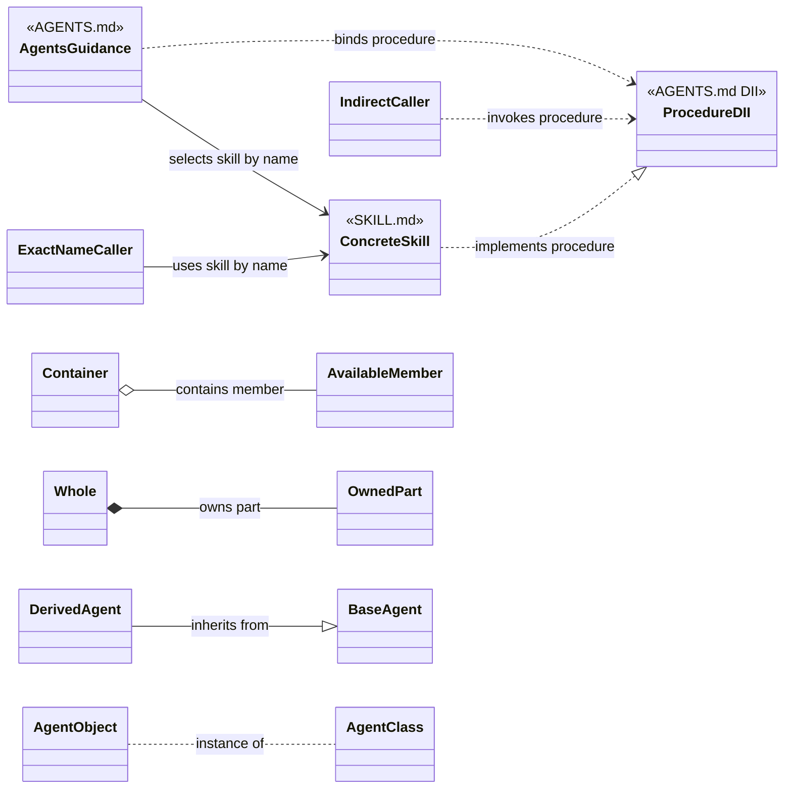

Sequence diagrams use solid messages for requests and actions and dotted messages for returned information:

- **Request or action — A->>B:** The solid line and arrowhead show an action sent to another participant. The label starts with an action verb such as Request, Resolve, Load, Invoke, or Apply.
- **Return — B-->>A:** The dotted line and arrowhead show information returned to the earlier caller. The label starts with Return.
- **Internal transformation — A->>A:** A solid self-message shows work performed inside one participant. The label starts with a transformation verb such as Identify or Build.

## 3. Skills In The Global Agent Space

Skills exist globally in an Agent’s space, much as code modules exist in a process. The space makes a SKILL.md available for loading, but availability alone does not create coupling.

Object-oriented analysis distinguishes three facts:

- whether an invoker knows an exact skill name;
- which procedure name the invoker calls;
- whether another implementation can be selected without changing the invoker.

The procedure name is the common call boundary across these relationships.

- **RULE: RULE-1** A skill is linked to its invoker through a procedure name
  - **SYNOPSIS:** The procedure name identifies the call in the Agent’s global skill space. An exact skill-name reference or an AGENTS.md binding determines how the invoker reaches the implementing SKILL.md.
  - **EXAMPLE:** A Backlog Manager invokes Create Workitem with Add a new Cancel button as its workitem-description parameter.

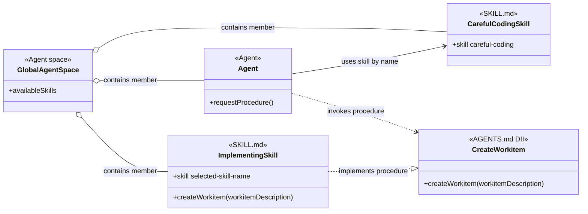

Create Workitem is the human-readable procedure name. createWorkitem(workitemDescription) is the callable-contract notation for the same procedure and its parameter. The +skill members identify concrete SKILL.md files; they are not calls.

The AGENTS.md DII prototype marks the pure-virtual side of the analogy. The SKILL.md contains the procedure that gives the shared procedure name its concrete behavior. ImplementingSkill uses function style because this focused example treats the whole hypothetical skill as one procedure, while CarefulCodingSkill uses only its skill identity because the reference applies the named multi-procedure skill.

## 4. Agent Skills

An Agent Skill is a SKILL.md that an Agent definition references by exact name. The reference can apply to every execution of that Agent role or only when a routing condition is satisfied.

This section covers only Agent-to-skill references. Skill-to-skill relationships are Peer Skills.

- **RULE: RULE-5** An Agent Skill is referenced by its skill name
  - **SYNOPSIS:** The Agent definition knows the exact SKILL.md identity and follows that skill’s procedure names, parameters, and instructions.
  - **EXAMPLE:** Dev Coder names careful-coding directly in its skill list.

- **RULE: RULE-6** An unconditional Agent Skill applies to every execution of the Agent role
  - **SYNOPSIS:** An Agent definition lists the skill without a condition because that dependency belongs to every execution of the role.
  - **EXAMPLE:** Dev Coder lists careful-coding without a condition so every Dev Coder execution applies it.

- **RULE: RULE-7** A condition routes an Agent to a named Agent Skill
  - **SYNOPSIS:** The Agent definition still knows the exact skill name, but it uses that skill only when the declared condition matches the task.
  - **EXAMPLE:** Dev Coder names test-driven-development under the condition that executable tests should guide the implementation.

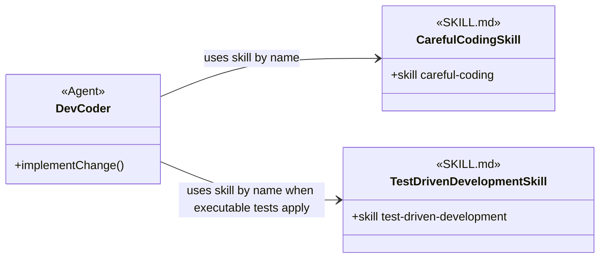

Both references couple Dev Coder to an exact skill name. The condition changes when the reference applies; it does not turn the reference into skills injection.

## 5. Injected Skills

Injected Skills are Injectable Skills selected for an Agent through AGENTS.md. The Agent invokes a shared procedure name and does not name the implementing SKILL.md.

- **RULE: RULE-2** The Agent, AGENTS.md, and the implementing SKILL.md share the same procedure name
  - **SYNOPSIS:** The procedure name connects the Agent’s intent, the injection instruction, and the concrete procedure.
  - **EXAMPLE:** The Backlog Manager needs Create Workitem. AGENTS.md links Create Workitem to create-gitlab-work-item. That SKILL.md defines the Create Workitem procedure for GitLab.

- **RULE: RULE-3** An Injectable Skill encapsulates selectable technology or procedure details
  - **SYNOPSIS:** The Injectable Skill owns the technology-specific or procedure-specific instructions that the Agent should not repeat.
  - **EXAMPLE:** The GitLab skill owns issue search, issue creation, read-back verification, and GitLab identity. The Backlog Manager supplies only the workitem description.

- **RULE: RULE-4** AGENTS.md selects one of several implementations
  - **SYNOPSIS:** AGENTS.md tells the agent which SKILL.md to load when it needs the procedure.
  - **EXAMPLE:** One project links Create Workitem to create-file-work-item. Another links the same procedure name to create-gitlab-work-item.

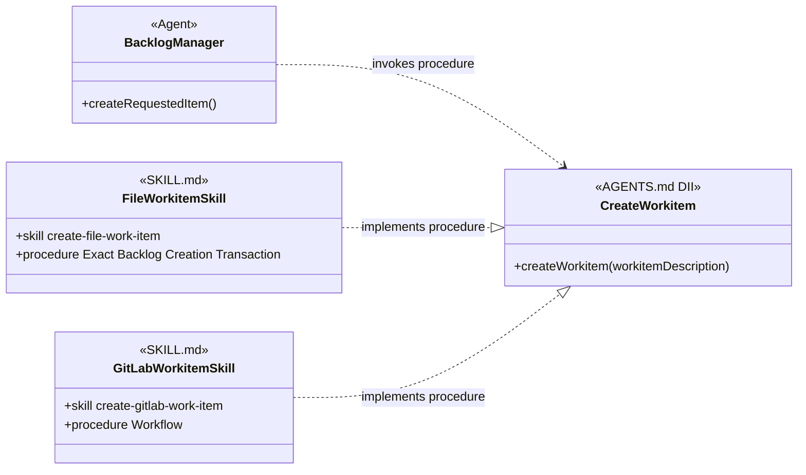

The two SKILL.md files use the same procedure name and parameter meaning. Their internal procedures and provider evidence remain different.

The two Agent dependency styles differ at the selection boundary:

| Relationship | Agent knows | Selection | Substitution |
| --- | --- | --- | --- |
| Agent Skill | The exact skill name and that skill’s procedures. | The Agent definition references the skill for every execution or under a condition. | Replacement usually requires changing the Agent definition. |
| Injected Skill | The procedure name and parameter meaning. | AGENTS.md selects an implementing SKILL.md. | Another SKILL.md can be selected when it implements the same procedure name and parameter meaning. |

## 6. Peer Skills

A Peer Skill complements another SKILL.md. Peer describes a relationship between complementary skills, not a third implementation-selection mechanism.

- **RULE: RULE-28** Peer Skills provide complementary procedures
  - **SYNOPSIS:** One Peer Skill invokes another when the second skill owns a distinct procedure needed inside the first skill’s workflow.
  - **EXAMPLE:** complete-work-item-feature-branch uses create-pull-request to publish a GitHub pull request.

- **RULE: RULE-29** A direct Peer Skill reference couples two SKILL.md files by name
  - **SYNOPSIS:** The invoking SKILL.md knows the exact Peer Skill and follows that peer’s procedure.
  - **EXAMPLE:** complete-work-item-feature-branch names create-pull-request directly for GitHub publication.

- **RULE: RULE-30** A Peer Skill can be selected through skills injection
  - **SYNOPSIS:** The invoking SKILL.md can use a shared procedure name while AGENTS.md selects the complementary implementation.
  - **EXAMPLE:** A development-workflow SKILL.md can invoke Run Project Tests while AGENTS.md selects JUnit or Jest for the project.

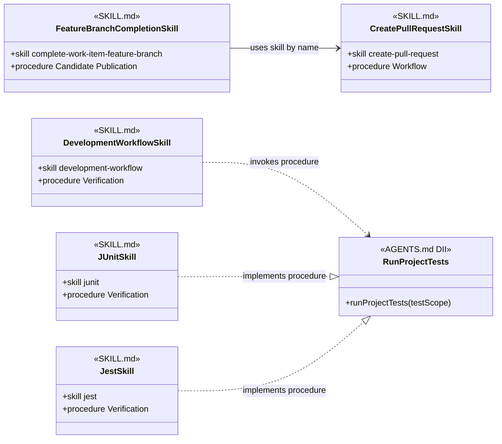

A direct reference is simpler when the invoking skill always needs the same peer. Skills injection preserves the Peer Skill relationship while allowing AGENTS.md to select a different complementary implementation.

## 7. From User Request To Skill Interface

This section separates understanding the user’s request from choosing the implementation.

- **PROCESS: PROCESS-1** Receive a user request
  - **SYNOPSIS:** The agent receives natural language describing the desired backlog change.
  - **EXAMPLE:** The Backlog Manager is told, “Add a new item to create a Cancel button into the backlog.”

- **PROCESS: PROCESS-2** Transform the request into an interface invocation
  - **SYNOPSIS:** The agent identifies the procedure name and constructs the parameter required by the Skill interface.
  - **EXAMPLE:** The agent concludes, “I must Create Workitem with the following workitem description: Add a new Cancel button.”

- **RULE: RULE-8** A procedure parameter carries intent rather than provider details
  - **SYNOPSIS:** The workitem description says what record is needed. The selected SKILL.md decides how its provider represents the record.
  - **EXAMPLE:** Add a new Cancel button does not contain a repository path, GitLab project identifier, label set, or issue URL.

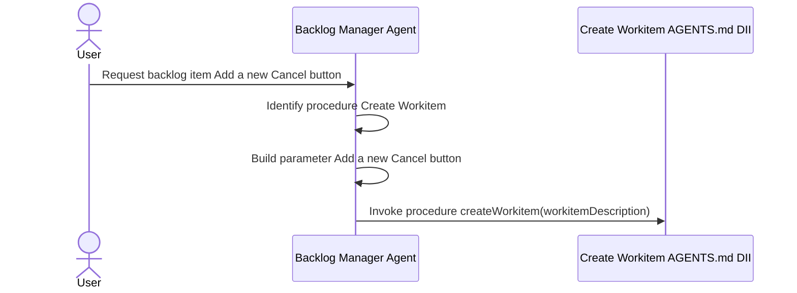

At this point, the agent knows what procedure it needs and what information it will pass. It has not chosen file or GitLab behavior itself.

## 8. Skills Injection Through AGENTS.md

AGENTS.md links a procedure name to a concrete SKILL.md.

- **PROCESS: PROCESS-3** Provide the injection instruction
  - **SYNOPSIS:** Effective project guidance tells the agent which skill to load when the procedure is needed.
  - **EXAMPLE:** “When you need to Create Workitem, load create-gitlab-work-item.”

- **RULE: RULE-9** AGENTS.md owns the binding outside the calling agent
  - **SYNOPSIS:** The Backlog Manager retains the Create Workitem procedure name and parameter meaning when project setup chooses another implementation.
  - **EXAMPLE:** Changing the AGENTS.md instruction from create-gitlab-work-item to create-file-work-item does not change the agent’s workitem description.

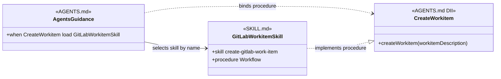

Skills injection is an instruction relationship. AGENTS.md makes the selected SKILL.md available by reference; this model does not require a compiled interface object or a software dependency-injection container.

## 9. Loading And Invoking The Selected SKILL.md

The agent follows the injection instruction only when it needs the Skill interface.

- **PROCESS: PROCESS-4** Load the selected skill
  - **SYNOPSIS:** The agent reads the SKILL.md named by AGENTS.md.
  - **EXAMPLE:** The agent concludes, “AGENTS.md says Create Workitem is supplied by create-gitlab-work-item, so I will load that SKILL.md.”

- **PROCESS: PROCESS-5** Find the procedure with the shared name
  - **SYNOPSIS:** The loaded SKILL.md uses the same procedure name and explains the concrete steps.
  - **EXAMPLE:** The agent concludes, “I will follow the Create Workitem procedure found in this SKILL.md.”

- **PROCESS: PROCESS-6** Invoke the selected procedure with the procedure parameter
  - **SYNOPSIS:** The implementing procedure receives the workitem description that the caller constructed.
  - **EXAMPLE:** The GitLab procedure receives Add a new Cancel button, then applies its own duplicate search, issue creation, and read-back rules.

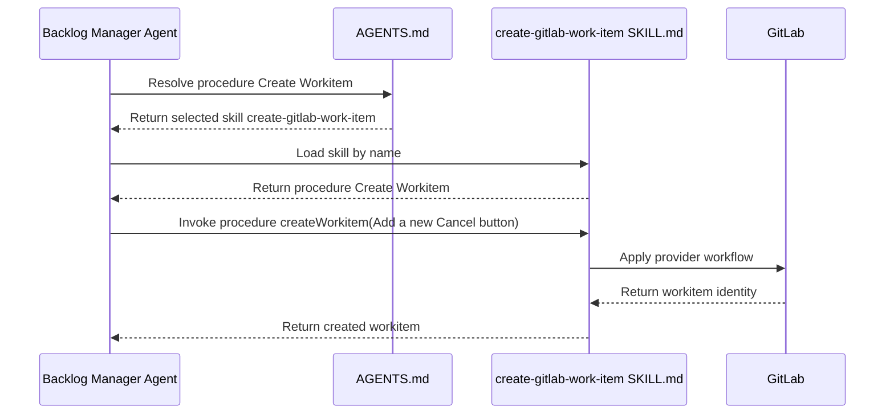

The agent’s request, procedure name, and parameter meaning stay the same when another Injectable Skill is selected. The provider-specific actions come from the loaded SKILL.md.

## 10. One Or More Interfaces In A SKILL.md

The number of Skill interfaces depends on how many independently invocable procedure names the SKILL.md defines.

- **RULE: RULE-10** A simple SKILL.md can export one Skill interface
  - **SYNOPSIS:** One procedure name and its cohesive procedure are enough for a focused skill.
  - **EXAMPLE:** A GitLab workitem-creation SKILL.md exports an implementation of Create Workitem.

- **RULE: RULE-11** A more complex SKILL.md can export several Skill interfaces
  - **SYNOPSIS:** One file can define several procedure names when it contains procedures that callers invoke independently and that do not describe the same cross-cutting concern.
  - **EXAMPLE:** A repository-hosting SKILL.md can export implementations of Create Workitem and Publish Change as separate Skill interfaces.

- **RULE: RULE-12** Multiple interfaces describe the SKILL.md without deciding its structure
  - **SYNOPSIS:** The analysis records each independently invoked procedure name. It does not conclude from that fact alone that the SKILL.md should be split.
  - **EXAMPLE:** Create Workitem and Publish Change remain distinct procedure names even when one SKILL.md implements both.

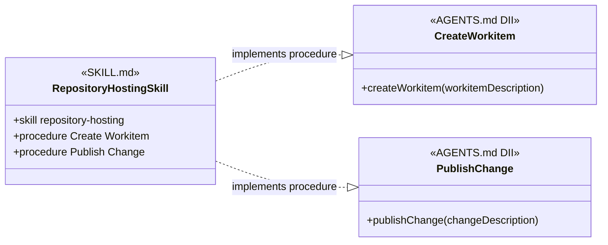

An Agent Skill or a directly referenced Peer Skill can also contain several procedures. Those procedures do not become interchangeable Skill interfaces merely because they share one file. Interchangeability requires the SKILL.md, its invokers, and alternative implementations to share the same procedure names and parameter meanings.

## 11. A Second Injected Example: Deliver Workitem

The same relationship applies to completion procedures.

- **PROCESS: PROCESS-7** Request delivery after review and testing
  - **SYNOPSIS:** A development workflow invokes Deliver Workitem with the accepted change after its required gates pass.
  - **EXAMPLE:** The caller concludes, “Review and testing passed. I must Deliver Workitem with accepted commit abc123.”

- **RULE: RULE-13** AGENTS.md selects the delivery SKILL.md
  - **SYNOPSIS:** The calling workflow uses the same procedure name while project guidance selects direct-main or feature-branch delivery.
  - **EXAMPLE:** AGENTS.md can link Deliver Workitem to complete-work-item-direct-main or complete-work-item-feature-branch.

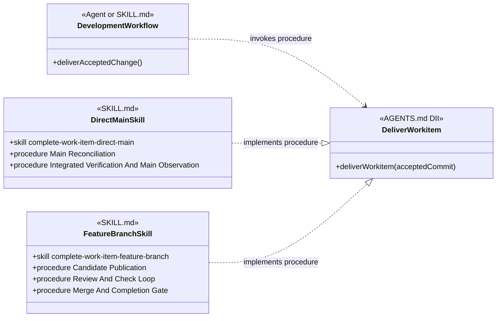

The direct-main SKILL.md can integrate and observe the change on main. The feature-branch SKILL.md can publish a branch, wait for review and checks, and observe the merge. Both procedures are reached through the Deliver Workitem procedure name.

## 12. Agent Classes, Objects, And Skill Dependencies

An Agent can use named Agent Skills and Injected Skills together.

- **RULE: RULE-14** The agent class owns reusable purpose and known dependencies
  - **SYNOPSIS:** The Agent definition states its purpose, the Skill interfaces it invokes, and the Agent Skills it names.
  - **EXAMPLE:** A coding-agent class can name careful-coding directly and invoke Deliver Workitem without naming the delivery SKILL.md.

- **RULE: RULE-15** The agent object owns task context and changing state
  - **SYNOPSIS:** One running instance receives the task, effective AGENTS.md, loaded SKILL.md files, and execution evidence.
  - **EXAMPLE:** One coding-agent object holds accepted commit abc123, knows feature-branch is the injected delivery skill, and is waiting for review.

- **RULE: RULE-16** Technology and project skills can be injectable through shared procedure names
  - **SYNOPSIS:** A technology or project SKILL.md is injectable when it implements a procedure name and parameter meaning that the Agent already invokes.
  - **EXAMPLE:** A testing agent can invoke Run Project Tests with a test scope while AGENTS.md selects a JUnit or Jest SKILL.md for the project.

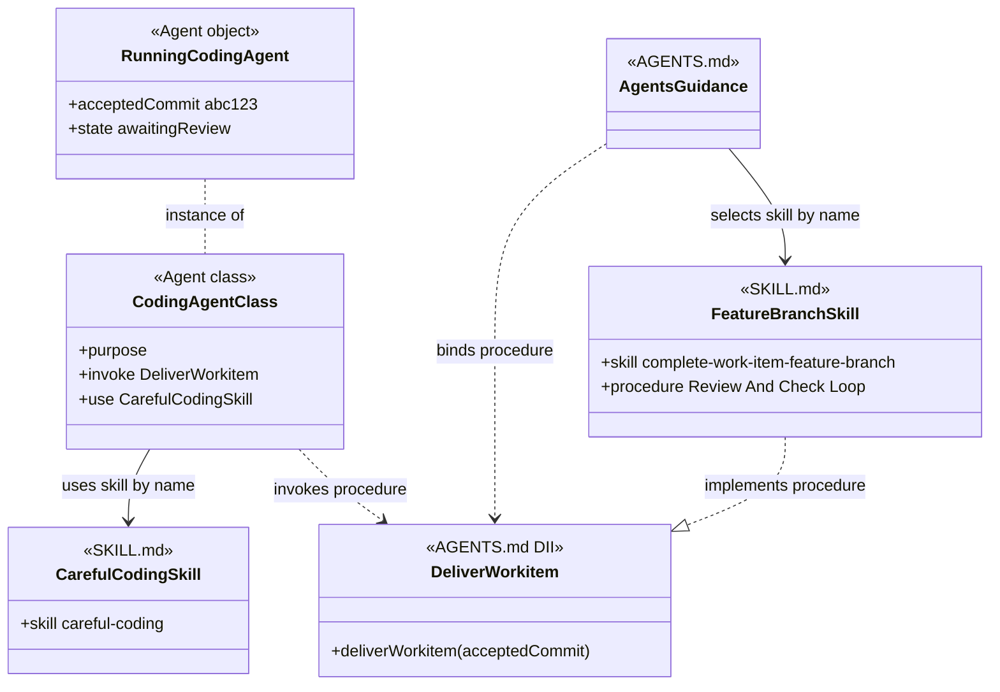

The instance link classifies RunningCodingAgent without treating it as an inherited Agent class.

The remaining relationships show the injection path:

- CodingAgentClass invokes Deliver Workitem;
- AGENTS.md binds that procedure and selects the concrete skill;
- FeatureBranchSkill realizes the DII.

The class-and-object notation describes the analysis. It does not require the harness to construct a software object at runtime.

## 13. Agent Base Classes And Multiple Inheritance

Shared agent relationships can be shown once when several agent classes use the same procedure dependencies and behavior.

- **RULE: RULE-17** A base class represents genuinely shared agent behavior
  - **SYNOPSIS:** A base agent class can own instructions or Skill interface dependencies that mean the same thing for each inheriting agent.
  - **EXAMPLE:** Reviewing Agent can define Review Artifact once for code, documentation, and methodology reviewers.

- **RULE: RULE-18** Shared SKILL.md use does not imply inheritance
  - **SYNOPSIS:** Two agents can load the same skill while retaining different purposes and class relationships.
  - **EXAMPLE:** A coder and a verifier can both use a testing SKILL.md without becoming subclasses of one Testing Agent class.

- **RULE: RULE-19** An agent class can inherit multiple independent base classes
  - **SYNOPSIS:** One agent class can inherit the procedure dependencies and behavior of more than one base agent class.
  - **EXAMPLE:** Dev Security Reviewer can inherit Reviewing Agent and Security Analysis Agent.

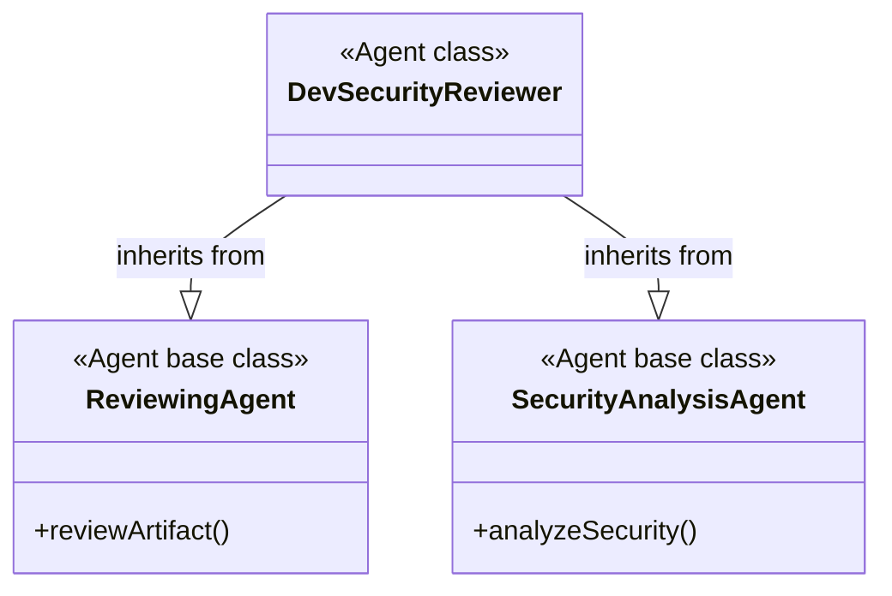

## 14. Constraints

- **RULE: RULE-20** A loaded skill is not necessarily injectable
  - **SYNOPSIS:** A SKILL.md is injectable only when it and its invokers share a procedure name and parameter meaning that another implementation can also use.
  - **EXAMPLE:** An Agent can load code-discovery by name as an Agent Skill without making code-discovery injectable.

- **RULE: RULE-21** Provider-specific procedure details remain inside SKILL.md
  - **SYNOPSIS:** A shared procedure name stabilizes the invoker. It does not make the file and GitLab procedures identical internally.
  - **EXAMPLE:** Create Workitem can produce a repository-backed record through one SKILL.md and a GitLab issue through another while each procedure preserves provider-accurate evidence.

- **RULE: RULE-22** Skills injection and agent inheritance are separate relationships
  - **SYNOPSIS:** AGENTS.md selects a SKILL.md implementation. Agent inheritance shares agent-class behavior.
  - **EXAMPLE:** Injecting a GitLab workitem skill does not make Backlog Manager a subclass of a GitLab agent.

- **RULE: RULE-23** The model remains conceptual
  - **SYNOPSIS:** The document explains the vocabulary and relationships without prescribing a schema, migration order, or repository change sequence.
  - **EXAMPLE:** The diagrams show Create Workitem with the AGENTS.md DII prototype without specifying a new YAML field for declaring it.

## 15. Definition Of Good

- **RULE: RULE-24** The diagrams distinguish AGENTS.md DII from SKILL.md
  - **SYNOPSIS:** Diagrams label an injected shared contract as AGENTS.md DII and a concrete skill definition as SKILL.md.
  - **EXAMPLE:** CreateWorkitem has the AGENTS.md DII stereotype; GitLabWorkitemSkill has the SKILL.md stereotype.

- **RULE: RULE-25** The complete workitem invocation is traceable
  - **SYNOPSIS:** A reader can follow the request from the user, through the agent’s procedure name and parameter, through AGENTS.md injection, to the selected SKILL.md procedure.
  - **EXAMPLE:** Add a new Cancel button becomes createWorkitem(workitemDescription), AGENTS.md selects create-gitlab-work-item, and that SKILL.md performs the GitLab procedure.

- **RULE: RULE-26** Direct and injected dependency styles have valid uses
  - **SYNOPSIS:** Agent Skills and direct Peer Skill references support exact dependencies. Injected Skills support substitution.
  - **EXAMPLE:** Dev Coder names careful-coding as an Agent Skill, complete-work-item-feature-branch names create-pull-request as a Peer Skill, and Create Workitem uses injection.

- **RULE: RULE-27** Every assertion includes an example
  - **SYNOPSIS:** Each GOAL, RULE, PROCESS, and other structured assertion is followed by an EXAMPLE.
  - **EXAMPLE:** RULE-20 defines the Injectable Skill boundary and illustrates it with code-discovery.

- **RULE: RULE-32** Concrete skill notation distinguishes identity from procedure selection
  - **SYNOPSIS:** A SKILL.md node uses +skill for its identity, function style only when the whole skill is one cohesive procedure, and +procedure with a section title or clarifying keywords when only part of a multi-procedure skill is relevant.
  - **EXAMPLE:** An agent-claim node can show +skill agent-claim and +procedure Claim Events without implying that all of agent-claim is one function.

- **RULE: RULE-37** Repeated relationship meanings use the same line and label
  - **SYNOPSIS:** Every method diagram uses the Relationship Notation convention so a visual change means a semantic change rather than a wording preference.
  - **EXAMPLE:** Every exact-name skill dependency uses a solid association labeled uses skill by name, while every caller-to-DII dependency uses a dotted dependency labeled invokes procedure.

## Applied Models

The reusable method ends here. Current applications to the established skill groups are maintained as independent documents under [Object-Oriented Skill Group Models](object-oriented-skill-group-models.md).

## Authoritative Inputs

- The user-supplied object-oriented analysis and vocabulary corrections for this document.
- [Agentic Configuration](agentic-configuration.html)
- [Work-Item Provider And Completion Contracts](work-item-provider-and-completion-contracts.md)
- [Create File Work Item](../skills/create-file-work-item/SKILL.md)
- [Create GitLab Work Item](../skills/create-gitlab-work-item/SKILL.md)
- [Complete Work Item Direct Main](../skills/complete-work-item-direct-main/SKILL.md)
- [Complete Work Item Feature Branch](../skills/complete-work-item-feature-branch/SKILL.md)
- [Create Pull Request](../skills/create-pull-request/SKILL.md)
- [Careful Coding](../skills/careful-coding/SKILL.md)
- [Test-Driven Development](../skills/test-driven-development/SKILL.md)
- [JUnit](../skills/junit/SKILL.md)
- [Jest](../skills/jest/SKILL.md)
- [Dev Coder](../agents/roles/dev-activities/dev-coder.role.yaml)
- [Mermaid Class Diagram Relationships](https://mermaid.js.org/syntax/classDiagram.html)
- [Mermaid Sequence Diagram Messages](https://mermaid.js.org/syntax/sequenceDiagram)
