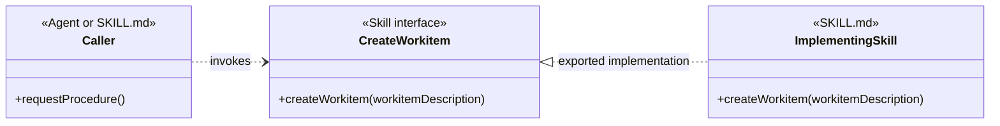
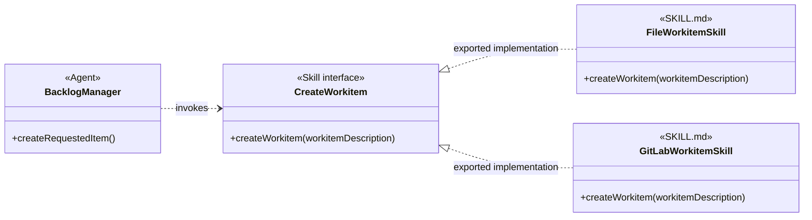
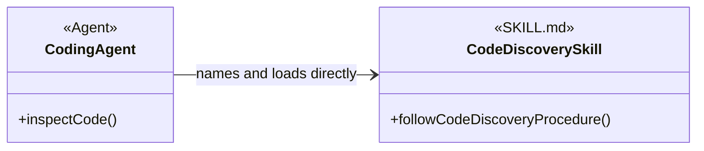
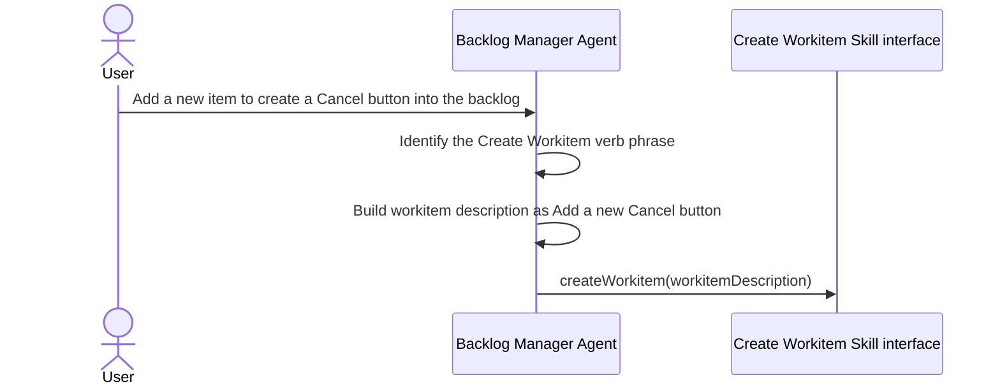
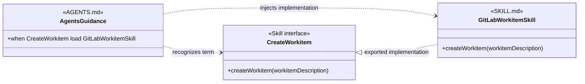
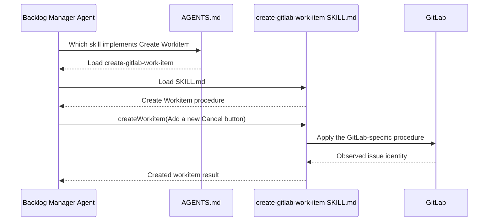
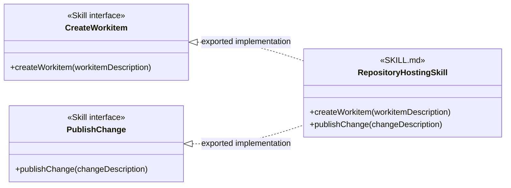
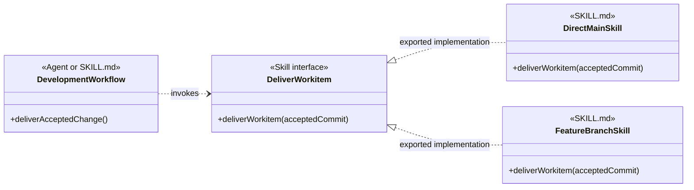
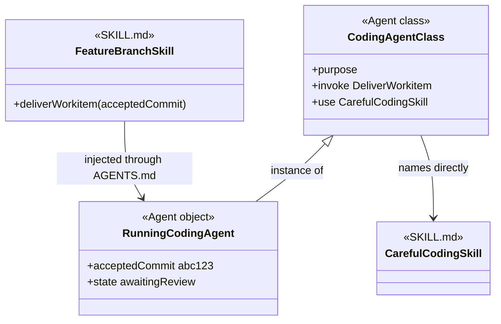

# Object-Oriented Analysis Of Agents And Skills

## Scope

This document defines a conceptual vocabulary for analyzing agents, Skill interfaces, and SKILL.md files. It explains relationships through examples while defining no schema, migration, or repository change sequence.

## 1. Finality

- **GOAL: GOAL-1** Give callers a stable vocabulary for invoking skill procedures
  - **SYNOPSIS:** An agent or another skill can use a shared verb phrase without knowing which SKILL.md supplies the procedure.
  - **EXAMPLE:** A Backlog Manager uses Create Workitem with a workitem description. The caller does not need to know whether the record will be a file or a GitLab issue.

- **GOAL: GOAL-2** Distinguish Injectable Skills from Coupled Skills
  - **SYNOPSIS:** An Injectable Skill is selected through shared vocabulary and AGENTS.md. A Coupled Skill is named directly by its caller.
  - **EXAMPLE:** Create Workitem can select a file-backed or GitLab-backed Injectable Skill. A coding agent can deliberately name code-discovery as a Coupled Skill.

- **GOAL: GOAL-3** Treat a running agent as an object with context and state
  - **SYNOPSIS:** An agent definition is comparable to a class. One running agent or subagent is comparable to an object that combines the definition with a task, loaded skills, and changing state.
  - **EXAMPLE:** A running Backlog Manager has the user’s request, the effective AGENTS.md instructions, the selected workitem SKILL.md, and the current result of creating the item.

## 2. Information Model

| Term | Meaning | Example |
| --- | --- | --- |
| Skill interface | A shared verb phrase and parameter meaning used by callers and implementing SKILL.md files. | Create Workitem accepts a workitem description. |
| Interface term | The verb phrase that identifies the procedure a caller needs. | Create Workitem. |
| Interface parameter | Information passed by the caller to the procedure named by the interface term. | Workitem description: Add a new Cancel button. |
| Procedure | The instructions in a SKILL.md that explain how to perform the interface term. | Create a GitLab issue, read it back, and return its identity. |
| SKILL.md | The concrete skill definition that contains one or more procedures. This is the concrete implementation side of the analogy. | create-gitlab-work-item/SKILL.md contains the GitLab workitem-creation procedure. |
| Injectable Skill | A SKILL.md written to export an implementation of shared Skill interface vocabulary so AGENTS.md can select it without changing the caller. | create-file-work-item and create-gitlab-work-item can export implementations of Create Workitem. |
| Coupled Skill | A SKILL.md used by exact identity because its caller knows that particular skill and its vocabulary. | A coding agent names code-discovery directly. |
| Skills injection | An AGENTS.md instruction that links a Skill interface term to the SKILL.md an agent should load. | When you need to Create Workitem, load create-gitlab-work-item. |
| Agent class | A reusable agent definition containing purpose, instructions, known dependencies, and outputs. | Backlog Manager. |
| Agent object | One task-bound execution of an agent class with context and changing state. | The Backlog Manager processing the Cancel button request. |

- **RULE: RULE-1** Name a Skill interface with a verb phrase
  - **SYNOPSIS:** The interface term says what the caller needs done. The parameter carries the caller’s task-specific information.
  - **EXAMPLE:** Create Workitem is the verb phrase. Add a new Cancel button is the workitem-description parameter.

The Skill interface is the pure-virtual side of the analogy. The SKILL.md contains the procedure that gives the verb phrase its concrete behavior.

## 3. Injectable Skills

An Injectable Skill is designed for substitution through a shared linking vocabulary.

- **RULE: RULE-2** Use the same interface term in the caller, AGENTS.md, and the implementing SKILL.md
  - **SYNOPSIS:** The shared verb phrase connects the caller’s intent, the injection instruction, and the concrete procedure.
  - **EXAMPLE:** The Backlog Manager needs Create Workitem. AGENTS.md links Create Workitem to create-gitlab-work-item. That SKILL.md defines the Create Workitem procedure for GitLab.

- **RULE: RULE-3** Encapsulate one selectable technology or procedure behind the shared vocabulary
  - **SYNOPSIS:** The Injectable Skill owns the technology-specific or procedure-specific instructions that the caller should not repeat.
  - **EXAMPLE:** The GitLab skill owns issue search, issue creation, read-back verification, and GitLab identity. The Backlog Manager supplies only the workitem description.

- **RULE: RULE-4** Select one of several implementations through skills injection
  - **SYNOPSIS:** AGENTS.md tells the agent which SKILL.md to load when it needs the interface term.
  - **EXAMPLE:** One project links Create Workitem to create-file-work-item. Another links the same term to create-gitlab-work-item.

The two SKILL.md files use the same Skill interface term and parameter meaning. Their internal procedures and provider evidence remain different.

## 4. Coupled Skills

A skill is not injectable merely because an agent can load it.

- **RULE: RULE-5** Treat a skill as Coupled when it was not written to implement shared interface vocabulary
  - **SYNOPSIS:** The caller knows the exact SKILL.md and follows that skill’s own terms and procedure.
  - **EXAMPLE:** An agent that explicitly loads code-discovery depends on code-discovery rather than on a shared Discover Code interface implemented by several skills.

- **RULE: RULE-6** Use coupling deliberately for many core skills
  - **SYNOPSIS:** A Coupled Skill is the simpler pattern when the exact skill is part of the agent’s core behavior and no alternative implementation needs to replace it.
  - **EXAMPLE:** A core coding workflow can name careful-coding directly when careful-coding is the intended procedure and no alternative implementation needs to replace it.

- **RULE: RULE-7** Do not imply substitutability for a Coupled Skill
  - **SYNOPSIS:** Replacing a Coupled Skill can require changes to the calling agent or using skill because the caller depends on that skill’s particular vocabulary.
  - **EXAMPLE:** Replacing code-discovery with a differently structured investigation skill may require the caller’s instructions to change as well.

The two dependency styles serve different purposes:

| Relationship | Caller knows | Selection | Substitution |
| --- | --- | --- | --- |
| Injectable Skill | The Skill interface term and parameter meaning. | AGENTS.md selects a SKILL.md. | Another SKILL.md can be selected when it implements the same vocabulary. |
| Coupled Skill | The exact skill and its own procedure vocabulary. | The caller names the skill directly. | Replacement usually requires changing the caller. |

## 5. From User Request To Skill Interface

This section separates understanding the user’s request from choosing the implementation.

- **PROCESS: PROCESS-1** Receive a user request
  - **SYNOPSIS:** The agent receives natural language describing the desired backlog change.
  - **EXAMPLE:** The Backlog Manager is told, “Add a new item to create a Cancel button into the backlog.”

- **PROCESS: PROCESS-2** Transform the request into an interface invocation
  - **SYNOPSIS:** The agent identifies the verb phrase and constructs the parameter required by the Skill interface.
  - **EXAMPLE:** The agent concludes, “I must Create Workitem with the following workitem description: Add a new Cancel button.”

- **RULE: RULE-8** Keep provider details out of the interface parameter
  - **SYNOPSIS:** The workitem description says what record is needed. The selected SKILL.md decides how its provider represents the record.
  - **EXAMPLE:** Add a new Cancel button does not contain a repository path, GitLab project identifier, label set, or issue URL.

At this point, the agent knows what procedure it needs and what information it will pass. It has not chosen file or GitLab behavior itself.

## 6. Skills Injection Through AGENTS.md

AGENTS.md links the Skill interface term to a concrete SKILL.md.

- **PROCESS: PROCESS-3** Provide the injection instruction
  - **SYNOPSIS:** Effective project guidance tells the agent which skill to load when the interface term is needed.
  - **EXAMPLE:** “When you need to Create Workitem, load create-gitlab-work-item.”

- **RULE: RULE-9** Keep the binding outside the calling agent
  - **SYNOPSIS:** The Backlog Manager retains the Create Workitem vocabulary when project setup chooses another implementation.
  - **EXAMPLE:** Changing the AGENTS.md instruction from create-gitlab-work-item to create-file-work-item does not change the agent’s workitem description.

Skills injection is an instruction relationship. AGENTS.md makes the selected SKILL.md available by reference; this model does not require a compiled interface object or a software dependency-injection container.

## 7. Loading And Invoking The Selected SKILL.md

The agent follows the injection instruction only when it needs the Skill interface.

- **PROCESS: PROCESS-4** Load the selected skill
  - **SYNOPSIS:** The agent reads the SKILL.md named by AGENTS.md.
  - **EXAMPLE:** The agent concludes, “AGENTS.md says Create Workitem is supplied by create-gitlab-work-item, so I will load that SKILL.md.”

- **PROCESS: PROCESS-5** Find the procedure under the shared term
  - **SYNOPSIS:** The loaded SKILL.md uses the same vocabulary and explains the concrete steps.
  - **EXAMPLE:** The agent concludes, “I will follow the Create Workitem procedure found in this SKILL.md.”

- **PROCESS: PROCESS-6** Pass the interface parameter to the procedure
  - **SYNOPSIS:** The implementing procedure receives the workitem description that the caller constructed.
  - **EXAMPLE:** The GitLab procedure receives Add a new Cancel button, then applies its own duplicate search, issue creation, and read-back rules.

The agent’s request and the Skill interface stay the same when another Injectable Skill is selected. The provider-specific actions come from the loaded SKILL.md.

## 8. One Or More Interfaces In A SKILL.md

The number of Skill interfaces depends on how much independent vocabulary the SKILL.md defines.

- **RULE: RULE-10** A simple SKILL.md can export one Skill interface
  - **SYNOPSIS:** One verb phrase and its cohesive procedure are enough for a focused skill.
  - **EXAMPLE:** A GitLab workitem-creation SKILL.md exports an implementation of Create Workitem.

- **RULE: RULE-11** A more complex SKILL.md can export several Skill interfaces
  - **SYNOPSIS:** One file can define several verb phrases when it contains procedures that callers invoke independently and that do not describe the same cross-cutting concern.
  - **EXAMPLE:** A repository-hosting SKILL.md can export implementations of Create Workitem and Publish Change as separate Skill interfaces.

- **RULE: RULE-12** Multiple interfaces describe the SKILL.md without deciding its structure
  - **SYNOPSIS:** The analysis records each independently invoked term. It does not conclude from that fact alone that the SKILL.md should be split.
  - **EXAMPLE:** Create Workitem and Publish Change remain distinct interface terms even when one SKILL.md implements both.

A Coupled Skill can also contain several procedures. They are not interchangeable Skill interfaces unless the SKILL.md and its callers were written to share those terms with alternative implementations.

## 9. A Second Injectable Example: Deliver Workitem

The same relationship applies to completion procedures.

- **PROCESS: PROCESS-7** Request delivery after review and testing
  - **SYNOPSIS:** A development workflow invokes Deliver Workitem with the accepted change after its required gates pass.
  - **EXAMPLE:** The caller concludes, “Review and testing passed. I must Deliver Workitem with accepted commit abc123.”

- **RULE: RULE-13** Let AGENTS.md select the delivery SKILL.md
  - **SYNOPSIS:** The calling workflow uses the same interface term while project guidance selects direct-main or feature-branch delivery.
  - **EXAMPLE:** AGENTS.md can link Deliver Workitem to complete-work-item-direct-main or complete-work-item-feature-branch.

The direct-main SKILL.md can integrate and observe the change on main. The feature-branch SKILL.md can publish a branch, wait for review and checks, and observe the merge. Both procedures are reached through the Deliver Workitem vocabulary.

## 10. Agent Classes, Objects, And Skill Dependencies

An agent can use both dependency styles.

- **RULE: RULE-14** Put reusable purpose and known dependencies on the agent class
  - **SYNOPSIS:** The agent definition states its purpose, the Skill interfaces it invokes, and any Coupled Skills it deliberately names.
  - **EXAMPLE:** A coding-agent class can name careful-coding directly and invoke Deliver Workitem without naming the delivery SKILL.md.

- **RULE: RULE-15** Put task context and changing state on the agent object
  - **SYNOPSIS:** One running instance receives the task, effective AGENTS.md, loaded SKILL.md files, and execution evidence.
  - **EXAMPLE:** One coding-agent object holds accepted commit abc123, knows feature-branch is the injected delivery skill, and is waiting for review.

- **RULE: RULE-16** Inject technology and project skills through the same linking vocabulary
  - **SYNOPSIS:** A technology or project SKILL.md is injectable when it implements a Skill interface term that the agent or a using skill already invokes.
  - **EXAMPLE:** A testing agent can invoke Run Project Tests with a test scope while AGENTS.md selects a JUnit or Jest SKILL.md for the project.

The class-and-object notation describes the analysis. It does not require the harness to construct a software object at runtime.

## 11. Agent Base Classes And Multiple Inheritance

Shared agent relationships can be shown once when several agent classes use the same vocabulary and behavior.

- **RULE: RULE-17** Use a base class for genuinely shared agent behavior
  - **SYNOPSIS:** A base agent class can own instructions or Skill interface dependencies that mean the same thing for each inheriting agent.
  - **EXAMPLE:** Reviewing Agent can define Review Artifact once for code, documentation, and methodology reviewers.

- **RULE: RULE-18** Do not infer inheritance from shared SKILL.md use alone
  - **SYNOPSIS:** Two agents can load the same skill while retaining different purposes and class relationships.
  - **EXAMPLE:** A coder and a verifier can both use a testing SKILL.md without becoming subclasses of one Testing Agent class.

- **RULE: RULE-19** Allow multiple inheritance when independent shared roles both apply
  - **SYNOPSIS:** One agent class can inherit the vocabulary and behavior of more than one base agent class.
  - **EXAMPLE:** Dev Security Reviewer can inherit Reviewing Agent and Security Analysis Agent.

## 12. Constraints

- **RULE: RULE-20** Do not call every loaded skill injectable
  - **SYNOPSIS:** A SKILL.md is injectable only when it and its callers share a Skill interface term and parameter meaning that another implementation can also use.
  - **EXAMPLE:** Loading code-discovery does not make it injectable when the caller names code-discovery itself.

- **RULE: RULE-21** Do not erase provider-specific procedure details
  - **SYNOPSIS:** Shared vocabulary stabilizes the caller. It does not make the file and GitLab procedures identical internally.
  - **EXAMPLE:** Create Workitem can produce a repository-backed record through one SKILL.md and a GitLab issue through another while each procedure preserves provider-accurate evidence.

- **RULE: RULE-22** Keep skills injection separate from agent inheritance
  - **SYNOPSIS:** AGENTS.md selects a SKILL.md implementation. Agent inheritance shares agent-class behavior.
  - **EXAMPLE:** Injecting a GitLab workitem skill does not make Backlog Manager a subclass of a GitLab agent.

- **RULE: RULE-23** Keep this document conceptual
  - **SYNOPSIS:** The document explains the vocabulary and relationships without prescribing a schema, migration order, or repository change sequence.
  - **EXAMPLE:** The diagrams show Create Workitem as a Skill interface without specifying a new YAML field for declaring it.

## 13. Definition Of Good

- **RULE: RULE-24** Use the requested diagram prototypes
  - **SYNOPSIS:** Diagrams label shared contracts as Skill interface and concrete definitions as SKILL.md.
  - **EXAMPLE:** CreateWorkitem has the Skill interface stereotype; GitLabWorkitemSkill has the SKILL.md stereotype.

- **RULE: RULE-25** Make the complete workitem invocation understandable
  - **SYNOPSIS:** A reader can follow the request from the user, through the agent’s verb phrase and parameter, through AGENTS.md injection, to the selected SKILL.md procedure.
  - **EXAMPLE:** Add a new Cancel button becomes createWorkitem(workitemDescription), AGENTS.md selects create-gitlab-work-item, and that SKILL.md performs the GitLab procedure.

- **RULE: RULE-26** Explain both dependency styles without preferring one universally
  - **SYNOPSIS:** Injectable Skills support substitution. Coupled Skills support simpler direct dependencies where substitution is unnecessary.
  - **EXAMPLE:** Create Workitem uses injection while careful-coding can remain a deliberately Coupled Skill.

- **RULE: RULE-27** Give every assertion an example
  - **SYNOPSIS:** Each GOAL, RULE, PROCESS, and other structured assertion is followed by an EXAMPLE.
  - **EXAMPLE:** RULE-20 defines the Injectable Skill boundary and illustrates it with code-discovery.

## Authoritative Inputs

- The user-supplied object-oriented analysis and vocabulary corrections in the current discussion.
- [Agentic Configuration](agentic-configuration.html)
- [Work-Item Provider And Completion Contracts](work-item-provider-and-completion-contracts.md)
- [Create File Work Item](../skills/create-file-work-item/SKILL.md)
- [Create GitLab Work Item](../skills/create-gitlab-work-item/SKILL.md)
- [Complete Work Item Direct Main](../skills/complete-work-item-direct-main/SKILL.md)
- [Complete Work Item Feature Branch](../skills/complete-work-item-feature-branch/SKILL.md)
- [Code Discovery](../skills/code-discovery/SKILL.md)
- [Careful Coding](../skills/careful-coding/SKILL.md)
- [JUnit](../skills/junit/SKILL.md)
- [Jest](../skills/jest/SKILL.md)
- [Dev Coder](../agents/roles/dev-activities/dev-coder.role.yaml)
- [Dev Orchestrator](../agents/roles/dev-activities/dev-orchestrator.role.yaml)
- [Dev Backlog Coordinator](../agents/roles/dev-activities/dev-backlog-coordinator.role.yaml)
- [Dev Backlog Steward](../agents/roles/dev-activities/dev-backlog-steward.role.yaml)
