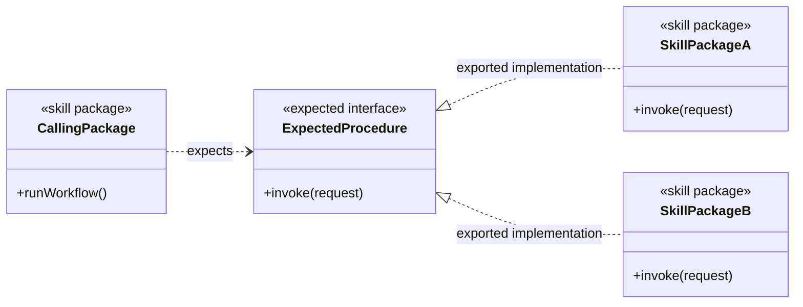
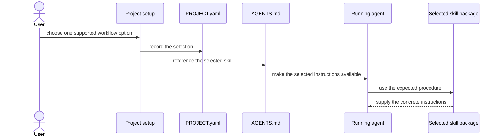
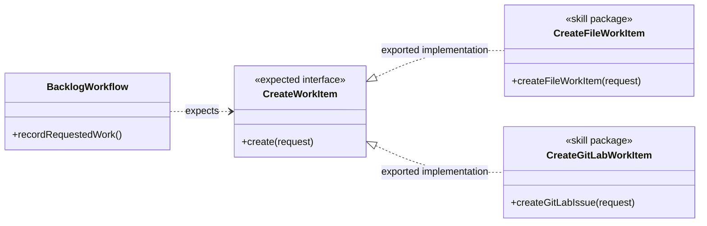
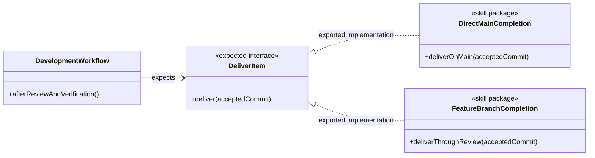
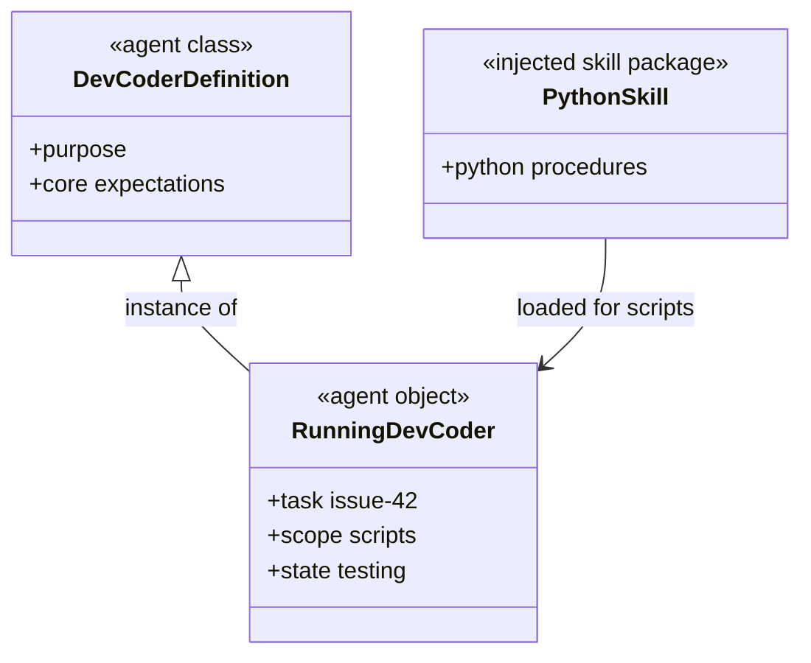
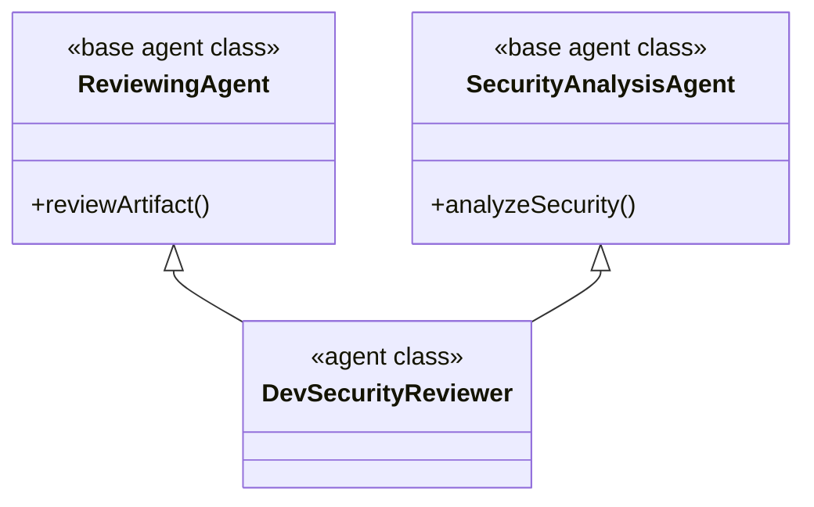

# Object-Oriented Analysis Of Agents And Skills

## Status

This document records the analysis proposed in the current discussion. It does not change any skill definition, agent definition, schema, generator, project configuration, or generated guidance.

The examples use three labels:

- CURRENT means the behavior is present in the repository now.
- PROPOSED means the relationship is part of this analysis but is not implemented yet.
- HYPOTHETICAL means the example exists only to explain the notation.

## 1. Purpose

- **GOAL: GOAL-1** Describe skills as packages with callable procedures
  - **SYNOPSIS:** A skill is analyzed as a package that exposes one or more procedures. Those procedures form one or more interfaces.
  - **EXAMPLE:** PROPOSED: create-file-work-item exposes a Create Work Item procedure backed by a repository file.

- **GOAL: GOAL-2** Separate an expected interface from its implementations
  - **SYNOPSIS:** A caller can expect a procedure without naming the skill package that supplies it. One of the loaded skill packages supplies the implementation.
  - **EXAMPLE:** PROPOSED: a development workflow expects Deliver Item. The selected implementation comes from complete-work-item-direct-main or complete-work-item-feature-branch.

- **GOAL: GOAL-3** Describe an executing agent as an object with state
  - **SYNOPSIS:** An agent definition is comparable to a class. One running agent or subagent is comparable to an object whose task context and execution state change over time.
  - **EXAMPLE:** CURRENT ANALOGUE: the dev-coder definition is reusable. A running dev-coder assigned issue 42 has a particular checkout, changed-file set, candidate commit, and verification state.

- **GOAL: GOAL-4** Prepare an analysis that can later be applied to all skills
  - **SYNOPSIS:** After this model is reviewed, a separate phase can inventory every skill, identify its procedures, and map expected interfaces to exported implementations.
  - **EXAMPLE:** PROPOSED: the later inventory would place create-file-work-item and create-gitlab-work-item under the same candidate Create Work Item interface, then review whether that mapping is accurate.

## 2. Vocabulary

| Term | Meaning here | Concrete example |
| --- | --- | --- |
| Skill package | One skill together with the instructions and resources it owns. | CURRENT: complete-work-item-feature-branch is one skill package. |
| Procedure | An action described by a skill package. | CURRENT: create-gitlab-work-item describes how to create and read back one GitLab issue. |
| Expected interface | A procedure, or coherent group of procedures, that a caller says it needs without naming the implementing package. This is the pure-virtual side of the analogy. | PROPOSED: Create Work Item is expected by a backlog workflow. |
| Exported implementation | The procedure definition supplied by a concrete skill package. This is the concrete side of the analogy. | PROPOSED: create-file-work-item exports the file-backed implementation of Create Work Item. |
| Setup binding | The setup choice that causes one implementing skill package to be referenced in effective AGENTS.md guidance. | CURRENT ANALOGUE: Persistence file causes generated guidance to reference create-file-work-item and manage-file-work-items. |
| DII-style dependency | The term used in this analysis for a caller that knows the needed interface but does not know the selected implementing package. This document does not add a runtime mechanism to that term. | PROPOSED: a caller invokes Deliver Item while setup determines which completion skill is loaded. |
| Agent class | The reusable agent definition: its purpose, instructions, known dependencies, and outputs. | CURRENT ANALOGUE: the dev-coder role definition. |
| Agent object | One task-bound execution of an agent definition, with context and changing state. | CURRENT ANALOGUE: one dev-coder working on issue 42 in a particular worktree. |
| Base agent class | Shared agent behavior shown once and inherited by several agent classes. | HYPOTHETICAL: Reviewing Agent supplies common read-only review behavior to several specialized reviewers. |

- **RULE: RULE-1** Do not assign special meaning to unrequested architecture terms
  - **SYNOPSIS:** This model uses package, procedure, interface, implementation, class, object, inheritance, and setup binding. It does not introduce ports, a composition root, extension slots, a context assembler, interface versions, or provider cardinality.
  - **EXAMPLE:** Say “Dev Orchestrator expects Deliver Item.” Do not say “Dev Orchestrator has a delivery port.”

## 3. Skill Package Assertions

- **RULE: RULE-2** A skill package can export one interface
  - **SYNOPSIS:** A focused skill can define the procedures for one interface.
  - **EXAMPLE:** PROPOSED: create-gitlab-work-item exports Create Work Item using GitLab issue operations.

- **RULE: RULE-3** A skill package can export more than one interface
  - **SYNOPSIS:** Independent procedure groups in the same package can be represented as separate exported interfaces.
  - **EXAMPLE:** HYPOTHETICAL: if one git-hosting skill defined both Create Work Item and Publish Delivery as independent procedure groups, the analysis would show two exported interfaces from that package.

- **RULE: RULE-4** Multiple independent exports identify a review point, not an automatic split
  - **SYNOPSIS:** A package that exports more than one independent interface is highlighted so reviewers can decide whether it should remain whole or be split later.
  - **EXAMPLE:** HYPOTHETICAL: the git-hosting package above would be highlighted because issue creation and code publication could change independently. This document would not split it.

- **RULE: RULE-5** A skill package can depend on an expected interface
  - **SYNOPSIS:** The dependent package names the procedure it needs, while setup supplies a skill package that defines that procedure.
  - **EXAMPLE:** PROPOSED: an overall development package says “Deliver the accepted item” without naming either complete-work-item-direct-main or complete-work-item-feature-branch.

The notation for an expected interface and two exported implementations is:

In this diagram, ExpectedProcedure is the pure-virtual side of the analogy. SkillPackageA and SkillPackageB contain the actual instructions.

## 4. Setup Binding And DII-Style Use

- **RULE: RULE-6** Setup selects the implementing skill package
  - **SYNOPSIS:** The project configuration records a selection and generated AGENTS.md guidance references the selected skill package.
  - **EXAMPLE:** CURRENT ANALOGUE: workflow_selection.persistence can select file, which renders references to create-file-work-item and manage-file-work-items. workflow_selection.commit can independently select direct-main, which renders a reference to complete-work-item-direct-main.

- **RULE: RULE-7** The caller does not repeat the selected package’s procedure
  - **SYNOPSIS:** The caller states when it needs the interface. The loaded skill package explains how the selected procedure works.
  - **EXAMPLE:** PROPOSED: after review and verification pass, Dev Orchestrator says “Deliver the accepted commit.” The selected completion skill supplies either the direct-main or feature-branch procedure.

- **RULE: RULE-8** DII-style use is an instruction relationship in this proposal
  - **SYNOPSIS:** The proposal does not assume a compiled interface table, a service locator, or a new runtime. The agent receives AGENTS.md and skill instructions in context and follows the selected procedure.
  - **EXAMPLE:** CURRENT ANALOGUE: generated root guidance says which Commit skill to use. The harness loads natural-language guidance; it does not instantiate a software interface object.

## 5. Example: Create Work Item

Create Work Item is a candidate interface from the user’s scenario, not a declaration already present in the skill files.

- **PROCESS: PROCESS-1** Request creation of one durable work item
  - **SYNOPSIS:** A backlog workflow provides the work description and asks the expected Create Work Item interface to create the authoritative record.
  - **EXAMPLE:** PROPOSED: a retry-support request is passed to Create Work Item without the caller choosing a file path or invoking GitLab directly.

- **MODULE: MODULE-1** File-backed implementation
  - **SYNOPSIS:** create-file-work-item supplies the repository-file procedure.
  - **EXAMPLE:** CURRENT BEHAVIOR USED BY THE PROPOSAL: it creates an authoritative file under backlog with exclusive creation, validates it, and commits only the exact provider paths.

- **MODULE: MODULE-2** GitLab-backed implementation
  - **SYNOPSIS:** create-gitlab-work-item supplies the GitLab issue procedure.
  - **EXAMPLE:** CURRENT BEHAVIOR USED BY THE PROPOSAL: it checks for duplicates, creates one issue, reads it back, and returns its GitLab identity and URL.

- **RULE: RULE-9** Keep the current agent-ownership question visible
  - **SYNOPSIS:** The interface diagram does not decide which current agent performs provider mutation.
  - **EXAMPLE:** PROPOSED SCENARIO: Backlog Coordinator can request Create Work Item. CURRENT: Dev Backlog Coordinator delegates durable provider mutation to Dev Backlog Steward, which applies the selected creation or management skill. Applying this model must decide how to preserve that responsibility boundary.

## 6. Example: Deliver Item

Deliver Item is a second candidate interface. The current repository calls the configured choice Commit.

- **PROCESS: PROCESS-2** Deliver an accepted change
  - **SYNOPSIS:** The development workflow requests delivery only after its required review and verification have passed.
  - **EXAMPLE:** CURRENT ANALOGUE: Dev Orchestrator applies the effective Commit-selected skill to the accepted direct or combined commit after independent review and verification.

- **MODULE: MODULE-3** Direct-main implementation
  - **SYNOPSIS:** complete-work-item-direct-main supplies delivery by integrating the accepted commit into the configured main branch, verifying the integrated state, and observing main reachability.
  - **EXAMPLE:** CURRENT: an accepted candidate is integrated on main, the focused post-integration check passes, and the delivered commit is observed on main before the skill returns READY.

- **MODULE: MODULE-4** Feature-branch implementation
  - **SYNOPSIS:** complete-work-item-feature-branch supplies delivery through one feature branch, host publication, review corrections, required checks, observed merge, and base-branch reachability.
  - **EXAMPLE:** CURRENT: the skill pushes the intended branch, publishes a pull request or merge request using host-accurate terminology, returns AWAITING_REVIEW while gates are pending, and returns READY only after merge is observed.

- **UNCERTAINTY:** The two current completion skills do not return identical intermediate states
  - **EXAMPLE:** complete-work-item-feature-branch can return AWAITING_REVIEW, while complete-work-item-direct-main returns READY or BLOCKED. Review must decide whether Deliver Item is one interface whose invocation may continue over time or whether smaller interfaces are needed.

## 7. Agent Classes, Objects, And Injected Skills

- **RULE: RULE-10** An agent definition is analyzed as a class
  - **SYNOPSIS:** The class contains reusable purpose and instructions and knows the core interfaces required for that purpose.
  - **EXAMPLE:** CURRENT ANALOGUE: dev-coder defines the reusable objective of producing a clean verified candidate commit and names its definition-owned skills.

- **RULE: RULE-11** A running agent is analyzed as an object with state
  - **SYNOPSIS:** The object receives a task and accumulates task-specific context and state while executing the class instructions.
  - **EXAMPLE:** CURRENT ANALOGUE: one dev-coder object knows it is handling issue 42, is working in one worktree, has changed three paths, and is currently running focused tests.

- **RULE: RULE-12** Core interfaces can be known by the agent class
  - **SYNOPSIS:** Procedures inherent to the agent’s reusable purpose can be expressed as expected interfaces on the class.
  - **EXAMPLE:** PROPOSED: a Development Agent class expects Implement Change and Verify Change because every instance performs those procedures.

- **RULE: RULE-13** Technology and project skills can be added without naming them in the reusable class
  - **SYNOPSIS:** Setup or folder guidance can add skill packages for the object’s effective scope. The reusable agent definition need not know in advance whether that package is Python, Java, or a project-specific skill.
  - **EXAMPLE:** CURRENT ANALOGUE: dev-coder has dynamicFolderSkills enabled, while this repository’s scripts folder guidance loads python for work under scripts.

The diagram is an analysis notation. It does not claim that the harness constructs a software object at runtime.

## 8. Base Agent Classes And Multiple Inheritance

- **RULE: RULE-14** A base class can represent behavior shared by several agents
  - **SYNOPSIS:** When several agent definitions genuinely share the same instructions or expected interfaces, the diagram can show that relationship once on a base class.
  - **EXAMPLE:** HYPOTHETICAL: Reviewing Agent defines a common Review Artifact expectation inherited by code, documentation, and methodology reviewers.

- **RULE: RULE-15** Shared skill use alone does not prove inheritance
  - **SYNOPSIS:** The later analysis must compare purpose and behavior, not only repeated skill names.
  - **EXAMPLE:** HYPOTHETICAL: a coder and a verifier may both use python, but that does not make them subclasses of the same Python Agent base.

- **RULE: RULE-16** The model allows multiple inheritance
  - **SYNOPSIS:** An agent class can inherit from more than one base when the inherited responsibilities are independent and both apply.
  - **EXAMPLE:** HYPOTHETICAL: Dev Security Reviewer inherits Reviewing Agent and Security Analysis Agent.

No current agent definition declares this inheritance. The diagram only demonstrates the requested multiple-inheritance notation.

## 9. Current Repository Grounding

- **ENTITY: ENTITY-1** Persistence is an existing setup selection
  - **SYNOPSIS:** PROJECT.yaml and generated guidance already select work-item creation and management skills by provider.
  - **EXAMPLE:** CURRENT: file selects create-file-work-item and manage-file-work-items; GitLab selects create-gitlab-work-item and manage-gitlab-work-items.

- **ENTITY: ENTITY-2** Commit is an existing independent setup selection
  - **SYNOPSIS:** PROJECT.yaml and generated guidance already select a completion skill independently of Persistence.
  - **EXAMPLE:** CURRENT: direct-main selects complete-work-item-direct-main; feature-branch selects complete-work-item-feature-branch.

- **ENTITY: ENTITY-3** Folder technology skills are an existing injection analogue
  - **SYNOPSIS:** Project configuration associates skills with folder scopes, and effective guidance tells agents which skills to load for those scopes.
  - **EXAMPLE:** CURRENT: scripts/** loads python.

- **ENTITY: ENTITY-4** Resource coordination remains a separate setup concern
  - **SYNOPSIS:** This interface analysis does not make resource coordination part of Persistence, Commit, or backlog management.
  - **EXAMPLE:** CURRENT: project setup selects resource coordination independently. A sequential crisis workflow can still manage its backlog while not using claims.

- **UNCERTAINTY:** Current skill definitions do not formally declare expected or exported interfaces
  - **EXAMPLE:** create-file-work-item contains its procedure instructions, but it does not declare “implements Create Work Item” in a machine-readable field.

- **UNCERTAINTY:** Current agent definitions name skill packages rather than formal interfaces
  - **EXAMPLE:** dev-coder lists careful-coding and code-discovery packages. It does not declare abstract Implement Change or Discover Code interfaces.

These current mechanisms are evidence that setup already selects and loads different instructions. They are not evidence that the proposed object-oriented interface model has already been implemented.

## 10. Constraints

- **RULE: RULE-17** Mark proposed and hypothetical examples explicitly
  - **SYNOPSIS:** Readers must be able to distinguish repository facts from analysis notation whenever the status could otherwise be mistaken.
  - **EXAMPLE:** The Dev Security Reviewer inheritance example is HYPOTHETICAL, while scripts/** loading python is CURRENT.

- **RULE: RULE-18** Do not invent an interface contract during this analysis
  - **SYNOPSIS:** Procedure signatures, return values, failure behavior, and interface grouping remain review questions until the skill inventory provides evidence.
  - **EXAMPLE:** Deliver Item is shown as a candidate interface, but the document does not decide how AWAITING_REVIEW must appear in its final contract.

- **RULE: RULE-19** Do not split packages or rewrite agents in this phase
  - **SYNOPSIS:** The analysis identifies candidates. A later, separately approved phase applies accepted decisions.
  - **EXAMPLE:** create-file-work-item remains unchanged even though the diagram shows it as a candidate Create Work Item implementation.

- **RULE: RULE-20** Preserve independent setup choices
  - **SYNOPSIS:** Persistence, Commit, resource coordination, concurrent tasking, and folder technology selection do not become one interface merely because setup configures all of them.
  - **EXAMPLE:** A file-backed work item can use feature-branch delivery with or without claim-based resource coordination, subject to the selected workflow.

## 11. Questions For Review

- **UNCERTAINTY:** Is one candidate interface needed for work-item creation and another for work-item management?
  - **EXAMPLE:** create-file-work-item and manage-file-work-items are separate current packages even though both operate on the file provider.

- **UNCERTAINTY:** Which agent should expect Create Work Item in the applied model?
  - **EXAMPLE:** The user’s scenario names Backlog Coordinator, while the current repository assigns provider mutation to Dev Backlog Steward.

- **UNCERTAINTY:** Is Deliver Item one long-running interface or several smaller interfaces?
  - **EXAMPLE:** Feature-branch delivery publishes, waits for review, resumes after corrections, and observes merge; direct-main delivery does not have that review wait.

- **UNCERTAINTY:** How should an injected technology skill expose procedures that the base agent did not know before setup?
  - **EXAMPLE:** dev-coder does not name python, but an object working under scripts receives the python skill through folder guidance.

- **UNCERTAINTY:** Which repeated agent relationships justify a base class?
  - **EXAMPLE:** Repeated use of review-structured-artifact may suggest a Reviewing Agent base, but shared use alone is not enough to prove shared class semantics.

## 12. Definition Of Good

- **RULE: RULE-21** Every design assertion has a concrete example
  - **EXAMPLE:** RULE-13 explains injected skills with the current scripts/** to python mapping.

- **RULE: RULE-22** Diagrams visibly separate expectations from implementations
  - **EXAMPLE:** CreateWorkItem has the expected interface stereotype; CreateFileWorkItem and CreateGitLabWorkItem have the skill package stereotype.

- **RULE: RULE-23** Repository facts and proposed analysis remain distinguishable
  - **EXAMPLE:** The current Commit selector is evidence; the Deliver Item interface is explicitly PROPOSED.

- **RULE: RULE-24** Unrequested architecture is absent
  - **EXAMPLE:** The model does not give “port” any role beyond identifying it as terminology that should not be used here.

- **RULE: RULE-25** This phase ends with review artifacts, not definition changes
  - **EXAMPLE:** Review may accept Create Work Item as a candidate without editing either creation skill.

## 13. Application Plan After Review

- **MODIFICATION: MOD-1** Inventory every skill package
  - **SYNOPSIS:** Record the actual procedures described by each current skill definition.
  - **EXAMPLE:** For complete-work-item-feature-branch, record branch publication, review-loop handling, check observation, and merge observation before deciding whether they form one or several interfaces.
  - **STATUS:** proposed

- **MODIFICATION: MOD-2** Record expected procedures
  - **SYNOPSIS:** For each agent or calling skill, record procedures it needs without first assuming an implementation package.
  - **EXAMPLE:** Record that Dev Orchestrator needs delivery after review and verification, then compare that need with the two Commit skills.
  - **STATUS:** proposed

- **MODIFICATION: MOD-3** Map exported implementations
  - **SYNOPSIS:** Map each skill procedure to candidate expected interfaces only when the current definitions support the same caller need.
  - **EXAMPLE:** Compare create-file-work-item and create-gitlab-work-item as candidate Create Work Item implementations.
  - **STATUS:** proposed

- **MODIFICATION: MOD-4** Highlight packages that export several independent interfaces
  - **SYNOPSIS:** Mark them for review without changing their files.
  - **EXAMPLE:** If the inventory finds unrelated creation and publication procedures in one package, mark that package as a possible split.
  - **STATUS:** proposed

- **MODIFICATION: MOD-5** Find agent base-class candidates
  - **SYNOPSIS:** Compare shared purpose, instructions, and expected interfaces across agent definitions.
  - **EXAMPLE:** Review the artifact-reviewing agents to determine whether they share an actual Reviewing Agent contract.
  - **STATUS:** proposed

- **MODIFICATION: MOD-6** Review the complete mapping
  - **SYNOPSIS:** Resolve the questions in section 11 before changing governed definitions.
  - **EXAMPLE:** Decide the current owner and procedure boundary of Create Work Item before adding it to an agent definition.
  - **STATUS:** proposed

- **MODIFICATION: MOD-7** Apply only the approved mapping
  - **SYNOPSIS:** Change only the exact skill, agent, schema, generator, documentation, and test paths authorized in the later phase.
  - **EXAMPLE:** An approved Create Work Item change would name its exact implementing skills and affected agent paths before any governed definition is edited.
  - **STATUS:** proposed

## Authoritative Inputs

- The user-supplied object-oriented analysis and terminology corrections in the current task.
- [Work-Item Provider And Completion Contracts](work-item-provider-and-completion-contracts.md)
- [Agentic Configuration](agentic-configuration.html)
- [Complete Work Item Direct Main](../skills/complete-work-item-direct-main/SKILL.md)
- [Complete Work Item Feature Branch](../skills/complete-work-item-feature-branch/SKILL.md)
- [Create File Work Item](../skills/create-file-work-item/SKILL.md)
- [Create GitLab Work Item](../skills/create-gitlab-work-item/SKILL.md)
- [Backlog Crisis Mode](../skills/backlog-crisis-mode/SKILL.md)
- [Dev Coder](../agents/roles/dev-activities/dev-coder.role.yaml)
- [Dev Orchestrator](../agents/roles/dev-activities/dev-orchestrator.role.yaml)
- [Dev Backlog Coordinator](../agents/roles/dev-activities/dev-backlog-coordinator.role.yaml)
- [Dev Backlog Steward](../agents/roles/dev-activities/dev-backlog-steward.role.yaml)
