# Object-Oriented Analysis Of Agents And Skills

## Scope

This document uses class designs to analyze how Agents and skills are related, dispatched, and organized.

It covers:

- Agent dependencies and procedure expectations;
- unconditional, conditional, procedure-mapped, and request-triggered skill use cases;
- Agent Skills;
- Injected Skills;
- Skill Groups shown in expanded and compact forms;
- skill families and maintainable skill organization;
- Skill interfaces and SKILL.md files;
- diagram conventions introduced where each relationship first appears.

Object-oriented concepts are used as an analogy for understanding coupling. They do not assert that the runtime implements software classes, inheritance, or a dependency-injection container.

The document explains relationships through examples while defining no schema, migration, or repository change sequence.

The method concludes with an applied overview of the methodology skill groups. The detailed current and proposed diagrams remain in separate group documents so a reader can use the method without loading the complete applied inventory.

## 1. Finality

- **GOAL: GOAL-1** Use class designs to understand how Agents and skills are related
  - **SYNOPSIS:** The analysis makes Agent dependencies, procedure expectations, loading conditions, and AGENTS.md dispatch visible in one model.
  - **BECAUSE:** Skills are loaded independently, so their instructions can clash when their relationships and responsibilities are unclear.
  - **BECAUSE:** Agents reference some skills directly, while project directives in AGENTS.md map other procedure names to specific skill implementations.
  - **BECAUSE:** Skills hide procedure details behind shared procedure names in a way that resembles object-oriented polymorphism.
  - **EXAMPLE:** Class designs show Dev Coder naming fix-explanation and conditionally naming test-driven-development when the user requests TDD, while Backlog Manager invokes create-new-work-item() through an AGENTS.md mapping that can select a file-backed or GitLab-backed implementation. The independently loaded dependencies and interchangeable procedure providers become visible instead of remaining hidden in separate files.

- **GOAL: GOAL-2** Understand and improve skill organization
  - **SYNOPSIS:** The analysis compares skill responsibilities, procedure families, and dependencies so maintainable skill hierarchies can be designed.
  - **BECAUSE:** A visible hierarchy makes skill ownership, extension, and substitution easier to reason about.
  - **EXAMPLE:** A Work Item skill can be split into a Skill Group whose non-overlapping members define work items, dispatch them, and monitor them. The expanded group view shows all three members together, while Agent references show which members each Agent loads.

## 2. Skill Diagrams And Use Cases

Skills exist in a global Agent space, much as code modules exist in a process. The space makes a SKILL.md available for loading, but availability alone does not create coupling.

Skill selection and skill loading are related but distinct. A declaration or request first selects a skill. The selected SKILL.md must then enter the active context before its instructions can be applied. The diagrams in this section show selection references; they do not by themselves prove that the complete file was read or followed.

Every portable skill package stores its instructions in a file named SKILL.md. In this analysis, loading by file name means loading the package resolved from an exact skill name such as careful-coding. It does not mean that the shared literal filename SKILL.md uniquely identifies a skill.

Part 2 introduces each node and relationship when the analysis first needs it. Loading and procedure arrows point from the referencing node to the referenced node. A realization arrow points from an implementing skill to the Interface Skill whose contract it supplies.

### 2.1 Showing A SKILL.md In A Diagram

A skill is represented like a class because it encapsulates procedures and data. In practice, each diagram shows only the procedures and data needed in context. Before adding a member, read the skill and make sure the label represents a definition or procedure that the skill actually contains.

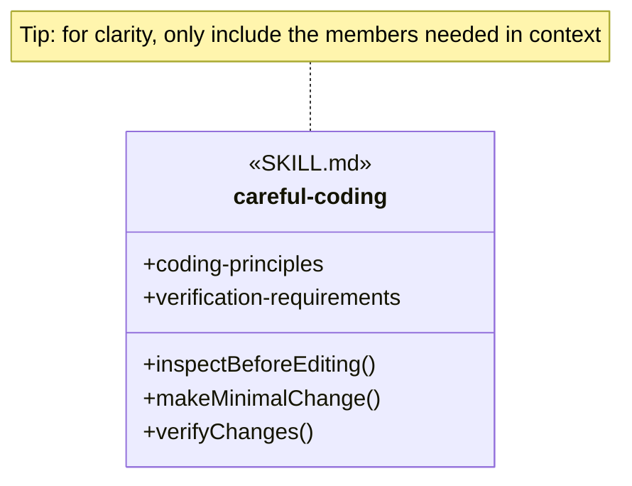

The displayed careful-coding members are illustrative analysis vocabulary. They demonstrate data and function member notation without asserting that those exact member names appear in the current skill definition.

An empty SKILL.md node means that the skill describes a single procedure, so the skill identity already represents that operation.

- Use the skill’s exact kebab-case name as the node name.
- Leave the member area empty if the skill describes a single procedure.
- Add a function member with parentheses only when the relationship focuses on a procedure described by the skill. The member is diagram shorthand for written instructions, not a claim that SKILL.md contains software code.
- Add a data member without parentheses when exposed definitions, structures, states, rules, values, or other non-procedural information matter to the relationship.
- If the skill does not clearly describe a procedure, leave that member out instead of inventing one.

The plus sign means that a member is exposed to users of the skill. Parentheses distinguish a function member from a data member. A data member is not an outgoing reference to another object. Dependencies remain between whole Agent, AGENTS.md, or SKILL.md nodes because the complete referenced file is loaded into context.

For example, verify-document-page stays empty because the example SKILL.md describes one procedure. The manage-work-item-gitlab node can show create-new-work-item() when the skill exposes that function among other members. A work-item interface can show work-item-definition without parentheses when that shared data structure matters to the relationship.

When a visible class name contains characters that Mermaid cannot use in an identifier, the diagram uses a separate internal identifier and quoted display label. The display label is the analysis identity; the internal identifier exists only to render the diagram.

### 2.2 Showing An Agent In A Diagram

An Agent node represents one agent definition rather than one running task. The native definition format depends on the harness. Codex stores an agent in a TOML file whose properties include its runtime name, description, developer instructions, model settings, and enabled harness skills. Claude Code stores an agent in a Markdown file whose YAML frontmatter carries metadata such as name, description, skills, and model, while the Markdown body carries the instructions.

The diagram uses the portable agent identity even when a harness changes its runtime spelling. For example, the portable dev-coder identity is rendered in the Codex file dev-coder.toml with the runtime name dev_coder, while the Claude Code file dev-coder.md retains the name dev-coder.

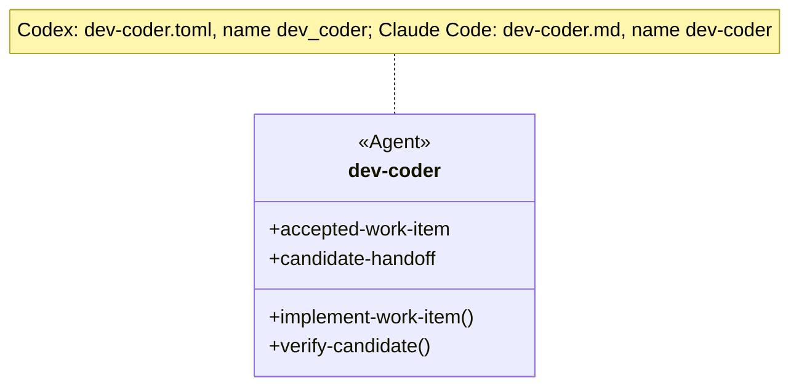

The Agent stereotype distinguishes an agent definition from a SKILL.md or AGENTS.md node. Function members summarize procedures or responsibilities expressed by the agent instructions; they are not literal functions in the TOML or Markdown file. Data members summarize inputs, outputs, constraints, or other information relevant to the relationship being analyzed. The displayed dev-coder members are analysis vocabulary derived from its work-item input, implementation workflow, verification responsibility, and candidate handoff.

Show only the Agent members needed by the diagram. Leave the member area empty when the relationship needs only the Agent identity. Model the native TOML or Markdown file as a separate node only when the analysis concerns generation, serialization, or adapter ownership rather than Agent and skill relationships.

### 2.3 Agent Loads A Skill By Exact Name

An Agent Skill is a SKILL.md that an Agent definition references by exact skill name.

- **RULE: RULE-5** An Agent Skill is referenced by its exact skill name
  - **SYNOPSIS:** The Agent definition knows the exact skill identity and follows the procedures and instructions in the resolved SKILL.md.
  - **EXAMPLE:** A Documentation Agent can name verify-document-page directly in its skill list.

- **RULE: RULE-6** An unconditional Agent Skill applies to every execution of the Agent role
  - **SYNOPSIS:** An Agent definition lists the skill without a condition because that dependency belongs to every execution of the role.
  - **EXAMPLE:** A Documentation Agent can list verify-document-page without a condition so every execution applies it.

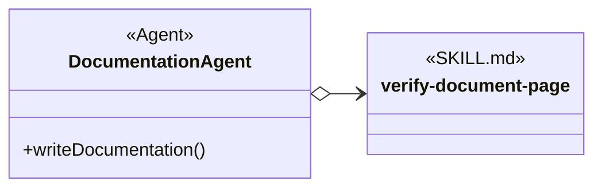

The open diamond means that Documentation Agent knows the exact skill name. The solid line means that the reference is unconditional, so it needs no label. The verify-document-page member area is empty because that example skill describes one procedure; repeating the operation as a function member would add no information.

Documentation Agent and verify-document-page are analysis vocabulary for this example. They do not assert that those definitions exist in the repository.

### 2.4 Agent Conditionally Loads A Skill By Exact Name

A conditional Agent Skill is still named directly by the Agent definition, but the reference applies only when its condition is satisfied.

- **RULE: RULE-7** A condition routes an Agent to a named Agent Skill
  - **SYNOPSIS:** The Agent definition knows the exact skill name but uses that skill only when the declared condition matches the request and available evidence.
  - **EXAMPLE:** “If the user requests TDD, use the test-driven-development skill.”

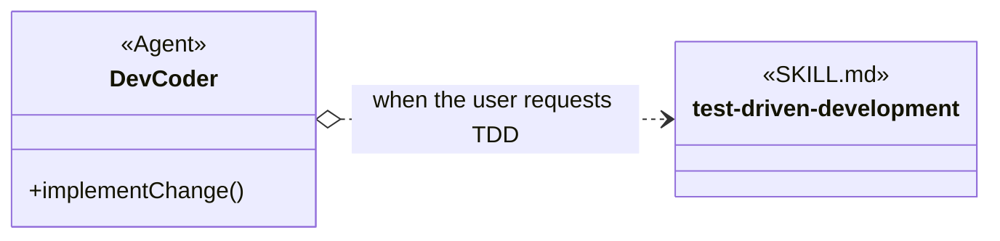

The open diamond still means exact-name knowledge. The dotted line means conditional loading, and the arrow label states the condition. Solid and dotted class references differ only in conditionality; both point from the referencing Agent to the named skill.

The test-driven-development member area is empty because the skill describes one overall TDD procedure. The dotted relationship still shows when that complete skill is loaded.

### 2.5 Agent Indirectly Loads A Skill Via AGENTS.md

It is usually desirable to define Agents with general rules and procedures while allowing AGENTS.md to select project-specific skills indirectly, such as technology skills. The Agent instruction says what must be done without naming the skill that will do it. AGENTS.md names the skill to use for that project. When the Agent instruction, AGENTS.md, and the selected skill use the same procedure wording, that wording forms the Skill interface in this analogy.

- **RULE: RULE-1** An Agent can request a procedure without naming its skill implementation
  - **SYNOPSIS:** The procedure name describes the work that is needed. The Agent instruction can request that work while AGENTS.md chooses the skill that explains how to do it.
  - **EXAMPLE:** The Agent instruction says, “When a new enhancement is requested, create a new work item.” AGENTS.md says, “To create a new work item, use the manage-work-item-gitlab skill.”

- **RULE: RULE-2** The Agent, AGENTS.md, and the implementing SKILL.md share the same procedure name
  - **SYNOPSIS:** The same procedure wording connects what the Agent must do, which skill AGENTS.md selects, and where that skill explains the work.
  - **EXAMPLE:** The words “create a new work item” appear in the Agent instruction and the AGENTS.md instruction. The selected GitLab skill explains that work in its Create New Work Item section.

- **RULE: RULE-3** An Injectable Skill encapsulates selectable technology or procedure details
  - **SYNOPSIS:** The selected skill contains the detailed instructions that should not be repeated in the Agent definition.
  - **EXAMPLE:** The Agent instruction only says to create a work item. The manage-work-item-gitlab skill explains the GitLab search, creation, and verification steps.

- **RULE: RULE-4** AGENTS.md selects one of several implementations
  - **SYNOPSIS:** AGENTS.md tells the Agent which skill to load when the work is needed.
  - **EXAMPLE:** One project can say, “To create a new work item, use the manage-work-item-file skill.” Another can say, “To create a new work item, use the manage-work-item-gitlab skill.”

The diagram uses method-like names to keep the routing relationship compact. AGENTS.md does not define the procedures; it only routes a procedure name to a project-specific skill, such as create-new-work-item to manage-work-item-gitlab. The procedure details belong to the selected SKILL.md. DII describes this indirect routing relationship in the analysis; it is not part of the AGENTS.md node’s stereotype.

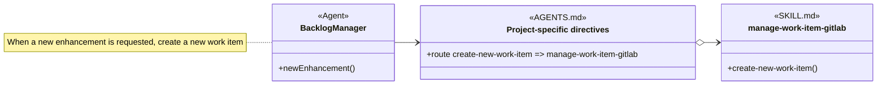

- The Backlog Manager Agent definition says, “When a new enhancement is requested, create a new work item.”
- The project AGENTS.md says, “To create a new work item, use the manage-work-item-gitlab skill.”
- The manage-work-item-gitlab SKILL.md has a Create New Work Item section that explains how to do that work in GitLab.

The regular arrow shows that the Agent instruction asks for a new work item without naming a skill. The open-diamond arrow shows that AGENTS.md names the skill selected for the project. If a project stores work items in files, AGENTS.md can name manage-work-item-file instead. The Backlog Manager instruction remains unchanged.

### 2.6 Showing A Skill Interface In A Diagram

The procedures a skill implements and the definitions it exposes can be considered a Skill interface when a calling Agent refers only to that public information. The Agent depends on those public members without needing to know the skill’s internal workflow, decision steps, or provider-specific details.

A Skill interface does not require a separate file when only one skill owns and exposes the contract. When Agents and several provider skills must share the same public contract, a distinct SKILL.md can publish it independently. This method calls that separate package an Interface Skill. The visible manage-work-item-* name identifies the interface shared by the manage-work-item provider family; Mermaid uses manage-work-item as its internal identifier because the asterisk is part of the family notation.

Mermaid represents an interface as a stereotyped class node. In this method, an Interface Skill node uses Interface Skill as its single visible stereotype. The stereotype identifies a SKILL.md, so the diagram does not stack a second SKILL.md stereotype above it. The node lists the public data and function members that consumers know and implementations must provide or respect. An interface can expose more than one data member, more than one function member, or both.

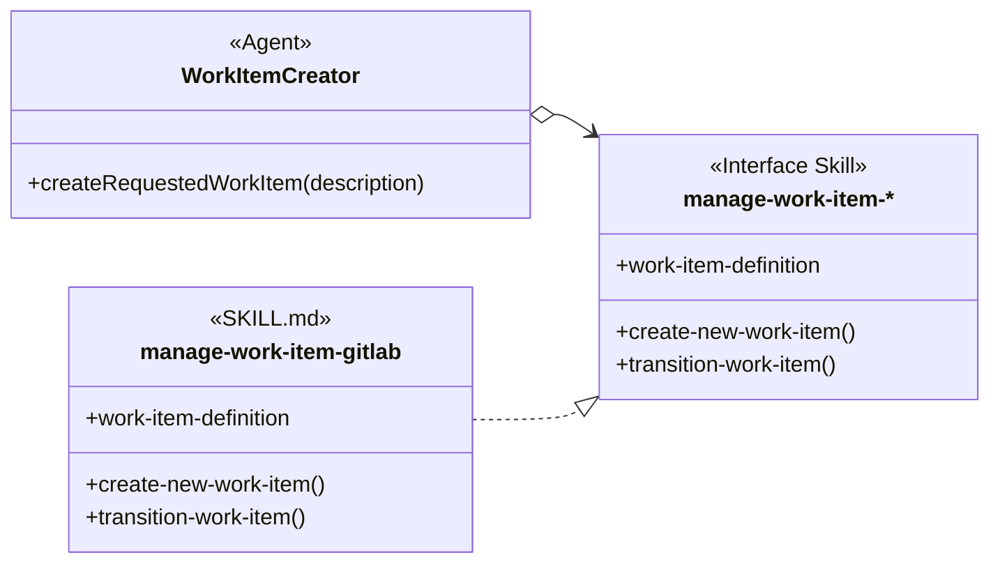

The Work Item Creator consumer references the manage-work-item-* Interface Skill directly. Its open-diamond arrow means that the consumer loads the complete Interface Skill while depending only on its public members. The manage-work-item-* family and manage-work-item-gitlab provider are analysis vocabulary for this example. The diagram does not assert that those exact skill definitions already exist in the repository.

The dashed line with a hollow triangular arrowhead is a realization relationship. It points from the implementing SKILL.md to the Interface Skill. It means that manage-work-item-gitlab supplies the required functions and provides or respects the public data defined by manage-work-item-*. An implementation can restrict an allowed data value or add provider-specific members when those refinements remain usable by interface consumers.

Realization describes conformance, not loading. The arrow does not mean that one skill loads the other, invokes it, or knows its exact skill name. When an interface consumer or implementation depends on the Interface Skill by name, the complete SKILL.md is still loaded as one context unit and that dependency uses a separate open-diamond reference. Mermaid draws the declared relationship but does not verify member compatibility; semantic coherence still requires a reviewer to compare the complete interface, implementation, and known consumers.

### 2.7 Skill Providers Using A Factory Pattern

A Provider Skill is a SKILL.md that supplies one implementation of an Interface Skill. When a project must choose one provider without putting that provider’s name into the Agent definition, AGENTS.md can act as a factory. The Agent consumes the Interface Skill directly, while the AGENTS.md factory selects and loads one Provider Skill by exact name.

- **RULE: RULE-62** A factory-pattern Agent depends on the Interface Skill
  - **SYNOPSIS:** The Agent names and loads the Interface Skill, then uses only its public data and procedures without naming a provider.
  - **EXAMPLE:** Work Item Creator loads manage-work-item-* and requests create-new-work-item() without knowing whether files or GitLab store the work item.

- **RULE: RULE-63** AGENTS.md acts as the provider factory
  - **SYNOPSIS:** Project guidance selects one Provider Skill by exact name, and that provider realizes the Interface Skill consumed by the Agent.
  - **EXAMPLE:** One AGENTS.md can select manage-work-item-gitlab while another selects manage-work-item-file; Work Item Creator continues to consume manage-work-item-*.

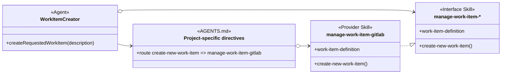

Read the diagram as four related instructions:

- The Work Item Creator Agent directly loads manage-work-item-* and uses its public contract.
- The Agent asks for a configured work-item provider without naming one.
- The project AGENTS.md keeps the same routing annotation used for indirect loading and directly names manage-work-item-gitlab as the selected Provider Skill.
- The selected Provider Skill realizes the manage-work-item-* interface.

The factory analogy describes instruction selection rather than runtime object construction. AGENTS.md does not instantiate a provider object; it tells the Agent which provider SKILL.md to load. A different project can select another provider that realizes the same Interface Skill without changing the Agent’s direct dependency.

#### Simplified View

When provider selection is not the focus of the analysis, the diagram can omit the AGENTS.md factory while retaining the consumer and realization relationships.

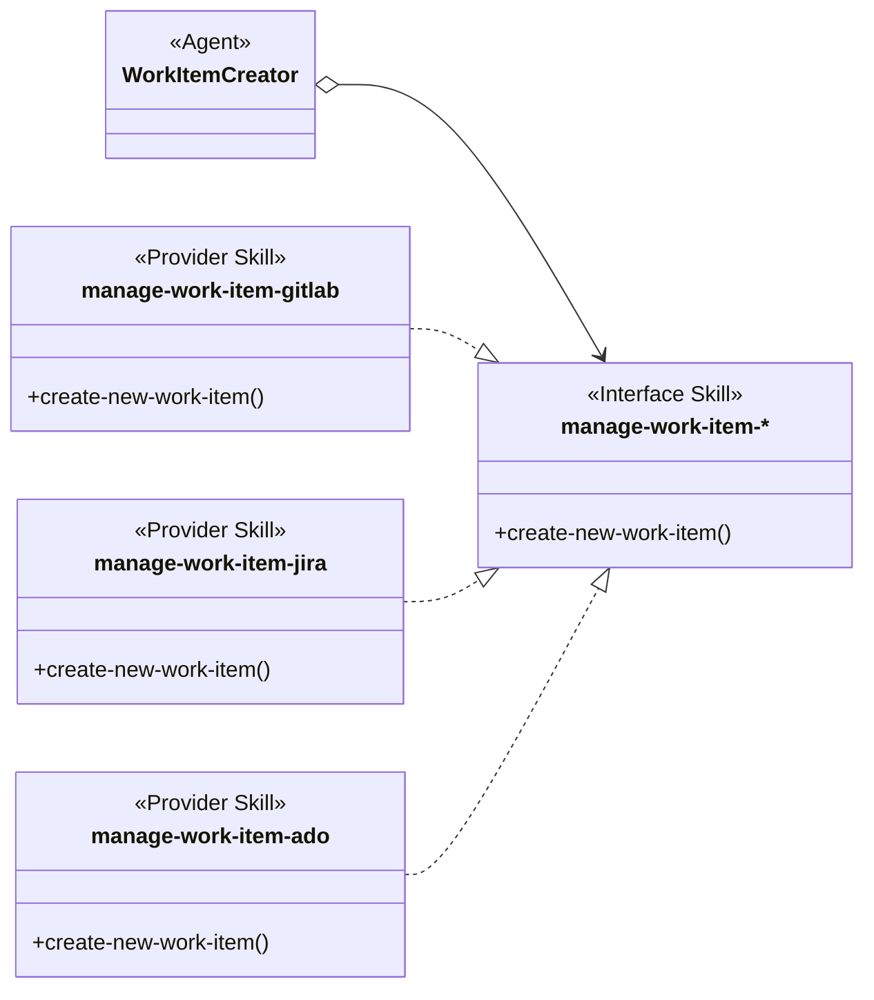

The simplified view still means that Work Item Creator consumes manage-work-item-*. Each Provider Skill shown realizes that interface. Project-specific directives select one of those providers as shown in the detailed diagram; the simplified view omits that routing relationship and does not imply that all providers are loaded together. The provider identities are analysis vocabulary for this example rather than assertions that those skill definitions already exist.

### 2.8 A Request Selects A Skill

A request can select an available skill without a declared reference from an Agent definition or AGENTS.md.

- **RULE: RULE-50** Request-triggered selection is scoped to the request
  - **SYNOPSIS:** A skill loader can select a discovered skill because the request names it explicitly or because the request matches its declared purpose. This selection does not add a durable Agent Skill or AGENTS.md relationship.
  - **EXAMPLE:** A request that names ast-grep, or asks for structural code matching that fits the ast-grep description, can select ast-grep for that request without changing an Agent definition.

The request-triggered forms are:

- explicit selection by skill name or marker;
- implicit selection from the request and a skill’s description or trigger conditions.

No class diagram is needed for this case. The selection is a request-routing event rather than a persistent reference owned by an Agent definition or AGENTS.md. The running agent can still read and apply the selected SKILL.md after routing succeeds.

The use cases differ at their selection boundary:

| Use case | Selection source | Exact skill name known by | Scope |
| --- | --- | --- | --- |
| Unconditional Agent Skill | Agent definition | Agent definition | Every execution of that Agent role. |
| Conditional Agent Skill | Agent definition condition | Agent definition | Executions whose request and evidence satisfy the condition. |
| Procedure mapped through AGENTS.md | Shared procedure in the Agent; implementation binding in AGENTS.md | AGENTS.md | The effective project binding for that procedure. |
| Request-triggered skill | Explicit request marker or request-to-description match | Skill loader or caller | The current request. |

## 3. Skill Organization

Skill Groups can be shown in two forms. An expanded view draws a box around the member skills so their responsibilities and loading relationships can be compared at once. A compact view replaces the box with solid-diamond containment lines and can also show nested groups.

Both forms describe membership in the same kind of Skill Group. Neither form means that a member loads, invokes, or depends on another member.

### 3.1 Expanded Skill Group

An expanded Skill Group is useful when one large skill has been divided into several cohesive SKILL.md files with non-overlapping responsibilities. A Mermaid namespace supplies the visible group box. Separate references from Agents or AGENTS.md show which group members they load.

- **RULE: RULE-28** Skill Group members divide a larger responsibility without overlap
  - **SYNOPSIS:** Each member owns one cohesive part of the grouped capability while using compatible domain vocabulary.
  - **EXAMPLE:** In the Work Item Skill Group, work-item-base defines work items, states, and rules; work-item-dispatch changes status under dispatch rules; and work-item-monitor observes work items and raises alarms.

- **RULE: RULE-29** Group membership and skill loading remain separate relationships
  - **SYNOPSIS:** The group box shows which skills belong together for comprehension. Agent or AGENTS.md references separately show which exact members are loaded for a use case.
  - **EXAMPLE:** Work Item Coordinator loads work-item-base and work-item-dispatch, while Work Item Watchdog loads work-item-base and work-item-monitor; the surrounding box places all three skills in the same Work Item Skill Group.

- **RULE: RULE-30** Direct references between group members create stronger coupling
  - **SYNOPSIS:** A member that names another member creates a skill-to-skill dependency that must be traced in addition to their common group membership.
  - **EXAMPLE:** If work-item-dispatch named work-item-base directly, the diagram would need an open-diamond reference between those skills; placing both skills in the Work Item Skill Group does not create that reference.

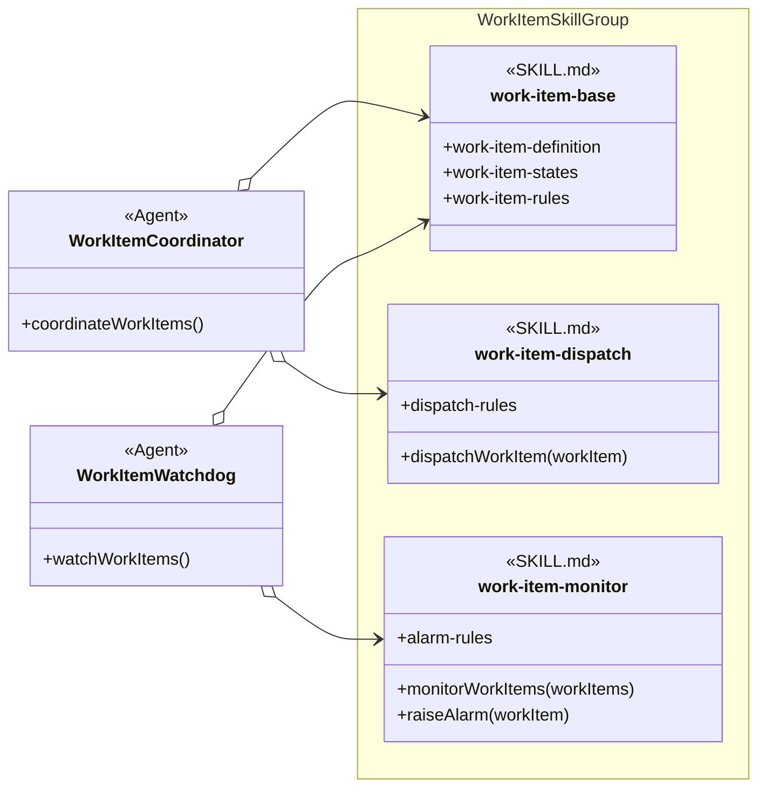

The namespace box identifies one Work Item Skill Group. It is an expanded organizational view, not a loading relationship. The open diamonds separately mean that each Agent knows the exact skill names it loads. No arrows connect the three member skills because no member-to-member dependency is asserted.

The members without parentheses are exposed data; the members with parentheses are functions. They clarify the responsibility split but do not create member-level dependencies. Work Item Coordinator and Work Item Watchdog each load work-item-base as shared domain context, then load only the specialized member needed by that role. Whether a harness caches or rereads an already selected SKILL.md is a runtime concern outside this analysis.

AGENTS.md can own the same exact-name loading references when the choice of group members is project-specific rather than fixed in an Agent definition. Keeping those references in an Agent or AGENTS.md makes the loaded dependencies easier to inspect, change, and troubleshoot than a chain of skill-to-skill name references.

Technology or provider selection remains a different use case because it selects one implementation among alternatives. For example, test-driven-development can refer to Run Project Tests while AGENTS.md selects JUnit or Jest. A direct skill-to-skill reference also remains valid when the invoking skill intentionally owns that dependency; its open-diamond arrow records stronger coupling than shared group membership.

| Arrangement | What the view groups or selects | Loading or dependency meaning |
| --- | --- | --- |
| Expanded Skill Group | Several cohesive, non-overlapping skills shown inside one box. | None from the box itself; separate Agent, AGENTS.md, or SKILL.md arrows show loading and dependencies. |
| Technology or provider selection | One implementation among alternatives. | The caller knows a procedure; AGENTS.md knows the selected skill name. |
| Direct member-to-member reference | One named group member required by another member. | The invoking SKILL.md knows the referenced skill by exact name. |

The Work Item Skill Group names and displayed members are analysis vocabulary supplied for this example. They do not assert that those exact skill definitions already exist in the repository.

### 3.2 Compact Skill Group Containment

A compact Skill Group view uses solid-diamond containment instead of drawing a box around every member. It is useful when member details are unnecessary or when a diagram needs to show one group nested in another.

A Skill Group is a named set used to organize skills for comprehension. It collects skills that contribute to one methodology capability or setup option, whether those skills are listed directly in the group or reached through a nested Skill Group.

A nested skill group is the same kind of object as its parent. The word subgroup describes only its position inside that parent; it does not introduce a second kind of group. For any skill group:

- direct skills are the skills listed immediately in that group;
- nested skill groups are smaller named sets included by that group; and
- the group’s complete skill set is its direct skills plus the complete skill sets of all its nested groups.

This organization answers “Which skills should I consider part of this capability?” It does not answer “Which skill loads or invokes another skill?”

- **RULE: RULE-54** A solid diamond is the compact form of Skill Group membership
  - **SYNOPSIS:** A solid diamond from a Skill Group to a SKILL.md replaces the expanded group box for one direct member. A solid diamond from one Skill Group to another records that the parent includes the child’s complete skill set.
  - **EXAMPLE:** Concurrent Tasking directly contains codex-workitem-coordination and includes the Resource Coordination skill group, whose direct skills include agent-claim.

- **RULE: RULE-55** Containment does not imply use or dependency
  - **SYNOPSIS:** A containment line only builds the organizational set. An Agent, AGENTS.md, or SKILL.md still needs a separate regular or open-diamond reference when it invokes a procedure or names a skill.
  - **EXAMPLE:** Concurrent Tasking includes every Resource Coordination skill for comprehension, but that does not mean codex-workitem-coordination loads agent-claim or that every Concurrent Tasking skill uses it.

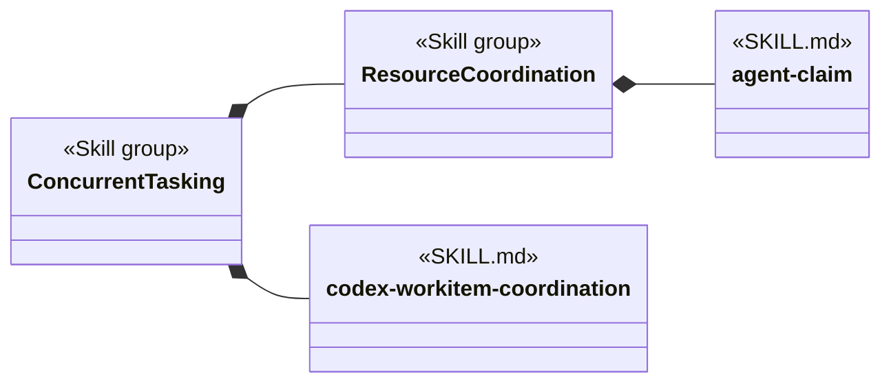

Concurrent Tasking has one direct skill in this compact view: codex-workitem-coordination. It also includes the nested Resource Coordination set, so agent-claim belongs to the complete Concurrent Tasking set through that nesting. An expanded view could instead draw boxes around the same members, but the solid-diamond form shows nesting more concisely. The solid diamonds do not say that codex-workitem-coordination loads agent-claim or that Resource Coordination loads anything. Loading and invocation remain visible through the reference forms introduced in Section 2.

The repository-specific group models are maintained separately in [Object-Oriented Skill Group Models](object-oriented-skill-group-models.md).

## 4. From User Request To Skill Interface

This section separates understanding the user’s request from choosing the implementation.

- **PROCESS: PROCESS-1** Receive a user request
  - **SYNOPSIS:** The Agent receives natural language describing a new enhancement.
  - **EXAMPLE:** The Agent is told, “Add a new Cancel button enhancement.”

- **PROCESS: PROCESS-2** Transform the request into an interface invocation
  - **SYNOPSIS:** The Agent invokes newEnhancement(), whose instructions refer to the create-new-work-item() procedure.
  - **EXAMPLE:** The Agent concludes, “A new enhancement requires me to create a new work item.”

- **RULE: RULE-8** Agent context carries enhancement intent rather than provider details
  - **SYNOPSIS:** newEnhancement() retains the enhancement request in Agent context. create-new-work-item() delegates provider representation to the selected manage-work-item-* skill.
  - **EXAMPLE:** Add a new Cancel button does not require newEnhancement() to know a repository path, GitLab project identifier, label set, or issue URL.

Sequence diagrams use solid messages for every request, action, and return. Their text is necessary because the diagram shows chronological actions rather than static references. Return messages begin with Return. Dotted lines remain reserved for conditional references in class diagrams.

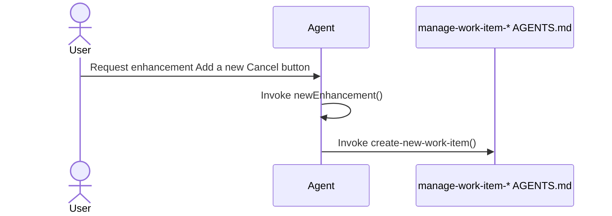

At this point, newEnhancement() has referred to the creation procedure, but the Agent has not chosen file or GitLab behavior itself.

## 5. Skills Injection Through AGENTS.md

AGENTS.md links a procedure name to a concrete SKILL.md.

- **PROCESS: PROCESS-3** Provide the injection instruction
  - **SYNOPSIS:** Effective project guidance tells the agent which skill to load when the procedure is needed.
  - **EXAMPLE:** “When you need create-new-work-item(), load manage-work-item-gitlab.”

- **RULE: RULE-9** AGENTS.md owns the binding outside the calling agent
  - **SYNOPSIS:** The Agent retains newEnhancement() and its create-new-work-item() reference when project setup chooses another matching implementation.
  - **EXAMPLE:** Changing the AGENTS.md binding from manage-work-item-gitlab to manage-work-item-file does not change newEnhancement().

Section 2.5 shows this binding as a regular arrow from Backlog Manager to the manage-work-item-* procedure family and an open-diamond arrow from AGENTS.md to manage-work-item-gitlab. The first reference preserves procedure-only knowledge in the Agent. The second reference records the exact skill name selected by project guidance.

Skills injection is an instruction relationship. The model does not require a compiled interface object or a software dependency-injection container.

## 6. Loading And Invoking The Selected SKILL.md

The agent follows the injection instruction only when it needs the Skill interface.

- **PROCESS: PROCESS-4** Load the selected skill
  - **SYNOPSIS:** The agent reads the SKILL.md named by AGENTS.md.
  - **EXAMPLE:** The agent concludes, “AGENTS.md binds manage-work-item-* to manage-work-item-gitlab, so I will load that SKILL.md.”

- **PROCESS: PROCESS-5** Find the procedure with the shared name
  - **SYNOPSIS:** The loaded SKILL.md uses the same procedure name and explains the concrete steps.
  - **EXAMPLE:** The agent finds the Create New Work Item section that defines create-new-work-item() for GitLab.

- **PROCESS: PROCESS-6** Invoke the selected procedure using Agent context
  - **SYNOPSIS:** The implementing procedure reads the enhancement intent already held in Agent context and applies provider-specific steps.
  - **EXAMPLE:** The GitLab procedure reads Add a new Cancel button, then applies its own duplicate search, issue creation, and read-back rules.

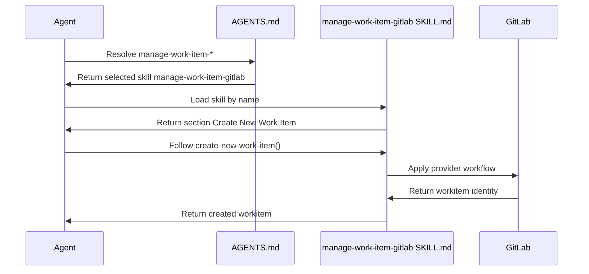

Every message is solid. Direction and the Return prefix distinguish information coming back from an action. The Agent’s newEnhancement() behavior and create-new-work-item() reference stay the same when another matching skill is selected. The provider-specific actions come from the loaded SKILL.md.

## 7. Data And Function Members In Skill Interfaces

A Skill interface is a public contract made of data members, function members, or both. An Interface Skill is a SKILL.md that itemizes the members an interface user must know and an implementation must provide or respect. AGENTS.md can still select a concrete implementation; the Interface Skill supplies the shared vocabulary rather than making that selection.

- **RULE: RULE-10** A Skill interface can expose data and function members
  - **SYNOPSIS:** Data members name shared structures, rules, constraints, or values, while function members name procedures an implementation performs.
  - **EXAMPLE:** The manage-work-item-* interface can expose work-item-definition and work-item-states as data members together with createWorkItem(description) and transitionWorkItem(workItem, state) as function members.

- **RULE: RULE-11** One Skill interface can contain several functions
  - **SYNOPSIS:** Related procedures remain members of one interface when invokers and implementations treat them as one cohesive contract.
  - **EXAMPLE:** createWorkItem(description) and transitionWorkItem(workItem, state) both belong to manage-work-item-* rather than becoming separate interfaces merely because both are callable.

- **RULE: RULE-12** One implementation can satisfy several Skill interfaces
  - **SYNOPSIS:** A complex implementation skill can provide the members of several independently useful contracts without that fact alone deciding whether its SKILL.md should be split.
  - **EXAMPLE:** A provider can satisfy manage-work-item-* and work-item-reporting-* while remaining one SKILL.md when those responsibilities are intentionally packaged together.

For a function member, an implementation supplies its own procedure with the interface name and meaning. For a data member, an implementation respects the shared name and meaning. It can add provider-specific members, define concrete values, or document a narrower constraint. A narrower constraint is coherent only when interface users can still satisfy it; the interface name alone does not guarantee substitutability.

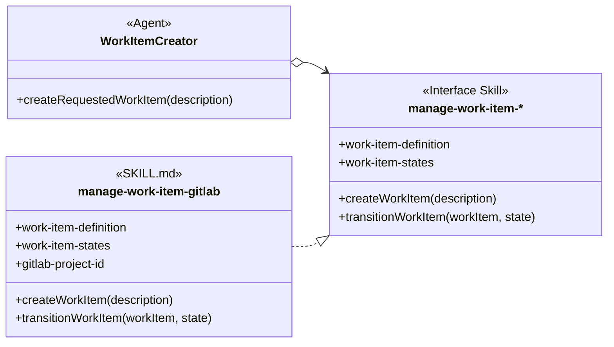

The open-diamond arrow means that Work Item Creator knows and loads the complete manage-work-item-* Interface Skill. The realization arrow means that manage-work-item-gitlab supplies the interface contract. Neither arrow terminates at an individual member. The matching members show that manage-work-item-gitlab implements both functions and respects both shared data members. It adds gitlab-project-id as provider-specific data. If the implementation also names and loads manage-work-item-*, show that dependency with a separate open-diamond arrow.

The interface and implementation names are analysis vocabulary for this example. They do not assert that those skill files already exist in the repository.

## 8. A Second Injected Example: Deliver Workitem

The same relationship applies to completion procedures.

- **PROCESS: PROCESS-7** Request delivery after review and testing
  - **SYNOPSIS:** A development workflow invokes Deliver Workitem with the accepted change after its required gates pass.
  - **EXAMPLE:** The caller concludes, “Review and testing passed. I must Deliver Workitem with accepted commit abc123.”

- **RULE: RULE-13** AGENTS.md selects the delivery SKILL.md
  - **SYNOPSIS:** The calling workflow uses the same procedure name while project guidance selects direct-main or feature-branch delivery.
  - **EXAMPLE:** AGENTS.md can link Deliver Workitem to complete-work-item-direct-main or complete-work-item-feature-branch.

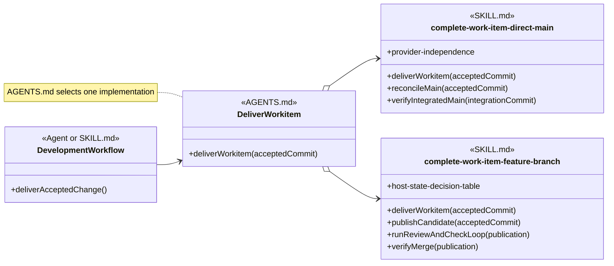

The regular arrow shows that the development workflow knows Deliver Workitem by procedure name. The open-diamond arrows show the two exact skill names that AGENTS.md can select. The direct-main and feature-branch procedures remain different internally even though callers reach either one through the same procedure name.

## 9. Agent Dependency Views

An Agent can use named Agent Skills and Injected Skills together. A class view concentrates on the Agent’s expected behavior and dependency paths rather than its task-bound runtime state.

- **RULE: RULE-14** An Agent class view records reusable expectations and dependencies
  - **SYNOPSIS:** The Agent node shows the behavior relevant to the analysis, the procedure names it invokes, and the Agent Skills it names.
  - **EXAMPLE:** A coding-agent class can name fix-explanation directly and invoke Deliver Workitem without naming the delivery SKILL.md.

- **RULE: RULE-15** Dependency views omit unrelated runtime state
  - **SYNOPSIS:** The class view shows the expectations and dispatch paths needed to understand skill use without modeling task values that do not change those relationships.
  - **EXAMPLE:** The coding Agent exposes deliverAcceptedChange() and its skill references without displaying an accepted commit or an awaiting-review state.

- **RULE: RULE-16** Technology and project skills can be injectable through shared procedure names
  - **SYNOPSIS:** A technology or project SKILL.md is injectable when it implements a procedure name and invocation meaning that the Agent already uses.
  - **EXAMPLE:** A testing agent can invoke Run Project Tests with a test scope while AGENTS.md selects a JUnit or Jest SKILL.md for the project.

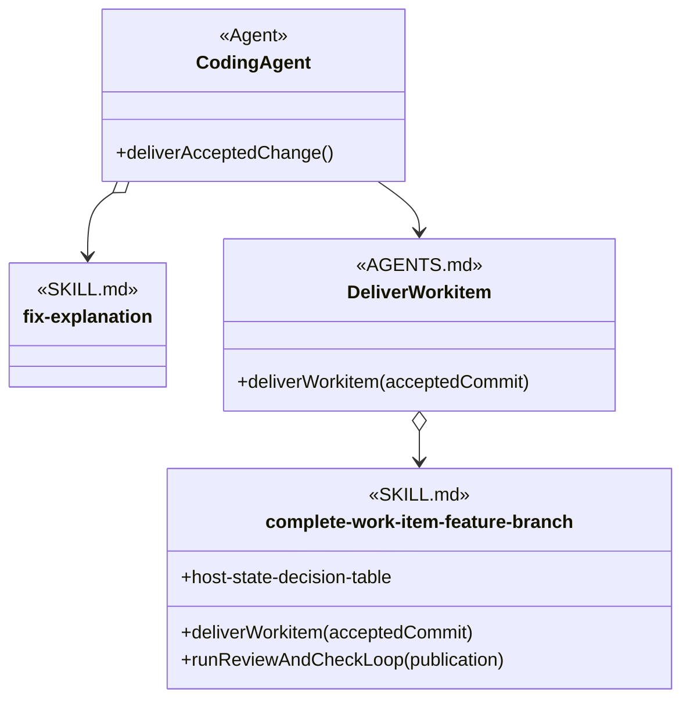

The Agent points directly to fix-explanation because its definition names that single-procedure skill. Its empty member area avoids repeating the procedure already identified by the operation-shaped skill name. The Agent points regularly to Deliver Workitem because it knows the procedure name. The AGENTS.md DII points by open diamond to the selected feature-branch skill.

The diagram explains dependencies and dispatch. It does not require the harness to construct software classes or imply an inheritance relationship.

## 10. Agent Superclass Stand-Ins

A shared relationship can appear once when many Agents reference the same skill in the same way. Drawing every Agent separately can hide the relationship behind repeated arrows.

A superclass stand-in is a diagram-compression device. It names the set of applicable Agents and carries their shared relationship. It is not a conceptual Agent definition and does not assert inheritance among those Agents.

- **RULE: RULE-38** A superclass stand-in represents Agents that share one relationship
  - **SYNOPSIS:** The stand-in replaces repeated Agent nodes only when every represented Agent reaches the same referenced node through the same reference form.
  - **EXAMPLE:** Structured Artifact Reviewers can stand in for every reviewer that names review-structured-artifact directly.

- **RULE: RULE-39** A superclass stand-in does not assert Agent inheritance
  - **SYNOPSIS:** The stand-in compresses the picture without claiming that the represented Agents inherit purpose, instructions, state, or behavior from a repository-defined base Agent.
  - **EXAMPLE:** A code reviewer and a methodology artifact reviewer can share the stand-in without becoming subclasses of one another or of a generated Reviewing Agent.

- **RULE: RULE-40** A stand-in is named after its applicability set
  - **SYNOPSIS:** Its name describes which Agents share the relationship and avoids invented runtime behavior.
  - **EXAMPLE:** Structured Artifact Reviewers is clearer than an invented Agent class with methods that do not exist in the Agent definitions.

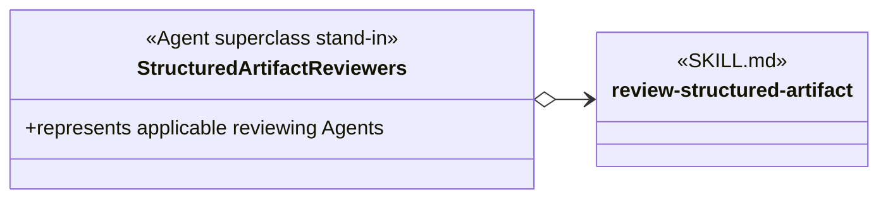

The open-diamond arrow says that every represented Agent names review-structured-artifact directly. No inheritance arrows are needed because the stand-in exists only to avoid drawing the same reference many times.

## 11. Constraints

- **RULE: RULE-20** A loaded skill is not necessarily injectable
  - **SYNOPSIS:** A SKILL.md is injectable only when it and its invokers share a procedure name and invocation meaning that another implementation can also use.
  - **EXAMPLE:** An Agent can load code-discovery by name as an Agent Skill without making code-discovery injectable.

- **RULE: RULE-21** Provider-specific procedure details remain inside SKILL.md
  - **SYNOPSIS:** A shared procedure name stabilizes the invoker. It does not make the file and GitLab procedures identical internally.
  - **EXAMPLE:** create-new-work-item() can produce a repository-backed record through manage-work-item-file and a GitLab issue through manage-work-item-gitlab while each procedure preserves provider-accurate evidence.

- **RULE: RULE-41** A superclass stand-in is not an injection mechanism
  - **SYNOPSIS:** A stand-in compresses repeated Agent relationships. An AGENTS.md DII selects a SKILL.md implementation for a procedure name.
  - **EXAMPLE:** Structured Artifact Reviewers can summarize exact-name references to review-structured-artifact, while Project-specific directives still select a Provider Skill for manage-work-item-*.

- **RULE: RULE-23** The model remains conceptual
  - **SYNOPSIS:** The document explains the vocabulary and relationships without prescribing a schema, migration order, or repository change sequence.
  - **EXAMPLE:** The diagrams show manage-work-item-* as an Interface Skill and Project-specific directives as AGENTS.md routing without specifying a new YAML field for either relationship.

## 12. Definition Of Good

- **RULE: RULE-52** Class views make dependency and dispatch paths understandable
  - **SYNOPSIS:** A reader can identify which skills an Agent names, which procedures it expects, which conditions affect loading, and where AGENTS.md selects an implementation.
  - **EXAMPLE:** The diagrams distinguish Dev Coder’s direct careful-coding reference from Backlog Manager’s procedure-name path through AGENTS.md to manage-work-item-gitlab.

- **RULE: RULE-53** Class views make skill organization reviewable
  - **SYNOPSIS:** A reader can see which skills own shared context, which own specialized procedures, how an expanded group relates to its loading references, which skills are direct group members, and which complete skill sets are included through nesting.
  - **EXAMPLE:** The expanded Work Item Skill Group shows work-item-base shared by two Agents while work-item-dispatch and work-item-monitor remain specialized members; the compact view shows agent-claim contained by Resource Coordination.

- **RULE: RULE-24** The diagrams distinguish AGENTS.md from SKILL.md
  - **SYNOPSIS:** Diagrams label project routing with the AGENTS.md stereotype, the shared family contract with the Interface Skill stereotype, and the selected implementation with a concrete skill stereotype.
  - **EXAMPLE:** Project-specific directives has the AGENTS.md and routing stereotypes; manage-work-item-* has the Interface Skill stereotype; manage-work-item-gitlab is the selected Provider Skill.

- **RULE: RULE-25** The complete workitem invocation is traceable
  - **SYNOPSIS:** A reader can follow the request from the user, through newEnhancement() and its creation reference, through AGENTS.md injection, to the selected SKILL.md procedure.
  - **EXAMPLE:** Add a new Cancel button invokes newEnhancement(), which refers to create-new-work-item(); AGENTS.md selects manage-work-item-gitlab, whose Create New Work Item section performs the GitLab procedure.

- **RULE: RULE-26** Declared relationships and request-triggered selection have valid uses
  - **SYNOPSIS:** The model distinguishes exact Agent dependencies, expanded and compact Skill Group views, AGENTS.md substitution, direct skill-to-skill coupling, and request-scoped selection.
  - **EXAMPLE:** Dev Coder names careful-coding, the Work Item Skill Group contains three non-overlapping members while Work Item Coordinator loads two of them, Resource Coordination contains agent-claim, Project-specific directives select a Provider Skill for manage-work-item-*, complete-work-item-feature-branch names create-pull-request, and a structural-search request selects ast-grep only for that request.

- **RULE: RULE-51** The four skill-loading use cases remain distinct from factory composition
  - **SYNOPSIS:** The method separates unconditional exact-name loading, conditional exact-name loading, procedure mapping through AGENTS.md, request-triggered selection, and the factory pattern that combines an Agent-facing Interface Skill with an AGENTS.md-selected Provider Skill.
  - **EXAMPLE:** Section 2 gives every loading use case its own subsection, omits a persistent class relationship for request-triggered ast-grep selection, and presents provider selection as a separate composition.

- **RULE: RULE-27** Every assertion includes an example
  - **SYNOPSIS:** Each GOAL, RULE, PROCESS, and other structured assertion is followed by an EXAMPLE.
  - **EXAMPLE:** RULE-20 defines the Injectable Skill boundary and illustrates it with code-discovery.

- **RULE: RULE-42** Every reference points from the referencing node to the referenced node
  - **SYNOPSIS:** The source appears first, the arrowhead points to the target, and an open diamond remains on the source that knows an exact skill name.
  - **EXAMPLE:** manage-work-item o--> manage-work-item-gitlab reads from the AGENTS.md DII that names the matching skill to the SKILL.md that it selects.

- **RULE: RULE-43** Line and endpoint form expose name knowledge and conditionality
  - **SYNOPSIS:** In declared relationships, a regular line means procedure-name reference, an open diamond means exact skill-name reference, and the dotted form means the reference is conditional. Only a dotted class reference carries text, and that text states the condition.
  - **EXAMPLE:** The label “when the user requests TDD” on DevCoder o..> test-driven-development means that Dev Coder conditionally loads that exact named skill.

- **RULE: RULE-61** Interface users and implementations remain semantically coherent
  - **SYNOPSIS:** Skill maintenance compares each Interface Skill with every known user and implementation, checking data-member names and meanings, provider refinements, function implementations, and invocation meanings. No specialized validator is required: simple deterministic inventories can locate files and matching names, but semantic acceptance requires an LLM judge to read the complete referenced skills.
  - **EXAMPLE:** A judge checks that a work-item provider preserves work-item-definition, makes any narrower state constraint usable by its Agents, and implements createWorkItem(description) with the interface meaning.

## 13. Glossary

The glossary summarizes concepts after the examples have established them.

| Term | Meaning | Example |
| --- | --- | --- |
| Global Agent space | The execution space in which an Agent can find available SKILL.md files. Availability alone does not create a reference. | careful-coding and test-driven-development can both be available while one Agent execution loads only the applicable skills. |
| Skill selection | A decision that one available skill applies to an Agent execution or request. Selection does not prove that the full instructions entered context. | A conditional rule selects test-driven-development when the user requests TDD. |
| Skill loading | The complete selected SKILL.md entering the active context so its instructions can be followed. | After AGENTS.md selects manage-work-item-gitlab, the agent reads that SKILL.md. |
| Exact skill name | The identity used to resolve one skill package and its SKILL.md. It is not the shared literal filename SKILL.md. | careful-coding resolves the careful-coding package. |
| Skill interface | A shared contract containing public data members, function members, or both. | manage-work-item-* exposes work-item-definition, work-item-states, createWorkItem(description), and transitionWorkItem(workItem, state). |
| Interface Skill | A SKILL.md shown with the Interface Skill stereotype that itemizes the data and function members an interface user must know and an implementation must provide or respect. | manage-work-item-* publishes the shared member vocabulary for the manage-work-item provider family. |
| Skill realization | A dashed line with a hollow triangular arrowhead from an implementing SKILL.md to an Interface Skill. It means that the implementation supplies the interface functions and provides or respects its public data; it does not mean that either skill loads the other. | manage-work-item-gitlab ..\|> manage-work-item-*. |
| Provider Skill | A SKILL.md that supplies one implementation of an Interface Skill and can be selected without changing the interface consumer. | manage-work-item-gitlab supplies the GitLab implementation of manage-work-item-*. |
| AGENTS.md factory | Project guidance that selects one Provider Skill by exact name while the Agent depends directly on an Interface Skill. The factory analogy describes instruction selection, not runtime object construction. | Project-specific directives route create-new-work-item to manage-work-item-gitlab for an Agent that consumes manage-work-item-*. |
| Polymorphism | The object-oriented analogy in which one interface expectation can be supplied by different skill implementations without changing the invoker. It does not assert runtime language dispatch. | create-new-work-item() can be supplied by a file-backed or GitLab-backed work-item skill. |
| Procedure name | The name that identifies the operation an invoker needs. | create-new-work-item. |
| Procedure context | Information already held by the invoking Agent for use by the named procedure. | Enhancement description: Add a new Cancel button. |
| Procedure | Instructions in a SKILL.md that explain how to perform the named operation. | Create a GitLab issue, read it back, and return its identity. |
| Data member | A public member without parentheses that represents exposed structures, rules, constraints, or values rather than an invoked procedure. | +work-item-definition in manage-work-item-*. |
| Function member | A public member with parentheses that represents a procedure supplied by a skill. | +createWorkItem(description) in manage-work-item-* and manage-work-item-gitlab. |
| AGENTS.md DII | The indirect binding relationship represented by an AGENTS.md node with a routing annotation. The node maps a procedure to the concrete skill selected by name through AGENTS.md. | Project-specific directives route create-new-work-item to manage-work-item-gitlab. |
| SKILL.md | A complete skill definition loaded as one context unit and containing data members, function members, or both. | manage-work-item-gitlab contains provider data and work-item procedures in this analysis example. |
| Agent Skill | A SKILL.md referenced by exact name in an Agent definition for every execution or under a routing condition. | Dev Coder names careful-coding unconditionally and test-driven-development conditionally. |
| Injectable Skill | A SKILL.md written with a shared procedure name and invocation meaning so AGENTS.md can select it without changing its invoker. | manage-work-item-file and manage-work-item-gitlab can both supply create-new-work-item(). |
| Injected Skill | The Injectable Skill selected through AGENTS.md for one procedure in an effective project configuration. | manage-work-item-gitlab is the Injected Skill when Project-specific directives route create-new-work-item to it. |
| Skills injection | The AGENTS.md selection that links an interface procedure to one concrete SKILL.md. | When create-new-work-item() is needed, Project-specific directives select manage-work-item-gitlab. |
| Request-triggered skill selection | Selection caused by an explicit skill name or marker in the request, or by a match between the request and the skill’s declared purpose. It does not require an Agent-definition reference or AGENTS.md binding. | A structural-search request selects ast-grep for the current request. |
| Expanded Skill Group | A Skill Group shown as a box around its member SKILL.md nodes so their responsibilities and separate loading references can be viewed together. The box itself creates no loading or dependency relationship. | The Work Item Skill Group box contains work-item-base, work-item-dispatch, and work-item-monitor. |
| Group-member loading | An Agent or AGENTS.md exact-name reference to one member of a Skill Group. It is independent of the member’s organizational placement in the group. | Work Item Watchdog loads work-item-base and work-item-monitor from the Work Item Skill Group. |
| Direct group-member reference | An exact-name dependency declared by one group member on another. It is stronger coupling than membership in the same Skill Group. | If work-item-dispatch named work-item-base, an open-diamond skill-to-skill reference would show that dependency. |
| Exact-name reference | An open-diamond arrow from a node that knows a skill’s exact name to that SKILL.md. | DevCoder o--> careful-coding. |
| Procedure-name reference | A regular arrow from an invoker to the procedure it knows without naming the implementing SKILL.md. | BacklogManager --> manage-work-item. |
| Conditional reference | A dotted regular or open-diamond arrow whose label states the loading condition. | DevCoder o..> test-driven-development, labeled “when the user requests TDD.” |
| Agent class view | A diagram node that represents the Agent behavior, expectations, and dependencies relevant to the analysis without asserting a runtime class. | Coding Agent names careful-coding and refers to Deliver Workitem. |
| Skill Group | A named set used to organize skills for comprehension. It can be drawn as an expanded box or as compact solid-diamond containment. Its complete skill set contains its direct skills plus every skill in its nested Skill Groups. The group does not itself load or invoke those skills. | The Work Item Skill Group can be expanded as a box; Concurrent Tasking uses compact containment to include codex-workitem-coordination and Resource Coordination. |
| Nested skill group | A skill group included inside another skill group. It is the same kind of object as its parent; subgroup is only a relative description of its position. | Resource Coordination is a skill group nested inside Concurrent Tasking. |
| Direct group membership | A solid-diamond line from a skill group to a SKILL.md that places the skill immediately in that group. | Resource Coordination *-- agent-claim makes agent-claim a direct member of Resource Coordination. |
| Nested set containment | A solid-diamond line from a parent skill group to a child skill group. The parent’s complete skill set includes the child’s complete skill set. It is not a loading, invocation, or dependency reference. | Concurrent Tasking *-- Resource Coordination includes Resource Coordination and all of its skills in the Concurrent Tasking comprehension view. |
| Mermaid display label | The visible analysis identity used when Mermaid requires a different internal class identifier. | The internal manage-work-item identifier displays manage-work-item-*. |
| Skill hierarchy | An organizational view of Skill Groups, families, responsibilities, procedures, loading references, and dependencies. It does not by itself assert software inheritance. | work-item-base, work-item-dispatch, and work-item-monitor form one Skill Group whose members are loaded in different combinations by two Agents. |
| Agent superclass stand-in | A diagram-compression node representing several Agents that share the same relationship. It does not assert inheritance. | Structured Artifact Reviewers represents reviewers that all name review-structured-artifact. |
| Empty SKILL.md node | A concrete skill class with no displayed members because the SKILL.md describes one procedure and its identity already represents that operation. | verify-document-page under Documentation Agent. |

## Authoritative Inputs

- The user-supplied object-oriented analysis, vocabulary corrections, and containment convention for this document.
- [Bundled Skill Inventory](../README.md)
- [Agentic Configuration](agentic-configuration.html)
- [Agent Skill Architecture](skills-modularization.html)
- [Work-Item Provider And Completion Contracts](work-item-provider-and-completion-contracts.md)
- [Complete Work Item Direct Main](../skills/complete-work-item-direct-main/SKILL.md)
- [Complete Work Item Feature Branch](../skills/complete-work-item-feature-branch/SKILL.md)
- [Create Pull Request](../skills/create-pull-request/SKILL.md)
- [Fix Explanation](../skills/fix-explanation/SKILL.md)
- [Test-Driven Development](../skills/test-driven-development/SKILL.md)
- [JUnit](../skills/junit/SKILL.md)
- [Jest](../skills/jest/SKILL.md)
- [Agent Claim](../skills/agent-claim/SKILL.md)
- [Review Structured Artifact](../skills/review-structured-artifact/SKILL.md)
- [Dev Coder](../agents/roles/dev-activities/dev-coder.role.yaml)
- [Generated Codex Dev Coder](../generated/adapters/codex/agents/dev-coder.toml)
- [Generated Claude Code Dev Coder](../generated/adapters/claude/agents/dev-coder.md)
- [Generic Agent Definitions Source](generic-agent-definitions-source.html)
- [Mermaid Class Diagram Relationships](https://mermaid.js.org/syntax/classDiagram.html)
- [Mermaid Sequence Diagram Messages](https://mermaid.js.org/syntax/sequenceDiagram)
