# Object-Oriented Analysis Of Agents And Skills

## Scope

This document uses class designs to analyze how Agents and skills are related, dispatched, and organized.

It covers:

- Agent dependencies and procedure expectations;
- unconditional, conditional, procedure-mapped, and request-triggered skill use cases;
- Agent Skills;
- Injected Skills;
- Peer Skills;
- skill families and maintainable skill organization;
- Skill interfaces and SKILL.md files;
- diagram conventions introduced where each relationship first appears.

Object-oriented concepts are used as an analogy for understanding coupling. They do not assert that the runtime implements software classes, inheritance, or a dependency-injection container.

The document explains relationships through examples while defining no schema, migration, or repository change sequence.

The method concludes with an applied overview of the methodology skill groups. The detailed current and proposed diagrams remain in separate group documents so a reader can use the method without loading the complete applied inventory.

## 1. Finality

- **GOAL: GOAL-1** Use class designs to understand how Agents and skills are related
  - **SYNOPSIS:** The analysis makes Agent dependencies, procedure expectations, loading conditions, and AGENTS.md dispatch visible in one model.
  - **BECAUSE:** Skills are loaded independently, so their instructions can clash when their relationships and responsibilities are unclear.
  - **BECAUSE:** Agents reference some skills directly, while project directives in AGENTS.md map other procedure names to specific skill implementations.
  - **BECAUSE:** Skills hide procedure details behind shared procedure names in a way that resembles object-oriented polymorphism.
  - **EXAMPLE:** Class designs show Dev Coder naming careful-coding and conditionally naming test-driven-development when the user requests TDD, while Backlog Manager invokes create-new-work-item() through an AGENTS.md mapping that can select a file-backed or GitLab-backed implementation. The independently loaded dependencies and interchangeable procedure providers become visible instead of remaining hidden in separate files.

- **GOAL: GOAL-2** Understand and improve skill organization
  - **SYNOPSIS:** The analysis compares skill responsibilities, procedure families, and dependencies so maintainable skill hierarchies can be designed.
  - **BECAUSE:** A visible hierarchy makes skill ownership, extension, and substitution easier to reason about.
  - **EXAMPLE:** work-item-base, work-item-dispatch, and work-item-monitor can form a sibling family composed by the Agents that need them, while a multi-procedure skill such as agent-claim can be evaluated for cohesion without assuming that it must be split.

## 2. Skill Use Cases

Skills exist in a global Agent space, much as code modules exist in a process. The space makes a SKILL.md available for loading, but availability alone does not create coupling.

Skill selection and skill loading are related but distinct. A declaration or request first selects a skill. The selected SKILL.md must then enter the active context before its instructions can be applied. The diagrams in this section show selection references; they do not by themselves prove that the complete file was read or followed.

Every portable skill package stores its instructions in a file named SKILL.md. In this analysis, loading by file name means loading the package resolved from an exact skill name such as careful-coding. It does not mean that the shared literal filename SKILL.md uniquely identifies a skill.

Every diagram arrow points from the referencing node to the referenced node. Each use case introduces only the arrow form and class details needed to explain that relationship.

### 2.1 Agent Loads A Skill By Exact Name

An Agent Skill is a SKILL.md that an Agent definition references by exact skill name.

- **RULE: RULE-5** An Agent Skill is referenced by its exact skill name
  - **SYNOPSIS:** The Agent definition knows the exact skill identity and follows the procedures and instructions in the resolved SKILL.md.
  - **EXAMPLE:** Dev Coder names careful-coding directly in its skill list.

- **RULE: RULE-6** An unconditional Agent Skill applies to every execution of the Agent role
  - **SYNOPSIS:** An Agent definition lists the skill without a condition because that dependency belongs to every execution of the role.
  - **EXAMPLE:** Dev Coder lists careful-coding without a condition so every Dev Coder execution applies it.

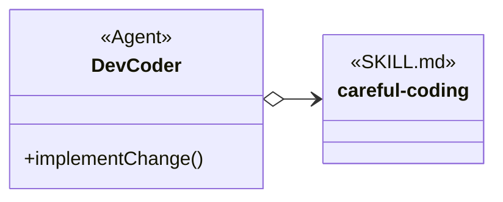

The open diamond means that Dev Coder knows the exact skill name. The solid line means that the reference is unconditional, so it needs no label. The empty careful-coding node means that Dev Coder loads the whole skill instead of selecting one displayed procedure.

### 2.2 Agent Conditionally Loads A Skill By Exact Name

A conditional Agent Skill is still named directly by the Agent definition, but the reference applies only when its condition is satisfied.

- **RULE: RULE-7** A condition routes an Agent to a named Agent Skill
  - **SYNOPSIS:** The Agent definition knows the exact skill name but uses that skill only when the declared condition matches the request and available evidence.
  - **EXAMPLE:** “If the user requests TDD, use the test-driven-development skill.”

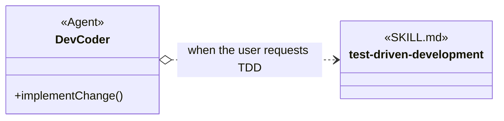

The open diamond still means exact-name knowledge. The dotted line means conditional loading, and the arrow label states the condition. Solid and dotted class references differ only in conditionality; both point from the referencing Agent to the named skill.

### 2.3 Agent Uses A Procedure Mapped Through AGENTS.md

An Injected Skill is selected through AGENTS.md. The Agent instruction says what must be done without naming the skill that will do it. AGENTS.md names the skill to use for that project. When the Agent instruction, AGENTS.md, and the selected skill use the same procedure wording, that wording forms the Skill interface in this analogy.

- **RULE: RULE-1** A procedure name can decouple an invoker from a skill implementation
  - **SYNOPSIS:** The procedure name describes the work that is needed. The Agent instruction can request that work while AGENTS.md chooses the skill that explains how to do it.
  - **EXAMPLE:** The Agent instruction says, “When a new enhancement is requested, create a new work item.” AGENTS.md says, “To create a new work item, use the manage-work-item-gitlab skill.”

- **RULE: RULE-2** The Agent, AGENTS.md, and the implementing SKILL.md share the same procedure name
  - **SYNOPSIS:** The same procedure wording connects what the Agent must do, which skill AGENTS.md selects, and where that skill explains the work.
  - **EXAMPLE:** The words “create a new work item” appear in the Agent instruction and the AGENTS.md instruction. The selected GitLab skill explains that work in its Create New Work Item section.

- **RULE: RULE-3** An Injectable Skill encapsulates selectable technology or procedure details
  - **SYNOPSIS:** The selected skill contains the detailed instructions that should not be repeated in the Agent definition.
  - **EXAMPLE:** The Agent instruction only says to create a work item. The manage-work-item-gitlab skill explains the GitLab search, creation, and verification steps.

- **RULE: RULE-4** AGENTS.md selects one of several implementations
  - **SYNOPSIS:** AGENTS.md tells the Agent which skill to load when the work is needed.
  - **EXAMPLE:** One project can say, “To create a new work item, use the manage-work-item-file skill.” Another can say, “To create a new work item, use the manage-work-item-gitlab skill.”

The diagram uses method-like names to keep the relationship compact. These names are not code copied from the Agent definition or AGENTS.md. DII describes this indirect instruction relationship in the analysis; it is not part of the AGENTS.md node’s stereotype.

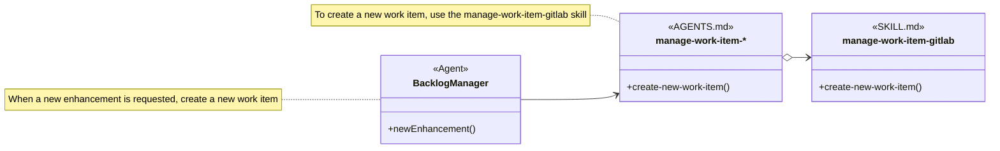

Read the diagram as a picture of three written instructions:

- The Backlog Manager Agent definition says, “When a new enhancement is requested, create a new work item.”
- The project AGENTS.md says, “To create a new work item, use the manage-work-item-gitlab skill.”
- The manage-work-item-gitlab SKILL.md has a Create New Work Item section that explains how to do that work in GitLab.

The method-like label newEnhancement() stands for the first instruction. The label create-new-work-item() stands for the shared words “create a new work item.” Neither label means that the Agent definition or AGENTS.md contains a software function.

The regular arrow shows that the Agent instruction asks for a new work item without naming a skill. The open-diamond arrow shows that AGENTS.md names the skill selected for the project. If a project stores work items in files, AGENTS.md can name manage-work-item-file instead. The Backlog Manager instruction remains unchanged.

The manage-work-item-* node is diagram shorthand for the work-item skill selected by AGENTS.md. It is not a literal skill name or a line that would appear in an Agent definition. The concrete work-item skill names are analysis vocabulary for this example; they do not assert that those skill definitions already exist in the repository.

### 2.4 A Request Selects A Skill

A request can select an available skill without a declared reference from an Agent definition or AGENTS.md.

- **RULE: RULE-50** Request-triggered selection is scoped to the request
  - **SYNOPSIS:** A skill loader can select a discovered skill because the request names it explicitly or because the request matches its declared purpose. This selection does not add a durable Agent Skill or AGENTS.md relationship.
  - **EXAMPLE:** A request that names ast-grep, or asks for structural code matching that fits the ast-grep description, can select ast-grep for that request without changing an Agent definition.

The request-triggered forms are:

- explicit selection by skill name or marker;
- implicit selection from the request and a skill’s description or trigger conditions.

No class diagram is needed for this case. The selection is a request-routing event rather than a persistent reference owned by an Agent definition or AGENTS.md. The running agent can still read and apply the selected SKILL.md after routing succeeds.

The use cases differ at their selection boundary:

| Use case | Selection source | Exact skill name known by | Scope |
| --- | --- | --- | --- |
| Unconditional Agent Skill | Agent definition | Agent definition | Every execution of that Agent role. |
| Conditional Agent Skill | Agent definition condition | Agent definition | Executions whose request and evidence satisfy the condition. |
| Procedure mapped through AGENTS.md | Shared procedure in the Agent; implementation binding in AGENTS.md | AGENTS.md | The effective project binding for that procedure. |
| Request-triggered skill | Explicit request marker or request-to-description match | Skill loader or caller | The current request. |

## 3. Showing A SKILL.md In A Diagram

A SKILL.md node shows only what the relationship needs. Before adding a member, read the skill and make sure the label represents instructions that the skill actually contains.

- Use the skill’s exact kebab-case name as the node name.
- Leave the member area empty when the relationship loads the whole skill.
- Add a method-like member only when the relationship focuses on a procedure described by the skill. The member is diagram shorthand for written instructions, not a claim that SKILL.md contains software code.
- Add a +reference member only when non-invoked guidance matters to the relationship.
- If the skill does not clearly describe a procedure, leave that member out instead of inventing one.

For example, careful-coding stays empty when Dev Coder loads the whole skill. The manage-work-item-gitlab node can show create-new-work-item() when the diagram focuses on its Create New Work Item instructions.

When a visible class name contains characters that Mermaid cannot use in an identifier, the diagram uses a separate internal identifier and quoted display label. The display label is the analysis identity; the internal identifier exists only to render the diagram. For example, manage-work-item is the internal identifier for the visible manage-work-item-* AGENTS.md node in Section 2.3.

## 4. Skill Organization

### 4.1 Peer Skills

Peer Skills are sibling SKILL.md files that divide one domain into complementary responsibilities. An Agent definition or project guidance loads the applicable siblings as a set. The siblings do not need to name or invoke one another.

- **RULE: RULE-28** Peer Skills divide a domain into complementary responsibilities
  - **SYNOPSIS:** Each sibling owns one cohesive part of the domain while relying on a compatible shared vocabulary.
  - **EXAMPLE:** work-item-base defines work items, states, and rules; work-item-dispatch changes status under dispatch rules; work-item-monitor observes work items and raises alarms.

- **RULE: RULE-29** A sibling-set loader loads the applicable Peer Skills
  - **SYNOPSIS:** An Agent definition or AGENTS.md names the sibling set needed for one role so the complete dependency set remains visible in one place.
  - **EXAMPLE:** Work Item Coordinator loads work-item-base and work-item-dispatch, while Work Item Watchdog loads work-item-base and work-item-monitor.

- **RULE: RULE-30** Direct Peer Skill references create stronger coupling
  - **SYNOPSIS:** A skill that names another skill creates a skill-to-skill dependency that must be traced in addition to the sibling set declared by the Agent or AGENTS.md.
  - **EXAMPLE:** complete-work-item-feature-branch names create-pull-request directly, so that relationship is more coupled than two siblings loaded together by one Agent.

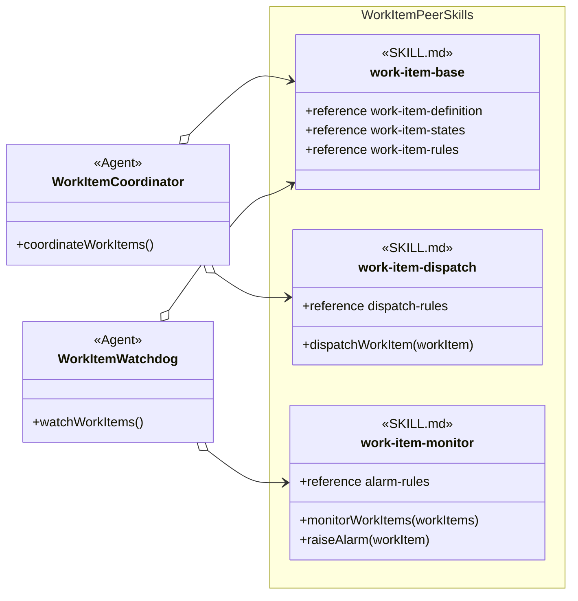

The open diamonds mean that each Agent knows the exact sibling skill names it loads. No arrows connect the Peer Skills because the sibling-set loader, not a sibling, declares the set. Work Item Coordinator and Work Item Watchdog each select work-item-base once as shared domain context, then select only the specialized sibling needed by that role. Whether a harness caches or rereads an already selected SKILL.md is a runtime concern outside this analysis.

The same sibling set can be expressed in AGENTS.md when the set is project-specific rather than fixed in an Agent definition. Keeping the set in the Agent or AGENTS.md makes the loaded hierarchy easier to inspect, change, and troubleshoot than a chain of skill-to-skill name references.

Technology selection is another Peer Skill use case, but it selects alternatives rather than loading several complementary siblings. For example, test-driven-development can refer to Run Project Tests while AGENTS.md selects JUnit or Jest. A direct skill-to-skill reference remains valid when the invoking skill intentionally owns that dependency; its open-diamond arrow records the stronger coupling.

| Peer arrangement | Sibling-set loader | Loaded result | Dependency shape |
| --- | --- | --- | --- |
| Sibling set | Agent definition or AGENTS.md | Several complementary skills. | The sibling-set loader names each sibling; siblings do not name one another. |
| Technology or provider selection | AGENTS.md | One implementation among alternatives. | The caller knows a procedure; AGENTS.md knows the selected skill name. |
| Direct Peer Skill reference | Invoking SKILL.md | One named complementary skill when needed. | The invoking skill names the peer directly. |

The work-item sibling names and their displayed members are analysis vocabulary supplied for this example. They do not assert that those exact skill definitions already exist in the repository.

### 4.2 Skill Groups And Containment

A skill group is a named set used to organize skills for comprehension. It collects skills that contribute to one methodology capability or setup option, whether those skills are listed directly in the group or reached through a nested skill group.

A nested skill group is the same kind of object as its parent. The word subgroup describes only its position inside that parent; it does not introduce a second kind of group. For any skill group:

- direct skills are the skills listed immediately in that group;
- nested skill groups are smaller named sets included by that group; and
- the group’s complete skill set is its direct skills plus the complete skill sets of all its nested groups.

This organization answers “Which skills should I consider part of this capability?” It does not answer “Which skill loads or invokes another skill?”

- **RULE: RULE-54** A solid diamond represents set containment
  - **SYNOPSIS:** A solid diamond from a skill group to a SKILL.md records direct membership. A solid diamond from one skill group to another records that the parent includes the child’s complete skill set.
  - **EXAMPLE:** Concurrent Tasking directly contains codex-workitem-coordination and includes the Resource Coordination skill group, whose direct skills include agent-claim.

- **RULE: RULE-55** Containment does not imply use or dependency
  - **SYNOPSIS:** A containment line only builds the organizational set. An Agent, AGENTS.md, or SKILL.md still needs a separate regular or open-diamond reference when it invokes a procedure or names a skill.
  - **EXAMPLE:** Concurrent Tasking includes every Resource Coordination skill for comprehension, but that does not mean codex-workitem-coordination loads agent-claim or that every Concurrent Tasking skill uses it.

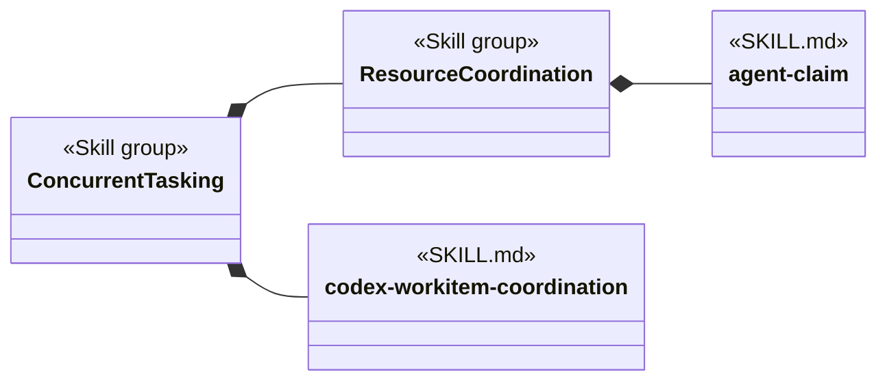

Concurrent Tasking has one direct skill in this view: codex-workitem-coordination. It also includes the nested Resource Coordination set, so agent-claim belongs to the complete Concurrent Tasking set through that nesting. The solid diamonds do not say that codex-workitem-coordination loads agent-claim or that Resource Coordination loads anything. Loading and invocation remain visible through the reference forms introduced in Section 2.

## 5. From User Request To Skill Interface

This section separates understanding the user’s request from choosing the implementation.

- **PROCESS: PROCESS-1** Receive a user request
  - **SYNOPSIS:** The Agent receives natural language describing a new enhancement.
  - **EXAMPLE:** The Agent is told, “Add a new Cancel button enhancement.”

- **PROCESS: PROCESS-2** Transform the request into an interface invocation
  - **SYNOPSIS:** The Agent invokes newEnhancement(), whose instructions refer to the create-new-work-item() procedure.
  - **EXAMPLE:** The Agent concludes, “A new enhancement requires me to create a new work item.”

- **RULE: RULE-8** Agent context carries enhancement intent rather than provider details
  - **SYNOPSIS:** newEnhancement() retains the enhancement request in Agent context. create-new-work-item() delegates provider representation to the selected manage-work-item-* skill.
  - **EXAMPLE:** Add a new Cancel button does not require newEnhancement() to know a repository path, GitLab project identifier, label set, or issue URL.

Sequence diagrams use solid messages for every request, action, and return. Their text is necessary because the diagram shows chronological actions rather than static references. Return messages begin with Return. Dotted lines remain reserved for conditional references in class diagrams.

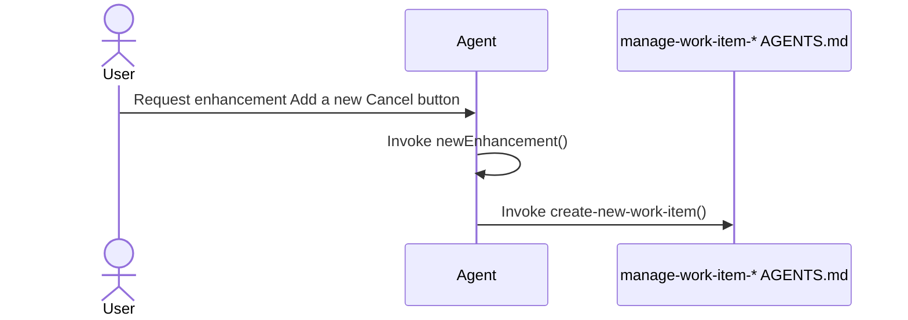

At this point, newEnhancement() has referred to the creation procedure, but the Agent has not chosen file or GitLab behavior itself.

## 6. Skills Injection Through AGENTS.md

AGENTS.md links a procedure name to a concrete SKILL.md.

- **PROCESS: PROCESS-3** Provide the injection instruction
  - **SYNOPSIS:** Effective project guidance tells the agent which skill to load when the procedure is needed.
  - **EXAMPLE:** “When you need create-new-work-item(), load manage-work-item-gitlab.”

- **RULE: RULE-9** AGENTS.md owns the binding outside the calling agent
  - **SYNOPSIS:** The Agent retains newEnhancement() and its create-new-work-item() reference when project setup chooses another matching implementation.
  - **EXAMPLE:** Changing the AGENTS.md binding from manage-work-item-gitlab to manage-work-item-file does not change newEnhancement().

Section 2.3 shows this binding as a regular arrow from Backlog Manager to the manage-work-item-* procedure family and an open-diamond arrow from AGENTS.md to manage-work-item-gitlab. The first reference preserves procedure-only knowledge in the Agent. The second reference records the exact skill name selected by project guidance.

Skills injection is an instruction relationship. The model does not require a compiled interface object or a software dependency-injection container.

## 7. Loading And Invoking The Selected SKILL.md

The agent follows the injection instruction only when it needs the Skill interface.

- **PROCESS: PROCESS-4** Load the selected skill
  - **SYNOPSIS:** The agent reads the SKILL.md named by AGENTS.md.
  - **EXAMPLE:** The agent concludes, “AGENTS.md binds manage-work-item-* to manage-work-item-gitlab, so I will load that SKILL.md.”

- **PROCESS: PROCESS-5** Find the procedure with the shared name
  - **SYNOPSIS:** The loaded SKILL.md uses the same procedure name and explains the concrete steps.
  - **EXAMPLE:** The agent finds the Create New Work Item section that defines create-new-work-item() for GitLab.

- **PROCESS: PROCESS-6** Invoke the selected procedure using Agent context
  - **SYNOPSIS:** The implementing procedure reads the enhancement intent already held in Agent context and applies provider-specific steps.
  - **EXAMPLE:** The GitLab procedure reads Add a new Cancel button, then applies its own duplicate search, issue creation, and read-back rules.

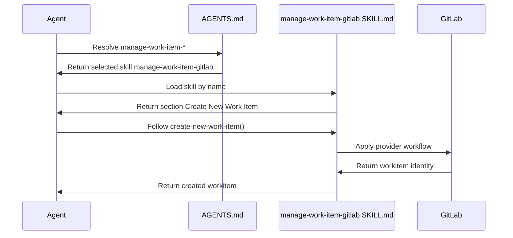

Every message is solid. Direction and the Return prefix distinguish information coming back from an action. The Agent’s newEnhancement() behavior and create-new-work-item() reference stay the same when another matching skill is selected. The provider-specific actions come from the loaded SKILL.md.

## 8. One Or More Procedures In A SKILL.md

The number of Skill interfaces depends on how many independently invocable procedure names the SKILL.md defines.

- **RULE: RULE-10** A simple SKILL.md can export one Skill interface
  - **SYNOPSIS:** One procedure name and its cohesive procedure are enough for a focused skill.
  - **EXAMPLE:** manage-work-item-gitlab can export create-new-work-item() through its Create New Work Item section.

- **RULE: RULE-11** A more complex SKILL.md can export several Skill interfaces
  - **SYNOPSIS:** One file can define several procedure names when it contains procedures that callers invoke independently and that do not describe the same cross-cutting concern.
  - **EXAMPLE:** agent-claim can export Acquire Claim and Release Claim as separate Skill interfaces.

- **RULE: RULE-12** Multiple interfaces describe the SKILL.md without deciding its structure
  - **SYNOPSIS:** The analysis records each independently invoked procedure name. It does not conclude from that fact alone that the SKILL.md should be split.
  - **EXAMPLE:** Acquire Claim and Release Claim remain distinct procedure names even though agent-claim defines both.

A function-style member belongs on an AGENTS.md DII or on a SKILL.md whose instructions describe that operation. A complex SKILL.md can show several procedure members together with +reference members when those details matter to the relationship.

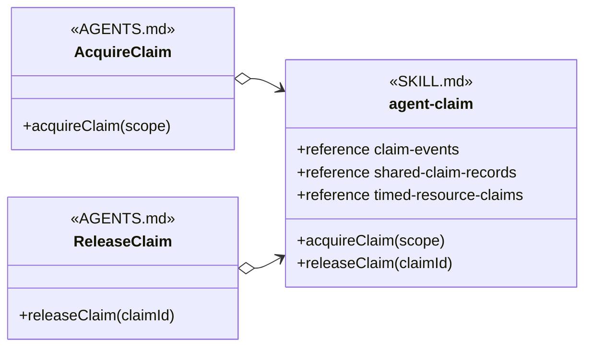

Each AGENTS.md DII refers to its own procedure name and can select agent-claim by exact name. acquireClaim(scope) is derived from Claim Events, while releaseClaim(claimId) is supported by Claim Events and Release Cleanup. The attribute-style members preserve the decision table and record rules that both procedures consult.

An Agent Skill or a directly referenced Peer Skill can also contain several procedures. Those procedures do not become interchangeable Skill interfaces merely because they share one file. Interchangeability requires the SKILL.md, its invokers, and alternative implementations to share the same procedure names and invocation meanings.

## 9. A Second Injected Example: Deliver Workitem

The same relationship applies to completion procedures.

- **PROCESS: PROCESS-7** Request delivery after review and testing
  - **SYNOPSIS:** A development workflow invokes Deliver Workitem with the accepted change after its required gates pass.
  - **EXAMPLE:** The caller concludes, “Review and testing passed. I must Deliver Workitem with accepted commit abc123.”

- **RULE: RULE-13** AGENTS.md selects the delivery SKILL.md
  - **SYNOPSIS:** The calling workflow uses the same procedure name while project guidance selects direct-main or feature-branch delivery.
  - **EXAMPLE:** AGENTS.md can link Deliver Workitem to complete-work-item-direct-main or complete-work-item-feature-branch.

The regular arrow shows that the development workflow knows Deliver Workitem by procedure name. The open-diamond arrows show the two exact skill names that AGENTS.md can select. The direct-main and feature-branch procedures remain different internally even though callers reach either one through the same procedure name.

## 10. Agent Dependency Views

An Agent can use named Agent Skills and Injected Skills together. A class view concentrates on the Agent’s expected behavior and dependency paths rather than its task-bound runtime state.

- **RULE: RULE-14** An Agent class view records reusable expectations and dependencies
  - **SYNOPSIS:** The Agent node shows the behavior relevant to the analysis, the procedure names it invokes, and the Agent Skills it names.
  - **EXAMPLE:** A coding-agent class can name careful-coding directly and invoke Deliver Workitem without naming the delivery SKILL.md.

- **RULE: RULE-15** Dependency views omit unrelated runtime state
  - **SYNOPSIS:** The class view shows the expectations and dispatch paths needed to understand skill use without modeling task values that do not change those relationships.
  - **EXAMPLE:** The coding Agent exposes deliverAcceptedChange() and its skill references without displaying an accepted commit or an awaiting-review state.

- **RULE: RULE-16** Technology and project skills can be injectable through shared procedure names
  - **SYNOPSIS:** A technology or project SKILL.md is injectable when it implements a procedure name and invocation meaning that the Agent already uses.
  - **EXAMPLE:** A testing agent can invoke Run Project Tests with a test scope while AGENTS.md selects a JUnit or Jest SKILL.md for the project.

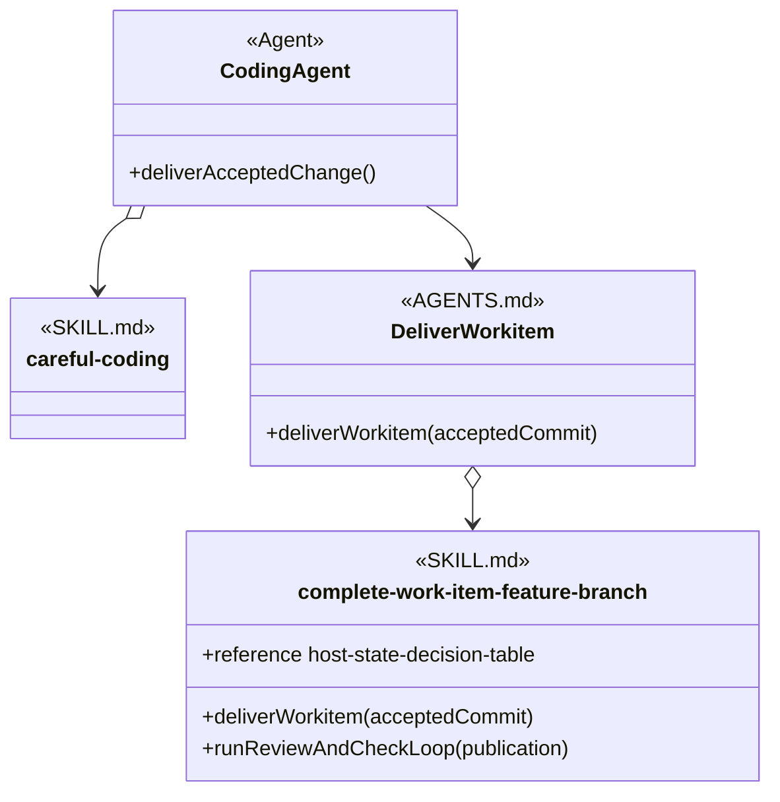

The Agent points directly to careful-coding because its definition names that skill. It points regularly to Deliver Workitem because it knows the procedure name. The AGENTS.md DII points by open diamond to the selected feature-branch skill.

The diagram explains dependencies and dispatch. It does not require the harness to construct software classes or imply an inheritance relationship.

## 11. Agent Superclass Stand-Ins

A shared relationship can appear once when many Agents reference the same skill in the same way. Drawing every Agent separately can hide the relationship behind repeated arrows.

A superclass stand-in is a diagram-compression device. It names the set of applicable Agents and carries their shared relationship. It is not a conceptual Agent definition and does not assert inheritance among those Agents.

- **RULE: RULE-38** A superclass stand-in represents Agents that share one relationship
  - **SYNOPSIS:** The stand-in replaces repeated Agent nodes only when every represented Agent reaches the same referenced node through the same reference form.
  - **EXAMPLE:** Structured Artifact Reviewers can stand in for every reviewer that names review-structured-artifact directly.

- **RULE: RULE-39** A superclass stand-in does not assert Agent inheritance
  - **SYNOPSIS:** The stand-in compresses the picture without claiming that the represented Agents inherit purpose, instructions, state, or behavior from a repository-defined base Agent.
  - **EXAMPLE:** A code reviewer and a methodology artifact reviewer can share the stand-in without becoming subclasses of one another or of a generated Reviewing Agent.

- **RULE: RULE-40** A stand-in is named after its applicability set
  - **SYNOPSIS:** Its name describes which Agents share the relationship and avoids invented runtime behavior.
  - **EXAMPLE:** Structured Artifact Reviewers is clearer than an invented Agent class with methods that do not exist in the Agent definitions.

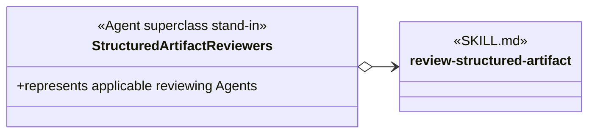

The open-diamond arrow says that every represented Agent names review-structured-artifact directly. No inheritance arrows are needed because the stand-in exists only to avoid drawing the same reference many times.

## 12. Constraints

- **RULE: RULE-20** A loaded skill is not necessarily injectable
  - **SYNOPSIS:** A SKILL.md is injectable only when it and its invokers share a procedure name and invocation meaning that another implementation can also use.
  - **EXAMPLE:** An Agent can load code-discovery by name as an Agent Skill without making code-discovery injectable.

- **RULE: RULE-21** Provider-specific procedure details remain inside SKILL.md
  - **SYNOPSIS:** A shared procedure name stabilizes the invoker. It does not make the file and GitLab procedures identical internally.
  - **EXAMPLE:** create-new-work-item() can produce a repository-backed record through manage-work-item-file and a GitLab issue through manage-work-item-gitlab while each procedure preserves provider-accurate evidence.

- **RULE: RULE-41** A superclass stand-in is not an injection mechanism
  - **SYNOPSIS:** A stand-in compresses repeated Agent relationships. An AGENTS.md DII selects a SKILL.md implementation for a procedure name.
  - **EXAMPLE:** Structured Artifact Reviewers can summarize exact-name references to review-structured-artifact, while manage-work-item-* still needs an AGENTS.md DII to select its provider skill.

- **RULE: RULE-23** The model remains conceptual
  - **SYNOPSIS:** The document explains the vocabulary and relationships without prescribing a schema, migration order, or repository change sequence.
  - **EXAMPLE:** The diagrams show manage-work-item-* with the AGENTS.md prototype without specifying a new YAML field for declaring it.

## 13. Definition Of Good

- **RULE: RULE-52** Class views make dependency and dispatch paths understandable
  - **SYNOPSIS:** A reader can identify which skills an Agent names, which procedures it expects, which conditions affect loading, and where AGENTS.md selects an implementation.
  - **EXAMPLE:** The diagrams distinguish Dev Coder’s direct careful-coding reference from Backlog Manager’s procedure-name path through AGENTS.md to manage-work-item-gitlab.

- **RULE: RULE-53** Class views make skill organization reviewable
  - **SYNOPSIS:** A reader can see which skills own shared context, which own specialized procedures, where sibling sets are loaded, which skills are direct group members, and which complete skill sets are included through nesting.
  - **EXAMPLE:** The analysis shows work-item-base shared by two Agent sibling sets while work-item-dispatch and work-item-monitor remain specialized siblings; it also shows agent-claim contained by Resource Coordination without deciding in advance that the skill should be split.

- **RULE: RULE-24** The diagrams distinguish AGENTS.md from SKILL.md
  - **SYNOPSIS:** Diagrams label an injected shared contract with the AGENTS.md stereotype and a concrete skill definition with the SKILL.md stereotype.
  - **EXAMPLE:** manage-work-item-* has the AGENTS.md stereotype; manage-work-item-gitlab has the SKILL.md stereotype.

- **RULE: RULE-25** The complete workitem invocation is traceable
  - **SYNOPSIS:** A reader can follow the request from the user, through newEnhancement() and its creation reference, through AGENTS.md injection, to the selected SKILL.md procedure.
  - **EXAMPLE:** Add a new Cancel button invokes newEnhancement(), which refers to create-new-work-item(); AGENTS.md selects manage-work-item-gitlab, whose Create New Work Item section performs the GitLab procedure.

- **RULE: RULE-26** Declared relationships and request-triggered selection have valid uses
  - **SYNOPSIS:** The model distinguishes exact Agent dependencies, sibling-set loading, skill-group set containment, AGENTS.md substitution, direct skill-to-skill coupling, and request-scoped selection.
  - **EXAMPLE:** Dev Coder names careful-coding, Work Item Coordinator loads two work-item peers, Resource Coordination contains agent-claim, manage-work-item-* uses injection, complete-work-item-feature-branch names create-pull-request, and a structural-search request selects ast-grep only for that request.

- **RULE: RULE-51** The four skill use cases remain distinct
  - **SYNOPSIS:** The method separates unconditional exact-name loading, conditional exact-name loading, procedure mapping through AGENTS.md, and request-triggered selection.
  - **EXAMPLE:** Section 2 gives every use case its own subsection and omits a persistent class relationship for request-triggered ast-grep selection.

- **RULE: RULE-27** Every assertion includes an example
  - **SYNOPSIS:** Each GOAL, RULE, PROCESS, and other structured assertion is followed by an EXAMPLE.
  - **EXAMPLE:** RULE-20 defines the Injectable Skill boundary and illustrates it with code-discovery.

- **RULE: RULE-42** Every reference points from the referencing node to the referenced node
  - **SYNOPSIS:** The source appears first, the arrowhead points to the target, and an open diamond remains on the source that knows an exact skill name.
  - **EXAMPLE:** manage-work-item o--> manage-work-item-gitlab reads from the AGENTS.md DII that names the matching skill to the SKILL.md that it selects.

- **RULE: RULE-43** Line and endpoint form expose name knowledge and conditionality
  - **SYNOPSIS:** In declared relationships, a regular line means procedure-name reference, an open diamond means exact skill-name reference, and the dotted form means the reference is conditional. Only a dotted class reference carries text, and that text states the condition.
  - **EXAMPLE:** The label “when the user requests TDD” on DevCoder o..> test-driven-development means that Dev Coder conditionally loads that exact named skill.

## 14. Applied Methodology Skill Groups

This section applies the reusable method to the established development-methodology skill groups. It contains the shared application boundary and navigation, while every group keeps its current and proposed diagrams in a separate document.

### 14.1 Application Scope

Every group document contains:

- a Current Design class diagram of the Agent, AGENTS.md, and SKILL.md relationships;
- a Proposed Design class diagram that applies the recommendations while retaining the same relationship view;
- the current SKILL.md headings that act as procedure boundaries in that view;
- one recommendation for every current skill whose primary direct group appears at the top level or as a nested group in that document; and
- any proposed skill extractions assigned to that group.

The seven group documents are top-level comprehension views covering forty-one current skills. Concurrent Tasking also contains two nested skill groups inside its document. The proposed designs retain the forty-one responsibilities and add two extracted Concurrent Tasking skills, producing forty-three proposed skill packages. Each skill has one primary direct group, which can be a top-level group or a nested group. Membership inherited from a nested group does not assign the skill a second primary group. A repeated skill outside its primary direct group and its containing ancestors is marked Cross-group.

The current diagrams describe the current definitions. The proposed diagrams visualize possible definition improvements described by the recommendations. Neither a proposed diagram nor a recommendation changes a skill or claims that a recommended interface already exists.

Each recommendation uses one or both improvement forms: a clearer operation-shaped skill name, or procedure headings that give invokers and alternative implementations consistent interface vocabulary. Keep the skill name means that only heading changes are recommended.

### 14.2 Applied Model Legend

The relationship, node, member, containment, and display-label conventions come from the reusable method above. This application adds only the conventions needed to compare current definitions with proposed improvements:

- A Current Design uses exact current skill names and procedure members derived from current headings. A generic current heading such as Workflow remains workflow() in that view.
- A Proposed Design uses the recommended skill names and procedure headings.
- A gold SKILL.md node has a proposed skill-name change. Its renamed-from member records the current exact name.
- A blue SKILL.md node is a proposed skill extracted from part of a current skill. Its extracted-from member records the source skill.
- A neutral SKILL.md node keeps its current skill name while its method-like members show proposed procedure headings.
- A Cross-group node repeats a skill outside its primary direct group and outside any parent group that includes it through nesting.
- A repeated gold or blue Cross-group node represents the same rename or extraction shown in the primary group, not another recommendation.
- AGENTS.md procedure-family labels and relationship endpoints use the vocabulary for the design state being shown.

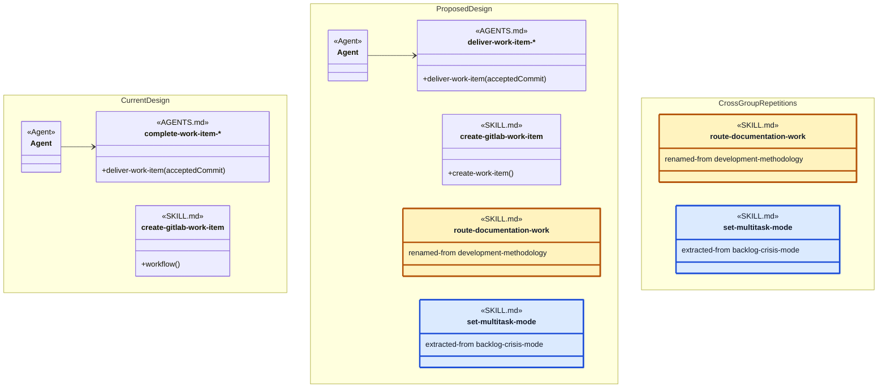

The Current Design namespace keeps the current skill identity, current Workflow member, and current AGENTS.md family label. The Proposed Design namespace shows four proposal forms: a neutral skill with a clearer procedure heading, a gold renamed skill, a blue extracted skill, and the proposed AGENTS.md family label. The two regular arrows demonstrate that a relationship endpoint uses the vocabulary of the design state in which it appears.

The Cross Group Repetitions namespace repeats the same visible route-documentation-work and set-multitask-mode identities shown in Proposed Design. The repeated rename keeps the gold treatment and renamed-from member, while the repeated extraction keeps the blue treatment and extracted-from member. Cross-group identifies the repeated placement; it does not create another recommendation. No line connects a Current Design node to a Proposed Design node because the two namespaces compare design states rather than declare runtime dependencies.

### 14.3 Group Designs

- [Baseline Development](skill-groups/baseline-development.md)
- [Project Setup](skill-groups/project-setup.md)
- [Documentation Methodology](skill-groups/documentation-methodology.md)
- [Backlog Management](skill-groups/backlog-management.md)
- [Concurrent Tasking](skill-groups/concurrent-tasking.md)
- [Direct Main Delivery](skill-groups/direct-main-delivery.md)
- [Review And Verification](skill-groups/review-and-verification.md)

### 14.4 Application Definition Of Good

- **RULE: RULE-56** Each established skill group has independent current and proposed designs
  - **SYNOPSIS:** A reader can inspect one responsibility boundary and compare its current and recommended organization without loading the other six groups.
  - **EXAMPLE:** Concurrent Tasking contains paired diagrams for resource coordination and feature-branch delivery without repeating the Backlog Management provider matrix.

- **RULE: RULE-57** Every current skill receives one source-backed improvement recommendation
  - **SYNOPSIS:** A recommendation either improves the skill name or introduces procedure headings that can become stable interface vocabulary.
  - **EXAMPLE:** create-gitlab-work-item keeps its current name but receives a proposed Create Work Item heading because its current entry procedure is only named Workflow.

- **RULE: RULE-58** Current and recommended vocabulary remain visibly separate
  - **SYNOPSIS:** Current Design shows current names and headings, while Proposed Design shows the vocabulary recommended by the table.
  - **EXAMPLE:** The Backlog Management current diagram shows workflow() for create-gitlab-work-item, while its proposed diagram shows create-work-item().

- **RULE: RULE-59** Every proposed skill-name change is identifiable by color and text
  - **SYNOPSIS:** A gold node distinguishes a proposed name from unchanged names, and renamed-from preserves the current identity for readers who do not rely on color.
  - **EXAMPLE:** The proposed Concurrent Tasking diagram highlights integrate-agent-work and records renamed-from agent-work-merge inside the same node.

- **RULE: RULE-60** Every proposed skill extraction identifies its source and primary direct group
  - **SYNOPSIS:** A blue node distinguishes a new extracted package from a rename, and extracted-from preserves the current source boundary.
  - **EXAMPLE:** set-solo-mode and set-multitask-mode are direct members of Concurrent Tasking and appear as Cross-group dependencies in Backlog Management.

## 15. Glossary

The glossary summarizes concepts after the examples have established them.

| Term | Meaning | Example |
| --- | --- | --- |
| Global Agent space | The execution space in which an Agent can find available SKILL.md files. Availability alone does not create a reference. | careful-coding and test-driven-development can both be available while one Agent execution loads only the applicable skills. |
| Skill selection | A decision that one available skill applies to an Agent execution or request. Selection does not prove that the full instructions entered context. | A conditional rule selects test-driven-development when the user requests TDD. |
| Skill loading | The complete selected SKILL.md entering the active context so its instructions can be followed. | After AGENTS.md selects manage-work-item-gitlab, the agent reads that SKILL.md. |
| Exact skill name | The identity used to resolve one skill package and its SKILL.md. It is not the shared literal filename SKILL.md. | careful-coding resolves the careful-coding package. |
| Skill interface | A shared procedure name and invocation meaning used by an invoker and by the SKILL.md that supplies the procedure. | manage-work-item-* exposes create-new-work-item(). |
| Polymorphism | The object-oriented analogy in which one procedure expectation can be supplied by different skill implementations without changing the invoker. It does not assert runtime language dispatch. | create-new-work-item() can be supplied by a file-backed or GitLab-backed work-item skill. |
| Procedure name | The name that identifies the operation an invoker needs. | create-new-work-item. |
| Procedure context | Information already held by the invoking Agent for use by the named procedure. | Enhancement description: Add a new Cancel button. |
| Procedure | Instructions in a SKILL.md that explain how to perform the named operation. | Create a GitLab issue, read it back, and return its identity. |
| Reference member | Attribute-style notation for guidelines, invariants, boundaries, routing, tables, or contracts that procedures consult but do not invoke independently. | +reference claim-events in agent-claim. |
| AGENTS.md DII | The indirect binding relationship represented by an abstract node whose stereotype is AGENTS.md. The node exposes a procedure whose matching skill is selected by name through AGENTS.md. | manage-work-item-* points to manage-work-item-gitlab after project setup selects GitLab persistence. |
| SKILL.md | A concrete skill definition containing one or more procedures and reference sections. | manage-work-item-gitlab contains a Create New Work Item section in this analysis example. |
| Agent Skill | A SKILL.md referenced by exact name in an Agent definition for every execution or under a routing condition. | Dev Coder names careful-coding unconditionally and test-driven-development conditionally. |
| Injectable Skill | A SKILL.md written with a shared procedure name and invocation meaning so AGENTS.md can select it without changing its invoker. | manage-work-item-file and manage-work-item-gitlab can both supply create-new-work-item(). |
| Injected Skill | The Injectable Skill selected through AGENTS.md for one procedure in an effective project configuration. | manage-work-item-gitlab is the Injected Skill when AGENTS.md binds it to manage-work-item-*. |
| Skills injection | The AGENTS.md selection that links an abstract skill family and procedure to one concrete SKILL.md. | When create-new-work-item() is needed, load manage-work-item-gitlab. |
| Request-triggered skill selection | Selection caused by an explicit skill name or marker in the request, or by a match between the request and the skill’s declared purpose. It does not require an Agent-definition reference or AGENTS.md binding. | A structural-search request selects ast-grep for the current request. |
| Peer Skill | One of several sibling SKILL.md files that divide a domain into complementary responsibilities and can be loaded together by a sibling-set loader. A Peer Skill does not need to name another sibling. | Work Item Coordinator loads work-item-base and work-item-dispatch. |
| Sibling-set loader | The Agent definition or AGENTS.md guidance that declares which complementary Peer Skills are loaded together. | Work Item Watchdog loads work-item-base and work-item-monitor. |
| Direct Peer Skill reference | An exact-name dependency declared by one SKILL.md on another complementary SKILL.md. It is stronger coupling than having a common Agent or AGENTS.md sibling-set loader. | complete-work-item-feature-branch names create-pull-request. |
| Exact-name reference | An open-diamond arrow from a node that knows a skill’s exact name to that SKILL.md. | DevCoder o--> careful-coding. |
| Procedure-name reference | A regular arrow from an invoker to the procedure it knows without naming the implementing SKILL.md. | BacklogManager --> manage-work-item. |
| Conditional reference | A dotted regular or open-diamond arrow whose label states the loading condition. | DevCoder o..> test-driven-development, labeled “when the user requests TDD.” |
| Agent class view | A diagram node that represents the Agent behavior, expectations, and dependencies relevant to the analysis without asserting a runtime class. | Coding Agent names careful-coding and refers to Deliver Workitem. |
| Skill group | A named set used to organize skills for comprehension. Its complete skill set contains its direct skills plus every skill in its nested skill groups. The group does not itself load or invoke those skills. | Concurrent Tasking directly contains codex-workitem-coordination and includes the skills nested under Resource Coordination. |
| Nested skill group | A skill group included inside another skill group. It is the same kind of object as its parent; subgroup is only a relative description of its position. | Resource Coordination is a skill group nested inside Concurrent Tasking. |
| Direct group membership | A solid-diamond line from a skill group to a SKILL.md that places the skill immediately in that group. | Resource Coordination *-- agent-claim makes agent-claim a direct member of Resource Coordination. |
| Nested set containment | A solid-diamond line from a parent skill group to a child skill group. The parent’s complete skill set includes the child’s complete skill set. It is not a loading, invocation, or dependency reference. | Concurrent Tasking *-- Resource Coordination includes Resource Coordination and all of its skills in the Concurrent Tasking comprehension view. |
| Mermaid display label | The visible analysis identity used when Mermaid requires a different internal class identifier. | The internal manage-work-item identifier displays manage-work-item-*. |
| Skill hierarchy | An organizational view of skill groups, families, responsibilities, procedures, sibling-set loaders, and dependencies. It does not by itself assert software inheritance. | work-item-base, work-item-dispatch, and work-item-monitor form a sibling family used by two Agent sibling sets. |
| Agent superclass stand-in | A diagram-compression node representing several Agents that share the same relationship. It does not assert inheritance. | Structured Artifact Reviewers represents reviewers that all name review-structured-artifact. |
| Empty SKILL.md node | A concrete skill class with no displayed procedure or reference members, meaning that the relationship loads the whole skill. | careful-coding under Dev Coder. |
| Procedure member | A method-like diagram label for a procedure described by the skill’s written instructions. | +create-new-work-item() in manage-work-item-gitlab when the relationship focuses on its Create New Work Item instructions. |

## Authoritative Inputs

- The user-supplied object-oriented analysis, vocabulary corrections, containment convention, and methodology skill-group organization for this document.
- The forty-one SKILL.md files and conceptual Agent definitions linked from the seven group documents.
- [Bundled Skill Inventory](../README.md)
- [Agentic Configuration](agentic-configuration.html)
- [Agent Skill Architecture](skills-modularization.html)
- [Work-Item Provider And Completion Contracts](work-item-provider-and-completion-contracts.md)
- [Complete Work Item Direct Main](../skills/complete-work-item-direct-main/SKILL.md)
- [Complete Work Item Feature Branch](../skills/complete-work-item-feature-branch/SKILL.md)
- [Create Pull Request](../skills/create-pull-request/SKILL.md)
- [Careful Coding](../skills/careful-coding/SKILL.md)
- [Test-Driven Development](../skills/test-driven-development/SKILL.md)
- [JUnit](../skills/junit/SKILL.md)
- [Jest](../skills/jest/SKILL.md)
- [Agent Claim](../skills/agent-claim/SKILL.md)
- [Review Structured Artifact](../skills/review-structured-artifact/SKILL.md)
- [Dev Coder](../agents/roles/dev-activities/dev-coder.role.yaml)
- [Mermaid Class Diagram Relationships](https://mermaid.js.org/syntax/classDiagram.html)
- [Mermaid Sequence Diagram Messages](https://mermaid.js.org/syntax/sequenceDiagram)
