# Object-Oriented Analysis Of Agents And Skills

## Scope

This document uses class designs to analyze how Agents and skills are related, dispatched, and organized.

It covers:

- Agent dependencies and procedure expectations;
- unconditional, conditional, procedure-mapped, and request-triggered skill use cases;
- Agent Skills;
- Injected Skills;
- Agent Groups used to organize related Agent definitions;
- Skill Groups and their expanded and collapsed diagram forms;
- skill families and maintainable skill organization;
- Skill interfaces and SKILL.md files;
- diagram conventions introduced where each relationship first appears.

Object-oriented concepts are used as an analogy for understanding coupling. They do not assert that the runtime implements software classes, inheritance, or a dependency-injection container.

The document explains relationships through examples while defining no schema, migration, or repository change sequence.

The method concludes with an applied overview of the methodology skill groups. The detailed steady-state diagrams remain in separate group documents so a reader can use the method without loading the complete applied inventory.

## 1. Finality

Finality states why the object-oriented analogy is useful for understanding Agent dependencies, skill dispatch, and skill organization.

- **GOAL: GOAL-1** Use class designs to understand how Agents and skills are related
  - **SYNOPSIS:** The analysis makes Agent dependencies, procedure expectations, loading conditions, and AGENTS.md dispatch visible in one model.
  - **BECAUSE:** Skills are loaded independently, so their instructions can clash when their relationships and responsibilities are unclear.
  - **BECAUSE:** Agents reference some skills directly, while project directives in AGENTS.md map other procedure names to specific skill implementations.
  - **BECAUSE:** Skills hide procedure details behind shared procedure names in a way that resembles object-oriented polymorphism.
  - **EXAMPLE:** Class designs show Dev Coder naming explain-code-fix and conditionally naming test-driven-development when the user requests TDD, while Backlog Manager invokes transition-work-item() through an AGENTS.md mapping that can select a file-backed or GitLab-backed implementation. The independently loaded dependencies and interchangeable procedure providers become visible instead of remaining hidden in separate files.

- **GOAL: GOAL-2** Understand and improve skill organization
  - **SYNOPSIS:** The analysis compares skill responsibilities, procedure families, and dependencies so maintainable skill hierarchies can be designed.
  - **BECAUSE:** A visible hierarchy makes skill ownership, extension, and substitution easier to reason about.
  - **EXAMPLE:** A Work Item skill can be split into a Skill Group whose non-overlapping members define work items, dispatch them, and monitor them. An expanded diagram shows all three members together, while a collapsed diagram can represent the same set as one group node.

## 2. Skill Diagrams And Use Cases

Skills exist in a global Agent space, much as code modules exist in a process. The space makes a SKILL.md available for loading, but availability alone does not create coupling.

Skill selection and skill loading are related but distinct. A declaration or request first selects a skill. The selected SKILL.md must then enter the active context before its instructions can be applied. The diagrams in this section show selection references; they do not by themselves prove that the complete file was read or followed.

Every portable skill package stores its instructions in a file named SKILL.md. In this analysis, loading by file name means loading the package resolved from an exact skill name such as careful-coding. It does not mean that the shared literal filename SKILL.md uniquely identifies a skill.

Part 2 introduces each node and relationship when the analysis first needs it. Loading and procedure arrows point from the referencing node to the referenced node. A realization arrow points from an implementing skill to the Interface Skill whose contract it supplies.

An applied analysis uses this notation to explain the design rather than organizing the document around arrow types. The document progresses through two levels:

1. Overall diagrams establish the Agent groups, Skill Groups, and major dependencies needed to understand the landscape.
2. Scenario sections state a concrete situation, then keep its consumers, project routing, Interface Skills, and Provider Skills together.

Exact-name loading, conditional loading, procedure references, and realization are properties of the relationships inside those views.

An arrow to an Agent Group or Skill Group summarizes one or more relationships at the group level. Use a regular arrow for that summary and a dotted regular arrow when it applies conditionally. Do not use an open diamond merely because an underlying Agent eventually loads a named skill; the open diamond is reserved for a source node that itself knows the exact target skill name shown in the diagram.

Use engineering terms for the mechanism actually shown. Reserve transport for a concrete communication mechanism that carries protocol messages, such as stdio or WebSockets. MCP is a protocol rather than a transport. A skill that invokes a local command is a command-line helper or local command invocation, not a command transport. Prefer direct descriptions such as invokes a local command or calls an MCP tool when those statements explain the dependency more accurately.

### 2.1 Showing A SKILL.md In A Diagram

A skill is represented like a class because it encapsulates procedures and data. In practice, each diagram shows only the procedures and data needed in context. Before adding a member, read the skill and make sure the label represents a definition or procedure that the skill actually contains.

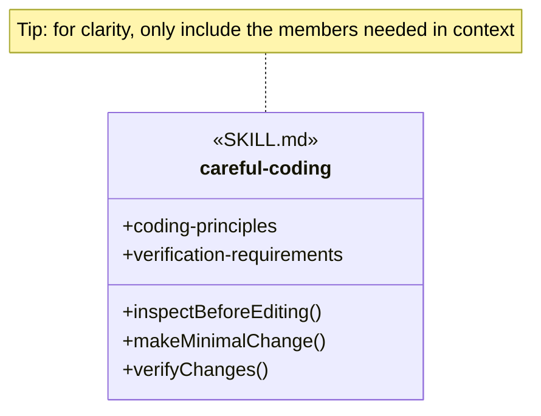

The displayed careful-coding members are illustrative analysis vocabulary. They demonstrate data and function member notation without asserting that those exact member names appear in the current skill definition.

An empty SKILL.md node means that the skill describes a single procedure, so the skill identity already represents that operation.

- Use the skill’s exact kebab-case name as the node name.
- Leave the member area empty if the skill describes a single procedure.
- Add a function member with parentheses only when the relationship focuses on a procedure described by the skill. The member is diagram shorthand for written instructions, not a claim that SKILL.md contains software code.
- Add a data member without parentheses when exposed definitions, structures, states, rules, values, or other non-procedural information matter to the relationship.
- If the skill does not clearly describe a procedure, leave that member out instead of inventing one.

The plus sign means that a member is exposed to users of the skill. Parentheses distinguish a function member from a data member. A data member is not an outgoing reference to another object. Dependencies remain between whole Agent, AGENTS.md, or SKILL.md nodes because the complete referenced file is loaded into context.

For example, verify-documentation-page stays empty because that SKILL.md describes one procedure. The manage-work-items-gitlab node can show transition-work-item() when the skill exposes that function among other members. A work-item interface can show work-item-definition without parentheses when that shared data structure matters to the relationship.

When a visible class name contains characters that Mermaid cannot use in an identifier, the diagram uses a separate internal identifier and quoted display label. The display label is the analysis identity; the internal identifier exists only to render the diagram.

### 2.2 Showing An Agent In A Diagram

An Agent node represents one agent definition rather than one running task. The native definition format depends on the harness. Codex stores an agent in a TOML file whose properties include its runtime name, description, developer instructions, model settings, and enabled harness skills. Claude Code stores an agent in a Markdown file whose YAML frontmatter carries metadata such as name, description, skills, and model, while the Markdown body carries the instructions.

The diagram uses the portable agent identity even when a harness changes its runtime spelling. For example, the portable dev-coder identity is rendered in the Codex file dev-coder.toml with the runtime name dev_coder, while the Claude Code file dev-coder.md retains the name dev-coder.

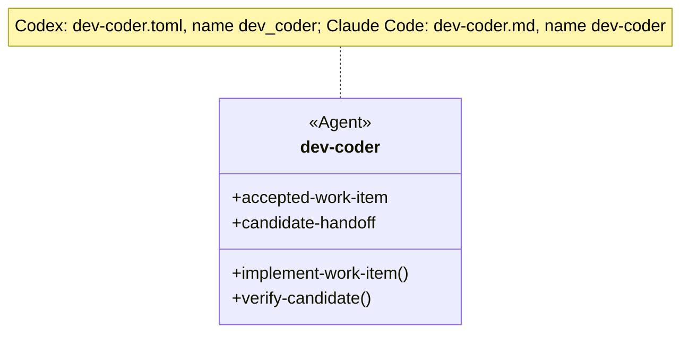

The Agent stereotype distinguishes an agent definition from a SKILL.md or AGENTS.md node. Function members summarize procedures or responsibilities expressed by the agent instructions; they are not literal functions in the TOML or Markdown file. Data members summarize inputs, outputs, constraints, or other information relevant to the relationship being analyzed. The displayed dev-coder members are analysis vocabulary derived from its work-item input, implementation workflow, verification responsibility, and candidate handoff.

Show only the Agent members needed by the diagram. Leave the member area empty when the relationship needs only the Agent identity. Model the native TOML or Markdown file as a separate node only when the analysis concerns generation, serialization, or adapter ownership rather than Agent and skill relationships.

### 2.3 Agent Loads A Skill By Exact Name

An Agent Skill is a SKILL.md that an Agent definition references by exact skill name. This makes the skill a declared dependency of that Agent role rather than a project-selected implementation.

- **RULE: RULE-5** An Agent Skill is referenced by its exact skill name
  - **SYNOPSIS:** The Agent definition knows the exact skill identity and follows the procedures and instructions in the resolved SKILL.md.
  - **EXAMPLE:** A Documentation Agent can name verify-documentation-page directly in its skill list.

- **RULE: RULE-6** An unconditional Agent Skill applies to every execution of the Agent role
  - **SYNOPSIS:** An Agent definition lists the skill without a condition because that dependency belongs to every execution of the role.
  - **EXAMPLE:** A Documentation Agent can list verify-documentation-page without a condition so every execution applies it.

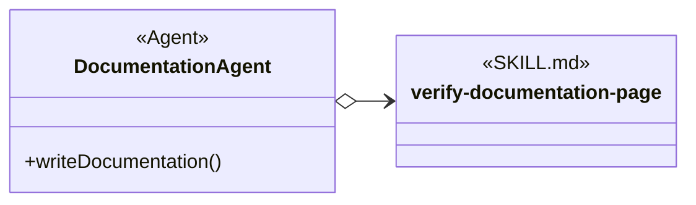

The open diamond means that Documentation Agent knows the exact skill name. The solid line means that the reference is unconditional, so it needs no label. The verify-documentation-page member area is empty because the skill describes one procedure; repeating the operation as a function member would add no information.

Documentation Agent is analysis vocabulary for this example. verify-documentation-page is a current repository skill used to demonstrate the exact-name relationship.

### 2.4 Agent Conditionally Loads A Skill By Exact Name

A conditional Agent Skill is still named directly by the Agent definition, but the reference applies only when its condition is satisfied. The condition lets one Agent role use specialized guidance without applying it to every execution.

- **RULE: RULE-7** A condition routes an Agent to a named Agent Skill
  - **SYNOPSIS:** The Agent definition knows the exact skill name but uses that skill only when the declared condition matches the request and available evidence.
  - **EXAMPLE:** “If the user requests TDD, use the test-driven-development skill.”

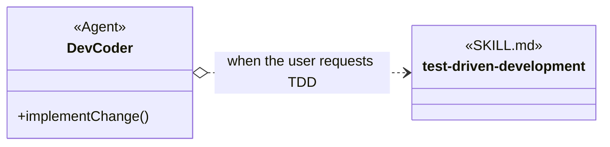

The open diamond still means exact-name knowledge. The dotted line means conditional loading, and the arrow label states the condition. Solid and dotted class references differ only in conditionality; both point from the referencing Agent to the named skill.

The test-driven-development member area is empty because the skill describes one overall TDD procedure. The dotted relationship still shows when that complete skill is loaded.

### 2.5 Agent Indirectly Loads A Skill Via AGENTS.md

Indirect loading separates the procedure an Agent requires from the project-specific skill that provides it. This keeps the Agent definition general while AGENTS.md selects a technology-specific or procedure-specific skill. The Agent instruction says what must be done without naming the skill that will do it. AGENTS.md names the skill to use for that project. When the Agent instruction, AGENTS.md, and the selected skill use the same procedure wording, that wording forms the Skill interface in this analogy.

- **RULE: RULE-1** An Agent can request a procedure without naming its skill implementation
  - **SYNOPSIS:** The procedure name describes the work that is needed. The Agent instruction can request that work while AGENTS.md chooses the skill that explains how to do it.
  - **EXAMPLE:** The Agent instruction says, “When a work-item transition is requested, transition a work item.” AGENTS.md says, “To transition a work item, use the manage-work-items-gitlab skill.”

- **RULE: RULE-2** The Agent, AGENTS.md, and the implementing SKILL.md share the same procedure name
  - **SYNOPSIS:** The same procedure wording connects what the Agent must do, which skill AGENTS.md selects, and where that skill explains the work.
  - **EXAMPLE:** The words “transition a work item” appear in the Agent instruction and the AGENTS.md instruction. The selected GitLab skill explains that work in its Transition Work Item section.

- **RULE: RULE-3** An Injectable Skill encapsulates selectable technology or procedure details
  - **SYNOPSIS:** The selected skill contains the detailed instructions that should not be repeated in the Agent definition.
  - **EXAMPLE:** The Agent instruction only says to transition a work item. The manage-work-items-gitlab skill explains GitLab lifecycle mutation and readback.

- **RULE: RULE-4** AGENTS.md selects one of several implementations
  - **SYNOPSIS:** Harness-loaded AGENTS.md names the skill that applies when the work is needed; the Agent definition does not reference AGENTS.md.
  - **EXAMPLE:** One project can say, “To transition a work item, use the manage-work-items-file skill.” Another can say, “To transition a work item, use the manage-work-items-gitlab skill.”

The diagram uses method-like names to keep the routing relationship compact. AGENTS.md does not define the procedures; it only routes a procedure name to a project-specific skill, such as transition-work-item to manage-work-items-gitlab. The procedure details belong to the selected SKILL.md. DII describes this indirect routing relationship in the analysis; it is not part of the AGENTS.md node’s stereotype.

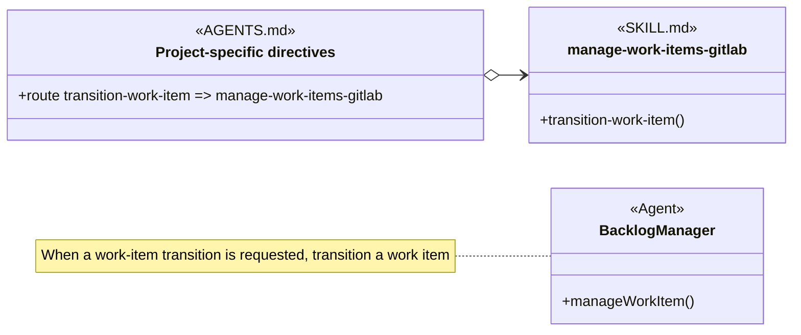

- The Backlog Manager Agent definition says, “When a work-item transition is requested, transition a work item.”
- The project AGENTS.md says, “To transition a work item, use the manage-work-items-gitlab skill.”
- The manage-work-items-gitlab SKILL.md has a Transition Work Item section that explains how to do that work in GitLab.

No arrow joins Backlog Manager to AGENTS.md because the harness loads project guidance automatically. The matching transition-work-item wording connects the Agent instruction to the AGENTS.md route without making the Agent reference that file. The open-diamond arrow shows that AGENTS.md names the skill selected for the project. If a project stores work items in files, AGENTS.md can name manage-work-items-file instead. The Backlog Manager instruction remains unchanged.

### 2.6 Showing A Skill Interface In A Diagram

The procedures a skill implements and the definitions it exposes can be considered a Skill interface when a calling Agent refers only to that public information. The Agent depends on those public members without needing to know the skill’s internal workflow, decision steps, or provider-specific details.

A Skill interface is the public contract that consumers and providers share. It can remain analysis-only when no package publishes it. When a distinct SKILL.md publishes that contract, this method calls the exact loadable package an Interface Skill. Its identity is a kebab-case skill name without a wildcard, such as create-work-item. The provider-family label appends one terminal wildcard to that complete identity, producing create-work-item-*. Every Provider Skill appends one provider suffix to the same complete stem, such as create-work-item-gitlab. The wildcard is family notation and never part of a directory name, frontmatter name, or exact loading reference.

A diagram uses the Interface Skill stereotype only when the exact skills/&lt;interface-identity&gt;/SKILL.md package exists and publishes the shown contract. Otherwise it uses Skill interface for an analysis-only contract. A consumer loads the exact Interface Skill when that package exists, or depends on the public procedures of an analysis-only Skill interface. AGENTS.md independently selects one exact Provider Skill; neither a consumer nor project guidance loads a wildcard identity.

Mermaid represents an interface as a stereotyped class node. In this method, an Interface Skill node uses Interface Skill as its single visible stereotype. The stereotype identifies a SKILL.md, so the diagram does not stack a second SKILL.md stereotype above it. The node lists the public data and function members that consumers know and implementations must provide or respect. An interface can expose more than one data member, more than one function member, or both.

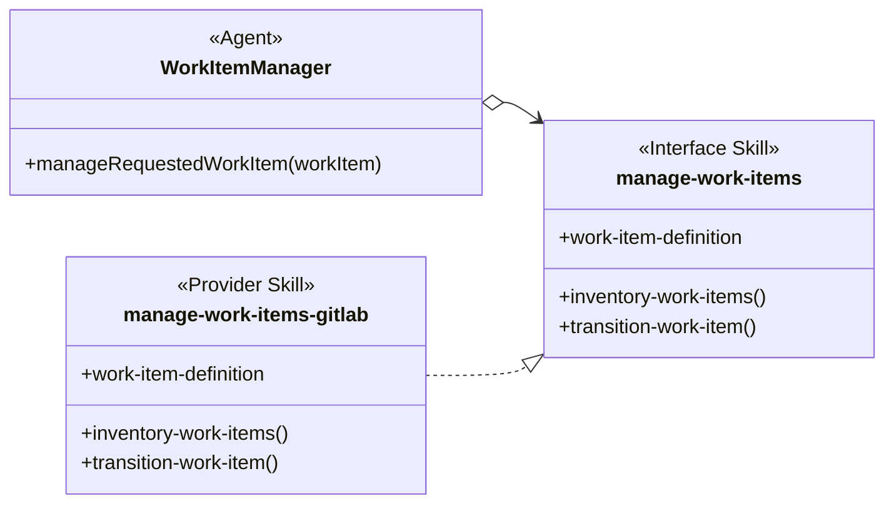

The Work Item Manager consumer references the manage-work-items Interface Skill directly. Its open-diamond arrow means that the consumer loads the complete Interface Skill while depending only on its public members. The manage-work-items-* family contains the provider packages, including manage-work-items-gitlab.

The dashed line with a hollow triangular arrowhead is a realization relationship. It points from the implementing SKILL.md to the Interface Skill. It means that manage-work-items-gitlab supplies the required functions and provides or respects the public data defined by manage-work-items. An implementation can restrict an allowed data value or add provider-specific members when those refinements remain usable by interface consumers.

Realization describes conformance, not loading. The arrow does not mean that one skill loads the other, invokes it, or knows its exact skill name. When an interface consumer or implementation depends on the Interface Skill by name, the complete SKILL.md is still loaded as one context unit and that dependency uses a separate open-diamond reference. Mermaid draws the declared relationship but does not verify member compatibility; semantic coherence still requires a reviewer to compare the complete interface, implementation, and known consumers.

### 2.7 Skill Providers Using A Factory Pattern

A Provider Skill is a SKILL.md that supplies one implementation of an Interface Skill. When a project must choose one provider without putting that provider’s name into the Agent definition, AGENTS.md can act as a factory. The Agent consumes the Interface Skill directly, while the AGENTS.md factory selects and loads one Provider Skill by exact name.

- **RULE: RULE-62** A factory-pattern consumer depends on the shared interface contract
  - **SYNOPSIS:** The consumer loads the exact Interface Skill when that package exists. For an analysis-only Skill interface, the consumer depends on its public procedures without claiming an exact skill load. Neither case names a provider.
  - **EXAMPLE:** Work Item Manager loads the exact manage-work-items Interface Skill and requests transition-work-item() without knowing whether files or GitLab store the work item.

- **RULE: RULE-63** AGENTS.md acts as the provider factory
  - **SYNOPSIS:** Project guidance selects one Provider Skill by exact name, and that provider realizes the Interface Skill consumed by the Agent.
  - **EXAMPLE:** One AGENTS.md can select manage-work-items-gitlab while another selects manage-work-items-file; Work Item Manager continues to consume manage-work-items.

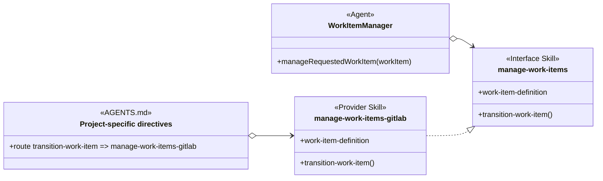

Read the diagram as three related instructions:

- The Work Item Manager Agent directly loads manage-work-items and uses its public contract.
- The project AGENTS.md keeps the same routing annotation used for indirect loading and directly names manage-work-items-gitlab as the selected Provider Skill.
- The selected Provider Skill realizes the manage-work-items interface.

The harness loads AGENTS.md automatically, so no Agent-to-AGENTS.md relationship is drawn. The factory analogy describes instruction selection rather than runtime object construction. AGENTS.md does not instantiate a provider object; it tells the Agent which provider SKILL.md to load. A different project can select another provider that realizes the same shared interface contract without changing the consumer’s dependency.

#### Simplified View

When provider selection is not the focus of the analysis, the diagram can omit the AGENTS.md factory while retaining the consumer and realization relationships.

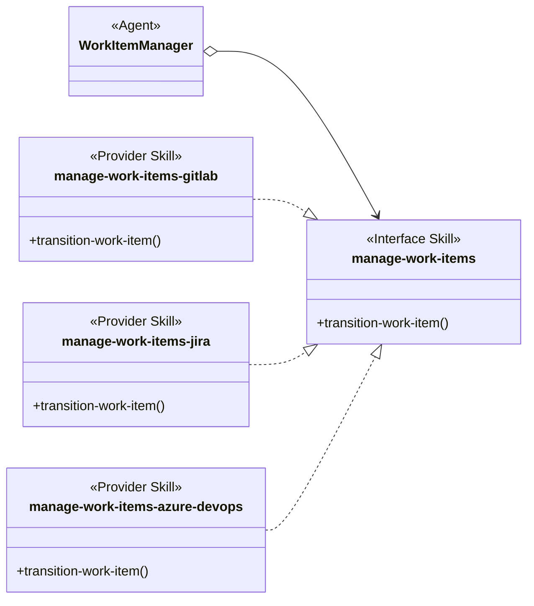

The simplified view still means that Work Item Manager consumes manage-work-items. Each Provider Skill shown realizes that interface. Project-specific directives select one provider as shown in the detailed diagram; the simplified view omits that routing relationship and does not imply that all providers are loaded together.

### 2.8 Skill Loaded by a User Request

A request can select an available skill without a declared reference from an Agent definition or AGENTS.md.

Request-triggered selection differs from predefined skills dependencies because the current request, rather than an Agent definition or AGENTS.md, triggers the selection. The request may identify a skill explicitly or match a skill’s declared purpose, and the selection applies only to the current request. It does not create a durable Agent Skill, procedure binding, or skill-to-skill dependency.

- **RULE: RULE-50** Request-triggered selection is scoped to the request
  - **SYNOPSIS:** A skill loader can select a discovered skill because the request names it explicitly or because the request matches its declared purpose. This selection does not add a durable Agent Skill or AGENTS.md relationship.
  - **EXAMPLE:** A request that names ast-grep, or asks for structural code matching that fits the ast-grep description, can select ast-grep for that request without changing an Agent definition.

The request-triggered forms are:

- explicit selection by skill name or marker;
- implicit selection from the request and a skill’s description or trigger conditions.

## 3. Skill Organization

A Skill Group is a set of related skills that together cover one methodology capability. Grouping makes a divided capability understandable without implying that every member is loaded together. An expanded diagram displays the skills in that set, while a collapsed diagram represents the set as a single group node.

### 3.1 Skill Group

A Skill Group records organizational membership: its members are the skills that together cover the grouped capability. The group does not, by itself, say which skills are loaded, invoked, or dependent on one another; those facts require separate relationships.

- **RULE: RULE-28** Skill Group members divide a larger responsibility without overlap
  - **SYNOPSIS:** Each member owns one cohesive part of the grouped capability while using compatible domain vocabulary.
  - **EXAMPLE:** In the Work Item Skill Group, work-item-base defines work items, states, and rules; work-item-dispatch changes status under dispatch rules; and work-item-monitor observes work items and raises alarms.

### 3.2 Expanded Skill Group Diagram

An expanded Skill Group Diagram draws a box around the group’s skill nodes. It is useful when one large skill has been divided into several SKILL.md files and the reader needs to compare their non-overlapping responsibilities. A Mermaid namespace supplies the visible group box.

- **RULE: RULE-29** An expanded diagram separates membership from loading
  - **SYNOPSIS:** The box shows which skills belong to the Skill Group. Agent or AGENTS.md references separately show which exact skills are loaded for a use case.
  - **EXAMPLE:** The Work Item Skill Group box contains three skills. Work Item Coordinator loads work-item-base and work-item-dispatch, while Work Item Watchdog loads work-item-base and work-item-monitor.

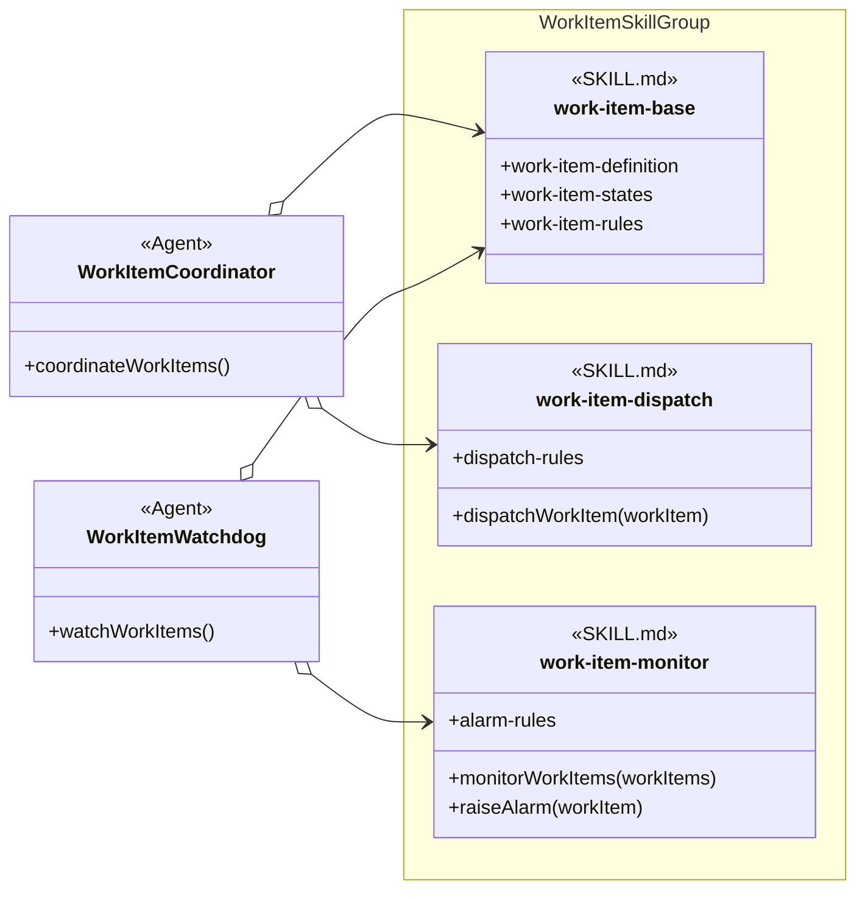

The namespace box expands the Work Item Skill Group by displaying its three members. The open-diamond references use the loading notation introduced in Section 2.3: Work Item Coordinator loads work-item-base and work-item-dispatch, while Work Item Watchdog loads work-item-base and work-item-monitor. The box itself does not mean that either Agent loads the entire group.

The members without parentheses are exposed data; the members with parentheses are functions. These members make the responsibility split visible. No arrows connect the three skills because group membership does not create a dependency between them.

The Work Item Skill Group names and displayed members are analysis vocabulary supplied for this example. They do not assert that those exact skill definitions already exist in the repository.

### 3.3 Collapsed Skill Group Diagram

A collapsed Skill Group Diagram represents the group as one node instead of drawing a box around its members. Solid-diamond containment lines connect that node to direct skills and nested Skill Groups. This form is useful when member details are unnecessary or when several nested groups must remain readable.

A nested Skill Group is the same kind of set as its parent. The word subgroup describes only its position inside the parent. In a collapsed diagram:

- a line to a skill displays direct membership;
- a line to another Skill Group displays a nested group; and
- the parent’s complete skill set includes its direct skills plus the complete skill sets of its nested groups.

- **RULE: RULE-55** A nested Skill Group contributes its complete skill set
  - **SYNOPSIS:** The parent Skill Group contains its direct skills plus every skill reached through its nested groups.
  - **EXAMPLE:** Concurrent Tasking contains agent-claim through its nested Resource Coordination group even though agent-claim is not a direct member of Concurrent Tasking.

- **RULE: RULE-54** A solid diamond represents containment in a collapsed diagram
  - **SYNOPSIS:** A solid diamond from a Skill Group node to a SKILL.md node records direct membership. A solid diamond from one Skill Group node to another records nested-group inclusion.
  - **EXAMPLE:** Concurrent Tasking directly contains coordinate-codex-work-items and includes the Resource Coordination skill group, whose direct skills include agent-claim.

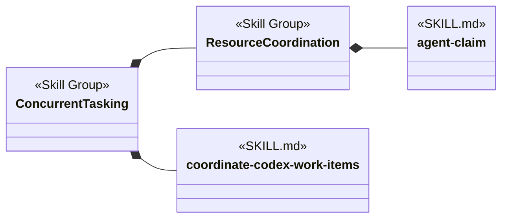

The collapsed diagram shows Concurrent Tasking as one node. Its actual Skill Group contains coordinate-codex-work-items directly and contains agent-claim through the nested Resource Coordination Skill Group. An expanded diagram could draw boxes around the same sets and display their member details.

The repository-specific group models are maintained separately in [Object-Oriented Skill Group Models](object-oriented-skill-group-models.md).

## 4. From User Request To Skill Interface

A user request supplies work intent that an Agent translates into a Skill interface invocation. Provider selection remains separate, so neither the request nor the Agent logic needs provider details.

- **PROCESS: PROCESS-1** Receive a user request
  - **SYNOPSIS:** The Agent receives natural language describing a work-item transition.
  - **EXAMPLE:** The Agent is told, “Move work item 42 to Running.”

- **PROCESS: PROCESS-2** Transform the request into an interface invocation
  - **SYNOPSIS:** The Agent invokes manageWorkItem(), whose instructions refer to the transition-work-item() procedure.
  - **EXAMPLE:** The Agent concludes, “A work-item transition requires me to transition a work item.”

- **RULE: RULE-8** Agent context carries transition intent rather than provider details
  - **SYNOPSIS:** manageWorkItem() retains the transition request in Agent context. transition-work-item() delegates provider lifecycle state to the selected manage-work-items-* skill.
  - **EXAMPLE:** Move work item 42 to Running does not require manageWorkItem() to know a repository path, GitLab project identifier, label set, or issue URL.

Sequence diagrams use solid messages for every request, action, and return. Their text is necessary because the diagram shows chronological actions rather than static references. Return messages begin with Return. Dotted lines remain reserved for conditional references in class diagrams.

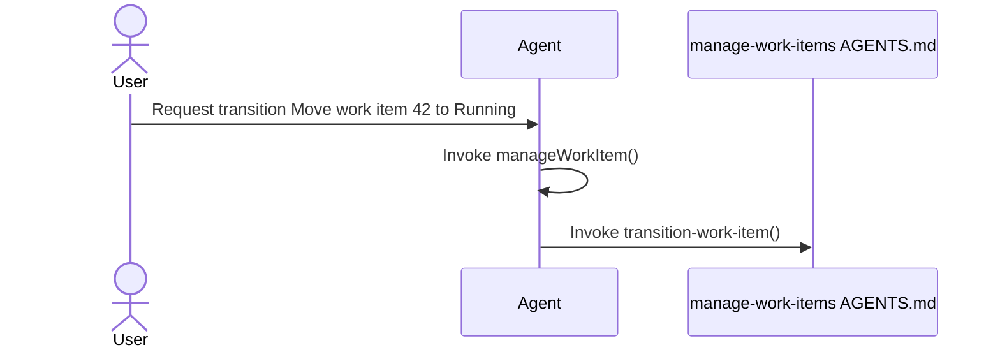

At this point, manageWorkItem() has referred to the transition procedure, but the Agent has not chosen file or GitLab behavior itself.

## 5. Skills Injection Through AGENTS.md

AGENTS.md links a procedure name to a concrete SKILL.md. This keeps the project-specific provider choice outside the calling Agent.

- **PROCESS: PROCESS-3** Provide the injection instruction
  - **SYNOPSIS:** Effective project guidance tells the agent which skill to load when the procedure is needed.
  - **EXAMPLE:** “When you need transition-work-item(), load manage-work-items-gitlab.”

- **RULE: RULE-9** AGENTS.md owns the binding outside the calling agent
  - **SYNOPSIS:** The Agent retains manageWorkItem() and its transition-work-item() reference when project setup chooses another matching implementation.
  - **EXAMPLE:** Changing the AGENTS.md binding from manage-work-items-gitlab to manage-work-items-file does not change manageWorkItem().

Section 2.5 shows the Agent instruction and the independent open-diamond arrow from AGENTS.md to manage-work-items-gitlab without inventing an Agent-to-AGENTS.md dependency. Section 2.7 adds the regular consumer-to-interface relationship when the complete factory pattern is in view. Together, those relationships preserve procedure-only knowledge in the Agent and record the exact skill name selected by project guidance.

Skills injection is an instruction relationship. The model does not require a compiled interface object or a software dependency-injection container.

## 6. Loading And Invoking The Selected SKILL.md

Loading and invocation turn an AGENTS.md selection into action. The Agent reads the selected SKILL.md and follows its matching procedure only when that Skill interface is needed.

- **PROCESS: PROCESS-4** Load the selected skill
  - **SYNOPSIS:** The harness loads project guidance and makes the selected skill binding available; the agent then reads the selected SKILL.md when it needs the procedure.
  - **EXAMPLE:** The harness supplies the manage-work-items-gitlab binding for manage-work-items, and the agent loads that SKILL.md when it must transition a work item.

- **PROCESS: PROCESS-5** Find the procedure with the shared name
  - **SYNOPSIS:** The loaded SKILL.md uses the same procedure name and explains the concrete steps.
  - **EXAMPLE:** The agent finds the Transition Work Item section that defines transition-work-item() for GitLab.

- **PROCESS: PROCESS-6** Invoke the selected procedure using Agent context
  - **SYNOPSIS:** The implementing procedure reads the transition intent already held in Agent context and applies provider-specific steps.
  - **EXAMPLE:** The GitLab procedure reads Move work item 42 to Running, then applies its own lifecycle mutation and read-back rules.

The following sequence is a runtime scenario for a project whose selected provider is manage-work-items-gitlab. It complements the static dependency views; it does not describe every provider configuration at once.

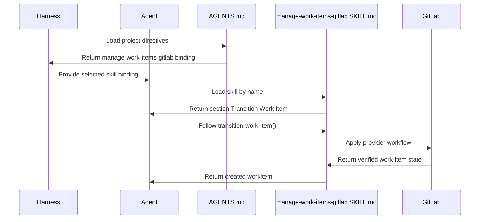

Every message is solid. Direction and the Return prefix distinguish information coming back from an action. The harness, rather than the Agent definition, loads AGENTS.md. The Agent’s manageWorkItem() behavior and transition-work-item() reference stay the same when another matching skill is selected. The provider-specific actions come from the loaded SKILL.md.

## 7. Data And Function Members In Skill Interfaces

A Skill interface is a public contract made of data members, function members, or both. An Interface Skill is a SKILL.md that itemizes the members an interface user must know and an implementation must provide or respect. AGENTS.md can still select a concrete implementation; the Interface Skill supplies the shared vocabulary rather than making that selection.

- **RULE: RULE-10** A Skill interface can expose data and function members
  - **SYNOPSIS:** Data members name shared structures, rules, constraints, or values, while function members name procedures an implementation performs.
  - **EXAMPLE:** The manage-work-items interface can expose work-item-definition and work-item-states as data members together with inventoryWorkItems(selection) and transitionWorkItem(workItem, state) as function members.

- **RULE: RULE-11** One Skill interface can contain several functions
  - **SYNOPSIS:** Related procedures remain members of one interface when invokers and implementations treat them as one cohesive contract.
  - **EXAMPLE:** inventoryWorkItems(selection) and transitionWorkItem(workItem, state) both belong to manage-work-items rather than becoming separate interfaces merely because both are callable.

- **RULE: RULE-12** One implementation can satisfy several Skill interfaces
  - **SYNOPSIS:** A complex implementation skill can provide the members of several independently useful contracts without that fact alone deciding whether its SKILL.md should be split.
  - **EXAMPLE:** A provider can satisfy manage-work-items and work-item-reporting-* while remaining one SKILL.md when those responsibilities are intentionally packaged together.

For a function member, an implementation supplies its own procedure with the interface name and meaning. For a data member, an implementation respects the shared name and meaning. It can add provider-specific members, define concrete values, or document a narrower constraint. A narrower constraint is coherent only when interface users can still satisfy it; the interface name alone does not guarantee substitutability.

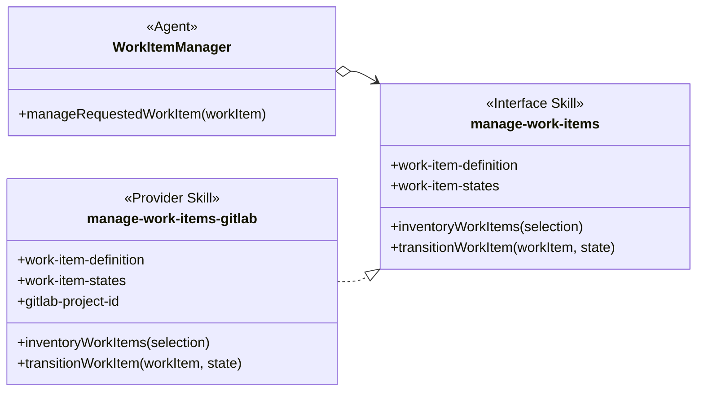

The open-diamond arrow means that Work Item Manager knows and loads the complete manage-work-items Interface Skill. The realization arrow means that manage-work-items-gitlab supplies the interface contract. Neither arrow terminates at an individual member. The matching members show that manage-work-items-gitlab implements both functions and respects both shared data members. It adds gitlab-project-id as provider-specific data. If the implementation also names and loads manage-work-items, show that dependency with a separate open-diamond arrow.

The interface and implementation names resolve to the maintained manage-work-items and manage-work-items-gitlab packages.

## 8. A Second Injected Example: Deliver Workitem

Delivery is another injectable procedure. The exact deliver-work-item Interface Skill publishes the stable contract, while AGENTS.md selects the project’s delivery provider. This keeps the workflow independent of direct-main and feature-branch delivery details.

- **PROCESS: PROCESS-7** Request delivery after review and testing
  - **SYNOPSIS:** A development workflow invokes Deliver Workitem with the accepted change after its required gates pass.
  - **EXAMPLE:** The caller concludes, “Review and testing passed. I must Deliver Workitem with accepted commit abc123.”

- **RULE: RULE-13** AGENTS.md selects the delivery SKILL.md
  - **SYNOPSIS:** The calling workflow uses the same procedure name while project guidance selects direct-main or feature-branch delivery.
  - **EXAMPLE:** AGENTS.md can link Deliver Workitem to deliver-work-item-direct-main or deliver-work-item-feature-branch.

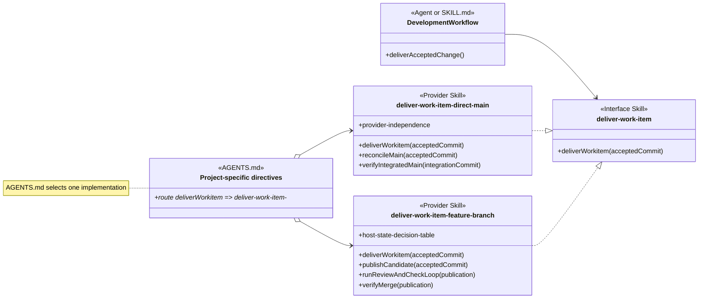

The regular arrow shows that the development workflow consumes the exact deliver-work-item Interface Skill. The open-diamond arrows show the two exact Provider Skill names that AGENTS.md can select from the deliver-work-item-* family. The realization arrows show that both providers supply the delivery interface. No arrow joins the development workflow to AGENTS.md because the harness loads project guidance automatically. The direct-main and feature-branch procedures remain different internally even though callers reach either one through the same procedure name.

## 9. Agent Dependency Views

An Agent can use named Agent Skills and Injected Skills together. A class view concentrates on the Agent’s expected behavior and dependency paths rather than its task-bound runtime state.

- **RULE: RULE-14** An Agent class view records reusable expectations and dependencies
  - **SYNOPSIS:** The Agent node shows the behavior relevant to the analysis, the procedure names it invokes, and the Agent Skills it names.
  - **EXAMPLE:** A coding-agent class can name explain-code-fix directly and invoke Deliver Workitem without naming the delivery SKILL.md.

- **RULE: RULE-15** Dependency views omit unrelated runtime state
  - **SYNOPSIS:** The class view shows the expectations and dispatch paths needed to understand skill use without modeling task values that do not change those relationships.
  - **EXAMPLE:** The coding Agent exposes deliverAcceptedChange() and its skill references without displaying an accepted commit or an awaiting-review state.

- **RULE: RULE-16** Technology and project skills can be injectable through shared procedure names
  - **SYNOPSIS:** A technology or project SKILL.md is injectable when it implements a procedure name and invocation meaning that the Agent already uses.
  - **EXAMPLE:** A testing agent can invoke Run Project Tests with a test scope while AGENTS.md selects a JUnit or Jest SKILL.md for the project.

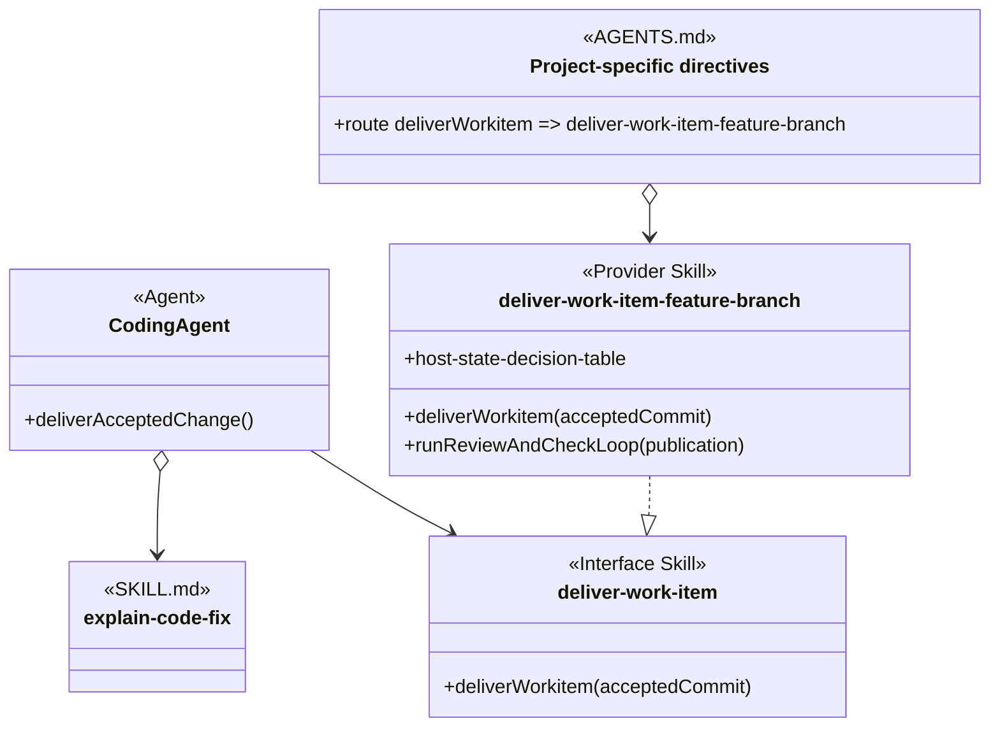

The Agent points directly to explain-code-fix because its definition names that single-procedure skill. Its empty member area avoids repeating the procedure already identified by the operation-shaped skill name. The Agent points regularly to the exact deliver-work-item Interface Skill. AGENTS.md independently points by open diamond to the selected feature-branch skill, and the provider realizes the interface.

The diagram explains dependencies and dispatch. It does not require the harness to construct software classes or imply an inheritance relationship.

## 10. Agent Groups

An Agent Group is a named set of Agent definitions that share a methodology role or participate in the same view. The group gives the reader a visible comprehension boundary while preserving each actual Agent and its own dependencies.

- **RULE: RULE-38** An Agent Group contains actual Agent nodes
  - **SYNOPSIS:** Draw a labeled rectangle around the applicable Agents and leave their member areas empty when the view needs only their identities and dependencies.
  - **EXAMPLE:** A Structured Artifact Review Agents rectangle can contain Dev Artifact Reviewer, Dev Code Reviewer, Dev Verifier, Dev Prompt Reviewer, and Dev Merge Coordinator.

- **RULE: RULE-39** An Agent Group does not create an Agent type
  - **SYNOPSIS:** The rectangle records membership in a comprehension set without inventing a superclass, shared runtime object, or inheritance relationship.
  - **EXAMPLE:** Dev Code Reviewer and Dev Verifier can appear in the same review group while retaining different instructions and skill dependencies.

- **RULE: RULE-40** Dependencies remain attached to the Agent that owns them
  - **SYNOPSIS:** Draw each dependency from the applicable Agent node. A shared group box does not mean that every member loads every skill shown near the group.
  - **EXAMPLE:** Dev Verifier can conditionally load verify-end-to-end-workflow while Dev Code Reviewer in the same group does not.

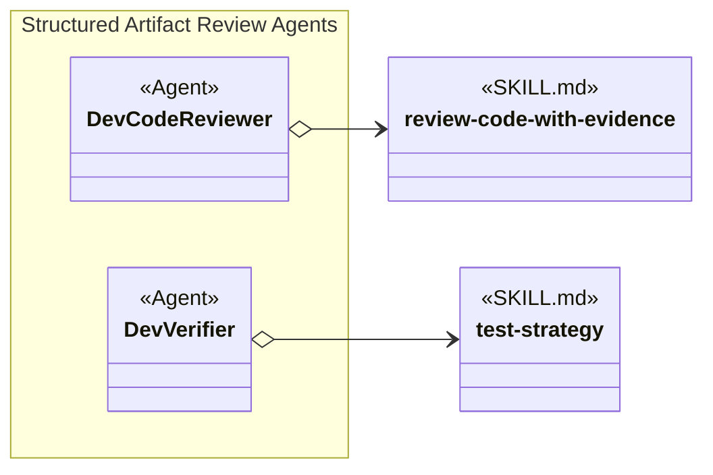

The namespace renders the visible group rectangle. The two open-diamond arrows preserve the separate exact-name dependencies declared by the Agent definitions.

## 11. Constraints

The constraints keep the class analogy focused on skill loading, substitution, and organization without turning it into an unsupported runtime design.

- **RULE: RULE-20** A loaded skill is not necessarily injectable
  - **SYNOPSIS:** A SKILL.md is injectable only when it and its invokers share a procedure name and invocation meaning that another implementation can also use.
  - **EXAMPLE:** An Agent can load code-discovery by name as an Agent Skill without making code-discovery injectable.

- **RULE: RULE-21** Provider-specific procedure details remain inside SKILL.md
  - **SYNOPSIS:** A shared procedure name stabilizes the invoker. It does not make the file and GitLab procedures identical internally.
  - **EXAMPLE:** transition-work-item() can transition a repository-backed record through manage-work-items-file and a GitLab issue through manage-work-items-gitlab while each procedure preserves provider-accurate evidence.

- **RULE: RULE-41** Agent grouping is independent of skill injection
  - **SYNOPSIS:** An Agent Group organizes Agent definitions for comprehension. AGENTS.md separately selects a Provider Skill for a shared procedure interface.
  - **EXAMPLE:** Work-item management Agents can share one group rectangle while they consume manage-work-items and Project-specific directives select manage-work-items-gitlab from the manage-work-items-* family.

- **RULE: RULE-23** The model remains conceptual
  - **SYNOPSIS:** The document explains the vocabulary and relationships without prescribing a schema, migration order, or repository change sequence.
  - **EXAMPLE:** The diagrams show manage-work-items as an Interface Skill and Project-specific directives as AGENTS.md routing without specifying a new YAML field for either relationship.

## 12. Definition Of Good

A good model makes skill dependencies, dispatch, and organization understandable and traceable without implying unsupported runtime behavior.

- **RULE: RULE-66** Applied views progress from the system landscape to concrete scenarios
  - **SYNOPSIS:** Overall diagrams establish the relevant Agent groups, Skill Groups, and major dependencies. Scenario sections then expand the relationships that need their consumers, routing, interfaces, providers, and loading conditions shown together.
  - **EXAMPLE:** A Concurrent Tasking overview shows Dev Activities Agents, Backlog Management Agents, and the major Skill Groups before a resource-coordination scenario expands agent-claim, its consumers, AGENTS.md routing, and the available claim-helper providers.

- **RULE: RULE-67** A scenario section explains its situation before its notation
  - **SYNOPSIS:** The opening states what the scenario represents and why its relationships matter before discussing arrow forms or exceptions. An absent alternative or unsupported path is mentioned only when it changes how the shown scenario must be understood.
  - **EXAMPLE:** A resource-coordination section first says that it applies when project configuration selects agent-claim, then explains which skills consume the policy and how AGENTS.md selects the claim helper.

- **RULE: RULE-68** Technical terms name the engineering mechanism shown
  - **SYNOPSIS:** Use transport only for a concrete communication mechanism that carries protocol messages. Name protocols, command invocation, file access, and tool calls according to what they are instead of grouping them under a convenient but inaccurate abstraction.
  - **EXAMPLE:** “Command transport” and “MCP transport” are bad descriptions: a local command is not a transport, and MCP is a protocol. State instead that agent-claim-command invokes a local command-line helper and agent-claim-mcp calls MCP tools. If the MCP connection uses stdio or WebSockets, those mechanisms can be identified separately as transports.

- **RULE: RULE-52** Class views make dependency and dispatch paths understandable
  - **SYNOPSIS:** A reader can identify which skills an Agent names, which procedures it expects, which conditions affect loading, and where AGENTS.md selects an implementation.
  - **EXAMPLE:** The diagrams distinguish Dev Coder’s direct careful-coding reference from Backlog Manager’s procedure-name path through AGENTS.md to manage-work-items-gitlab.

- **RULE: RULE-53** Class views make skill organization reviewable
  - **SYNOPSIS:** A reader can distinguish the actual Skill Group from its expanded and collapsed diagram forms, see which skills are direct members, and see which complete skill sets are included through nesting.
  - **EXAMPLE:** The Work Item Skill Group is an actual set of three skills shown in an expanded diagram, while the Concurrent Tasking Skill Group is shown in a collapsed diagram that includes Resource Coordination.

- **RULE: RULE-24** The diagrams distinguish AGENTS.md from SKILL.md
  - **SYNOPSIS:** Diagrams label project routing with the AGENTS.md stereotype, the shared family contract with the Interface Skill stereotype, and the selected implementation with a concrete skill stereotype.
  - **EXAMPLE:** Project-specific directives has the AGENTS.md and routing stereotypes; manage-work-items has the Interface Skill stereotype; manage-work-items-gitlab is the selected Provider Skill.

- **RULE: RULE-25** The complete workitem invocation is traceable
  - **SYNOPSIS:** A reader can follow the request from the user, through manageWorkItem() and its transition reference, through AGENTS.md injection, to the selected SKILL.md procedure.
  - **EXAMPLE:** Move work item 42 to Running invokes manageWorkItem(), which refers to transition-work-item(); AGENTS.md selects manage-work-items-gitlab, whose Transition Work Item section performs the GitLab procedure.

- **RULE: RULE-26** Declared relationships and request-triggered selection have valid uses
  - **SYNOPSIS:** The model distinguishes exact Agent dependencies, Skill Group sets, expanded and collapsed Skill Group diagrams, AGENTS.md substitution, direct skill-to-skill coupling, and request-scoped selection.
  - **EXAMPLE:** Dev Coder names careful-coding, the Work Item Skill Group contains three non-overlapping members while Work Item Coordinator loads two of them, Resource Coordination contains agent-claim, Project-specific directives select a Provider Skill for manage-work-items, deliver-work-item-feature-branch names create-pull-request, and a structural-search request selects ast-grep only for that request.

- **RULE: RULE-51** The four skill-loading use cases remain distinct from factory composition
  - **SYNOPSIS:** The method separates unconditional exact-name loading, conditional exact-name loading, procedure mapping through AGENTS.md, request-triggered selection, and the factory pattern that combines an Agent-facing Interface Skill with an AGENTS.md-selected Provider Skill.
  - **EXAMPLE:** Section 2 gives every loading use case its own subsection, omits a persistent class relationship for request-triggered ast-grep selection, and presents provider selection as a separate composition.

- **RULE: RULE-27** Every assertion includes an example
  - **SYNOPSIS:** Each GOAL, RULE, PROCESS, and other structured assertion is followed by an EXAMPLE.
  - **EXAMPLE:** RULE-20 defines the Injectable Skill boundary and illustrates it with code-discovery.

- **RULE: RULE-42** Every reference points from the referencing node to the referenced node
  - **SYNOPSIS:** The source appears first, the arrowhead points to the target, and an open diamond remains on the source that knows an exact skill name.
  - **EXAMPLE:** manage-work-items o--> manage-work-items-gitlab reads from the AGENTS.md DII that names the matching skill to the SKILL.md that it selects.

- **RULE: RULE-43** Line and endpoint form expose name knowledge and conditionality
  - **SYNOPSIS:** In declared relationships, a regular line means procedure-name reference, an open diamond means exact skill-name reference, and the dotted form means the reference is conditional. Only a dotted class reference carries text, and that text states the condition.
  - **EXAMPLE:** The label “when the user requests TDD” on DevCoder o..> test-driven-development means that Dev Coder conditionally loads that exact named skill.

- **RULE: RULE-61** Interface users and implementations remain semantically coherent
  - **SYNOPSIS:** Skill maintenance compares each Interface Skill with every known user and implementation, checking data-member names and meanings, provider refinements, function implementations, and invocation meanings. No specialized validator is required: simple deterministic inventories can locate files and matching names, but semantic acceptance requires an LLM judge to read the complete referenced skills.
  - **EXAMPLE:** A judge checks that a work-item provider preserves work-item-definition, makes any narrower state constraint usable by its Agents, and implements inventoryWorkItems(selection) with the interface meaning.

- **RULE: RULE-69** Provider-family naming is mechanically coherent
  - **SYNOPSIS:** A family label is the exact Interface Skill identity followed by -*, and every Provider Skill begins with that complete identity followed by one provider suffix. Deterministic naming checks locate spelling and stereotype defects; semantic review remains responsible for interface members, provider behavior, and consumer expectations.
  - **EXAMPLE:** create-work-item maps to create-work-item-* and create-work-item-file. Placing the wildcard or provider suffix between create and work-item is invalid because it breaks the complete interface stem.

## 13. Glossary

The glossary defines the relationship and diagram terms used by the analysis after the examples have established their context.

| Term | Meaning | Example |
| --- | --- | --- |
| Global Agent space | The execution space in which an Agent can find available SKILL.md files. Availability alone does not create a reference. | careful-coding and test-driven-development can both be available while one Agent execution loads only the applicable skills. |
| Skill selection | A decision that one available skill applies to an Agent execution or request. Selection does not prove that the full instructions entered context. | A conditional rule selects test-driven-development when the user requests TDD. |
| Skill loading | The complete selected SKILL.md entering the active context so its instructions can be followed. | After AGENTS.md selects manage-work-items-gitlab, the agent reads that SKILL.md. |
| Exact skill name | The identity used to resolve one skill package and its SKILL.md. It is not the shared literal filename SKILL.md. | careful-coding resolves the careful-coding package. |
| Skill interface | A shared contract containing public data members, function members, or both. It can exist only as analysis vocabulary. | agent-claim-* describes the public claim-helper procedures without naming a loadable wildcard package. |
| Interface Skill | An exact loadable kebab-case skill package that publishes a Skill interface. Its provider-family label appends a terminal wildcard, but its directory and frontmatter identity do not contain that wildcard. | manage-work-items is the exact package identity and manage-work-items-* is its family label. |
| Skill realization | A dashed line with a hollow triangular arrowhead from a Provider Skill to a Skill interface. It means that the provider supplies the interface functions and provides or respects its public data; it does not mean that either skill loads the other. | manage-work-items-gitlab ..\|> manage-work-items. |
| Provider Skill | A SKILL.md whose exact name extends the complete Interface Skill identity with one provider suffix and supplies that interface contract. | manage-work-items-gitlab supplies the GitLab implementation of manage-work-items-*. |
| AGENTS.md factory | Project guidance that selects one Provider Skill by exact name while the consumer depends on an exact Interface Skill or its public procedures. The factory analogy describes instruction selection, not runtime object construction. | Project-specific directives route transition-work-item to manage-work-items-gitlab for a consumer of manage-work-items. |
| Polymorphism | The object-oriented analogy in which one interface expectation can be supplied by different skill implementations without changing the invoker. It does not assert runtime language dispatch. | transition-work-item() can be supplied by a file-backed or GitLab-backed work-item skill. |
| Procedure name | The name that identifies the operation an invoker needs. | transition-work-item. |
| Procedure context | Information already held by the invoking Agent for use by the named procedure. | Transition request: Move work item 42 to Running. |
| Procedure | Instructions in a SKILL.md that explain how to perform the named operation. | Transition a GitLab issue, read it back, and return its verified state. |
| Data member | A public member without parentheses that represents exposed structures, rules, constraints, or values rather than an invoked procedure. | +work-item-definition in manage-work-items. |
| Function member | A public member with parentheses that represents a procedure supplied by a skill. | +inventoryWorkItems(selection) in manage-work-items and manage-work-items-gitlab. |
| AGENTS.md DII | The indirect binding relationship represented by an AGENTS.md node with a routing annotation. The node maps a procedure to the concrete skill selected by name through AGENTS.md. | Project-specific directives route transition-work-item to manage-work-items-gitlab. |
| SKILL.md | A complete skill definition loaded as one context unit and containing data members, function members, or both. | manage-work-items-gitlab contains provider data and work-item procedures in this analysis example. |
| Agent Skill | A SKILL.md referenced by exact name in an Agent definition for every execution or under a routing condition. | Dev Coder names careful-coding unconditionally and test-driven-development conditionally. |
| Injectable Skill | A SKILL.md written with a shared procedure name and invocation meaning so AGENTS.md can select it without changing its invoker. | manage-work-items-file and manage-work-items-gitlab can both supply transition-work-item(). |
| Injected Skill | The Injectable Skill selected through AGENTS.md for one procedure in an effective project configuration. | manage-work-items-gitlab is the Injected Skill when Project-specific directives route transition-work-item to it. |
| Skills injection | The AGENTS.md selection that links an interface procedure to one concrete SKILL.md. | When transition-work-item() is needed, Project-specific directives select manage-work-items-gitlab. |
| Request-triggered skill selection | Selection caused by an explicit skill name or marker in the request, or by a match between the request and the skill’s declared purpose. It does not require an Agent-definition reference or AGENTS.md binding. | A structural-search request selects ast-grep for the current request. |
| Exact-name reference | An open-diamond arrow from a node that knows a skill’s exact name to that SKILL.md. | DevCoder o--> careful-coding. |
| Procedure-name reference | A regular arrow from an invoker to the procedure it knows without naming the implementing SKILL.md. | BacklogManager --> manage-work-items. |
| Conditional reference | A dotted regular or open-diamond arrow whose label states the loading condition. | DevCoder o..> test-driven-development, labeled “when the user requests TDD.” |
| Agent class view | A diagram node that represents the Agent behavior, expectations, and dependencies relevant to the analysis without asserting a runtime class. | Coding Agent names careful-coding and refers to Deliver Workitem. |
| Skill Group | The actual named set of cohesive skills used to organize one capability. Its complete skill set contains its direct skills plus every skill in its nested Skill Groups. The set exists independently of how a diagram displays it. | The Work Item Skill Group contains work-item-base, work-item-dispatch, and work-item-monitor. |
| Expanded Skill Group Diagram | A diagram that draws a box around the SKILL.md nodes belonging to one Skill Group so their responsibilities and separate loading references can be viewed together. The diagram displays the set; it does not create it. | The expanded Work Item Skill Group Diagram displays work-item-base, work-item-dispatch, and work-item-monitor inside one box. |
| Collapsed Skill Group Diagram | A diagram that represents a Skill Group as one node and uses solid-diamond lines to show direct skill membership or nested-group inclusion. | The collapsed Concurrent Tasking diagram links the Concurrent Tasking node to coordinate-codex-work-items and Resource Coordination. |
| Nested skill group | A skill group included inside another skill group. It is the same kind of object as its parent; subgroup is only a relative description of its position. | Resource Coordination is a skill group nested inside Concurrent Tasking. |
| Direct group membership | A solid-diamond line in a collapsed diagram that displays a skill’s direct membership in a Skill Group. The line represents membership in the existing set; it does not create that membership. | Resource Coordination *-- agent-claim displays agent-claim as a direct member of Resource Coordination. |
| Nested set containment | A solid-diamond line in a collapsed diagram that displays one Skill Group nested in another. The parent’s complete skill set includes the child’s complete skill set independently of the chosen diagram form. | Concurrent Tasking *-- Resource Coordination displays Resource Coordination as a nested group whose skills belong to the complete Concurrent Tasking set. |
| Mermaid display label | The visible analysis identity used when Mermaid requires a different internal class identifier. | An internal ProcedureInterface identifier can display the procedure-family-* family label. |
| Skill hierarchy | An organizational view of Skill Groups, families, responsibilities, procedures, loading references, and dependencies. It does not by itself assert software inheritance. | work-item-base, work-item-dispatch, and work-item-monitor form one Skill Group whose members are loaded in different combinations by two Agents. |
| Agent Group | A named comprehension set displayed as a rectangle containing actual Agent nodes. Membership does not create a superclass or assign one member’s dependencies to another. | Structured Artifact Review Agents contains Dev Code Reviewer and Dev Verifier while each retains its own skill references. |
| Empty SKILL.md node | A concrete skill class with no displayed members because the SKILL.md describes one procedure and its identity already represents that operation. | verify-documentation-page under Documentation Agent. |

## Authoritative Inputs

The analysis is grounded in the user-directed conventions and repository sources below.

- The user-supplied object-oriented analysis, vocabulary corrections, and containment convention for this document.
- [Bundled Skill Inventory](../README.md)
- [Agentic Configuration](agentic-configuration.html)
- [Agent Skill Architecture](skills-modularization.html)
- [Work-Item Provider And Completion Contracts](work-item-provider-and-completion-contracts.md)
- [Deliver Work Item](../skills/deliver-work-item/SKILL.md)
- [Deliver Work Item Direct Main](../skills/deliver-work-item-direct-main/SKILL.md)
- [Deliver Work Item Feature Branch](../skills/deliver-work-item-feature-branch/SKILL.md)
- [Create Pull Request](../skills/create-pull-request/SKILL.md)
- [Explain Code Fix](../skills/explain-code-fix/SKILL.md)
- [Test-Driven Development](../skills/test-driven-development/SKILL.md)
- [JUnit](../skills/junit/SKILL.md)
- [Jest](../skills/jest/SKILL.md)
- [Agent Claim](../skills/agent-claim/SKILL.md)
- [Review Structured Artifact](../skills/review-structured-artifact/SKILL.md)
- [Dev Coder](../agents/roles/dev-activities/dev-coder.role.yaml)
- [Generated Codex Dev Coder](../generated/adapters/codex/agents/dev-coder.toml)
- [Generated Claude Code Dev Coder](../generated/adapters/claude/agents/dev-coder.md)
- [Generic Agent Definitions Source](generic-agent-definitions-source.html)
- [Mermaid Class Diagram Relationships](https://mermaid.js.org/syntax/classDiagram.html)
- [Mermaid Sequence Diagram Messages](https://mermaid.js.org/syntax/sequenceDiagram)
