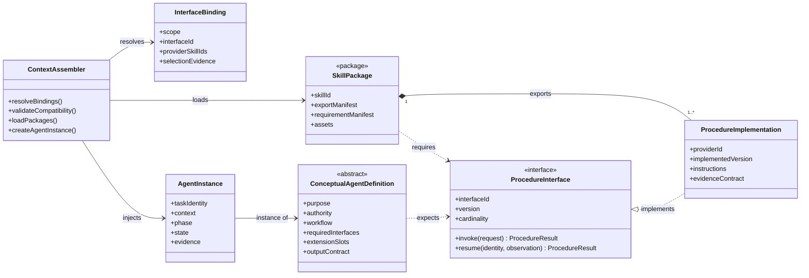
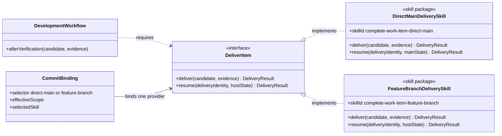
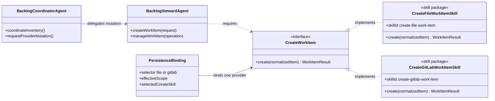
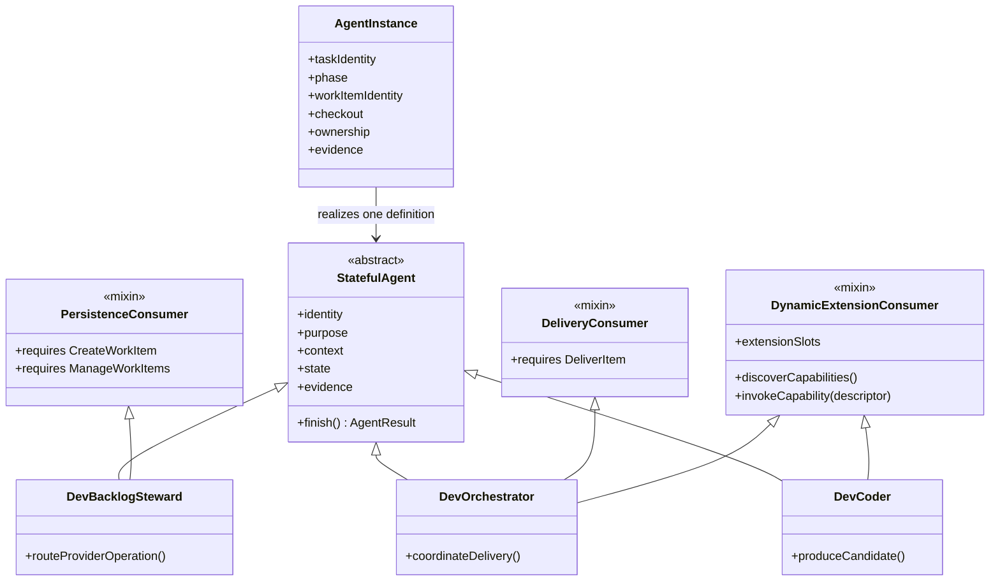
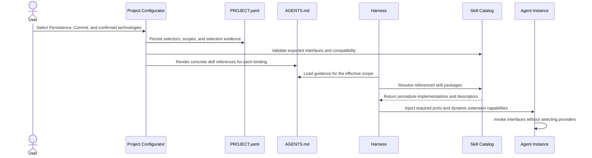

# Object-Oriented Agent And Skill Model

## Status

This document is a design proposal for analyzing agents and skills. It does not change a skill definition, an agent definition, project configuration, generated guidance, or runtime behavior.

## 1. Finality

This section defines why the object-oriented model exists.

- **GOAL: GOAL-1** Separate procedure contracts from their implementations
  - **SYNOPSIS:** Agents and workflow skills depend on provider-neutral procedure interfaces. Skill packages export concrete implementations of those interfaces.
  - **BECAUSE:** A caller can request an operation without embedding the selected provider or delivery mechanism in its own instructions.

- **GOAL: GOAL-2** Treat setup as the composition root
  - **SYNOPSIS:** Project setup selects interface implementations, persists the selections, and renders the bindings into applicable project guidance.
  - **BECAUSE:** Provider and workflow choices belong to project configuration rather than to reusable agent or skill definitions.

- **GOAL: GOAL-3** Model an executing agent as a stateful object
  - **SYNOPSIS:** An agent instance combines one conceptual agent definition, task context, lifecycle state, evidence, and injected procedure implementations.
  - **BECAUSE:** An active agent has identity and changing state that a skill package does not have.

- **GOAL: GOAL-4** Support reuse without duplicating relationships
  - **SYNOPSIS:** Shared agent behavior can be represented by abstract base classes or mixins, including multiple inheritance, when the agents share the same semantic contract.
  - **BECAUSE:** A relationship should be declared once when several agent types inherit the same obligations and invariants.

## 2. Technical Directives

This section defines the rules that shape the model.

- **RULE: RULE-1** Treat a skill as a package
  - **SYNOPSIS:** A skill package contains instructions and assets and exports one or more independently identifiable procedure implementations.
  - **BECAUSE:** One package can provide several cohesive operations without making the package itself the callable contract.

- **RULE: RULE-2** Give every procedure interface a provider-neutral contract
  - **SYNOPSIS:** An interface defines operation names, inputs, outputs, allowed dispositions, authority boundaries, side effects, evidence, and resume behavior without naming an implementing skill.
  - **BECAUSE:** Two implementations are substitutable only when callers can rely on the same observable contract.

- **RULE: RULE-3** Separate required ports from dynamic extension slots
  - **SYNOPSIS:** A required port is an interface known by the consumer, such as Deliver Item. A dynamic extension slot accepts zero or more capability descriptors that setup supplies for a project or technology scope.
  - **DECISION:** Use dependency injection for known required ports and dynamic interface invocation for descriptor-based extension lookup. This document abbreviates those mechanisms as DI and DII.
  - **BECAUSE:** Classic dependency injection fits known workflow obligations, while technology and project extensions may add procedures that a generic agent definition does not know in advance.

- **RULE: RULE-4** Use interface-based dependencies by default
  - **SYNOPSIS:** A reusable skill package declares the procedure interfaces it requires rather than the package names that implement them.
  - **BECAUSE:** The dependency remains stable when setup substitutes another conforming provider.

- **RULE: RULE-5** Allow deliberate concrete package dependencies
  - **SYNOPSIS:** A skill may name another package when the dependency is intentionally non-substitutable, such as a package-owned asset or a host-specific adapter.
  - **BECAUSE:** Interface indirection should express a real variation point rather than hide an inseparable implementation detail.

- **RULE: RULE-6** Resolve one provider for each single-provider interface and scope
  - **SYNOPSIS:** Setup rejects zero providers, multiple providers, incompatible versions, and ambiguous folder matches for a required single-provider interface.
  - **BECAUSE:** Loading two competing implementations leaves procedure dispatch undefined.

- **RULE: RULE-7** Declare multi-provider interfaces explicitly
  - **SYNOPSIS:** An interface that supports aggregation declares many-provider cardinality and its ordering, merge, conflict, and failure rules.
  - **BECAUSE:** Multiple loaded packages must not be mistaken for safe composition merely because their procedures have different names.

- **RULE: RULE-8** Keep interface identity independent from skill identity
  - **SYNOPSIS:** Interface identifiers name stable capabilities, while skill identifiers name concrete instruction packages.
  - **BECAUSE:** Renaming or replacing a provider package should not require rewriting every consumer.

- **RULE: RULE-9** Use inheritance only for shared semantics
  - **SYNOPSIS:** An abstract agent base or mixin owns common obligations, state rules, and interface expectations. Sharing one skill is not sufficient reason to introduce inheritance.
  - **BECAUSE:** False inheritance hides differences and creates fragile coupling.

- **RULE: RULE-10** Resolve multiple-inheritance conflicts before generation
  - **SYNOPSIS:** Identical inherited interface requirements merge by interface identity. Incompatible signatures, authority rules, state transitions, or output contracts block generation until an explicit override resolves them.
  - **BECAUSE:** A generated agent must receive one coherent contract.

- **RULE: RULE-11** Keep configuration, loading, and behavioral evidence distinct
  - **SYNOPSIS:** A persisted binding records selection, project guidance records delivery, a harness records loading, and execution evidence records whether the procedure was followed.
  - **BECAUSE:** Configuration or context presence alone does not prove behavior.

## 3. Information Model

This section defines the objects and contracts in the analysis.

- **ENTITY: ENTITY-1** Procedure interface
  - **SYNOPSIS:** A provider-neutral description of one cohesive callable capability.
  - **FIELD:** Interface identity and version
    - **SYNOPSIS:** The stable name and compatibility version used for binding and validation.
  - **FIELD:** Procedure signatures
    - **SYNOPSIS:** The operations, inputs, outputs, and allowed dispositions exposed to consumers.
  - **FIELD:** Behavioral contract
    - **SYNOPSIS:** Preconditions, authority, side effects, idempotency, evidence, failure, and resume rules.
  - **FIELD:** Provider cardinality
    - **SYNOPSIS:** The interface declares whether exactly one or several implementations may be bound in one effective scope.

- **ENTITY: ENTITY-2** Procedure implementation
  - **SYNOPSIS:** A concrete definition of an interface procedure supplied by one skill package.
  - **FIELD:** Implemented interface
    - **SYNOPSIS:** The interface identity and compatible version satisfied by the implementation.
  - **FIELD:** Provider-specific method
    - **SYNOPSIS:** The instructions, tools, terminology, and evidence rules used by this provider.

- **ENTITY: ENTITY-3** Skill package
  - **SYNOPSIS:** A portable package that exports procedure implementations and may require other procedure interfaces.
  - **FIELD:** Export manifest
    - **SYNOPSIS:** The implemented interfaces and procedures available from the package.
  - **FIELD:** Requirement manifest
    - **SYNOPSIS:** The abstract interfaces and any deliberate concrete package dependencies needed by the package.
  - **FIELD:** Assets
    - **SYNOPSIS:** Templates, scripts, checklists, examples, or other package-owned resources used by its implementations.

- **ENTITY: ENTITY-4** Conceptual agent definition
  - **SYNOPSIS:** An abstract class that defines purpose, authority, workflow, expected interfaces, extension slots, outputs, and inheritance.
  - **FIELD:** Required interfaces
    - **SYNOPSIS:** Known procedure contracts that every instance must receive.
  - **FIELD:** Dynamic extension slots
    - **SYNOPSIS:** Project or technology capabilities discovered and injected for the effective scope.
  - **FIELD:** Base definitions and mixins
    - **SYNOPSIS:** Shared agent contracts inherited before runtime generation.

- **ENTITY: ENTITY-5** Agent instance
  - **SYNOPSIS:** A task-bound object created from a conceptual agent definition and an effective set of bindings.
  - **FIELD:** Context
    - **SYNOPSIS:** The request, project instructions, relevant source, and loaded package instructions.
  - **FIELD:** Identity and purpose
    - **SYNOPSIS:** The task identity, agent type, delegated scope, and expected outcome.
  - **FIELD:** State
    - **SYNOPSIS:** The current phase, work-item identity, checkout, ownership, waits, attempts, and terminal disposition.
  - **FIELD:** Evidence
    - **SYNOPSIS:** Source observations, review results, checks, commits, publications, and handoff records accumulated during execution.

- **ENTITY: ENTITY-6** Interface binding
  - **SYNOPSIS:** A setup-owned mapping from one interface and effective scope to one or more implementing skill packages.
  - **FIELD:** Scope
    - **SYNOPSIS:** The project default or most-specific folder boundary where the binding applies.
  - **FIELD:** Selector evidence
    - **SYNOPSIS:** The explicit setup choice or confirmed technology evidence that authorized the provider.
  - **FIELD:** Concrete providers
    - **SYNOPSIS:** The selected skill package identifiers and compatible exported interfaces.

- **ENTITY: ENTITY-7** Context assembler
  - **SYNOPSIS:** The generator and harness behavior that resolves bindings, validates them, loads packages, and creates the effective agent instance.
  - **FIELD:** Static injection
    - **SYNOPSIS:** Known required interfaces are bound before the agent starts.
  - **FIELD:** Dynamic interface invocation
    - **SYNOPSIS:** The agent can inspect injected capability descriptors and invoke a matching project or technology procedure without a compile-time provider dependency.

## 4. Core Object Structure

This class diagram separates abstract contracts, concrete implementations, package ownership, setup bindings, and stateful instances.

## 5. Delivery Interface Substitution

The overall development workflow knows that a verified item must be delivered. It does not know whether delivery means direct integration or a reviewed feature branch.

- **PROCESS: PROCESS-1** Deliver a verified item
  - **SYNOPSIS:** The development workflow invokes the Deliver Item interface after required testing and review pass.
  - **USES:** Deliver Item
    - **BECAUSE:** Delivery is required, but its project-selected mechanism is a separate concern.
  - **PRODUCES:** READY, AWAITING_REVIEW, or BLOCKED
    - **BECAUSE:** The common result allows direct completion, resumable host review, and truthful failure.

- **MODULE: MODULE-1** Direct-main delivery package
  - **SYNOPSIS:** The complete-work-item-direct-main skill implements Deliver Item by integrating the accepted contribution, verifying main, and returning terminal evidence.

- **MODULE: MODULE-2** Feature-branch delivery package
  - **SYNOPSIS:** The complete-work-item-feature-branch skill implements Deliver Item by publishing the accepted branch, preserving delivery identity through review, resuming pending work, and observing merge.

## 6. Work-Item Provider Substitution

The Create Work Item interface lets provider-neutral backlog behavior request one durable item without embedding file or GitLab procedures.

- **PROCESS: PROCESS-2** Create a durable work item
  - **SYNOPSIS:** A backlog owner supplies normalized work-item data to the Create Work Item interface.
  - **USES:** Create Work Item
    - **BECAUSE:** The requested lifecycle operation is stable while the authoritative provider varies by project.

- **RULE: RULE-12** Preserve current provider-mutation ownership
  - **SYNOPSIS:** In the current agent model, Dev Backlog Coordinator delegates durable provider mutation to Dev Backlog Steward. Dev Backlog Steward consumes the selected provider interface.
  - **BECAUSE:** Interface extraction and agent responsibility are separate design decisions.

- **MODULE: MODULE-3** File work-item creation package
  - **SYNOPSIS:** The create-file-work-item skill implements Create Work Item with primary-main backlog placement, exclusive creation, validation, and exact commit evidence.

- **MODULE: MODULE-4** GitLab work-item creation package
  - **SYNOPSIS:** The create-gitlab-work-item skill implements Create Work Item with GitLab issue identity, native fields, duplicate handling, and provider evidence.

The same pattern applies independently to a Manage Work Items interface. Creation and management remain separate interfaces because their inputs, cardinality, lifecycle authority, and consumers differ.

## 7. Agent Classes, Instances, And Multiple Inheritance

Shared bases describe semantic obligations rather than lists of commonly loaded skills.

- **CLASS: CLASS-1** Stateful agent
  - **SYNOPSIS:** The root abstract agent class defines identity, purpose, context, state, evidence, and terminal output behavior.

- **CLASS: CLASS-2** Persistence consumer
  - **SYNOPSIS:** This mixin requires provider-neutral work-item creation or management interfaces and preserves provider identity.

- **CLASS: CLASS-3** Delivery consumer
  - **SYNOPSIS:** This mixin requires the Deliver Item interface and preserves one delivery identity through terminal observation.

- **CLASS: CLASS-4** Dynamic extension consumer
  - **SYNOPSIS:** This mixin accepts project and technology capability descriptors for the current scope and applies matching procedures without naming their packages in the base definition.

## 8. Setup-Time Injection

This sequence shows project setup acting as a composition root and the harness creating a bound agent instance.

## 9. Current-State Mapping

The repository already contains partial forms of this model.

- **ENTITY: ENTITY-8** Persistence selector
  - **SYNOPSIS:** The current workflow_selection.persistence value selects a create and manage provider pair.
  - **EVIDENCE:** Work-Item Provider And Completion Contracts maps file, GitHub, GitLab, Azure DevOps, and Jira values to provider-specific create and manage skills.

- **ENTITY: ENTITY-9** Commit selector
  - **SYNOPSIS:** The current workflow_selection.commit value selects direct-main or feature-branch completion.
  - **EVIDENCE:** Work-Item Provider And Completion Contracts maps the two values to complete-work-item-direct-main and complete-work-item-feature-branch.

- **ENTITY: ENTITY-10** Dynamic folder skills
  - **SYNOPSIS:** Current conceptual agent definitions can declare that they consume folder skills supplied through project guidance.
  - **EVIDENCE:** Generic Agent Definitions Source defines dynamicFolderSkills as setup-owned guidance rather than a fixed conceptual skill list.

- **UNCERTAINTY:** Current skills and conceptual agent definitions do not declare formal exported and required procedure interfaces. The application phase must inventory actual contracts before selecting interface names, signatures, versions, cardinalities, and inheritance.

- **UNCERTAINTY:** Current harnesses load natural-language packages rather than executable method tables. The application phase must define validation and evidence semantics without claiming language-runtime dispatch guarantees that the harness cannot provide.

## 10. Constraints

This section prevents the analogy from obscuring operational boundaries.

- **RULE: RULE-13** Treat object orientation as a design model
  - **SYNOPSIS:** Classes, interfaces, packages, and injection describe contracts and generation behavior. They do not claim that an agent harness runs an object-oriented programming language.
  - **BECAUSE:** The maintained artifacts are instructions, configuration, generated agent definitions, and runtime context.

- **RULE: RULE-14** Do not infer substitutability from similar names
  - **SYNOPSIS:** Two procedures implement the same interface only after their input, output, authority, lifecycle, side-effect, and evidence contracts reconcile.
  - **BECAUSE:** Similar intent does not guarantee safe replacement.

- **RULE: RULE-15** Keep Persistence and Commit independent
  - **SYNOPSIS:** Create Work Item and Manage Work Items bindings do not select Deliver Item, and the Deliver Item binding does not select a work-item provider.
  - **BECAUSE:** The existing project model composes provider and delivery choices independently.

- **RULE: RULE-16** Keep resource coordination independent
  - **SYNOPSIS:** A Resource Ownership interface can be injected separately when enabled. Persistence and delivery implementations may require it without embedding its concrete provider.
  - **BECAUSE:** Crisis, direct-main, feature-branch, and concurrent workflows can select different coordination behavior without redefining provider lifecycles.

- **RULE: RULE-17** Preserve provider and host terminology
  - **SYNOPSIS:** A common interface normalizes the operation contract but does not rename GitLab merge requests as GitHub pull requests or erase provider-native evidence.
  - **BECAUSE:** Substitution must preserve provider-accurate semantics.

- **RULE: RULE-18** Stop after reviewed analysis
  - **SYNOPSIS:** This phase produces only the model and review artifacts. It does not annotate, split, rename, or rewrite skills or agents.
  - **BECAUSE:** Applying the model requires a separately reviewed inventory and exact governed-definition scope.

## 11. Definition Of Good

This section defines the acceptance boundary for the analysis.

- **RULE: RULE-19** The model separates all four layers
  - **SYNOPSIS:** A reviewer can distinguish expected interfaces, exported implementations, skill packages, and stateful agent instances in prose and diagrams.

- **RULE: RULE-20** Both substitution examples are complete
  - **SYNOPSIS:** The document shows file versus GitLab work-item creation and direct-main versus feature-branch delivery through common interfaces.

- **RULE: RULE-21** Setup owns concrete binding
  - **SYNOPSIS:** The diagrams show PROJECT.yaml and AGENTS.md selecting and delivering implementations while reusable consumers remain provider-neutral.

- **RULE: RULE-22** Dynamic extensions are represented
  - **SYNOPSIS:** The model explains how technology and project skills can be injected without becoming fixed dependencies of every conceptual agent definition.

- **RULE: RULE-23** Agent inheritance has a conflict rule
  - **SYNOPSIS:** The model supports multiple inheritance but blocks incompatible inherited contracts.

- **RULE: RULE-24** The proposal does not overstate current implementation
  - **SYNOPSIS:** Current selectors and dynamic folder skills are identified as partial foundations, while formal interface manifests remain proposed.

## 12. Test Cases

These cases will validate the model before and during application.

- **TASK: TASK-1** Substitute direct-main delivery
  - **SYNOPSIS:** Bind Deliver Item to complete-work-item-direct-main and verify that the development workflow needs no provider-specific instruction change.
  - **STATUS:** proposed

- **TASK: TASK-2** Substitute feature-branch delivery
  - **SYNOPSIS:** Bind Deliver Item to complete-work-item-feature-branch and verify that the same caller handles AWAITING_REVIEW and resume behavior through the common result contract.
  - **STATUS:** proposed

- **TASK: TASK-3** Substitute file work-item creation
  - **SYNOPSIS:** Bind Create Work Item to create-file-work-item and verify provider-accurate file identity, authority, mutation, and evidence.
  - **STATUS:** proposed

- **TASK: TASK-4** Substitute GitLab work-item creation
  - **SYNOPSIS:** Bind Create Work Item to create-gitlab-work-item and verify provider-accurate issue identity, terminology, mutation, and evidence.
  - **STATUS:** proposed

- **TASK: TASK-5** Reject an ambiguous single-provider binding
  - **SYNOPSIS:** Bind two Create Work Item implementations in one effective scope and verify that configuration generation fails before an agent starts.
  - **STATUS:** proposed

- **TASK: TASK-6** Reject an incompatible implementation
  - **SYNOPSIS:** Bind a procedure whose outputs or authority do not satisfy the expected interface and verify a compatibility failure.
  - **STATUS:** proposed

- **TASK: TASK-7** Merge compatible inherited requirements
  - **SYNOPSIS:** Inherit the same interface through two agent mixins and verify that generation produces one requirement.
  - **STATUS:** proposed

- **TASK: TASK-8** Reject incompatible inherited requirements
  - **SYNOPSIS:** Inherit conflicting procedure signatures or authority rules and verify that generation requires an explicit resolution.
  - **STATUS:** proposed

- **TASK: TASK-9** Inject folder technology capabilities
  - **SYNOPSIS:** Supply confirmed folder skills to a dynamic extension consumer and verify that only the most-specific effective scope is loaded.
  - **STATUS:** proposed

## 13. Application Plan After Review

This plan applies the model only after the analysis and its review are accepted.

- **MODIFICATION: MOD-1** Inventory existing procedures
  - **SYNOPSIS:** Record each skill package, its independent procedures, inputs, outputs, dispositions, side effects, authority, evidence, resumability, concrete dependencies, and candidate interface dependencies.
  - **STATUS:** proposed

- **MODIFICATION: MOD-2** Derive interface candidates
  - **SYNOPSIS:** Group procedures only when their complete observable contracts are substitutable. Highlight packages that export unrelated interfaces as split candidates without splitting them automatically.
  - **STATUS:** proposed

- **MODIFICATION: MOD-3** Define the interface catalog
  - **SYNOPSIS:** Establish interface identity, versioning, procedure signatures, cardinality, compatibility, and binding validation in a reviewed canonical source.
  - **UNCERTAINTY:** The canonical source path and schema are not selected in this proposal. Choose them during the application design before creating files.
  - **STATUS:** proposed

- **MODIFICATION: MOD-4** Annotate skill exports and requirements
  - **SYNOPSIS:** Add reviewed interface metadata to exact authorized skill-definition paths and preserve deliberate concrete dependencies.
  - **STATUS:** proposed

- **MODIFICATION: MOD-5** Replace setup-bound concrete agent dependencies
  - **SYNOPSIS:** Make conceptual agent definitions declare expected interfaces and extension slots, while setup bindings select provider packages.
  - **STATUS:** proposed

- **MODIFICATION: MOD-6** Generate and validate bindings
  - **SYNOPSIS:** Extend configuration and generation to reject missing, ambiguous, incompatible, cyclic, or conflict-bearing bindings before runtime delivery.
  - **STATUS:** proposed

- **MODIFICATION: MOD-7** Introduce agent bases and mixins
  - **SYNOPSIS:** Extract shared agent semantics only after the inventory proves identical obligations and conflict-free inheritance.
  - **STATUS:** proposed

- **MODIFICATION: MOD-8** Regenerate diagrams and tests
  - **SYNOPSIS:** Show expected interfaces separately from implementing skill exports and add substitution, conflict, scope, inheritance, and behavioral evidence checks.
  - **STATUS:** proposed

## Authoritative Inputs

- The user-supplied object-oriented analysis in the current task.
- [Work-Item Provider And Completion Contracts](work-item-provider-and-completion-contracts.md)
- [Agentic Configuration](agentic-configuration.html)
- [Generic Agent Definitions Source](generic-agent-definitions-source.html)
- [Complete Work Item Direct Main](../skills/complete-work-item-direct-main/SKILL.md)
- [Complete Work Item Feature Branch](../skills/complete-work-item-feature-branch/SKILL.md)
- [Create File Work Item](../skills/create-file-work-item/SKILL.md)
- [Create GitLab Work Item](../skills/create-gitlab-work-item/SKILL.md)
- [Dev Backlog Coordinator](../agents/roles/dev-activities/dev-backlog-coordinator.role.yaml)
- [Dev Backlog Steward](../agents/roles/dev-activities/dev-backlog-steward.role.yaml)
