# Object-Oriented Analysis Of Agents And Skills

## Scope

This document defines a conceptual vocabulary for object-oriented analysis of Agents and skills.

It covers:

- Agent Skills;
- Injected Skills;
- Peer Skills;
- Skill interfaces and SKILL.md files;
- diagram conventions introduced where each relationship first appears.

Object-oriented concepts are used as an analogy for understanding coupling. They do not assert that the runtime implements software classes, inheritance, or a dependency-injection container.

The document explains relationships through examples while defining no schema, migration, or repository change sequence.

Applications of this method are maintained separately in [Object-Oriented Skill Group Models](object-oriented-skill-group-models.md).

## 1. Finality

- **GOAL: GOAL-1** Give callers stable procedure names for invoking skill procedures
  - **SYNOPSIS:** An agent or another skill can use a shared procedure name without knowing which SKILL.md supplies the procedure.
  - **EXAMPLE:** An Agent handling a new enhancement invokes create-new-work-item() through manage-work-item-* without knowing which matching SKILL.md supplies the procedure.

- **GOAL: GOAL-2** Distinguish Agent Skills, Injected Skills, and Peer Skills
  - **SYNOPSIS:** An Agent Skill is named directly by an Agent. An Injected Skill is selected for an Agent through AGENTS.md. A Peer Skill complements another skill through either a direct reference or skills injection.
  - **EXAMPLE:** Dev Coder names careful-coding, an Agent receives manage-work-item-gitlab through injection, and complete-work-item-feature-branch invokes create-pull-request as a Peer Skill.

- **GOAL: GOAL-3** Treat a running agent as an object with context and state
  - **SYNOPSIS:** An agent definition is comparable to a class. One running agent or subagent is comparable to an object that combines the definition with a task, loaded skills, and changing state.
  - **EXAMPLE:** A running Backlog Manager has the user’s request, the effective AGENTS.md instructions, the selected workitem SKILL.md, and the current result of creating the item.

## 2. Skills In The Global Agent Space

Skills exist in a global Agent space, much as code modules exist in a process. The space makes a SKILL.md available for loading, but availability alone does not create coupling.

Object-oriented analysis helps distinguish three facts:

- whether an invoker knows an exact skill name;
- whether an invoker knows only a procedure name and its invocation meaning;
- whether the reference applies every time or only under a condition.

A shared procedure name and invocation meaning form the Skill interface in this analogy.

- **RULE: RULE-1** A skill is linked to its invoker through a procedure name
  - **SYNOPSIS:** The procedure name identifies the operation that the invoker needs. An exact skill-name reference or an AGENTS.md binding determines how the invoker reaches the SKILL.md that defines the procedure.
  - **EXAMPLE:** newEnhancement() refers to create-new-work-item(), while AGENTS.md binds manage-work-item-* to manage-work-item-gitlab.

The first class diagram introduces two reference forms:

- A regular arrow means that the source refers to a procedure name without naming the SKILL.md that supplies it.
- An open-diamond arrow means that the source names the exact skill to load.

Every arrow points from the referencing node to the referenced node. An unconditional arrow needs no label because its shape already states the reference type.

A concrete SKILL.md class name identifies the represented skill. A concrete skill with no displayed members means that the invoker loads the whole skill rather than selecting one procedure. An AGENTS.md DII node uses function style because it represents the expected procedure.

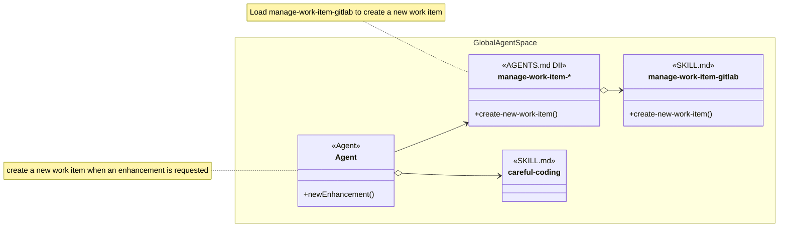

The namespace shows which nodes are available in the global Agent space. It does not add a relationship among them. The open diamond on Agent records exact knowledge of the whole careful-coding skill. The regular arrow records that newEnhancement() knows create-new-work-item() through the abstract manage-work-item-* family without naming its implementation. The AGENTS.md DII then names manage-work-item-gitlab through its open-diamond arrow.

The visible manage-work-item-* label is a wildcard family name. A matching concrete skill replaces the asterisk with its provider name. The diagram uses manage-work-item as Mermaid's internal identifier because an asterisk is not valid in an unescaped class identifier.

## 3. Modeling A SKILL.md

A concrete skill must be modeled before its relationships are drawn in detail. The inventory uses the exact skill identity as the class name, then separates callable operations from information those operations consult.

- **RULE: RULE-44** A skill identity retains its exact kebab-case name
  - **SYNOPSIS:** The concrete class name copies the name field from the SKILL.md instead of converting it to PascalCase, title case, or an invented class name.
  - **EXAMPLE:** The concrete class is named careful-coding rather than using an invented PascalCase alias or a redundant identity member.

- **PROCESS: PROCESS-8** Inventory a complete SKILL.md before modeling its members
  - **SYNOPSIS:** Read the title, description, every heading, and the instructions beneath each heading; then classify the content as a procedure, reference information, routing information, an input or result contract, or a mixed section.
  - **EXAMPLE:** Modeling careful-coding requires reading Think Before Coding through Success Signal rather than treating the skill title as one callable operation.

- **RULE: RULE-45** A skill name is not automatically a procedure name
  - **SYNOPSIS:** A skill name can support a whole-skill procedure only when it names an operation and the definition supplies that operation. A subject, quality, technology, or guideline name identifies a package but not an invocation.
  - **EXAMPLE:** create-pull-request can support createPullRequest(verifiedBranchState), while careful-coding cannot support carefulCoding().

- **RULE: RULE-46** A function-style member requires operational source content
  - **SYNOPSIS:** A procedure member must trace to instructions that perform an action with a meaningful input, decision, state change, or result. Use the source heading when it names the action; otherwise derive a concise operation name from the instructions and record the source heading.
  - **EXAMPLE:** Think Before Coding is modeled as confirmWork(requestedChange) because its instructions actively resolve assumptions, ambiguity, simpler alternatives, and existing intent before implementation.

- **RULE: RULE-47** Non-callable instructions are reference members
  - **SYNOPSIS:** Guidelines, invariants, boundaries, decision tables, routing rules, and input or result shapes that an operation consults are attribute-style reference members without parentheses.
  - **EXAMPLE:** Simplicity First is modeled as +reference simplicity-first-guidelines because it constrains coding decisions but is not independently invoked.

- **RULE: RULE-48** Unclear source boundaries remain visible as modeling debt
  - **SYNOPSIS:** When a heading is vague or mixes procedures with reference information, the analysis records the source-to-member mapping instead of silently presenting an invented procedure as source vocabulary. Clarifying that SKILL.md requires a separate governed definition change.
  - **EXAMPLE:** JUnit and Jest both have a Verification heading that supports runProjectTests(testScope), but neither heading exposes that shared procedure name explicitly.

- **RULE: RULE-49** A relationship diagram is a relevant view of the complete inventory
  - **SYNOPSIS:** The analysis reads and classifies the whole skill, while a particular diagram displays only the procedures and references needed to explain that relationship. An omitted member is not presumed absent from the SKILL.md.
  - **EXAMPLE:** An empty careful-coding node means that the Agent loads the whole skill, while manage-work-item-gitlab displays create-new-work-item() because the DII relationship selects that procedure.

The inventory applies these classifications:

- A procedure performs an action and has an invocation boundary.
- Reference information constrains or explains procedures but is not invoked independently.
- Routing, input, and result material remains reference information unless the source defines an independently invoked action.
- A mixed or vague section can yield a derived member for analysis, but its source heading remains part of the evidence.

The careful-coding inventory illustrates the method:

| Source content | Classification | Modeled member | Reason |
| --- | --- | --- | --- |
| Skill name | Skill identity | class careful-coding | The class name identifies the package; it does not name an invocation. |
| Think Before Coding | Procedure | +confirmWork(requestedChange) | The section requires a pre-implementation confirmation of assumptions, ambiguity, simpler approaches, project intent, callers, tests, and patterns. |
| Simplicity First | Reference information | +reference simplicity-first-guidelines | The section supplies design constraints that other procedures consult. |
| Surgical Changes | Reference information | +reference surgical-change-guidelines | The section constrains changed-line scope, cleanup, and error-boundary choices. |
| Preserve Authorized Contracts | Procedure | +validateContract(authorizedContract) | The section requires an active check before narrowing accepted inputs, outputs, or rejection rules. |
| Goal-Driven Execution | Procedure | +executeGoalDrivenLoop(workGoal) | The section turns a goal into success criteria and repeats implementation and verification until the criteria are met. |
| Success Signal | Reference information | +reference success-signal | The section describes evidence that the guidance is working. |

The class name retains kebab-case because it identifies the package. An empty member area means that the referencing node loads the whole skill. Parentheses distinguish selected procedures from attribute-style +reference members. These attributes are conceptual references, not runtime fields.

Goal-Driven Execution uses tests in several examples, but it is broader than the red-green-refactor operation defined by test-driven-development. The two procedures therefore keep distinct names.

## 4. Agent Skills

An Agent Skill is a SKILL.md that an Agent definition references by exact name. The reference can apply to every execution of that Agent role or only when a routing condition is satisfied.

This section covers only Agent-to-skill references. Skill-to-skill relationships are Peer Skills.

- **RULE: RULE-5** An Agent Skill is referenced by its skill name
  - **SYNOPSIS:** The Agent definition knows the exact SKILL.md identity and follows that skill’s procedures and instructions.
  - **EXAMPLE:** Dev Coder names careful-coding directly in its skill list.

- **RULE: RULE-6** An unconditional Agent Skill applies to every execution of the Agent role
  - **SYNOPSIS:** An Agent definition lists the skill without a condition because that dependency belongs to every execution of the role.
  - **EXAMPLE:** Dev Coder lists careful-coding without a condition so every Dev Coder execution applies it.

- **RULE: RULE-7** A condition routes an Agent to a named Agent Skill
  - **SYNOPSIS:** The Agent definition still knows the exact skill name, but it uses that skill only when the declared condition matches the task.
  - **EXAMPLE:** Dev Coder names test-driven-development under the condition that executable tests should guide the implementation.

A dotted line is introduced here because test-driven-development is optional. Dotted lines mean conditional loading throughout the class diagrams. A condition is the only text placed on a class-diagram arrow.

The open diamond still means that Dev Coder knows the exact skill name. The line changes from solid to dotted only because the second reference is conditional.

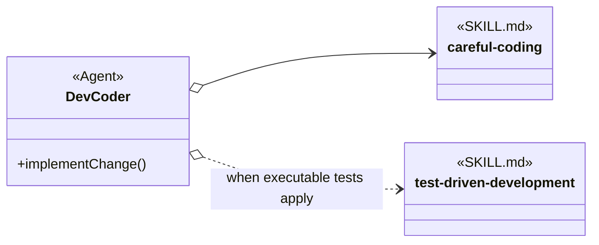

Both empty skill nodes mean that Dev Coder loads each applicable skill as a whole. The references couple Dev Coder to exact skill names. The condition changes when the second reference applies; it does not turn the reference into skills injection.

## 5. Injected Skills

Injected Skills are Injectable Skills selected for an Agent through AGENTS.md. The Agent invokes a shared procedure name and does not name the implementing SKILL.md.

- **RULE: RULE-2** The Agent, AGENTS.md, and the implementing SKILL.md share the same procedure name
  - **SYNOPSIS:** The procedure name connects the Agent’s intent, the injection instruction, and the concrete procedure.
  - **EXAMPLE:** The Agent needs create-new-work-item(). AGENTS.md links manage-work-item-* to manage-work-item-gitlab, whose Create New Work Item section defines that procedure for GitLab.

- **RULE: RULE-3** An Injectable Skill encapsulates selectable technology or procedure details
  - **SYNOPSIS:** The Injectable Skill owns the technology-specific or procedure-specific instructions that the Agent should not repeat.
  - **EXAMPLE:** manage-work-item-gitlab owns issue search, creation, read-back verification, and GitLab identity while the Agent only requests a new work item.

- **RULE: RULE-4** AGENTS.md selects one of several implementations
  - **SYNOPSIS:** AGENTS.md tells the agent which SKILL.md to load when it needs the procedure.
  - **EXAMPLE:** One project can bind manage-work-item-* to manage-work-item-file, while another binds the same family and procedure to manage-work-item-gitlab.

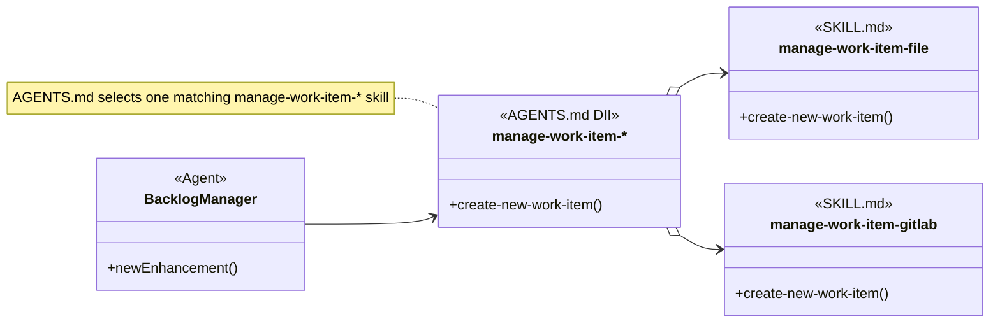

The regular arrow means that Backlog Manager refers to create-new-work-item() through the manage-work-item-* family. The open-diamond arrows mean that the AGENTS.md DII can name either concrete matching skill. One project configuration selects one implementation for this procedure; the diagram shows the alternatives, not two simultaneous loads.

Both concrete skills expose create-new-work-item(). In manage-work-item-gitlab, that procedure maps to a Create New Work Item section that explains the GitLab-specific steps. Other management procedures can appear as additional sections without changing the creation procedure shared through the abstract family.

The manage-work-item-* family and its two concrete names are analysis vocabulary supplied for this example. They do not assert that those exact skill definitions already exist in the repository.

The two Agent dependency styles differ at the selection boundary:

| Relationship | Agent knows | Selection | Substitution |
| --- | --- | --- | --- |
| Agent Skill | The exact skill name and that skill’s procedures. | The Agent definition references the skill for every execution or under a condition. | Replacement usually requires changing the Agent definition. |
| Injected Skill | The procedure name and invocation meaning. | AGENTS.md selects an implementing SKILL.md. | Another SKILL.md can be selected when it implements the same procedure name and invocation meaning. |

## 6. Peer Skills

A Peer Skill complements another SKILL.md. Peer describes a relationship between complementary skills, not a third implementation-selection mechanism.

- **RULE: RULE-28** Peer Skills provide complementary procedures
  - **SYNOPSIS:** One Peer Skill invokes another when the second skill owns a distinct procedure needed inside the first skill’s workflow.
  - **EXAMPLE:** complete-work-item-feature-branch uses create-pull-request to publish a GitHub pull request.

- **RULE: RULE-29** A direct Peer Skill reference couples two SKILL.md files by name
  - **SYNOPSIS:** The invoking SKILL.md knows the exact Peer Skill and follows that peer’s procedure.
  - **EXAMPLE:** complete-work-item-feature-branch names create-pull-request directly for GitHub publication.

- **RULE: RULE-30** A Peer Skill can be selected through skills injection
  - **SYNOPSIS:** The invoking SKILL.md can use a shared procedure name while AGENTS.md selects the complementary implementation.
  - **EXAMPLE:** test-driven-development can invoke Run Project Tests while AGENTS.md selects JUnit or Jest for the project.

Peer Skill arrows apply the same knowledge test:

- Use a regular arrow when the invoking skill refers to the peer procedure name.
- Use an open-diamond arrow when the invoking skill explicitly names the other skill.
- Use the dotted form only when the peer is loaded under a condition, and write that condition on the arrow.

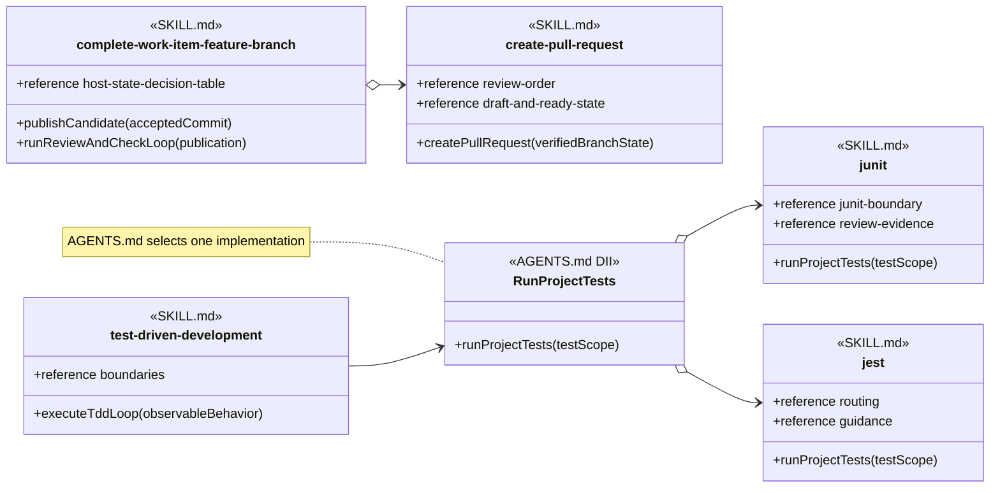

The feature-branch skill explicitly names create-pull-request, so its arrow uses the open diamond. test-driven-development knows Run Project Tests by procedure name, so its arrow is regular. AGENTS.md then selects JUnit or Jest by exact skill name.

The runProjectTests(testScope) members are derived from the Verification sections in both testing skills. The shared operation is semantically present, but its exact name is not a current source heading. That recorded mapping exposes weaker substitution vocabulary than the explicit create-new-work-item() family example instead of disguising it.

## 7. From User Request To Skill Interface

This section separates understanding the user’s request from choosing the implementation.

- **PROCESS: PROCESS-1** Receive a user request
  - **SYNOPSIS:** The Agent receives natural language describing a new enhancement.
  - **EXAMPLE:** The Agent is told, “Add a new Cancel button enhancement.”

- **PROCESS: PROCESS-2** Transform the request into an interface invocation
  - **SYNOPSIS:** The Agent invokes newEnhancement(), whose instructions refer to the create-new-work-item() procedure.
  - **EXAMPLE:** The Agent concludes, “A new enhancement requires me to create a new work item.”

- **RULE: RULE-8** Agent context carries enhancement intent rather than provider details
  - **SYNOPSIS:** newEnhancement() retains the enhancement request in Agent context. create-new-work-item() delegates provider representation to the selected manage-work-item-* skill.
  - **EXAMPLE:** Add a new Cancel button does not require newEnhancement() to know a repository path, GitLab project identifier, label set, or issue URL.

Sequence diagrams use solid messages for every request, action, and return. Their text is necessary because the diagram shows chronological actions rather than static references. Return messages begin with Return. Dotted lines remain reserved for conditional references in class diagrams.

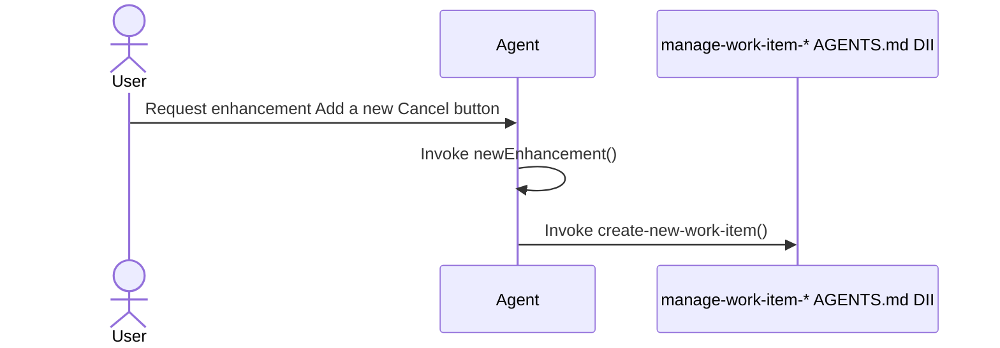

At this point, newEnhancement() has referred to the creation procedure, but the Agent has not chosen file or GitLab behavior itself.

## 8. Skills Injection Through AGENTS.md

AGENTS.md links a procedure name to a concrete SKILL.md.

- **PROCESS: PROCESS-3** Provide the injection instruction
  - **SYNOPSIS:** Effective project guidance tells the agent which skill to load when the procedure is needed.
  - **EXAMPLE:** “When you need create-new-work-item(), load manage-work-item-gitlab.”

- **RULE: RULE-9** AGENTS.md owns the binding outside the calling agent
  - **SYNOPSIS:** The Agent retains newEnhancement() and its create-new-work-item() reference when project setup chooses another matching implementation.
  - **EXAMPLE:** Changing the AGENTS.md binding from manage-work-item-gitlab to manage-work-item-file does not change newEnhancement().

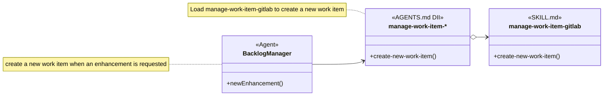

The regular arrow goes from the Backlog Manager to the AGENTS.md DII because newEnhancement() refers to create-new-work-item(). The open-diamond arrow goes from the DII to manage-work-item-gitlab because AGENTS.md selects that skill by exact name.

Skills injection is an instruction relationship. The model does not require a compiled interface object or a software dependency-injection container.

## 9. Loading And Invoking The Selected SKILL.md

The agent follows the injection instruction only when it needs the Skill interface.

- **PROCESS: PROCESS-4** Load the selected skill
  - **SYNOPSIS:** The agent reads the SKILL.md named by AGENTS.md.
  - **EXAMPLE:** The agent concludes, “AGENTS.md binds manage-work-item-* to manage-work-item-gitlab, so I will load that SKILL.md.”

- **PROCESS: PROCESS-5** Find the procedure with the shared name
  - **SYNOPSIS:** The loaded SKILL.md uses the same procedure name and explains the concrete steps.
  - **EXAMPLE:** The agent finds the Create New Work Item section that defines create-new-work-item() for GitLab.

- **PROCESS: PROCESS-6** Invoke the selected procedure using Agent context
  - **SYNOPSIS:** The implementing procedure reads the enhancement intent already held in Agent context and applies provider-specific steps.
  - **EXAMPLE:** The GitLab procedure reads Add a new Cancel button, then applies its own duplicate search, issue creation, and read-back rules.

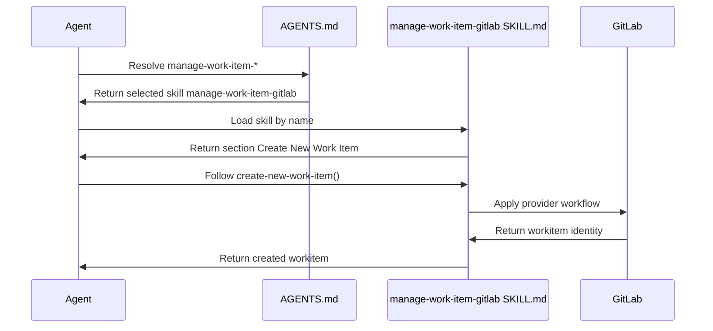

Every message is solid. Direction and the Return prefix distinguish information coming back from an action. The Agent’s newEnhancement() behavior and create-new-work-item() reference stay the same when another matching skill is selected. The provider-specific actions come from the loaded SKILL.md.

## 10. One Or More Procedures In A SKILL.md

The number of Skill interfaces depends on how many independently invocable procedure names the SKILL.md defines.

- **RULE: RULE-10** A simple SKILL.md can export one Skill interface
  - **SYNOPSIS:** One procedure name and its cohesive procedure are enough for a focused skill.
  - **EXAMPLE:** manage-work-item-gitlab can export create-new-work-item() through its Create New Work Item section.

- **RULE: RULE-11** A more complex SKILL.md can export several Skill interfaces
  - **SYNOPSIS:** One file can define several procedure names when it contains procedures that callers invoke independently and that do not describe the same cross-cutting concern.
  - **EXAMPLE:** agent-claim can export Acquire Claim and Release Claim as separate Skill interfaces.

- **RULE: RULE-12** Multiple interfaces describe the SKILL.md without deciding its structure
  - **SYNOPSIS:** The analysis records each independently invoked procedure name. It does not conclude from that fact alone that the SKILL.md should be split.
  - **EXAMPLE:** Acquire Claim and Release Claim remain distinct procedure names even though agent-claim defines both.

A function-style member belongs on an AGENTS.md DII or on a SKILL.md part whose source content defines an operation. A complex SKILL.md can therefore contain several function-style procedure members together with attribute-style reference members. The analysis records the source heading whenever the displayed operation name had to be derived from a vague heading or from its instructions.

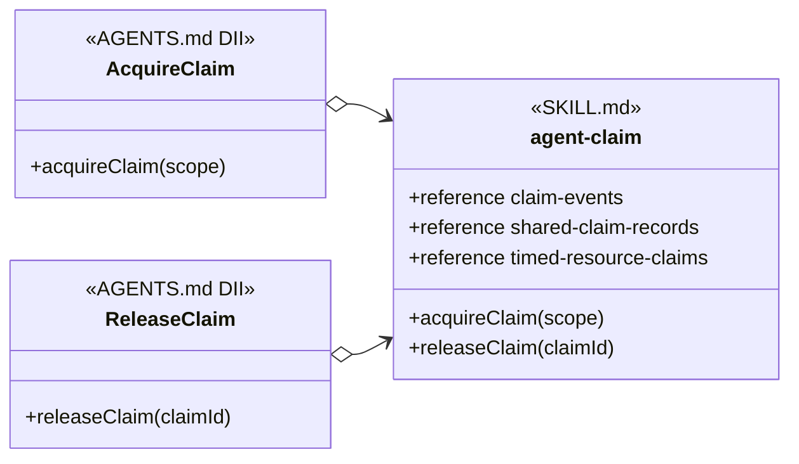

Each AGENTS.md DII refers to its own procedure name and can select agent-claim by exact name. acquireClaim(scope) is derived from Claim Events, while releaseClaim(claimId) is supported by Claim Events and Release Cleanup. The attribute-style members preserve the decision table and record rules that both procedures consult.

An Agent Skill or a directly referenced Peer Skill can also contain several procedures. Those procedures do not become interchangeable Skill interfaces merely because they share one file. Interchangeability requires the SKILL.md, its invokers, and alternative implementations to share the same procedure names and invocation meanings.

## 11. A Second Injected Example: Deliver Workitem

The same relationship applies to completion procedures.

- **PROCESS: PROCESS-7** Request delivery after review and testing
  - **SYNOPSIS:** A development workflow invokes Deliver Workitem with the accepted change after its required gates pass.
  - **EXAMPLE:** The caller concludes, “Review and testing passed. I must Deliver Workitem with accepted commit abc123.”

- **RULE: RULE-13** AGENTS.md selects the delivery SKILL.md
  - **SYNOPSIS:** The calling workflow uses the same procedure name while project guidance selects direct-main or feature-branch delivery.
  - **EXAMPLE:** AGENTS.md can link Deliver Workitem to complete-work-item-direct-main or complete-work-item-feature-branch.

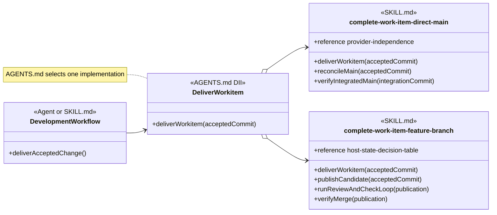

The regular arrow shows that the development workflow knows Deliver Workitem by procedure name. The open-diamond arrows show the two exact skill names that AGENTS.md can select. The direct-main and feature-branch procedures remain different internally even though callers reach either one through the same procedure name.

## 12. Agent Classes, Objects, And Skill Dependencies

An Agent can use named Agent Skills and Injected Skills together. The reusable Agent definition is comparable to a class, while one task-bound execution is comparable to an object with context and changing state.

- **RULE: RULE-14** The agent class owns reusable purpose and known dependencies
  - **SYNOPSIS:** The Agent definition states its purpose, the Skill interfaces it invokes, and the Agent Skills it names.
  - **EXAMPLE:** A coding-agent class can name careful-coding directly and invoke Deliver Workitem without naming the delivery SKILL.md.

- **RULE: RULE-15** The agent object owns task context and changing state
  - **SYNOPSIS:** One running instance receives the task, effective AGENTS.md, loaded SKILL.md files, and execution evidence.
  - **EXAMPLE:** One coding-agent object holds accepted commit abc123, knows feature-branch is the injected delivery skill, and is waiting for review.

- **RULE: RULE-16** Technology and project skills can be injectable through shared procedure names
  - **SYNOPSIS:** A technology or project SKILL.md is injectable when it implements a procedure name and invocation meaning that the Agent already uses.
  - **EXAMPLE:** A testing agent can invoke Run Project Tests with a test scope while AGENTS.md selects a JUnit or Jest SKILL.md for the project.

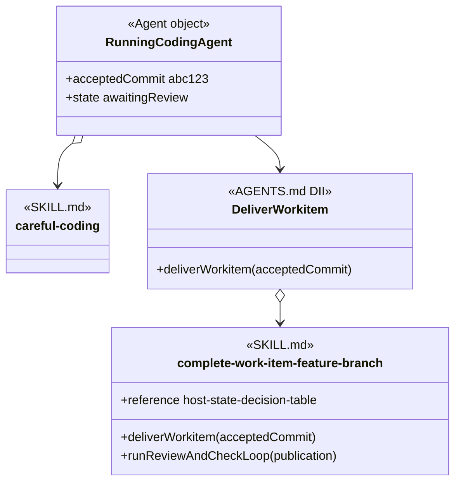

The running Agent points directly to careful-coding because its Agent definition names that skill. It points regularly to Deliver Workitem because it knows the procedure name. The AGENTS.md DII points by open diamond to the selected feature-branch skill.

The diagram does not draw a class-to-object link or an inheritance relationship. The class-and-object language explains reusable definition versus task-bound state; it does not require the harness to construct software objects.

## 13. Agent Superclass Stand-Ins

A shared relationship can appear once when many Agents reference the same skill in the same way. Drawing every Agent separately can hide the relationship behind repeated arrows.

A superclass stand-in is a diagram-compression device. It names the set of applicable Agents and carries their shared relationship. It is not a conceptual Agent definition and does not assert inheritance among those Agents.

- **RULE: RULE-38** A superclass stand-in represents Agents that share one relationship
  - **SYNOPSIS:** The stand-in replaces repeated Agent nodes only when every represented Agent reaches the same referenced node through the same reference form.
  - **EXAMPLE:** Structured Artifact Reviewers can stand in for every reviewer that names review-structured-artifact directly.

- **RULE: RULE-39** A superclass stand-in does not assert Agent inheritance
  - **SYNOPSIS:** The stand-in compresses the picture without claiming that the represented Agents inherit purpose, instructions, state, or behavior from a repository-defined base Agent.
  - **EXAMPLE:** A code reviewer and a methodology artifact reviewer can share the stand-in without becoming subclasses of one another or of a generated Reviewing Agent.

- **RULE: RULE-40** A stand-in is named after its applicability set
  - **SYNOPSIS:** Its name describes which Agents share the relationship and avoids invented runtime behavior.
  - **EXAMPLE:** Structured Artifact Reviewers is clearer than an invented Agent class with methods that do not exist in the Agent definitions.

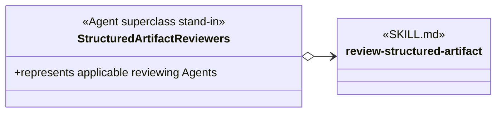

The open-diamond arrow says that every represented Agent names review-structured-artifact directly. No inheritance arrows are needed because the stand-in exists only to avoid drawing the same reference many times.

## 14. Constraints

- **RULE: RULE-20** A loaded skill is not necessarily injectable
  - **SYNOPSIS:** A SKILL.md is injectable only when it and its invokers share a procedure name and invocation meaning that another implementation can also use.
  - **EXAMPLE:** An Agent can load code-discovery by name as an Agent Skill without making code-discovery injectable.

- **RULE: RULE-21** Provider-specific procedure details remain inside SKILL.md
  - **SYNOPSIS:** A shared procedure name stabilizes the invoker. It does not make the file and GitLab procedures identical internally.
  - **EXAMPLE:** create-new-work-item() can produce a repository-backed record through manage-work-item-file and a GitLab issue through manage-work-item-gitlab while each procedure preserves provider-accurate evidence.

- **RULE: RULE-41** A superclass stand-in is not an injection mechanism
  - **SYNOPSIS:** A stand-in compresses repeated Agent relationships. An AGENTS.md DII selects a SKILL.md implementation for a procedure name.
  - **EXAMPLE:** Structured Artifact Reviewers can summarize exact-name references to review-structured-artifact, while manage-work-item-* still needs an AGENTS.md DII to select its provider skill.

- **RULE: RULE-23** The model remains conceptual
  - **SYNOPSIS:** The document explains the vocabulary and relationships without prescribing a schema, migration order, or repository change sequence.
  - **EXAMPLE:** The diagrams show manage-work-item-* with the AGENTS.md DII prototype without specifying a new YAML field for declaring it.

## 15. Definition Of Good

- **RULE: RULE-24** The diagrams distinguish AGENTS.md DII from SKILL.md
  - **SYNOPSIS:** Diagrams label an injected shared contract as AGENTS.md DII and a concrete skill definition as SKILL.md.
  - **EXAMPLE:** manage-work-item-* has the AGENTS.md DII stereotype; manage-work-item-gitlab has the SKILL.md stereotype.

- **RULE: RULE-25** The complete workitem invocation is traceable
  - **SYNOPSIS:** A reader can follow the request from the user, through newEnhancement() and its creation reference, through AGENTS.md injection, to the selected SKILL.md procedure.
  - **EXAMPLE:** Add a new Cancel button invokes newEnhancement(), which refers to create-new-work-item(); AGENTS.md selects manage-work-item-gitlab, whose Create New Work Item section performs the GitLab procedure.

- **RULE: RULE-26** Direct and injected dependency styles have valid uses
  - **SYNOPSIS:** Agent Skills and direct Peer Skill references support exact dependencies. Injected Skills support substitution.
  - **EXAMPLE:** Dev Coder names careful-coding as an Agent Skill, complete-work-item-feature-branch names create-pull-request as a Peer Skill, and manage-work-item-* uses injection.

- **RULE: RULE-27** Every assertion includes an example
  - **SYNOPSIS:** Each GOAL, RULE, PROCESS, and other structured assertion is followed by an EXAMPLE.
  - **EXAMPLE:** RULE-20 defines the Injectable Skill boundary and illustrates it with code-discovery.

- **RULE: RULE-32** Concrete skill notation distinguishes identity, procedures, and reference information
  - **SYNOPSIS:** A SKILL.md node retains its kebab-case class name, stays empty when the whole skill is loaded, uses function style only for selected source-backed operations, and uses +reference without parentheses for non-callable information.
  - **EXAMPLE:** careful-coding is empty when loaded as a whole, while agent-claim can display +acquireClaim(scope) and +reference claim-events when those members are relevant.

- **RULE: RULE-42** Every reference points from the referencing node to the referenced node
  - **SYNOPSIS:** The source appears first, the arrowhead points to the target, and an open diamond remains on the source that knows an exact skill name.
  - **EXAMPLE:** manage-work-item o--> manage-work-item-gitlab reads from the AGENTS.md DII that names the matching skill to the SKILL.md that it selects.

- **RULE: RULE-43** Line and endpoint form expose name knowledge and conditionality
  - **SYNOPSIS:** A regular line means procedure-name reference, an open diamond means exact skill-name reference, and the dotted form means the reference is conditional. Only a dotted class reference carries text, and that text states the condition.
  - **EXAMPLE:** DevCoder o..> test-driven-development with when executable tests apply means that Dev Coder conditionally loads that exact named skill.

## 16. Glossary

The glossary summarizes concepts after the examples have established them.

| Term | Meaning | Example |
| --- | --- | --- |
| Global Agent space | The execution space in which an Agent can find available SKILL.md files. Availability alone does not create a reference. | careful-coding and test-driven-development can both be available while one Agent execution loads only the applicable skills. |
| Skill interface | A shared procedure name and invocation meaning used by an invoker and by the SKILL.md that supplies the procedure. | manage-work-item-* exposes create-new-work-item(). |
| Procedure name | The name that identifies the operation an invoker needs. | create-new-work-item. |
| Procedure context | Information already held by the invoking Agent for use by the named procedure. | Enhancement description: Add a new Cancel button. |
| Procedure | Instructions in a SKILL.md that explain how to perform the named operation. | Create a GitLab issue, read it back, and return its identity. |
| Reference member | Attribute-style notation for guidelines, invariants, boundaries, routing, tables, or contracts that procedures consult but do not invoke independently. | +reference simplicity-first-guidelines. |
| Derived procedure member | A function-style member whose operation is established by source instructions even though its displayed procedure name is clearer than the source heading. | Think Before Coding is modeled as +confirmWork(requestedChange). |
| Modeling debt | A visible mismatch between the operations or references found in a skill and the headings or shared vocabulary that expose them. | JUnit Verification supports Run Project Tests but does not name that shared procedure explicitly. |
| AGENTS.md DII | An abstract diagram node for a procedure whose matching skill is selected by name through AGENTS.md. | manage-work-item-* points to manage-work-item-gitlab after project setup selects GitLab persistence. |
| SKILL.md | A concrete skill definition containing one or more procedures and reference sections. | manage-work-item-gitlab contains a Create New Work Item section in this analysis example. |
| Agent Skill | A SKILL.md referenced by exact name in an Agent definition for every execution or under a routing condition. | Dev Coder names careful-coding unconditionally and test-driven-development conditionally. |
| Injectable Skill | A SKILL.md written with a shared procedure name and invocation meaning so AGENTS.md can select it without changing its invoker. | manage-work-item-file and manage-work-item-gitlab can both supply create-new-work-item(). |
| Injected Skill | The Injectable Skill selected through AGENTS.md for one procedure in an effective project configuration. | manage-work-item-gitlab is the Injected Skill when AGENTS.md binds it to manage-work-item-*. |
| Skills injection | The AGENTS.md selection that links an abstract skill family and procedure to one concrete SKILL.md. | When create-new-work-item() is needed, load manage-work-item-gitlab. |
| Peer Skill | A SKILL.md that supplies a complementary procedure used by another SKILL.md. | complete-work-item-feature-branch uses create-pull-request. |
| Exact-name reference | An open-diamond arrow from a node that knows a skill’s exact name to that SKILL.md. | DevCoder o--> careful-coding. |
| Procedure-name reference | A regular arrow from an invoker to the procedure it knows without naming the implementing SKILL.md. | BacklogManager --> manage-work-item. |
| Conditional reference | A dotted regular or open-diamond arrow whose label states the loading condition. | DevCoder o..> test-driven-development when executable tests apply. |
| Agent class | The reusable Agent definition side of the analogy. | Backlog Manager. |
| Agent object | One task-bound execution with context and changing state. | The Backlog Manager processing the Cancel-button request. |
| Agent superclass stand-in | A diagram-compression node representing several Agents that share the same relationship. It does not assert inheritance. | Structured Artifact Reviewers represents reviewers that all name review-structured-artifact. |
| Empty SKILL.md node | A concrete skill class with no displayed procedure or reference members, meaning that the relationship loads the whole skill. | careful-coding under Dev Coder. |
| Procedure member | A function-style member backed by operational source content. The skill name itself can justify the member only when it names that operation. | +create-new-work-item() in manage-work-item-gitlab or +confirmWork(requestedChange) when that part of careful-coding is selected. |

## Applied Models

The reusable method ends here. Current applications to the established skill groups are maintained as independent documents under [Object-Oriented Skill Group Models](object-oriented-skill-group-models.md).

## Authoritative Inputs

- The user-supplied object-oriented analysis and vocabulary corrections for this document.
- [Agentic Configuration](agentic-configuration.html)
- [Work-Item Provider And Completion Contracts](work-item-provider-and-completion-contracts.md)
- [Complete Work Item Direct Main](../skills/complete-work-item-direct-main/SKILL.md)
- [Complete Work Item Feature Branch](../skills/complete-work-item-feature-branch/SKILL.md)
- [Create Pull Request](../skills/create-pull-request/SKILL.md)
- [Careful Coding](../skills/careful-coding/SKILL.md)
- [Test-Driven Development](../skills/test-driven-development/SKILL.md)
- [JUnit](../skills/junit/SKILL.md)
- [Jest](../skills/jest/SKILL.md)
- [Agent Claim](../skills/agent-claim/SKILL.md)
- [Review Structured Artifact](../skills/review-structured-artifact/SKILL.md)
- [Dev Coder](../agents/roles/dev-activities/dev-coder.role.yaml)
- [Mermaid Class Diagram Relationships](https://mermaid.js.org/syntax/classDiagram.html)
- [Mermaid Sequence Diagram Messages](https://mermaid.js.org/syntax/sequenceDiagram)
