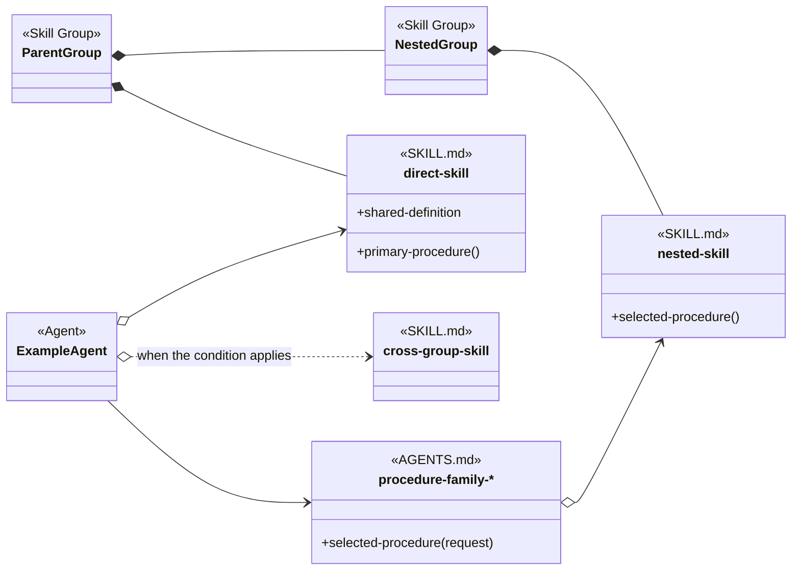

# Object-Oriented Skill Group Models

This document applies the reusable [Skill Organization](object-oriented-agent-and-skill-model.md#3-skill-organization) method to the development-methodology skill groups. It owns the applied legend, group registry, navigation, and steady-state completeness checks. Each detailed group keeps its current relationship diagram in a separate document.

## 1. Application Scope

The application covers seven top-level comprehension groups and forty-three current skill packages.

Every detailed group document contains:

- one steady-state class diagram of the relevant Agent, AGENTS.md, SKILL.md, and Skill Group relationships;
- the current skill names and public procedure headings needed in that view;
- a responsibility table for every skill whose primary direct group appears in the document; and
- links to the Agent and skill definitions that authorize the model.

Concurrent Tasking contains three direct skills and two nested groups. Resource Coordination and Feature Branch And Worktrees each contain three direct skills. Membership inherited from a nested group does not assign a skill a second primary group.

Each skill has one primary direct group. A skill repeated outside that group and outside a containing ancestor is marked Cross-group. The repeated node exposes a dependency or loading relationship without changing ownership.

## 2. Applied Model Legend

The applied diagrams use the relationship and member conventions defined by the reusable analysis method.

- A SKILL.md node uses the exact current kebab-case skill name.
- A function member with parentheses represents a public procedure described by the skill.
- A data member without parentheses represents an exposed definition, rule set, structure, or other non-procedural contract.
- An empty member area means that the skill describes one procedure and its identity already names that operation.
- An Agent Skill is loaded by exact name from an Agent definition.
- An Injectable Skill implements procedure vocabulary selected through AGENTS.md.
- A Cross-group node repeats a skill outside its primary group because another group depends on it.
- A dotted line represents conditional loading and states the condition on the line.
- An open diamond represents an exact-name skill reference.
- A regular arrow represents a procedure reference that does not name its implementation.
- A solid diamond represents direct group membership or nested-group containment in a collapsed view. Containment does not assert that one member loads another.

The legend diagram combines the applied node and relationship forms without asserting one runtime workflow.

The solid-diamond lines describe the contents of Parent Group and Nested Group. The other lines describe loading or procedure relationships. A reader must not infer a dependency between direct-skill and nested-skill merely because both are contained by Parent Group.

## 3. Skill Group Registry

The registry assigns every current skill one primary direct group and records nested-group membership explicitly.

| Top-level group | Direct skills | Nested groups | Total skills represented |
| --- | --- | --- | ---: |
| Baseline Development | careful-coding; code-comments; code-discovery; test-driven-development; structured-design; structured-explanation; organise-project-files; review-structured-artifact; explain-code-fix | None | 9 |
| Project Setup | detect-technology-skills; create-project-configuration | None | 2 |
| Documentation Methodology | route-documentation-work; bootstrap-project-documentation; reverse-engineer-project-documentation; verify-documentation-page | None | 4 |
| Backlog Management | resolve-backlog-blockage; create-file-work-item; create-github-work-item; create-gitlab-work-item; create-azure-devops-work-item; create-jira-work-item; manage-file-work-items; manage-github-work-items; manage-gitlab-work-items; manage-azure-devops-work-items; manage-jira-work-items | None | 11 |
| Concurrent Tasking | coordinate-codex-work-items; set-solo-mode; set-multitask-mode | Resource Coordination: agent-claim, agent-claim-command, agent-claim-mcp. Feature Branch And Worktrees: integrate-agent-work, deliver-work-item-feature-branch, create-pull-request. | 9 |
| Direct Main Delivery | deliver-work-item-direct-main | None | 1 |
| Review And Verification | review-code-with-evidence; test-strategy; verify-end-to-end-workflow; analyze-root-cause; collect-runtime-evidence; trace-code-execution; review-prompt-contracts | None | 7 |

The totals count primary membership once. Cross-group repetitions in detailed diagrams do not increase the forty-three-skill inventory.

## 4. Group Designs

The group documents provide independent views of the seven methodology capabilities.

- [Baseline Development](skill-groups/baseline-development.md)
- [Project Setup](skill-groups/project-setup.md)
- [Documentation Methodology](skill-groups/documentation-methodology.md)
- [Backlog Management](skill-groups/backlog-management.md)
- [Concurrent Tasking](skill-groups/concurrent-tasking.md)
- [Direct Main Delivery](skill-groups/direct-main-delivery.md)
- [Review And Verification](skill-groups/review-and-verification.md)

## 5. Definition Of Good

The applied model is complete when it describes the maintained skill inventory and its current relationships without relying on migration history.

- **RULE: RULE-56** Each established skill group has an independent steady-state design
  - **SYNOPSIS:** A reader can inspect one responsibility boundary without loading the other six group documents.
  - **EXAMPLE:** Backlog Management shows its creation and management provider families without reproducing the Resource Coordination group inventory.

- **RULE: RULE-57** Every skill has one primary direct group
  - **SYNOPSIS:** The registry and detailed documents assign each current skill package to one direct comprehension boundary.
  - **EXAMPLE:** agent-claim belongs directly to Resource Coordination and appears elsewhere only as a Cross-group dependency.

- **RULE: RULE-58** Diagrams use current skill and procedure vocabulary
  - **SYNOPSIS:** Every skill identity resolves to a maintained SKILL.md, and every displayed procedure traces to a current heading or to a single-operation skill identity.
  - **EXAMPLE:** code-discovery exposes Discover Code Context and Determine Change Scope because both headings exist in its current definition.

- **RULE: RULE-59** Cross-group repetition does not duplicate ownership
  - **SYNOPSIS:** A Cross-group node exposes a loading or dependency relationship while preserving the skill’s primary group.
  - **EXAMPLE:** verify-documentation-page is a Documentation Methodology skill and appears in Baseline Development because review-structured-artifact loads it.

- **RULE: RULE-60** Provider families share coherent public procedure names
  - **SYNOPSIS:** Injectable implementations use the vocabulary selected through AGENTS.md while keeping provider-specific behavior inside each SKILL.md.
  - **EXAMPLE:** every management provider exposes Inventory Work Items, Transition Work Item, Reconcile Work Item Completion, Recover Work Item, and Report Work Items.

- **RULE: RULE-64** Containment remains distinct from dependency
  - **SYNOPSIS:** Nested groups organize a larger comprehension set; loading arrows separately identify which Agents or skills actually reference another skill.
  - **EXAMPLE:** Concurrent Tasking contains Resource Coordination, but coordinate-codex-work-items references only the selected resource-coordination procedure and the loaded agent-claim policy rather than every helper implementation.

## Authoritative Inputs

The applied model is grounded in the repository sources below.

- The forty-three SKILL.md files and conceptual Agent definitions linked from the seven group documents.
- [Object-Oriented Analysis Of Agents And Skills](object-oriented-agent-and-skill-model.md)
- [Bundled Skill Inventory](../README.md)
- [Agentic Configuration](agentic-configuration.html)
- [Work-Item Provider And Completion Contracts](work-item-provider-and-completion-contracts.md)
