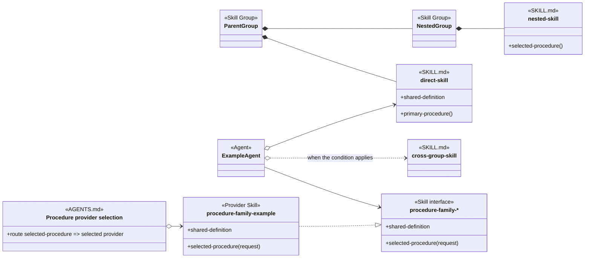

# Object-Oriented Skill Group Models

This document applies the reusable [Skill Organization](object-oriented-agent-and-skill-model.md#3-skill-organization) method to the development-methodology skill groups. It owns the applied legend, capability-group registry, cross-cutting applicability inventory, navigation, and steady-state completeness checks. Agent-oriented design documents under design/agents show how the groups and cross-cutting views are used.

## 1. Application Scope

The application covers nine top-level Skill Groups plus one cross-cutting Agent-wide applicability view. Together, these ten organizational views represent fifty-two current skill packages across eight Agent-oriented designs.

Every agent-oriented design document contains:

- an overall view when Agent groups, Skill Groups, or major cross-group dependencies are needed to establish the landscape;
- scenario views that keep each detailed consumer, loading condition, interface, AGENTS.md route, and Provider Skill family together;
- the current skill names and public procedure headings needed in that view;
- a responsibility table for every skill whose primary direct group appears in the document; and
- links to the Agent and skill definitions that authorize the model.

The applied documents organize their diagrams around the capability and its use cases. Exact-name loading, conditional loading, project routing, and interface realization explain relationships inside those views; they are not substitute topics for the capability itself.

Provider-family labels use one uniform mapping. An exact Interface Skill is a loadable kebab-case identity without a wildcard. Its family label appends a terminal wildcard to that complete identity, and each Provider Skill appends one provider suffix to the same complete stem. An applied node uses Interface Skill only when the exact package publishes the contract; an analysis-only contract uses Skill interface. The adjacent AGENTS.md factory names one exact Provider Skill, while realization arrows show which providers satisfy the shared interface.

Work Item Dispatching, Resource Coordination, and Feature Branch And Worktrees are independent Skill Groups shown together in the Work Item Dispatching And Delivery design because the same Agents use them during dispatch and delivery. Their shared page does not create a containing Skill Group or assign one group ownership of another.

Each capability-group skill has one primary direct group. A skill repeated outside that group and outside a containing ancestor is marked Cross-group. The four General Agent Skills instead belong to the separate cross-cutting applicability view because they share loading scope rather than one methodology capability.

## 2. Applied Model Legend

The applied diagrams use the relationship and member conventions defined by the reusable analysis method. Each section first explains the capability or scenario being shown, then introduces the notation needed for that view.

- A SKILL.md node uses the exact current kebab-case skill name.
- An Agent Group is a labeled rectangle containing the actual Agent nodes that share a methodology role or participate in the same view. The rectangle does not create a superclass or share dependencies among its members.
- A function member with parentheses represents a public procedure described by the skill.
- A data member without parentheses represents an exposed definition, rule set, structure, or other non-procedural contract.
- An empty member area means that the skill describes one procedure and its identity already names that operation.
- An Agent Skill is loaded by exact name from an Agent definition.
- An Injectable Skill implements procedure vocabulary selected through AGENTS.md.
- A Skill interface is an abstract contract that lists the public data and function members its consumers know and every Provider Skill must provide or respect.
- An Interface Skill is a distinct loadable SKILL.md package whose exact identity contains no wildcard. A family label such as create-work-item-* maps to the exact create-work-item identity; the wildcard is display or routing notation rather than a filesystem character.
- A Provider Skill supplies one implementation of a Skill interface. Its exact identity begins with the complete interface stem and adds one provider suffix. It uses Provider Skill as its visible stereotype instead of stacking SKILL.md and Injectable Skill stereotypes.
- A dashed realization arrow with a hollow triangular arrowhead points from a Provider Skill to the Skill interface it implements. Realization is conformance, not loading.
- An AGENTS.md factory is a separate routing node that selects one Provider Skill by exact name. It does not replace the Skill interface used by an Agent or another skill.
- A Cross-group node repeats a skill outside its primary group because another group depends on it.
- An arrow to an Agent Group or Skill Group summarizes one or more dependencies at that group boundary. It uses a regular line, dotted when conditional, because the group node is not an exact skill name loaded by the source.
- A dotted line represents a conditional relationship and states the condition on the line. For a relationship to a SKILL.md node, that means conditional loading.
- An open diamond represents an exact-name skill reference.
- A regular arrow represents a procedure reference that does not name its implementation.
- A solid diamond represents direct group membership or nested-group containment in a collapsed view. Containment does not assert that one member loads another.

Labels use the most precise engineering term available. Transport identifies a concrete message-carrying mechanism such as stdio or WebSockets; MCP is identified as a protocol, and local command execution is described as command-line invocation rather than a command transport.

The legend diagram combines the applied node and relationship forms without asserting one runtime workflow.

The solid-diamond lines describe the contents of Parent Group and Nested Group. The regular arrow from ExampleAgent to ProcedureInterface shows a procedure-name dependency on the abstract contract. The harness loads AGENTS.md automatically, so no Agent-to-ProcedureFactory arrow is drawn. The factory names one provider, and the realization arrow records provider conformance. A reader must not infer a dependency between direct-skill and nested-skill merely because both are contained by Parent Group.

## 3. Applied Organization Inventory

The inventory separates cohesive methodology capabilities from a cross-cutting view that groups independent skills only by their Agent-wide loading scope.

### 3.1 Cross-Cutting Agent-Wide Applicability View

| Cross-cutting view | Skills | Total skills represented |
| --- | --- | ---: |
| [General Agent Skills](agents/general-agent-skills.md) | effective-communication; ste-technical-writing; structured-explanation; organise-project-files | 4 |

These four skills share an Agent-wide loading boundary but do not divide one methodology capability.

### 3.2 Skill Group Registry

The registry assigns every current capability-group skill one primary direct group and records nested-group membership explicitly. General Agent Skills remain outside this registry because Agent-wide applicability does not make their independent responsibilities one Skill Group.

| Top-level group | Direct skills | Nested groups | Total skills represented |
| --- | --- | --- | ---: |
| Baseline Development | careful-coding; code-comments; code-discovery; test-driven-development; structured-design; review-structured-artifact; explain-code-fix | None | 7 |
| Project Setup | detect-technology-skills; create-project-configuration | None | 2 |
| Documentation Methodology | route-documentation-work; bootstrap-project-documentation; reverse-engineer-project-documentation; verify-documentation-page | None | 4 |
| Backlog Management | resolve-backlog-blockage; create-work-item; create-work-item-file; create-work-item-github; create-work-item-gitlab; create-work-item-azure-devops; create-work-item-jira; commit-file-provider-transaction; manage-future-ideas; manage-work-items; manage-work-items-file; manage-work-items-github; manage-work-items-gitlab; manage-work-items-azure-devops; manage-work-items-jira | None | 15 |
| Work Item Dispatching | coordinate-work-items; coordinate-codex-tasks; set-solo-mode; set-multitask-mode | None | 4 |
| Resource Coordination | resource-claim; resource-claim-helper; resource-claim-helper-command; resource-claim-helper-mcp | None | 4 |
| Feature Branch And Worktrees | integrate-agent-work; deliver-work-item-feature-branch; create-pull-request | None | 3 |
| Main Branch Delivery | deliver-work-item; deliver-work-item-main-branch | None | 2 |
| Review And Verification | review-code-with-evidence; test-strategy; verify-end-to-end-workflow; analyze-root-cause; collect-runtime-evidence; trace-code-execution; review-prompt-contracts | None | 7 |

The nine Skill Groups contain forty-eight skills. Adding the four skills in the cross-cutting Agent-wide applicability view yields the complete fifty-two-skill inventory. Cross-group repetitions in detailed diagrams do not increase either count.

## 4. Agent-Oriented Designs

The design documents show the Agent groups, Skill Groups, and detailed dependencies used in eight methodology topics.

- [General Agent Skills](agents/general-agent-skills.md)
- [Baseline Development](agents/baseline-development.md)
- [Project Setup](agents/project-setup.md)
- [Documentation Methodology](agents/documentation-methodology.md)
- [Backlog Management](agents/backlog-management.md)
- [Work Item Dispatching And Delivery](agents/work-item-dispatching-and-delivery.md)
- [Main Branch Delivery](agents/main-branch-delivery.md)
- [Review And Verification](agents/review-and-verification.md)

## 5. Definition Of Good

The applied model is complete when it describes the maintained skill inventory and its current relationships without relying on migration history.

- **RULE: RULE-56** Each established skill group appears in a steady-state Agent design
  - **SYNOPSIS:** A reader can inspect the Agents that use a responsibility boundary and follow its detailed relationships through concrete scenarios. One design can show several independent Skill Groups when the same Agent workflow uses them together.
  - **EXAMPLE:** Work Item Dispatching And Delivery shows Work Item Dispatching, Resource Coordination, Feature Branch And Worktrees, and Main Branch Delivery as independent groups used by Backlog Management Agents and Dev Delivery Agents.

- **RULE: RULE-57** Every capability-group skill has one primary direct group
  - **SYNOPSIS:** The registry and detailed documents assign each skill that contributes to a cohesive capability to one direct Skill Group. A cross-cutting applicability view separately owns skills grouped by shared loading scope.
  - **EXAMPLE:** resource-claim belongs directly to Resource Coordination and appears elsewhere only as a Cross-group dependency, while structured-explanation appears in the General Agent Skills applicability view rather than a capability group.

- **RULE: RULE-58** Diagrams use current skill and procedure vocabulary
  - **SYNOPSIS:** Every skill identity resolves to a maintained SKILL.md, and every displayed procedure traces to a current heading or to a single-operation skill identity.
  - **EXAMPLE:** code-discovery exposes Discover Code Context and Determine Change Scope because both headings exist in its current definition.

- **RULE: RULE-59** Cross-group repetition does not duplicate ownership
  - **SYNOPSIS:** A Cross-group node exposes a loading or dependency relationship while preserving the skill’s primary group.
  - **EXAMPLE:** verify-documentation-page is a Documentation Methodology skill and appears in Baseline Development because review-structured-artifact loads it.

- **RULE: RULE-60** Provider families share coherent public procedure names
  - **SYNOPSIS:** An Interface Skill owns the public vocabulary, each Provider Skill realizes that contract, and a separate AGENTS.md factory selects one provider without changing the consumer.
  - **EXAMPLE:** manage-work-items exposes Inventory Work Items, Transition Work Item, Reconcile Work Item Completion, Recover Work Item, and Report Work Items; every manage-work-items-* provider realizes those procedures while Persistence selection remains in AGENTS.md.

- **RULE: RULE-69** Provider-family naming is mechanically coherent
  - **SYNOPSIS:** A family label is the exact interface identity followed by -*, and every realizing Provider Skill begins with that complete interface stem followed by one provider suffix.
  - **EXAMPLE:** create-work-item maps to create-work-item-* and create-work-item-file; moving the wildcard or provider suffix into the middle of that stem is invalid.

- **RULE: RULE-65** Interface realization remains distinct from loading
  - **SYNOPSIS:** A realization arrow records that a provider supplies or respects the interface members. It does not assert that either node loads the other.
  - **EXAMPLE:** manage-work-items-github realizes manage-work-items, while Dev Backlog Steward separately consumes the Interface Skill and the Persistence factory separately selects the GitHub provider.

- **RULE: RULE-64** Shared use remains distinct from containment
  - **SYNOPSIS:** Placing several Skill Groups in one Agent-oriented design does not create a containing group. Dependency arrows identify which Agents or skills actually reference another group.
  - **EXAMPLE:** Work Item Dispatching depends on Resource Coordination because coordinate-work-items loads resource-claim; the shared Work Item Dispatching And Delivery page does not make Resource Coordination a nested member of Work Item Dispatching.

## Authoritative Inputs

The applied model is grounded in the repository sources below.

- The fifty-two SKILL.md files and conceptual Agent definitions linked from the eight Agent-oriented design documents.
- [Object-Oriented Analysis Of Agents And Skills](object-oriented-agent-and-skill-model.md)
- [Bundled Skill Inventory](../README.md)
- [Agentic Configuration](agentic-configuration.html)
- [Work-Item Provider And Completion Contracts](work-item-provider-and-completion-contracts.md)
