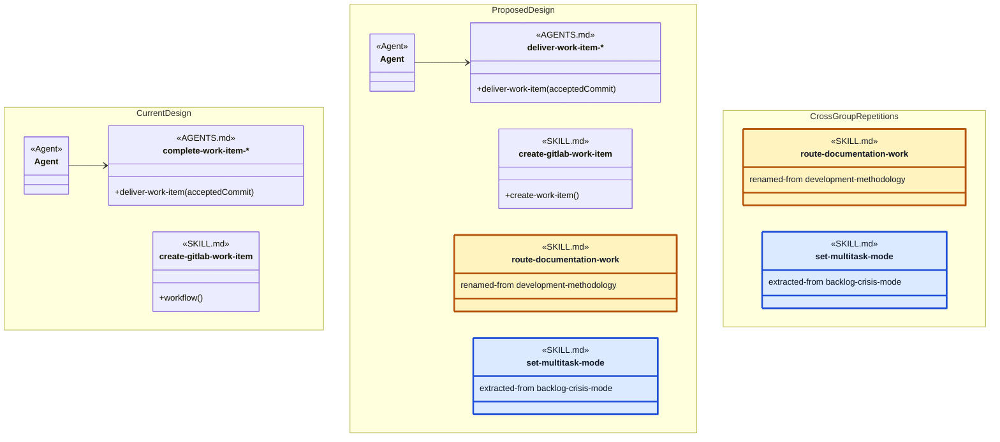

# Object-Oriented Skill Group Models

This document applies the reusable [Skill Organization](object-oriented-agent-and-skill-model.md#3-skill-organization) method to the development-methodology skill groups. It owns the current-versus-proposed comparison model, shared applied legend, group navigation, and application checks. Each detailed group keeps its current and proposed diagrams in a separate document.

## 1. Application Scope

The application scope defines the common content and ownership rules for every detailed group document.

Every group document contains:

- a Current Design class diagram of the Agent, AGENTS.md, and SKILL.md relationships;
- a Proposed Design class diagram that applies the recommendations while retaining the same relationship view;
- the current SKILL.md headings that act as procedure boundaries in that view;
- one recommendation for every current skill whose primary direct group appears at the top level or as a nested group in that document; and
- any proposed skill extractions assigned to that group.

The seven group documents are top-level comprehension views covering forty-one current skills. Concurrent Tasking also contains two nested skill groups inside its document. The proposed designs retain the forty-one responsibilities and add two extracted Concurrent Tasking skills, producing forty-three proposed skill packages. Each skill has one primary direct group, which can be a top-level group or a nested group. Membership inherited from a nested group does not assign the skill a second primary group. A repeated skill outside its primary direct group and its containing ancestors is marked Cross-group.

The current diagrams describe the current definitions. The proposed diagrams visualize possible definition improvements described by the recommendations. Neither a proposed diagram nor a recommendation changes a skill or claims that a recommended interface already exists.

Each recommendation uses one or both improvement forms: a clearer operation-shaped skill name, or procedure headings that give invokers and alternative implementations consistent interface vocabulary. Keep the skill name means that only heading changes are recommended.

## 2. Applied Model Legend

The relationship, node, member, containment, and display-label conventions come from the reusable method. This application adds only the conventions needed to compare current definitions with proposed improvements:

- A Current Design uses exact current skill names and procedure members derived from current headings. A generic current heading such as Workflow remains workflow() in that view.
- A Proposed Design uses the recommended skill names and procedure headings.
- A gold SKILL.md node has a proposed skill-name change. Its renamed-from member records the current exact name.
- A blue SKILL.md node is a proposed skill extracted from part of a current skill. Its extracted-from member records the source skill.
- A neutral SKILL.md node keeps its current skill name while its method-like members show proposed procedure headings.
- A Cross-group node repeats a skill outside its primary direct group and outside any parent group that includes it through nesting.
- A repeated gold or blue Cross-group node represents the same rename or extraction shown in the primary group, not another recommendation.
- AGENTS.md procedure-family labels and relationship endpoints use the vocabulary for the design state being shown.

The Current Design namespace keeps the current skill identity, current Workflow member, and current AGENTS.md family label. The Proposed Design namespace shows four proposal forms: a neutral skill with a clearer procedure heading, a gold renamed skill, a blue extracted skill, and the proposed AGENTS.md family label. The two regular arrows demonstrate that a relationship endpoint uses the vocabulary of the design state in which it appears.

The Cross Group Repetitions namespace repeats the same visible route-documentation-work and set-multitask-mode identities shown in Proposed Design. The repeated rename keeps the gold treatment and renamed-from member, while the repeated extraction keeps the blue treatment and extracted-from member. Cross-group identifies the repeated placement; it does not create another recommendation. No line connects a Current Design node to a Proposed Design node because the two namespaces compare design states rather than declare runtime dependencies.

## 3. Proposal Name Registry

The proposal name registry gives every changed skill identity one canonical spelling and one primary direct group. A verb-first name identifies a skill with one dominant operation. A stable subject name remains appropriate for a package that exposes several related procedures or reference structures.

| Current skill or source | Proposed skill | Change | Primary direct group |
| --- | --- | --- | --- |
| fix-explanation | explain-code-fix | Rename | Baseline Development |
| development-methodology | route-documentation-work | Rename | Documentation Methodology |
| documentation-bootstrap | bootstrap-project-documentation | Rename | Documentation Methodology |
| documentation-reverse-engineer | reverse-engineer-project-documentation | Rename | Documentation Methodology |
| documentation-page-verify | verify-documentation-page | Rename | Documentation Methodology |
| backlog-crisis-mode | resolve-backlog-blockage | Rename retained responsibility | Backlog Management |
| backlog-crisis-mode | set-solo-mode | Extract | Concurrent Tasking |
| backlog-crisis-mode | set-multitask-mode | Extract | Concurrent Tasking |
| codex-workitem-coordination | coordinate-codex-work-items | Rename | Concurrent Tasking |
| agent-work-merge | integrate-agent-work | Rename | Feature Branch And Worktrees |
| complete-work-item-feature-branch | deliver-work-item-feature-branch | Rename | Feature Branch And Worktrees |
| complete-work-item-direct-main | deliver-work-item-direct-main | Rename | Direct Main Delivery |
| code-review-evidence | review-code-with-evidence | Rename | Review And Verification |
| end-to-end-verification | verify-end-to-end-workflow | Rename | Review And Verification |
| root-cause-analysis | analyze-root-cause | Rename | Review And Verification |
| runtime-evidence-collection | collect-runtime-evidence | Rename | Review And Verification |
| code-execution-tracing | trace-code-execution | Rename | Review And Verification |
| prompt-contracts | review-prompt-contracts | Rename | Review And Verification |

Every repeated proposed node in another group document uses the same canonical spelling and preserves the same renamed-from or extracted-from source.

## 4. Group Designs

The group designs apply one comparison contract to seven distinct methodology capabilities.

- [Baseline Development](skill-groups/baseline-development.md)
- [Project Setup](skill-groups/project-setup.md)
- [Documentation Methodology](skill-groups/documentation-methodology.md)
- [Backlog Management](skill-groups/backlog-management.md)
- [Concurrent Tasking](skill-groups/concurrent-tasking.md)
- [Direct Main Delivery](skill-groups/direct-main-delivery.md)
- [Review And Verification](skill-groups/review-and-verification.md)

## 5. Definition Of Good

The applied model is successful when every group is complete, current vocabulary remains distinct from proposed vocabulary, and every recommendation is traceable to its source skill.

- **RULE: RULE-56** Each established skill group has independent current and proposed designs
  - **SYNOPSIS:** A reader can inspect one responsibility boundary and compare its current and recommended organization without loading the other six groups.
  - **EXAMPLE:** Concurrent Tasking contains paired diagrams for resource coordination and feature-branch delivery without repeating the Backlog Management provider matrix.

- **RULE: RULE-57** Every current skill receives one source-backed improvement recommendation
  - **SYNOPSIS:** A recommendation either improves the skill name or introduces procedure headings that can become stable interface vocabulary.
  - **EXAMPLE:** create-gitlab-work-item keeps its current name but receives a proposed Create Work Item heading because its current entry procedure is only named Workflow.

- **RULE: RULE-58** Current and recommended vocabulary remain visibly separate
  - **SYNOPSIS:** Current Design shows current names and headings, while Proposed Design shows the vocabulary recommended by the table.
  - **EXAMPLE:** The Backlog Management current diagram shows workflow() for create-gitlab-work-item, while its proposed diagram shows create-work-item().

- **RULE: RULE-59** Every proposed skill-name change is identifiable by color and text
  - **SYNOPSIS:** A gold node distinguishes a proposed name from unchanged names, and renamed-from preserves the current identity for readers who do not rely on color.
  - **EXAMPLE:** The proposed Concurrent Tasking diagram highlights integrate-agent-work and records renamed-from agent-work-merge inside the same node.

- **RULE: RULE-60** Every proposed skill extraction identifies its source and primary direct group
  - **SYNOPSIS:** A blue node distinguishes a new extracted package from a rename, and extracted-from preserves the current source boundary.
  - **EXAMPLE:** set-solo-mode and set-multitask-mode are direct members of Concurrent Tasking and appear as Cross-group dependencies in Backlog Management.

- **RULE: RULE-64** Every proposed skill identity has one coherent canonical name
  - **SYNOPSIS:** The proposal name registry owns the spelling and primary direct group for every rename and extraction, while repeated Cross-group nodes reuse that identity unchanged.
  - **EXAMPLE:** analyze-root-cause is defined once in Review And Verification and is repeated with the same spelling in Baseline Development.

## Authoritative Inputs

The applied model is grounded in the user-directed grouping decisions and the repository sources below.

- The user-supplied methodology skill-group organization and current-versus-proposed comparison requirements for this document.
- The forty-one SKILL.md files and conceptual Agent definitions linked from the seven group documents.
- [Object-Oriented Analysis Of Agents And Skills](object-oriented-agent-and-skill-model.md)
- [Bundled Skill Inventory](../README.md)
- [Agentic Configuration](agentic-configuration.html)
- [Work-Item Provider And Completion Contracts](work-item-provider-and-completion-contracts.md)
