# Backlog Management Skill Group

## Scope

Backlog Management is independent of Resource Coordination and Commit delivery. AGENTS.md selects one creation skill and one management skill for the effective Persistence provider.

The applied-model conventions are defined in [Object-Oriented Skill Group Models](../object-oriented-skill-group-models.md#2-applied-model-legend).

## Design

The design separates blockage recovery from concurrent dispatch mode. Creation and management each have an abstract Skill interface, a separate AGENTS.md factory that selects the effective Persistence provider, and Provider Skills that realize the shared contract. A superclass stand-in represents Agents authorized to create durable work items, while the current Coordinator, Orchestrator, and Steward management roles consume the management interface for their distinct lifecycle or maintenance authority.

```mermaid
classDiagram
    direction TB

    class DevBacklogSteward {
        <<Agent>>
    }

    class DevBacklogCoordinator {
        <<Agent>>
    }

    class DevOrchestrator {
        <<Agent>>
    }

    class WorkItemCreators {
        <<Agent superclass stand-in>>
    }

    class CreateWorkItem["create-*-work-item"] {
        <<Skill interface>>
        +work-item-id
        +create-work-item(workItemDescription)
    }

    class CreateWorkItemFactory["Persistence creation selection"] {
        <<AGENTS.md>>
        <<routing>>
        +route create-work-item => selected provider
    }

    class ManageWorkItem["manage-*-work-items"] {
        <<Skill interface>>
        +work-item-id
        +inventory-work-items(selection)
        +transition-work-item(workItem, transition)
        +reconcile-work-item-completion(workItem, deliveryEvidence)
        +recover-work-item(workItem, recoveryEvidence)
        +report-work-items(selection)
    }

    class ManageWorkItemFactory["Persistence management selection"] {
        <<AGENTS.md>>
        <<routing>>
        +route manage-work-items => selected provider
    }

    namespace BacklogManagement {
        class resolve-backlog-blockage {
            <<SKILL.md>>
            <<Agent Skill>>
        }

        class create-file-work-item {
            <<Provider Skill>>
            +work-item-id
            +create-work-item(workItemDescription)
            +future-ideas-capture()
            +future-idea-promotion()
            +exact-backlog-creation-transaction()
        }

        class create-github-work-item {
            <<Provider Skill>>
            +work-item-id
            +create-work-item(workItemDescription)
        }

        class create-gitlab-work-item {
            <<Provider Skill>>
            +work-item-id
            +create-work-item(workItemDescription)
        }

        class create-azure-devops-work-item {
            <<Provider Skill>>
            +work-item-id
            +create-work-item(workItemDescription)
        }

        class create-jira-work-item {
            <<Provider Skill>>
            +work-item-id
            +create-work-item(workItemDescription)
        }

        class manage-file-work-items {
            <<Provider Skill>>
            +work-item-id
            +inventory-work-items(selection)
            +transition-work-item(workItem, transition)
            +reconcile-work-item-completion(workItem, deliveryEvidence)
            +recover-work-item(workItem, recoveryEvidence)
            +report-work-items(selection)
        }

        class manage-github-work-items {
            <<Provider Skill>>
            +work-item-id
            +inventory-work-items(selection)
            +transition-work-item(workItem, transition)
            +reconcile-work-item-completion(workItem, deliveryEvidence)
            +recover-work-item(workItem, recoveryEvidence)
            +report-work-items(selection)
        }

        class manage-gitlab-work-items {
            <<Provider Skill>>
            +work-item-id
            +inventory-work-items(selection)
            +transition-work-item(workItem, transition)
            +reconcile-work-item-completion(workItem, deliveryEvidence)
            +recover-work-item(workItem, recoveryEvidence)
            +report-work-items(selection)
        }

        class manage-azure-devops-work-items {
            <<Provider Skill>>
            +work-item-id
            +inventory-work-items(selection)
            +transition-work-item(workItem, transition)
            +reconcile-work-item-completion(workItem, deliveryEvidence)
            +recover-work-item(workItem, recoveryEvidence)
            +report-work-items(selection)
        }

        class manage-jira-work-items {
            <<Provider Skill>>
            +work-item-id
            +inventory-work-items(selection)
            +transition-work-item(workItem, transition)
            +reconcile-work-item-completion(workItem, deliveryEvidence)
            +recover-work-item(workItem, recoveryEvidence)
            +report-work-items(selection)
        }
    }

    class set-solo-mode {
        <<SKILL.md>>
        <<Cross-group>>
    }

    class set-multitask-mode {
        <<SKILL.md>>
        <<Cross-group>>
    }

    class ResourceCoordination["resource-coordination"] {
        <<Skill interface>>
        +coordinate-shared-resource(resourceManifest)
    }

    class agent-claim {
        <<SKILL.md>>
        <<Cross-group>>
    }

    WorkItemCreators --> CreateWorkItem
    WorkItemCreators --> CreateWorkItemFactory
    DevBacklogSteward --> ManageWorkItem
    DevBacklogSteward --> ManageWorkItemFactory
    DevBacklogCoordinator --> ManageWorkItem
    DevBacklogCoordinator --> ManageWorkItemFactory
    DevOrchestrator --> ManageWorkItem
    DevOrchestrator --> ManageWorkItemFactory
    DevBacklogCoordinator o..> resolve-backlog-blockage : when a backlog blockage requires sequential recovery
    DevBacklogCoordinator o..> set-solo-mode : when concurrent tasking is enabled and sequential blockage recovery begins
    DevBacklogCoordinator o..> set-multitask-mode : when concurrent tasking is enabled and sequential recovery ends

    CreateWorkItemFactory o--> create-file-work-item
    CreateWorkItemFactory o--> create-github-work-item
    CreateWorkItemFactory o--> create-gitlab-work-item
    CreateWorkItemFactory o--> create-azure-devops-work-item
    CreateWorkItemFactory o--> create-jira-work-item

    create-file-work-item ..|> CreateWorkItem
    create-github-work-item ..|> CreateWorkItem
    create-gitlab-work-item ..|> CreateWorkItem
    create-azure-devops-work-item ..|> CreateWorkItem
    create-jira-work-item ..|> CreateWorkItem

    ManageWorkItemFactory o--> manage-file-work-items
    ManageWorkItemFactory o--> manage-github-work-items
    ManageWorkItemFactory o--> manage-gitlab-work-items
    ManageWorkItemFactory o--> manage-azure-devops-work-items
    ManageWorkItemFactory o--> manage-jira-work-items

    manage-file-work-items ..|> ManageWorkItem
    manage-github-work-items ..|> ManageWorkItem
    manage-gitlab-work-items ..|> ManageWorkItem
    manage-azure-devops-work-items ..|> ManageWorkItem
    manage-jira-work-items ..|> ManageWorkItem

    create-file-work-item ..> ResourceCoordination : when resource coordination is enabled
    create-file-work-item o..> agent-claim : when classifying User Action Required and agent-claim is loaded
    manage-file-work-items ..> ResourceCoordination : when resource coordination is enabled

    note for CreateWorkItemFactory "One effective project selects one creation provider"
    note for ManageWorkItemFactory "One effective project selects one management provider"
    note for WorkItemCreators "Agents whose authorized task requires one durable work item"
    note for create-azure-devops-work-item "Unsupported placeholder"
    note for create-jira-work-item "Unsupported placeholder"
    note for manage-azure-devops-work-items "Unsupported placeholder"
    note for manage-jira-work-items "Unsupported placeholder"
    note for ResourceCoordination "Cross-group interface"
```

The abstract Skill interface nodes state what the applicable Agents can rely on without knowing the selected provider. Regular arrows show procedure-name dependencies on those contracts. The AGENTS.md factories hold the project-specific selection, and their open-diamond fan-outs enumerate exact provider names, although one effective project selects only one provider from each family. Every realization arrow points from a Provider Skill to the Skill interface whose members it supplies or respects.

The group keeps blockage analysis and sequential recovery in Backlog Management. set-solo-mode and set-multitask-mode belong to Concurrent Tasking because they disable or enable dispatch to secondary threads.

Dev Backlog Coordinator loads each of the three skills by name when its matching condition occurs. The sibling skills do not name one another, so the Agent definition remains the visible place where the entry, recovery, and exit sequence is assembled.

When Concurrent Tasking is not configured, no secondary-thread dispatch exists to change. resolve-backlog-blockage therefore remains usable without either dispatch-mode skill.

## Skill Responsibilities

Creation and management providers share public procedure names while retaining provider-specific identity, state, recovery, and mutation rules.

| Skill | Public procedures or identity | Responsibility |
| --- | --- | --- |
| resolve-backlog-blockage | Resolve Backlog Blockage | Resolves a declared blockage sequentially without owning dispatch-mode changes. |
| create-file-work-item | Create Work Item; Future Ideas Capture; Future Idea Promotion; Exact Backlog Creation Transaction | Creates file-backed work items and owns the file provider’s lightweight idea workflows. |
| create-github-work-item | Create Work Item | Creates and verifies one authoritative GitHub issue. |
| create-gitlab-work-item | Create Work Item | Creates and verifies one authoritative GitLab issue. |
| create-azure-devops-work-item | Create Work Item | Returns a truthful blocked result because Azure DevOps creation is not implemented. |
| create-jira-work-item | Create Work Item | Returns a truthful blocked result because Jira creation is not implemented. |
| manage-file-work-items | Inventory Work Items; Transition Work Item; Reconcile Work Item Completion; Recover Work Item; Report Work Items | Manages the file-backed lifecycle, dependencies, recovery, completion, reporting, and archival. |
| manage-github-work-items | Inventory Work Items; Transition Work Item; Reconcile Work Item Completion; Recover Work Item; Report Work Items | Maps the shared management procedures to GitHub issue state and evidence. |
| manage-gitlab-work-items | Inventory Work Items; Transition Work Item; Reconcile Work Item Completion; Recover Work Item; Report Work Items | Maps the shared management procedures to GitLab issue state and evidence. |
| manage-azure-devops-work-items | Inventory Work Items; Transition Work Item; Reconcile Work Item Completion; Recover Work Item; Report Work Items | Exposes the shared management interface while returning a truthful unsupported result. |
| manage-jira-work-items | Inventory Work Items; Transition Work Item; Reconcile Work Item Completion; Recover Work Item; Report Work Items | Exposes the shared management interface while returning a truthful unsupported result. |

## Authoritative Inputs

The provider relationships and procedure boundaries are grounded in these Agent and skill definitions.

- [Dev Backlog Steward](../../agents/roles/dev-activities/dev-backlog-steward.role.yaml)
- [Dev Backlog Coordinator](../../agents/roles/dev-activities/dev-backlog-coordinator.role.yaml)
- [Dev Orchestrator](../../agents/roles/dev-activities/dev-orchestrator.role.yaml)
- [Resolve Backlog Blockage](../../skills/resolve-backlog-blockage/SKILL.md)
- [Set Solo Mode](../../skills/set-solo-mode/SKILL.md)
- [Set Multitask Mode](../../skills/set-multitask-mode/SKILL.md)
- [Create File Work Item](../../skills/create-file-work-item/SKILL.md)
- [Create GitHub Work Item](../../skills/create-github-work-item/SKILL.md)
- [Create GitLab Work Item](../../skills/create-gitlab-work-item/SKILL.md)
- [Create Azure DevOps Work Item](../../skills/create-azure-devops-work-item/SKILL.md)
- [Create Jira Work Item](../../skills/create-jira-work-item/SKILL.md)
- [Manage File Work Items](../../skills/manage-file-work-items/SKILL.md)
- [Manage GitHub Work Items](../../skills/manage-github-work-items/SKILL.md)
- [Manage GitLab Work Items](../../skills/manage-gitlab-work-items/SKILL.md)
- [Manage Azure DevOps Work Items](../../skills/manage-azure-devops-work-items/SKILL.md)
- [Manage Jira Work Items](../../skills/manage-jira-work-items/SKILL.md)
- [Agent Claim](../../skills/agent-claim/SKILL.md)
