# Backlog Management Skill Group

## Scope

Backlog Management is independent of Resource Coordination and Commit delivery. AGENTS.md selects one creation skill and one management skill for the effective Persistence provider.

The shared notation and recommendation boundary are defined in [Object-Oriented Skill Group Models](../object-oriented-skill-group-models.md).

## Current Design

```mermaid
classDiagram
    direction TB

    class DevBacklogSteward {
        <<Agent>>
    }

    class DevBacklogCoordinator {
        <<Agent>>
    }

    class CreateWorkItem["create-*-work-item"] {
        <<AGENTS.md>>
        <<abstract>>
        +create-work-item(workItemDescription)
    }

    class ManageWorkItem["manage-*-work-items"] {
        <<AGENTS.md>>
        <<abstract>>
        +inventory-work-items(selection)
        +transition-work-item(workItem, transition)
        +reconcile-work-item-completion(workItem, deliveryEvidence)
    }

    namespace BacklogManagement {
        class backlog-crisis-mode {
            <<SKILL.md>>
            <<Agent Skill>>
        }

        class create-file-work-item {
            <<SKILL.md>>
            <<Injectable Skill>>
            +exact-backlog-creation-transaction()
        }

        class create-github-work-item {
            <<SKILL.md>>
            <<Injectable Skill>>
            +creation()
        }

        class create-gitlab-work-item {
            <<SKILL.md>>
            <<Injectable Skill>>
            +workflow()
        }

        class create-azure-devops-work-item {
            <<SKILL.md>>
            <<Injectable Skill>>
            <<Unsupported placeholder>>
            +required-result()
        }

        class create-jira-work-item {
            <<SKILL.md>>
            <<Injectable Skill>>
            <<Unsupported placeholder>>
            +required-result()
        }

        class manage-file-work-items {
            <<SKILL.md>>
            <<Injectable Skill>>
            +inventory-workflow()
            +dispatch-workflow()
            +completion-and-archive-workflow()
        }

        class manage-github-work-items {
            <<SKILL.md>>
            <<Injectable Skill>>
            +inventory-and-selection()
            +lifecycle-management()
            +dependencies-and-recovery()
        }

        class manage-gitlab-work-items {
            <<SKILL.md>>
            <<Injectable Skill>>
            +operations()
            +completion-and-reconciliation()
        }

        class manage-azure-devops-work-items {
            <<SKILL.md>>
            <<Injectable Skill>>
            <<Unsupported placeholder>>
            +required-result()
        }

        class manage-jira-work-items {
            <<SKILL.md>>
            <<Injectable Skill>>
            <<Unsupported placeholder>>
            +required-result()
        }
    }

    class ResourceCoordination["resource-coordination"] {
        <<AGENTS.md>>
        <<Cross-group>>
        +coordinate-shared-resource(resourceManifest)
    }

    class agent-claim {
        <<SKILL.md>>
        <<Cross-group>>
    }

    DevBacklogSteward --> CreateWorkItem
    DevBacklogSteward --> ManageWorkItem
    DevBacklogCoordinator o..> backlog-crisis-mode : when a backlog crisis is declared

    CreateWorkItem o--> create-file-work-item
    CreateWorkItem o--> create-github-work-item
    CreateWorkItem o--> create-gitlab-work-item
    CreateWorkItem o--> create-azure-devops-work-item
    CreateWorkItem o--> create-jira-work-item

    ManageWorkItem o--> manage-file-work-items
    ManageWorkItem o--> manage-github-work-items
    ManageWorkItem o--> manage-gitlab-work-items
    ManageWorkItem o--> manage-azure-devops-work-items
    ManageWorkItem o--> manage-jira-work-items

    create-file-work-item ..> ResourceCoordination : when resource coordination is enabled
    create-file-work-item o..> agent-claim : when classifying User Action Required and agent-claim is loaded
    manage-file-work-items ..> ResourceCoordination : when resource coordination is enabled
```

The AGENTS.md nodes show the procedures that callers need. The concrete nodes show the current headings that contain those procedures. The mismatched names are intentional evidence: for example, create-gitlab-work-item currently exposes only a generic Workflow heading rather than a Create Work Item heading.

Each open-diamond fan-out lists available Persistence implementations. One effective project configuration selects one creation skill and one management skill. Azure DevOps and Jira remain selectable zero-mutation placeholders.

create-file-work-item mostly requests the loaded resource-coordination procedure without selecting its implementation. Its User Action Required classification currently names agent-claim, so the diagram also retains that stronger exact-name dependency.

Crisis mode continues to use the selected Persistence provider while disabling claims and delegated delivery. It therefore remains in Backlog Management without a Resource Coordination relationship.

## Proposed Design

The proposed diagram applies the recommendations below. Gold SKILL.md nodes have a proposed name change, and renamed-from records the current name. Blue SKILL.md nodes are proposed extractions, and extracted-from records their current source. Neutral SKILL.md nodes keep their current names; their method-like members show proposed procedure headings.

```mermaid
classDiagram
    direction TB

    class DevBacklogSteward {
        <<Agent>>
    }

    class DevBacklogCoordinator {
        <<Agent>>
    }

    class CreateWorkItem["create-*-work-item"] {
        <<AGENTS.md>>
        <<abstract>>
        +create-work-item(workItemDescription)
    }

    class ManageWorkItem["manage-*-work-items"] {
        <<AGENTS.md>>
        <<abstract>>
        +inventory-work-items(selection)
        +transition-work-item(workItem, transition)
        +reconcile-work-item-completion(workItem, deliveryEvidence)
    }

    namespace BacklogManagement {
        class resolve-backlog-blockage:::renamed {
            <<SKILL.md>>
            <<Agent Skill>>
            renamed-from backlog-crisis-mode
        }

        class create-file-work-item {
            <<SKILL.md>>
            <<Injectable Skill>>
            +create-work-item()
            +capture-future-idea()
            +promote-future-idea()
            +exact-backlog-creation-transaction()
        }

        class create-github-work-item {
            <<SKILL.md>>
            <<Injectable Skill>>
            +create-work-item()
        }

        class create-gitlab-work-item {
            <<SKILL.md>>
            <<Injectable Skill>>
            +create-work-item()
        }

        class create-azure-devops-work-item {
            <<SKILL.md>>
            <<Injectable Skill>>
            <<Unsupported placeholder>>
            +create-work-item()
        }

        class create-jira-work-item {
            <<SKILL.md>>
            <<Injectable Skill>>
            <<Unsupported placeholder>>
            +create-work-item()
        }

        class manage-file-work-items {
            <<SKILL.md>>
            <<Injectable Skill>>
            +inventory-work-items()
            +transition-work-item()
            +reconcile-work-item-completion()
            +recover-work-item()
            +report-work-items()
        }

        class manage-github-work-items {
            <<SKILL.md>>
            <<Injectable Skill>>
            +inventory-work-items()
            +transition-work-item()
            +reconcile-work-item-completion()
            +recover-work-item()
            +report-work-items()
        }

        class manage-gitlab-work-items {
            <<SKILL.md>>
            <<Injectable Skill>>
            +inventory-work-items()
            +transition-work-item()
            +reconcile-work-item-completion()
            +recover-work-item()
            +report-work-items()
        }

        class manage-azure-devops-work-items {
            <<SKILL.md>>
            <<Injectable Skill>>
            <<Unsupported placeholder>>
            +inventory-work-items()
            +transition-work-item()
            +reconcile-work-item-completion()
            +recover-work-item()
            +report-work-items()
        }

        class manage-jira-work-items {
            <<SKILL.md>>
            <<Injectable Skill>>
            <<Unsupported placeholder>>
            +inventory-work-items()
            +transition-work-item()
            +reconcile-work-item-completion()
            +recover-work-item()
            +report-work-items()
        }
    }

    class set-solo-mode:::extracted {
        <<SKILL.md>>
        <<Cross-group>>
        <<Peer Skill>>
        extracted-from backlog-crisis-mode
    }

    class set-multitask-mode:::extracted {
        <<SKILL.md>>
        <<Cross-group>>
        <<Peer Skill>>
        extracted-from backlog-crisis-mode
    }

    class ResourceCoordination["resource-coordination"] {
        <<AGENTS.md>>
        <<Cross-group>>
        +coordinate-shared-resource(resourceManifest)
    }

    class agent-claim {
        <<SKILL.md>>
        <<Cross-group>>
    }

    DevBacklogSteward --> CreateWorkItem
    DevBacklogSteward --> ManageWorkItem
    DevBacklogCoordinator o..> resolve-backlog-blockage : when a backlog blockage requires sequential recovery
    DevBacklogCoordinator o..> set-solo-mode : when concurrent tasking is enabled and sequential blockage recovery begins
    DevBacklogCoordinator o..> set-multitask-mode : when concurrent tasking is enabled and sequential recovery ends

    CreateWorkItem o--> create-file-work-item
    CreateWorkItem o--> create-github-work-item
    CreateWorkItem o--> create-gitlab-work-item
    CreateWorkItem o--> create-azure-devops-work-item
    CreateWorkItem o--> create-jira-work-item

    ManageWorkItem o--> manage-file-work-items
    ManageWorkItem o--> manage-github-work-items
    ManageWorkItem o--> manage-gitlab-work-items
    ManageWorkItem o--> manage-azure-devops-work-items
    ManageWorkItem o--> manage-jira-work-items

    create-file-work-item ..> ResourceCoordination : when resource coordination is enabled
    create-file-work-item o..> agent-claim : when classifying User Action Required and agent-claim is loaded
    manage-file-work-items ..> ResourceCoordination : when resource coordination is enabled

    classDef renamed fill:#fff3bf,stroke:#b45309,stroke-width:3px,color:#111827
    classDef extracted fill:#dbeafe,stroke:#1d4ed8,stroke-width:3px,color:#111827
```

The proposed split keeps blockage analysis and sequential recovery in Backlog Management. set-solo-mode and set-multitask-mode belong to Concurrent Tasking because they disable or enable dispatch to secondary threads.

Dev Backlog Coordinator loads each of the three skills by name when its matching condition occurs. The sibling skills do not name one another, so the Agent definition remains the visible place where the entry, recovery, and exit sequence is assembled.

When Concurrent Tasking is not configured, no secondary-thread dispatch exists to change. resolve-backlog-blockage therefore remains usable without either dispatch-mode skill.

## Skill Recommendations

| Skill | Current source boundary | Recommendation | Reason |
| --- | --- | --- | --- |
| backlog-crisis-mode | Declaration, blocked-item recovery, Watchdog Behavior, and Result define blockage resolution. Execution stops ordinary dispatch, while Exit resumes it. | Rename the remaining skill to resolve-backlog-blockage. Extract set-solo-mode to disable dispatch to secondary threads and set-multitask-mode to enable it. | Blockage resolution remains backlog-specific, while dispatch-mode changes become reusable Concurrent Tasking procedures. Dev Backlog Coordinator can load each sibling skill for the matching transition without making the skills name one another. |
| create-file-work-item | Exact Backlog Creation Transaction performs the write, while Future Ideas Capture and Future Idea Promotion are separate operations. | Keep the skill name. Introduce Create Work Item, Capture Future Idea, and Promote Future Idea headings; keep Exact Backlog Creation Transaction as their internal transaction procedure. | Create Work Item can match the provider interface without hiding the two file-only procedures inside the same package. |
| create-github-work-item | Creation contains the provider-specific create procedure. | Keep the skill name. Rename Creation to Create Work Item. | The shared heading can match the AGENTS.md procedure used for every creation provider. |
| create-gitlab-work-item | Workflow contains duplicate detection, creation, readback, and partial-mutation handling. | Keep the skill name. Rename Workflow to Create Work Item. | Workflow is too generic to form a stable interface; Create Work Item states the operation. |
| create-azure-devops-work-item | Required Result defines the BLOCKED implementation for creation. | Keep the skill name. Add Create Work Item as the interface heading and place Required Result beneath it. | A blocking implementation still implements the same procedure and should be discoverable through the same heading. |
| create-jira-work-item | Required Result defines the BLOCKED implementation for creation. | Keep the skill name. Add Create Work Item as the interface heading and place Required Result beneath it. | The placeholder can remain truthful while exposing the same procedure name as supported providers. |
| manage-file-work-items | Inventory Workflow, Dispatch Workflow, Completion And Archive Workflow, Recovery Workflow, and Reporting are distinct procedures. | Keep the skill name. Use Inventory Work Items, Transition Work Item, Reconcile Work Item Completion, Recover Work Item, and Report Work Items as operation headings. | The shared procedure names expose provider-neutral operations while the file-specific rules remain inside each section. |
| manage-github-work-items | Inventory And Selection, Lifecycle Management, Dependencies And Recovery, and Result contain the management operations. | Keep the skill name. Use Inventory Work Items, Transition Work Item, Reconcile Work Item Completion, Recover Work Item, and Report Work Items as operation headings. | Matching headings make the GitHub package substitutable without erasing its native issue behavior. |
| manage-gitlab-work-items | Authority And Lookup, Operations, Completion And Reconciliation, and Result contain the management operations. | Keep the skill name. Use Inventory Work Items, Transition Work Item, Reconcile Work Item Completion, Recover Work Item, and Report Work Items as operation headings. | Operations is too broad to identify which management procedure a caller needs. |
| manage-azure-devops-work-items | Required Result handles every management request with one BLOCKED result. | Keep the skill name. Add Inventory Work Items, Transition Work Item, Reconcile Work Item Completion, Recover Work Item, and Report Work Items headings that route to Required Result. | The placeholder should expose the same callable vocabulary as a future supported implementation without pretending that it succeeds. |
| manage-jira-work-items | Required Result handles every management request with one BLOCKED result. | Keep the skill name. Add Inventory Work Items, Transition Work Item, Reconcile Work Item Completion, Recover Work Item, and Report Work Items headings that route to Required Result. | Consistent headings let AGENTS.md select the Jira placeholder through the same management interfaces. |

## Authoritative Inputs

- [Dev Backlog Steward](../../agents/roles/dev-activities/dev-backlog-steward.role.yaml)
- [Dev Backlog Coordinator](../../agents/roles/dev-activities/dev-backlog-coordinator.role.yaml)
- [Backlog Crisis Mode](../../skills/backlog-crisis-mode/SKILL.md)
- [Create File Work Item](../../skills/create-file-work-item/SKILL.md)
- [Create GitHub Work Item](../../skills/create-github-work-item/SKILL.md)
- [Create GitLab Work Item](../../skills/create-gitlab-work-item/SKILL.md)
- [Create Azure DevOps Work Item](../../skills/create-azure-devops-work-item/SKILL.md)
- [Create Jira Work Item](../../skills/create-jira-work-item/SKILL.md)
- [Manage File Work Items](../../skills/manage-file-work-items/SKILL.md)
- [Manage GitHub Work Items](../../skills/manage-github-work-items/SKILL.md)
- [Manage GitLab Work Items](../../skills/manage-gitlab-work-items/SKILL.md)
- [Manage Azure DevOps Work Items](../../skills/manage-azure-devops-work-items/SKILL.md)
- [Manage Jira Work Items](../../skills/manage-jira-work-items/SKILL.md)
- [Agent Claim](../../skills/agent-claim/SKILL.md)
