# Backlog Management Skill Group

## Scope

Backlog Management is independent of resource coordination and Commit delivery. AGENTS.md selects one creation skill and one management skill for the effective Persistence provider.

The shared notation and cross-group markers are defined in [Object-Oriented Skill Group Models](../object-oriented-skill-group-models.md).

## Current Design

```mermaid
classDiagram
    direction TB

    class DevBacklogSteward {
        <<Agent class>>
    }

    class DevBacklogCoordinator {
        <<Agent class>>
    }

    class CreateWorkitem {
        <<AGENTS.md DII>>
        +createWorkitem(workitemDescription)
    }

    class ManageWorkitem {
        <<AGENTS.md DII>>
        +procedure Inventory and selection
        +procedure Lifecycle transition
        +procedure Completion reconciliation
    }

    namespace BacklogManagement {
        class BacklogCrisisMode {
            <<SKILL.md>>
            <<Agent Skill>>
            +skill backlog-crisis-mode
        }

        class CreateFileWorkitem {
            <<SKILL.md>>
            <<Injectable Skill>>
            <<Cross-group>>
            +skill create-file-work-item
            +procedure Exact Backlog Creation Transaction
        }

        class ManageFileWorkitems {
            <<SKILL.md>>
            <<Injectable Skill>>
            <<Cross-group responsibility>>
            +skill manage-file-work-items
            +procedure Inventory Workflow
            +procedure Dispatch Workflow
            +procedure Completion And Archive Workflow
        }

        class CreateGitHubWorkitem {
            <<SKILL.md>>
            <<Injectable Skill>>
            +skill create-github-work-item
            +procedure Creation
        }

        class ManageGitHubWorkitems {
            <<SKILL.md>>
            <<Injectable Skill>>
            <<Cross-group responsibility>>
            +skill manage-github-work-items
            +procedure Inventory And Selection
            +procedure Lifecycle Management
            +procedure Dependencies And Recovery
        }

        class CreateGitLabWorkitem {
            <<SKILL.md>>
            <<Injectable Skill>>
            +skill create-gitlab-work-item
            +procedure Workflow
        }

        class ManageGitLabWorkitems {
            <<SKILL.md>>
            <<Injectable Skill>>
            <<Cross-group responsibility>>
            +skill manage-gitlab-work-items
            +procedure Operations
            +procedure Completion And Reconciliation
        }

        class CreateAzureDevOpsWorkitem {
            <<SKILL.md>>
            <<Injectable Skill>>
            <<Unsupported placeholder>>
            +skill create-azure-devops-work-item
            +procedure Required Result
            +procedure No-Fallback Boundary
        }

        class ManageAzureDevOpsWorkitems {
            <<SKILL.md>>
            <<Injectable Skill>>
            <<Unsupported placeholder>>
            +skill manage-azure-devops-work-items
            +procedure Required Result
            +procedure No-Fallback Boundary
        }

        class CreateJiraWorkitem {
            <<SKILL.md>>
            <<Injectable Skill>>
            <<Unsupported placeholder>>
            +skill create-jira-work-item
            +procedure Required Result
            +procedure No-Fallback Boundary
        }

        class ManageJiraWorkitems {
            <<SKILL.md>>
            <<Injectable Skill>>
            <<Unsupported placeholder>>
            +skill manage-jira-work-items
            +procedure Required Result
            +procedure No-Fallback Boundary
        }
    }

    class ResourceCoordination {
        <<AGENTS.md DII>>
        <<Cross-group>>
        +procedure Claim Events
    }

    class OrganiseProjectFiles {
        <<SKILL.md>>
        <<Cross-group>>
        +skill organise-project-files
    }

    class StructuredExplanation {
        <<SKILL.md>>
        <<Cross-group>>
        +skill structured-explanation
    }

    DevBacklogSteward ..> CreateWorkitem : invokes
    DevBacklogSteward ..> ManageWorkitem : invokes selected provider procedures
    DevBacklogSteward --> OrganiseProjectFiles : conditional name reference
    DevBacklogSteward --> StructuredExplanation : references by name
    DevBacklogCoordinator --> BacklogCrisisMode : references by name after declaration
    DevBacklogCoordinator --> StructuredExplanation : references by name
    CreateWorkitem <|.. CreateFileWorkitem : exported implementation
    CreateWorkitem <|.. CreateGitHubWorkitem : exported implementation
    CreateWorkitem <|.. CreateGitLabWorkitem : exported implementation
    CreateWorkitem <|.. CreateAzureDevOpsWorkitem : blocking implementation
    CreateWorkitem <|.. CreateJiraWorkitem : blocking implementation
    ManageWorkitem <|.. ManageFileWorkitems : exported procedures
    ManageWorkitem <|.. ManageGitHubWorkitems : exported procedures
    ManageWorkitem <|.. ManageGitLabWorkitems : exported procedures
    ManageWorkitem <|.. ManageAzureDevOpsWorkitems : blocking implementation
    ManageWorkitem <|.. ManageJiraWorkitems : blocking implementation
    CreateFileWorkitem ..> ResourceCoordination : transaction uses Claim Events when enabled
```

Crisis mode still uses the effective backlog provider while stopping claim operations and delegated delivery. Persistence none injects no creation or management SKILL.md and creates no shadow backlog.

The management interface lists several procedure categories instead of inventing one manageWorkitem function. Each concrete provider names the exact sections that supply those parts. The Cross-group responsibility marker records that implemented management skills also store delivery evidence and delivery-mode recovery state; it does not move backlog lifecycle ownership into the Commit group.

## Authoritative Inputs

- [Dev Backlog Steward](../../agents/roles/dev-activities/dev-backlog-steward.role.yaml)
- [Dev Backlog Coordinator](../../agents/roles/dev-activities/dev-backlog-coordinator.role.yaml)
- [Backlog Crisis Mode](../../skills/backlog-crisis-mode/SKILL.md)
- [Create File Work Item](../../skills/create-file-work-item/SKILL.md)
- [Manage File Work Items](../../skills/manage-file-work-items/SKILL.md)
- [Create GitHub Work Item](../../skills/create-github-work-item/SKILL.md)
- [Manage GitHub Work Items](../../skills/manage-github-work-items/SKILL.md)
- [Create GitLab Work Item](../../skills/create-gitlab-work-item/SKILL.md)
- [Manage GitLab Work Items](../../skills/manage-gitlab-work-items/SKILL.md)
- [Create Azure DevOps Work Item](../../skills/create-azure-devops-work-item/SKILL.md)
- [Manage Azure DevOps Work Items](../../skills/manage-azure-devops-work-items/SKILL.md)
- [Create Jira Work Item](../../skills/create-jira-work-item/SKILL.md)
- [Manage Jira Work Items](../../skills/manage-jira-work-items/SKILL.md)
- [Organise Project Files](../../skills/organise-project-files/SKILL.md)
- [Structured Explanation](../../skills/structured-explanation/SKILL.md)
