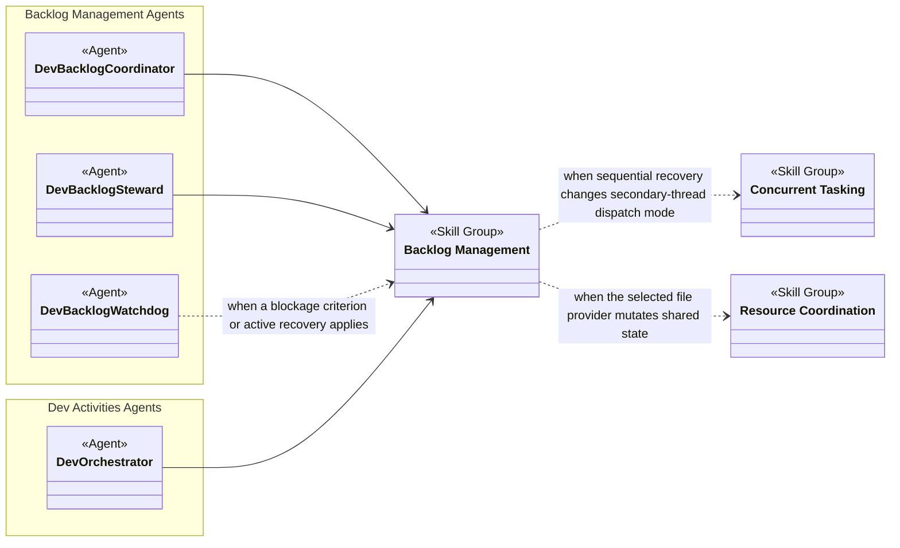
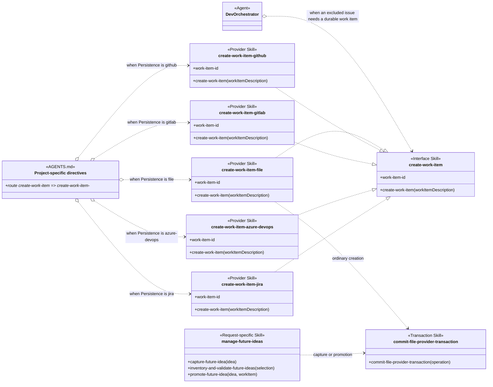
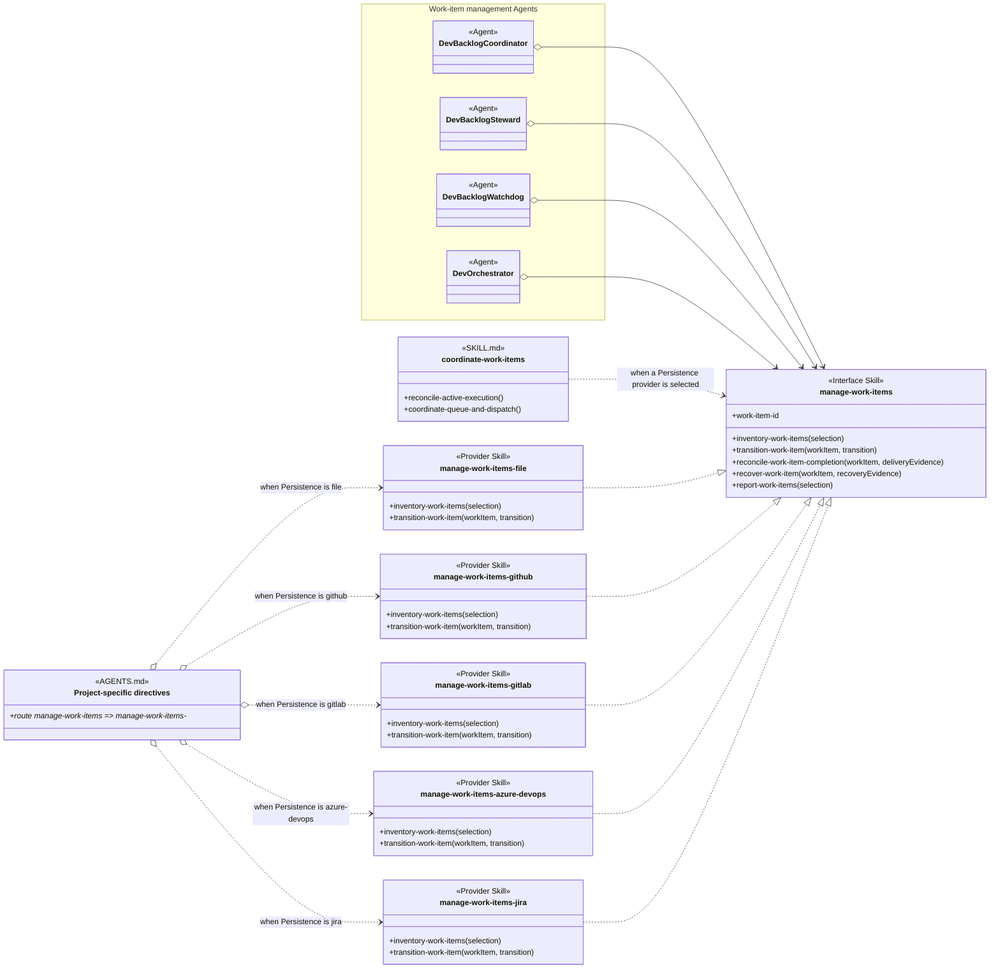
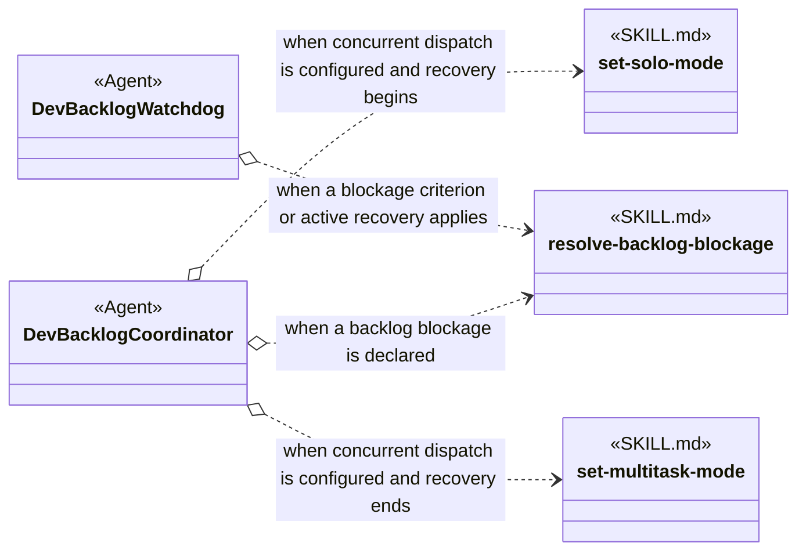
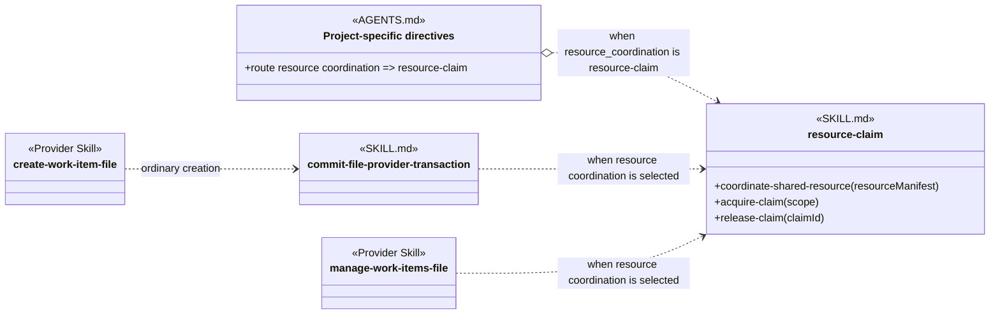

# Backlog Management Skill Group

## Scope

Backlog Management is independent of Resource Coordination and Commit delivery. AGENTS.md selects one creation skill and one management skill for the effective Persistence provider.

The applied-model conventions are defined in [Object-Oriented Skill Group Models](../object-oriented-skill-group-models.md#2-applied-model-legend).

## Design

Backlog Management owns work-item creation, provider lifecycle management, explicit file-backed
Future Ideas, shared file creation transactions, and blockage recovery. The peer skills keep
these responsibilities separate. The scenario views expand provider families, sequential
blockage recovery, and optional resource coordination.

### Overall Agent And Skill Group Dependencies

The overall view shows which Agents use Backlog Management and where backlog procedures conditionally use Concurrent Tasking or Resource Coordination. An arrow between Skill Groups means that at least one skill in the source group depends on a skill in the target group under the stated condition.

### Scenario: Creating A Work Item

This scenario applies when an Agent must create one durable work item. The create-work-item Interface Skill states the shared contract. The create-work-item-* family contains its providers, and AGENTS.md selects the provider that matches the project Persistence setting.

One effective project selects one creation provider. An explicit Future Ideas workflow selects
manage-future-ideas separately. Both file creation paths use commit-file-provider-transaction;
neither peer adds Future Ideas to the work-item lifecycle interface. The Azure DevOps and Jira
creation providers preserve the shared interface while returning their documented unsupported
result.

### Scenario: Managing Work-Item Lifecycle

This scenario applies when an Agent or coordination skill inventories or changes durable provider lifecycle. The manage-work-items Interface Skill gives all consumers one vocabulary, while AGENTS.md selects one manage-work-items-* implementation from Persistence.

manage-work-items names the provider-neutral management contract. Persistence selects one
manage-work-items-* provider. Each provider supplies the complete set of lifecycle procedures,
even when a provider reports that a requested operation is unsupported.

### Scenario: Recovering From A Backlog Blockage

This scenario applies after the user or Dev Backlog Watchdog declares a backlog blockage. Dev Backlog Coordinator temporarily changes secondary-thread dispatch mode only when concurrent dispatch is configured, then runs the provider-neutral sequential recovery procedure.

The Agent definition owns this sequence, so the three skills do not need direct references to one another. resolve-backlog-blockage remains usable when no secondary-thread dispatch mechanism is configured.

### Scenario: A File Provider Mutates Shared State

This scenario applies when the file-backed creation or management provider needs the project-selected resource-coordination policy before mutating shared backlog state. AGENTS.md loads resource-claim when the project selects it, and the provider skills depend on its procedures under that condition.

## Skill Responsibilities

Creation and management providers share public procedure names while retaining provider-specific identity, state, recovery, and mutation rules.

| Skill | Public procedures or identity | Responsibility |
| --- | --- | --- |
| resolve-backlog-blockage | Resolve Backlog Blockage | Resolves a declared blockage sequentially without owning dispatch-mode changes. |
| create-work-item | Work Item Identity; Inputs; Create Work Item; Result | Defines the provider-neutral creation contract consumed by Agents. |
| create-work-item-file | Create Work Item | Creates complete ordinary file-backed work items and delegates their exact commit. |
| manage-future-ideas | Capture Future Idea; Inventory And Validate Future Ideas; Promote Future Idea; Result | Owns explicit file-backed Future Ideas operations outside ordinary lifecycle management. |
| commit-file-provider-transaction | Commit File Provider Transaction | Owns the ordinary one-path and promotion two-path no-overwrite transaction. |
| create-work-item-github | Create Work Item | Creates and verifies one authoritative GitHub issue. |
| create-work-item-gitlab | Create Work Item | Creates and verifies one authoritative GitLab issue. |
| create-work-item-azure-devops | Create Work Item | Returns a truthful blocked result because Azure DevOps creation is not implemented. |
| create-work-item-jira | Create Work Item | Returns a truthful blocked result because Jira creation is not implemented. |
| manage-work-items | Work Item Identity; Lifecycle Definitions; Result Vocabulary; Inventory Work Items; Transition Work Item; Reconcile Work Item Completion; Recover Work Item; Report Work Items | Publishes the provider-neutral management contract consumed by lifecycle roles. |
| manage-work-items-file | Inventory Work Items; Transition Work Item; Reconcile Work Item Completion; Recover Work Item; Report Work Items | Manages the file-backed lifecycle, dependencies, recovery, completion, reporting, and archival. |
| manage-work-items-github | Inventory Work Items; Transition Work Item; Reconcile Work Item Completion; Recover Work Item; Report Work Items | Maps the shared management procedures to GitHub issue state and evidence. |
| manage-work-items-gitlab | Inventory Work Items; Transition Work Item; Reconcile Work Item Completion; Recover Work Item; Report Work Items | Maps the shared management procedures to GitLab issue state and evidence. |
| manage-work-items-azure-devops | Inventory Work Items; Transition Work Item; Reconcile Work Item Completion; Recover Work Item; Report Work Items | Exposes the shared management interface while returning a truthful unsupported result. |
| manage-work-items-jira | Inventory Work Items; Transition Work Item; Reconcile Work Item Completion; Recover Work Item; Report Work Items | Exposes the shared management interface while returning a truthful unsupported result. |

## Authoritative Inputs

The provider relationships and procedure boundaries are grounded in these Agent and skill definitions.

- [Dev Backlog Steward](../../agents/roles/dev-activities/dev-backlog-steward.role.yaml)
- [Dev Backlog Coordinator](../../agents/roles/dev-activities/dev-backlog-coordinator.role.yaml)
- [Dev Backlog Watchdog](../../agents/roles/dev-activities/dev-backlog-watchdog.role.yaml)
- [Dev Orchestrator](../../agents/roles/dev-activities/dev-orchestrator.role.yaml)
- [Resolve Backlog Blockage](../../skills/resolve-backlog-blockage/SKILL.md)
- [Set Solo Mode](../../skills/set-solo-mode/SKILL.md)
- [Set Multitask Mode](../../skills/set-multitask-mode/SKILL.md)
- [Create Work Item](../../skills/create-work-item/SKILL.md)
- [Create File Work Item](../../skills/create-work-item-file/SKILL.md)
- [Manage Future Ideas](../../skills/manage-future-ideas/SKILL.md)
- [Commit File Provider Transaction](../../skills/commit-file-provider-transaction/SKILL.md)
- [Create GitHub Work Item](../../skills/create-work-item-github/SKILL.md)
- [Create GitLab Work Item](../../skills/create-work-item-gitlab/SKILL.md)
- [Create Azure DevOps Work Item](../../skills/create-work-item-azure-devops/SKILL.md)
- [Create Jira Work Item](../../skills/create-work-item-jira/SKILL.md)
- [Manage Work Items](../../skills/manage-work-items/SKILL.md)
- [Manage File Work Items](../../skills/manage-work-items-file/SKILL.md)
- [Manage GitHub Work Items](../../skills/manage-work-items-github/SKILL.md)
- [Manage GitLab Work Items](../../skills/manage-work-items-gitlab/SKILL.md)
- [Manage Azure DevOps Work Items](../../skills/manage-work-items-azure-devops/SKILL.md)
- [Manage Jira Work Items](../../skills/manage-work-items-jira/SKILL.md)
- [Coordinate Work Items](../../skills/coordinate-work-items/SKILL.md)
- [Coordinate Codex Tasks](../../skills/coordinate-codex-tasks/SKILL.md)
- [Resource Claim](../../skills/resource-claim/SKILL.md)
