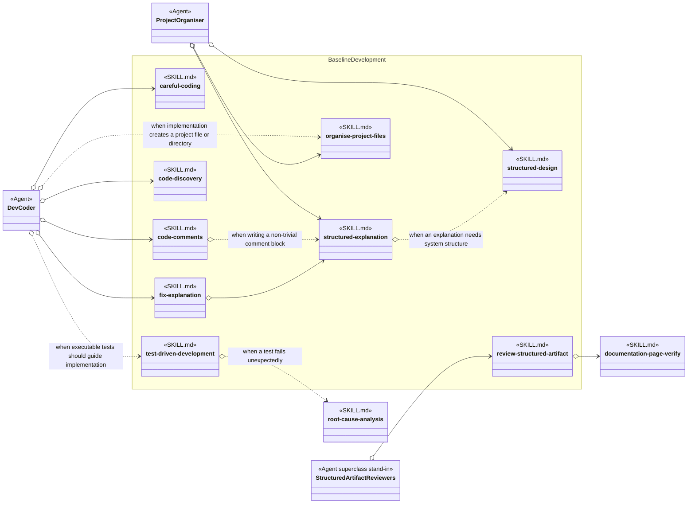
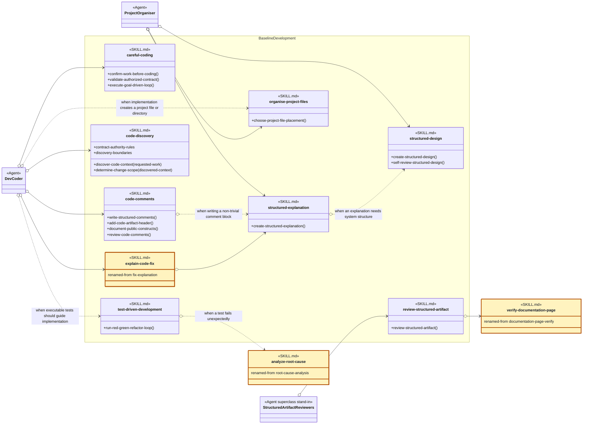

# Baseline Development Skill Group

## Scope

Baseline Development contains practices that current Agent definitions load by exact skill name across implementation, design, review, placement, and explanation work.

The applied-model legend and comparison contract are defined in [Object-Oriented Skill Group Models](../object-oriented-skill-group-models.md#2-applied-model-legend).

## Current Design

The Current Design shows the exact skill identities, group membership, and direct loading relationships used by the current Agent and skill definitions.

The empty skill nodes are deliberate. The Agent definitions load these skills as whole packages rather than invoking a shared AGENTS.md procedure. Structured Artifact Reviewers stands in for the current reviewer, verifier, prompt-reviewer, and merge-coordinator definitions that name review-structured-artifact.

The skill-to-skill open diamonds expose direct coupling between skills. For example, fix-explanation names structured-explanation directly, while structured-explanation names structured-design only when system structure must be described.

## Proposed Design

The Proposed Design keeps the nine Baseline Development responsibilities together, renames fix-explanation, and exposes clearer procedures inside the multi-operation skills.

The proposed diagram applies the recommendations below. Gold SKILL.md nodes have a proposed name change, and renamed-from records the current name. Neutral SKILL.md nodes keep their current names; their method-like members show proposed procedure headings.

## Skill Recommendations

These skills are primarily exact-name Agent Skills. They do not need to become injectable merely for consistency. The recommendations make operation boundaries clearer where another Agent or skill may need to refer to one part of the package.

| Skill | Current source boundary | Recommendation | Reason |
| --- | --- | --- | --- |
| careful-coding | Think Before Coding, Preserve Authorized Contracts, and Goal-Driven Execution contain actions; Simplicity First and Surgical Changes are guidance. | Keep the skill name. Rename the action headings to Confirm Work Before Coding, Validate Authorized Contract, and Execute Goal-Driven Loop. | The new headings distinguish callable procedures from guidance without pretending that careful-coding itself is one procedure. |
| code-comments | Structured Comment Writing, Mandatory Code Artifact Header, Public Construct Documentation, Change Workflow, and Review Evidence mix actions and reference rules. | Keep the skill name. Use Write Structured Comments, Add Code Artifact Header, Document Public Constructs, and Review Code Comments as operation headings. | The package owns several related procedures, so named operations are clearer than treating code-comments as one call. |
| code-discovery | Workflow steps 1 through 5 discover code context. Workflow step 6 records the evidence and resulting scope decision. Contract Authority and Boundaries constrain both operations. | Keep the skill name. Introduce Discover Code Context and Determine Change Scope as operation headings; retain Contract Authority and Boundaries as reference sections. | Discovery gathers repository evidence, while scope determination interprets that evidence into the smallest justified implementation or review boundary. The two related procedures belong in one package but should not be collapsed into one scope-only name. |
| test-driven-development | Workflow contains the red-green-refactor procedure; Boundaries constrains it. | Keep the established skill name. Rename Workflow to Run Red-Green-Refactor Loop. | The practice name remains recognizable, while the heading gives callers a specific procedure name. |
| structured-design | Output And Artifact Modes, the design rules, Pass Sequence, and Self-Review together define authoring and checking behavior. | Keep the skill name. Introduce Create Structured Design and Self-Review Structured Design as the two operation headings. | The remaining sections can stay reference material that those two procedures consult. |
| structured-explanation | Core Model through Formatting defines one explanation procedure, while the other sections constrain it. | Keep the skill name. Introduce Create Structured Explanation as the operation heading. | A named entry procedure lets Peer Skills request an explanation without treating every reference section as a separate operation. |
| organise-project-files | Placement Workflow performs the skill’s main operation. | Keep the skill name. Rename Placement Workflow to Choose Project File Placement. | The current skill name already names an operation; the new heading gives that operation a clear invocation boundary. |
| review-structured-artifact | Workflow performs the review; checklist discipline and review priorities constrain it. | Keep the skill name. Rename Workflow to Review Structured Artifact. | The heading then matches the operation already named by the skill and by its Agent callers. |
| fix-explanation | Workflow and Required Output explain a code fix; the remaining sections supply classification and relationship rules. | Rename the skill to explain-code-fix. | The proposed name removes the noun-or-verb ambiguity in fix-explanation and states the operation the package performs. |

## Authoritative Inputs

The current relationships and proposed procedure boundaries are grounded in these Agent and skill definitions.

- [Dev Coder](../../agents/roles/dev-activities/dev-coder.role.yaml)
- [Project Organiser](../../agents/roles/project-setup/project-organiser.role.yaml)
- [Dev Artifact Reviewer](../../agents/roles/dev-activities/dev-artifact-reviewer.role.yaml)
- [Dev Code Reviewer](../../agents/roles/dev-activities/dev-code-reviewer.role.yaml)
- [Dev Verifier](../../agents/roles/dev-activities/dev-verifier.role.yaml)
- [Dev Prompt Reviewer](../../agents/roles/dev-activities/dev-prompt-reviewer.role.yaml)
- [Dev Merge Coordinator](../../agents/roles/dev-activities/dev-merge-coordinator.role.yaml)
- [Careful Coding](../../skills/careful-coding/SKILL.md)
- [Code Comments](../../skills/code-comments/SKILL.md)
- [Code Discovery](../../skills/code-discovery/SKILL.md)
- [Test-Driven Development](../../skills/test-driven-development/SKILL.md)
- [Structured Design](../../skills/structured-design/SKILL.md)
- [Structured Explanation](../../skills/structured-explanation/SKILL.md)
- [Organise Project Files](../../skills/organise-project-files/SKILL.md)
- [Review Structured Artifact](../../skills/review-structured-artifact/SKILL.md)
- [Fix Explanation](../../skills/fix-explanation/SKILL.md)
- [Documentation Page Verify](../../skills/documentation-page-verify/SKILL.md)
- [Root-Cause Analysis](../../skills/root-cause-analysis/SKILL.md)
