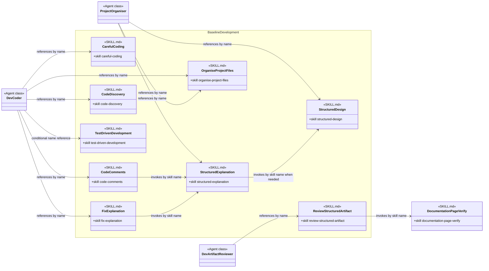

# Baseline Development Skill Group

## Scope

Baseline Development contains practices that Agents reference by exact skill name across ordinary implementation, design, review, and explanation work.

The shared notation and cross-group markers are defined in [Object-Oriented Skill Group Models](../object-oriented-skill-group-models.md).

## Current Design

Dev Coder names careful-coding for every execution and test-driven-development under a condition. code-comments and fix-explanation directly invoke structured-explanation as a Peer Skill.

The cross-group documentation-page-verify node makes the current verification dependency visible without moving that skill out of Project Setup.

## Authoritative Inputs

- [Dev Coder](../../agents/roles/dev-activities/dev-coder.role.yaml)
- [Project Organiser](../../agents/roles/project-setup/project-organiser.role.yaml)
- [Careful Coding](../../skills/careful-coding/SKILL.md)
- [Code Comments](../../skills/code-comments/SKILL.md)
- [Code Discovery](../../skills/code-discovery/SKILL.md)
- [Test-Driven Development](../../skills/test-driven-development/SKILL.md)
- [Structured Design](../../skills/structured-design/SKILL.md)
- [Structured Explanation](../../skills/structured-explanation/SKILL.md)
- [Organise Project Files](../../skills/organise-project-files/SKILL.md)
- [Review Structured Artifact](../../skills/review-structured-artifact/SKILL.md)
- [Fix Explanation](../../skills/fix-explanation/SKILL.md)
- [Documentation Page Verify](../../skills/documentation-page-verify/SKILL.md)
