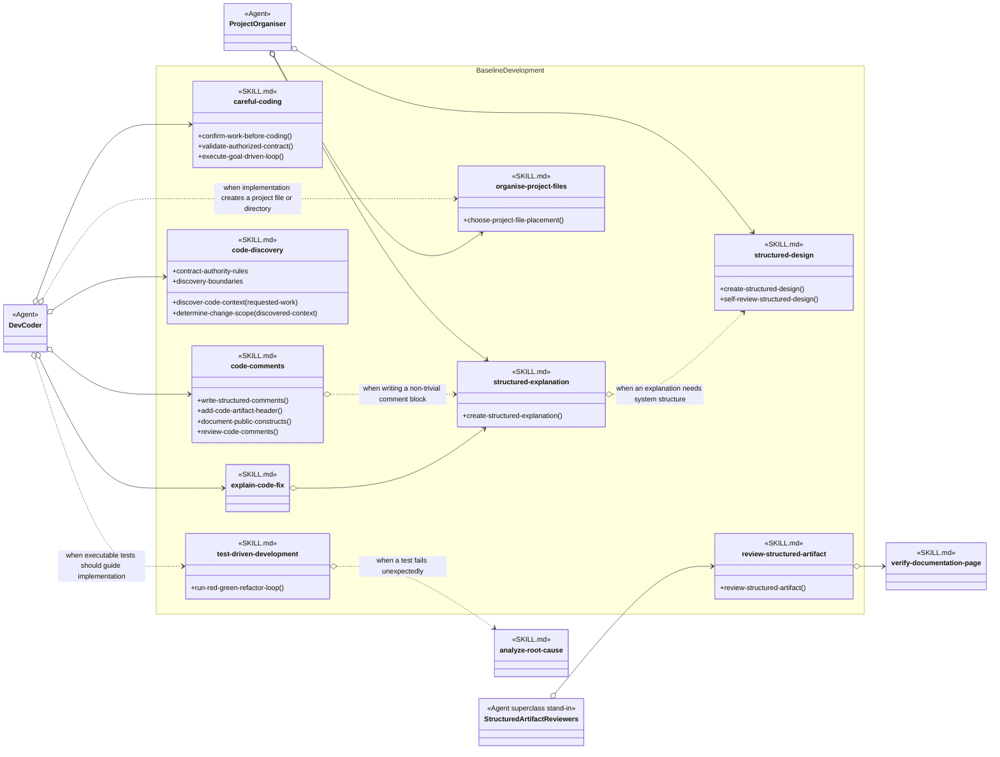

# Baseline Development Skill Group

## Scope

Baseline Development contains practices that Agent definitions load by exact skill name across implementation, design, review, placement, and explanation work.

The applied-model conventions are defined in [Object-Oriented Skill Group Models](../object-oriented-skill-group-models.md#2-applied-model-legend).

## Design

The design keeps nine baseline responsibilities together. Multi-operation skills expose the procedure headings that Agents or other skills can reference, while single-operation skills use their skill identity as the operation.

## Skill Responsibilities

The group combines exact-name Agent Skills with explicit procedure boundaries for skills that contain several related operations.

| Skill | Public procedures or identity | Responsibility |
| --- | --- | --- |
| careful-coding | Confirm Work Before Coding; Validate Authorized Contract; Execute Goal-Driven Loop | Keeps implementation assumptions, contracts, scope, and verification explicit. |
| code-comments | Write Structured Comments; Add Code Artifact Header; Document Public Constructs; Review Code Comments | Creates and reviews code comments, required headers, and public API documentation. |
| code-discovery | Discover Code Context; Determine Change Scope | Gathers repository evidence and turns it into the smallest justified change or review boundary. Contract Authority and Boundaries remain shared data for both procedures. |
| test-driven-development | Run Red-Green-Refactor Loop | Guides implementation through executable failing and passing behavior. |
| structured-design | Create Structured Design; Self-Review Structured Design | Creates structured design artifacts and checks them against the same design contract. |
| structured-explanation | Create Structured Explanation | Organizes technical reasoning into evidence-backed explanations. |
| organise-project-files | Choose Project File Placement | Chooses and audits repository destinations from project guidance and taxonomy. |
| review-structured-artifact | Review Structured Artifact | Reviews structured artifacts through checklist-backed evidence and findings. |
| explain-code-fix | Explain Code Fix | Explains a completed code change and classifies the nature of the fix. |

## Authoritative Inputs

The relationships and procedure boundaries are grounded in these Agent and skill definitions.

- [Dev Coder](../../agents/roles/dev-activities/dev-coder.role.yaml)
- [Project Organiser](../../agents/roles/project-setup/project-organiser.role.yaml)
- [Dev Artifact Reviewer](../../agents/roles/dev-activities/dev-artifact-reviewer.role.yaml)
- [Dev Code Reviewer](../../agents/roles/dev-activities/dev-code-reviewer.role.yaml)
- [Dev Verifier](../../agents/roles/dev-activities/dev-verifier.role.yaml)
- [Dev Prompt Reviewer](../../agents/roles/dev-activities/dev-prompt-reviewer.role.yaml)
- [Dev Merge Coordinator](../../agents/roles/dev-activities/dev-merge-coordinator.role.yaml)
- [Careful Coding](../../skills/careful-coding/SKILL.md)
- [Code Comments](../../skills/code-comments/SKILL.md)
- [Code Discovery](../../skills/code-discovery/SKILL.md)
- [Test-Driven Development](../../skills/test-driven-development/SKILL.md)
- [Structured Design](../../skills/structured-design/SKILL.md)
- [Structured Explanation](../../skills/structured-explanation/SKILL.md)
- [Organise Project Files](../../skills/organise-project-files/SKILL.md)
- [Review Structured Artifact](../../skills/review-structured-artifact/SKILL.md)
- [Explain Code Fix](../../skills/explain-code-fix/SKILL.md)
- [Verify Documentation Page](../../skills/verify-documentation-page/SKILL.md)
- [Analyze Root Cause](../../skills/analyze-root-cause/SKILL.md)
