# Concurrent Tasking Skill Group

## Scope

Concurrent Tasking encloses Resource Coordination and Feature Branch And Worktrees. codex-workitem-coordination coordinates the enclosing workflow while Persistence remains an independent injected provider.

The reusable notation and applied-model legend are defined in [Object-Oriented Analysis Of Agents And Skills](../object-oriented-agent-and-skill-model.md#14-applied-methodology-skill-groups).

## Current Design

```mermaid
classDiagram
    direction TB

    class DevBacklogCoordinator {
        <<Agent>>
    }

    class DevOrchestrator {
        <<Agent>>
    }

    class DevMergeCoordinator {
        <<Agent>>
    }

    class ConcurrentTasking {
        <<Skill group>>
    }

    class ResourceCoordination {
        <<Skill subgroup>>
    }

    class FeatureBranchAndWorktrees {
        <<Skill subgroup>>
    }

    namespace ConcurrentTaskingSkills {
        class codex-workitem-coordination {
            <<SKILL.md>>
            <<Agent Skill>>
            <<Peer Skill>>
            +resource-coordination()
            +queue-target-and-dispatch()
            +effective-commit-delivery-and-persistence-closure()
        }

        class agent-claim {
            <<SKILL.md>>
            <<Injectable Skill>>
            +claim-events()
            +timed-resource-claims()
            +release-cleanup()
        }

        class agent-claim-command {
            <<SKILL.md>>
            <<Injectable Skill>>
            +command-contract()
            +uncertain-command-outcome()
        }

        class agent-claim-mcp {
            <<SKILL.md>>
            <<Injectable Skill>>
            <<Unavailable implementation>>
            +mcp-operations()
            +uncertain-tool-outcome()
        }

        class agent-work-merge {
            <<SKILL.md>>
            <<Agent Skill>>
            <<Peer Skill>>
            +merge-workflow()
            +verification()
        }

        class complete-work-item-feature-branch {
            <<SKILL.md>>
            <<Injectable Skill>>
            <<Peer Skill>>
            +candidate-publication()
            +review-and-check-loop()
            +merge-and-completion-gate()
        }

        class create-pull-request {
            <<SKILL.md>>
            <<Peer Skill>>
            +workflow()
            +review-order()
        }
    }

    class ManageWorkItem["manage-*-work-items"] {
        <<AGENTS.md>>
        <<Cross-group>>
        +inventory-work-items(selection)
        +transition-work-item(workItem, transition)
        +reconcile-work-item-completion(workItem, deliveryEvidence)
    }

    class ResourceCoordinationBinding["resource-coordination"] {
        <<AGENTS.md>>
        +coordinate-shared-resource(resourceManifest)
    }

    class ClaimHelper["agent-claim-*"] {
        <<AGENTS.md>>
        +read-claim-status()
        +acquire-claim(scope)
        +extend-claim(scope)
        +release-claim()
    }

    class DeliverWorkItem["complete-work-item-*"] {
        <<AGENTS.md>>
        +deliver-work-item(acceptedCommit)
    }

    ConcurrentTasking *-- codex-workitem-coordination
    ConcurrentTasking *-- ResourceCoordination
    ConcurrentTasking *-- FeatureBranchAndWorktrees
    ResourceCoordination *-- agent-claim
    ResourceCoordination *-- agent-claim-command
    ResourceCoordination *-- agent-claim-mcp
    FeatureBranchAndWorktrees *-- agent-work-merge
    FeatureBranchAndWorktrees *-- complete-work-item-feature-branch
    FeatureBranchAndWorktrees *-- create-pull-request

    DevBacklogCoordinator o..> codex-workitem-coordination : when Codex tasks coordinate multiple work items
    DevOrchestrator o..> codex-workitem-coordination : when the task is a coordinated Codex work-item conversation
    DevOrchestrator --> DeliverWorkItem
    DevMergeCoordinator o--> agent-work-merge

    codex-workitem-coordination --> ManageWorkItem
    codex-workitem-coordination --> ResourceCoordinationBinding
    codex-workitem-coordination --> DeliverWorkItem
    codex-workitem-coordination o..> agent-claim : when agent-claim is loaded
    ResourceCoordinationBinding o--> agent-claim
    ResourceCoordinationBinding --> ClaimHelper
    ClaimHelper o--> agent-claim-command
    ClaimHelper o--> agent-claim-mcp
    DeliverWorkItem o--> complete-work-item-feature-branch

    agent-work-merge o--> agent-claim
    complete-work-item-feature-branch o--> agent-claim
    complete-work-item-feature-branch o..> create-pull-request : for GitHub pull-request publication
```

The solid-diamond lines express only containment. Concurrent Tasking contains the coordinating skill and both required subgroups; Resource Coordination and Feature Branch And Worktrees contain their current skills.

The regular arrows expose procedure-name dependencies. codex-workitem-coordination asks for provider management, resource coordination, and delivery through project-selected procedures. AGENTS.md makes those selections by exact skill name and separately selects the claim-helper transport.

The current coordination skill also says “when agent-claim is loaded,” so it is only partly decoupled from the selected Resource Coordination implementation. agent-work-merge and complete-work-item-feature-branch name agent-claim directly, and the feature-branch skill names create-pull-request for GitHub publication. The command helper is the supported current selection; agent-claim-mcp documents an unavailable implementation because it lacks verified deadline parity.

## Proposed Design

The proposed diagram applies the recommendations below. Gold SKILL.md nodes have a proposed name change, and renamed-from records the current name. Blue SKILL.md nodes are proposed extractions, and extracted-from records their current source. Neutral SKILL.md nodes keep their current names; their method-like members show proposed procedure headings.

```mermaid
classDiagram
    direction TB

    class DevBacklogCoordinator {
        <<Agent>>
    }

    class DevOrchestrator {
        <<Agent>>
    }

    class DevMergeCoordinator {
        <<Agent>>
    }

    class ConcurrentTasking {
        <<Skill group>>
    }

    class ResourceCoordination {
        <<Skill subgroup>>
    }

    class FeatureBranchAndWorktrees {
        <<Skill subgroup>>
    }

    namespace ConcurrentTaskingSkills {
        class coordinate-codex-work-items:::renamed {
            <<SKILL.md>>
            <<Agent Skill>>
            <<Peer Skill>>
            renamed-from codex-workitem-coordination
            +resource-coordination()
            +queue-target-and-dispatch()
            +effective-commit-delivery-and-persistence-closure()
        }

        class agent-claim {
            <<SKILL.md>>
            <<Injectable Skill>>
            +coordinate-shared-resource()
            +acquire-claim()
            +extend-claim()
            +extend-claim-deadline()
            +heartbeat-claim()
            +read-claim-status()
            +release-claim()
        }

        class agent-claim-command {
            <<SKILL.md>>
            <<Injectable Skill>>
            +read-claim-status()
            +acquire-claim()
            +extend-claim()
            +extend-claim-deadline()
            +heartbeat-claim()
            +release-claim()
            +maintain-claim-journal()
            +report-claim-contention()
        }

        class agent-claim-mcp {
            <<SKILL.md>>
            <<Injectable Skill>>
            <<Unavailable implementation>>
            +read-claim-status()
            +acquire-claim()
            +extend-claim()
            +extend-claim-deadline()
            +heartbeat-claim()
            +release-claim()
            +maintain-claim-journal()
            +report-claim-contention()
        }

        class integrate-agent-work:::renamed {
            <<SKILL.md>>
            <<Agent Skill>>
            <<Peer Skill>>
            renamed-from agent-work-merge
            +merge-workflow()
            +verification()
        }

        class deliver-work-item-feature-branch:::renamed {
            <<SKILL.md>>
            <<Injectable Skill>>
            <<Peer Skill>>
            renamed-from complete-work-item-feature-branch
            +deliver-work-item()
            +candidate-publication()
            +review-and-check-loop()
            +merge-and-completion-gate()
        }

        class create-pull-request {
            <<SKILL.md>>
            <<Peer Skill>>
            +create-or-update-pull-request()
            +review-order()
        }

        class set-solo-mode:::extracted {
            <<SKILL.md>>
            <<Agent Skill>>
            <<Peer Skill>>
            extracted-from backlog-crisis-mode
        }

        class set-multitask-mode:::extracted {
            <<SKILL.md>>
            <<Agent Skill>>
            <<Peer Skill>>
            extracted-from backlog-crisis-mode
        }
    }

    class ManageWorkItem["manage-*-work-items"] {
        <<AGENTS.md>>
        <<Cross-group>>
        +inventory-work-items(selection)
        +transition-work-item(workItem, transition)
        +reconcile-work-item-completion(workItem, deliveryEvidence)
    }

    class ResourceCoordinationBinding["resource-coordination"] {
        <<AGENTS.md>>
        +coordinate-shared-resource(resourceManifest)
    }

    class ClaimHelper["agent-claim-*"] {
        <<AGENTS.md>>
        +read-claim-status()
        +acquire-claim(scope)
        +extend-claim(scope)
        +release-claim()
    }

    class DeliverWorkItem["deliver-work-item-*"] {
        <<AGENTS.md>>
        +deliver-work-item(acceptedCommit)
    }

    ConcurrentTasking *-- coordinate-codex-work-items
    ConcurrentTasking *-- set-solo-mode
    ConcurrentTasking *-- set-multitask-mode
    ConcurrentTasking *-- ResourceCoordination
    ConcurrentTasking *-- FeatureBranchAndWorktrees
    ResourceCoordination *-- agent-claim
    ResourceCoordination *-- agent-claim-command
    ResourceCoordination *-- agent-claim-mcp
    FeatureBranchAndWorktrees *-- integrate-agent-work
    FeatureBranchAndWorktrees *-- deliver-work-item-feature-branch
    FeatureBranchAndWorktrees *-- create-pull-request

    DevBacklogCoordinator o..> coordinate-codex-work-items : when Codex tasks coordinate multiple work items
    DevBacklogCoordinator o..> set-solo-mode : when work must continue without dispatch to secondary threads
    DevBacklogCoordinator o..> set-multitask-mode : when dispatch to secondary threads may resume
    DevOrchestrator o..> coordinate-codex-work-items : when the task is a coordinated Codex work-item conversation
    DevOrchestrator --> DeliverWorkItem
    DevMergeCoordinator o--> integrate-agent-work

    coordinate-codex-work-items --> ManageWorkItem
    coordinate-codex-work-items --> ResourceCoordinationBinding
    coordinate-codex-work-items --> DeliverWorkItem
    coordinate-codex-work-items o..> agent-claim : when agent-claim is loaded
    ResourceCoordinationBinding o--> agent-claim
    ResourceCoordinationBinding --> ClaimHelper
    ClaimHelper o--> agent-claim-command
    ClaimHelper o--> agent-claim-mcp
    DeliverWorkItem o--> deliver-work-item-feature-branch

    integrate-agent-work o--> agent-claim
    deliver-work-item-feature-branch o--> agent-claim
    deliver-work-item-feature-branch o..> create-pull-request : for GitHub pull-request publication

    classDef renamed fill:#fff3bf,stroke:#b45309,stroke-width:3px,color:#111827
    classDef extracted fill:#dbeafe,stroke:#1d4ed8,stroke-width:3px,color:#111827
```

The two blue nodes extract dispatch-mode changes from backlog-crisis-mode. set-solo-mode disables dispatch to secondary threads, while set-multitask-mode enables it. They belong to Concurrent Tasking because they control whether work is dispatched concurrently rather than how a backlog blockage is resolved.

Dev Backlog Coordinator loads each skill by name for the matching transition. No direct arrow joins the two skills because the Agent definition owns their order and conditions.

## Proposed Skill Extractions

| Proposed skill | Extracted source boundary | Responsibility | Reason |
| --- | --- | --- | --- |
| set-solo-mode | Execution step 1 stops ordinary dispatch. | Disable dispatch to secondary threads while the current Agent continues the work itself. | The procedure is useful whenever work must temporarily become sequential, not only during backlog blockage recovery. |
| set-multitask-mode | Exit resumes normal dispatch. | Enable dispatch to secondary threads after the condition requiring sequential work has ended. | The complementary procedure makes resumption explicit and keeps dispatch policy out of the backlog-resolution skill. |

## Skill Recommendations

| Skill | Current source boundary | Recommendation | Reason |
| --- | --- | --- | --- |
| codex-workitem-coordination | Resource Coordination, Queue Target And Dispatch, and Effective Commit Delivery And Persistence Closure coordinate several procedures. | Rename the skill to coordinate-codex-work-items. | The verb-first name states the operation and separates it from a category named coordination. |
| agent-claim | Claim Events is a dispatch table; Claim Scope, Claim Conflicts, Timed Resource Claims, and Release Cleanup define related claim operations and rules. | Keep the skill name. Introduce Coordinate Shared Resource, Acquire Claim, Extend Claim, Extend Claim Deadline, Heartbeat Claim, Read Claim Status, and Release Claim as operation headings. | The headings give callers stable procedure names while Claim Events and the boundary rules remain reference information. |
| agent-claim-command | Command Contract and Command Arguments expose all command operations in one generic section. | Keep the skill name. Add Read Claim Status, Acquire Claim, Extend Claim, Extend Claim Deadline, Heartbeat Claim, Release Claim, Maintain Claim Journal, and Report Claim Contention headings. | These headings can match the MCP implementation exactly while command syntax remains provider-specific detail. |
| agent-claim-mcp | MCP Operations lists the same core operations under one table. | Keep the skill name. Add Read Claim Status, Acquire Claim, Extend Claim, Extend Claim Deadline, Heartbeat Claim, Release Claim, Maintain Claim Journal, and Report Claim Contention headings. | Matching helper headings create one transport-neutral helper interface and make missing MCP capabilities explicit. |
| agent-work-merge | Merge Workflow also supports selected commits, accepted file content, replay, and current-main reconciliation. | Rename the skill to integrate-agent-work. | Integration describes the complete responsibility more accurately than merge and remains appropriate for feature-branch and worktree composition. |
| complete-work-item-feature-branch | Candidate Publication, Review And Check Loop, and Merge And Completion Gate implement Commit delivery but do not mutate Persistence. | Rename the skill to deliver-work-item-feature-branch and introduce Deliver Work Item as its interface heading. | Complete can be confused with provider lifecycle completion. Deliver matches the caller’s procedure while the internal headings preserve feature-branch behavior. |
| create-pull-request | Workflow performs create or update behavior; Review Order and Draft And Ready State constrain it. | Keep the skill name. Rename Workflow to Create Or Update Pull Request. | The new heading identifies the procedure that complete-work-item-feature-branch invokes and covers both new and resumed publication. |

## Authoritative Inputs

- [Dev Backlog Coordinator](../../agents/roles/dev-activities/dev-backlog-coordinator.role.yaml)
- [Dev Orchestrator](../../agents/roles/dev-activities/dev-orchestrator.role.yaml)
- [Dev Merge Coordinator](../../agents/roles/dev-activities/dev-merge-coordinator.role.yaml)
- [Codex Work-Item Coordination](../../skills/codex-workitem-coordination/SKILL.md)
- [Agent Claim](../../skills/agent-claim/SKILL.md)
- [Agent Claim Command](../../skills/agent-claim-command/SKILL.md)
- [Agent Claim MCP](../../skills/agent-claim-mcp/SKILL.md)
- [Agent Work Merge](../../skills/agent-work-merge/SKILL.md)
- [Complete Work Item Feature Branch](../../skills/complete-work-item-feature-branch/SKILL.md)
- [Create Pull Request](../../skills/create-pull-request/SKILL.md)
- [Manage File Work Items](../../skills/manage-file-work-items/SKILL.md)
- [Manage GitHub Work Items](../../skills/manage-github-work-items/SKILL.md)
- [Manage GitLab Work Items](../../skills/manage-gitlab-work-items/SKILL.md)
