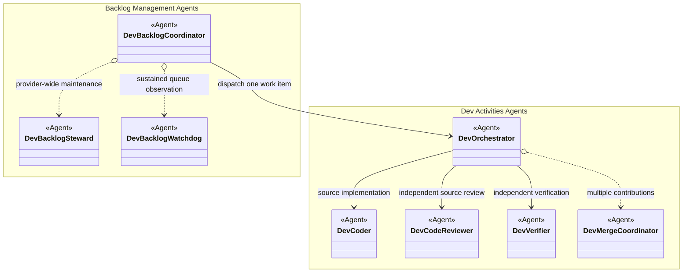
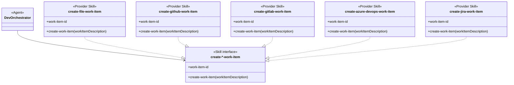
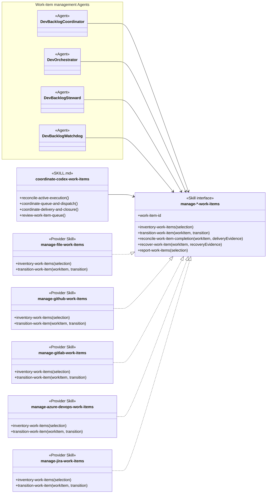
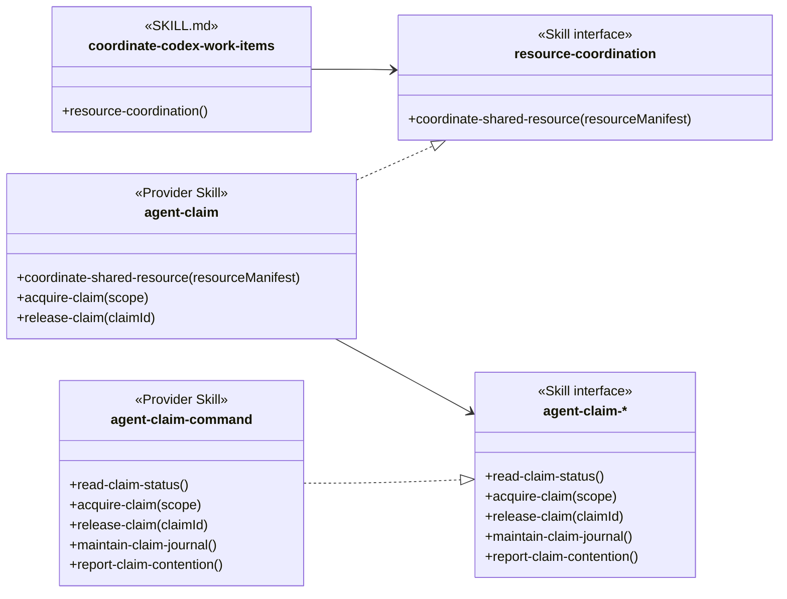
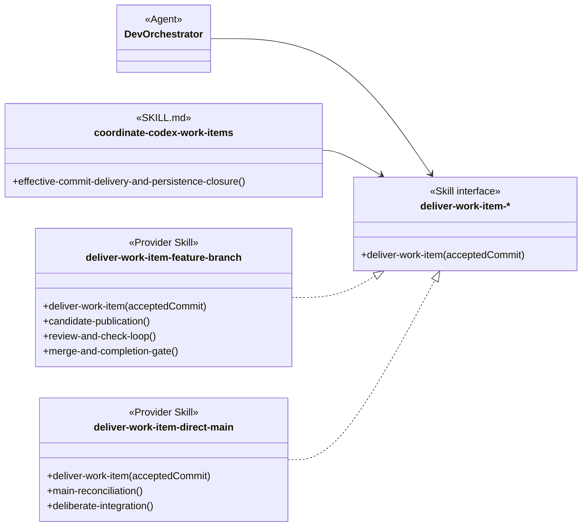
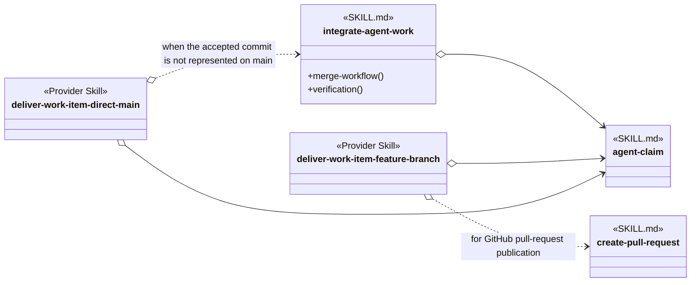

# Concurrent Tasking Skill Group

## Scope

Concurrent Tasking directly contains work-item coordination and the two dispatch-mode skills. It also nests the Resource Coordination and Feature Branch And Worktrees skill groups. Its complete set therefore includes those three direct skills plus every skill in the two nested groups. Containment is for comprehension and does not mean that a direct skill uses every nested skill. Persistence remains an independent injected provider.

The applied-model conventions are defined in [Object-Oriented Skill Group Models](../object-oriented-skill-group-models.md#2-applied-model-legend).

## Design

The design uses several focused views because containment, Agent Skills, interface dispatch, provider realization, and exact-name dependencies answer different questions. Every interface view keeps the interface, its consumers, and its Provider Skill implementations together.

These diagrams use the [simplified provider view](../object-oriented-agent-and-skill-model.md#simplified-view). The harness loads the project's single AGENTS.md automatically, so an Agent does not reference AGENTS.md and no Agent-to-AGENTS.md line is drawn. Unless a diagram explicitly shows another routing mechanism, AGENTS.md selects one Provider Skill for each project-selected interface.

### Agent Groups And Agent Dependencies

The Agent view shows which role files coordinate concurrent work and which other Agent roles they require. The namespace boxes use the presentation groups defined by role-catalog-groups.yaml; they do not imply inheritance or runtime containment.

A solid Agent-to-Agent arrow is a fixed role dependency when that responsibility is required. A dotted arrow is conditional delegation. The direction runs from the Agent whose definition names or dispatches the dependency to the referenced Agent role.

The reusable object-oriented analysis currently defines Skill Groups but not Agent Groups or Agent-to-Agent dependency arrows. This page uses the existing role-catalog grouping as source-backed analysis vocabulary. The reusable guide must later incorporate that missing concept and notation.

### Core And Optional Agent Skills

Core Agent Skills are exact skill files selected for every invocation of an Agent role. Optional Agent Skills are also referenced by exact name, but the Agent loads them only when their recorded condition applies. The role schema adds effective-communication and ste-technical-writing as universal core skills for every conceptual Agent; the table then lists each role's additional definition-owned skills.

| Agent scope | Additional Core Agent Skills | Optional Agent Skills and conditions |
| --- | --- | --- |
| Every conceptual Agent | effective-communication; ste-technical-writing | None |
| Dev Backlog Coordinator | structured-explanation | coordinate-codex-work-items when Codex tasks coordinate multiple work items; resolve-backlog-blockage during a declared blockage; set-solo-mode when configured secondary dispatch must stop; set-multitask-mode when configured secondary dispatch may resume |
| Dev Orchestrator | structured-design; structured-explanation | coordinate-codex-work-items for a coordinated Codex work-item conversation; organise-project-files when orchestration creates a new project file or directory |
| Dev Merge Coordinator | integrate-agent-work; review-structured-artifact; explain-code-fix | organise-project-files when integration creates or introduces a new project file or directory |
| Dev Backlog Steward | structured-explanation | coordinate-codex-work-items when provider-wide maintenance touches coordinated state; organise-project-files when recovery creates a path whose destination is not fixed |
| Dev Backlog Watchdog | coordinate-codex-work-items | resolve-backlog-blockage when a blockage criterion or active recovery applies |

These are file dependencies declared by the Agent definitions or added universally by their schema. They are distinct from provider interfaces: an Agent can require a stable procedure contract while AGENTS.md selects the provider skill that implements it.

### Interface Skill Boundary

An Interface Skill is intended to be a real SKILL.md file containing the data and procedures that its consumers depend on and its providers implement. When that file is essential to an Agent, it belongs among the Agent's Core Agent Skills even though AGENTS.md selects the provider implementation separately.

The current provider-family nodes below are still abstract analysis contracts. There is no maintained manage-*-work-items, create-*-work-item, resource-coordination, agent-claim-*, or deliver-work-item-* Interface Skill package in the current inventory. This prevents the Agent definitions from naming those contracts as core or optional skill files and is a design gap exposed by this analysis. The diagrams retain the Skill interface stereotype until a real Interface Skill file owns each contract.

After an Interface Skill file exists, an Agent or skill that requires its contract loads that file by exact name as a Core or Optional Agent Skill. AGENTS.md independently selects the Provider Skill implementation. The consumer-to-interface relationship then becomes an exact-name loading reference, while provider realization continues to show implementation of the interface contract.

### Work-Item Creation Interface

The creation view keeps the Dev Orchestrator consumer, the stable creation contract, and every Persistence-provider implementation together. The Orchestrator uses this route when a confirmed issue is deliberately excluded from the current delivery and needs its own durable work item.

The Azure DevOps and Jira creation skills are truthful placeholder implementations: they satisfy the interface by returning their documented unsupported result rather than silently falling back to another provider.

### Work-Item Management Interface

Work-item management is the capability modeled here. Persistence is the project-configuration selector that chooses where durable work items are stored and therefore which management provider AGENTS.md dispatches; it is not the name of the interface. The public interface remains manage-*-work-items because its providers inventory, transition, reconcile, recover, and report work items rather than merely storing them.

The management view keeps the Agent and skill consumers, the complete management contract, and every work-item-provider implementation in one place. The Work-item management Agents rectangle groups the four Agent roles that use the selected manager; it does not introduce a superclass or another Agent. The providers belong to Backlog Management and are repeated here because concurrent coordination depends on their shared contract.

The coordinate-codex-work-items member list is a relevant view of the current skill, not a claim that closeout is its only operation. The displayed procedures derive from Active Execution, Capacity, And Conversation Titles; Queue Target And Dispatch; Effective Commit Delivery And Persistence Closure; and Fifteen-Minute Parent Review. Together they show why the coordination skill consumes the management interface throughout the work-item lifecycle.

The Codex qualifier is also substantive. The skill defines Codex task creation and reconciliation, conversation identity and titles, runtime capacity, watchdog operation, dispatch, delivery, and closure. It currently combines those runtime-specific procedures with provider-neutral work-item coordination rules. No coordinate-*-work-items Interface Skill or alternative runtime Provider Skill exists, so Agents load coordinate-codex-work-items directly today. A future provider split would need a real coordination Interface Skill before AGENTS.md could dispatch this dependency polymorphically; this diagram does not present that missing boundary as current behavior.

### Resource Coordination And Claim Helper Interfaces

The resource view keeps each interface beside its consumer and its current implementation. The first interface connects work-item coordination to claim policy. The second connects that policy to the selected helper transport.

agent-claim-mcp remains a Resource Coordination group member because it defines the required MCP result contract and provider-verification boundary. It does not appear as a Claim Helper Provider Skill because no verified MCP implementation currently realizes that interface.

### Commit Delivery Interface

The Commit view keeps both consumers, the shared delivery interface, and its direct-main and feature-branch Provider Skill implementations together. The direct-main provider is repeated from its own group so the complete provider family remains visible.

### Exact Skill-Name Dependencies

The tight-coupling view shows skill files that name other skill files directly instead of relying only on an interface. These exact-name relationships are separate from provider dispatch through the interfaces above.

The four interface views keep consumer knowledge separate from provider choice while making each complete relationship readable at ordinary page width. AGENTS.md selects one provider for each configured interface without becoming a node in these simplified diagrams. Realization records conformance; open-diamond references continue to show exact skill names known directly by an Agent or skill.

set-solo-mode disables dispatch to secondary threads, while set-multitask-mode enables it. They belong to Concurrent Tasking because they control whether work is dispatched concurrently rather than how a backlog blockage is resolved.

Dev Backlog Coordinator loads each skill by name for the matching transition. No direct arrow joins the two skills because the Agent definition owns their order and conditions.

## Skill Responsibilities

The direct skills control coordinated execution and dispatch mode. The nested groups provide resource ownership and isolated feature-branch delivery.

| Direct group | Skill | Public procedures or identity | Responsibility |
| --- | --- | --- | --- |
| Concurrent Tasking | coordinate-codex-work-items | Resource Coordination; Queue Target And Dispatch; Effective Commit Delivery And Persistence Closure | Coordinates capacity, dispatch, recovery, delivery, and provider closure across Codex work-item tasks. |
| Concurrent Tasking | set-solo-mode | Set Solo Mode | Disables dispatch to secondary threads while the current Agent continues sequential work. |
| Concurrent Tasking | set-multitask-mode | Set Multitask Mode | Enables dispatch to secondary threads after the sequential condition ends. |
| Resource Coordination | agent-claim | Coordinate Shared Resource; Acquire Claim; Extend Claim; Extend Claim Deadline; Heartbeat Claim; Read Claim Status; Release Claim | Defines claim events, scope, conflicts, deadlines, and cleanup policy. |
| Resource Coordination | agent-claim-command | Read Claim Status; Acquire Claim; Extend Claim; Extend Claim Deadline; Heartbeat Claim; Release Claim; Reset Claim Registry; Maintain Claim Journal; Report Claim Contention | Invokes the configured command claim helper without redefining claim policy. |
| Resource Coordination | agent-claim-mcp | Read Claim Status; Acquire Claim; Extend Claim; Extend Claim Deadline; Heartbeat Claim; Release Claim; Maintain Claim Journal; Report Claim Contention | Describes the matching MCP helper contract and the verification required before an MCP provider can be selected. |
| Feature Branch And Worktrees | integrate-agent-work | Merge Workflow; Verification | Integrates accepted work from branches, worktrees, or agents and reconciles it with current main. |
| Feature Branch And Worktrees | deliver-work-item-feature-branch | Deliver Work Item; Candidate Publication; Review And Check Loop; Merge And Completion Gate | Publishes, reviews, corrects, and observes feature-branch delivery before lifecycle closure. |
| Feature Branch And Worktrees | create-pull-request | Create Or Update Pull Request; Review Order | Creates or updates a provider-accurate pull request and preserves its review order. |

## Authoritative Inputs

The Agent groups, dependencies, Core and Optional Agent Skills, interface contracts, provider families, and exact-name coupling are grounded in the following files.

### Agent Groups And Roles

- [Agent Catalog Groups](../role-catalog-groups.yaml)
- [Conceptual Agent Role Schema](../../agents/role-schema.yaml)

- [Dev Backlog Coordinator](../../agents/roles/dev-activities/dev-backlog-coordinator.role.yaml)
- [Dev Backlog Steward](../../agents/roles/dev-activities/dev-backlog-steward.role.yaml)
- [Dev Backlog Watchdog](../../agents/roles/dev-activities/dev-backlog-watchdog.role.yaml)
- [Dev Orchestrator](../../agents/roles/dev-activities/dev-orchestrator.role.yaml)
- [Dev Coder](../../agents/roles/dev-activities/dev-coder.role.yaml)
- [Dev Code Reviewer](../../agents/roles/dev-activities/dev-code-reviewer.role.yaml)
- [Dev Verifier](../../agents/roles/dev-activities/dev-verifier.role.yaml)
- [Dev Merge Coordinator](../../agents/roles/dev-activities/dev-merge-coordinator.role.yaml)

### Core And Optional Agent Skills

- [Effective Communication](../../skills/effective-communication/SKILL.md)
- [STE Technical Writing](../../skills/ste-technical-writing/SKILL.md)
- [Structured Explanation](../../skills/structured-explanation/SKILL.md)
- [Structured Design](../../skills/structured-design/SKILL.md)
- [Organise Project Files](../../skills/organise-project-files/SKILL.md)
- [Review Structured Artifact](../../skills/review-structured-artifact/SKILL.md)
- [Explain Code Fix](../../skills/explain-code-fix/SKILL.md)
- [Coordinate Codex Work Items](../../skills/coordinate-codex-work-items/SKILL.md)
- [Resolve Backlog Blockage](../../skills/resolve-backlog-blockage/SKILL.md)
- [Set Solo Mode](../../skills/set-solo-mode/SKILL.md)
- [Set Multitask Mode](../../skills/set-multitask-mode/SKILL.md)
- [Integrate Agent Work](../../skills/integrate-agent-work/SKILL.md)

### Provider Interfaces And Implementations

- [Agent Claim](../../skills/agent-claim/SKILL.md)
- [Agent Claim Command](../../skills/agent-claim-command/SKILL.md)
- [Agent Claim MCP](../../skills/agent-claim-mcp/SKILL.md)
- [Deliver Work Item Feature Branch](../../skills/deliver-work-item-feature-branch/SKILL.md)
- [Deliver Work Item Direct Main](../../skills/deliver-work-item-direct-main/SKILL.md)
- [Create Pull Request](../../skills/create-pull-request/SKILL.md)
- [Create File Work Item](../../skills/create-file-work-item/SKILL.md)
- [Create GitHub Work Item](../../skills/create-github-work-item/SKILL.md)
- [Create GitLab Work Item](../../skills/create-gitlab-work-item/SKILL.md)
- [Create Azure DevOps Work Item](../../skills/create-azure-devops-work-item/SKILL.md)
- [Create Jira Work Item](../../skills/create-jira-work-item/SKILL.md)
- [Manage File Work Items](../../skills/manage-file-work-items/SKILL.md)
- [Manage GitHub Work Items](../../skills/manage-github-work-items/SKILL.md)
- [Manage GitLab Work Items](../../skills/manage-gitlab-work-items/SKILL.md)
- [Manage Azure DevOps Work Items](../../skills/manage-azure-devops-work-items/SKILL.md)
- [Manage Jira Work Items](../../skills/manage-jira-work-items/SKILL.md)
