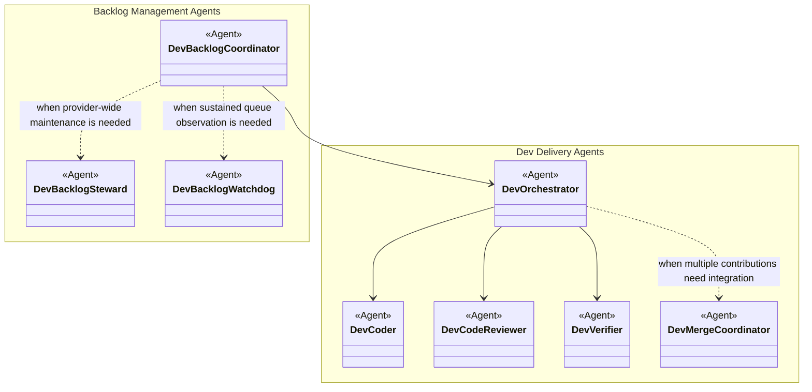
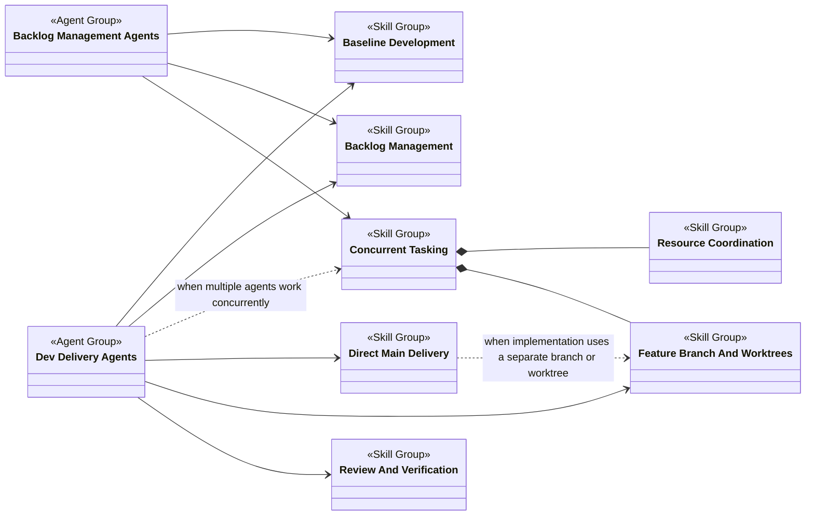
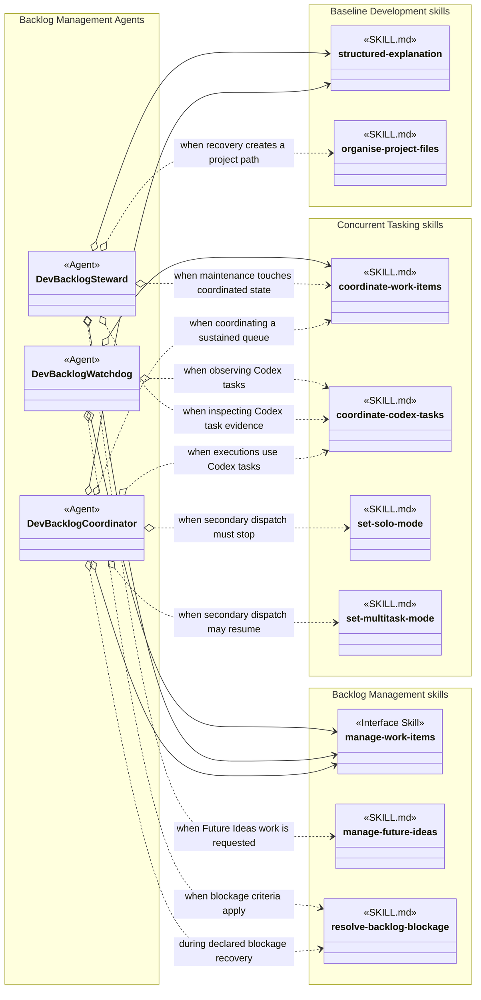
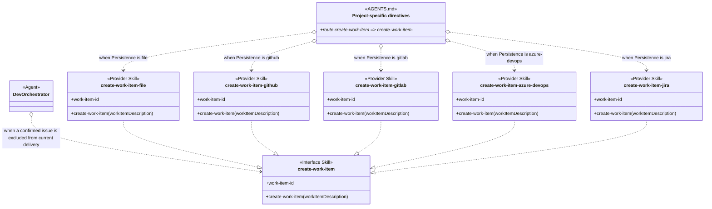
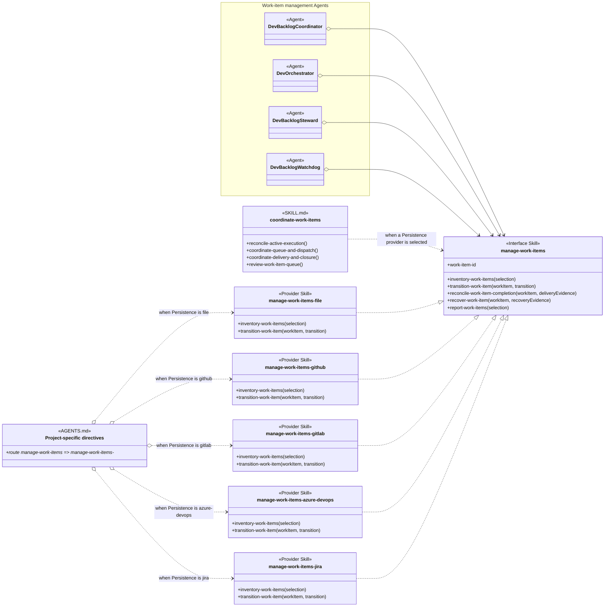
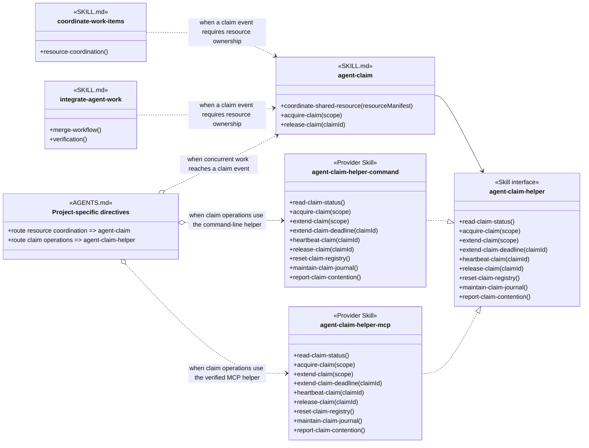
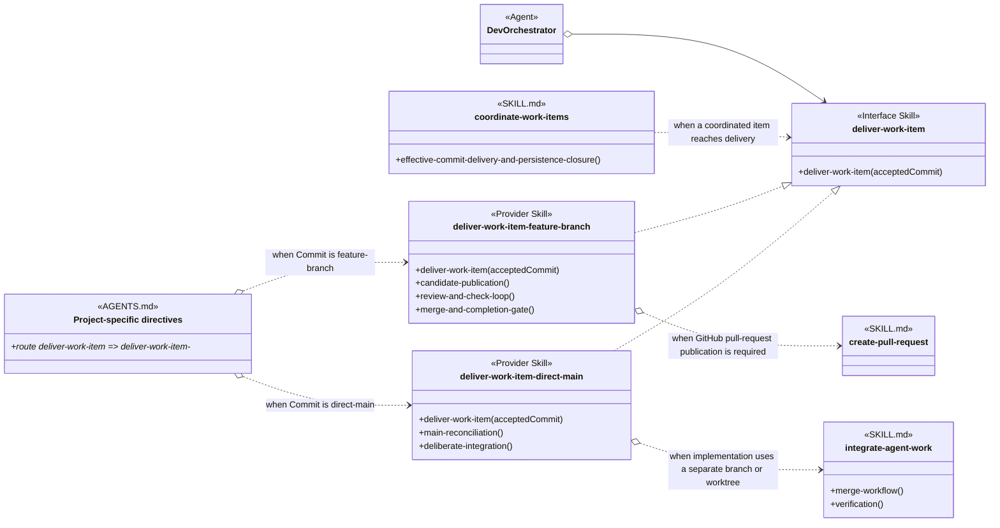

# Concurrent Tasking Skill Group

## Scope

Concurrent Tasking directly contains the two work-item coordination skills and the two dispatch-mode skills. It also nests the Resource Coordination and Feature Branch And Worktrees skill groups. Its complete set therefore includes those four direct skills plus every skill in the two nested groups. Containment is for comprehension and does not mean that a direct skill uses every nested skill. Persistence remains an independent injected provider.

Concurrent Tasking names a Skill Group, not an Agent Group. Its consumers belong to the Task Management Agent hierarchy: Backlog Management Agents manage a sustained stream of work items, while Dev Delivery Agents deliver one accepted work item. Both Agent Groups use Concurrent Tasking skills where their responsibilities require coordination.

The applied-model conventions are defined in [Object-Oriented Skill Group Models](../object-oriented-skill-group-models.md#2-applied-model-legend).

## Design

The design starts with the Task Management Agent hierarchy and then shows the relationships between whole Agent Groups and Skill Groups. Two expanded diagrams identify the exact Agents and skills inside those Agent Group views. Four scenario diagrams then explain provider routing and other relationships that need more detail.

A solid dependency is fixed by the referencing definition. A dotted dependency applies only under the condition written on the arrow. Project-selected skill loading originates at AGENTS.md. Agent- or skill-owned loading originates at the Agent or skill that makes that decision. Realization arrows show that a provider implements an interface; they do not load a file.

When several provider skills expose the same public procedures, the scenario uses an exact Interface Skill when one exists. The interface gives consumers one shared contract, while AGENTS.md selects the provider skill for the project.

### Agent Hierarchy

The Agent hierarchy separates task management by unit of responsibility. Backlog Management Agents manage a sustained queue and its provider-wide state. Dev Delivery Agents implement, review, verify, integrate, and deliver one accepted work item. Solid arrows identify fixed Agent dependencies, while dotted arrows identify conditional delegation.

### Agent Group And Skill Group Dependencies

The high-level dependency view contains only Agent Groups and Skill Groups. An Agent Group arrow summarizes one or more dependencies owned by Agents in that group; it does not mean that every Agent loads every skill in the target group. A solid arrow means at least one member has a fixed dependency. A dotted arrow summarizes a conditional dependency. A solid-diamond arrow means that the parent Skill Group contains the nested group for comprehension.

### Backlog Management Agents And Skills

Backlog Management Agents coordinate a sustained queue, maintain provider-wide records, and observe whether the queue needs attention. The diagram expands their exact role-declared skill dependencies. Solid open-diamond arrows are Core Agent Skills. Dotted open-diamond arrows are Optional Agent Skills and state their loading conditions.

### Dev Delivery Agents And Skills

Dev Delivery Agents implement, review, verify, integrate, and deliver one accepted work item. This diagram expands their exact role-declared skill dependencies while keeping provider implementations behind their Interface Skills.

```mermaid
classDiagram
    direction LR

    namespace DevDeliveryAgents["Dev Delivery Agents"] {
        class DevOrchestrator {
            <<Agent>>
        }
        class DevCoder {
            <<Agent>>
        }
        class DevCodeReviewer {
            <<Agent>>
        }
        class DevVerifier {
            <<Agent>>
        }
        class DevMergeCoordinator {
            <<Agent>>
        }
    }

    namespace BacklogManagementSkills["Backlog Management skills"] {
        class CreateWorkItem["create-work-item"] {
            <<Interface Skill>>
        }
        class ManageWorkItems["manage-work-items"] {
            <<Interface Skill>>
        }
    }

    namespace ConcurrentTaskingSkills["Concurrent Tasking skills"] {
        class coordinate-work-items {
            <<SKILL.md>>
        }
        class coordinate-codex-tasks {
            <<SKILL.md>>
        }
    }

    namespace DirectMainDeliverySkills["Direct Main Delivery skills"] {
        class DeliverWorkItem["deliver-work-item"] {
            <<Interface Skill>>
        }
    }

    namespace BaselineDevelopmentSkills["Baseline Development skills"] {
        class organise-project-files {
            <<SKILL.md>>
        }
        class careful-coding {
            <<SKILL.md>>
        }
        class code-comments {
            <<SKILL.md>>
        }
        class test-driven-development {
            <<SKILL.md>>
        }
        class code-discovery {
            <<SKILL.md>>
        }
        class explain-code-fix {
            <<SKILL.md>>
        }
        class structured-design {
            <<SKILL.md>>
        }
        class structured-explanation {
            <<SKILL.md>>
        }
        class review-structured-artifact {
            <<SKILL.md>>
        }
    }

    namespace ReviewAndVerificationSkills["Review And Verification skills"] {
        class review-code-with-evidence {
            <<SKILL.md>>
        }
        class test-strategy {
            <<SKILL.md>>
        }
        class verify-end-to-end-workflow {
            <<SKILL.md>>
        }
        class analyze-root-cause {
            <<SKILL.md>>
        }
        class collect-runtime-evidence {
            <<SKILL.md>>
        }
        class trace-code-execution {
            <<SKILL.md>>
        }
        class review-prompt-contracts {
            <<SKILL.md>>
        }
    }

    namespace FeatureBranchAndWorktreeSkills["Feature Branch And Worktrees skills"] {
        class integrate-agent-work {
            <<SKILL.md>>
        }
    }

    DevOrchestrator o--> ManageWorkItems
    DevOrchestrator o--> DeliverWorkItem
    DevOrchestrator o--> structured-design
    DevOrchestrator o--> structured-explanation
    DevOrchestrator o..> CreateWorkItem : when an excluded issue needs a work item
    DevOrchestrator o..> coordinate-work-items : when multiple agents work concurrently
    DevOrchestrator o..> coordinate-codex-tasks : when the execution uses a Codex task
    DevOrchestrator o..> organise-project-files : when orchestration creates a project path

    DevCoder o--> careful-coding
    DevCoder o--> code-comments
    DevCoder o--> code-discovery
    DevCoder o--> explain-code-fix
    DevCoder o..> organise-project-files : when implementation creates a project path
    DevCoder o..> test-driven-development : when executable tests guide implementation

    DevCodeReviewer o--> review-code-with-evidence
    DevCodeReviewer o--> review-structured-artifact
    DevCodeReviewer o--> careful-coding
    DevCodeReviewer o--> code-comments
    DevCodeReviewer o..> organise-project-files : when review creates an evidence file

    DevVerifier o--> test-strategy
    DevVerifier o--> review-structured-artifact
    DevVerifier o--> structured-explanation
    DevVerifier o..> organise-project-files : when verification creates a project path
    DevVerifier o..> verify-end-to-end-workflow : when an end-to-end workflow must be proven
    DevVerifier o..> analyze-root-cause : when a check fails
    DevVerifier o..> collect-runtime-evidence : when static evidence is insufficient
    DevVerifier o..> trace-code-execution : when an outcome must be traced to source
    DevVerifier o..> review-prompt-contracts : when verification uses a model-facing contract

    DevMergeCoordinator o--> integrate-agent-work
    DevMergeCoordinator o--> review-structured-artifact
    DevMergeCoordinator o--> explain-code-fix
    DevMergeCoordinator o..> organise-project-files : when integration creates a project path
```

The role schema also loads effective-communication and ste-technical-writing for every conceptual Agent. Those two shared dependencies are stated once here instead of adding the same two arrows to every Agent in both diagrams.

### Scenario: Creating A Work Item For An Excluded Issue

This scenario applies when Dev Orchestrator deliberately excludes a confirmed issue from the current delivery and must create a durable work item. The create-work-item Interface Skill defines the shared contract. The create-work-item-* family contains the Persistence-selected providers.

AGENTS.md selects exactly one creation provider from the project Persistence setting. Azure
DevOps and Jira use placeholder provider skills that return their documented unsupported result.
An explicit Future Ideas request conditionally selects manage-future-ideas instead of adding an
operation to the creation or lifecycle interfaces. create-work-item-file and manage-future-ideas
use commit-file-provider-transaction only when their file creation reaches the commit boundary.

### Scenario: Managing Provider Lifecycle

This scenario applies when an Agent inventories or changes durable provider lifecycle. The manage-work-items Interface Skill publishes the shared management contract. Persistence selects one manage-work-items-* provider.

manage-work-items names the shared management contract, and manage-work-items-* names its
provider family. Persistence selects one provider. coordinate-work-items uses the contract
across queue dispatch, active-execution reconciliation, delivery, closure, and periodic review.

### Scenario: A Project Enables Concurrent Agents

This scenario starts with the project goal: enable multiple agents to work concurrently. Concurrent work requires resource coordination, so project-specific directives make agent-claim and one verified helper provider available. These skills remain outside the default Agent context until a claim event requires resource ownership. agent-claim-helper defines the common operation, input, result, and uncertain-outcome interface. agent-claim-helper-command invokes a local command-line helper, while agent-claim-helper-mcp calls tools through the MCP protocol.

Enabling concurrent agents makes resource coordination required and available, but it does not preload every coordination instruction into every Agent context. The dotted relationships show the additional loads performed only when a claim event occurs. coordinate-work-items uses the policy while coordinating concurrent work, and integrate-agent-work uses it when concurrent contributions reach a shared integration event. agent-claim depends on the common claim operations, and the selected helper skill provides them. Solo workflows omit this resource-coordination route entirely.

The MCP helper route becomes selectable only after an MCP implementation satisfies agent-claim-helper and the verification boundary in agent-claim-helper-mcp. The current repository selects the command-line helper.

### Scenario: Delivering Accepted Work

This scenario applies after review and verification accept a commit for delivery. The exact deliver-work-item Interface Skill organizes the direct-main and feature-branch providers. The deliver-work-item-* family label remains in routing because AGENTS.md selects the provider named by the project Commit setting.

The provider realization arrows show conformance with the exact deliver-work-item contract. Feature-branch delivery loads create-pull-request only for a host that uses pull-request terminology. Direct main describes the final destination, not where implementation occurs. When implementation is isolated on a separate branch or worktree, especially for concurrent or independently delegated work, direct-main delivery uses integrate-agent-work to reconcile the accepted contribution with current main.

## Skill Responsibilities

The direct skills control coordinated execution and dispatch mode. The nested groups provide resource ownership and isolated feature-branch delivery.

| Direct group | Skill | Public procedures or identity | Responsibility |
| --- | --- | --- | --- |
| Concurrent Tasking | coordinate-work-items; coordinate-codex-tasks | Resource Coordination; Queue Target And Scheduling; Effective Commit Delivery And Persistence Closure | Separates portable work-item policy from conditional Codex task mapping. |
| Concurrent Tasking | set-solo-mode | Set Solo Mode | Disables dispatch to secondary threads while the current Agent continues sequential work. |
| Concurrent Tasking | set-multitask-mode | Set Multitask Mode | Enables dispatch to secondary threads after the sequential condition ends. |
| Resource Coordination | agent-claim | Coordinate Shared Resource; Acquire Claim; Extend Claim; Extend Claim Deadline; Heartbeat Claim; Read Claim Status; Release Claim | Defines claim events, scope, conflicts, deadlines, and cleanup policy. |
| Resource Coordination | agent-claim-helper | Operation Contract; Read Claim Status; Acquire Claim; Extend Claim; Extend Claim Deadline; Heartbeat Claim; Release Claim; Reset Claim Registry; Maintain Claim Journal; Report Claim Contention; Structured Outcomes; Reconcile an Uncertain Outcome; Provider Realization Contract | Defines one provider-neutral helper interface without selecting a provider or redefining claim policy. |
| Resource Coordination | agent-claim-helper-command | Read Claim Status; Acquire Claim; Extend Claim; Extend Claim Deadline; Heartbeat Claim; Release Claim; Reset Claim Registry; Maintain Claim Journal; Report Claim Contention | Invokes the configured command-line helper without redefining the interface or claim policy. |
| Resource Coordination | agent-claim-helper-mcp | Current Availability; Read Claim Status; Acquire Claim; Extend Claim; Extend Claim Deadline; Heartbeat Claim; Release Claim; Reset Claim Registry; Maintain Claim Journal; Report Claim Contention | Maps the interface to MCP tools and preserves the unavailable-until-parity boundary. |
| Feature Branch And Worktrees | integrate-agent-work | Merge Workflow; Verification | Integrates accepted work from branches, worktrees, or agents and reconciles it with current main. |
| Feature Branch And Worktrees | deliver-work-item-feature-branch | Deliver Work Item; Candidate Publication; Review And Check Loop; Merge And Completion Gate | Publishes, reviews, corrects, and observes feature-branch delivery before lifecycle closure. |
| Feature Branch And Worktrees | create-pull-request | Create Or Update Pull Request; Review Order | Creates or updates a provider-accurate pull request and preserves its review order. |

## Authoritative Inputs

The Task Management Agent hierarchy, Agent Group dependencies, Core and Optional Agent Skills, scenario interfaces, and provider families are grounded in the following files.

### Task Management Agent Groups And Roles

The Agent-group views classify roles by task-management responsibility: backlog management or development delivery. The Agent dependencies and exact skill relationships come from these role sources and the shared role schema.

- [Conceptual Agent Role Schema](../../agents/role-schema.yaml)

- [Dev Backlog Coordinator](../../agents/roles/dev-activities/dev-backlog-coordinator.role.yaml)
- [Dev Backlog Steward](../../agents/roles/dev-activities/dev-backlog-steward.role.yaml)
- [Dev Backlog Watchdog](../../agents/roles/dev-activities/dev-backlog-watchdog.role.yaml)
- [Dev Orchestrator](../../agents/roles/dev-activities/dev-orchestrator.role.yaml)
- [Dev Coder](../../agents/roles/dev-activities/dev-coder.role.yaml)
- [Dev Code Reviewer](../../agents/roles/dev-activities/dev-code-reviewer.role.yaml)
- [Dev Verifier](../../agents/roles/dev-activities/dev-verifier.role.yaml)
- [Dev Merge Coordinator](../../agents/roles/dev-activities/dev-merge-coordinator.role.yaml)

### Core And Optional Agent Skills

The Core and Optional inventory uses the role schema and the complete skill lists in the Agent definitions above, supported by these skill sources.

- [Effective Communication](../../skills/effective-communication/SKILL.md)
- [STE Technical Writing](../../skills/ste-technical-writing/SKILL.md)
- [Structured Explanation](../../skills/structured-explanation/SKILL.md)
- [Structured Design](../../skills/structured-design/SKILL.md)
- [Organise Project Files](../../skills/organise-project-files/SKILL.md)
- [Review Structured Artifact](../../skills/review-structured-artifact/SKILL.md)
- [Explain Code Fix](../../skills/explain-code-fix/SKILL.md)
- [Coordinate Work Items](../../skills/coordinate-work-items/SKILL.md)
- [Coordinate Codex Tasks](../../skills/coordinate-codex-tasks/SKILL.md)
- [Resolve Backlog Blockage](../../skills/resolve-backlog-blockage/SKILL.md)
- [Set Solo Mode](../../skills/set-solo-mode/SKILL.md)
- [Set Multitask Mode](../../skills/set-multitask-mode/SKILL.md)
- [Integrate Agent Work](../../skills/integrate-agent-work/SKILL.md)

### Project Routing And Provider Implementations

The scenario diagrams use these project-routed policy, helper, creation, management, and delivery skill definitions.

- [Agent Claim](../../skills/agent-claim/SKILL.md)
- [Agent Claim Helper](../../skills/agent-claim-helper/SKILL.md)
- [Agent Claim Helper Command](../../skills/agent-claim-helper-command/SKILL.md)
- [Agent Claim Helper MCP](../../skills/agent-claim-helper-mcp/SKILL.md)
- [Deliver Work Item Feature Branch](../../skills/deliver-work-item-feature-branch/SKILL.md)
- [Deliver Work Item Direct Main](../../skills/deliver-work-item-direct-main/SKILL.md)
- [Deliver Work Item](../../skills/deliver-work-item/SKILL.md)
- [Create Pull Request](../../skills/create-pull-request/SKILL.md)
- [Create Work Item](../../skills/create-work-item/SKILL.md)
- [Create File Work Item](../../skills/create-work-item-file/SKILL.md)
- [Manage Future Ideas](../../skills/manage-future-ideas/SKILL.md)
- [Commit File Provider Transaction](../../skills/commit-file-provider-transaction/SKILL.md)
- [Create GitHub Work Item](../../skills/create-work-item-github/SKILL.md)
- [Create GitLab Work Item](../../skills/create-work-item-gitlab/SKILL.md)
- [Create Azure DevOps Work Item](../../skills/create-work-item-azure-devops/SKILL.md)
- [Create Jira Work Item](../../skills/create-work-item-jira/SKILL.md)
- [Manage Work Items](../../skills/manage-work-items/SKILL.md)
- [Manage File Work Items](../../skills/manage-work-items-file/SKILL.md)
- [Manage GitHub Work Items](../../skills/manage-work-items-github/SKILL.md)
- [Manage GitLab Work Items](../../skills/manage-work-items-gitlab/SKILL.md)
- [Manage Azure DevOps Work Items](../../skills/manage-work-items-azure-devops/SKILL.md)
- [Manage Jira Work Items](../../skills/manage-work-items-jira/SKILL.md)
