# Concurrent Tasking Skill Group

## Scope

Concurrent Tasking directly contains work-item coordination and the two dispatch-mode skills. It also nests the Resource Coordination and Feature Branch And Worktrees skill groups. Its complete set therefore includes those three direct skills plus every skill in the two nested groups. Containment is for comprehension and does not mean that a direct skill uses every nested skill. Persistence remains an independent injected provider.

The applied-model conventions are defined in [Object-Oriented Skill Group Models](../object-oriented-skill-group-models.md#2-applied-model-legend).

## Design

The design shows direct Concurrent Tasking skills, the two nested groups, and the loading relationships that remain separate from containment.

```mermaid
classDiagram
    direction TB

    class DevBacklogCoordinator {
        <<Agent>>
    }

    class DevOrchestrator {
        <<Agent>>
    }

    class DevMergeCoordinator {
        <<Agent>>
    }

    class ConcurrentTasking {
        <<Skill Group>>
    }

    class ResourceCoordination {
        <<Skill Group>>
    }

    class FeatureBranchAndWorktrees {
        <<Skill Group>>
    }

    class coordinate-codex-work-items {
        <<SKILL.md>>
        <<Agent Skill>>
        +resource-coordination()
        +queue-target-and-dispatch()
        +effective-commit-delivery-and-persistence-closure()
    }

    class agent-claim {
        <<SKILL.md>>
        <<Injectable Skill>>
        +coordinate-shared-resource()
        +acquire-claim()
        +extend-claim()
        +extend-claim-deadline()
        +heartbeat-claim()
        +read-claim-status()
        +release-claim()
    }

    class agent-claim-command {
        <<SKILL.md>>
        <<Injectable Skill>>
        +read-claim-status()
        +acquire-claim()
        +extend-claim()
        +extend-claim-deadline()
        +heartbeat-claim()
        +release-claim()
        +reset-claim-registry()
        +maintain-claim-journal()
        +report-claim-contention()
    }

    class agent-claim-mcp {
        <<SKILL.md>>
        <<Injectable Skill>>
        <<Unavailable implementation>>
        +read-claim-status()
        +acquire-claim()
        +extend-claim()
        +extend-claim-deadline()
        +heartbeat-claim()
        +release-claim()
        +maintain-claim-journal()
        +report-claim-contention()
    }

    class integrate-agent-work {
        <<SKILL.md>>
        <<Agent Skill>>
        +merge-workflow()
        +verification()
    }

    class deliver-work-item-feature-branch {
        <<SKILL.md>>
        <<Injectable Skill>>
        +deliver-work-item()
        +candidate-publication()
        +review-and-check-loop()
        +merge-and-completion-gate()
    }

    class create-pull-request {
        <<SKILL.md>>
        +create-or-update-pull-request()
        +review-order
    }

    class set-solo-mode {
        <<SKILL.md>>
        <<Agent Skill>>
    }

    class set-multitask-mode {
        <<SKILL.md>>
        <<Agent Skill>>
    }

    class ManageWorkItem["manage-*-work-items"] {
        <<AGENTS.md>>
        <<routing>>
        <<Cross-group>>
        +inventory-work-items(selection)
        +transition-work-item(workItem, transition)
        +reconcile-work-item-completion(workItem, deliveryEvidence)
    }

    class ResourceCoordinationBinding["resource-coordination"] {
        <<AGENTS.md>>
        <<routing>>
        +coordinate-shared-resource(resourceManifest)
    }

    class ClaimHelper["agent-claim-*"] {
        <<AGENTS.md>>
        <<routing>>
        +read-claim-status()
        +acquire-claim(scope)
        +extend-claim(scope)
        +release-claim()
    }

    class DeliverWorkItem["deliver-work-item-*"] {
        <<AGENTS.md>>
        <<routing>>
        +deliver-work-item(acceptedCommit)
    }

    ConcurrentTasking *-- coordinate-codex-work-items
    ConcurrentTasking *-- set-solo-mode
    ConcurrentTasking *-- set-multitask-mode
    ConcurrentTasking *-- ResourceCoordination
    ConcurrentTasking *-- FeatureBranchAndWorktrees
    ResourceCoordination *-- agent-claim
    ResourceCoordination *-- agent-claim-command
    ResourceCoordination *-- agent-claim-mcp
    FeatureBranchAndWorktrees *-- integrate-agent-work
    FeatureBranchAndWorktrees *-- deliver-work-item-feature-branch
    FeatureBranchAndWorktrees *-- create-pull-request

    DevBacklogCoordinator o..> coordinate-codex-work-items : when Codex tasks coordinate multiple work items
    DevBacklogCoordinator o..> set-solo-mode : when work must continue without dispatch to secondary threads
    DevBacklogCoordinator o..> set-multitask-mode : when dispatch to secondary threads may resume
    DevOrchestrator o..> coordinate-codex-work-items : when the task is a coordinated Codex work-item conversation
    DevOrchestrator --> DeliverWorkItem
    DevMergeCoordinator o--> integrate-agent-work

    coordinate-codex-work-items --> ManageWorkItem
    coordinate-codex-work-items --> ResourceCoordinationBinding
    coordinate-codex-work-items --> DeliverWorkItem
    coordinate-codex-work-items o..> agent-claim : when agent-claim is loaded
    ResourceCoordinationBinding o--> agent-claim
    ResourceCoordinationBinding --> ClaimHelper
    ClaimHelper o--> agent-claim-command
    ClaimHelper o--> agent-claim-mcp
    DeliverWorkItem o--> deliver-work-item-feature-branch

    integrate-agent-work o--> agent-claim
    deliver-work-item-feature-branch o--> agent-claim
    deliver-work-item-feature-branch o..> create-pull-request : for GitHub pull-request publication
```

set-solo-mode disables dispatch to secondary threads, while set-multitask-mode enables it. They belong to Concurrent Tasking because they control whether work is dispatched concurrently rather than how a backlog blockage is resolved.

Dev Backlog Coordinator loads each skill by name for the matching transition. No direct arrow joins the two skills because the Agent definition owns their order and conditions.

## Skill Responsibilities

The direct skills control coordinated execution and dispatch mode. The nested groups provide resource ownership and isolated feature-branch delivery.

| Direct group | Skill | Public procedures or identity | Responsibility |
| --- | --- | --- | --- |
| Concurrent Tasking | coordinate-codex-work-items | Resource Coordination; Queue Target And Dispatch; Effective Commit Delivery And Persistence Closure | Coordinates capacity, dispatch, recovery, delivery, and provider closure across Codex work-item tasks. |
| Concurrent Tasking | set-solo-mode | Set Solo Mode | Disables dispatch to secondary threads while the current Agent continues sequential work. |
| Concurrent Tasking | set-multitask-mode | Set Multitask Mode | Enables dispatch to secondary threads after the sequential condition ends. |
| Resource Coordination | agent-claim | Coordinate Shared Resource; Acquire Claim; Extend Claim; Extend Claim Deadline; Heartbeat Claim; Read Claim Status; Release Claim | Defines claim events, scope, conflicts, deadlines, and cleanup policy. |
| Resource Coordination | agent-claim-command | Read Claim Status; Acquire Claim; Extend Claim; Extend Claim Deadline; Heartbeat Claim; Release Claim; Reset Claim Registry; Maintain Claim Journal; Report Claim Contention | Invokes the configured command claim helper without redefining claim policy. |
| Resource Coordination | agent-claim-mcp | Read Claim Status; Acquire Claim; Extend Claim; Extend Claim Deadline; Heartbeat Claim; Release Claim; Maintain Claim Journal; Report Claim Contention | Describes the matching MCP helper interface and its current availability boundary. |
| Feature Branch And Worktrees | integrate-agent-work | Merge Workflow; Verification | Integrates accepted work from branches, worktrees, or agents and reconciles it with current main. |
| Feature Branch And Worktrees | deliver-work-item-feature-branch | Deliver Work Item; Candidate Publication; Review And Check Loop; Merge And Completion Gate | Publishes, reviews, corrects, and observes feature-branch delivery before lifecycle closure. |
| Feature Branch And Worktrees | create-pull-request | Create Or Update Pull Request; Review Order | Creates or updates a provider-accurate pull request and preserves its review order. |

## Authoritative Inputs

The relationships, nested membership, and procedure boundaries are grounded in these Agent and skill definitions.

- [Dev Backlog Coordinator](../../agents/roles/dev-activities/dev-backlog-coordinator.role.yaml)
- [Dev Orchestrator](../../agents/roles/dev-activities/dev-orchestrator.role.yaml)
- [Dev Merge Coordinator](../../agents/roles/dev-activities/dev-merge-coordinator.role.yaml)
- [Coordinate Codex Work Items](../../skills/coordinate-codex-work-items/SKILL.md)
- [Set Solo Mode](../../skills/set-solo-mode/SKILL.md)
- [Set Multitask Mode](../../skills/set-multitask-mode/SKILL.md)
- [Agent Claim](../../skills/agent-claim/SKILL.md)
- [Agent Claim Command](../../skills/agent-claim-command/SKILL.md)
- [Agent Claim MCP](../../skills/agent-claim-mcp/SKILL.md)
- [Integrate Agent Work](../../skills/integrate-agent-work/SKILL.md)
- [Deliver Work Item Feature Branch](../../skills/deliver-work-item-feature-branch/SKILL.md)
- [Create Pull Request](../../skills/create-pull-request/SKILL.md)
- [Manage File Work Items](../../skills/manage-file-work-items/SKILL.md)
- [Manage GitHub Work Items](../../skills/manage-github-work-items/SKILL.md)
- [Manage GitLab Work Items](../../skills/manage-gitlab-work-items/SKILL.md)
