# Concurrent Tasking Skill Group

## Scope

Concurrent Tasking encloses Resource Coordination and Feature Branch And Worktrees. The top-level coordination skill uses both subgroups while keeping Persistence behind its own injected procedures.

The shared notation and cross-group markers are defined in [Object-Oriented Skill Group Models](../object-oriented-skill-group-models.md).

## Current Design

```mermaid
classDiagram
    direction TB

    class DevBacklogCoordinator {
        <<Agent class>>
    }

    class DevOrchestrator {
        <<Agent class>>
    }

    class DevMergeCoordinator {
        <<Agent class>>
    }

    namespace ConcurrentTasking {
        class ConcurrentTaskingGroup {
            <<Skill group>>
        }

        class CodexWorkitemCoordination {
            <<SKILL.md>>
            <<Agent Skill>>
            <<Peer Skill>>
            <<Cross-group responsibility>>
            +skill codex-workitem-coordination
            +procedure Resource Coordination
            +procedure Queue Target And Dispatch
            +procedure Effective Commit Delivery And Persistence Closure
        }

        class ResourceCoordinationGroup {
            <<Skill subgroup>>
        }

        class AgentClaim {
            <<SKILL.md>>
            <<Injectable Skill>>
            +skill agent-claim
            +procedure Claim Events
            +procedure Timed Resource Claims
            +procedure Release Cleanup
        }

        class AgentClaimCommand {
            <<SKILL.md>>
            <<Injectable Skill>>
            +skill agent-claim-command
            +procedure Command Contract
            +procedure Uncertain Command Outcome
        }

        class AgentClaimMcp {
            <<SKILL.md>>
            <<Injectable Skill>>
            +skill agent-claim-mcp
            +procedure MCP Operations
            +procedure Uncertain Tool Outcome
        }

        class FeatureBranchWorktreesGroup {
            <<Skill subgroup>>
        }

        class AgentWorkMerge {
            <<SKILL.md>>
            <<Agent Skill>>
            <<Peer Skill>>
            <<Cross-group responsibility>>
            +skill agent-work-merge
            +procedure Merge Workflow
            +procedure Verification
        }

        class CompleteWorkitemFeatureBranch {
            <<SKILL.md>>
            <<Injectable Skill>>
            <<Peer Skill>>
            <<Cross-group responsibility>>
            +skill complete-work-item-feature-branch
            +procedure Candidate Publication
            +procedure Review And Check Loop
            +procedure Merge And Completion Gate
        }

        class CreatePullRequest {
            <<SKILL.md>>
            <<Peer Skill>>
            +skill create-pull-request
            +procedure Workflow
            +procedure Review Order
        }
    }

    class ManageWorkitem {
        <<AGENTS.md DII>>
        <<Cross-group>>
        +procedure Inventory and lifecycle
        +procedure Completion and reconciliation
    }

    class ResourceCoordination {
        <<AGENTS.md DII>>
        +procedure Claim Events
        +procedure Timed Resource Claims
    }

    class ClaimHelper {
        <<AGENTS.md DII>>
        +procedure status and acquire
        +procedure extend heartbeat and release
    }

    class DeliverWorkitem {
        <<AGENTS.md DII>>
        +deliverWorkitem(acceptedCommit)
    }

    class OrganiseProjectFiles {
        <<SKILL.md>>
        <<Cross-group>>
        +skill organise-project-files
    }

    class StructuredDesign {
        <<SKILL.md>>
        <<Cross-group>>
        +skill structured-design
    }

    class StructuredExplanation {
        <<SKILL.md>>
        <<Cross-group>>
        +skill structured-explanation
    }

    class ReviewStructuredArtifact {
        <<SKILL.md>>
        <<Cross-group>>
        +skill review-structured-artifact
    }

    class FixExplanation {
        <<SKILL.md>>
        <<Cross-group>>
        +skill fix-explanation
    }

    ConcurrentTaskingGroup o-- CodexWorkitemCoordination : contains
    ConcurrentTaskingGroup *-- ResourceCoordinationGroup : encloses
    ConcurrentTaskingGroup *-- FeatureBranchWorktreesGroup : encloses
    ResourceCoordinationGroup o-- AgentClaim : contains
    ResourceCoordinationGroup o-- AgentClaimCommand : contains
    ResourceCoordinationGroup o-- AgentClaimMcp : contains
    FeatureBranchWorktreesGroup o-- AgentWorkMerge : contains
    FeatureBranchWorktreesGroup o-- CompleteWorkitemFeatureBranch : contains
    FeatureBranchWorktreesGroup o-- CreatePullRequest : contains
    DevBacklogCoordinator --> CodexWorkitemCoordination : conditional name reference
    DevOrchestrator --> CodexWorkitemCoordination : conditional name reference
    DevMergeCoordinator --> AgentWorkMerge : references by name
    DevOrchestrator --> OrganiseProjectFiles : conditional name reference
    DevOrchestrator --> StructuredDesign : references by name
    DevOrchestrator --> StructuredExplanation : references by name
    DevMergeCoordinator --> OrganiseProjectFiles : conditional name reference
    DevMergeCoordinator --> ReviewStructuredArtifact : references by name
    DevMergeCoordinator --> FixExplanation : references by name
    CodexWorkitemCoordination ..> ManageWorkitem : persistence closure uses selected procedures
    CodexWorkitemCoordination ..> ResourceCoordination : Resource Coordination
    CodexWorkitemCoordination ..> DeliverWorkitem : routes accepted delivery
    ResourceCoordination <|.. AgentClaim : exported procedures
    AgentClaim ..> ClaimHelper : Claim Events use selected helper
    ClaimHelper <|.. AgentClaimCommand : Command Contract
    ClaimHelper <|.. AgentClaimMcp : MCP Operations
    DeliverWorkitem <|.. CompleteWorkitemFeatureBranch : exported implementation
    CompleteWorkitemFeatureBranch --> CreatePullRequest : Candidate Publication uses Workflow
    AgentWorkMerge ..> ResourceCoordination : Merge Workflow uses Claim Events
```

Concurrent tasking Yes requires the enclosing group to use both Resource Coordination and Feature Branch And Worktrees. agent-claim supplies the coordination procedures, while one configured claim helper supplies its tool-specific operations.

The +procedure members use current section titles for multi-procedure skills. The Claim Helper interface uses operation keywords because the command and MCP implementations expose the same operations under different surrounding sections.

## Authoritative Inputs

- [Dev Backlog Coordinator](../../agents/roles/dev-activities/dev-backlog-coordinator.role.yaml)
- [Dev Orchestrator](../../agents/roles/dev-activities/dev-orchestrator.role.yaml)
- [Dev Merge Coordinator](../../agents/roles/dev-activities/dev-merge-coordinator.role.yaml)
- [Codex Work-Item Coordination](../../skills/codex-workitem-coordination/SKILL.md)
- [Agent Claim](../../skills/agent-claim/SKILL.md)
- [Agent Claim Command](../../skills/agent-claim-command/SKILL.md)
- [Agent Claim MCP](../../skills/agent-claim-mcp/SKILL.md)
- [Agent Work Merge](../../skills/agent-work-merge/SKILL.md)
- [Complete Work Item Feature Branch](../../skills/complete-work-item-feature-branch/SKILL.md)
- [Create Pull Request](../../skills/create-pull-request/SKILL.md)
- [Organise Project Files](../../skills/organise-project-files/SKILL.md)
- [Structured Design](../../skills/structured-design/SKILL.md)
- [Structured Explanation](../../skills/structured-explanation/SKILL.md)
- [Review Structured Artifact](../../skills/review-structured-artifact/SKILL.md)
- [Fix Explanation](../../skills/fix-explanation/SKILL.md)
