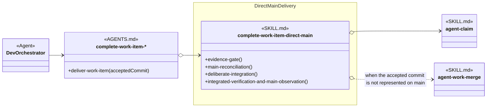
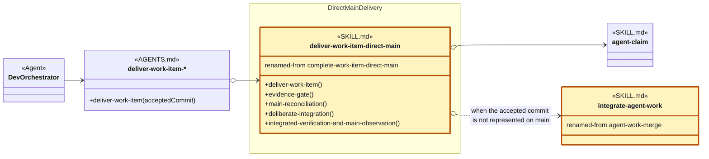

# Direct Main Delivery Skill Group

## Scope

Direct Main Delivery is the Commit alternative to feature-branch delivery. Its current skill directly names concurrency-owned claim and integration skills.

The applied-model legend and comparison contract are defined in [Object-Oriented Skill Group Models](../object-oriented-skill-group-models.md#2-applied-model-legend).

## Current Design

The Current Design shows direct-main delivery as one selected Commit implementation with exact-name dependencies on claim and integration skills.

Dev Orchestrator knows the Deliver Work Item procedure. AGENTS.md names complete-work-item-direct-main when direct-main is the effective Commit selection.

The concrete node shows the current internal procedure headings. None is named Deliver Work Item, which is the interface mismatch recorded in the recommendation below.

agent-claim and agent-work-merge remain in Concurrent Tasking. The open diamonds show that complete-work-item-direct-main currently names those exact skills instead of reaching them through a procedure-mapped AGENTS.md interface.

## Proposed Design

The Proposed Design renames the direct-main Commit skill so its identity and public procedure both express delivery rather than provider lifecycle completion.

The proposed diagram applies the recommendations below. Gold SKILL.md nodes have a proposed name change, and renamed-from records the current name. Neutral SKILL.md nodes keep their current names; their method-like members show proposed procedure headings.

## Skill Recommendations

The recommendation aligns the skill name and public procedure with the Deliver Work Item interface used by its caller.

| Skill | Current source boundary | Recommendation | Reason |
| --- | --- | --- | --- |
| complete-work-item-direct-main | Evidence Gate, Main Reconciliation, Deliberate Integration, and Integrated Verification And Main Observation implement delivery; Lifecycle Handoff returns provider evidence without closing the provider record. | Rename the skill to deliver-work-item-direct-main and introduce Deliver Work Item as its interface heading. | Deliver matches the caller’s Commit procedure and avoids implying that the skill itself completes provider lifecycle closure. |

## Authoritative Inputs

The current delivery relationship and proposed name are grounded in these Agent and skill definitions.

- [Dev Orchestrator](../../agents/roles/dev-activities/dev-orchestrator.role.yaml)
- [Complete Work Item Direct Main](../../skills/complete-work-item-direct-main/SKILL.md)
- [Agent Work Merge](../../skills/agent-work-merge/SKILL.md)
- [Agent Claim](../../skills/agent-claim/SKILL.md)
