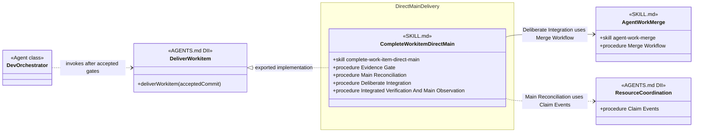

# Direct Main Delivery Skill Group

## Scope

Direct Main Delivery is the alternative Commit implementation when Concurrent Tasking is not selected. Its current SKILL.md reaches into concurrency-owned integration and resource-coordination skills.

The shared notation and cross-group markers are defined in [Object-Oriented Skill Group Models](../object-oriented-skill-group-models.md).

## Current Design

The caller invokes one Deliver Workitem contract with an accepted commit. AGENTS.md selects complete-work-item-direct-main, whose several titled procedures reconcile main, integrate when necessary, verify the integrated result, and observe main.

agent-work-merge and Resource Coordination retain their primary placement under Concurrent Tasking. Their Cross-group markers expose the current direct-main coupling.

## Authoritative Inputs

- [Dev Orchestrator](../../agents/roles/dev-activities/dev-orchestrator.role.yaml)
- [Complete Work Item Direct Main](../../skills/complete-work-item-direct-main/SKILL.md)
- [Agent Work Merge](../../skills/agent-work-merge/SKILL.md)
- [Agent Claim](../../skills/agent-claim/SKILL.md)
