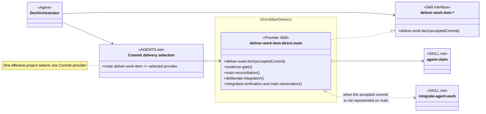

# Direct Main Delivery Skill Group

## Scope

Direct Main Delivery is the Commit alternative to feature-branch delivery. Its delivery skill directly names concurrency-owned claim and integration skills.

The applied-model conventions are defined in [Object-Oriented Skill Group Models](../object-oriented-skill-group-models.md#2-applied-model-legend).

## Design

The design separates the shared Commit interface from project selection and implementation. Dev Orchestrator consumes the abstract Deliver Work Item Skill interface, AGENTS.md selects one Commit Provider Skill, and the direct-main provider realizes the shared contract while keeping reconciliation and evidence internal.

The regular arrow from Dev Orchestrator to DeliverWorkItem shows a procedure-name dependency on the abstract interface. The other regular arrow delegates provider selection to the AGENTS.md factory, the factory names the direct-main Provider Skill for this configuration, and the realization arrow states that the provider implements the shared delivery contract. None of those relationships replaces the provider's exact-name dependencies on agent-claim or integrate-agent-work.

## Skill Responsibility

The group contains one selected Commit provider.

| Skill | Public procedures | Responsibility |
| --- | --- | --- |
| deliver-work-item-direct-main | Deliver Work Item; Evidence Gate; Main Reconciliation; Deliberate Integration; Integrated Verification And Main Observation | Integrates an accepted candidate into main, verifies the integrated state, and returns evidence for separate provider lifecycle closure. |

## Authoritative Inputs

The delivery relationship and procedure boundary are grounded in these Agent and skill definitions.

- [Dev Orchestrator](../../agents/roles/dev-activities/dev-orchestrator.role.yaml)
- [Deliver Work Item Direct Main](../../skills/deliver-work-item-direct-main/SKILL.md)
- [Integrate Agent Work](../../skills/integrate-agent-work/SKILL.md)
- [Agent Claim](../../skills/agent-claim/SKILL.md)
