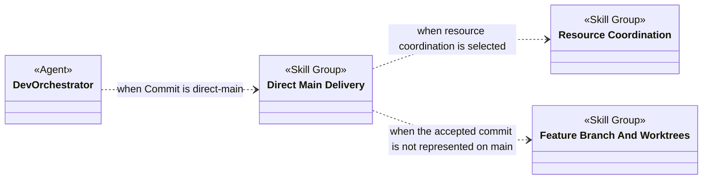
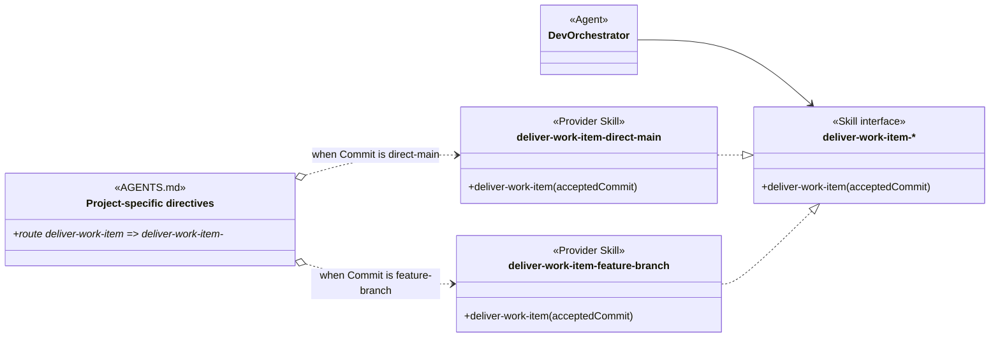
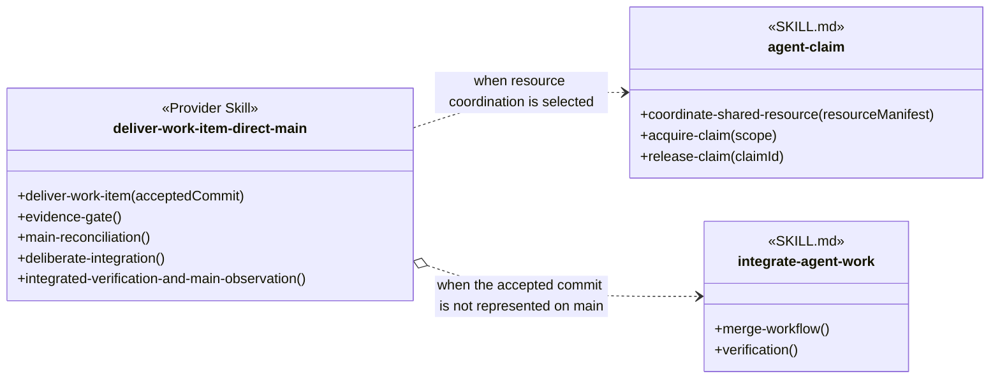

# Direct Main Delivery Skill Group

## Scope

Direct Main Delivery contains the Commit provider that delivers accepted work directly to main. It is selected as an alternative to the feature-branch provider.

The applied-model conventions are defined in [Object-Oriented Skill Group Models](../object-oriented-skill-group-models.md#2-applied-model-legend).

## Design

Direct Main Delivery participates in the project-selected delivery family. The overall view identifies its Agent and cross-group dependencies; the scenario views expand provider selection and the direct-main implementation separately.

### Overall Agent And Skill Group Dependencies

The overall view shows when Dev Orchestrator uses Direct Main Delivery and which other Skill Groups supply its optional coordination and integration dependencies. An arrow between Skill Groups means that at least one skill in the source group depends on a skill in the target group under the stated condition.

### Scenario: Selecting A Delivery Provider

This scenario applies after review and verification accept a commit for delivery. The deliver-work-item-* interface keeps the consumer stable while AGENTS.md selects either the direct-main or feature-branch Provider Skill from the project Commit setting.

The harness loads AGENTS.md without an Agent-to-AGENTS.md dependency. The diagram therefore shows the consumer’s procedure dependency and project routing separately.

### Scenario: Delivering Directly To Main

This scenario expands the direct-main provider after AGENTS.md selects it. The provider uses resource coordination when configured and invokes integrate-agent-work only when the accepted commit still needs to be represented on main.

## Skill Responsibility

The group contains one selected Commit provider.

| Skill | Public procedures | Responsibility |
| --- | --- | --- |
| deliver-work-item-direct-main | Deliver Work Item; Evidence Gate; Main Reconciliation; Deliberate Integration; Integrated Verification And Main Observation | Integrates an accepted candidate into main, verifies the integrated state, and returns evidence for separate provider lifecycle closure. |

## Authoritative Inputs

The delivery relationship and procedure boundary are grounded in these Agent and skill definitions.

- [Dev Orchestrator](../../agents/roles/dev-activities/dev-orchestrator.role.yaml)
- [Deliver Work Item Direct Main](../../skills/deliver-work-item-direct-main/SKILL.md)
- [Deliver Work Item Feature Branch](../../skills/deliver-work-item-feature-branch/SKILL.md)
- [Integrate Agent Work](../../skills/integrate-agent-work/SKILL.md)
- [Agent Claim](../../skills/agent-claim/SKILL.md)
