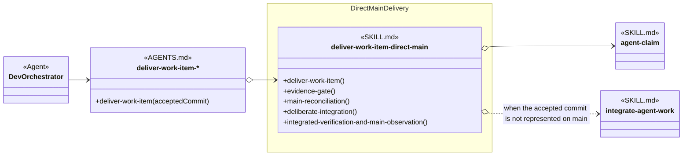

# Direct Main Delivery Skill Group

## Scope

Direct Main Delivery is the Commit alternative to feature-branch delivery. Its delivery skill directly names concurrency-owned claim and integration skills.

The applied-model conventions are defined in [Object-Oriented Skill Group Models](../object-oriented-skill-group-models.md#2-applied-model-legend).

## Design

The design exposes the same Deliver Work Item procedure used by feature-branch delivery while keeping direct-main reconciliation and evidence inside its selected implementation.

## Skill Responsibility

The group contains one selected Commit provider.

| Skill | Public procedures | Responsibility |
| --- | --- | --- |
| deliver-work-item-direct-main | Deliver Work Item; Evidence Gate; Main Reconciliation; Deliberate Integration; Integrated Verification And Main Observation | Integrates an accepted candidate into main, verifies the integrated state, and returns evidence for separate provider lifecycle closure. |

## Authoritative Inputs

The delivery relationship and procedure boundary are grounded in these Agent and skill definitions.

- [Dev Orchestrator](../../agents/roles/dev-activities/dev-orchestrator.role.yaml)
- [Deliver Work Item Direct Main](../../skills/deliver-work-item-direct-main/SKILL.md)
- [Integrate Agent Work](../../skills/integrate-agent-work/SKILL.md)
- [Agent Claim](../../skills/agent-claim/SKILL.md)
