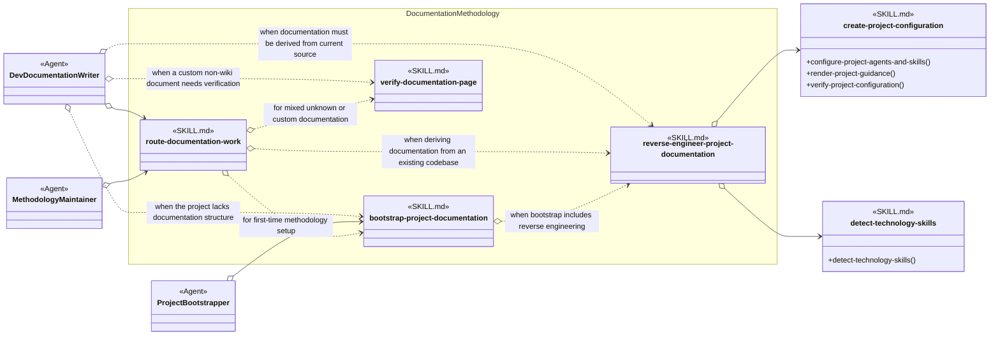

# Documentation Methodology Skill Group

## Scope

Documentation Methodology contains the documentation router, setup procedure, whole-project reverse-engineering procedure, and shared page verifier. Project Setup and documentation Agents load these skills by exact name.

The applied-model conventions are defined in [Object-Oriented Skill Group Models](../object-oriented-skill-group-models.md#2-applied-model-legend).

## Design

The design gives each documentation capability one operation-shaped skill identity while preserving direct Agent loading and conditional routing between complementary skills.

## Skill Responsibilities

Each skill describes one dominant documentation procedure, so its skill identity also serves as its public operation name.

| Skill | Responsibility |
| --- | --- |
| route-documentation-work | Selects the correct documentation creation, review, setup, or reverse-engineering route. |
| bootstrap-project-documentation | Establishes the selected documentation roots, templates, and project guidance. |
| reverse-engineer-project-documentation | Derives and reconciles a complete source-backed documentation hierarchy from an existing codebase. |
| verify-documentation-page | Verifies mixed, custom, or shared documentation concerns that lack a more specific review skill. |

## Authoritative Inputs

The relationships are grounded in these Agent and skill definitions.

- [Dev Documentation Writer](../../agents/roles/dev-activities/dev-documentation-writer.role.yaml)
- [Methodology Maintainer](../../agents/roles/methodology-maintenance/methodology-maintainer.role.yaml)
- [Project Bootstrapper](../../agents/roles/project-setup/project-bootstrapper.role.yaml)
- [Route Documentation Work](../../skills/route-documentation-work/SKILL.md)
- [Bootstrap Project Documentation](../../skills/bootstrap-project-documentation/SKILL.md)
- [Reverse Engineer Project Documentation](../../skills/reverse-engineer-project-documentation/SKILL.md)
- [Verify Documentation Page](../../skills/verify-documentation-page/SKILL.md)
- [Create Project Configuration](../../skills/create-project-configuration/SKILL.md)
- [Detect Technology Skills](../../skills/detect-technology-skills/SKILL.md)
