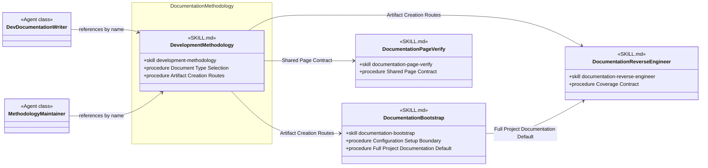

# Documentation Methodology Skill Group

## Scope

Documentation Methodology contains the development-methodology router and shows its current Peer Skill relationships to setup, reverse-engineering, and shared verification procedures.

The shared notation and cross-group markers are defined in [Object-Oriented Skill Group Models](../object-oriented-skill-group-models.md).

## Current Design

documentation-bootstrap creates only selected empty roots during Project Configurator setup. Its Full Project Documentation Default points a later whole-project documentation workflow to documentation-reverse-engineer instead of treating setup as reverse engineering.

The +procedure members use exact section titles because these SKILL.md files each contain several related procedures.

## Authoritative Inputs

- [Dev Documentation Writer](../../agents/roles/dev-activities/dev-documentation-writer.role.yaml)
- [Methodology Maintainer](../../agents/roles/methodology-maintenance/methodology-maintainer.role.yaml)
- [Development Methodology](../../skills/development-methodology/SKILL.md)
- [Documentation Bootstrap](../../skills/documentation-bootstrap/SKILL.md)
- [Documentation Reverse Engineer](../../skills/documentation-reverse-engineer/SKILL.md)
- [Documentation Page Verify](../../skills/documentation-page-verify/SKILL.md)
