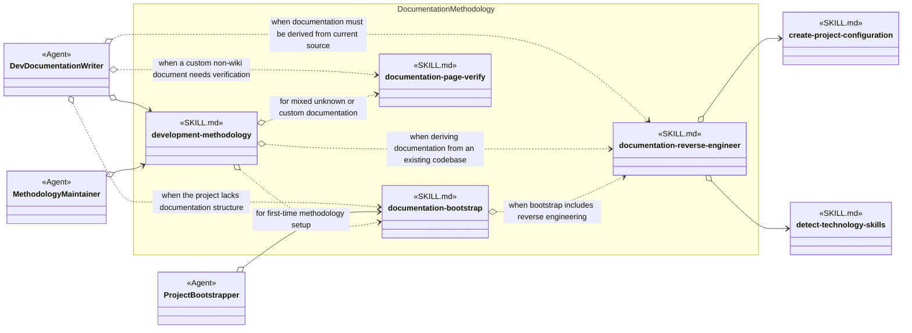
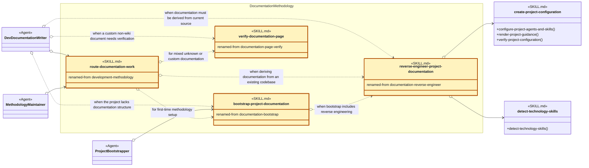

# Documentation Methodology Skill Group

## Scope

Documentation Methodology contains the documentation router, setup procedure, whole-project reverse-engineering procedure, and shared page verifier. Project Setup and documentation Agents load these skills by exact name.

The reusable notation and applied-model legend are defined in [Object-Oriented Analysis Of Agents And Skills](../object-oriented-agent-and-skill-model.md#14-applied-methodology-skill-groups).

## Current Design

The open diamonds are exact-name references. development-methodology is a router that explicitly names its companion skills, while documentation-bootstrap directly names documentation-reverse-engineer only for a later full-project documentation workflow.

documentation-reverse-engineer names Project Setup procedures for its configuration gate. Those two Cross-group nodes do not move technology detection or project configuration into Documentation Methodology.

## Proposed Design

The proposed diagram applies the recommendations below. Gold SKILL.md nodes have a proposed name change, and renamed-from records the current name. Neutral SKILL.md nodes keep their current names; their method-like members show proposed procedure headings.

## Skill Recommendations

| Skill | Current source boundary | Recommendation | Reason |
| --- | --- | --- | --- |
| development-methodology | Required Companion Skills and Artifact Creation Routes route documentation work; the name sounds like the complete development methodology. | Rename the skill to route-documentation-work. | The proposed name states the actual operation and avoids implying that ordinary development Agents need a general methodology package. |
| documentation-bootstrap | Configuration Setup Boundary and Bootstrap Workflow establish documentation roots and guidance. | Rename the skill to bootstrap-project-documentation. | The verb-first name identifies the operation and distinguishes the skill from a documentation category or artifact. |
| documentation-reverse-engineer | Pass -1 through Pass 5 and Final Top-Down Semantic Reconciliation form one ordered reverse-engineering procedure. | Rename the skill to reverse-engineer-project-documentation. | The current name can read like an Agent role. The proposed name states the operation performed on project documentation. |
| documentation-page-verify | Format Selection through Output performs one custom-page verification procedure. | Rename the skill to verify-documentation-page. | The verb-first name can serve directly as the procedure vocabulary used by documentation callers. |

## Authoritative Inputs

- [Dev Documentation Writer](../../agents/roles/dev-activities/dev-documentation-writer.role.yaml)
- [Methodology Maintainer](../../agents/roles/methodology-maintenance/methodology-maintainer.role.yaml)
- [Project Bootstrapper](../../agents/roles/project-setup/project-bootstrapper.role.yaml)
- [Development Methodology](../../skills/development-methodology/SKILL.md)
- [Documentation Bootstrap](../../skills/documentation-bootstrap/SKILL.md)
- [Documentation Reverse Engineer](../../skills/documentation-reverse-engineer/SKILL.md)
- [Documentation Page Verify](../../skills/documentation-page-verify/SKILL.md)
- [Create Project Configuration](../../skills/create-project-configuration/SKILL.md)
- [Detect Technology Skills](../../skills/detect-technology-skills/SKILL.md)
