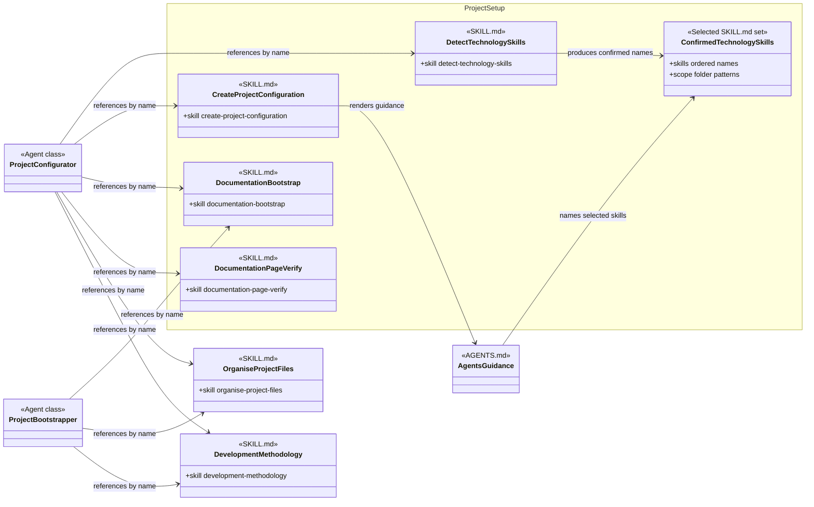

# Project Setup Skill Group

## Scope

Project Setup uses exact-name Agent Skills to detect technology candidates, create configuration, establish selected documentation roots, and verify the result.

The shared notation and cross-group markers are defined in [Object-Oriented Skill Group Models](../object-oriented-skill-group-models.md).

## Current Design

Project Configurator names detect-technology-skills directly. The generated AGENTS.md then names each confirmed folder technology skill; the current contract does not claim that every technology skill implements one common interface.

development-methodology remains in Documentation Methodology and organise-project-files remains in Baseline Development. Their Cross-group markers show that setup Agents currently name them.

## Authoritative Inputs

- [Project Configurator](../../agents/roles/project-setup/project-configurator.role.yaml)
- [Project Bootstrapper](../../agents/roles/project-setup/project-bootstrapper.role.yaml)
- [Detect Technology Skills](../../skills/detect-technology-skills/SKILL.md)
- [Create Project Configuration](../../skills/create-project-configuration/SKILL.md)
- [Documentation Bootstrap](../../skills/documentation-bootstrap/SKILL.md)
- [Documentation Page Verify](../../skills/documentation-page-verify/SKILL.md)
- [Organise Project Files](../../skills/organise-project-files/SKILL.md)
- [Development Methodology](../../skills/development-methodology/SKILL.md)
