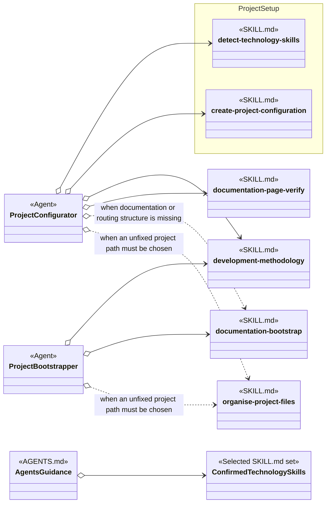
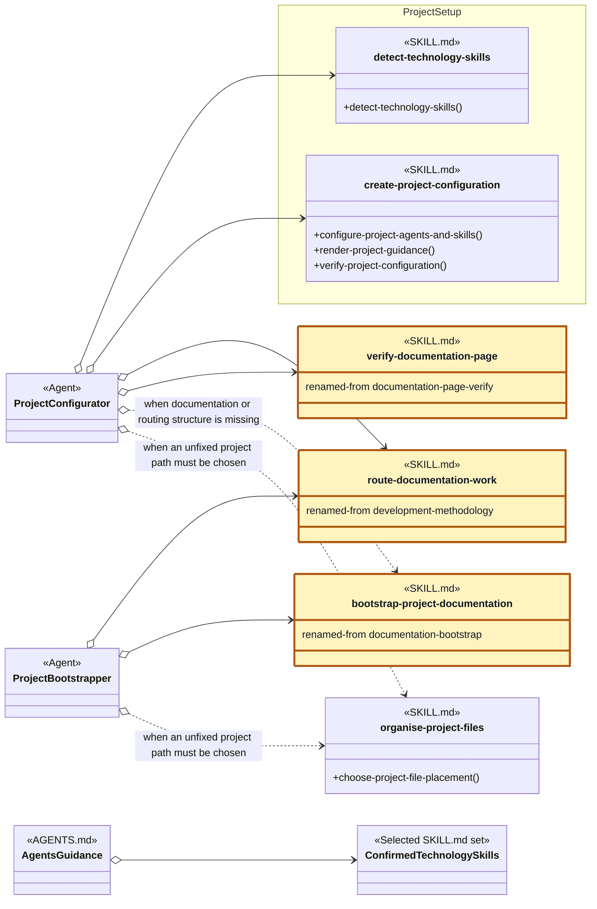

# Project Setup Skill Group

## Scope

Project Setup owns technology detection and project configuration. It uses documentation and placement skills from their primary groups rather than making those skills part of setup.

The applied-model legend and comparison contract are defined in [Object-Oriented Skill Group Models](../object-oriented-skill-group-models.md#2-applied-model-legend).

## Current Design

Project Configurator and Project Bootstrapper name their skills directly. The generated AGENTS.md also names each confirmed folder technology skill directly. The current definitions do not promise that all technology skills implement one shared procedure, so the selected set is not drawn as an injectable interface.

documentation-bootstrap, documentation-page-verify, and development-methodology belong to Documentation Methodology. organise-project-files belongs to Baseline Development. Their Cross-group nodes expose current setup use without changing primary ownership.

## Proposed Design

The proposed diagram applies the recommendations below. Gold SKILL.md nodes have a proposed name change, and renamed-from records the current name. Neutral SKILL.md nodes keep their current names; their method-like members show proposed procedure headings.

## Skill Recommendations

| Skill | Current source boundary | Recommendation | Reason |
| --- | --- | --- | --- |
| detect-technology-skills | Workflow performs detection; Operation Selection and Evidence Model define dispatch and interpretation rules. | Keep the skill name. Rename Workflow to Detect Technology Skills. | The skill name already states a cohesive operation, and the matching heading gives callers an explicit procedure boundary. |
| create-project-configuration | Setup Contract, Scope, Workflow, and Verification combine configuration decisions, PROJECT.yaml authoring, AGENTS.md rendering, and validation. | Keep the skill name. Introduce Configure Project Agents And Skills, Render Project Guidance, and Verify Project Configuration as operation headings. | The package contains several related operations. Named headings let another skill refer to the required part without treating the complete package as one create call. |

## Authoritative Inputs

- [Project Configurator](../../agents/roles/project-setup/project-configurator.role.yaml)
- [Project Bootstrapper](../../agents/roles/project-setup/project-bootstrapper.role.yaml)
- [Detect Technology Skills](../../skills/detect-technology-skills/SKILL.md)
- [Create Project Configuration](../../skills/create-project-configuration/SKILL.md)
- [Documentation Bootstrap](../../skills/documentation-bootstrap/SKILL.md)
- [Documentation Page Verify](../../skills/documentation-page-verify/SKILL.md)
- [Organise Project Files](../../skills/organise-project-files/SKILL.md)
- [Development Methodology](../../skills/development-methodology/SKILL.md)
