# Review And Verification Skill Group

## Scope

Review And Verification contains evidence review, test selection, end-to-end verification, diagnosis, runtime observation, source tracing, and prompt-contract review. The current Agent definitions combine these skills with exact-name Baseline Development skills.

The applied-model legend and comparison contract are defined in [Object-Oriented Skill Group Models](../object-oriented-skill-group-models.md#2-applied-model-legend).

## Current Design

```mermaid
classDiagram
    direction TB

    class DevCodeReviewer {
        <<Agent>>
    }

    class DevVerifier {
        <<Agent>>
    }

    class DevRuntimeDiagnostician {
        <<Agent>>
    }

    class DevPromptReviewer {
        <<Agent>>
    }

    class PlacementAwareReviewAgents {
        <<Agent superclass stand-in>>
    }

    namespace ReviewAndVerification {
        class code-review-evidence {
            <<SKILL.md>>
            <<Agent Skill>>
            +workflow()
            +evidence-packet()
            +synthesis-rules()
        }

        class test-strategy {
            <<SKILL.md>>
            <<Agent Skill>>
            +workflow()
            +coverage-principles()
        }

        class end-to-end-verification {
            <<SKILL.md>>
            <<Agent Skill>>
            +workflow()
            +evidence-handoff-and-commit-authority()
        }

        class root-cause-analysis {
            <<SKILL.md>>
            <<Agent Skill>>
            <<Peer Skill>>
            +workflow()
        }

        class runtime-evidence-collection {
            <<SKILL.md>>
            <<Agent Skill>>
            <<Peer Skill>>
            +workflow()
        }

        class code-execution-tracing {
            <<SKILL.md>>
            <<Agent Skill>>
            <<Peer Skill>>
            +workflow()
        }

        class prompt-contracts {
            <<SKILL.md>>
            <<Agent Skill>>
            +workflow()
        }
    }

    class careful-coding {
        <<SKILL.md>>
        <<Cross-group>>
    }

    class code-comments {
        <<SKILL.md>>
        <<Cross-group>>
    }

    class code-discovery {
        <<SKILL.md>>
        <<Cross-group>>
    }

    class organise-project-files {
        <<SKILL.md>>
        <<Cross-group>>
    }

    class review-structured-artifact {
        <<SKILL.md>>
        <<Cross-group>>
    }

    class structured-explanation {
        <<SKILL.md>>
        <<Cross-group>>
    }

    class agent-claim {
        <<SKILL.md>>
        <<Cross-group>>
    }

    class DeliverWorkItem["complete-work-item-*"] {
        <<AGENTS.md>>
        <<Cross-group>>
        +deliver-work-item(acceptedCommit)
    }

    DevCodeReviewer o--> code-review-evidence
    DevCodeReviewer o--> careful-coding
    DevCodeReviewer o--> code-comments
    DevCodeReviewer o--> review-structured-artifact

    DevVerifier o--> test-strategy
    DevVerifier o--> review-structured-artifact
    DevVerifier o--> structured-explanation
    DevVerifier o..> end-to-end-verification : when confidence depends on a complete real workflow
    DevVerifier o..> root-cause-analysis : when a verification check fails
    DevVerifier o..> runtime-evidence-collection : when static checks cannot establish behavior
    DevVerifier o..> code-execution-tracing : when an outcome must be connected to source control flow
    DevVerifier o..> prompt-contracts : when verification depends on a model-facing evaluator

    DevRuntimeDiagnostician o--> code-discovery
    DevRuntimeDiagnostician o--> test-strategy
    DevRuntimeDiagnostician o--> root-cause-analysis
    DevRuntimeDiagnostician o--> code-execution-tracing
    DevRuntimeDiagnostician o--> structured-explanation
    DevRuntimeDiagnostician o..> runtime-evidence-collection : when source cannot establish runtime state
    DevRuntimeDiagnostician o..> careful-coding : when diagnosis changes instrumentation or code

    DevPromptReviewer o--> prompt-contracts
    DevPromptReviewer o--> review-structured-artifact

    PlacementAwareReviewAgents o..> organise-project-files : when review or verification creates a project artifact

    root-cause-analysis o..> code-execution-tracing : when the cause depends on a source path
    root-cause-analysis o..> runtime-evidence-collection : when runtime facts are missing
    code-execution-tracing o..> runtime-evidence-collection : when source cannot identify the actual path
    end-to-end-verification o..> agent-claim : when verification triggers a claim event
    end-to-end-verification ..> DeliverWorkItem : when repository delivery is required
```

The four Agent nodes show their actual fixed and conditional skill references instead of implying that every review Agent loads every review skill. Placement Aware Review Agents is only a compression stand-in for the shared conditional organise-project-files reference.

The Peer Skill arrows expose current direct coupling among diagnosis procedures. end-to-end-verification names agent-claim when a claim event occurs, so that relationship uses an open diamond. Its regular dotted delivery arrow is different: the verifier returns accepted evidence to the project-selected delivery owner without naming the Commit implementation.

## Proposed Design

The proposed diagram applies the recommendations below. Gold SKILL.md nodes have a proposed name change, and renamed-from records the current name. Neutral SKILL.md nodes keep their current names; their method-like members show proposed procedure headings.

```mermaid
classDiagram
    direction TB

    class DevCodeReviewer {
        <<Agent>>
    }

    class DevVerifier {
        <<Agent>>
    }

    class DevRuntimeDiagnostician {
        <<Agent>>
    }

    class DevPromptReviewer {
        <<Agent>>
    }

    class PlacementAwareReviewAgents {
        <<Agent superclass stand-in>>
    }

    namespace ReviewAndVerification {
        class review-code-with-evidence:::renamed {
            <<SKILL.md>>
            <<Agent Skill>>
            renamed-from code-review-evidence
            +evidence-packet()
            +synthesis-rules()
        }

        class test-strategy {
            <<SKILL.md>>
            <<Agent Skill>>
            +select-and-run-tests()
            +coverage-principles()
        }

        class verify-end-to-end-workflow:::renamed {
            <<SKILL.md>>
            <<Agent Skill>>
            renamed-from end-to-end-verification
            +evidence-handoff-and-commit-authority()
        }

        class analyze-root-cause:::renamed {
            <<SKILL.md>>
            <<Agent Skill>>
            <<Peer Skill>>
            renamed-from root-cause-analysis
        }

        class collect-runtime-evidence:::renamed {
            <<SKILL.md>>
            <<Agent Skill>>
            <<Peer Skill>>
            renamed-from runtime-evidence-collection
        }

        class trace-code-execution:::renamed {
            <<SKILL.md>>
            <<Agent Skill>>
            <<Peer Skill>>
            renamed-from code-execution-tracing
        }

        class review-prompt-contracts:::renamed {
            <<SKILL.md>>
            <<Agent Skill>>
            renamed-from prompt-contracts
        }
    }

    class careful-coding {
        <<SKILL.md>>
        <<Cross-group>>
        +confirm-work-before-coding()
        +validate-authorized-contract()
        +execute-goal-driven-loop()
    }

    class code-comments {
        <<SKILL.md>>
        <<Cross-group>>
        +write-structured-comments()
        +add-code-artifact-header()
        +document-public-constructs()
        +review-code-comments()
    }

    class code-discovery {
        <<SKILL.md>>
        <<Cross-group>>
        +discover-code-context(requested-work)
        +determine-change-scope(discovered-context)
        +reference contract-authority-rules
        +reference discovery-boundaries
    }

    class organise-project-files {
        <<SKILL.md>>
        <<Cross-group>>
        +choose-project-file-placement()
    }

    class review-structured-artifact {
        <<SKILL.md>>
        <<Cross-group>>
        +review-structured-artifact()
    }

    class structured-explanation {
        <<SKILL.md>>
        <<Cross-group>>
        +create-structured-explanation()
    }

    class agent-claim {
        <<SKILL.md>>
        <<Cross-group>>
    }

    class DeliverWorkItem["deliver-work-item-*"] {
        <<AGENTS.md>>
        <<Cross-group>>
        +deliver-work-item(acceptedCommit)
    }

    DevCodeReviewer o--> review-code-with-evidence
    DevCodeReviewer o--> careful-coding
    DevCodeReviewer o--> code-comments
    DevCodeReviewer o--> review-structured-artifact

    DevVerifier o--> test-strategy
    DevVerifier o--> review-structured-artifact
    DevVerifier o--> structured-explanation
    DevVerifier o..> verify-end-to-end-workflow : when confidence depends on a complete real workflow
    DevVerifier o..> analyze-root-cause : when a verification check fails
    DevVerifier o..> collect-runtime-evidence : when static checks cannot establish behavior
    DevVerifier o..> trace-code-execution : when an outcome must be connected to source control flow
    DevVerifier o..> review-prompt-contracts : when verification depends on a model-facing evaluator

    DevRuntimeDiagnostician o--> code-discovery
    DevRuntimeDiagnostician o--> test-strategy
    DevRuntimeDiagnostician o--> analyze-root-cause
    DevRuntimeDiagnostician o--> trace-code-execution
    DevRuntimeDiagnostician o--> structured-explanation
    DevRuntimeDiagnostician o..> collect-runtime-evidence : when source cannot establish runtime state
    DevRuntimeDiagnostician o..> careful-coding : when diagnosis changes instrumentation or code

    DevPromptReviewer o--> review-prompt-contracts
    DevPromptReviewer o--> review-structured-artifact

    PlacementAwareReviewAgents o..> organise-project-files : when review or verification creates a project artifact

    analyze-root-cause o..> trace-code-execution : when the cause depends on a source path
    analyze-root-cause o..> collect-runtime-evidence : when runtime facts are missing
    trace-code-execution o..> collect-runtime-evidence : when source cannot identify the actual path
    verify-end-to-end-workflow o..> agent-claim : when verification triggers a claim event
    verify-end-to-end-workflow ..> DeliverWorkItem : when repository delivery is required

    classDef renamed fill:#fff3bf,stroke:#b45309,stroke-width:3px,color:#111827
```

## Skill Recommendations

| Skill | Current source boundary | Recommendation | Reason |
| --- | --- | --- | --- |
| code-review-evidence | Workflow, Evidence Packet, and Synthesis Rules define one evidence-first code review procedure. | Rename the skill to review-code-with-evidence. | The proposed name states the operation and avoids making the package sound like stored evidence rather than the procedure that produces and evaluates it. |
| test-strategy | Workflow selects and runs checks; Coverage Principles and Review Evidence constrain the selection. | Keep the skill name. Rename Workflow to Select And Run Tests. | Test Strategy remains a useful domain name, while the procedure heading tells an Agent what operation it can invoke. |
| end-to-end-verification | Workflow verifies the system path; Evidence Handoff And Commit Authority returns evidence without owning delivery. | Rename the skill to verify-end-to-end-workflow. | The verb-first name states the tested unit and avoids treating verification as only a document or category. |
| root-cause-analysis | Workflow performs one mechanism-level diagnosis. | Rename the skill to analyze-root-cause. | The current name is a method category. The proposed name can be used directly as the procedure invoked after a failure. |
| runtime-evidence-collection | Workflow performs bounded runtime observation and cleanup. | Rename the skill to collect-runtime-evidence. | The verb-first name directly matches the operation requested by diagnostic peers. |
| code-execution-tracing | Workflow traces a source path and reports unresolved branches. | Rename the skill to trace-code-execution. | The proposed name is an operation and can replace title-based references such as Use Code Execution Tracing. |
| prompt-contracts | Workflow reviews model-facing instructions, state, tools, retries, and outputs. | Rename the skill to review-prompt-contracts. | The current name identifies the subject but not the action; the proposed name matches the reviewer’s invocation. |

## Authoritative Inputs

- [Dev Code Reviewer](../../agents/roles/dev-activities/dev-code-reviewer.role.yaml)
- [Dev Verifier](../../agents/roles/dev-activities/dev-verifier.role.yaml)
- [Dev Runtime Diagnostician](../../agents/roles/dev-activities/dev-runtime-diagnostician.role.yaml)
- [Dev Prompt Reviewer](../../agents/roles/dev-activities/dev-prompt-reviewer.role.yaml)
- [Code Review Evidence](../../skills/code-review-evidence/SKILL.md)
- [Test Strategy](../../skills/test-strategy/SKILL.md)
- [End-To-End Verification](../../skills/end-to-end-verification/SKILL.md)
- [Root-Cause Analysis](../../skills/root-cause-analysis/SKILL.md)
- [Runtime Evidence Collection](../../skills/runtime-evidence-collection/SKILL.md)
- [Code Execution Tracing](../../skills/code-execution-tracing/SKILL.md)
- [Prompt Contracts](../../skills/prompt-contracts/SKILL.md)
- [Careful Coding](../../skills/careful-coding/SKILL.md)
- [Code Comments](../../skills/code-comments/SKILL.md)
- [Code Discovery](../../skills/code-discovery/SKILL.md)
- [Organise Project Files](../../skills/organise-project-files/SKILL.md)
- [Review Structured Artifact](../../skills/review-structured-artifact/SKILL.md)
- [Structured Explanation](../../skills/structured-explanation/SKILL.md)
- [Agent Claim](../../skills/agent-claim/SKILL.md)
