# Review And Verification Skill Group

## Scope

Review And Verification contains evidence review, test selection, end-to-end verification, diagnosis, runtime observation, source tracing, and prompt-contract review. Agent definitions combine these skills with exact-name Baseline Development skills.

The applied-model conventions are defined in [Object-Oriented Skill Group Models](../object-oriented-skill-group-models.md#2-applied-model-legend).

## Design

The design gives each single-operation review or diagnosis skill an operation-shaped identity and exposes named members only when a skill contains several relevant procedures or data definitions. Verification returns evidence to the delivery owner, so it does not consume or select the Commit Skill interface itself.

```mermaid
classDiagram
    direction TB

    class DevCodeReviewer {
        <<Agent>>
    }

    class DevVerifier {
        <<Agent>>
    }

    class DevRuntimeDiagnostician {
        <<Agent>>
    }

    class DevPromptReviewer {
        <<Agent>>
    }

    class PlacementAwareReviewAgents {
        <<Agent superclass stand-in>>
    }

    namespace ReviewAndVerification {
        class review-code-with-evidence {
            <<SKILL.md>>
            <<Agent Skill>>
            +evidence-packet
            +synthesis-rules
        }

        class test-strategy {
            <<SKILL.md>>
            <<Agent Skill>>
            +select-and-run-tests()
            +coverage-principles
        }

        class verify-end-to-end-workflow {
            <<SKILL.md>>
            <<Agent Skill>>
            +evidence-handoff-and-commit-authority
        }

        class analyze-root-cause {
            <<SKILL.md>>
            <<Agent Skill>>
        }

        class collect-runtime-evidence {
            <<SKILL.md>>
            <<Agent Skill>>
        }

        class trace-code-execution {
            <<SKILL.md>>
            <<Agent Skill>>
        }

        class review-prompt-contracts {
            <<SKILL.md>>
            <<Agent Skill>>
        }
    }

    class careful-coding {
        <<SKILL.md>>
        <<Cross-group>>
        +confirm-work-before-coding()
        +validate-authorized-contract()
        +execute-goal-driven-loop()
    }

    class code-comments {
        <<SKILL.md>>
        <<Cross-group>>
        +write-structured-comments()
        +add-code-artifact-header()
        +document-public-constructs()
        +review-code-comments()
    }

    class code-discovery {
        <<SKILL.md>>
        <<Cross-group>>
        +discover-code-context(requested-work)
        +determine-change-scope(discovered-context)
        +contract-authority-rules
        +discovery-boundaries
    }

    class organise-project-files {
        <<SKILL.md>>
        <<Cross-group>>
        +choose-project-file-placement()
    }

    class review-structured-artifact {
        <<SKILL.md>>
        <<Cross-group>>
        +review-structured-artifact()
    }

    class structured-explanation {
        <<SKILL.md>>
        <<Cross-group>>
        +create-structured-explanation()
    }

    class agent-claim {
        <<SKILL.md>>
        <<Cross-group>>
    }

    DevCodeReviewer o--> review-code-with-evidence
    DevCodeReviewer o--> careful-coding
    DevCodeReviewer o--> code-comments
    DevCodeReviewer o--> review-structured-artifact

    DevVerifier o--> test-strategy
    DevVerifier o--> review-structured-artifact
    DevVerifier o--> structured-explanation
    DevVerifier o..> verify-end-to-end-workflow : when confidence depends on a complete real workflow
    DevVerifier o..> analyze-root-cause : when a verification check fails
    DevVerifier o..> collect-runtime-evidence : when static checks cannot establish behavior
    DevVerifier o..> trace-code-execution : when an outcome must be connected to source control flow
    DevVerifier o..> review-prompt-contracts : when verification depends on a model-facing evaluator

    DevRuntimeDiagnostician o--> code-discovery
    DevRuntimeDiagnostician o--> test-strategy
    DevRuntimeDiagnostician o--> analyze-root-cause
    DevRuntimeDiagnostician o--> trace-code-execution
    DevRuntimeDiagnostician o--> structured-explanation
    DevRuntimeDiagnostician o..> collect-runtime-evidence : when source cannot establish runtime state
    DevRuntimeDiagnostician o..> careful-coding : when diagnosis changes instrumentation or code

    DevPromptReviewer o--> review-prompt-contracts
    DevPromptReviewer o--> review-structured-artifact

    PlacementAwareReviewAgents o..> organise-project-files : when review or verification creates a project artifact

    analyze-root-cause o..> trace-code-execution : when the cause depends on a source path
    analyze-root-cause o..> collect-runtime-evidence : when runtime facts are missing
    trace-code-execution o..> collect-runtime-evidence : when source cannot identify the actual path
    verify-end-to-end-workflow o..> agent-claim : when verification triggers a claim event
```

The absence of a delivery-interface arrow is deliberate. verify-end-to-end-workflow owns evidence capture and handoff, while the delivery owner applies the effective Commit provider after verification. Showing a direct interface dependency here would incorrectly assign delivery authority to the verifier.

## Skill Responsibilities

The group distinguishes complete review or diagnosis operations from supporting data that callers may need to understand.

| Skill | Public procedures or identity | Responsibility |
| --- | --- | --- |
| review-code-with-evidence | Review Code With Evidence; Evidence Packet; Synthesis Rules | Builds cited review evidence and synthesizes actionable findings. |
| test-strategy | Select And Run Tests; Coverage Principles | Chooses verification from changed behavior, risk, and project-native capabilities. |
| verify-end-to-end-workflow | Verify End To End Workflow; Evidence Handoff And Commit Authority | Verifies a complete real workflow and returns evidence without taking provider lifecycle authority. |
| analyze-root-cause | Analyze Root Cause | Establishes a mechanism-level cause before remediation. |
| collect-runtime-evidence | Collect Runtime Evidence | Collects bounded observations when source alone cannot establish runtime behavior. |
| trace-code-execution | Trace Code Execution | Connects entry points, branches, state changes, errors, and exits through source. |
| review-prompt-contracts | Review Prompt Contracts | Reviews model-facing instructions, tools, state, retries, outputs, and data boundaries. |

## Authoritative Inputs

The relationships and procedure boundaries are grounded in these Agent and skill definitions.

- [Dev Code Reviewer](../../agents/roles/dev-activities/dev-code-reviewer.role.yaml)
- [Dev Verifier](../../agents/roles/dev-activities/dev-verifier.role.yaml)
- [Dev Runtime Diagnostician](../../agents/roles/dev-activities/dev-runtime-diagnostician.role.yaml)
- [Dev Prompt Reviewer](../../agents/roles/dev-activities/dev-prompt-reviewer.role.yaml)
- [Review Code With Evidence](../../skills/review-code-with-evidence/SKILL.md)
- [Test Strategy](../../skills/test-strategy/SKILL.md)
- [Verify End To End Workflow](../../skills/verify-end-to-end-workflow/SKILL.md)
- [Analyze Root Cause](../../skills/analyze-root-cause/SKILL.md)
- [Collect Runtime Evidence](../../skills/collect-runtime-evidence/SKILL.md)
- [Trace Code Execution](../../skills/trace-code-execution/SKILL.md)
- [Review Prompt Contracts](../../skills/review-prompt-contracts/SKILL.md)
- [Careful Coding](../../skills/careful-coding/SKILL.md)
- [Code Comments](../../skills/code-comments/SKILL.md)
- [Code Discovery](../../skills/code-discovery/SKILL.md)
- [Organise Project Files](../../skills/organise-project-files/SKILL.md)
- [Review Structured Artifact](../../skills/review-structured-artifact/SKILL.md)
- [Structured Explanation](../../skills/structured-explanation/SKILL.md)
- [Agent Claim](../../skills/agent-claim/SKILL.md)
