# Review And Verification Skill Group

## Scope

Review And Verification contains independent evidence and diagnosis skills. Current reviewer and verifier Agents also name several Baseline Development skills directly.

The shared notation and cross-group markers are defined in [Object-Oriented Skill Group Models](../object-oriented-skill-group-models.md).

## Current Design

```mermaid
classDiagram
    direction TB

    class ReviewAgentDefinitions {
        <<Agent classes>>
        +agent DevCodeReviewer
        +agent DevVerifier
        +agent DevRuntimeDiagnostician
        +agent DevPromptReviewer
    }

    namespace ReviewAndVerification {
        class CodeReviewEvidence {
            <<SKILL.md>>
            <<Agent Skill>>
            +skill code-review-evidence
        }

        class TestStrategy {
            <<SKILL.md>>
            <<Agent Skill>>
            +skill test-strategy
        }

        class EndToEndVerification {
            <<SKILL.md>>
            <<Agent Skill>>
            <<Cross-group responsibility>>
            +skill end-to-end-verification
            +procedure Workflow
            +procedure Evidence Handoff And Commit Authority
        }

        class RootCauseAnalysis {
            <<SKILL.md>>
            <<Agent Skill>>
            <<Peer Skill>>
            +skill root-cause-analysis
            +procedure Workflow
        }

        class RuntimeEvidenceCollection {
            <<SKILL.md>>
            <<Agent Skill>>
            <<Peer Skill>>
            +skill runtime-evidence-collection
            +procedure Workflow
        }

        class CodeExecutionTracing {
            <<SKILL.md>>
            <<Agent Skill>>
            <<Peer Skill>>
            +skill code-execution-tracing
            +procedure Workflow
        }

        class PromptContracts {
            <<SKILL.md>>
            <<Agent Skill>>
            +skill prompt-contracts
        }
    }

    class CarefulCoding {
        <<SKILL.md>>
        <<Cross-group>>
        +skill careful-coding
    }

    class CodeComments {
        <<SKILL.md>>
        <<Cross-group>>
        +skill code-comments
    }

    class CodeDiscovery {
        <<SKILL.md>>
        <<Cross-group>>
        +skill code-discovery
    }

    class OrganiseProjectFiles {
        <<SKILL.md>>
        <<Cross-group>>
        +skill organise-project-files
    }

    class ReviewStructuredArtifact {
        <<SKILL.md>>
        <<Cross-group>>
        +skill review-structured-artifact
    }

    class StructuredExplanation {
        <<SKILL.md>>
        <<Cross-group>>
        +skill structured-explanation
    }

    class ResourceCoordination {
        <<AGENTS.md DII>>
        <<Cross-group>>
        +procedure Claim Events
    }

    class DeliverWorkitem {
        <<AGENTS.md DII>>
        <<Cross-group>>
        +deliverWorkitem(acceptedCommit)
    }

    ReviewAgentDefinitions --> CodeReviewEvidence : exact-name Agent references
    ReviewAgentDefinitions --> TestStrategy : exact-name Agent references
    ReviewAgentDefinitions --> EndToEndVerification : exact-name Agent references
    ReviewAgentDefinitions --> RootCauseAnalysis : exact-name Agent references
    ReviewAgentDefinitions --> RuntimeEvidenceCollection : exact-name Agent references
    ReviewAgentDefinitions --> CodeExecutionTracing : exact-name Agent references
    ReviewAgentDefinitions --> PromptContracts : exact-name Agent references
    ReviewAgentDefinitions --> CarefulCoding : exact-name Agent references
    ReviewAgentDefinitions --> CodeComments : exact-name Agent references
    ReviewAgentDefinitions --> CodeDiscovery : exact-name Agent references
    ReviewAgentDefinitions --> OrganiseProjectFiles : exact-name Agent references
    ReviewAgentDefinitions --> ReviewStructuredArtifact : exact-name Agent references
    ReviewAgentDefinitions --> StructuredExplanation : exact-name Agent references
    RootCauseAnalysis --> CodeExecutionTracing : Workflow invokes by skill name
    RootCauseAnalysis --> RuntimeEvidenceCollection : Workflow invokes by skill name
    CodeExecutionTracing --> RuntimeEvidenceCollection : Workflow invokes when source evidence is insufficient
    EndToEndVerification ..> ResourceCoordination : Workflow uses Claim Events when triggered
    EndToEndVerification ..> DeliverWorkitem : Evidence Handoff reaches delivery owner
```

Dev Verifier names test-strategy and end-to-end-verification directly. end-to-end-verification remains verification-owned while its Workflow applies Resource Coordination when triggered and its Evidence Handoff And Commit Authority section sends accepted evidence to the effective Commit delivery owner.

The multi-procedure skills use exact section titles. Baseline Development nodes carry only their skill identity because the reviewer relationships apply each named skill as a whole.

## Authoritative Inputs

- [Dev Code Reviewer](../../agents/roles/dev-activities/dev-code-reviewer.role.yaml)
- [Dev Verifier](../../agents/roles/dev-activities/dev-verifier.role.yaml)
- [Dev Runtime Diagnostician](../../agents/roles/dev-activities/dev-runtime-diagnostician.role.yaml)
- [Dev Prompt Reviewer](../../agents/roles/dev-activities/dev-prompt-reviewer.role.yaml)
- [Code Review Evidence](../../skills/code-review-evidence/SKILL.md)
- [Test Strategy](../../skills/test-strategy/SKILL.md)
- [End-To-End Verification](../../skills/end-to-end-verification/SKILL.md)
- [Root-Cause Analysis](../../skills/root-cause-analysis/SKILL.md)
- [Runtime Evidence Collection](../../skills/runtime-evidence-collection/SKILL.md)
- [Code Execution Tracing](../../skills/code-execution-tracing/SKILL.md)
- [Prompt Contracts](../../skills/prompt-contracts/SKILL.md)
- [Careful Coding](../../skills/careful-coding/SKILL.md)
- [Code Comments](../../skills/code-comments/SKILL.md)
- [Code Discovery](../../skills/code-discovery/SKILL.md)
- [Organise Project Files](../../skills/organise-project-files/SKILL.md)
- [Review Structured Artifact](../../skills/review-structured-artifact/SKILL.md)
- [Structured Explanation](../../skills/structured-explanation/SKILL.md)
