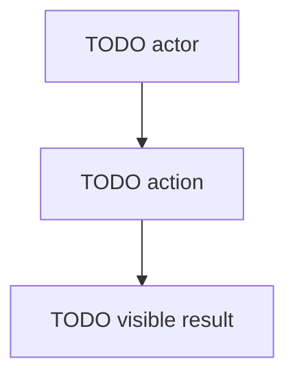

<!--
Copyright (c) 2025 Martin Bechard [martin.bechard@DevConsult.ca]
This software is licensed under the MIT License.
File path: skills/development-methodology/assets/templates/functional-spec-template.md
1-line summary: Template for user-visible workflow and acceptance documentation.
-->

# TODO Functional Specification Name

## Current Understanding

TODO: Describe the user-visible workflow, product capability, admin flow, operator flow, or external-system behavior this document defines.

TODO: State the user or actor goal in steady-state language.

TODO: State whether the behavior is implemented, planned, partially implemented, or blocked by missing authority.

## Authoritative Sources

TODO: Link the source material that defines the intended behavior.

TODO: Include product requirements, existing functional documents, code, tests, procedures, backlog records, routes, UI surfaces, command entry points, or external integration notes as applicable.

TODO: State which source wins when two sources can disagree.

## Related Code

TODO: Link source files, routes, components, services, scripts, migrations, or configuration that implement the behavior.

TODO: Say Not yet identified when the functional specification exists before code.

## Related Tests

TODO: Link automated tests, manual test notes, fixtures, snapshots, or generated verification artifacts.

TODO: Say Not yet identified when tests still need to be written.

## Related Backlog Items

TODO: Link active or historical backlog items that affect this behavior.

TODO: Say Not yet identified when no related backlog item is known.

## Related Wiki Pages

TODO: Link parent workflow pages, related functional pages, architecture pages, high-level designs, module designs, decisions, known defects, and glossary entries.

TODO: Say Not yet identified when no related wiki page is known.

## Open Questions

TODO: Record unresolved product, behavior, verification, route, permission, or source-of-truth questions.

TODO: If there are no unresolved questions, replace this section with a sentence saying no open questions are recorded.

## Maintenance Notes

TODO: Record what future maintainers should check when code, tests, routes, permissions, or user-visible behavior change.

TODO: Include the last meaningful source review when known.

## Parent Workflow

TODO: Link the parent workflow, product area, project wiki page, backlog item, or functional index that owns this behavior.

TODO: State how this feature contributes to the parent workflow.

## Actors

TODO: List the users, administrators, operators, services, or external systems that participate in this behavior.

TODO: For each actor, state what the actor can do and what the actor must not be able to do.

## Entry Points

TODO: List routes, pages, commands, scheduled jobs, integrations, widgets, buttons, forms, or external events that start this workflow.

TODO: State which entry point is primary and which entry points are alternate paths.

TODO: Build a primary and supporting operation inventory that includes every route, API, command, event, job, notification, and supporting reference-data lookup directly invoked by the workflow. For each operation record actor and authentication source; authorization, ownership, tenancy, and data filtering; selector, request, paging, and sort; response projection, disclosure, status, and error; state or side effects; and verification. Preserve supported facts and mark only unresolved facets open.

## Scope

TODO: List the capabilities included in this functional specification.

TODO: List non-goals and boundaries that keep the workflow from expanding into unrelated work.

## Concepts

TODO: Define user-facing terms, statuses, roles, business entities, route parameters, or operational concepts needed to understand the workflow.

TODO: Link technical documents only when a concept needs implementation context.

## Workflows

TODO: For each workflow, write the steps from the actor's point of view.

TODO: Include expected visible results, confirmation messages, disabled states, navigation outcomes, and persistence outcomes.

## Workflow Diagram

TODO: Add a Mermaid diagram when actor paths, branching states, permission gates, or external handoffs are clearer visually.

TODO: If no diagram is needed, replace this section with a sentence saying no workflow diagram is required.

TODO: If an SVG artifact is maintained, link it only when a review or publishing surface cannot render Mermaid and record its source relationship in Maintenance Notes.

## States And Rules

TODO: List the states the feature can be in.

TODO: Describe rules for permissions, validation, sorting, filtering, redirects, retry behavior, empty states, unavailable states, and conflict states.

TODO: State which source of information is authoritative when two sources can disagree.

## Edge Cases

TODO: List the edge cases that users can realistically encounter.

TODO: For each edge case, state what the user sees and whether the workflow can continue.

## Verification

TODO: Add a verification block for every workflow, rule group, and important edge case.

TODO: Use this shape for each verification block:

Type: TODO Testable, Non-E2E, Manual, Planned, or Not Applicable

Test files: TODO List test files or say Not yet identified

Status: TODO Pass, Planned, Missing, Blocked, or Not Applicable

Scenario: TODO Describe the behavior being verified

Steps:

1. TODO First verification step
2. TODO Second verification step
3. TODO Third verification step

Assertions:

- TODO Observable result
- TODO Persisted result or route result
- TODO Important negative assertion
