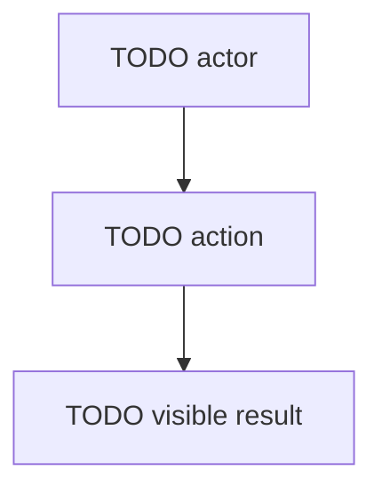

<!--
Copyright (c) 2025 Martin Bechard [martin.bechard@DevConsult.ca]
This software is licensed under the MIT License.
File path: skills/development-methodology/assets/templates/functional-spec-template.md
1-line summary: Template for user-visible workflow and acceptance documentation.
-->

# TODO Functional Specification Name

## Current Understanding

> This gives product, design, and implementation readers a shared behavioral baseline before they interpret detailed workflows. Product owners, designers, implementers, and reviewers use it during onboarding, planning, and review to state the actor goal, the capability being described, and whether the behavior is current, planned, partial, or blocked.

TODO: Describe the user-visible workflow, product capability, admin flow, operator flow, or external-system behavior this document defines.

TODO: State the user or actor goal in steady-state language.

TODO: State whether the behavior is implemented, planned, partially implemented, or blocked by missing authority.

## Authoritative Sources

> This lets reviewers distinguish required behavior from assumption and resolve conflicting descriptions consistently. Product owners, designers, implementers, and reviewers use it when creating or revising the specification to link the product, code, test, procedure, route, and backlog evidence that governs the workflow and to declare source precedence.

TODO: Link the source material that defines the intended behavior.

TODO: Include product requirements, existing functional documents, code, tests, procedures, backlog records, routes, UI surfaces, command entry points, or external integration notes as applicable.

TODO: State which source wins when two sources can disagree.

## Related Code

> This gives implementers and reviewers a direct path from user-visible behavior to the surfaces that provide it. Product owners, designers, implementers, and reviewers use it during implementation, change review, and reverse engineering to locate the exact routes, components, services, scripts, migrations, and configuration involved.

TODO: Link source files, routes, components, services, scripts, migrations, or configuration that implement the behavior.

TODO: Say Not yet identified when the functional specification exists before code.

TODO: When three or more related paths share a prefix, or span two or more folders, show their placement once as a fenced text tree instead of repeating full paths in bullets or table rows. Add a separate link index only when clickable source evidence is required, using short leaf labels as the visible text.

TODO: When separate workflow surfaces need different metadata, split them into named subsections by surface. Put one small fenced text tree in each subsection and its metadata immediately after the tree. Do not place multiline trees in Markdown table cells or simulate them with HTML breaks. Do not create one row per full path.

TODO: Path tree example (replace every synthetic segment and file with complete project paths):

```text
frontend/
└── src/
    ├── pages/
    │   ├── FeatureListPage.tsx
    │   └── FeatureDetailPage.tsx
    └── api/
        └── featureClient.ts
```

TODO: For a larger layout, repeat the named-subsection pattern above with another small fenced tree; keep metadata outside the tree rather than embedding the tree in a table cell.

## Related Tests

> This shows which behavioral claims are exercised and where confidence still depends on missing or manual checks. Product owners, designers, implementers, and reviewers use it during review, regression analysis, and release planning to find the tests, fixtures, snapshots, and retained verification evidence for the workflow.

TODO: Link automated tests, manual test notes, fixtures, snapshots, or generated verification artifacts.

TODO: Say Not yet identified when tests still need to be written.

## Related Backlog Items

> This preserves the decisions, defects, and planned work that explain why the behavior has its current shape or may change. Product owners, designers, implementers, and reviewers use it during planning, triage, and maintenance to connect the specification to active and historical work.

TODO: Link active or historical backlog items that affect this behavior.

TODO: Say Not yet identified when no related backlog item is known.

## Related Wiki Pages

> This helps readers reach broader product context or deeper technical detail without duplicating it in the specification. Product owners, designers, implementers, and reviewers use it during exploration, onboarding, and impact analysis to find parent workflows, designs, decisions, defects, and shared terminology.

TODO: Link parent workflow pages, related functional pages, architecture pages, high-level designs, module designs, decisions, known defects, and glossary entries.

TODO: Say Not yet identified when no related wiki page is known.

## Open Questions

> This keeps unresolved behavior or authority conflicts visible so downstream designers do not invent incompatible answers. Product owners, designers, implementers, and reviewers use it before design handoffs and implementation planning to record each unresolved question, its impact, decision owner, and required evidence.

TODO: Record unresolved product, behavior, verification, route, permission, or source-of-truth questions.

TODO: If there are no unresolved questions, replace this section with a sentence saying no open questions are recorded.

## Maintenance Notes

> This helps future maintainers recognize when the specification may be stale and what evidence must be rechecked. Product owners, designers, implementers, and reviewers use it after changes to routes, permissions, tests, or user-visible behavior to record review triggers and the latest meaningful source review.

TODO: Record what future maintainers should check when code, tests, routes, permissions, or user-visible behavior change.

TODO: Include the last meaningful source review when known.

## Parent Workflow

> This prevents a locally complete feature description from becoming disconnected from the larger user journey it serves. Product owners, designers, implementers, and reviewers use it during product decomposition and change-impact review to identify the owning workflow and explain this capability's contribution to it.

TODO: Link the parent workflow, product area, project wiki page, backlog item, or functional index that owns this behavior.

TODO: State how this feature contributes to the parent workflow.

## Actors

> This makes authority and expected behavior explicit for every participant, reducing permission and ownership ambiguity. Product owners, designers, implementers, and reviewers use it during workflow design, security review, and testing to name each actor and define what the actor may and must not do.

TODO: List the users, administrators, operators, services, or external systems that participate in this behavior.

TODO: For each actor, state what the actor can do and what the actor must not be able to do.

## Entry Points

> This ensures every way of starting or supporting the workflow is accounted for rather than hidden behind the primary screen or route. Product owners, designers, implementers, and reviewers use it during interface design, operation inventory, and coverage review to identify primary and alternate entry points and their actor, request, response, side-effect, and verification contracts.

TODO: List routes, pages, commands, scheduled jobs, integrations, widgets, buttons, forms, or external events that start this workflow.

TODO: State which entry point is primary and which entry points are alternate paths.

TODO: Build a primary and supporting operation inventory that includes every route, API, command, event, job, notification, and supporting reference-data lookup directly invoked by the workflow. For each operation record actor and authentication source; authorization, ownership, tenancy, and data filtering; selector, request, paging, and sort; response projection, disclosure, status, and error; state or side effects; and verification. Preserve supported facts and mark only unresolved facets open.

## Scope

> This prevents the specification from absorbing unrelated behavior or leaving owned capabilities undocumented. Product owners, designers, implementers, and reviewers use it during planning and review to define included capabilities, non-goals, and the boundary with other functional artifacts.

TODO: List the capabilities included in this functional specification.

TODO: List non-goals and boundaries that keep the workflow from expanding into unrelated work.

## Concepts

> This gives actors, designers, and implementers one vocabulary for interpreting the workflow and its states. Product owners, designers, implementers, and reviewers use it when domain terms, roles, statuses, entities, or route parameters could otherwise be understood differently; define only the concepts needed by this behavior.

TODO: Define user-facing terms, statuses, roles, business entities, route parameters, or operational concepts needed to understand the workflow.

TODO: Link technical documents only when a concept needs implementation context.

## Workflows

> This makes the actor-visible sequence and outcomes reviewable before technical design or implementation begins. Product owners, designers, implementers, and reviewers use it during product review, design, and acceptance planning to describe each path from the actor's perspective, including visible results, navigation, persistence, and recovery behavior.

TODO: For each workflow, write the steps from the actor's point of view.

TODO: Include expected visible results, confirmation messages, disabled states, navigation outcomes, and persistence outcomes.

## Interface Examples

> This turns important interface contracts into concrete examples that readers can compare and test, reducing ambiguity left by abstract prose. Product owners, designers, implementers, and reviewers use it when layout, payload, message, command, state, or interaction details materially affect behavior; choose the example form that matches the interface and explain when no additional example adds value.

TODO: Classify every documented interface as UI, API, event or message, CLI, or another non-interactive surface. Provide each required example below, or a concrete no-example rationale only when no required-example condition applies. This template does not require HTML or a UI mockup for every functional specification.

TODO: For UI behavior, add a proportionate mockup, wireframe, or interaction diagram when the contract depends on spatial placement, ordering, grouping, relative prominence, two or more view states that must be compared, an overlay or simultaneous region, responsive or conditional layout, or direct manipulation such as drag, drop, drawing, or spatial selection. State whether the visual example defines a layout, state-transition, or interaction contract. A workflow diagram counts only when it makes that same contract observable.

TODO: For API behavior, provide one coherent example containing the method, path, query parameters, headers, authentication, and request body together with the response status, headers, and body. Include representative validation, authentication, and conflict cases.

TODO: For event or message behavior, provide a representative payload and a producer-consumer sequence that makes direction, ordering, acknowledgement, and failure behavior observable when applicable.

TODO: For CLI behavior, provide a representative invocation, output, and failure, including relevant arguments, options, exit status, and diagnostic output.

TODO: For simple or non-interactive behavior, use a concrete no-example rationale only when no required interface example above applies. Name the interface and behavior, explain why an additional example would add no contract information, and identify the exact prose, table, or verification block that already makes the observable behavior unambiguous.

TODO: One example may cover multiple operations only when each operation is mapped to it with distinct inputs, outcomes, and failures. Otherwise provide separate examples.

## Workflow Diagram

> This exposes ordering, branches, permissions, recovery, state changes, and handoffs that are difficult to verify from prose alone. Product owners, designers, implementers, and reviewers use it during workflow design and review whenever objective sequence triggers apply; choose a sequence, state, or flow diagram that matches the relationship.

TODO: Add a Mermaid diagram whenever a workflow contains two or more ordered actor actions, or any branch, permission gate, alternate path, recovery path, state transition, or external handoff. Do not leave the complete workflow only in prose, a numbered list, or a table.

TODO: Use a sequence diagram for ordered actor-system exchanges, a state diagram for named states and transitions, and a flowchart for branches, decisions, or recovery paths. Verification-step lists are test procedures and do not independently trigger a workflow diagram.

TODO: If no workflow meets the objective triggers, state that no material workflow sequence exists. Do not use this exception merely because prose, a list, or a table already describes the sequence.


```mermaid
flowchart TD
  TODO_Actor["TODO actor"] --> TODO_Action["TODO action"]
  TODO_Action --> TODO_Result["TODO visible result"]
```

TODO: If an SVG artifact is maintained, link it only when a review or publishing surface cannot render Mermaid and record its source relationship in Maintenance Notes.

## States And Rules

> This prevents edge behavior from depending on unstated assumptions about status, permissions, validation, and conflict handling. Product owners, designers, implementers, and reviewers use it during interface design, implementation, and testing to define valid states, transitions, gates, limits, fallbacks, and the authority that resolves disagreement.

TODO: List the states the feature can be in.

TODO: Describe rules for permissions, validation, sorting, filtering, redirects, retry behavior, empty states, unavailable states, and conflict states.

TODO: State which source of information is authoritative when two sources can disagree.

## Edge Cases

> This makes realistic failure, empty, conflict, and boundary conditions part of the product contract instead of late implementation surprises. Product owners, designers, implementers, and reviewers use it during review and test planning to state what the actor sees and whether or how the workflow can continue.

TODO: List the edge cases that users can realistically encounter.

TODO: For each edge case, state what the user sees and whether the workflow can continue.

## Documentation Acceptance

> This distinguishes an accurate specification for the current reverse-engineering pass from permission to begin downstream work. Product owners, designers, implementers, and reviewers use it during review and handoff to record whether source evidence, accepted design prerequisites, and current-pass requirements are reconciled without concealing defects, unimplemented behavior, open decisions, or limitations.

TODO: After any leading retained explanatory note or notes, begin the first authored decision with **ACCEPTED.** or **BLOCKED.** State ACCEPTED when the artifact accurately records observable behavior from source evidence, accepted design prerequisites, and current-pass requirements. During bottom-up reverse engineering, do not fail documentation acceptance solely because later wiki pages are intentionally absent, or because an accurately recorded defect, unimplemented behavior, open decision, or limitation blocks implementation.

TODO: When BLOCKED, name the missing accepted prerequisite, insufficient evidence, unresolved current-pass review finding, or unavailable mandatory dependency.

## Implementation Readiness

> This prevents a reviewed specification from being mistaken for permission to begin unsafe downstream work. Product owners, designers, implementers, and reviewers use it during design handoff and planning to record READY or BLOCKED and identify unresolved behavior, authority, defect, or verification gaps that must be closed first.

TODO: After any leading retained explanatory note or notes, begin the first authored decision with **READY.** or **BLOCKED.** State READY only when workflow-dependent downstream work can proceed without an unresolved critical behavior, decision, defect, or verification gap. Otherwise state BLOCKED for the affected downstream work. A BLOCKED result does not make an accurately documented limitation an automatic review failure.

## Verification

> This makes observable behavior provable and exposes unsupported workflow or rule claims. Product owners, designers, implementers, and reviewers use it during implementation, review, regression analysis, and release assessment to map every workflow, rule group, and important edge case to executable or manual evidence and its current status.

TODO: Add a verification block for every workflow, rule group, and important edge case.

TODO: Use this shape for each verification block:

Type: TODO Testable, Non-E2E, Manual, Planned, or Not Applicable

Test files: TODO List test files or say Not yet identified

Status: TODO Pass, Planned, Missing, Blocked, or Not Applicable

Scenario: TODO Describe the behavior being verified

Steps:

1. TODO First verification step
2. TODO Second verification step
3. TODO Third verification step

Assertions:

- TODO Observable result
- TODO Persisted result or route result
- TODO Important negative assertion
