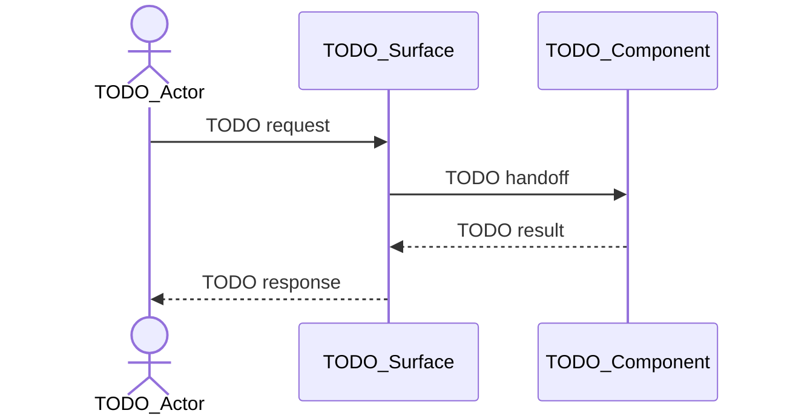

<!--
Copyright (c) 2025 Martin Bechard [martin.bechard@DevConsult.ca]
This software is licensed under the MIT License.
File path: skills/development-methodology/assets/templates/high-level-design-template.md
1-line summary: Template for subsystem and feature-family high-level design documentation.
Witty remark: A subsystem is a small city; name the roads before naming the mailboxes.
-->

# TODO High-Level Design Name

## Current Understanding

TODO: Describe the subsystem, feature family, or system slice this document defines.

TODO: State the user or runtime outcome the subsystem must provide.

TODO: State whether this design describes existing behavior, intended behavior, or a known mix of both.

TODO: State the selected design mode: PLANNED_DEVELOPMENT, EXISTING_IMPLEMENTATION, or MIXED_CHANGE.

## Authoritative Sources

TODO: Link accepted functional specifications, architecture, decisions, backlog requirements, project configuration, module designs, code, tests, procedures, and plan documents permitted by the selected design mode.

TODO: State which source wins when sources disagree.

## Related Code

TODO: Link the source files, folders, tasks, services, UI components, scripts, migrations, generated artifacts, or configuration governed by this subsystem.

TODO: Say Not yet identified when no code exists yet.

## Related Tests

TODO: Link unit tests, integration tests, manual checks, fixtures, generated artifacts, or runtime logs that prove the subsystem behavior.

TODO: Say Not yet identified when tests still need to be written.

## Related Backlog Items

TODO: Link active or historical backlog items that affect this subsystem.

TODO: Say Not yet identified when no related backlog item is known.

## Related Wiki Pages

TODO: Link the parent architecture, constituent module designs, related functional pages, glossary entries, open decisions, known defects, and adjacent subsystem pages.

TODO: Say Not yet identified when no related wiki page is known.

## Open Questions

TODO: Record unresolved subsystem ownership, behavior, data flow, verification, dependency, identity, security, response, selector, validation, state, or source-of-truth questions.

TODO: Classify each question as blocking or non-blocking, name the decision owner, and identify affected components, contracts, state transitions, or verification obligations. Dependent module design and implementation must not proceed across an unresolved high-impact blocking question.

TODO: If there are no unresolved questions, replace this section with a sentence saying no open questions are recorded.

## Maintenance Notes

TODO: Record what future maintainers should recheck when modules, data contracts, tests, configuration, or user-visible behavior change.

TODO: Include the last meaningful source review when known.

## Requirements Coverage

TODO: Account for every applicable requirement from the authoritative functional specifications and parent architecture. Do not hide an omitted requirement in general subsystem prose.

| Requirement source and ID | Required outcome | Satisfying components, interaction, contract, state, or error path | Status | Out-of-scope authority, rationale, and owning artifact | Verification |
| --- | --- | --- | --- | --- | --- |
| TODO | TODO | TODO | DEFINED, OPEN, or OUT_OF_SCOPE | TODO; required for OUT_OF_SCOPE | TODO |

## Parent Architecture

TODO: Link the architecture document that governs this subsystem.

TODO: If no accepted parent architecture exists, record it as a blocking upstream design question rather than inventing architectural constraints.

TODO: State which architectural constraints apply most directly to this subsystem.

TODO: Add an Architecture Constraint Map in this section when one subsystem inherits several parent architecture constraints.

TODO: The Architecture Constraint Map should connect parent architecture rules to the subsystem sections or components they govern.

## Scope

TODO: List the capabilities included in this high-level design.

TODO: List non-goals and boundaries that keep this design from expanding into unrelated work.

TODO: Add a Scope Boundary Diagram in this section when included capabilities, non-goals, external integrations, or adjacent subsystems need to be compared as related boundary sets.

TODO: The Scope Boundary Diagram should show what belongs inside the subsystem, what sits next to it, and what is explicitly outside the design.

## Data Anchors

TODO: List the planned or existing data structures, state variables, configuration fields, logs, files, API routes, or UI surfaces that this subsystem must use.

TODO: State which anchors are authoritative and which are derived outputs.

TODO: Add a Data Anchor Map in this section when multiple records, state values, logs, routes, or UI surfaces anchor the subsystem.

TODO: The Data Anchor Map should distinguish authoritative anchors from derived outputs and should not imply ownership unless the section states it.

## Constituent Components

TODO: List every module, task, service, UI component, script, type group, fixture, or external integration that participates in this subsystem.

TODO: For each item, describe its responsibility and link its module design document when one exists.

TODO: Identify modules that need new module design documents.

TODO: Add a Mermaid component association diagram in this section when multiple modules, tasks, services, UI components, scripts, type groups, fixtures, or integrations collaborate inside the subsystem.

TODO: The component association diagram should show only constituent items from this section unless the surrounding text explicitly names a mixed relationship. Data artifacts, evidence records, tests, and lifecycle states belong in their owning sections.

## Interaction Model

TODO: Describe how the constituent components collaborate from top to bottom.

TODO: Include caller and callee relationships, event flow, state flow, persistence flow, and external service boundaries.

TODO: Add a Mermaid interaction diagram in this section when component collaboration, dependency direction, event flow, state flow, persistence flow, or external handoff order is clearer visually.

TODO: Use a sequence diagram by default for ordered handoffs, request and response order, and responsibility across actors. Use a flowchart only when branches, retries, or state decisions are the main relationship.

TODO: If an SVG artifact is maintained, link it only when a review or publishing surface cannot render Mermaid and record its source relationship in Maintenance Notes.

## Critical Trust And Identity Boundaries

TODO: Complete this section whenever the subsystem contains an authenticated actor, protected operation, trust-boundary crossing, privileged background task, or sensitive-data flow. If none apply, state why no critical trust or identity boundary exists.

| Boundary or operation | Actor and authentication source | Protected asset or side effect | Authorization, ownership, tenancy, and data filtering | Entry point and selector | Disclosure limit | Sensitive-data handling | Failure posture |
| --- | --- | --- | --- | --- | --- | --- | --- |
| TODO | TODO | TODO | TODO | TODO | TODO | TODO | TODO |

TODO: Keep authentication, authorization, roles, ownership, tenancy, and data filtering distinct. A framework convention, route name, or likely generated default is not evidence for any of them.

## Lifecycle

TODO: Describe subsystem startup, normal operation, user-triggered actions, scheduled actions, error handling, persistence, recovery, and shutdown.

TODO: Identify ordering constraints and concurrency constraints.

TODO: Add a Lifecycle Diagram in this section when the subsystem has ordered states, retries, recovery paths, concurrent phases, scheduled phases, or shutdown behavior.

TODO: The Lifecycle Diagram should show states and transitions. Use a state diagram when state names are the main concept, and use a flowchart when ordered phases are the main concept.

## Data Shapes And Contracts

TODO: Describe the payloads, persisted records, state summaries, route bodies, event records, and UI view models shared across components.

TODO: Name the component that owns each shape.

TODO: Link existing types or define the required new types at a design level.

TODO: Add a Data Contract Map in this section when multiple payloads, records, state summaries, route bodies, events, or view models are shared across components.

TODO: The Data Contract Map should show the shape owner, producers, consumers, and any serialization or persistence boundary that matters to the subsystem.

## Cross-Module Contract Reconciliation

TODO: Reconcile every producer-consumer or caller-callee boundary before module implementation begins. Do not select one conflicting contract silently or erase a missing critical fact through generalization.

| Boundary | Producer and consumer | Actor and authentication source | Authorization, role, ownership, tenancy, and data filtering | Selector and mismatch behavior | Payload, response, and disclosure | Validation owner | State owner and transition | Transaction, asynchronous, and error boundary | Status |
| --- | --- | --- | --- | --- | --- | --- | --- | --- | --- |
| TODO | TODO | TODO | TODO | TODO | TODO | TODO | TODO | TODO | AGREED, OPEN, or CONFLICT |

## Configuration

TODO: List subsystem settings, defaults, validation rules, and ownership.

TODO: State how configuration changes move from storage or UI into runtime behavior.

TODO: Add a Configuration Ownership Map in this section when settings, defaults, validation rules, storage, UI controls, or runtime consumers form a meaningful ownership chain.

TODO: The Configuration Ownership Map should show where configuration is defined, validated, stored, and consumed.

## Implementation Order

TODO: List the recommended implementation sequence.

TODO: For each step, name the component or capability being added and the verification that must pass before moving on.

TODO: Add an Implementation Sequence Diagram in this section when implementation steps depend on each other or when verification gates control the next step.

TODO: The Implementation Sequence Diagram should show dependency order and required verification gates. It should not become a task tracker.

## Invariants

TODO: List rules that must remain true across all components in the subsystem.

TODO: Include state ownership, privacy boundaries, failure behavior, user-visible behavior, and persistence guarantees.

## Non-Goals

TODO: List behaviors this subsystem must not implement.

TODO: Link future work documents if a non-goal is expected to become its own design later.

## Definition Of Good

TODO: Describe what complete and correct looks like for this subsystem.

TODO: Include user-visible outcomes, runtime behavior, observability, maintainability, and test coverage.

## Implementation Readiness

TODO: State READY only when every applicable requirement is DEFINED, every required cross-module contract is AGREED, and no high-impact blocking question remains. Otherwise state BLOCKED for the affected downstream work and list the exact decisions or upstream artifacts required before dependent module design or implementation.

## Verification

TODO: List unit tests, integration tests, manual checks, runtime logs, generated artifacts, and review steps needed to prove this subsystem works.

TODO: Link test plans or create TODO entries for missing test plans.

TODO: Add a Verification Coverage Map in this section when several tests, checks, logs, generated artifacts, or review steps prove different components, flows, contracts, or states.

TODO: The Verification Coverage Map should expose coverage and missing coverage. It should not imply every subsystem item is verified unless the tests prove it.
