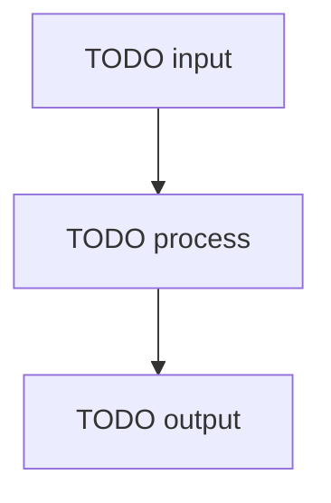

<!--
Copyright (c) 2025 Martin Bechard [martin.bechard@DevConsult.ca]
This software is licensed under the MIT License.
File path: skills/development-methodology/assets/templates/module-design-template.md
1-line summary: Template for one-module design documentation.
Witty remark: A module with a job description is less likely to start moonlighting.
-->

# TODO Module Name Design

## Current Understanding

TODO: Describe what this module does and why the project needs it.

TODO: State the single primary responsibility of the module.

TODO: State whether this module design describes existing behavior, intended behavior, or a known mix of both.

TODO: State the selected design mode: PLANNED_DEVELOPMENT, EXISTING_IMPLEMENTATION, or MIXED_CHANGE.

## Authoritative Sources

TODO: Link the accepted functional specifications, architecture, high-level design, decisions, backlog requirements, project configuration, implementation evidence, tests, procedures, and plan documents permitted by the selected design mode.

TODO: State which source wins when sources disagree.

TODO: Apply that precedence at the same level of specificity. A more specific accepted operation contract governs a general principle for that operation unless the authoritative sources actually conflict.

## Related Code

TODO: Link the primary implementation file, entry point, internal files, generated artifacts, configuration files, scripts, or runtime files owned by this module.

TODO: Say Not yet identified when no code exists yet.

## Related Tests

TODO: Link unit tests, integration tests, regression tests, manual checks, fixtures, snapshots, or generated verification artifacts that prove this module behavior.

TODO: Say Not yet identified when tests still need to be written.

## Related Backlog Items

TODO: Link active or historical backlog items that affect this module.

TODO: Say Not yet identified when no related backlog item is known.

## Related Wiki Pages

TODO: Link the parent architecture, parent high-level design, dependency module designs, caller module designs, related functional pages, glossary entries, open decisions, and known defects.

TODO: Say Not yet identified when no related wiki page is known.

## Open Questions

TODO: Record unresolved module ownership, caller, dependency, behavior, verification, state, identity, security, response, selector, validation, or source-of-truth questions.

TODO: Classify each question as blocking or non-blocking, name the decision owner, and identify the affected contract, state transition, or verification obligation. Implementation must not proceed across an unresolved high-impact blocking question.

TODO: If there are no unresolved questions, replace this section with a sentence saying no open questions are recorded.

## Maintenance Notes

TODO: Record what future maintainers should recheck when exports, imports, callers, configuration, tests, or side effects change.

TODO: Include the last meaningful source review when known.

## Requirements Coverage

TODO: Account for every applicable requirement from the authoritative functional specifications and parent designs. Do not hide an omitted requirement in general prose.

TODO: Preserve accepted current behavior and current limitations even when a safer target is proposed. Do not collapse the baseline and target into one normalized contract.

| Requirement source and ID | Claim mode | Required outcome | Satisfying contract, rule, state, or error path | Status | Out-of-scope authority, rationale, and owning artifact | Verification |
| --- | --- | --- | --- | --- | --- | --- |
| TODO | CURRENT_BEHAVIOR, CURRENT_LIMITATION, INTENDED_BEHAVIOR, PROPOSED_CHANGE, or OPEN_QUESTION | TODO | TODO | DEFINED, OPEN, or OUT_OF_SCOPE | TODO; required for OUT_OF_SCOPE | TODO |

## Runtime Path

TODO: Provide the intended or existing source path for the primary implementation file.

TODO: If the module is a folder, name the entry point and the internal files that own meaningful responsibilities.

## Parent Context

TODO: Link the parent architecture or high-level design document.

TODO: State how this module contributes to that parent design.

TODO: Add a compact module context diagram when direct callers, dependencies, external interfaces, or ownership boundaries are difficult to understand from prose. Omit it when the topology is simple.

## Responsibilities

TODO: List the responsibilities this module owns.

TODO: Keep each responsibility narrow enough that a test can verify it.

TODO: Do not list responsibilities owned by callers, dependencies, or sibling modules.

## Callers

TODO: List modules, services, UI components, tasks, scripts, routes, or tests that call this module.

TODO: For each caller, explain why it calls this module and link the caller design when available.

## Dependencies

TODO: List every planned or existing project module, interface, type, constant group, external library, browser API, runtime file, or service this module depends on.

TODO: For each dependency, explain why the module needs it and link the dependency design when available.

TODO: Verify dependency paths against existing source files or an accepted planned type or interface registry. Do not invent paths.

## Public Contracts

TODO: List public classes, functions, methods, routes, events, commands, state variables, configuration fields, or payloads exposed by this module.

TODO: For each contract, describe actor, trigger, inputs, identity selector, validation owner, outputs, response or disclosure shape, side effects, state owner, transaction or asynchronous boundary, synchronous and asynchronous failure behavior, and ownership.

TODO: When path, body, token, session, message, or persistence identifiers can name the same subject or record, state precedence and mismatch behavior explicitly.

TODO: When the current contract and intended target differ, state both. Apply an explicit operation-specific response, selector, validation, or failure exception before any broader invariant or safety principle.

TODO: Before filling this section, build an operation-contract ledger from the authoritative inputs. Copy the exact accepted selector and response wording for every operation, including current limitations and exceptions. Do not turn a generic term such as body identity into body login or body ID; keep the original specificity and mark the missing field OPEN.

TODO: Do not replace an operation-specific current response or disclosure contract with a generally safer projection. Preserve that baseline as CURRENT_BEHAVIOR or CURRENT_LIMITATION and state the safer intended target separately.

## Trust And Identity Boundaries

TODO: Complete this section whenever the module exposes a route, event, command, job, UI guard, protected operation, or sensitive-data flow. If none apply, state why no trust or identity boundary exists.

| Operation or data flow | Actor and authentication source | Authorization, ownership, tenancy, and data filtering | Selector and mismatch behavior | Validation owner | Success response and disclosure | State owner and transition | Failure timing and side effects | Sensitive data and logging |
| --- | --- | --- | --- | --- | --- | --- | --- | --- |
| TODO | TODO | TODO | TODO | TODO | TODO | TODO | TODO | TODO |

TODO: Keep authentication, authorization, roles, ownership, tenancy, and data filtering distinct. A framework convention, route name, or likely generated default is not evidence for any of them.

## Internal Data And State

TODO: Describe internal state, cached values, derived values, persisted values, and temporary values.

TODO: State which values are authoritative and which are derived.

TODO: State how stale or invalid values are detected.

## Processing Rules

TODO: Describe the main processing flow in business terms.

TODO: Break complex logic into named steps.

TODO: Include conditions, loops, retries, early exits, and error paths.

## Processing Diagram

TODO: Add a Mermaid diagram when conditional flow, retries, error handling, or state transitions are clearer visually.

TODO: If no diagram is needed, replace this section with a sentence saying no processing diagram is required.

TODO: If an SVG artifact is maintained, link it only when a review or publishing surface cannot render Mermaid and record its source relationship in Maintenance Notes.

## Invariants

TODO: List rules that must always remain true before, during, and after module execution.

TODO: Include ordering, retention, filtering, validation, privacy, and state consistency rules.

## Configuration

TODO: List configuration fields this module reads or writes.

TODO: State defaults, validation rules, reload behavior, and ownership.

TODO: Remove this section if the module has no configuration.

## External Interfaces

TODO: Describe external APIs, browser APIs, files, command line tools, logs, local servers, or network surfaces used by this module.

TODO: State request and response shapes when the module directly owns them.

TODO: Remove this section if the module has no external interface.

## UI And Notification Behavior

TODO: Describe user-visible output, status updates, chart output, notification behavior, and rendering rules owned by this module.

TODO: Remove this section if the module has no UI or notification behavior.

## Error Handling

TODO: Describe expected errors, unexpected errors, failure-closed behavior, retries, rollback, logging, and user notification ownership.

TODO: State which errors are returned, thrown, swallowed, or escalated; whether each occurs before the response, after the response, or asynchronously; and which side effects have already committed.

## Implementation Readiness

TODO: State READY only when every applicable requirement and required contract is DEFINED and no high-impact blocking question remains. Otherwise state BLOCKED for the affected downstream work and list the exact decisions or upstream artifacts required before implementation.

## Verification

TODO: List unit tests, integration tests, regression tests, manual checks, and build checks that prove this module works.

TODO: Include edge cases, invalid inputs, dependency failures, persistence behavior, and user-visible behavior when applicable.

TODO: Name important test seams, fixtures, boundary doubles, and the contracts they preserve when those details affect implementation or review.
