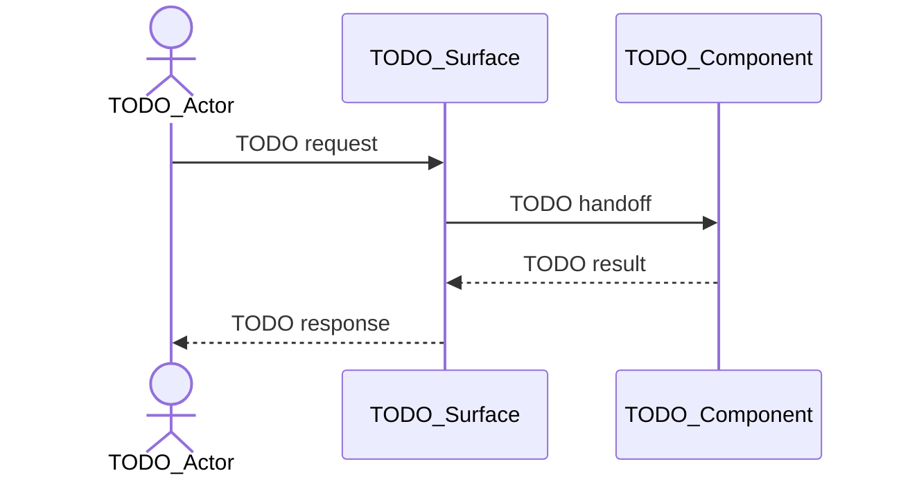

<!--
{{COPYRIGHT}}
Artifact-ID: {{ARTIFACT_ID}}
Created-Local: {{CREATED_LOCAL}}
Creating-Agent: {{CREATING_AGENT}}
Runtime: {{RUNTIME}}
Dispatched-Model: {{DISPATCHED_MODEL}}
Reasoning-Effort: {{REASONING_EFFORT}}
-->

# TODO High-Level Design Name

## Current Understanding

> This gives architecture, module-design, and implementation readers a shared subsystem baseline before they interpret detailed contracts. Architects, module designers, implementers, and reviewers use it during planning, onboarding, and review to state the subsystem outcome, current or intended behavior, and selected design mode.

TODO: Describe the subsystem, feature family, or system slice this document defines.

TODO: State the user or runtime outcome the subsystem must provide.

TODO: State whether this design describes existing behavior, intended behavior, or a known mix of both.

TODO: State the selected design mode: PLANNED_DEVELOPMENT, EXISTING_IMPLEMENTATION, or MIXED_CHANGE.

## Authoritative Sources

> This lets reviewers distinguish required subsystem behavior from inference and resolve conflicting inputs consistently. Architects, module designers, implementers, and reviewers use it when creating or maintaining the design to identify the accepted specifications, architecture, decisions, modules, code, tests, and procedures permitted by the selected mode.

TODO: Link accepted functional specifications, architecture, decisions, backlog requirements, project configuration, module designs, code, tests, procedures, and plan documents permitted by the selected design mode.

TODO: State which source wins when sources disagree.

## Related Code

> This gives designers and implementers a direct path from subsystem decisions to the artifacts they govern. Architects, module designers, implementers, and reviewers use it during module assignment, implementation, change review, and reverse engineering to locate exact source, configuration, migration, generated, and runtime surfaces.

TODO: Link the source files, folders, tasks, services, UI components, scripts, migrations, generated artifacts, or configuration governed by this subsystem.

TODO: Say Not yet identified when no code exists yet.

## Related Tests

> This shows which subsystem claims are exercised and where confidence still depends on missing or manual evidence. Architects, module designers, implementers, and reviewers use it during review, integration planning, and regression analysis to find tests, fixtures, logs, and other verification artifacts.

TODO: Link unit tests, integration tests, manual checks, fixtures, generated artifacts, or runtime logs that prove the subsystem behavior.

TODO: Say Not yet identified when tests still need to be written.

## Related Backlog Items

> This preserves the work history and planned changes that explain the subsystem's present boundaries and future direction. Architects, module designers, implementers, and reviewers use it during planning, triage, and maintenance to connect decisions and defects to their owning backlog records.

TODO: Link active or historical backlog items that affect this subsystem.

TODO: Say Not yet identified when no related backlog item is known.

## Related Wiki Pages

> This helps readers reach parent context and constituent detail without duplicating it in the HLD. Architects, module designers, implementers, and reviewers use it during navigation and impact analysis to find architecture, module designs, functional behavior, decisions, defects, and shared terminology.

TODO: Link the parent architecture, constituent module designs, related functional pages, glossary entries, open decisions, known defects, and adjacent subsystem pages.

TODO: Say Not yet identified when no related wiki page is known.

## Open Questions

> This prevents unresolved cross-module or authority conflicts from becoming incompatible module-level assumptions. Architects, module designers, implementers, and reviewers use it before design handoff and implementation planning to record each question's impact, blocking status, decision owner, affected contracts, and required evidence.

TODO: Record unresolved subsystem ownership, behavior, data flow, verification, dependency, identity, security, response, selector, validation, state, or source-of-truth questions.

TODO: Classify each question as blocking or non-blocking, name the decision owner, and identify affected components, contracts, state transitions, or verification obligations. Dependent module design and implementation must not proceed across an unresolved high-impact blocking question.

TODO: If there are no unresolved questions, replace this section with a sentence saying no open questions are recorded.

## Maintenance Notes

> This helps future maintainers identify when subsystem documentation may be stale and what relationships must be revalidated. Architects, module designers, implementers, and reviewers use it after changes to modules, contracts, configuration, tests, or user-visible behavior to record review triggers and the last meaningful source review.

TODO: Record what future maintainers should recheck when modules, data contracts, tests, configuration, or user-visible behavior change.

TODO: Include the last meaningful source review when known.

## Requirements Coverage

> This prevents source requirements and exact operations from disappearing into general subsystem prose. Architects, module designers, implementers, and reviewers use it during design review, module decomposition, and change assessment to map every requirement to its claim mode, satisfying design, status, ownership, and verification.

TODO: Account for every applicable requirement from the authoritative functional specifications and parent architecture. Do not hide an omitted requirement in general subsystem prose.

TODO: Preserve accepted current behavior and current limitations even when a safer target is proposed. Do not collapse the baseline and target into one normalized contract.

TODO: Give every exact route variant or supporting UI action named by an authoritative input its own traceable row, even when several rows reuse the same component or contract. Grouped CRUD or navigation prose may summarize those rows but must not replace them.

| Requirement source and ID | Claim mode | Required outcome | Satisfying components, interaction, contract, state, or error path | Status | Out-of-scope authority, rationale, and owning artifact | Verification |
| --- | --- | --- | --- | --- | --- | --- |
| TODO | CURRENT_BEHAVIOR, CURRENT_LIMITATION, INTENDED_BEHAVIOR, PROPOSED_CHANGE, or OPEN_QUESTION | TODO | TODO | DEFINED, OPEN, or OUT_OF_SCOPE | TODO; required for OUT_OF_SCOPE | TODO |

## Parent Architecture

> This keeps subsystem decisions aligned with the system-wide constraints that give them context and authority. Architects, module designers, implementers, and reviewers use it during HLD creation and review to identify the governing architecture, inherited rules, expected later parent during reverse engineering, and any resulting readiness effect.

TODO: Link the architecture document that governs this subsystem.

TODO: In PLANNED_DEVELOPMENT, when an accepted parent architecture is required but absent, record a blocking upstream design question rather than inventing architectural constraints. In EXISTING_IMPLEMENTATION bottom-up reverse engineering, state that the intentionally later parent architecture is Not yet identified; do not treat that expected absence as a review finding, and record any effect on implementation readiness separately.

TODO: State which architectural constraints apply most directly to this subsystem.

TODO: Add an Architecture Constraint Map in this section when one subsystem inherits several parent architecture constraints.

TODO: The Architecture Constraint Map should connect parent architecture rules to the subsystem sections or components they govern.

## Scope

> This prevents overlapping subsystem ownership and uncontrolled expansion into unrelated capabilities. Architects, module designers, implementers, and reviewers use it during design decomposition and review to define included behavior, adjacent systems, integrations, non-goals, and the boundary other artifacts must own.

TODO: List the capabilities included in this high-level design.

TODO: List non-goals and boundaries that keep this design from expanding into unrelated work.

TODO: Add a Scope Boundary Diagram in this section when included capabilities, non-goals, external integrations, or adjacent subsystems need to be compared as related boundary sets.

TODO: The Scope Boundary Diagram should show what belongs inside the subsystem, what sits next to it, and what is explicitly outside the design.

## Data Anchors

> This gives downstream module designers stable reference points for identities, contracts, records, state, configuration, and UI surfaces that must not be redefined independently. Architects, module designers, implementers, and reviewers use it during component and contract design to record each anchor's authority, owner, representation, lifetime, and downstream constraint.

TODO: Data anchors establish the shared reference points that the next design layer must elaborate without redefining. Include only routes, selectors, configuration contracts, exchanged data contracts, persisted records, files, logs, UI surfaces, transient state, or derived state whose identity, authority, ownership, or downstream treatment must remain consistent across later designs.

TODO: For every anchor, state its concrete identity, anchor type, authority, owner and representation, and constraint for the next design layer. In the Authority cell, cite the exact accepted artifact plus requirement ID or section; when the anchor is a justified HLD proposition, identify it as such and state its basis and decision owner. Do not use an abstract category such as API base URL when an exact configuration contract exists. Keep access mechanisms such as environment lookup expressions under Owner and representation; they are not authorities. For API, event, record, transient-state, and derived-state anchors, name or link the exact fields or state boundary that must remain stable and identify the downstream consumers that must reuse it.

| Anchor | Anchor type | Authority | Owner and representation | Constraint for the next design layer |
| --- | --- | --- | --- | --- |
| Feature route /features/:featureId | Navigation and selector anchor | FS-### FEATURE-READ route contract | Router declares :featureId; feature page consumes the selected value | Preserve the route and selector name; downstream page and command designs reuse the same selected value. |
| FEATURE_API_BASE_URL | Configuration anchor | ARCH-### Configuration section, rule AP-## | Runtime environment supplies the value; configuration adapter owns access and validation | Integration-module designs use the configuration adapter; other modules neither read the environment nor construct service origins. |
| FeatureDetail response | API contract anchor | FS-### FEATURE-READ response contract | Contract module owns the type and decoder; Data Shapes defines its exact fields and ordering; feature-page and HTTP-adapter designs consume it | Preserve the linked Data Shapes boundary; consumers must not invent alternative fields, ordering, or response shapes. |

TODO: Adapt the anchor types to the subsystem. Common types include navigation and selector, configuration, API or event contract, persisted-record, file or log, UI-surface, transient-state, and derived-state anchors. Split anchors that have different owners or downstream constraints; do not combine several response or state contracts merely because they are related.

TODO: State which anchors are authoritative and which are derived outputs. For derived anchors, define the authoritative inputs plus the replace, append, clear, or recompute rules that later designs must preserve. For transient-state anchors, define lifetime, reset, failure-preservation, and persistence restrictions when applicable.

TODO: Add a Data Anchor Map in this section when multiple records, state values, logs, routes, or UI surfaces anchor the subsystem.

TODO: The Data Anchor Map should distinguish authoritative anchors from derived outputs and should not imply ownership unless the section states it.

## Constituent Components

> This establishes a shared component vocabulary and ownership map so separate module designers do not invent competing boundaries or paths. Architects, module designers, implementers, and reviewers use it during work assignment, dependency analysis, and review to enumerate every participating component, responsibility, design link, and exact artifact placement.

TODO: List every module, task, service, UI component, script, type group, fixture, or external integration that participates in this subsystem.

TODO: For each item, describe its responsibility and link its module design document when one exists.

TODO: Identify modules that need new module design documents.

TODO: Show constituent source, test, configuration, resource, migration, fixture, and generated-artifact placement as a fenced text tree whenever three or more paths share a prefix or span two or more folders. The tree owns full path spelling; do not repeat the same prefixes in a component list or placement table.

TODO: Path tree example (replace every synthetic segment, package, and file with the complete planned or existing layout):

```text
backend/
└── src/
    ├── main/
    │   ├── java/com/example/feature/
    │   │   ├── api/FeatureController.java
    │   │   ├── application/FeatureService.java
    │   │   └── persistence/FeatureRepositoryAdapter.java
    │   └── resources/db/changelog/feature/
    └── test/java/com/example/feature/
        ├── application/FeatureServiceTest.java
        └── persistence/FeatureRepositoryAdapterTest.java
```

TODO: Put responsibilities, symbols, or verification metadata beside short tree labels when needed; do not restate full paths in every row.

TODO: When a single subsystem tree would become a large blob, split it into named subsections by component or ownership area. Put one small fenced text tree in each subsection and its package or ownership metadata immediately after the tree. Do not put multiline trees in Markdown table cells or simulate them with HTML breaks; never create one row per full path.

TODO: Add a Mermaid component association diagram in this section when multiple modules, tasks, services, UI components, scripts, type groups, fixtures, or integrations collaborate inside the subsystem.

TODO: The component association diagram should show only constituent items from this section unless the surrounding text explicitly names a mixed relationship. Data artifacts, evidence records, tests, and lifecycle states belong in their owning sections.

## Interaction Model

> This makes collaboration, ordering, state movement, persistence, and external handoffs reviewable across component boundaries. Architects, module designers, implementers, and reviewers use it during contract design, integration planning, and failure analysis to describe callers, callees, exchanges, branches, and the diagrams required to expose them.

TODO: Describe how the constituent components collaborate from top to bottom.

TODO: Include caller and callee relationships, event flow, state flow, persistence flow, and external service boundaries.

TODO: Add a Mermaid interaction diagram whenever this section describes ordered component collaboration, dependency handoffs, event flow, state flow, persistence flow, or external handoffs. Do not leave the complete interaction sequence only in prose, a numbered list, or a table. For non-sequential collaboration, add a structural diagram when one node connects to two or more others, a dependency path spans three or more nodes, a cycle exists, containment spans two or more levels, or an edge crosses a subsystem, trust, or runtime boundary.

TODO: Use a sequence diagram by default for ordered handoffs, request and response order, and responsibility across actors. Use a flowchart only when branches, retries, or state decisions are the main relationship.



TODO: If an SVG artifact is maintained, link it only when a review or publishing surface cannot render Mermaid and record its source relationship in Maintenance Notes.

## Critical Trust And Identity Boundaries

> This prevents authentication, authorization, disclosure, selector, and sensitive-data rules from being assumed or collapsed across protected operations. Architects, module designers, implementers, and reviewers use it during security review and module design to map each actor and operation to its protected asset, authority checks, data limits, and failure posture.

TODO: Complete this section whenever the subsystem contains an authenticated actor, protected operation, trust-boundary crossing, privileged background task, or sensitive-data flow. If none apply, state why no critical trust or identity boundary exists.

TODO: For each protected operation family, independently inventory every applicable anonymous, authenticated, administrator, service, or background actor. Record denial and equivalent-role behavior explicitly instead of subsuming those actors into a broader row.

| Boundary or operation | Actor and authentication source | Protected asset or side effect | Authorization, ownership, tenancy, and data filtering | Entry point and selector | Disclosure limit | Sensitive-data handling | Failure posture |
| --- | --- | --- | --- | --- | --- | --- | --- |
| TODO | TODO | TODO | TODO | TODO | TODO | TODO | TODO |

TODO: Keep authentication, authorization, roles, ownership, tenancy, and data filtering distinct. A framework convention, route name, or likely generated default is not evidence for any of them.

## Lifecycle

> This exposes runtime ordering and recovery constraints that can otherwise create startup, concurrency, and shutdown defects. Architects, module designers, implementers, and reviewers use it during operational design, integration review, and incident analysis to describe states, transitions, actors, persistence, error handling, recovery, and required diagrams.

TODO: Describe subsystem startup, normal operation, user-triggered actions, scheduled actions, error handling, persistence, recovery, and shutdown.

TODO: Identify ordering constraints and concurrency constraints.

TODO: Add a Mermaid Lifecycle Diagram whenever this section describes an ordered sequence of startup, operation, user action, scheduled action, failure, retry, recovery, persistence, or shutdown steps. Do not leave the complete sequence only in prose or a table.

TODO: The Lifecycle Diagram should show states and transitions. Use a state diagram when state names are the main concept, a sequence diagram when actors or components exchange ordered actions, and a flowchart when ordered phases, branches, decisions, or recovery paths are the main concept. Keep prose for constraints, ownership, concurrency, and exceptions.

## Data Shapes And Contracts

> This prevents producers and consumers from inventing incompatible payloads, records, messages, and view models. Architects, module designers, implementers, and reviewers use it during API, persistence, event, and UI design to define each shared shape, its owner, exact type or fields, serialization boundary, and consumers.

TODO: Describe the payloads, persisted records, state summaries, route bodies, event records, and UI view models shared across components.

TODO: Name the component that owns each shape.

TODO: Link existing types or define the required new types at a design level.

TODO: Add a Data Contract Map in this section when multiple payloads, records, state summaries, route bodies, events, or view models are shared across components.

TODO: The Data Contract Map should show the shape owner, producers, consumers, and any serialization or persistence boundary that matters to the subsystem.

## Cross-Module Contract Reconciliation

> This catches incompatible boundary assumptions before separate modules are implemented and makes unresolved high-impact contracts visible. Architects, module designers, implementers, and reviewers use it during HLD review and module handoff to reconcile actor, selector, payload, validation, state, transaction, asynchronous, disclosure, and failure behavior for every edge.

TODO: Reconcile every producer-consumer or caller-callee boundary before module implementation begins. Do not select one conflicting contract silently or erase a missing critical fact through generalization.

TODO: When the current contract and intended target differ, state both. Apply an explicit operation-specific response, selector, validation, state, or failure exception before any broader invariant or safety principle.

| Boundary | Producer and consumer | Actor and authentication source | Authorization, role, ownership, tenancy, and data filtering | Selector and mismatch behavior | Payload, response, and disclosure | Validation owner | State owner and transition | Transaction, asynchronous, and error boundary | Status |
| --- | --- | --- | --- | --- | --- | --- | --- | --- | --- |
| TODO | TODO | TODO | TODO | TODO | TODO | TODO | TODO | TODO | AGREED, OPEN, or CONFLICT |

## Configuration

> This prevents settings from having unclear definition, validation, storage, or runtime ownership across components. Architects, module designers, implementers, and reviewers use it during implementation planning, operations, and review to list configuration contracts, defaults, change propagation, owners, and consumers.

TODO: List subsystem settings, defaults, validation rules, and ownership.

TODO: State how configuration changes move from storage or UI into runtime behavior.

TODO: Add a Configuration Ownership Map in this section when settings, defaults, validation rules, storage, UI controls, or runtime consumers form a meaningful ownership chain.

TODO: The Configuration Ownership Map should show where configuration is defined, validated, stored, and consumed.

## Implementation Order

> This turns subsystem dependencies into a safe delivery sequence and prevents work from starting before its prerequisites or verification gates exist. Architects, module designers, implementers, and reviewers use it during backlog decomposition and execution planning to order components, capabilities, and the checks required between steps.

TODO: List the recommended implementation sequence.

TODO: For each step, name the component or capability being added and the verification that must pass before moving on.

TODO: Add a Mermaid Implementation Sequence Diagram whenever this section describes ordered or dependent implementation actions or verification gates. Do not leave the complete sequence only in a numbered list, prose, or a table.

TODO: The Implementation Sequence Diagram should show dependency order and required verification gates. It should not become a task tracker.

## Invariants

> This identifies properties that every constituent component must preserve even when internal implementations evolve. Architects, module designers, implementers, and reviewers use it during module design, testing, and change review to state non-negotiable ownership, privacy, state, persistence, failure, and user-visible rules.

TODO: List rules that must remain true across all components in the subsystem.

TODO: Include state ownership, privacy boundaries, failure behavior, user-visible behavior, and persistence guarantees.

## Non-Goals

> This protects the subsystem boundary by making deliberately excluded behavior visible instead of leaving it as an accidental omission. Architects, module designers, implementers, and reviewers use it during planning and review to identify work owned elsewhere or deferred to a future design.

TODO: List behaviors this subsystem must not implement.

TODO: Link future work documents if a non-goal is expected to become its own design later.

## Definition Of Good

> This gives stakeholders a shared picture of what successful subsystem completion means beyond merely finishing code. Architects, module designers, implementers, and reviewers use it during planning, review, and release assessment to define required user outcomes, runtime behavior, observability, maintainability, and test coverage.

TODO: Describe what complete and correct looks like for this subsystem.

TODO: Include user-visible outcomes, runtime behavior, observability, maintainability, and test coverage.

## Documentation Acceptance

> This distinguishes an accurate subsystem design for the current reverse-engineering pass from permission to begin dependent module design or implementation. Architects, module designers, implementers, and reviewers use it during review and handoff to record whether source evidence, accepted module prerequisites, and current-pass requirements are reconciled without concealing defects, open decisions, or limitations.

TODO: After any leading retained explanatory note or notes, begin the first authored decision with **ACCEPTED.** or **BLOCKED.** State ACCEPTED when the artifact accurately synthesizes source evidence, accepted module prerequisites, and current-pass requirements. During bottom-up reverse engineering, do not fail documentation acceptance solely because later architecture, functional specifications, or wiki pages are intentionally absent, or because an accurately recorded defect, open decision, or limitation blocks implementation.

TODO: When BLOCKED, name the missing accepted prerequisite, insufficient evidence, unresolved current-pass review finding, or unavailable mandatory dependency.

## Implementation Readiness

> This prevents a reviewed HLD from being mistaken for permission to begin unsafe module design or implementation. Architects, module designers, implementers, and reviewers use it during handoff and planning to record READY or BLOCKED and identify unresolved requirements, cross-module contracts, decisions, or evidence that must be closed.

TODO: After any leading retained explanatory note or notes, begin the first authored decision with **READY.** or **BLOCKED.** State READY only when every applicable requirement is DEFINED, every required cross-module contract is AGREED, and no high-impact blocking question remains. Otherwise state BLOCKED for the affected downstream work and list the exact decisions or upstream artifacts required before dependent module design or implementation. A BLOCKED result does not make an accurately documented limitation an automatic review failure.

## Verification

> This makes subsystem behavior and contracts provable across components and exposes areas with no supporting evidence. Architects, module designers, implementers, and reviewers use it during implementation, integration, review, and release assessment to map tests, commands, logs, generated artifacts, and manual checks to the flows and states they verify.

TODO: List unit tests, integration tests, manual checks, runtime logs, generated artifacts, and review steps needed to prove this subsystem works.

TODO: Link test plans or create TODO entries for missing test plans.

TODO: Add a Verification Coverage Map in this section when several tests, checks, logs, generated artifacts, or review steps prove different components, flows, contracts, or states.

TODO: The Verification Coverage Map should expose coverage and missing coverage. It should not imply every subsystem item is verified unless the tests prove it.
